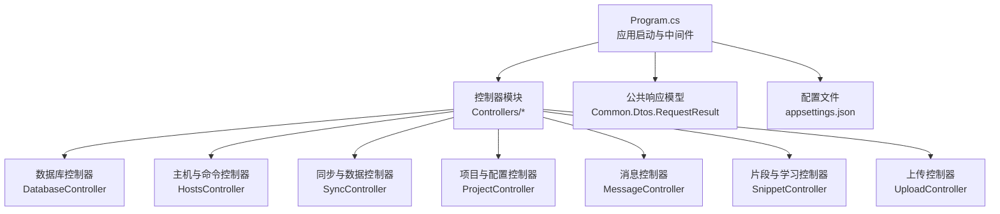
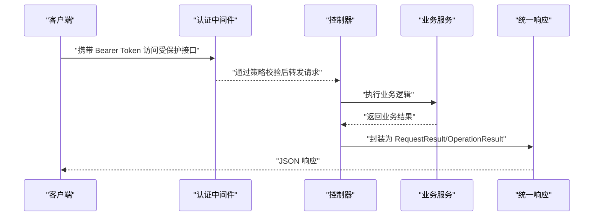

# API 接口文档

<cite>
**本文引用的文件**
- [Program.cs](file://Sylas.RemoteTasks.App/Program.cs)
- [appsettings.json](file://Sylas.RemoteTasks.App/appsettings.json)
- [CustomBaseController.cs](file://Sylas.RemoteTasks.App/Controllers/CustomBaseController.cs)
- [DatabaseController.cs](file://Sylas.RemoteTasks.App/Controllers/DatabaseController.cs)
- [HostsController.cs](file://Sylas.RemoteTasks.App/Controllers/HostsController.cs)
- [OAuthController.cs](file://Sylas.RemoteTasks.App/Controllers/OAuthController.cs)
- [ProjectController.cs](file://Sylas.RemoteTasks.App/Controllers/ProjectController.cs)
- [MessageController.cs](file://Sylas.RemoteTasks.App/Controllers/MessageController.cs)
- [SnippetController.cs](file://Sylas.RemoteTasks.App/Controllers/SnippetController.cs)
- [StudyController.cs](file://Sylas.RemoteTasks.App/Controllers/StudyController.cs)
- [SyncController.cs](file://Sylas.RemoteTasks.App/Controllers/SyncController.cs)
- [UploadController.cs](file://Sylas.RemoteTasks.App/Controllers/UploadController.cs)
- [RequestResult.cs](file://Sylas.RemoteTasks.Common/Dtos/RequestResult.cs)
</cite>

## 目录
1. [简介](#简介)
2. [项目结构](#项目结构)
3. [核心组件](#核心组件)
4. [架构总览](#架构总览)
5. [详细组件分析](#详细组件分析)
6. [依赖分析](#依赖分析)
7. [性能考虑](#性能考虑)
8. [故障排查指南](#故障排查指南)
9. [结论](#结论)
10. [附录](#附录)

## 简介
本文件为 Sylas.RemoteTasks 的 RESTful API 文档，覆盖以下方面：
- 认证与授权：基于 OIDC 的 Bearer Token，管理员策略校验
- 接口规范：HTTP 方法、URL 模式、请求/响应结构
- 公共接口与数据模型：统一响应包装 RequestResult
- 安全与合规：敏感信息加密、白名单关键字、最小权限原则
- 版本与演进：当前 API 采用路由约定与控制器命名，未见显式版本号
- 常见用例与客户端实现建议：批量上传、数据库连接管理、远程主机命令执行、数据同步与备份恢复
- 调试与监控：SSE 流式输出、日志配置、错误处理策略

## 项目结构
- 应用入口与中间件管线在 Program.cs 中配置，启用认证、授权、异常处理、SignalR 等
- 控制器按功能模块划分：数据库、主机与命令、同步与数据处理、项目与配置、消息、片段与学习、上传等
- 统一响应模型 RequestResult<T> 位于 Common 层，便于前后端契约一致

图表来源
- [Program.cs](file://Sylas.RemoteTasks.App/Program.cs#L1-L122)
- [DatabaseController.cs](file://Sylas.RemoteTasks.App/Controllers/DatabaseController.cs#L1-L235)
- [HostsController.cs](file://Sylas.RemoteTasks.App/Controllers/HostsController.cs#L1-L468)
- [SyncController.cs](file://Sylas.RemoteTasks.App/Controllers/SyncController.cs#L1-L457)
- [ProjectController.cs](file://Sylas.RemoteTasks.App/Controllers/ProjectController.cs#L1-L142)
- [MessageController.cs](file://Sylas.RemoteTasks.App/Controllers/MessageController.cs#L1-L18)
- [SnippetController.cs](file://Sylas.RemoteTasks.App/Controllers/SnippetController.cs#L1-L71)
- [UploadController.cs](file://Sylas.RemoteTasks.App/Controllers/UploadController.cs#L1-L83)
- [RequestResult.cs](file://Sylas.RemoteTasks.Common/Dtos/RequestResult.cs#L1-L65)

章节来源
- [Program.cs](file://Sylas.RemoteTasks.App/Program.cs#L1-L122)
- [appsettings.json](file://Sylas.RemoteTasks.App/appsettings.json#L1-L142)

## 核心组件
- 统一响应模型 RequestResult<T>
  - 字段：Code、ErrMsg、Data
  - 工具方法：Success(T)、Error(string)
- 基类控制器 CustomBaseController
  - 身份认证策略：[Authorize(Policy = AdministrationPolicy)]
  - 文件上传/删除/合并辅助方法
- 认证与授权
  - OIDC 授权服务器配置
  - 管理员策略：角色 + Scope 校验
  - OAuth 用户信息接口（Bearer Token）

章节来源
- [RequestResult.cs](file://Sylas.RemoteTasks.Common/Dtos/RequestResult.cs#L1-L65)
- [CustomBaseController.cs](file://Sylas.RemoteTasks.App/Controllers/CustomBaseController.cs#L1-L145)
- [Program.cs](file://Sylas.RemoteTasks.App/Program.cs#L74-L87)
- [OAuthController.cs](file://Sylas.RemoteTasks.App/Controllers/OAuthController.cs#L1-L49)

## 架构总览
- 身份认证：OIDC（IdentityServer），支持密码模式与第三方登录测试页
- 授权策略：管理员策略（角色 + Scope）
- 控制器路由：约定式路由，如 api/{controller}/{action}
- SSE 支持：主机命令执行返回 Server-Sent Events
- 异常处理：全局异常处理器返回统一 OperationResult

图表来源
- [Program.cs](file://Sylas.RemoteTasks.App/Program.cs#L74-L87)
- [RequestResult.cs](file://Sylas.RemoteTasks.Common/Dtos/RequestResult.cs#L1-L65)

## 详细组件分析

### 数据库管理 API
- 路由前缀：api/Database
- 认证：受管理员策略保护
- 主要接口
  - GET api/Database/Index
  - POST api/Database/ConnectionStringsAsync（分页查询连接串）
  - POST api/Database/AddConnectionStringAsync（新增并加密）
  - POST api/Database/UpdateConnectionStringAsync（更新并条件加密）
  - POST api/Database/CloneConnectionStringAsync（克隆）
  - POST api/Database/DeleteConnectionStringsAsync（批量删除）
  - POST api/Database/BackupAsync（备份并记录）
  - GET api/Database/Backups（历史备份记录分页）
  - POST api/Database/RestoreAsync（还原，受 AllowedConnectionStringKeywords 白名单限制）

请求/响应要点
- 请求体：JSON；分页查询使用 DataSearch
- 响应体：RequestResult<T> 或 OperationResult
- 敏感字段：连接串经 AES 加密存储；还原前校验关键字白名单

章节来源
- [DatabaseController.cs](file://Sylas.RemoteTasks.App/Controllers/DatabaseController.cs#L1-L235)
- [appsettings.json](file://Sylas.RemoteTasks.App/appsettings.json#L20-L23)
- [RequestResult.cs](file://Sylas.RemoteTasks.Common/Dtos/RequestResult.cs#L1-L65)

### 主机与命令执行 API
- 路由前缀：api/Hosts
- 认证：受管理员策略保护
- 主要接口
  - POST api/Hosts/AnythingSettingsAsync（分页查询命令配置）
  - GET api/Hosts/AnythingSettingAndInfoAsync（查询配置与解析后的命令信息）
  - GET api/Hosts/AnythingInfosAsync（命令执行器列表页面）
  - GET api/Hosts/Executors（分页查询执行器）
  - POST api/Hosts/ExecuteCommandAsync（SSE 流式执行命令）
  - POST api/Hosts/ExecuteCommandsAsync（SSE 流式批量执行）
  - POST api/Hosts/AddAnythingSettingAsync
  - POST api/Hosts/GetAnythingSettingsAsync
  - POST api/Hosts/UpdateAnythingSettingAsync
  - POST api/Hosts/UpdateCommandAsync
  - POST api/Hosts/DeleteAnythingSettingByIdAsync
  - POST api/Hosts/DeleteAnythingCommandByIdAsync
  - POST api/Hosts/AddCommandAsync
  - POST api/Hosts/ResolveCommandSetttingAsync
  - GET api/Hosts/GetServerInfo
  - GET api/Hosts/ServerAndAppStatus
  - GET api/Hosts/TmplTest
  - POST api/Hosts/ResolveTmpl
  - GET api/Hosts/Flows
  - GET api/Hosts/AnythingFlows
  - POST api/Hosts/AddAnythingToFlow
  - POST api/Hosts/RemoveAnythingFromFlow
  - POST api/Hosts/ReorderFlowAnything
  - POST api/Hosts/QueryAnythingFlowsAsync
  - POST api/Hosts/AddAnythingFlowAsync
  - POST api/Hosts/UpdateAnythingFlowAsync
  - POST api/Hosts/DeleteAnythingFlowAsync
  - POST api/Hosts/SyncEnvVarsAsync

SSE 流式执行
- Content-Type: text/event-stream
- 缓存控制：no-cache
- 断开信号：以特殊标记标识结束

章节来源
- [HostsController.cs](file://Sylas.RemoteTasks.App/Controllers/HostsController.cs#L1-L468)

### 同步与数据处理 API
- 路由前缀：api/Sync
- 认证：受管理员策略保护
- 主要接口
  - POST api/Sync/ExecuteHttpProcessorAsync（执行 HTTP 处理器）
  - POST api/Sync/GetHttpRequestProcessorsAsync（分页查询处理器）
  - POST api/Sync/GetHttpRequestProcessorStepsAsync（分页查询步骤）
  - POST api/Sync/GetHttpRequestProcessorStepDataHandlersAsync（分页查询数据处理器）
  - POST api/Sync/AddHttpRequestProcessorAsync
  - POST api/Sync/UpdateHttpRequestProcessorAsync
  - POST api/Sync/DeleteHttpRequestProcessorAsync
  - POST api/Sync/CloneProcessorAsync
  - POST api/Sync/AddHttpRequestProcessorStepAsync
  - POST api/Sync/UpdateHttpRequestProcessorStepAsync
  - POST api/Sync/DeleteHttpRequestProcessorStepAsync
  - POST api/Sync/CloneStepAsync
  - POST api/Sync/AddHttpRequestProcessorStepDataHandlerAsync
  - POST api/Sync/UpdateHttpRequestProcessorStepDataHandlerAsync
  - POST api/Sync/DeleteHttpRequestProcessorStepDataHandlerAsync
  - GET api/Sync/SyncDbs
  - POST api/Sync/TransferAsync（数据库间数据传输）
  - GET api/Sync/FromJson
  - POST api/Sync/SyncFromJsonsAsync（从 JSON 文件导入数据）

并发与性能
- JSON 导入支持并发批量处理多个文件

章节来源
- [SyncController.cs](file://Sylas.RemoteTasks.App/Controllers/SyncController.cs#L1-L457)

### 项目与配置 API
- 路由前缀：api/Project
- 认证：受管理员策略保护
- 主要接口
  - GET api/Project/Index
  - GET api/Project/GeneratProjectAsync
  - GET api/Project/ChangeConnectionString（批量替换 appsettings.json 中连接串）
  - GET api/Project/GetChildDirectories（列出解决方案/项目目录）
  - GET api/Project/TestApiScope3（受策略保护的测试接口）

章节来源
- [ProjectController.cs](file://Sylas.RemoteTasks.App/Controllers/ProjectController.cs#L1-L142)

### 消息 API
- 路由前缀：api/Message
- 认证：受管理员策略保护
- 主要接口
  - GET api/Message/SendEmail（发送邮件，基于配置的发件人信息）

章节来源
- [MessageController.cs](file://Sylas.RemoteTasks.App/Controllers/MessageController.cs#L1-L18)
- [appsettings.json](file://Sylas.RemoteTasks.App/appsettings.json#L125-L140)

### 片段与学习 API
- 路由前缀：api/Snippet
- 认证：受管理员策略保护
- 主要接口
  - GET api/Snippet/Index
  - POST api/Snippet/GetSnippets（分页查询）
  - POST api/Snippet/AddSnippetAsync（支持上传图片）
  - POST api/Snippet/UpdateSnippetAsync（支持上传/删除图片）
  - GET api/Snippet/GetSnippetTypesAsync（按关键字查询类型）
  - POST api/Snippet/DeleteSnippetAsync

章节来源
- [SnippetController.cs](file://Sylas.RemoteTasks.App/Controllers/SnippetController.cs#L1-L71)
- [CustomBaseController.cs](file://Sylas.RemoteTasks.App/Controllers/CustomBaseController.cs#L1-L145)

### 学习题库 API
- 路由前缀：api/Study
- 认证：受管理员策略保护
- 主要接口
  - GET api/Study/Index
  - POST api/Study/GetQuestions（分页查询）
  - POST api/Study/AddQuestion（支持上传图片）
  - POST api/Study/UpdateQuestion（支持上传/删除图片）
  - POST api/Study/DeleteQuestion
  - POST api/Study/AnswerQuestion（答题并统计正确/错误次数）
  - POST api/Study/GetQuestionTypes（分页查询类型）
  - POST api/Study/GetQuestionType（按类型 Id 查询）

章节来源
- [StudyController.cs](file://Sylas.RemoteTasks.App/Controllers/StudyController.cs#L1-L145)
- [CustomBaseController.cs](file://Sylas.RemoteTasks.App/Controllers/CustomBaseController.cs#L1-L145)

### 上传 API
- 路由前缀：api/Upload
- 认证：受管理员策略保护
- 主要接口
  - GET api/Upload/Upload（模拟批量上传文件到接收接口）
  - POST api/Upload/receive（接收文件并保存到配置目录）

章节来源
- [UploadController.cs](file://Sylas.RemoteTasks.App/Controllers/UploadController.cs#L1-L83)

### OAuth 与用户信息 API
- 路由前缀：api/OAuth
- 认证：受管理员策略保护
- 主要接口
  - GET api/OAuth/Index（第三方登录测试页）
  - GET api/OAuth/Password（密码模式测试页）
  - GET api/OAuth/UserInfoAsync（携带 Bearer Token 获取用户信息）

章节来源
- [OAuthController.cs](file://Sylas.RemoteTasks.App/Controllers/OAuthController.cs#L1-L49)

## 依赖分析
- 认证与授权
  - Program.cs 注册 OIDC 服务与管理员策略
  - appsettings.json 提供 Authority、ClientId、ClientSecret、Scopes 等配置
- 控制器依赖
  - 大多数控制器继承 CustomBaseController，具备统一文件处理能力
  - 部分控制器依赖仓储 RepositoryBase<T>、IHttpClientFactory、IConfiguration 等
- 统一响应

```mermaid
classDiagram
class CustomBaseController {
+SaveUploadedFilesAsync(env)
+DeleteStaticFiles(env, files)
+HandleUploadedFilesAsync(...)
+GetFilePathInfo(env, filename)
}
class DatabaseController {
+ConnectionStringsAsync(search)
+AddConnectionStringAsync(dto)
+UpdateConnectionStringAsync(dto)
+BackupAsync(backups, backupDto)
+RestoreAsync(backups, configuration, dto)
}
class HostsController {
+AnythingSettingsAsync(search)
+ExecuteCommandAsync(dto)
+Executors(pageIndex, pageSize)
+GetServerInfo()
}
class SyncController {
+ExecuteHttpProcessorAsync(dto)
+TransferAsync(repository, dto)
+SyncFromJsonsAsync(repository, env, dto)
}
class ProjectController {
+ChangeConnectionString(slnDir, host, databaseType)
+GetChildDirectories(path)
}
class MessageController {
+SendEmail(to, title, content)
}
class SnippetController {
+GetSnippets(search)
+AddSnippetAsync(env, snippet)
+UpdateSnippetAsync(env, snippet)
+GetSnippetTypesAsync(keyword)
+DeleteSnippetAsync(id)
}
class StudyController {
+GetQuestions(search)
+AddQuestion(env, question)
+UpdateQuestion(env, question)
+AnswerQuestion(dto)
}
class UploadController {
+UploadSend(httpClientFactory)
+UploadReceive(files)
}
class RequestResult~T~ {
+int Code
+string ErrMsg
+T Data
+Success(t)
+Error(msg)
}
CustomBaseController <|-- DatabaseController
CustomBaseController <|-- HostsController
CustomBaseController <|-- SyncController
CustomBaseController <|-- ProjectController
CustomBaseController <|-- MessageController
CustomBaseController <|-- SnippetController
CustomBaseController <|-- StudyController
CustomBaseController <|-- UploadController
```

  - RequestResult<T> 作为标准返回载体，简化前端处理

图表来源
- [CustomBaseController.cs](file://Sylas.RemoteTasks.App/Controllers/CustomBaseController.cs#L1-L145)
- [DatabaseController.cs](file://Sylas.RemoteTasks.App/Controllers/DatabaseController.cs#L1-L235)
- [HostsController.cs](file://Sylas.RemoteTasks.App/Controllers/HostsController.cs#L1-L468)
- [SyncController.cs](file://Sylas.RemoteTasks.App/Controllers/SyncController.cs#L1-L457)
- [ProjectController.cs](file://Sylas.RemoteTasks.App/Controllers/ProjectController.cs#L1-L142)
- [MessageController.cs](file://Sylas.RemoteTasks.App/Controllers/MessageController.cs#L1-L18)
- [SnippetController.cs](file://Sylas.RemoteTasks.App/Controllers/SnippetController.cs#L1-L71)
- [StudyController.cs](file://Sylas.RemoteTasks.App/Controllers/StudyController.cs#L1-L145)
- [UploadController.cs](file://Sylas.RemoteTasks.App/Controllers/UploadController.cs#L1-L83)
- [RequestResult.cs](file://Sylas.RemoteTasks.Common/Dtos/RequestResult.cs#L1-L65)

## 性能考虑
- SSE 流式执行命令：适合长耗时任务，客户端可逐步消费
- JSON 导入并发：多文件导入时并发处理，提升吞吐
- 文件上传：内存流拷贝，注意大文件场景的内存占用
- 分页查询：统一使用 DataSearch，避免一次性返回大量数据
- 缓存：OIDC 配置启用缓存，减少鉴权开销

[本节为通用指导，不直接分析具体文件]

## 故障排查指南
- 统一异常处理
  - 全局异常处理器返回 OperationResult，便于前端识别错误
- 常见错误
  - 未携带 Bearer Token 或 Token 失效：401/403
  - 管理员策略校验失败：角色或 Scope 不匹配
  - 连接串白名单限制导致还原失败：AllowedConnectionStringKeywords
  - 文件上传异常：检查 Upload:SaveDir 配置
- 调试建议
  - 查看日志配置（Console 输出格式、时间戳）
  - 使用浏览器开发者工具观察 SSE 流式响应
  - 核对 appsettings.json 中 OIDC 与邮件配置

章节来源
- [Program.cs](file://Sylas.RemoteTasks.App/Program.cs#L99-L100)
- [appsettings.json](file://Sylas.RemoteTasks.App/appsettings.json#L1-L14)

## 结论
Sylas.RemoteTasks 提供了围绕数据库管理、远程主机命令执行、数据同步与导入、项目配置与消息通知的完整 REST API 能力。通过 OIDC 管理员策略与统一响应模型，系统在安全性与易用性之间取得平衡。建议在生产环境中：
- 明确 API 版本策略与弃用流程
- 引入速率限制与审计日志
- 对大文件上传与长耗时任务增加重试与进度反馈机制

[本节为总结性内容，不直接分析具体文件]

## 附录

### 统一响应模型 RequestResult<T>
- 字段
  - Code：状态码（1 成功，0 失败）
  - ErrMsg：错误信息
  - Data：泛型数据
- 方法
  - Success(T)：成功返回
  - Error(string)：错误返回

章节来源
- [RequestResult.cs](file://Sylas.RemoteTasks.Common/Dtos/RequestResult.cs#L1-L65)

### 认证与授权配置要点
- OIDC 服务器：Authority、RequireHttpsMetadata
- 客户端：ClientId、ClientSecret、Scopes
- 管理员策略：角色 + Scope 校验
- 管理员角色与 API 名称：配置项 AdministrationRole、ApiName

章节来源
- [Program.cs](file://Sylas.RemoteTasks.App/Program.cs#L74-L87)
- [appsettings.json](file://Sylas.RemoteTasks.App/appsettings.json#L109-L121)

### 常见用例与客户端实现建议
- 批量上传文件
  - 使用 UploadController.UploadSend 与 UploadReceive
  - 建议分块上传与断点续传（如需）
- 远程主机命令执行
  - 使用 HostsController.ExecuteCommandAsync（SSE）
  - 客户端逐条解析事件，直到结束标记
- 数据库连接与备份恢复
  - 使用 DatabaseController 管理连接串与备份
  - 还原前检查 AllowedConnectionStringKeywords 白名单
- 数据同步与导入
  - 使用 SyncController.TransferAsync 与 SyncFromJsonsAsync
  - 并发导入多个 JSON 文件以提升效率

章节来源
- [UploadController.cs](file://Sylas.RemoteTasks.App/Controllers/UploadController.cs#L1-L83)
- [HostsController.cs](file://Sylas.RemoteTasks.App/Controllers/HostsController.cs#L85-L124)
- [DatabaseController.cs](file://Sylas.RemoteTasks.App/Controllers/DatabaseController.cs#L115-L232)
- [SyncController.cs](file://Sylas.RemoteTasks.App/Controllers/SyncController.cs#L370-L454)