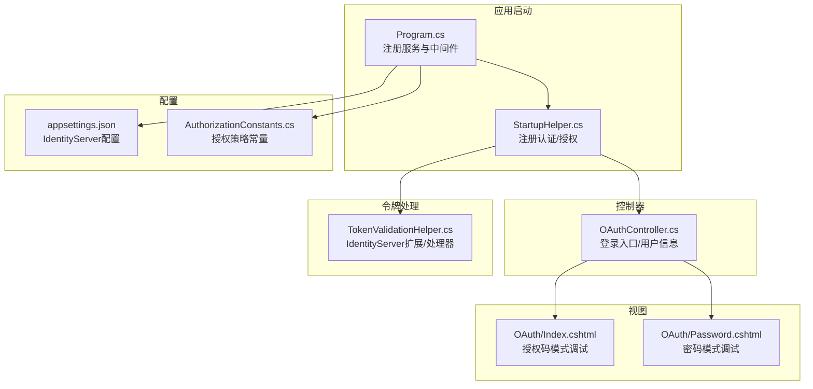
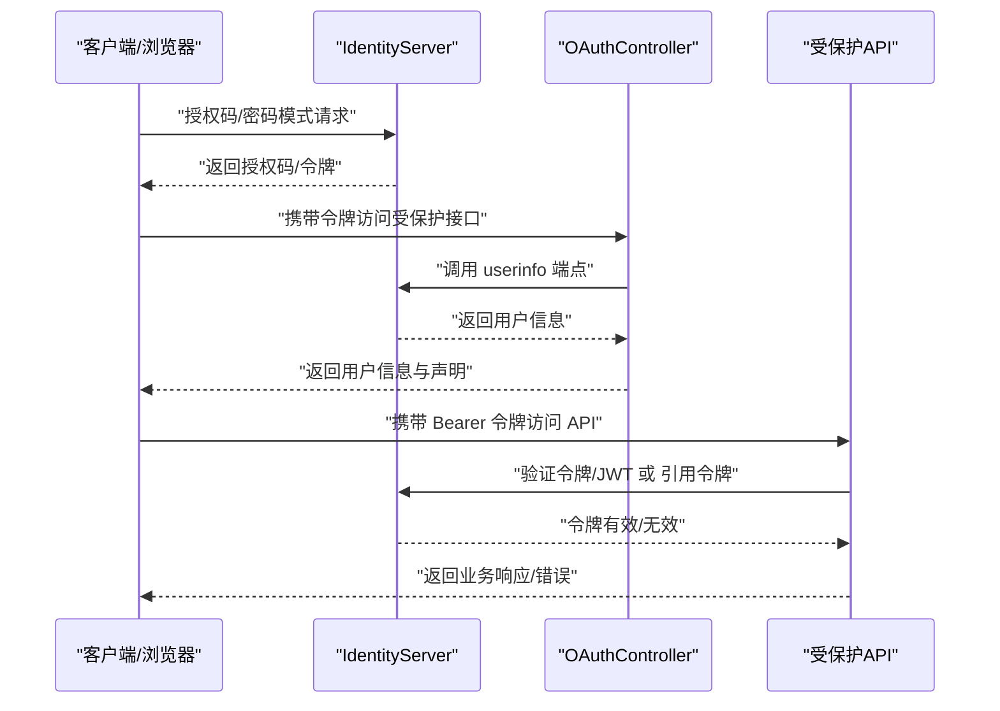
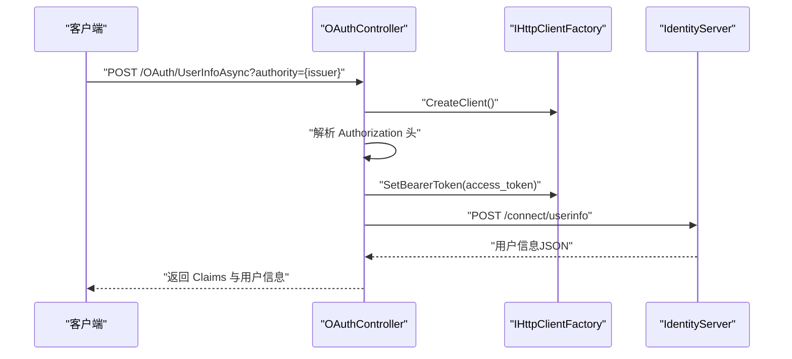
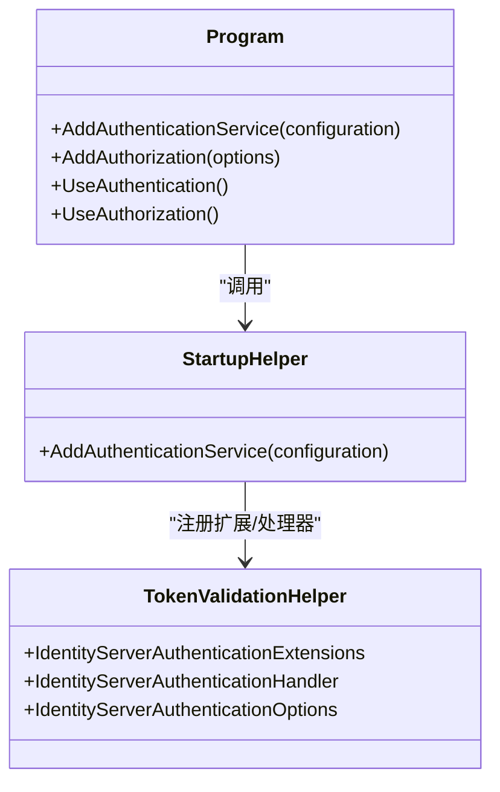
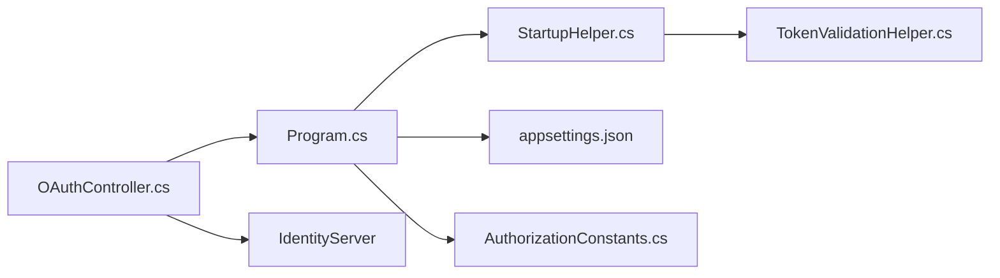

# OAuth 认证 API

<cite>
**本文引用的文件列表**
- [OAuthController.cs](file://Sylas.RemoteTasks.App/Controllers/OAuthController.cs)
- [TokenValidationHelper.cs](file://Sylas.RemoteTasks.App/Helpers/TokenValidationHelper.cs)
- [StartupHelper.cs](file://Sylas.RemoteTasks.App/Helpers/StartupHelper.cs)
- [Program.cs](file://Sylas.RemoteTasks.App/Program.cs)
- [Index.cshtml](file://Sylas.RemoteTasks.App/Views/OAuth/Index.cshtml)
- [Password.cshtml](file://Sylas.RemoteTasks.App/Views/OAuth/Password.cshtml)
- [appsettings.json](file://Sylas.RemoteTasks.App/appsettings.json)
- [AuthorizationConstants.cs](file://Sylas.RemoteTasks.Utils/Constants/AuthorizationConstants.cs)
- [CustomActionFilter.cs](file://Sylas.RemoteTasks.App/Infrastructure/CustomActionFilter.cs)
</cite>

## 目录
1. [简介](#简介)
2. [项目结构](#项目结构)
3. [核心组件](#核心组件)
4. [架构总览](#架构总览)
5. [详细组件分析](#详细组件分析)
6. [依赖关系分析](#依赖关系分析)
7. [性能考量](#性能考量)
8. [故障排查指南](#故障排查指南)
9. [结论](#结论)
10. [附录](#附录)

## 简介
本文件面向 OAuth 与 OpenID Connect（OIDC）集成的认证 API，系统性梳理用户登录、令牌获取、令牌刷新、权限验证等流程，并结合项目中的实现细节，给出端点定义、请求参数、响应格式、错误码、令牌处理与安全最佳实践。项目采用 ASP.NET Core + IdentityServer 认证体系，支持 JWT 与引用令牌两种令牌类型，提供基于作用域与角色的授权策略。

## 项目结构
与 OAuth 认证直接相关的模块分布如下：
- 控制器：OAuthController 提供 OIDC 登录入口与用户信息查询接口
- 视图：OAuth/Index.cshtml 与 OAuth/Password.cshtml 提供授权码/密码模式调试界面
- 启动配置：Program.cs 与 StartupHelper.cs 注册认证与授权策略
- 令牌处理：TokenValidationHelper.cs 提供 IdentityServer 认证扩展与处理器
- 配置：appsettings.json 中包含 IdentityServer 相关配置项
- 授权常量：AuthorizationConstants.cs 定义授权策略名称

图表来源
- [Program.cs](file://Sylas.RemoteTasks.App/Program.cs#L74-L87)
- [StartupHelper.cs](file://Sylas.RemoteTasks.App/Helpers/StartupHelper.cs#L124-L271)
- [OAuthController.cs](file://Sylas.RemoteTasks.App/Controllers/OAuthController.cs#L7-L46)
- [TokenValidationHelper.cs](file://Sylas.RemoteTasks.App/Helpers/TokenValidationHelper.cs#L117-L200)
- [appsettings.json](file://Sylas.RemoteTasks.App/appsettings.json#L109-L121)
- [AuthorizationConstants.cs](file://Sylas.RemoteTasks.Utils/Constants/AuthorizationConstants.cs#L6-L12)

章节来源
- [Program.cs](file://Sylas.RemoteTasks.App/Program.cs#L74-L87)
- [StartupHelper.cs](file://Sylas.RemoteTasks.App/Helpers/StartupHelper.cs#L124-L271)
- [OAuthController.cs](file://Sylas.RemoteTasks.App/Controllers/OAuthController.cs#L7-L46)
- [TokenValidationHelper.cs](file://Sylas.RemoteTasks.App/Helpers/TokenValidationHelper.cs#L117-L200)
- [appsettings.json](file://Sylas.RemoteTasks.App/appsettings.json#L109-L121)
- [AuthorizationConstants.cs](file://Sylas.RemoteTasks.Utils/Constants/AuthorizationConstants.cs#L6-L12)

## 核心组件
- OAuthController：提供 OIDC 登录入口与受保护的用户信息查询接口
- TokenValidationHelper：提供 IdentityServer 认证扩展、处理器与选项配置，支持 JWT 与引用令牌
- StartupHelper：集中注册认证服务（IdentityServer），配置默认方案、事件与令牌映射
- Program：注册认证与授权策略，启用认证/授权中间件
- 视图页面：OAuth/Index.cshtml 与 OAuth/Password.cshtml 提供授权码/密码模式调试与令牌获取演示
- 配置：appsettings.json 中的 IdentityServerConfiguration 节点提供 Authority、ApiName、ApiSecret、ClientId、ClientSecret、Scopes 等关键配置
- 授权常量：AuthorizationConstants 定义授权策略名称，配合 Program 中的 AddAuthorization 使用

章节来源
- [OAuthController.cs](file://Sylas.RemoteTasks.App/Controllers/OAuthController.cs#L7-L46)
- [TokenValidationHelper.cs](file://Sylas.RemoteTasks.App/Helpers/TokenValidationHelper.cs#L117-L200)
- [StartupHelper.cs](file://Sylas.RemoteTasks.App/Helpers/StartupHelper.cs#L124-L271)
- [Program.cs](file://Sylas.RemoteTasks.App/Program.cs#L74-L87)
- [appsettings.json](file://Sylas.RemoteTasks.App/appsettings.json#L109-L121)
- [AuthorizationConstants.cs](file://Sylas.RemoteTasks.Utils/Constants/AuthorizationConstants.cs#L6-L12)

## 架构总览
系统采用“浏览器/前端”发起 OIDC 授权流程，后端控制器接收授权码或直接通过密码模式获取访问令牌；随后，受保护的 API 通过 IdentityServer 认证中间件对 Bearer 令牌进行验证，支持 JWT 与引用令牌两种类型。

图表来源
- [OAuthController.cs](file://Sylas.RemoteTasks.App/Controllers/OAuthController.cs#L31-L46)
- [StartupHelper.cs](file://Sylas.RemoteTasks.App/Helpers/StartupHelper.cs#L234-L270)
- [TokenValidationHelper.cs](file://Sylas.RemoteTasks.App/Helpers/TokenValidationHelper.cs#L207-L315)

## 详细组件分析

### OAuthController：登录与用户信息接口
- 端点概览
  - GET /OAuth/Index：OIDC 登录入口视图
  - GET /OAuth/Password：密码模式调试视图
  - POST /OAuth/UserInfoAsync：受保护接口，用于从身份认证层获取用户信息
- 请求与响应
  - UserInfoAsync
    - 方法：POST
    - 路径：/OAuth/UserInfoAsync
    - 查询参数：authority（认证服务器地址）
    - 请求头：Authorization: Bearer {access_token}
    - 响应：包含 Claims 列表与用户信息 JSON 字符串
    - 错误：当 access_token 缺失时抛出异常
- 处理逻辑
  - 从 Authorization 头提取 Bearer 令牌
  - 使用 IHttpClientFactory 创建客户端并设置 Bearer 令牌
  - 从 authority 解析 userinfo 地址并调用
  - 返回 Claims 与用户信息 JSON

图表来源
- [OAuthController.cs](file://Sylas.RemoteTasks.App/Controllers/OAuthController.cs#L31-L46)

章节来源
- [OAuthController.cs](file://Sylas.RemoteTasks.App/Controllers/OAuthController.cs#L7-L46)

### 视图页面：授权码与密码模式调试
- OAuth/Index.cshtml
  - 提供授权码模式调试表单，包含 client_id、client_secret、redirect_uri、response_type、scope、state、code_challenge、code_challenge_method、acr_values、response_mode 等字段
  - 支持选择第三方登录（钉钉、微信公众号、企业微信），自动填充 acr_values
  - 本地存储授权参数，便于复用
- OAuth/Password.cshtml
  - 提供密码模式调试表单，包含 client_id、client_secret、scope、grant_type、username、password
  - 支持切换授权模式（password/code/implicit）
  - 通过 fetch 请求获取令牌，并调用 UserInfoAsync 获取用户信息

章节来源
- [Index.cshtml](file://Sylas.RemoteTasks.App/Views/OAuth/Index.cshtml#L12-L76)
- [Password.cshtml](file://Sylas.RemoteTasks.App/Views/OAuth/Password.cshtml#L20-L58)

### 认证与授权配置：StartupHelper 与 Program
- Program.cs
  - 注册认证服务：AddAuthenticationService
  - 注册授权策略：AddAuthorization，定义 AdministrationPolicy（基于角色与 scope 的组合）
  - 启用认证/授权中间件：UseAuthentication、UseAuthorization
- StartupHelper.cs
  - AddAuthenticationService：注册 IdentityServer 认证，配置 Authority、ApiName、ApiSecret、RequireHttpsMetadata、SupportedTokens 等
  - 配置默认方案为 Bearer，支持令牌验证失败时的挑战
  - 自定义 JwtBearerEvents.OnTokenValidated：规范化 claim 类型（如将 NameIdentifier 映射为 sub，复制 role 声明）
- TokenValidationHelper.cs
  - IdentityServerAuthenticationExtensions：扩展 AddIdentityServerAuthentication，支持 JWT 与 OAuth2 引用令牌
  - IdentityServerAuthenticationHandler：根据令牌内容自动选择 JWT 或引用令牌验证方案
  - IdentityServerAuthenticationOptions：支持令牌检索、发现文档缓存、事件钩子、受众验证等

图表来源
- [Program.cs](file://Sylas.RemoteTasks.App/Program.cs#L74-L87)
- [StartupHelper.cs](file://Sylas.RemoteTasks.App/Helpers/StartupHelper.cs#L124-L271)
- [TokenValidationHelper.cs](file://Sylas.RemoteTasks.App/Helpers/TokenValidationHelper.cs#L117-L200)

章节来源
- [Program.cs](file://Sylas.RemoteTasks.App/Program.cs#L74-L87)
- [StartupHelper.cs](file://Sylas.RemoteTasks.App/Helpers/StartupHelper.cs#L124-L271)
- [TokenValidationHelper.cs](file://Sylas.RemoteTasks.App/Helpers/TokenValidationHelper.cs#L117-L200)

### OIDC/OpenID Connect 集成要点
- 授权服务器地址：appsettings.json 中的 IdentityServerConfiguration:Authority
- 客户端凭据：ClientId/ClientSecret
- API 资源：ApiName/ApiSecret
- 作用域：Scopes
- HTTPS 元数据：RequireHttpsMetadata
- 令牌类型：SupportedTokens（Both/JWT/Reference）

章节来源
- [appsettings.json](file://Sylas.RemoteTasks.App/appsettings.json#L109-L121)
- [StartupHelper.cs](file://Sylas.RemoteTasks.App/Helpers/StartupHelper.cs#L147-L155)
- [TokenValidationHelper.cs](file://Sylas.RemoteTasks.App/Helpers/TokenValidationHelper.cs#L318-L444)

### JWT 令牌处理与权限控制
- 令牌检索：默认从 Authorization 头的 Bearer 令牌中提取
- JWT 验证：通过 IdentityServer 的 JwtBearerOptions 配置，支持受众验证、时钟偏差、发现文档缓存、事件钩子
- 引用令牌：通过 OAuth2 Introspection 端点验证，支持缓存与超时
- 权限策略：Program 中定义 AdministrationPolicy，要求用户具备特定角色与 scope

章节来源
- [TokenValidationHelper.cs](file://Sylas.RemoteTasks.App/Helpers/TokenValidationHelper.cs#L318-L556)
- [Program.cs](file://Sylas.RemoteTasks.App/Program.cs#L77-L86)

## 依赖关系分析
- OAuthController 依赖 IHttpClientFactory 与用户上下文（含 Claims）
- Program 依赖 StartupHelper 进行认证注册，并定义授权策略
- StartupHelper 依赖 TokenValidationHelper 的扩展与处理器
- 配置来自 appsettings.json 的 IdentityServerConfiguration 节点
- 授权策略名称来自 AuthorizationConstants

图表来源
- [Program.cs](file://Sylas.RemoteTasks.App/Program.cs#L74-L87)
- [StartupHelper.cs](file://Sylas.RemoteTasks.App/Helpers/StartupHelper.cs#L124-L271)
- [TokenValidationHelper.cs](file://Sylas.RemoteTasks.App/Helpers/TokenValidationHelper.cs#L117-L200)
- [appsettings.json](file://Sylas.RemoteTasks.App/appsettings.json#L109-L121)
- [AuthorizationConstants.cs](file://Sylas.RemoteTasks.Utils/Constants/AuthorizationConstants.cs#L6-L12)
- [OAuthController.cs](file://Sylas.RemoteTasks.App/Controllers/OAuthController.cs#L31-L46)

章节来源
- [Program.cs](file://Sylas.RemoteTasks.App/Program.cs#L74-L87)
- [StartupHelper.cs](file://Sylas.RemoteTasks.App/Helpers/StartupHelper.cs#L124-L271)
- [TokenValidationHelper.cs](file://Sylas.RemoteTasks.App/Helpers/TokenValidationHelper.cs#L117-L200)
- [appsettings.json](file://Sylas.RemoteTasks.App/appsettings.json#L109-L121)
- [AuthorizationConstants.cs](file://Sylas.RemoteTasks.Utils/Constants/AuthorizationConstants.cs#L6-L12)
- [OAuthController.cs](file://Sylas.RemoteTasks.App/Controllers/OAuthController.cs#L31-L46)

## 性能考量
- 发现文档缓存：IdentityServerAuthenticationOptions 支持 EnableCaching 与 CacheDuration，减少频繁拉取发现文档的开销
- 引用令牌缓存：OAuth2 Introspection 支持缓存与 TTL，降低后端验证压力
- 令牌处理事件：通过 JwtBearerEvents 与 OAuth2IntrospectionEvents 进行日志与监控，便于定位性能瓶颈
- 时钟偏差：JwtValidationClockSkew 可调整允许的时间误差，避免因时间不同步导致的验证失败

章节来源
- [TokenValidationHelper.cs](file://Sylas.RemoteTasks.App/Helpers/TokenValidationHelper.cs#L376-L404)
- [TokenValidationHelper.cs](file://Sylas.RemoteTasks.App/Helpers/TokenValidationHelper.cs#L545-L555)

## 故障排查指南
- 令牌缺失
  - 现象：UserInfoAsync 抛出异常提示 access_token 不能为空
  - 处理：确保请求头 Authorization 包含 Bearer 令牌
- 令牌类型不匹配
  - 现象：JWT 与引用令牌混用导致验证失败
  - 处理：确认 SupportedTokens 配置与实际令牌类型一致；检查 IdentityServerAuthenticationHandler 的令牌判定逻辑
- HTTPS 元数据校验失败
  - 现象：RequireHttpsMetadata 为 true 时，非 HTTPS 发现文档加载失败
  - 处理：将 Authority 设为 HTTPS，或在开发环境临时关闭 RequireHttpsMetadata
- 作用域与受众验证
  - 现象：令牌有效但无权限访问 API
  - 处理：核对 ApiName 与 Scopes 配置，确保令牌包含所需 scope；必要时调整 Audience 验证策略
- 自定义 ActionFilter
  - 现象：未认证用户被重定向到登录页
  - 处理：检查 CustomActionFilter 的认证状态判断逻辑

章节来源
- [OAuthController.cs](file://Sylas.RemoteTasks.App/Controllers/OAuthController.cs#L36-L40)
- [TokenValidationHelper.cs](file://Sylas.RemoteTasks.App/Helpers/TokenValidationHelper.cs#L334-L340)
- [TokenValidationHelper.cs](file://Sylas.RemoteTasks.App/Helpers/TokenValidationHelper.cs#L492-L501)
- [CustomActionFilter.cs](file://Sylas.RemoteTasks.App/Infrastructure/CustomActionFilter.cs#L14-L20)

## 结论
本项目基于 IdentityServer 提供了完整的 OAuth 与 OIDC 认证能力，支持 JWT 与引用令牌验证、作用域与角色授权策略，并通过调试视图展示了授权码与密码模式的实际使用方式。建议在生产环境中严格启用 HTTPS、合理配置缓存与受众验证、完善令牌生命周期管理与安全审计。

## 附录

### API 端点定义与示例

- 用户信息查询（受保护）
  - 方法：POST
  - 路径：/OAuth/UserInfoAsync
  - 查询参数：
    - authority：认证服务器地址（如 https://is4server.com）
  - 请求头：
    - Authorization: Bearer {access_token}
  - 响应：
    - 包含 Claims 列表与用户信息 JSON 字符串
  - 错误：
    - 当 access_token 缺失时返回异常

- 授权码模式调试（视图）
  - 路径：/OAuth/Index
  - 表单字段：client_id、client_secret、redirect_uri、response_type、scope、state、code_challenge、code_challenge_method、acr_values、response_mode
  - 本地存储：授权参数持久化于本地存储，便于复用

- 密码模式调试（视图）
  - 路径：/OAuth/Password
  - 表单字段：client_id、client_secret、scope、grant_type、username、password
  - 行为：通过 fetch 获取令牌并调用 UserInfoAsync

章节来源
- [OAuthController.cs](file://Sylas.RemoteTasks.App/Controllers/OAuthController.cs#L31-L46)
- [Index.cshtml](file://Sylas.RemoteTasks.App/Views/OAuth/Index.cshtml#L12-L76)
- [Password.cshtml](file://Sylas.RemoteTasks.App/Views/OAuth/Password.cshtml#L20-L58)

### OIDC 配置清单
- IdentityServerConfiguration
  - Authority：认证服务器地址
  - RequireHttpsMetadata：是否要求 HTTPS
  - EnableCaching：是否启用发现文档缓存
  - AdministrationRole：管理员角色名称
  - ApiName：API 资源名称
  - ApiSecret：API 资源密钥
  - ClientId：客户端 ID
  - ClientSecret：客户端密钥
  - OidcResponseType：OIDC 响应类型
  - Scopes：作用域集合
  - CacheDuration：缓存时长（分钟）

章节来源
- [appsettings.json](file://Sylas.RemoteTasks.App/appsettings.json#L109-L121)

### 令牌管理与安全最佳实践
- 令牌存储
  - 建议仅在内存或安全存储中持有短期令牌，避免持久化敏感令牌
- 刷新机制
  - 若使用授权码模式，可结合 refresh_token（如存在）进行刷新；密码模式通常不返回 refresh_token
- 失效处理
  - 监控 JwtBearerEvents 与 OAuth2IntrospectionEvents，及时捕获验证失败并记录
- 安全考虑
  - 强制 HTTPS（RequireHttpsMetadata）
  - 合理设置受众（ApiName）与作用域（Scopes）
  - 严格控制时钟偏差（JwtValidationClockSkew）
  - 对外暴露的 API 必须标注 [Authorize] 并使用合适的授权策略

章节来源
- [TokenValidationHelper.cs](file://Sylas.RemoteTasks.App/Helpers/TokenValidationHelper.cs#L334-L404)
- [TokenValidationHelper.cs](file://Sylas.RemoteTasks.App/Helpers/TokenValidationHelper.cs#L492-L501)
- [Program.cs](file://Sylas.RemoteTasks.App/Program.cs#L77-L86)