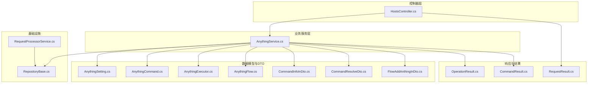
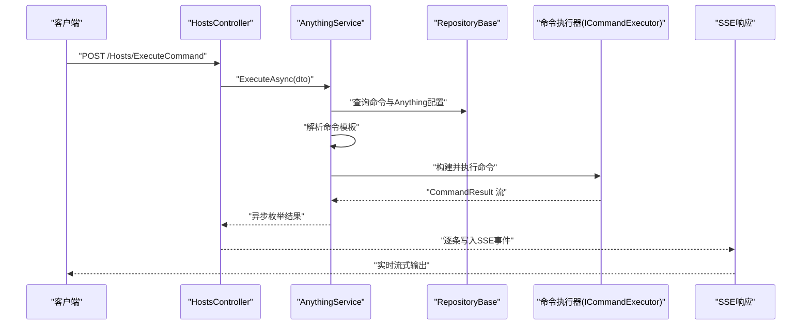
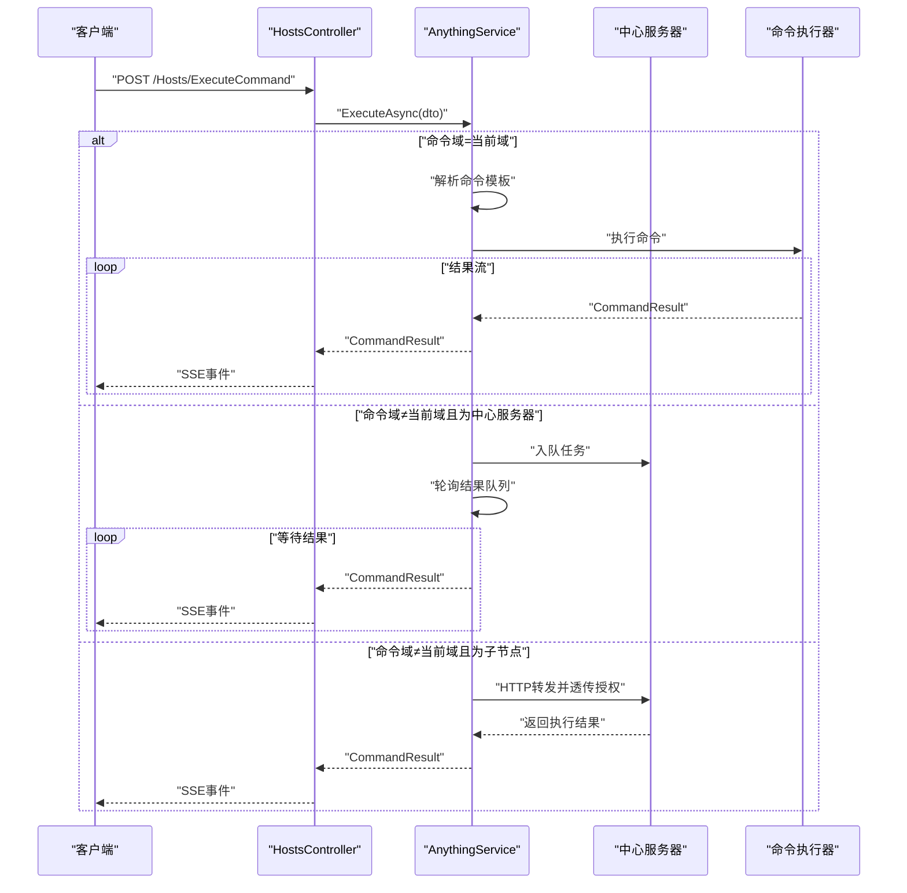
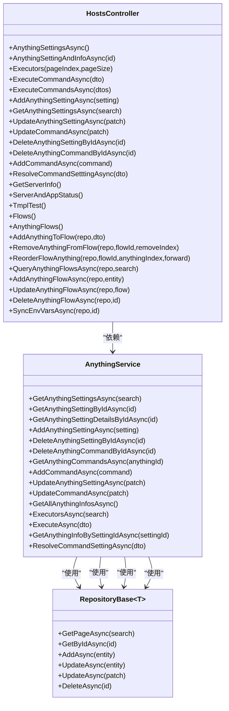

# 主机管理 API

<cite>
**本文引用的文件**
- [Sylas.RemoteTasks.App/Controllers/HostsController.cs](file://Sylas.RemoteTasks.App/Controllers/HostsController.cs)
- [Sylas.RemoteTasks.App/RemoteHostModule/Anything/AnythingService.cs](file://Sylas.RemoteTasks.App/RemoteHostModule/Anything/AnythingService.cs)
- [Sylas.RemoteTasks.App/RemoteHostModule/Anything/AnythingSetting.cs](file://Sylas.RemoteTasks.App/RemoteHostModule/Anything/AnythingSetting.cs)
- [Sylas.RemoteTasks.App/RemoteHostModule/Anything/AnythingCommand.cs](file://Sylas.RemoteTasks.App/RemoteHostModule/Anything/AnythingCommand.cs)
- [Sylas.RemoteTasks.App/RemoteHostModule/Anything/AnythingExecutor.cs](file://Sylas.RemoteTasks.App/RemoteHostModule/Anything/AnythingExecutor.cs)
- [Sylas.RemoteTasks.App/RemoteHostModule/Anything/AnythingFlow.cs](file://Sylas.RemoteTasks.App/RemoteHostModule/Anything/AnythingFlow.cs)
- [Sylas.RemoteTasks.App/RemoteHostModule/Anything/CommandInfoInDto.cs](file://Sylas.RemoteTasks.App/RemoteHostModule/Anything/CommandInfoInDto.cs)
- [Sylas.RemoteTasks.App/RemoteHostModule/Anything/CommandResolveDto.cs](file://Sylas.RemoteTasks.App/RemoteHostModule/Anything/CommandResolveDto.cs)
- [Sylas.RemoteTasks.App/RemoteHostModule/Anything/FlowAddAnthingInDto.cs](file://Sylas.RemoteTasks.App/RemoteHostModule/Anything/FlowAddAnthingInDto.cs)
- [Sylas.RemoteTasks.Utils/CommandExecutor/CommandResult.cs](file://Sylas.RemoteTasks.Utils/CommandExecutor/CommandResult.cs)
- [Sylas.RemoteTasks.Common/Dtos/RequestResult.cs](file://Sylas.RemoteTasks.Common/Dtos/RequestResult.cs)
- [Sylas.RemoteTasks.Common/Dtos/OperationResult.cs](file://Sylas.RemoteTasks.Common/Dtos/OperationResult.cs)
- [Sylas.RemoteTasks.App/Infrastructure/RepositoryBase.cs](file://Sylas.RemoteTasks.App/Infrastructure/RepositoryBase.cs)
- [Sylas.RemoteTasks.App/RequestProcessor/RequestProcessorService.cs](file://Sylas.RemoteTasks.App/RequestProcessor/RequestProcessorService.cs)
</cite>

## 目录
1. [简介](#简介)
2. [项目结构](#项目结构)
3. [核心组件](#核心组件)
4. [架构总览](#架构总览)
5. [详细组件分析](#详细组件分析)
6. [依赖关系分析](#依赖关系分析)
7. [性能考量](#性能考量)
8. [故障排查指南](#故障排查指南)
9. [结论](#结论)
10. [附录](#附录)

## 简介
本文件为主机管理 API 的权威技术文档，覆盖以下能力与接口：
- 任意“主机对象”（Anything）的配置管理：增删改查、命令管理、命令解析
- 命令执行：SSE 流式响应，支持单条与批量执行
- 工作流（Flow）管理：节点增删改、重排、环境变量同步
- 服务器与应用信息查询
- 认证与权限说明、错误码规范、常见使用场景与最佳实践

本 API 基于 ASP.NET Core MVC 构建，采用仓储模式与内存缓存优化，结合模板解析与命令执行器抽象，实现灵活的远程主机自动化。

## 项目结构
围绕主机管理的核心模块与文件如下：
- 控制器层：HostsController 提供所有对外接口
- 业务服务层：AnythingService 负责 Anything 配置、命令解析与执行调度
- 数据模型：AnythingSetting、AnythingCommand、AnythingExecutor、AnythingFlow
- DTO：CommandInfoInDto、CommandResolveDto、FlowAddAnthingInDto
- 响应封装：RequestResult、OperationResult
- 命令执行结果：CommandResult
- 仓储基类：RepositoryBase
- 请求处理流程扩展：RequestProcessorService（用于请求处理器工作流）

图表来源
- [Sylas.RemoteTasks.App/Controllers/HostsController.cs](file://Sylas.RemoteTasks.App/Controllers/HostsController.cs#L1-L468)
- [Sylas.RemoteTasks.App/RemoteHostModule/Anything/AnythingService.cs](file://Sylas.RemoteTasks.App/RemoteHostModule/Anything/AnythingService.cs#L1-L680)
- [Sylas.RemoteTasks.App/RemoteHostModule/Anything/AnythingSetting.cs](file://Sylas.RemoteTasks.App/RemoteHostModule/Anything/AnythingSetting.cs#L1-L34)
- [Sylas.RemoteTasks.App/RemoteHostModule/Anything/AnythingCommand.cs](file://Sylas.RemoteTasks.App/RemoteHostModule/Anything/AnythingCommand.cs#L1-L35)
- [Sylas.RemoteTasks.App/RemoteHostModule/Anything/AnythingExecutor.cs](file://Sylas.RemoteTasks.App/RemoteHostModule/Anything/AnythingExecutor.cs#L1-L12)
- [Sylas.RemoteTasks.App/RemoteHostModule/Anything/AnythingFlow.cs](file://Sylas.RemoteTasks.App/RemoteHostModule/Anything/AnythingFlow.cs#L1-L29)
- [Sylas.RemoteTasks.App/RemoteHostModule/Anything/CommandInfoInDto.cs](file://Sylas.RemoteTasks.App/RemoteHostModule/Anything/CommandInfoInDto.cs#L1-L15)
- [Sylas.RemoteTasks.App/RemoteHostModule/Anything/CommandResolveDto.cs](file://Sylas.RemoteTasks.App/RemoteHostModule/Anything/CommandResolveDto.cs#L1-L15)
- [Sylas.RemoteTasks.App/RemoteHostModule/Anything/FlowAddAnthingInDto.cs](file://Sylas.RemoteTasks.App/RemoteHostModule/Anything/FlowAddAnthingInDto.cs#L1-L10)
- [Sylas.RemoteTasks.Common/Dtos/RequestResult.cs](file://Sylas.RemoteTasks.Common/Dtos/RequestResult.cs#L1-L65)
- [Sylas.RemoteTasks.Common/Dtos/OperationResult.cs](file://Sylas.RemoteTasks.Common/Dtos/OperationResult.cs#L1-L52)
- [Sylas.RemoteTasks.Utils/CommandExecutor/CommandResult.cs](file://Sylas.RemoteTasks.Utils/CommandExecutor/CommandResult.cs#L1-L38)
- [Sylas.RemoteTasks.App/Infrastructure/RepositoryBase.cs](file://Sylas.RemoteTasks.App/Infrastructure/RepositoryBase.cs#L1-L233)
- [Sylas.RemoteTasks.App/RequestProcessor/RequestProcessorService.cs](file://Sylas.RemoteTasks.App/RequestProcessor/RequestProcessorService.cs#L1-L72)

章节来源
- [Sylas.RemoteTasks.App/Controllers/HostsController.cs](file://Sylas.RemoteTasks.App/Controllers/HostsController.cs#L1-L468)
- [Sylas.RemoteTasks.App/RemoteHostModule/Anything/AnythingService.cs](file://Sylas.RemoteTasks.App/RemoteHostModule/Anything/AnythingService.cs#L1-L680)

## 核心组件
- 控制器：HostsController 提供 Anything 配置、命令、工作流与服务器信息的全部接口入口
- 服务：AnythingService 负责 Anything 配置的 CRUD、命令解析、执行器构建、命令执行与工作流节点管理
- 数据模型：
  - AnythingSetting：Anything 配置项（标题、属性、执行器）
  - AnythingCommand：命令项（名称、模板命令、状态查询、域、排序）
  - AnythingExecutor：执行器定义（名称、参数模板）
  - AnythingFlow：工作流定义（标题、环境变量、节点序列、计划任务、域）
- DTO：
  - CommandInfoInDto：命令执行输入（命令Id、执行编号）
  - CommandResolveDto：命令解析输入（AnythingId、命令模板）
  - FlowAddAnthingInDto：工作流节点添加输入（工作流Id、节点Id、索引）
- 结果封装：
  - RequestResult<T>：统一响应结构（Code、ErrMsg、Data）
  - OperationResult：操作结果（Succeed、Message、Data）
  - CommandResult：命令执行结果（Succeed、Message、CommandExecuteNo）

章节来源
- [Sylas.RemoteTasks.App/RemoteHostModule/Anything/AnythingSetting.cs](file://Sylas.RemoteTasks.App/RemoteHostModule/Anything/AnythingSetting.cs#L1-L34)
- [Sylas.RemoteTasks.App/RemoteHostModule/Anything/AnythingCommand.cs](file://Sylas.RemoteTasks.App/RemoteHostModule/Anything/AnythingCommand.cs#L1-L35)
- [Sylas.RemoteTasks.App/RemoteHostModule/Anything/AnythingExecutor.cs](file://Sylas.RemoteTasks.App/RemoteHostModule/Anything/AnythingExecutor.cs#L1-L12)
- [Sylas.RemoteTasks.App/RemoteHostModule/Anything/AnythingFlow.cs](file://Sylas.RemoteTasks.App/RemoteHostModule/Anything/AnythingFlow.cs#L1-L29)
- [Sylas.RemoteTasks.App/RemoteHostModule/Anything/CommandInfoInDto.cs](file://Sylas.RemoteTasks.App/RemoteHostModule/Anything/CommandInfoInDto.cs#L1-L15)
- [Sylas.RemoteTasks.App/RemoteHostModule/Anything/CommandResolveDto.cs](file://Sylas.RemoteTasks.App/RemoteHostModule/Anything/CommandResolveDto.cs#L1-L15)
- [Sylas.RemoteTasks.App/RemoteHostModule/Anything/FlowAddAnthingInDto.cs](file://Sylas.RemoteTasks.App/RemoteHostModule/Anything/FlowAddAnthingInDto.cs#L1-L10)
- [Sylas.RemoteTasks.Common/Dtos/RequestResult.cs](file://Sylas.RemoteTasks.Common/Dtos/RequestResult.cs#L1-L65)
- [Sylas.RemoteTasks.Common/Dtos/OperationResult.cs](file://Sylas.RemoteTasks.Common/Dtos/OperationResult.cs#L1-L52)
- [Sylas.RemoteTasks.Utils/CommandExecutor/CommandResult.cs](file://Sylas.RemoteTasks.Utils/CommandExecutor/CommandResult.cs#L1-L38)

## 架构总览
主机管理 API 的调用链路如下：
- 客户端请求 -> HostsController -> AnythingService -> 仓储/缓存/模板解析/命令执行器 -> 返回统一响应

图表来源
- [Sylas.RemoteTasks.App/Controllers/HostsController.cs](file://Sylas.RemoteTasks.App/Controllers/HostsController.cs#L85-L124)
- [Sylas.RemoteTasks.App/RemoteHostModule/Anything/AnythingService.cs](file://Sylas.RemoteTasks.App/RemoteHostModule/Anything/AnythingService.cs#L294-L389)
- [Sylas.RemoteTasks.Utils/CommandExecutor/CommandResult.cs](file://Sylas.RemoteTasks.Utils/CommandExecutor/CommandResult.cs#L1-L38)

## 详细组件分析

### 1) Anything 配置管理（增删改查与命令管理）
- 分页查询 Anything 配置
  - 方法与路径：GET /Hosts/AnythingSettingsAsync
  - 请求体：DataSearch（分页与筛选）
  - 响应：RequestResult<PagedData<AnythingSetting>>
- 根据 Id 查询 Anything 配置与命令详情
  - 方法与路径：GET /Hosts/AnythingSettingAndInfoAsync/{id}
  - 路径参数：id（整型）
  - 响应：RequestResult<object>，包含 AnythingSetting 与 AnythingInfo
- 新增 Anything 配置
  - 方法与路径：POST /Hosts/AddAnythingSettingAsync
  - 请求体：AnythingSetting
  - 响应：Json(OperationResult)
- 更新 Anything 配置
  - 方法与路径：POST /Hosts/UpdateAnythingSettingAsync
  - 请求体：Dictionary<string,string>（支持局部更新）
  - 响应：Json(RequestResult<OperationResult>)
- 删除 Anything 配置（级联删除命令）
  - 方法与路径：POST /Hosts/DeleteAnythingSettingByIdAsync
  - 请求体：id（整型）
  - 响应：Json(OperationResult)
- 新增命令
  - 方法与路径：POST /Hosts/AddCommandAsync
  - 请求体：AnythingCommand
  - 响应：Json(RequestResult<bool>)
- 更新命令
  - 方法与路径：POST /Hosts/UpdateCommandAsync
  - 请求体：Dictionary<string,string>（需包含 id）
  - 响应：Ok(RequestResult<OperationResult>)
- 删除命令
  - 方法与路径：POST /Hosts/DeleteAnythingCommandByIdAsync
  - 请求体：id（整型）
  - 响应：Json(OperationResult)
- 解析命令模板
  - 方法与路径：POST /Hosts/ResolveCommandSetttingAsync
  - 请求体：CommandResolveDto（Id、CmdTxt）
  - 响应：RequestResult<string>

章节来源
- [Sylas.RemoteTasks.App/Controllers/HostsController.cs](file://Sylas.RemoteTasks.App/Controllers/HostsController.cs#L32-L56)
- [Sylas.RemoteTasks.App/Controllers/HostsController.cs](file://Sylas.RemoteTasks.App/Controllers/HostsController.cs#L164-L216)
- [Sylas.RemoteTasks.App/Controllers/HostsController.cs](file://Sylas.RemoteTasks.App/Controllers/HostsController.cs#L231-L234)
- [Sylas.RemoteTasks.App/RemoteHostModule/Anything/AnythingService.cs](file://Sylas.RemoteTasks.App/RemoteHostModule/Anything/AnythingService.cs#L45-L106)
- [Sylas.RemoteTasks.App/RemoteHostModule/Anything/AnythingService.cs](file://Sylas.RemoteTasks.App/RemoteHostModule/Anything/AnythingService.cs#L174-L246)

### 2) 命令执行（SSE 流式响应）
- 单条命令执行
  - 方法与路径：POST /Hosts/ExecuteCommand
  - 请求体：CommandInfoInDto（CommandId、CommandExecuteNo）
  - 响应：text/event-stream（SSE），逐条返回 CommandResult JSON
  - 特性：保持连接、无缓存；结束标志为特殊消息标记
- 批量命令执行
  - 方法与路径：POST /Hosts/ExecuteCommandsAsync
  - 请求体：CommandInfoInDto[]（数组）
  - 响应：text/event-stream（SSE），按顺序输出各命令结果
- 命令执行流程要点
  - 若命令域与当前域不同且为中心服务器，则将任务入队并等待结果
  - 若为子节点，则转发到中心服务器并透传授权头
  - 解析 Anything 配置与命令模板，构建执行器并执行
  - 支持并发：通过 CommandExecuteNo 匹配结果与请求

图表来源
- [Sylas.RemoteTasks.App/Controllers/HostsController.cs](file://Sylas.RemoteTasks.App/Controllers/HostsController.cs#L85-L124)
- [Sylas.RemoteTasks.App/Controllers/HostsController.cs](file://Sylas.RemoteTasks.App/Controllers/HostsController.cs#L131-L158)
- [Sylas.RemoteTasks.App/RemoteHostModule/Anything/AnythingService.cs](file://Sylas.RemoteTasks.App/RemoteHostModule/Anything/AnythingService.cs#L294-L389)
- [Sylas.RemoteTasks.App/RemoteHostModule/Anything/AnythingService.cs](file://Sylas.RemoteTasks.App/RemoteHostModule/Anything/AnythingService.cs#L399-L491)

章节来源
- [Sylas.RemoteTasks.App/Controllers/HostsController.cs](file://Sylas.RemoteTasks.App/Controllers/HostsController.cs#L85-L158)
- [Sylas.RemoteTasks.App/RemoteHostModule/Anything/AnythingService.cs](file://Sylas.RemoteTasks.App/RemoteHostModule/Anything/AnythingService.cs#L294-L389)

### 3) 工作流管理（节点管理与环境变量同步）
- 工作流页面
  - 方法与路径：GET /Hosts/AnythingFlows
  - 用途：工作流可视化页面
- 添加节点到工作流
  - 方法与路径：POST /Hosts/AddAnythingToFlow
  - 请求体：FlowAddAnthingInDto（FlowId、AnythingId、AnythingIndex）
  - 响应：RequestResult<bool>
- 从工作流移除节点
  - 方法与路径：POST /Hosts/RemoveAnythingFromFlow
  - 请求体：FlowId（路径参数）、removeIndex（路径参数）
  - 响应：RequestResult<bool>
- 重排工作流节点（前后移动）
  - 方法与路径：POST /Hosts/ReorderFlowAnything
  - 请求体：flowId、anythingIndex、forward
  - 响应：RequestResult<bool>
- 分页查询工作流
  - 方法与路径：POST /Hosts/QueryAnythingFlowsAsync
  - 请求体：DataSearch
  - 响应：RequestResult<PagedData<AnythingFlow>>
- 新增工作流
  - 方法与路径：POST /Hosts/AddAnythingFlowAsync
  - 请求体：AnythingFlow
  - 响应：RequestResult<bool>
- 更新工作流
  - 方法与路径：POST /Hosts/UpdateAnythingFlowAsync
  - 请求体：AnythingFlow
  - 响应：RequestResult<bool>
- 删除工作流
  - 方法与路径：POST /Hosts/DeleteAnythingFlowAsync
  - 请求体：id（整型）
  - 响应：RequestResult<bool>
- 同步环境变量
  - 方法与路径：POST /Hosts/SyncEnvVarsAsync
  - 请求体：id（工作流Id）
  - 行为：将所有节点的属性合并到工作流 EnvVars 中
  - 响应：RequestResult<bool>

图表来源
- [Sylas.RemoteTasks.App/Controllers/HostsController.cs](file://Sylas.RemoteTasks.App/Controllers/HostsController.cs#L301-L314)
- [Sylas.RemoteTasks.App/Controllers/HostsController.cs](file://Sylas.RemoteTasks.App/Controllers/HostsController.cs#L322-L335)
- [Sylas.RemoteTasks.App/Controllers/HostsController.cs](file://Sylas.RemoteTasks.App/Controllers/HostsController.cs#L336-L368)
- [Sylas.RemoteTasks.App/Controllers/HostsController.cs](file://Sylas.RemoteTasks.App/Controllers/HostsController.cs#L375-L380)
- [Sylas.RemoteTasks.App/Controllers/HostsController.cs](file://Sylas.RemoteTasks.App/Controllers/HostsController.cs#L387-L419)
- [Sylas.RemoteTasks.App/Controllers/HostsController.cs](file://Sylas.RemoteTasks.App/Controllers/HostsController.cs#L425-L465)

章节来源
- [Sylas.RemoteTasks.App/Controllers/HostsController.cs](file://Sylas.RemoteTasks.App/Controllers/HostsController.cs#L281-L465)

### 4) 服务器与应用信息
- 获取服务器与应用信息
  - 方法与路径：GET /Hosts/GetServerInfo
  - 响应：RequestResult<ServerInfo>
- 页面入口
  - 方法与路径：GET /Hosts/ServerAndAppStatus
  - 用途：服务器与应用状态展示页面
  - 方法与路径：GET /Hosts/TmplTest
  - 用途：模板测试页面

章节来源
- [Sylas.RemoteTasks.App/Controllers/HostsController.cs](file://Sylas.RemoteTasks.App/Controllers/HostsController.cs#L240-L262)

### 5) 请求处理器工作流（扩展能力）
- 执行请求处理器工作流
  - 方法与路径：POST /RequestProcessor/ExecuteHttpRequestProcessorsAsync
  - 请求体：ids（数组）、stepId（可选）
  - 行为：按顺序执行指定的请求处理器步骤，支持步骤断点续跑与上下文传递
  - 响应：OperationResult

章节来源
- [Sylas.RemoteTasks.App/RequestProcessor/RequestProcessorService.cs](file://Sylas.RemoteTasks.App/RequestProcessor/RequestProcessorService.cs#L11-L69)

## 依赖关系分析
- 控制器依赖服务：HostsController 依赖 AnythingService 进行业务处理
- 服务依赖仓储与缓存：AnythingService 通过 RepositoryBase 访问数据库，使用内存缓存优化执行器与 AnythingInfo
- 命令执行器：通过反射与工厂创建具体执行器，支持模板参数解析
- SSE 输出：控制器直接写入响应流，无需中间缓冲

图表来源
- [Sylas.RemoteTasks.App/Controllers/HostsController.cs](file://Sylas.RemoteTasks.App/Controllers/HostsController.cs#L19-L468)
- [Sylas.RemoteTasks.App/RemoteHostModule/Anything/AnythingService.cs](file://Sylas.RemoteTasks.App/RemoteHostModule/Anything/AnythingService.cs#L30-L680)
- [Sylas.RemoteTasks.App/Infrastructure/RepositoryBase.cs](file://Sylas.RemoteTasks.App/Infrastructure/RepositoryBase.cs#L10-L233)

章节来源
- [Sylas.RemoteTasks.App/Controllers/HostsController.cs](file://Sylas.RemoteTasks.App/Controllers/HostsController.cs#L19-L468)
- [Sylas.RemoteTasks.App/RemoteHostModule/Anything/AnythingService.cs](file://Sylas.RemoteTasks.App/RemoteHostModule/Anything/AnythingService.cs#L30-L680)
- [Sylas.RemoteTasks.App/Infrastructure/RepositoryBase.cs](file://Sylas.RemoteTasks.App/Infrastructure/RepositoryBase.cs#L10-L233)

## 性能考量
- 缓存策略
  - AnythingInfo 与执行器信息使用内存缓存，减少重复解析与实例化开销
  - 缓存滑动过期时间较长，适合高频访问场景
- 异步流式输出
  - 命令执行结果以 IAsyncEnumerable 形式流式返回，降低内存峰值
- 数据库访问
  - 仓储统一实现分页与局部更新，避免全表扫描
- 跨域/跨节点执行
  - 子节点将任务入队并轮询中心服务器结果，避免阻塞主线程

[本节为通用性能建议，不直接分析具体文件]

## 故障排查指南
- 常见错误码与含义
  - RequestResult.Code=0：请求失败，ErrMs g 为错误信息
  - OperationResult.Succeed=false：操作失败，Message 为原因
- 命令执行异常
  - 当命令域与当前域不一致且中心服务器不可达时，会返回失败提示
  - 若解析命令模板失败，返回解析异常
- 工作流节点管理
  - 未找到工作流或节点时，返回相应错误信息
- 建议排查步骤
  - 检查 Anything 配置与命令模板是否正确
  - 确认执行器名称与参数类型匹配
  - 检查中心服务器连通性与授权头透传
  - 查看 SSE 客户端是否正确处理“结束标记”

章节来源
- [Sylas.RemoteTasks.Common/Dtos/RequestResult.cs](file://Sylas.RemoteTasks.Common/Dtos/RequestResult.cs#L44-L50)
- [Sylas.RemoteTasks.Common/Dtos/OperationResult.cs](file://Sylas.RemoteTasks.Common/Dtos/OperationResult.cs#L26-L39)
- [Sylas.RemoteTasks.App/Controllers/HostsController.cs](file://Sylas.RemoteTasks.App/Controllers/HostsController.cs#L85-L124)
- [Sylas.RemoteTasks.App/Controllers/HostsController.cs](file://Sylas.RemoteTasks.App/Controllers/HostsController.cs#L301-L314)

## 结论
本 API 通过清晰的分层设计与统一响应封装，提供了完整的主机配置、命令执行与工作流管理能力。SSE 流式输出与缓存机制确保了良好的用户体验与性能表现。建议在生产环境中配合鉴权与限流策略使用，并对命令模板与执行器参数进行严格的校验与测试。

[本节为总结性内容，不直接分析具体文件]

## 附录

### A. 统一响应结构
- RequestResult<T>
  - Code：1 表示成功，0 表示失败
  - ErrMsg：错误信息
  - Data：泛型数据
- OperationResult
  - Succeed：布尔值
  - Message：消息
  - Data：可选数据集合

章节来源
- [Sylas.RemoteTasks.Common/Dtos/RequestResult.cs](file://Sylas.RemoteTasks.Common/Dtos/RequestResult.cs#L6-L63)
- [Sylas.RemoteTasks.Common/Dtos/OperationResult.cs](file://Sylas.RemoteTasks.Common/Dtos/OperationResult.cs#L8-L50)

### B. 命令执行结果结构
- CommandResult
  - Succeed：是否成功
  - Message：执行输出或错误信息
  - CommandExecuteNo：用于匹配请求与结果的编号

章节来源
- [Sylas.RemoteTasks.Utils/CommandExecutor/CommandResult.cs](file://Sylas.RemoteTasks.Utils/CommandExecutor/CommandResult.cs#L6-L36)

### C. 常见使用场景与最佳实践
- 场景一：新增 Anything 并配置命令
  - 步骤：先新增 Anything 配置，再添加命令；使用 ResolveCommandSetttingAsync 验证模板
- 场景二：执行命令并实时查看输出
  - 步骤：调用 ExecuteCommandAsync，客户端以 SSE 方式订阅；为每条命令设置唯一 CommandExecuteNo
- 场景三：构建工作流
  - 步骤：创建工作流，添加节点，必要时调用 SyncEnvVarsAsync 合并环境变量
- 最佳实践
  - 严格校验命令模板中的变量引用
  - 为并发执行设置不同的 CommandExecuteNo
  - 合理设置缓存过期时间，避免脏数据
  - 对中心服务器与子节点的网络与授权进行监控

[本节为通用指导，不直接分析具体文件]