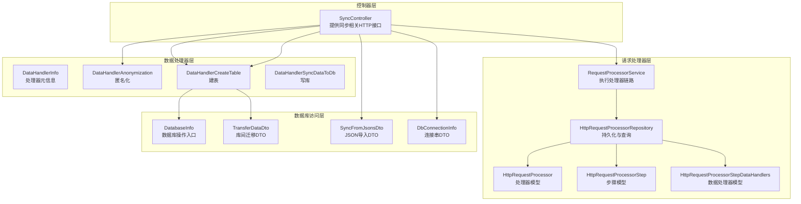
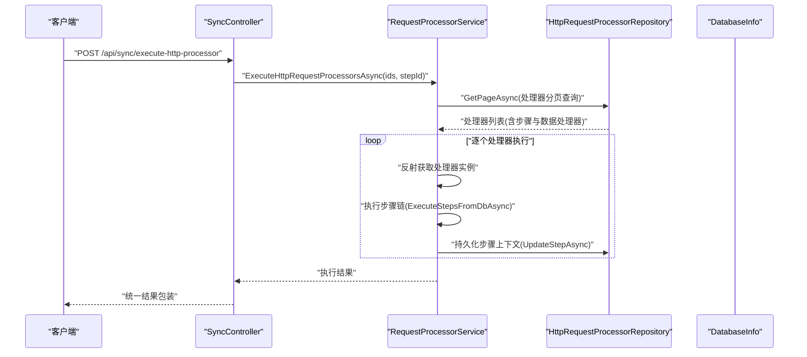
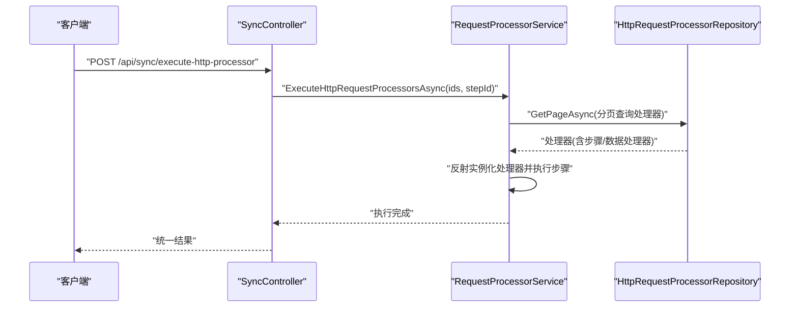
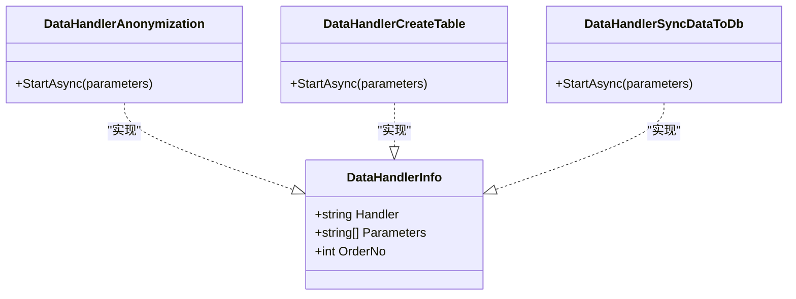
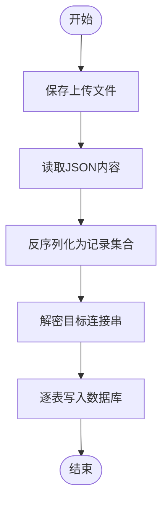
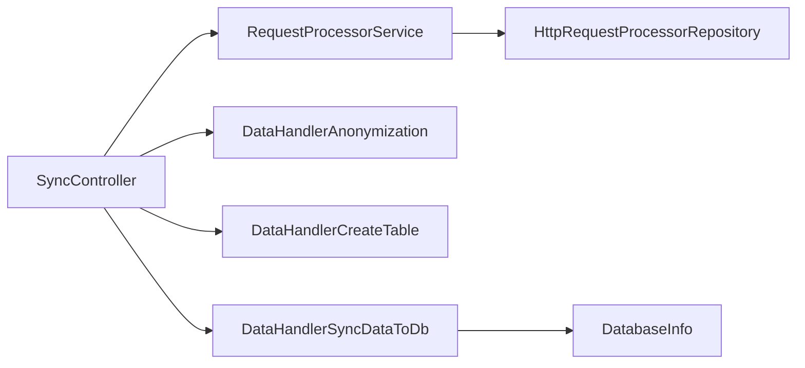

# 数据同步 API

<cite>
**本文引用的文件**
- [SyncController.cs](file://Sylas.RemoteTasks.App/Controllers/SyncController.cs)
- [RequestProcessorService.cs](file://Sylas.RemoteTasks.App/RequestProcessor/RequestProcessorService.cs)
- [HttpRequestProcessorRepository.cs](file://Sylas.RemoteTasks.App/RequestProcessor/HttpRequestProcessorRepository.cs)
- [HttpRequestProcessor.cs](file://Sylas.RemoteTasks.App/RequestProcessor/Models/HttpRequestProcessor.cs)
- [HttpRequestProcessorStep.cs](file://Sylas.RemoteTasks.App/RequestProcessor/Models/HttpRequestProcessorStep.cs)
- [HttpRequestProcessorStepDataHandlers.cs](file://Sylas.RemoteTasks.App/RequestProcessor/Models/HttpRequestProcessorStepDataHandlers.cs)
- [ProcessorExecuteDto.cs](file://Sylas.RemoteTasks.App/RequestProcessor/Models/Dtos/ProcessorExecuteDto.cs)
- [DataHandler.cs](file://Sylas.RemoteTasks.App/DataHandlers/DataHandler.cs)
- [DataHandlerAnonymization.cs](file://Sylas.RemoteTasks.App/DataHandlers/DataHandlerAnonymization.cs)
- [DataHandlerCreateTable.cs](file://Sylas.RemoteTasks.App/DataHandlers/DataHandlerCreateTable.cs)
- [DataHandlerSyncDataToDb.cs](file://Sylas.RemoteTasks.App/DataHandlers/DataHandlerSyncDataToDb.cs)
- [TransferDataDto.cs](file://Sylas.RemoteTasks.Database/Dtos/TransferDataDto.cs)
- [SyncFromJsonsDto.cs](file://Sylas.RemoteTasks.Database/Dtos/SyncFromJsonsDto.cs)
- [DbConnectionInfo.cs](file://Sylas.RemoteTasks.Database/Dtos/DbConnectionInfo.cs)
- [DatabaseInfo.cs](file://Sylas.RemoteTasks.Database/SyncBase/DatabaseInfo.cs)
</cite>

## 目录
1. [简介](#简介)
2. [项目结构](#项目结构)
3. [核心组件](#核心组件)
4. [架构总览](#架构总览)
5. [详细组件分析](#详细组件分析)
6. [依赖关系分析](#依赖关系分析)
7. [性能考虑](#性能考虑)
8. [故障排查指南](#故障排查指南)
9. [结论](#结论)
10. [附录](#附录)

## 简介
本文件为“数据同步 API”的权威文档，覆盖以下主题：
- 数据同步配置：处理器、步骤与数据处理器的增删改查与克隆
- 同步执行：基于处理器的批量执行与单步执行
- 同步状态查询：分页查询处理器、步骤与数据处理器
- 数据同步处理器使用：如何通过控制器接口配置与执行
- 表结构创建：自动建表能力（按列定义）
- 数据匿名化：对 JSON 记录进行字段脱敏
- 数据导入：从 JSON 文件导入数据到数据库
- 数据库迁移：源库到目标库的表级或记录级迁移
- 同步策略：全量与增量同步的差异与实践建议
- 性能优化与监控指标：连接池、批处理、事务与日志

## 项目结构
围绕“数据同步”功能，系统主要由以下模块构成：
- 控制器层：提供 HTTP 接口，负责参数校验、调用服务与返回统一结果
- 请求处理器层：封装“处理器-步骤-数据处理器”的执行链路
- 数据处理器层：实现具体的数据处理逻辑（建表、导入、脱敏等）
- 数据库访问层：提供数据库连接、建表、迁移、分页查询等能力

图表来源
- [SyncController.cs](file://Sylas.RemoteTasks.App/Controllers/SyncController.cs#L1-L457)
- [RequestProcessorService.cs](file://Sylas.RemoteTasks.App/RequestProcessor/RequestProcessorService.cs#L1-L72)
- [HttpRequestProcessorRepository.cs](file://Sylas.RemoteTasks.App/RequestProcessor/HttpRequestProcessorRepository.cs#L1-L412)
- [HttpRequestProcessor.cs](file://Sylas.RemoteTasks.App/RequestProcessor/Models/HttpRequestProcessor.cs#L1-L22)
- [HttpRequestProcessorStep.cs](file://Sylas.RemoteTasks.App/RequestProcessor/Models/HttpRequestProcessorStep.cs#L1-L19)
- [HttpRequestProcessorStepDataHandlers.cs](file://Sylas.RemoteTasks.App/RequestProcessor/Models/HttpRequestProcessorStepDataHandlers.cs#L1-L15)
- [DataHandler.cs](file://Sylas.RemoteTasks.App/DataHandlers/DataHandler.cs#L1-L16)
- [DataHandlerAnonymization.cs](file://Sylas.RemoteTasks.App/DataHandlers/DataHandlerAnonymization.cs#L1-L42)
- [DataHandlerCreateTable.cs](file://Sylas.RemoteTasks.App/DataHandlers/DataHandlerCreateTable.cs#L1-L34)
- [DataHandlerSyncDataToDb.cs](file://Sylas.RemoteTasks.App/DataHandlers/DataHandlerSyncDataToDb.cs#L1-L65)
- [TransferDataDto.cs](file://Sylas.RemoteTasks.Database/Dtos/TransferDataDto.cs#L1-L30)
- [SyncFromJsonsDto.cs](file://Sylas.RemoteTasks.Database/Dtos/SyncFromJsonsDto.cs#L1-L18)
- [DbConnectionInfo.cs](file://Sylas.RemoteTasks.Database/Dtos/DbConnectionInfo.cs#L1-L34)
- [DatabaseInfo.cs](file://Sylas.RemoteTasks.Database/SyncBase/DatabaseInfo.cs#L1-L800)

章节来源
- [SyncController.cs](file://Sylas.RemoteTasks.App/Controllers/SyncController.cs#L1-L457)
- [RequestProcessorService.cs](file://Sylas.RemoteTasks.App/RequestProcessor/RequestProcessorService.cs#L1-L72)
- [HttpRequestProcessorRepository.cs](file://Sylas.RemoteTasks.App/RequestProcessor/HttpRequestProcessorRepository.cs#L1-L412)

## 核心组件
- SyncController：提供同步配置、执行、查询与数据导入/迁移接口
- RequestProcessorService：根据处理器配置执行步骤链，并维护上下文
- HttpRequestProcessorRepository：持久化与分页查询处理器、步骤、数据处理器
- DataHandler*：内置数据处理器（匿名化、建表、写库）
- DatabaseInfo：数据库连接、建表、迁移、分页查询等底层能力

章节来源
- [SyncController.cs](file://Sylas.RemoteTasks.App/Controllers/SyncController.cs#L1-L457)
- [RequestProcessorService.cs](file://Sylas.RemoteTasks.App/RequestProcessor/RequestProcessorService.cs#L1-L72)
- [HttpRequestProcessorRepository.cs](file://Sylas.RemoteTasks.App/RequestProcessor/HttpRequestProcessorRepository.cs#L1-L412)
- [DataHandlerAnonymization.cs](file://Sylas.RemoteTasks.App/DataHandlers/DataHandlerAnonymization.cs#L1-L42)
- [DataHandlerCreateTable.cs](file://Sylas.RemoteTasks.App/DataHandlers/DataHandlerCreateTable.cs#L1-L34)
- [DataHandlerSyncDataToDb.cs](file://Sylas.RemoteTasks.App/DataHandlers/DataHandlerSyncDataToDb.cs#L1-L65)
- [DatabaseInfo.cs](file://Sylas.RemoteTasks.Database/SyncBase/DatabaseInfo.cs#L1-L800)

## 架构总览
数据同步采用“配置驱动 + 数据处理器流水线”的架构：
- 配置层：处理器（含 URL、头信息、备注）、步骤（参数、请求体、上下文构建器）、数据处理器（处理器类名、参数、顺序、启用状态）
- 执行层：控制器接收请求，调用服务层，服务层按顺序执行步骤与数据处理器
- 数据层：通过 DatabaseInfo 统一管理数据库连接、建表、迁移与查询

图表来源
- [SyncController.cs](file://Sylas.RemoteTasks.App/Controllers/SyncController.cs#L29-L37)
- [RequestProcessorService.cs](file://Sylas.RemoteTasks.App/RequestProcessor/RequestProcessorService.cs#L11-L69)
- [HttpRequestProcessorRepository.cs](file://Sylas.RemoteTasks.App/RequestProcessor/HttpRequestProcessorRepository.cs#L23-L48)
- [DatabaseInfo.cs](file://Sylas.RemoteTasks.Database/SyncBase/DatabaseInfo.cs#L1-L800)

## 详细组件分析

### API 定义与统一响应
- 统一响应：所有接口返回统一的请求结果包装，包含成功标志、消息与数据载体
- 错误码：接口内部通过统一结果返回错误信息；HTTP 状态码遵循常规约定（如 200 成功、400 参数错误、404 资源不存在）

章节来源
- [SyncController.cs](file://Sylas.RemoteTasks.App/Controllers/SyncController.cs#L30-L37)
- [SyncController.cs](file://Sylas.RemoteTasks.App/Controllers/SyncController.cs#L44-L49)
- [SyncController.cs](file://Sylas.RemoteTasks.App/Controllers/SyncController.cs#L51-L62)

### 数据同步配置接口
- 处理器 CRUD 与克隆
  - 新增处理器：校验标题、名称/编码、URL 非空后入库
  - 更新处理器：校验 ID 存在性与必填字段后更新
  - 删除处理器：支持逗号分隔批量删除
  - 克隆处理器：复制处理器及其步骤与数据处理器
- 步骤 CRUD 与克隆
  - 新增步骤：校验参数、所属处理器与默认排序（OrderNo 递增）
  - 更新步骤：校验存在性后更新
  - 删除步骤：支持批量删除并级联清理数据处理器
  - 克隆步骤：复制步骤及其数据处理器
- 数据处理器 CRUD
  - 新增/更新/删除：校验必填字段与所属步骤，支持排序递增

章节来源
- [SyncController.cs](file://Sylas.RemoteTasks.App/Controllers/SyncController.cs#L65-L155)
- [SyncController.cs](file://Sylas.RemoteTasks.App/Controllers/SyncController.cs#L158-L262)
- [SyncController.cs](file://Sylas.RemoteTasks.App/Controllers/SyncController.cs#L264-L363)

### 数据同步执行接口
- 批量执行处理器
  - 方法：POST
  - 路径：/api/sync/execute-http-processor
  - 请求体：ProcessorExecuteDto（包含处理器ID数组与可选 StepId）
  - 行为：按 ID 查询处理器，依次执行其步骤链，支持仅执行到指定 StepId
  - 响应：统一结果包装
- 单步执行（通过 StepId 指定）

图表来源
- [SyncController.cs](file://Sylas.RemoteTasks.App/Controllers/SyncController.cs#L29-L37)
- [RequestProcessorService.cs](file://Sylas.RemoteTasks.App/RequestProcessor/RequestProcessorService.cs#L11-L69)
- [ProcessorExecuteDto.cs](file://Sylas.RemoteTasks.App/RequestProcessor/Models/Dtos/ProcessorExecuteDto.cs#L1-L9)

章节来源
- [SyncController.cs](file://Sylas.RemoteTasks.App/Controllers/SyncController.cs#L29-L37)
- [RequestProcessorService.cs](file://Sylas.RemoteTasks.App/RequestProcessor/RequestProcessorService.cs#L11-L69)
- [ProcessorExecuteDto.cs](file://Sylas.RemoteTasks.App/RequestProcessor/Models/Dtos/ProcessorExecuteDto.cs#L1-L9)

### 数据同步状态查询接口
- 查询处理器分页：GET /api/sync/get-http-request-processors
- 查询步骤分页：GET /api/sync/get-http-request-processor-steps
- 查询数据处理器分页：GET /api/sync/get-http-request-processor-step-data-handlers

章节来源
- [SyncController.cs](file://Sylas.RemoteTasks.App/Controllers/SyncController.cs#L44-L62)

### 数据处理器使用
- DataHandlerInfo：描述处理器类名、参数列表与执行顺序
- DataHandlerAnonymization：对 JSON 记录中的指定字段进行脱敏（保留前半部分并追加掩码）
- DataHandlerCreateTable：根据列定义在目标库创建表（若不存在）
- DataHandlerSyncDataToDb：将数据写入目标库表，支持切换数据库或设置连接串

图表来源
- [DataHandler.cs](file://Sylas.RemoteTasks.App/DataHandlers/DataHandler.cs#L1-L16)
- [DataHandlerAnonymization.cs](file://Sylas.RemoteTasks.App/DataHandlers/DataHandlerAnonymization.cs#L1-L42)
- [DataHandlerCreateTable.cs](file://Sylas.RemoteTasks.App/DataHandlers/DataHandlerCreateTable.cs#L1-L34)
- [DataHandlerSyncDataToDb.cs](file://Sylas.RemoteTasks.App/DataHandlers/DataHandlerSyncDataToDb.cs#L1-L65)

章节来源
- [DataHandler.cs](file://Sylas.RemoteTasks.App/DataHandlers/DataHandler.cs#L1-L16)
- [DataHandlerAnonymization.cs](file://Sylas.RemoteTasks.App/DataHandlers/DataHandlerAnonymization.cs#L1-L42)
- [DataHandlerCreateTable.cs](file://Sylas.RemoteTasks.App/DataHandlers/DataHandlerCreateTable.cs#L1-L34)
- [DataHandlerSyncDataToDb.cs](file://Sylas.RemoteTasks.App/DataHandlers/DataHandlerSyncDataToDb.cs#L1-L65)

### 表结构创建（自动建表）
- 触发方式：通过数据处理器或直接调用数据库能力
- 输入：目标库标识、表名、列定义集合
- 行为：若表不存在则生成建表 SQL 并执行
- 注意：列定义需包含字段名、类型、是否主键等必要信息

章节来源
- [DataHandlerCreateTable.cs](file://Sylas.RemoteTasks.App/DataHandlers/DataHandlerCreateTable.cs#L17-L31)
- [DatabaseInfo.cs](file://Sylas.RemoteTasks.Database/SyncBase/DatabaseInfo.cs#L744-L797)

### 数据匿名化
- 触发方式：数据处理器
- 输入：数据记录集合、待脱敏字段列表
- 行为：遍历记录，对匹配字段进行长度折半并追加掩码
- 适用场景：PII 数据清洗、测试环境数据脱敏

章节来源
- [DataHandlerAnonymization.cs](file://Sylas.RemoteTasks.App/DataHandlers/DataHandlerAnonymization.cs#L7-L39)

### 数据导入（JSON → 数据库）
- 方法：POST
- 路径：/api/sync/from-json
- 请求方式：表单提交（文件上传 + 目标连接串 + 目标表名）
- 行为：保存上传文件，读取 JSON，反序列化为记录集合，按目标表逐个写入
- 注意：目标连接串需在数据库连接信息表中存在并可解密

图表来源
- [SyncController.cs](file://Sylas.RemoteTasks.App/Controllers/SyncController.cs#L424-L454)
- [SyncFromJsonsDto.cs](file://Sylas.RemoteTasks.Database/Dtos/SyncFromJsonsDto.cs#L1-L18)
- [DbConnectionInfo.cs](file://Sylas.RemoteTasks.Database/Dtos/DbConnectionInfo.cs#L1-L34)

章节来源
- [SyncController.cs](file://Sylas.RemoteTasks.App/Controllers/SyncController.cs#L424-L454)
- [SyncFromJsonsDto.cs](file://Sylas.RemoteTasks.Database/Dtos/SyncFromJsonsDto.cs#L1-L18)
- [DbConnectionInfo.cs](file://Sylas.RemoteTasks.Database/Dtos/DbConnectionInfo.cs#L1-L34)

### 数据库迁移（库间迁移）
- 方法：POST
- 路径：/api/sync/transfer
- 请求体：TransferDataDto（源/目标连接串、源/目标表、仅插入模式）
- 行为：解密连接串，支持单表或多表映射迁移；支持仅插入不删除
- 注意：源/目标连接串需在连接信息表中存在

章节来源
- [SyncController.cs](file://Sylas.RemoteTasks.App/Controllers/SyncController.cs#L370-L412)
- [TransferDataDto.cs](file://Sylas.RemoteTasks.Database/Dtos/TransferDataDto.cs#L1-L30)
- [DbConnectionInfo.cs](file://Sylas.RemoteTasks.Database/Dtos/DbConnectionInfo.cs#L1-L34)

### 同步策略：全量与增量
- 全量同步
  - 定义：覆盖式写入，通常先清空或按条件清理，再写入新数据
  - 实现：通过“仅插入”模式关闭或配合删除步骤实现
- 增量同步
  - 定义：仅同步新增或变更的数据
  - 实现：在步骤中加入过滤条件（如时间戳范围）或使用数据处理器进行去重/对比
- 建议
  - 使用时间戳字段作为增量判断依据
  - 在数据处理器中实现“去重/对比”逻辑，避免重复写入
  - 对大表采用分页/批处理策略

（本节为概念性说明，不直接分析具体文件）

## 依赖关系分析
- 控制器依赖服务层与仓储层
- 服务层依赖仓储层与反射机制
- 数据处理器依赖数据库访问层
- 数据库访问层依赖多种数据库驱动与连接字符串解析

图表来源
- [SyncController.cs](file://Sylas.RemoteTasks.App/Controllers/SyncController.cs#L1-L457)
- [RequestProcessorService.cs](file://Sylas.RemoteTasks.App/RequestProcessor/RequestProcessorService.cs#L1-L72)
- [HttpRequestProcessorRepository.cs](file://Sylas.RemoteTasks.App/RequestProcessor/HttpRequestProcessorRepository.cs#L1-L412)
- [DataHandlerAnonymization.cs](file://Sylas.RemoteTasks.App/DataHandlers/DataHandlerAnonymization.cs#L1-L42)
- [DataHandlerCreateTable.cs](file://Sylas.RemoteTasks.App/DataHandlers/DataHandlerCreateTable.cs#L1-L34)
- [DataHandlerSyncDataToDb.cs](file://Sylas.RemoteTasks.App/DataHandlers/DataHandlerSyncDataToDb.cs#L1-L65)
- [DatabaseInfo.cs](file://Sylas.RemoteTasks.Database/SyncBase/DatabaseInfo.cs#L1-L800)

章节来源
- [SyncController.cs](file://Sylas.RemoteTasks.App/Controllers/SyncController.cs#L1-L457)
- [RequestProcessorService.cs](file://Sylas.RemoteTasks.App/RequestProcessor/RequestProcessorService.cs#L1-L72)
- [HttpRequestProcessorRepository.cs](file://Sylas.RemoteTasks.App/RequestProcessor/HttpRequestProcessorRepository.cs#L1-L412)
- [DatabaseInfo.cs](file://Sylas.RemoteTasks.Database/SyncBase/DatabaseInfo.cs#L1-L800)

## 性能考虑
- 连接池与并发
  - 使用连接池减少连接开销，避免频繁创建/销毁连接
  - 对多表导入采用并行任务（注意控制并发度，避免数据库压力过大）
- 批处理与事务
  - 写库时尽量使用批量插入/更新，减少往返次数
  - 将一批操作置于同一事务中，提升一致性与吞吐
- 分页与索引
  - 查询与迁移时使用分页，避免一次性加载过多数据
  - 确保用于过滤的字段（如时间戳、主键）具备索引
- 日志与监控
  - 记录关键耗时（SQL 执行、序列化/反序列化、网络请求）
  - 监控数据库连接数、QPS、错误率与队列长度

（本节提供通用指导，不直接分析具体文件）

## 故障排查指南
- 参数校验失败
  - 处理器/步骤/数据处理器必填字段为空时，接口会返回统一错误
- 资源不存在
  - 更新/删除前检查资源是否存在；找不到时返回相应提示
- 连接串问题
  - 目标连接串需存在于连接信息表中且可解密；否则返回无效连接串提示
- 数据库异常
  - 建表/迁移过程中捕获异常并回滚事务；关注表不存在、权限不足等常见错误

章节来源
- [SyncController.cs](file://Sylas.RemoteTasks.App/Controllers/SyncController.cs#L67-L88)
- [SyncController.cs](file://Sylas.RemoteTasks.App/Controllers/SyncController.cs#L112-L123)
- [SyncController.cs](file://Sylas.RemoteTasks.App/Controllers/SyncController.cs#L378-L390)
- [SyncController.cs](file://Sylas.RemoteTasks.App/Controllers/SyncController.cs#L445-L448)

## 结论
本数据同步 API 通过“处理器-步骤-数据处理器”的配置化执行模型，提供了灵活、可扩展的数据同步能力。结合自动建表、匿名化与库间迁移等内置处理器，能够满足大多数数据集成场景。建议在生产环境中重视参数校验、连接池与事务管理，并建立完善的日志与监控体系。

## 附录

### API 一览（按模块）
- 处理器配置
  - POST /api/sync/add-http-request-processor
  - PUT /api/sync/update-http-request-processor
  - DELETE /api/sync/delete-http-request-processor
  - POST /api/sync/clone-processor
- 步骤配置
  - POST /api/sync/add-http-request-processor-step
  - PUT /api/sync/update-http-request-processor-step
  - DELETE /api/sync/delete-http-request-processor-step
  - POST /api/sync/clone-step
- 数据处理器配置
  - POST /api/sync/add-http-request-processor-step-data-handler
  - PUT /api/sync/update-http-request-processor-step-data-handler
  - DELETE /api/sync/delete-http-request-processor-step-data-handler
- 执行与查询
  - POST /api/sync/execute-http-processor
  - POST /api/sync/get-http-request-processors
  - POST /api/sync/get-http-request-processor-steps
  - POST /api/sync/get-http-request-processor-step-data-handlers
- 数据导入与迁移
  - POST /api/sync/from-json
  - POST /api/sync/transfer

章节来源
- [SyncController.cs](file://Sylas.RemoteTasks.App/Controllers/SyncController.cs#L65-L454)

### 请求参数与响应格式示例（路径引用）
- 批量执行处理器
  - 请求体：ProcessorExecuteDto
  - 响应：统一结果包装
  - 参考路径：[ProcessorExecuteDto.cs](file://Sylas.RemoteTasks.App/RequestProcessor/Models/Dtos/ProcessorExecuteDto.cs#L1-L9)
- 库间迁移
  - 请求体：TransferDataDto
  - 响应：统一结果包装
  - 参考路径：[TransferDataDto.cs](file://Sylas.RemoteTasks.Database/Dtos/TransferDataDto.cs#L1-L30)
- JSON 导入
  - 表单：文件、目标连接串、目标表
  - 响应：统一结果包装
  - 参考路径：[SyncFromJsonsDto.cs](file://Sylas.RemoteTasks.Database/Dtos/SyncFromJsonsDto.cs#L1-L18)

章节来源
- [ProcessorExecuteDto.cs](file://Sylas.RemoteTasks.App/RequestProcessor/Models/Dtos/ProcessorExecuteDto.cs#L1-L9)
- [TransferDataDto.cs](file://Sylas.RemoteTasks.Database/Dtos/TransferDataDto.cs#L1-L30)
- [SyncFromJsonsDto.cs](file://Sylas.RemoteTasks.Database/Dtos/SyncFromJsonsDto.cs#L1-L18)