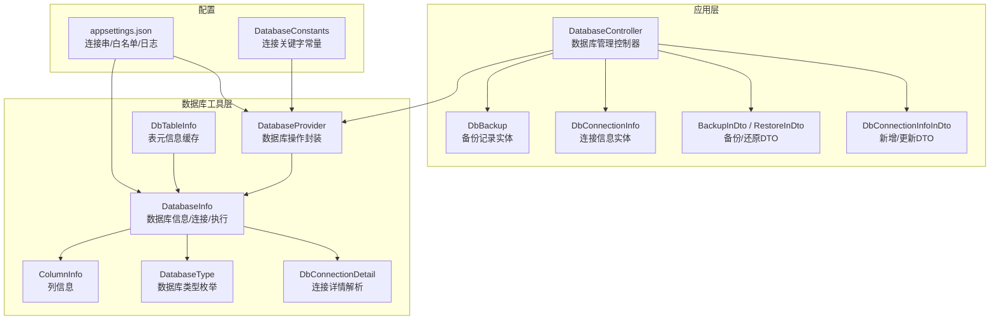
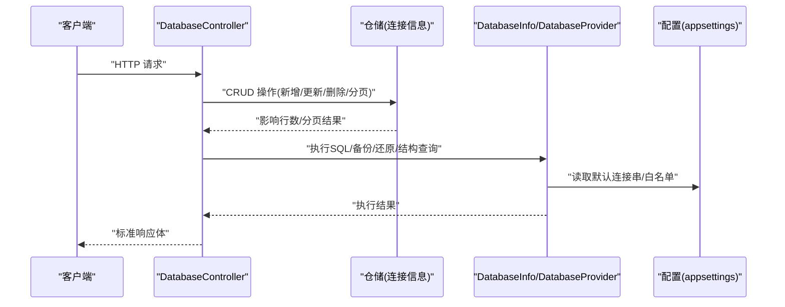
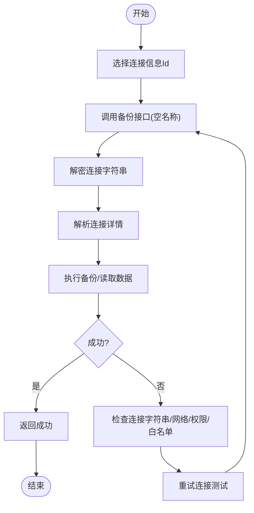
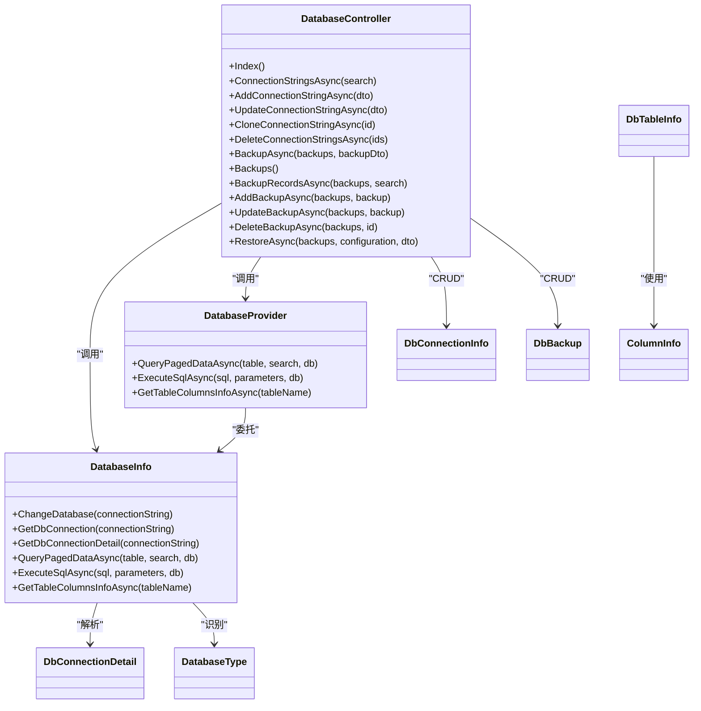

# 数据库管理 API

<cite>
**本文引用的文件**
- [DatabaseController.cs](file://Sylas.RemoteTasks.App/Controllers/DatabaseController.cs)
- [DbConnectionInfo.cs](file://Sylas.RemoteTasks.Database/Dtos/DbConnectionInfo.cs)
- [DatabaseType.cs](file://Sylas.RemoteTasks.Database/SyncBase/DatabaseType.cs)
- [DatabaseInfo.cs](file://Sylas.RemoteTasks.Database/SyncBase/DatabaseInfo.cs)
- [DatabaseProvider.cs](file://Sylas.RemoteTasks.Database/DatabaseProvider.cs)
- [DbBackup.cs](file://Sylas.RemoteTasks.App/DatabaseManager/Models/DbBackup.cs)
- [DbConnectionDetail.cs](file://Sylas.RemoteTasks.Database/SyncBase/DbConnectionDetail.cs)
- [ColumnInfo.cs](file://Sylas.RemoteTasks.Database/Dtos/ColumnInfo.cs)
- [DbTableInfo.cs](file://Sylas.RemoteTasks.Database/SyncBase/DbTableInfo.cs)
- [DatabaseConstants.cs](file://Sylas.RemoteTasks.Utils/Constants/DatabaseConstants.cs)
- [DbConnectionInfoInDto.cs](file://Sylas.RemoteTasks.App/DatabaseManager/Models/Dtos/DbConnectionInfoInDto.cs)
- [BackupInDto.cs](file://Sylas.RemoteTasks.App/DatabaseManager/Models/Dtos/BackupInDto.cs)
- [RestoreInDto.cs](file://Sylas.RemoteTasks.App/DatabaseManager/Models/Dtos/RestoreInDto.cs)
- [appsettings.json](file://Sylas.RemoteTasks.App/appsettings.json)
</cite>

## 目录
1. [简介](#简介)
2. [项目结构](#项目结构)
3. [核心组件](#核心组件)
4. [架构总览](#架构总览)
5. [详细组件分析](#详细组件分析)
6. [依赖关系分析](#依赖关系分析)
7. [性能考量](#性能考量)
8. [故障排除指南](#故障排除指南)
9. [结论](#结论)
10. [附录](#附录)

## 简介
本文件为数据库管理 API 的权威技术文档，覆盖数据库连接配置、连接测试、数据库信息查询、备份与还原、以及连接信息的增删改查等能力。文档面向开发者与运维人员，提供端点清单、请求/响应规范、错误码说明、最佳实践与故障排除建议，并解释数据库类型支持与连接池管理策略。

## 项目结构
数据库管理 API 主要位于应用层控制器与数据库层工具类之间，采用分层设计：
- 控制器层：集中处理 HTTP 请求、参数校验与结果封装
- 数据模型层：定义连接信息、备份记录、列信息等实体与 DTO
- 数据库工具层：提供数据库类型识别、连接对象创建、SQL 执行、备份/还原等能力
- 配置层：应用配置文件中包含连接字符串、允许的关键字白名单等

图表来源
- [DatabaseController.cs](file://Sylas.RemoteTasks.App/Controllers/DatabaseController.cs#L18-L235)
- [DbConnectionInfoInDto.cs](file://Sylas.RemoteTasks.App/DatabaseManager/Models/Dtos/DbConnectionInfoInDto.cs#L6-L34)
- [BackupInDto.cs](file://Sylas.RemoteTasks.App/DatabaseManager/Models/Dtos/BackupInDto.cs#L6-L26)
- [RestoreInDto.cs](file://Sylas.RemoteTasks.App/DatabaseManager/Models/Dtos/RestoreInDto.cs#L6-L22)
- [DbConnectionInfo.cs](file://Sylas.RemoteTasks.Database/Dtos/DbConnectionInfo.cs#L10-L34)
- [DbBackup.cs](file://Sylas.RemoteTasks.App/DatabaseManager/Models/DbBackup.cs#L10-L48)
- [DatabaseProvider.cs](file://Sylas.RemoteTasks.Database/DatabaseProvider.cs#L19-L485)
- [DatabaseInfo.cs](file://Sylas.RemoteTasks.Database/SyncBase/DatabaseInfo.cs#L64-L88)
- [DbConnectionDetail.cs](file://Sylas.RemoteTasks.Database/SyncBase/DbConnectionDetail.cs#L6-L55)
- [DatabaseType.cs](file://Sylas.RemoteTasks.Database/SyncBase/DatabaseType.cs#L6-L38)
- [ColumnInfo.cs](file://Sylas.RemoteTasks.Database/Dtos/ColumnInfo.cs#L6-L55)
- [DbTableInfo.cs](file://Sylas.RemoteTasks.Database/SyncBase/DbTableInfo.cs#L18-L109)
- [appsettings.json](file://Sylas.RemoteTasks.App/appsettings.json#L20-L27)
- [DatabaseConstants.cs](file://Sylas.RemoteTasks.Utils/Constants/DatabaseConstants.cs#L6-L14)

章节来源
- [DatabaseController.cs](file://Sylas.RemoteTasks.App/Controllers/DatabaseController.cs#L18-L235)
- [appsettings.json](file://Sylas.RemoteTasks.App/appsettings.json#L20-L27)

## 核心组件
- 数据库管理控制器：提供连接信息的增删改查、备份与还原、备份记录管理等接口
- 数据库信息工具：负责连接字符串解析、数据库类型识别、连接对象创建、SQL 执行与事务控制
- 数据库操作封装：提供分页查询、动态更新、插入、删除、表结构获取等通用能力
- 数据模型与 DTO：定义连接信息、备份记录、列信息等数据结构
- 配置与常量：连接串默认值、关键字白名单、数据库类型枚举

章节来源
- [DatabaseController.cs](file://Sylas.RemoteTasks.App/Controllers/DatabaseController.cs#L18-L235)
- [DatabaseInfo.cs](file://Sylas.RemoteTasks.Database/SyncBase/DatabaseInfo.cs#L64-L88)
- [DatabaseProvider.cs](file://Sylas.RemoteTasks.Database/DatabaseProvider.cs#L19-L485)
- [DbConnectionInfo.cs](file://Sylas.RemoteTasks.Database/Dtos/DbConnectionInfo.cs#L10-L34)
- [DbBackup.cs](file://Sylas.RemoteTasks.App/DatabaseManager/Models/DbBackup.cs#L10-L48)
- [DatabaseType.cs](file://Sylas.RemoteTasks.Database/SyncBase/DatabaseType.cs#L6-L38)
- [ColumnInfo.cs](file://Sylas.RemoteTasks.Database/Dtos/ColumnInfo.cs#L6-L55)
- [DbTableInfo.cs](file://Sylas.RemoteTasks.Database/SyncBase/DbTableInfo.cs#L18-L109)
- [DatabaseConstants.cs](file://Sylas.RemoteTasks.Utils/Constants/DatabaseConstants.cs#L6-L14)
- [appsettings.json](file://Sylas.RemoteTasks.App/appsettings.json#L20-L27)

## 架构总览
数据库管理 API 的调用链路如下：
- 控制器接收请求，进行参数校验与业务编排
- 通过仓储层持久化连接信息
- 通过数据库工具层执行 SQL、备份/还原、结构查询等
- 结果统一包装为标准响应格式返回

图表来源
- [DatabaseController.cs](file://Sylas.RemoteTasks.App/Controllers/DatabaseController.cs#L30-L235)
- [DatabaseInfo.cs](file://Sylas.RemoteTasks.Database/SyncBase/DatabaseInfo.cs#L81-L88)
- [DatabaseProvider.cs](file://Sylas.RemoteTasks.Database/DatabaseProvider.cs#L25-L33)
- [appsettings.json](file://Sylas.RemoteTasks.App/appsettings.json#L20-L27)

## 详细组件分析

### 数据库连接信息管理
- 新增连接信息
  - 方法与路径：POST /Database/AddConnectionStringAsync
  - 请求体：DbConnectionInfoInDto（包含名称、别名、连接字符串、备注、排序）
  - 行为：对连接字符串进行 AES 加密后入库
  - 响应：RequestResult<bool>，成功返回 true
  - 错误码：无特定错误码，失败返回 false 或异常
- 更新连接信息
  - 方法与路径：POST /Database/UpdateConnectionStringAsync
  - 请求体：DbConnectionInfoUpdateDto（包含 Id 与上述字段）
  - 行为：若连接字符串包含关键字，则重新加密；更新实体字段
  - 响应：RequestResult<bool>，失败返回错误消息
- 删除连接信息
  - 方法与路径：POST /Database/DeleteConnectionStringsAsync
  - 请求体：字符串 ids（逗号分隔）
  - 行为：逐个删除
  - 响应：RequestResult<bool>
- 克隆连接信息
  - 方法与路径：POST /Database/CloneConnectionStringAsync
  - 请求体：int id
  - 行为：按 id 查询并新增一条相同记录
  - 响应：RequestResult<bool>
- 分页查询连接信息
  - 方法与路径：POST /Database/ConnectionStringsAsync
  - 请求体：DataSearch（可选）
  - 行为：默认按 OrderNo 升序排序
  - 响应：RequestResult<PagedData<DbConnectionInfo>>

章节来源
- [DatabaseController.cs](file://Sylas.RemoteTasks.App/Controllers/DatabaseController.cs#L30-L108)
- [DbConnectionInfoInDto.cs](file://Sylas.RemoteTasks.App/DatabaseManager/Models/Dtos/DbConnectionInfoInDto.cs#L6-L34)
- [DbConnectionInfo.cs](file://Sylas.RemoteTasks.Database/Dtos/DbConnectionInfo.cs#L10-L34)
- [DatabaseConstants.cs](file://Sylas.RemoteTasks.Utils/Constants/DatabaseConstants.cs#L6-L14)

### 备份与还原管理
- 备份数据库
  - 方法与路径：POST /Database/BackupAsync
  - 请求体：BackupInDto（DbConnectionInfoId、Name、Remark、Tables）
  - 行为：解密连接字符串，按表备份至目录，统计大小并写入备份记录
  - 响应：RequestResult<bool>
  - 注意：备份名称为空时使用当前时间戳命名
- 备份记录分页查询
  - 方法与路径：POST /Database/BackupRecordsAsync
  - 请求体：DataSearch（可选）
  - 响应：RequestResult<PagedData<DbBackup>>
- 添加/更新/删除备份记录
  - 方法与路径：POST /Database/AddBackupAsync、POST /Database/UpdateBackupAsync、POST /Database/DeleteBackupAsync
  - 请求体：DbBackup、int id
  - 行为：删除时同时删除备份目录
  - 响应：RequestResult<bool>
- 还原数据库
  - 方法与路径：POST /Database/RestoreAsync
  - 请求体：RestoreInDto（Id、RestoreConnectionId、Tables）
  - 行为：校验目标连接是否在允许关键字白名单内，然后按表还原
  - 响应：RequestResult<bool>

章节来源
- [DatabaseController.cs](file://Sylas.RemoteTasks.App/Controllers/DatabaseController.cs#L115-L232)
- [BackupInDto.cs](file://Sylas.RemoteTasks.App/DatabaseManager/Models/Dtos/BackupInDto.cs#L6-L26)
- [RestoreInDto.cs](file://Sylas.RemoteTasks.App/DatabaseManager/Models/Dtos/RestoreInDto.cs#L6-L22)
- [DbBackup.cs](file://Sylas.RemoteTasks.App/DatabaseManager/Models/DbBackup.cs#L10-L48)
- [appsettings.json](file://Sylas.RemoteTasks.App/appsettings.json#L20-L23)

### 数据库信息查询与连接测试
- 连接字符串解析
  - 工具：DatabaseInfo.GetDbConnectionDetail
  - 支持类型：SQLite、MsSqlLocalDb、Oracle、MySql、SqlServer、Dm、Pg
  - 输出：DbConnectionDetail（Host、Port、Database、Account、Password、InstanceName、DatabaseType）
- 数据库类型识别
  - 工具：DatabaseInfo.GetDbType
  - 枚举：DatabaseType（MySql、SqlServer、Oracle、Pg、Dm、Sqlite、MsSqlLocalDb）
- 连接对象创建
  - 工具：DatabaseInfo.GetDbConnection
  - 支持：MySql、Oracle、SqlServer、Pg、Sqlite、Dm
- 连接测试流程（推荐）
  1) 通过 /Database/ConnectionStringsAsync 获取连接信息列表
  2) 选择某条连接，使用其 Id 调用 /Database/BackupAsync 并传入空 Name，触发备份逻辑
  3) 观察响应与日志，确认连接可用且可读写
  4) 若失败，检查连接字符串、网络、权限与白名单配置

图表来源
- [DatabaseController.cs](file://Sylas.RemoteTasks.App/Controllers/DatabaseController.cs#L115-L138)
- [DatabaseInfo.cs](file://Sylas.RemoteTasks.Database/SyncBase/DatabaseInfo.cs#L210-L299)

章节来源
- [DatabaseInfo.cs](file://Sylas.RemoteTasks.Database/SyncBase/DatabaseInfo.cs#L210-L299)
- [DatabaseType.cs](file://Sylas.RemoteTasks.Database/SyncBase/DatabaseType.cs#L6-L38)
- [DbConnectionDetail.cs](file://Sylas.RemoteTasks.Database/SyncBase/DbConnectionDetail.cs#L6-L55)

### 数据库操作工具
- 分页查询
  - DatabaseInfo.QueryPagedDataAsync<T>
  - DatabaseProvider.QueryPagedDataAsync<T>
  - 支持条件过滤、排序规则、分页参数
- 动态更新/插入/删除
  - DatabaseInfo.UpdateAsync
  - DatabaseInfo.InsertDataAsync
  - DatabaseInfo.DeleteAsync
  - 自动类型转换与参数绑定
- 表结构信息
  - DatabaseInfo.GetTableColumnsInfoAsync
  - DbTableInfo<T> 预编译 SQL 与参数映射
- SQL 执行与事务
  - DatabaseInfo.ExecuteSqlAsync/ExecuteSqlsAsync/ExecuteScalarAsync
  - 统一开启事务并回滚异常

章节来源
- [DatabaseInfo.cs](file://Sylas.RemoteTasks.Database/SyncBase/DatabaseInfo.cs#L309-L488)
- [DatabaseProvider.cs](file://Sylas.RemoteTasks.Database/DatabaseProvider.cs#L337-L484)
- [DbTableInfo.cs](file://Sylas.RemoteTasks.Database/SyncBase/DbTableInfo.cs#L18-L109)
- [ColumnInfo.cs](file://Sylas.RemoteTasks.Database/Dtos/ColumnInfo.cs#L6-L55)

### 数据库类型支持与连接池管理
- 支持的数据库类型
  - 枚举：MySql、SqlServer、Oracle、Pg、Dm、Sqlite、MsSqlLocalDb
- 连接对象与参数占位符
  - 不同数据库使用不同参数前缀（如 Oracle/Dm 使用冒号，其他常见使用 @）
- 连接池
  - 代码中未显式配置连接池参数，遵循各驱动默认行为
  - 建议在生产环境为 Oracle/SqlServer 等显式配置连接池参数（最大/最小池大小）

章节来源
- [DatabaseType.cs](file://Sylas.RemoteTasks.Database/SyncBase/DatabaseType.cs#L6-L38)
- [DatabaseInfo.cs](file://Sylas.RemoteTasks.Database/SyncBase/DatabaseInfo.cs#L150-L163)
- [DatabaseInfo.cs](file://Sylas.RemoteTasks.Database/SyncBase/DatabaseInfo.cs#L372-L400)

## 依赖关系分析
- 控制器依赖仓储与数据库工具层
- 数据库工具层依赖配置与常量
- 实体与 DTO 作为数据契约贯穿各层

图表来源
- [DatabaseController.cs](file://Sylas.RemoteTasks.App/Controllers/DatabaseController.cs#L18-L235)
- [DatabaseInfo.cs](file://Sylas.RemoteTasks.Database/SyncBase/DatabaseInfo.cs#L64-L88)
- [DatabaseProvider.cs](file://Sylas.RemoteTasks.Database/DatabaseProvider.cs#L19-L485)
- [DbConnectionInfo.cs](file://Sylas.RemoteTasks.Database/Dtos/DbConnectionInfo.cs#L10-L34)
- [DbBackup.cs](file://Sylas.RemoteTasks.App/DatabaseManager/Models/DbBackup.cs#L10-L48)
- [DbConnectionDetail.cs](file://Sylas.RemoteTasks.Database/SyncBase/DbConnectionDetail.cs#L6-L55)
- [DatabaseType.cs](file://Sylas.RemoteTasks.Database/SyncBase/DatabaseType.cs#L6-L38)
- [ColumnInfo.cs](file://Sylas.RemoteTasks.Database/Dtos/ColumnInfo.cs#L6-L55)
- [DbTableInfo.cs](file://Sylas.RemoteTasks.Database/SyncBase/DbTableInfo.cs#L18-L109)

## 性能考量
- 分页查询
  - 使用条件拼装与参数化查询，避免全表扫描
  - 建议在高频查询表上建立合适索引
- 动态更新
  - 自动类型转换与参数绑定，减少字符串拼接
  - 避免一次性更新过多字段，建议分批提交
- 备份/还原
  - 大批量数据备份建议限制并发与分批处理
  - 还原时注意目标库的锁与日志模式
- 连接池
  - 生产环境建议显式配置连接池参数，避免频繁创建/销毁连接
  - 对高并发场景，考虑连接池大小与超时设置

## 故障排除指南
- 连接字符串解析失败
  - 现象：抛出“连接字符串解析失败”异常
  - 排查：确认连接字符串格式与支持的正则匹配
  - 参考：DbConnectionDetail 解析逻辑
- 不支持的数据库类型
  - 现象：抛出“不支持的数据库连接字符串”
  - 排查：确认连接字符串是否符合已支持类型
  - 参考：GetDbConnection
- 白名单限制导致还原失败
  - 现象：返回“不允许还原到数据库”错误
  - 排查：检查 AllowedConnectionStringKeywords 配置
  - 参考：RestoreAsync 中的白名单校验
- 备份信息保存失败
  - 现象：备份执行成功但记录保存失败
  - 排查：检查日志输出与数据库写入权限
  - 参考：BackupAsync 中的日志记录
- 表不存在异常
  - 现象：执行 SQL 抛出“表不存在/无效的表”等异常
  - 排查：确认表是否存在或权限是否足够
  - 参考：IsTableNotExistException 与相关提示

章节来源
- [DatabaseInfo.cs](file://Sylas.RemoteTasks.Database/SyncBase/DatabaseInfo.cs#L298-L299)
- [DatabaseInfo.cs](file://Sylas.RemoteTasks.Database/SyncBase/DatabaseInfo.cs#L150-L163)
- [DatabaseController.cs](file://Sylas.RemoteTasks.App/Controllers/DatabaseController.cs#L213-L232)
- [DatabaseController.cs](file://Sylas.RemoteTasks.App/Controllers/DatabaseController.cs#L134-L136)
- [DatabaseInfo.cs](file://Sylas.RemoteTasks.Database/SyncBase/DatabaseInfo.cs#L733-L735)

## 结论
数据库管理 API 提供了从连接信息管理到备份还原的完整能力，结合数据库工具层实现了跨数据库类型的支持与安全的连接字符串处理。建议在生产环境中完善连接池配置、索引优化与监控告警，并严格遵守白名单策略以保障安全。

## 附录

### API 端点一览
- 连接信息管理
  - POST /Database/AddConnectionStringAsync
  - POST /Database/UpdateConnectionStringAsync
  - POST /Database/CloneConnectionStringAsync
  - POST /Database/DeleteConnectionStringsAsync
  - POST /Database/ConnectionStringsAsync
- 备份与还原
  - POST /Database/BackupAsync
  - POST /Database/Backups（视图）
  - POST /Database/BackupRecordsAsync
  - POST /Database/AddBackupAsync
  - POST /Database/UpdateBackupAsync
  - POST /Database/DeleteBackupAsync
  - POST /Database/RestoreAsync

章节来源
- [DatabaseController.cs](file://Sylas.RemoteTasks.App/Controllers/DatabaseController.cs#L30-L232)

### 请求与响应示例（说明性）
- 新增连接信息
  - 请求体：包含名称、别名、连接字符串、备注、排序
  - 成功响应：{"success":true,"data":true}
- 备份数据库
  - 请求体：包含连接信息Id、名称、备注、表名集合
  - 成功响应：{"success":true,"data":true}
- 还原数据库
  - 请求体：包含备份记录Id、目标连接Id、表名集合
  - 成功响应：{"success":true,"data":true}

章节来源
- [DbConnectionInfoInDto.cs](file://Sylas.RemoteTasks.App/DatabaseManager/Models/Dtos/DbConnectionInfoInDto.cs#L6-L34)
- [BackupInDto.cs](file://Sylas.RemoteTasks.App/DatabaseManager/Models/Dtos/BackupInDto.cs#L6-L26)
- [RestoreInDto.cs](file://Sylas.RemoteTasks.App/DatabaseManager/Models/Dtos/RestoreInDto.cs#L6-L22)

### 配置项参考
- 默认连接串
  - Default：用于默认数据库连接
- 允许的连接关键字白名单
  - AllowedConnectionStringKeywords：用于限制可还原的目标库

章节来源
- [appsettings.json](file://Sylas.RemoteTasks.App/appsettings.json#L20-L27)