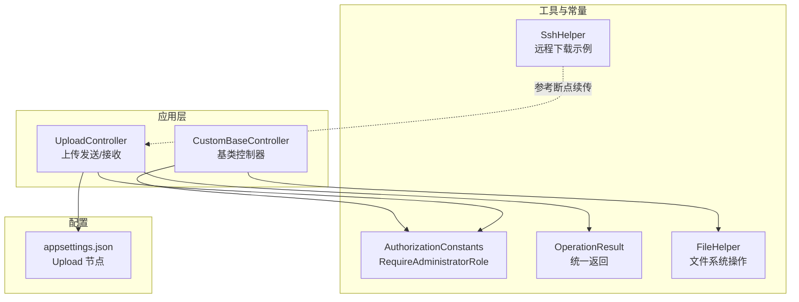
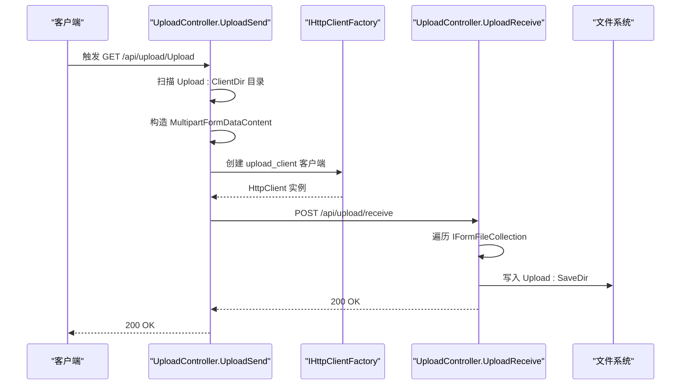
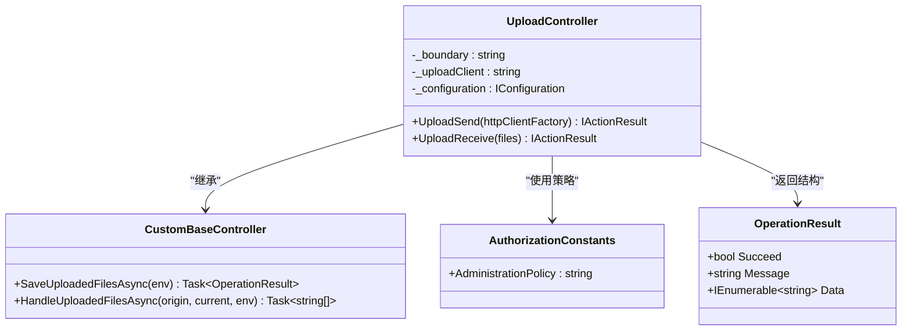
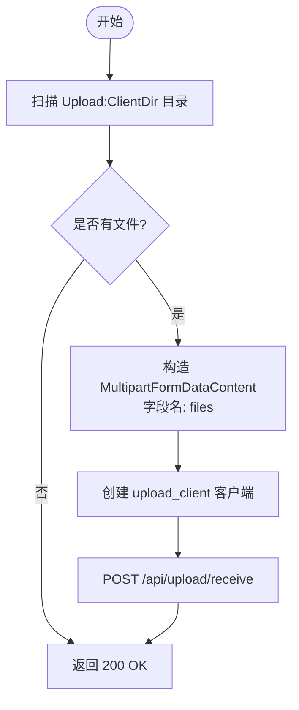
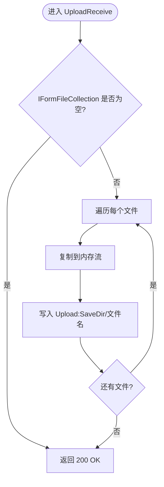
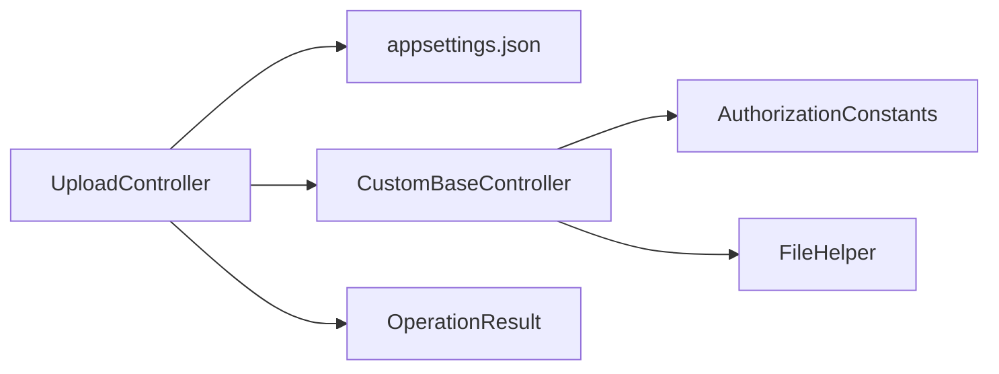

# 文件上传 API

<cite>
**本文引用的文件**
- [UploadController.cs](file://Sylas.RemoteTasks.App/Controllers/UploadController.cs)
- [CustomBaseController.cs](file://Sylas.RemoteTasks.App/Controllers/CustomBaseController.cs)
- [appsettings.json](file://Sylas.RemoteTasks.App/appsettings.json)
- [AuthorizationConstants.cs](file://Sylas.RemoteTasks.Utils/Constants/AuthorizationConstants.cs)
- [OperationResult.cs](file://Sylas.RemoteTasks.Common/Dtos/OperationResult.cs)
- [FileHelper.cs](file://Sylas.RemoteTasks.Utils/CommandExecutor/FileHelper.cs)
- [SshHelper.cs](file://Sylas.RemoteTasks.Utils/CommandExecutor/SshHelper.cs)
- [CustomActionFilter.cs](file://Sylas.RemoteTasks.App/Infrastructure/CustomActionFilter.cs)
</cite>

## 目录
1. [简介](#简介)
2. [项目结构](#项目结构)
3. [核心组件](#核心组件)
4. [架构总览](#架构总览)
5. [详细组件分析](#详细组件分析)
6. [依赖关系分析](#依赖关系分析)
7. [性能考量](#性能考量)
8. [故障排查指南](#故障排查指南)
9. [结论](#结论)
10. [附录](#附录)

## 简介
本文件上传 API 文档聚焦于仓库中现有的文件上传与接收能力，涵盖：
- 本地文件批量上传（客户端扫描本地目录并发送）
- 服务端接收并落盘
- 文件存储策略与访问控制
- 请求参数、响应格式与错误码
- 安全与性能优化建议
- 故障恢复机制说明

注意：当前代码库未实现“文件下载”和“文件管理（增删改查）”的通用 API；本文仅基于现有实现进行说明，并在附录给出扩展建议。

## 项目结构
与文件上传相关的关键位置如下：
- 控制器层：UploadController（上传发送与接收）
- 基类控制器：CustomBaseController（通用上传处理与权限策略）
- 配置：appsettings.json（Upload 节点包含 ClientDir、Host、SaveDir）
- 权限常量：AuthorizationConstants（RequireAdministratorRole）
- 结果模型：OperationResult（统一返回结构）
- 工具类：FileHelper（文件系统操作）、SshHelper（远程下载示例，可借鉴断点续传思路）

图表来源
- [UploadController.cs](file://Sylas.RemoteTasks.App/Controllers/UploadController.cs#L1-L83)
- [CustomBaseController.cs](file://Sylas.RemoteTasks.App/Controllers/CustomBaseController.cs#L1-L123)
- [appsettings.json](file://Sylas.RemoteTasks.App/appsettings.json#L39-L43)
- [AuthorizationConstants.cs](file://Sylas.RemoteTasks.Utils/Constants/AuthorizationConstants.cs#L1-L14)
- [OperationResult.cs](file://Sylas.RemoteTasks.Common/Dtos/OperationResult.cs#L1-L52)
- [FileHelper.cs](file://Sylas.RemoteTasks.Utils/CommandExecutor/FileHelper.cs#L1-L800)
- [SshHelper.cs](file://Sylas.RemoteTasks.Utils/CommandExecutor/SshHelper.cs#L433-L459)

章节来源
- [UploadController.cs](file://Sylas.RemoteTasks.App/Controllers/UploadController.cs#L1-L83)
- [CustomBaseController.cs](file://Sylas.RemoteTasks.App/Controllers/CustomBaseController.cs#L1-L123)
- [appsettings.json](file://Sylas.RemoteTasks.App/appsettings.json#L39-L43)

## 核心组件
- UploadController
  - 上传发送：扫描本地目录，构造多部分表单，向目标主机的接收端发起 POST
  - 上传接收：接收 IFormFileCollection，写入配置的保存目录
- CustomBaseController
  - 提供通用上传处理流程（保存文件、相对路径拼装等），并应用 RequireAdministratorRole 策略
- 配置
  - Upload.ClientDir：待上传的本地目录
  - Upload.Host：接收端主机地址
  - Upload.SaveDir：服务端保存目录
- 权限与过滤
  - 基类控制器应用 RequireAdministratorRole 策略
  - ActionFilter 在某些场景下检查认证状态并重定向登录
- 结果模型
  - OperationResult：统一返回结构（成功/失败、消息、数据）

章节来源
- [UploadController.cs](file://Sylas.RemoteTasks.App/Controllers/UploadController.cs#L1-L83)
- [CustomBaseController.cs](file://Sylas.RemoteTasks.App/Controllers/CustomBaseController.cs#L1-L123)
- [AuthorizationConstants.cs](file://Sylas.RemoteTasks.Utils/Constants/AuthorizationConstants.cs#L1-L14)
- [OperationResult.cs](file://Sylas.RemoteTasks.Common/Dtos/OperationResult.cs#L1-L52)
- [CustomActionFilter.cs](file://Sylas.RemoteTasks.App/Infrastructure/CustomActionFilter.cs#L1-L23)

## 架构总览
文件上传端到端流程（本地扫描 -> 远程传输 -> 服务端接收 -> 落盘）如下：

图表来源
- [UploadController.cs](file://Sylas.RemoteTasks.App/Controllers/UploadController.cs#L17-L80)
- [appsettings.json](file://Sylas.RemoteTasks.App/appsettings.json#L39-L43)

## 详细组件分析

### UploadController
- 端点与方法
  - GET /api/upload/Upload：扫描本地目录并发送文件
  - POST /api/upload/receive：接收文件并写入服务端
- 关键行为
  - 上传发送：使用 MultipartFormDataContent 构造表单，遍历本地文件并以“files”字段名附加到请求体
  - 上传接收：遍历 IFormFileCollection，将内存流写入 Upload:SaveDir 下的同名文件
- 配置依赖
  - Upload:ClientDir：本地扫描目录
  - Upload:Host：接收端主机
  - Upload:SaveDir：服务端保存目录
- 权限策略
  - 该控制器继承自 CustomBaseController，应用 RequireAdministratorRole 策略

图表来源
- [UploadController.cs](file://Sylas.RemoteTasks.App/Controllers/UploadController.cs#L1-L83)
- [CustomBaseController.cs](file://Sylas.RemoteTasks.App/Controllers/CustomBaseController.cs#L1-L123)
- [AuthorizationConstants.cs](file://Sylas.RemoteTasks.Utils/Constants/AuthorizationConstants.cs#L1-L14)
- [OperationResult.cs](file://Sylas.RemoteTasks.Common/Dtos/OperationResult.cs#L1-L52)

章节来源
- [UploadController.cs](file://Sylas.RemoteTasks.App/Controllers/UploadController.cs#L1-L83)
- [appsettings.json](file://Sylas.RemoteTasks.App/appsettings.json#L39-L43)

### 上传发送流程（UploadSend）
- 输入
  - 无显式查询参数；依赖配置 Upload:ClientDir
- 处理
  - 扫描目录，逐个读取文件字节，构造 MultipartFormDataContent，字段名为“files”
  - 通过 IHttpClientFactory 创建 upload_client 客户端，向 Upload:Host/api/upload/receive 发送 POST
- 输出
  - 200 OK

图表来源
- [UploadController.cs](file://Sylas.RemoteTasks.App/Controllers/UploadController.cs#L17-L53)
- [appsettings.json](file://Sylas.RemoteTasks.App/appsettings.json#L39-L43)

章节来源
- [UploadController.cs](file://Sylas.RemoteTasks.App/Controllers/UploadController.cs#L17-L53)

### 上传接收流程（UploadReceive）
- 输入
  - IFormFileCollection（来自表单字段“files”）
- 处理
  - 遍历每个文件，复制到内存流，再写入 Upload:SaveDir 下的同名文件
- 输出
  - 200 OK

图表来源
- [UploadController.cs](file://Sylas.RemoteTasks.App/Controllers/UploadController.cs#L55-L80)
- [appsettings.json](file://Sylas.RemoteTasks.App/appsettings.json#L39-L43)

章节来源
- [UploadController.cs](file://Sylas.RemoteTasks.App/Controllers/UploadController.cs#L55-L80)

### 权限与访问控制
- 策略
  - CustomBaseController 应用 RequireAdministratorRole 策略
- 过滤器
  - CustomActionFilter 在 ActionExecuted 阶段检查认证状态，未认证则重定向登录
- 建议
  - 若需细粒度权限（如按租户/项目），可在控制器或动作上增加自定义策略

章节来源
- [CustomBaseController.cs](file://Sylas.RemoteTasks.App/Controllers/CustomBaseController.cs#L11-L12)
- [AuthorizationConstants.cs](file://Sylas.RemoteTasks.Utils/Constants/AuthorizationConstants.cs#L11-L11)
- [CustomActionFilter.cs](file://Sylas.RemoteTasks.App/Infrastructure/CustomActionFilter.cs#L16-L19)

### 文件存储策略
- 本地落盘
  - 服务端将文件写入 Upload:SaveDir 目录，文件名保持不变
- 目录结构
  - 未见自动分桶/哈希目录策略；建议结合业务需求引入按日期/项目/用户等维度的子目录
- 安全
  - 建议对文件名进行白名单校验，避免路径穿越
  - 建议对文件类型进行白名单校验

章节来源
- [UploadController.cs](file://Sylas.RemoteTasks.App/Controllers/UploadController.cs#L65-L76)
- [appsettings.json](file://Sylas.RemoteTasks.App/appsettings.json#L39-L43)

### 文件大小限制、格式验证与安全
- 大小限制
  - 当前实现未显式设置上传大小限制；建议在 Kestrel 或 MVC 层配置最大请求体大小
- 格式验证
  - 当前未实现文件类型校验；建议在接收端增加 MIME 类型/扩展名校验
- 安全
  - 文件名与路径：建议对文件名进行清理，防止路径穿越
  - 访问控制：结合 RequireAdministratorRole 策略，确保仅授权用户可上传
  - 临时文件与磁盘空间：建议增加磁盘配额与清理策略

章节来源
- [UploadController.cs](file://Sylas.RemoteTasks.App/Controllers/UploadController.cs#L55-L80)

### 性能优化与故障恢复
- 优化建议
  - 流式写入：当前已使用内存流写入；可进一步采用流式管道减少内存占用
  - 并发与分块：大文件可考虑分块上传与并发写入
  - 断点续传：参考 SshHelper 的断点续传思路，结合文件长度与偏移量实现
- 故障恢复
  - 传输中断：建议在接收端记录已接收字节，失败时允许重试
  - 数据完整性：建议在接收端计算哈希并与客户端校验值比对

章节来源
- [SshHelper.cs](file://Sylas.RemoteTasks.Utils/CommandExecutor/SshHelper.cs#L433-L459)

## 依赖关系分析
- 控制器依赖
  - UploadController 依赖 IConfiguration（读取 Upload:* 配置）
  - UploadController 继承 CustomBaseController（获得通用上传处理与权限策略）
- 权限与常量
  - AuthorizationConstants 提供策略名称
- 结果模型
  - OperationResult 作为统一返回结构（当前接收端返回 Ok，未直接使用该模型）

图表来源
- [UploadController.cs](file://Sylas.RemoteTasks.App/Controllers/UploadController.cs#L1-L83)
- [CustomBaseController.cs](file://Sylas.RemoteTasks.App/Controllers/CustomBaseController.cs#L1-L123)
- [AuthorizationConstants.cs](file://Sylas.RemoteTasks.Utils/Constants/AuthorizationConstants.cs#L1-L14)
- [OperationResult.cs](file://Sylas.RemoteTasks.Common/Dtos/OperationResult.cs#L1-L52)
- [FileHelper.cs](file://Sylas.RemoteTasks.Utils/CommandExecutor/FileHelper.cs#L1-L800)

章节来源
- [UploadController.cs](file://Sylas.RemoteTasks.App/Controllers/UploadController.cs#L1-L83)
- [CustomBaseController.cs](file://Sylas.RemoteTasks.App/Controllers/CustomBaseController.cs#L1-L123)

## 性能考量
- 内存占用
  - 当前接收端将文件复制到内存流后再写入磁盘，适合中小文件；大文件可能导致内存压力
- I/O 模式
  - 建议采用异步流式写入，减少内存峰值
- 并发与吞吐
  - 建议限制并发上传数量，避免磁盘争用
- 网络与超时
  - 建议配置 HttpClient 超时与重试策略，提升稳定性

## 故障排查指南
- 常见问题
  - 未配置 Upload:* 导致异常：检查 appsettings.json 中 Upload:ClientDir、Upload:Host、Upload:SaveDir
  - 权限不足：确认 RequireAdministratorRole 策略生效
  - 文件名冲突：服务端同名文件会被覆盖
- 日志与监控
  - 建议在控制器与工具类中增加日志记录，便于定位问题
- 建议
  - 对关键路径增加 try/catch 并返回标准化错误码
  - 对磁盘空间与文件权限进行前置检查

章节来源
- [UploadController.cs](file://Sylas.RemoteTasks.App/Controllers/UploadController.cs#L32-L33)
- [appsettings.json](file://Sylas.RemoteTasks.App/appsettings.json#L39-L43)

## 结论
- 现有实现提供了从本地扫描到远程接收再到服务端落盘的完整链路
- 权限控制通过 RequireAdministratorRole 策略实现
- 建议补充：文件下载、文件管理、格式与大小限制、断点续传、统一错误码与日志

## 附录

### API 定义（基于现有实现）
- 上传发送（本地扫描并发送）
  - 方法：GET
  - 路径：/api/upload/Upload
  - 请求参数：无
  - 响应：200 OK
  - 说明：扫描 Upload:ClientDir，构造多部分表单，POST 到 Upload:Host/api/upload/receive
- 上传接收（服务端落盘）
  - 方法：POST
  - 路径：/api/upload/receive
  - 请求参数：files（IFormFileCollection）
  - 响应：200 OK
  - 说明：将文件写入 Upload:SaveDir

章节来源
- [UploadController.cs](file://Sylas.RemoteTasks.App/Controllers/UploadController.cs#L17-L80)
- [appsettings.json](file://Sylas.RemoteTasks.App/appsettings.json#L39-L43)

### 最佳实践
- 安全
  - 文件名白名单与路径清理
  - 文件类型白名单校验
  - 仅授权用户可上传
- 性能
  - 异步流式写入
  - 限制并发与分块上传
  - 配置合理的超时与重试
- 可靠性
  - 断点续传与完整性校验
  - 失败重试与幂等设计
  - 日志与监控

### 扩展建议（新增功能）
- 文件下载
  - 提供 GET /api/upload/download/{fileName}，校验权限后返回文件流
- 文件管理
  - 新增 CRUD 接口：列出、删除、清空历史版本
  - 支持分页与筛选
- 验证与限制
  - 配置最大文件大小、允许的 MIME 类型与扩展名
- 断点续传
  - 基于 SshHelper 的断点续传思路，实现分块上传与偏移量校验