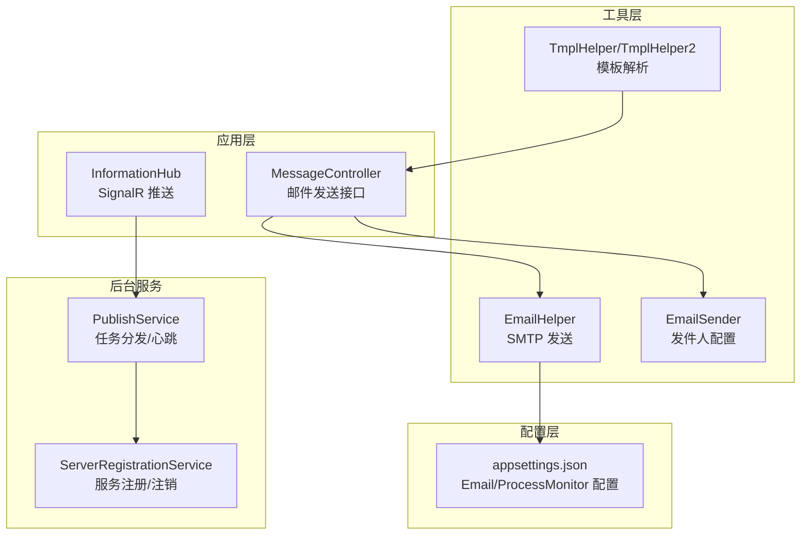
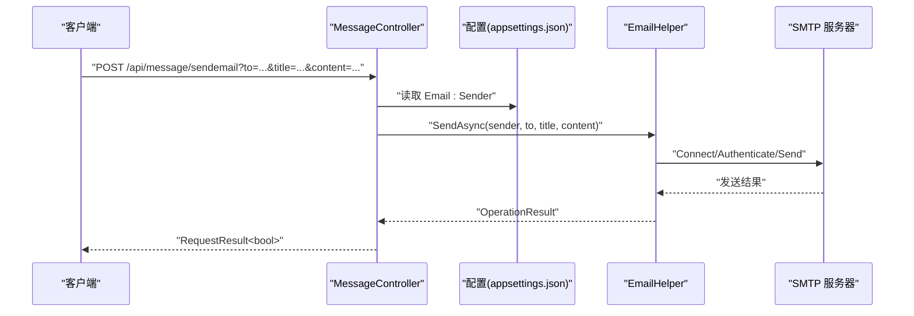
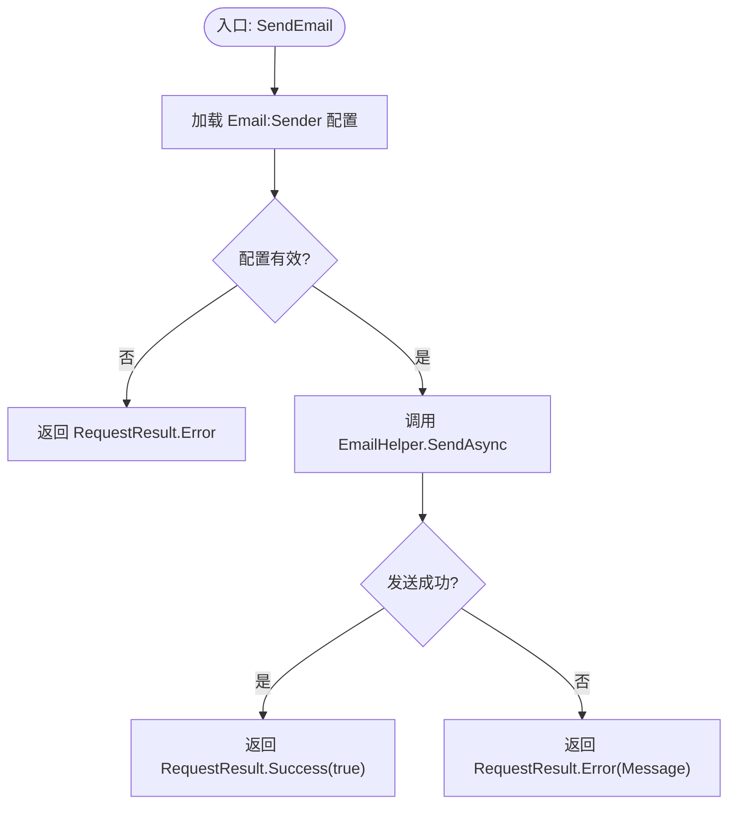
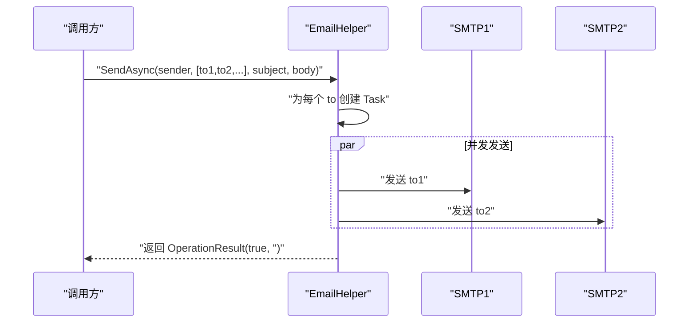
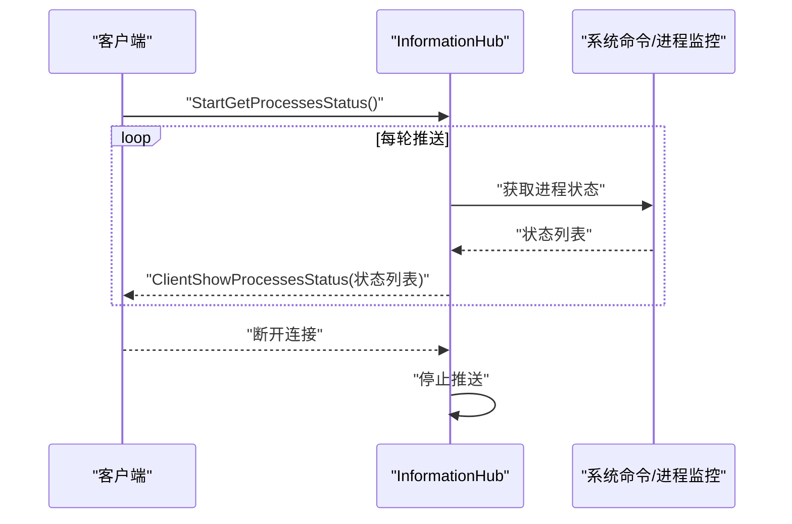
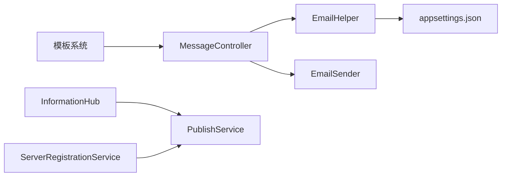

# 消息通知 API

<cite>
**本文档引用的文件**
- [MessageController.cs](file://Sylas.RemoteTasks.App/Controllers/MessageController.cs)
- [EmailHelper.cs](file://Sylas.RemoteTasks.Utils/Message/EmailHelper.cs)
- [EmailSender.cs](file://Sylas.RemoteTasks.Utils/Message/EmailSender.cs)
- [InformationHub.cs](file://Sylas.RemoteTasks.App/Hubs/InformationHub.cs)
- [RequestResult.cs](file://Sylas.RemoteTasks.Common/Dtos/RequestResult.cs)
- [OperationResult.cs](file://Sylas.RemoteTasks.Common/Dtos/OperationResult.cs)
- [appsettings.json](file://Sylas.RemoteTasks.App/appsettings.json)
- [PublishService.cs](file://Sylas.RemoteTasks.App/BackgroundServices/PublishService.cs)
- [ServerRegistrationService.cs](file://Sylas.RemoteTasks.App/BackgroundServices/ServerRegistrationService.cs)
- [TmplHelper.cs](file://Sylas.RemoteTasks.Utils/Template/TmplHelper.cs)
- [TmplHelper2.cs](file://Sylas.RemoteTasks.Utils/Template/TmplHelper2.cs)
</cite>

## 目录
1. [简介](#简介)
2. [项目结构](#项目结构)
3. [核心组件](#核心组件)
4. [架构总览](#架构总览)
5. [详细组件分析](#详细组件分析)
6. [依赖关系分析](#依赖关系分析)
7. [性能考量](#性能考量)
8. [故障排查指南](#故障排查指南)
9. [结论](#结论)
10. [附录](#附录)

## 简介
本文件为消息通知 API 的详细技术文档，覆盖邮件发送、消息推送、通知管理等能力。重点说明：
- 邮件发送接口：HTTP 方法、URL 路径、请求参数、响应格式与错误码
- 邮件配置与模板：配置项说明、模板解析与渲染能力
- 批量发送：并发发送策略与可靠性保障
- 可靠性与重试：异常处理、失败恢复与监控建议
- 性能优化与监控：并发控制、资源复用与可观测性

## 项目结构
消息通知相关模块主要分布在以下位置：
- 控制层：MessageController 提供邮件发送接口
- 工具层：EmailHelper/EmailSender 实现邮件发送与配置模型
- 通信层：InformationHub 提供 SignalR 推送能力
- 模板层：TmplHelper/TmplHelper2 提供模板解析与渲染
- 配置层：appsettings.json 提供邮件与进程监控配置
- 后台服务：PublishService/ServerRegistrationService 提供任务调度与服务注册，间接支撑通知分发

**图表来源**
- [MessageController.cs](file://Sylas.RemoteTasks.App/Controllers/MessageController.cs#L1-L18)
- [EmailHelper.cs](file://Sylas.RemoteTasks.Utils/Message/EmailHelper.cs#L1-L77)
- [EmailSender.cs](file://Sylas.RemoteTasks.Utils/Message/EmailSender.cs#L1-L33)
- [InformationHub.cs](file://Sylas.RemoteTasks.App/Hubs/InformationHub.cs#L1-L59)
- [appsettings.json](file://Sylas.RemoteTasks.App/appsettings.json#L125-L140)
- [PublishService.cs](file://Sylas.RemoteTasks.App/BackgroundServices/PublishService.cs#L1-L645)
- [ServerRegistrationService.cs](file://Sylas.RemoteTasks.App/BackgroundServices/ServerRegistrationService.cs#L1-L493)
- [TmplHelper.cs](file://Sylas.RemoteTasks.Utils/Template/TmplHelper.cs#L1-L740)
- [TmplHelper2.cs](file://Sylas.RemoteTasks.Utils/Template/TmplHelper2.cs#L1-L416)

**章节来源**
- [MessageController.cs](file://Sylas.RemoteTasks.App/Controllers/MessageController.cs#L1-L18)
- [EmailHelper.cs](file://Sylas.RemoteTasks.Utils/Message/EmailHelper.cs#L1-L77)
- [EmailSender.cs](file://Sylas.RemoteTasks.Utils/Message/EmailSender.cs#L1-L33)
- [InformationHub.cs](file://Sylas.RemoteTasks.App/Hubs/InformationHub.cs#L1-L59)
- [appsettings.json](file://Sylas.RemoteTasks.App/appsettings.json#L125-L140)
- [PublishService.cs](file://Sylas.RemoteTasks.App/BackgroundServices/PublishService.cs#L1-L645)
- [ServerRegistrationService.cs](file://Sylas.RemoteTasks.App/BackgroundServices/ServerRegistrationService.cs#L1-L493)
- [TmplHelper.cs](file://Sylas.RemoteTasks.Utils/Template/TmplHelper.cs#L1-L740)
- [TmplHelper2.cs](file://Sylas.RemoteTasks.Utils/Template/TmplHelper2.cs#L1-L416)

## 核心组件
- 邮件发送控制器：MessageController.SendEmail 提供单封邮件发送接口
- 邮件发送工具：EmailHelper.SendAsync 支持单收件人与多收件人并发发送
- 邮件配置模型：EmailSender 定义发件人凭据与 SMTP 参数
- 通知推送：InformationHub 提供 SignalR 推送能力
- 响应模型：RequestResult/OperationResult 统一响应结构
- 模板系统：TmplHelper/TmplHelper2 支持表达式解析与 for 循环渲染
- 配置中心：appsettings.json 提供 Email 与 ProcessMonitor 配置

**章节来源**
- [MessageController.cs](file://Sylas.RemoteTasks.App/Controllers/MessageController.cs#L1-L18)
- [EmailHelper.cs](file://Sylas.RemoteTasks.Utils/Message/EmailHelper.cs#L1-L77)
- [EmailSender.cs](file://Sylas.RemoteTasks.Utils/Message/EmailSender.cs#L1-L33)
- [InformationHub.cs](file://Sylas.RemoteTasks.App/Hubs/InformationHub.cs#L1-L59)
- [RequestResult.cs](file://Sylas.RemoteTasks.Common/Dtos/RequestResult.cs#L1-L65)
- [OperationResult.cs](file://Sylas.RemoteTasks.Common/Dtos/OperationResult.cs#L1-L52)
- [TmplHelper.cs](file://Sylas.RemoteTasks.Utils/Template/TmplHelper.cs#L1-L740)
- [TmplHelper2.cs](file://Sylas.RemoteTasks.Utils/Template/TmplHelper2.cs#L1-L416)
- [appsettings.json](file://Sylas.RemoteTasks.App/appsettings.json#L125-L140)

## 架构总览
消息通知整体流程：
- Web 请求进入 MessageController
- 读取 appsettings.json 中的 Email:Sender 配置
- 调用 EmailHelper 通过 SMTP 发送邮件
- 返回统一的 RequestResult 结构
- SignalR 通过 InformationHub 向客户端推送状态

**图表来源**
- [MessageController.cs](file://Sylas.RemoteTasks.App/Controllers/MessageController.cs#L9-L15)
- [EmailHelper.cs](file://Sylas.RemoteTasks.Utils/Message/EmailHelper.cs#L22-L55)
- [appsettings.json](file://Sylas.RemoteTasks.App/appsettings.json#L125-L140)
- [RequestResult.cs](file://Sylas.RemoteTasks.Common/Dtos/RequestResult.cs#L44-L50)
- [OperationResult.cs](file://Sylas.RemoteTasks.Common/Dtos/OperationResult.cs#L8-L17)

## 详细组件分析

### 邮件发送接口
- HTTP 方法：GET/POST（控制器方法签名支持查询参数）
- URL 路径：/api/message/sendemail
- 请求参数：
  - to：收件人邮箱
  - title：邮件主题
  - content：邮件 HTML 正文
- 响应格式：RequestResult<bool>
  - 成功：Code=1，Data=true
  - 失败：Code=0，ErrMsg=错误信息
- 错误码：
  - 0：发送失败（OperationResult.Message）
  - 1：发送成功
- 配置要求：appsettings.json 中 Email:Sender 必须配置完整

**图表来源**
- [MessageController.cs](file://Sylas.RemoteTasks.App/Controllers/MessageController.cs#L9-L15)
- [RequestResult.cs](file://Sylas.RemoteTasks.Common/Dtos/RequestResult.cs#L44-L50)
- [OperationResult.cs](file://Sylas.RemoteTasks.Common/Dtos/OperationResult.cs#L8-L17)

**章节来源**
- [MessageController.cs](file://Sylas.RemoteTasks.App/Controllers/MessageController.cs#L1-L18)
- [RequestResult.cs](file://Sylas.RemoteTasks.Common/Dtos/RequestResult.cs#L1-L65)
- [OperationResult.cs](file://Sylas.RemoteTasks.Common/Dtos/OperationResult.cs#L1-L52)
- [appsettings.json](file://Sylas.RemoteTasks.App/appsettings.json#L125-L140)

### 邮件配置与模板
- 邮件配置项（appsettings.json）：
  - Email:Sender.Name：显示发件人名称
  - Email:Sender.Address：发件人邮箱
  - Email:Sender.Password：SMTP 授权码或密码
  - Email:Sender.Server：SMTP 服务器地址
  - Email:Sender.Port：SMTP 端口
  - Email:Sender.UseSsl：是否启用 SSL
- 模板能力：
  - TmplHelper：支持表达式解析、for 循环、集合操作、类型转换等
  - TmplHelper2：支持 for 循环、表达式提取、集合选择等
- 使用建议：
  - 将邮件标题与正文通过模板系统动态生成，结合数据上下文进行渲染
  - 对于批量发送，建议先模板渲染再并发发送，减少重复计算

**章节来源**
- [appsettings.json](file://Sylas.RemoteTasks.App/appsettings.json#L125-L140)
- [TmplHelper.cs](file://Sylas.RemoteTasks.Utils/Template/TmplHelper.cs#L1-L740)
- [TmplHelper2.cs](file://Sylas.RemoteTasks.Utils/Template/TmplHelper2.cs#L1-L416)

### 批量发送与并发策略
- 单收件人发送：EmailHelper.SendAsync(EmailSender, string, subject, body)
- 多收件人发送：EmailHelper.SendAsync(EmailSender, IEnumerable<string>, subject, body)
  - 内部对每个收件人创建发送任务并并行等待完成
  - 返回 OperationResult(true, "") 表示批量发送完成（内部异常会被捕获并记录）

**图表来源**
- [EmailHelper.cs](file://Sylas.RemoteTasks.Utils/Message/EmailHelper.cs#L64-L74)

**章节来源**
- [EmailHelper.cs](file://Sylas.RemoteTasks.Utils/Message/EmailHelper.cs#L64-L74)

### 可靠性保证、重试机制与失败处理
- 异常处理：
  - SMTP 连接/认证/发送过程中出现异常会捕获并返回失败信息
  - 断开连接时确保 Disconnect(true) 释放资源
- 失败处理：
  - 返回 OperationResult(false, "发送邮件失败")
  - 控制器层将失败映射为 RequestResult.Error
- 重试机制：
  - 当前实现未内置自动重试；可在业务侧包装调用增加指数退避重试
- 监控与日志：
  - 发送完成后输出时间戳与结果日志
  - 建议接入应用日志系统，记录异常堆栈与重试策略

**章节来源**
- [EmailHelper.cs](file://Sylas.RemoteTasks.Utils/Message/EmailHelper.cs#L45-L54)
- [MessageController.cs](file://Sylas.RemoteTasks.App/Controllers/MessageController.cs#L11-L15)

### SignalR 消息推送
- Hub：InformationHub
  - StartGetProcessesStatus：周期性拉取进程状态并推送至客户端
  - 使用并发集合收集状态，批量推送
  - OnDisconnectedAsync：断开连接时停止推送
- 适用场景：
  - 实时状态展示、任务进度通知、系统监控告警

**图表来源**
- [InformationHub.cs](file://Sylas.RemoteTasks.App/Hubs/InformationHub.cs#L14-L48)

**章节来源**
- [InformationHub.cs](file://Sylas.RemoteTasks.App/Hubs/InformationHub.cs#L1-L59)

### 通知管理与后台服务
- PublishService：维护与中心服务器的长连接，负责任务分发与心跳
- ServerRegistrationService：服务启动/停止时注册/注销节点，维护服务状态
- 通知管理建议：
  - 将邮件发送纳入后台任务队列，结合 PublishService 的任务分发能力
  - 对失败的通知进行持久化与重试队列管理

**章节来源**
- [PublishService.cs](file://Sylas.RemoteTasks.App/BackgroundServices/PublishService.cs#L1-L645)
- [ServerRegistrationService.cs](file://Sylas.RemoteTasks.App/BackgroundServices/ServerRegistrationService.cs#L1-L493)

## 依赖关系分析
- MessageController 依赖 EmailHelper 与 EmailSender
- EmailHelper 依赖 SMTP 客户端与 appsettings.json 配置
- InformationHub 依赖 SignalR 与系统命令执行
- 模板系统独立于邮件发送，可复用到其他通知渠道
- 后台服务为通知分发提供基础设施

**图表来源**
- [MessageController.cs](file://Sylas.RemoteTasks.App/Controllers/MessageController.cs#L1-L18)
- [EmailHelper.cs](file://Sylas.RemoteTasks.Utils/Message/EmailHelper.cs#L1-L77)
- [EmailSender.cs](file://Sylas.RemoteTasks.Utils/Message/EmailSender.cs#L1-L33)
- [InformationHub.cs](file://Sylas.RemoteTasks.App/Hubs/InformationHub.cs#L1-L59)
- [PublishService.cs](file://Sylas.RemoteTasks.App/BackgroundServices/PublishService.cs#L1-L645)
- [ServerRegistrationService.cs](file://Sylas.RemoteTasks.App/BackgroundServices/ServerRegistrationService.cs#L1-L493)
- [TmplHelper.cs](file://Sylas.RemoteTasks.Utils/Template/TmplHelper.cs#L1-L740)
- [TmplHelper2.cs](file://Sylas.RemoteTasks.Utils/Template/TmplHelper2.cs#L1-L416)
- [appsettings.json](file://Sylas.RemoteTasks.App/appsettings.json#L125-L140)

**章节来源**
- [MessageController.cs](file://Sylas.RemoteTasks.App/Controllers/MessageController.cs#L1-L18)
- [EmailHelper.cs](file://Sylas.RemoteTasks.Utils/Message/EmailHelper.cs#L1-L77)
- [InformationHub.cs](file://Sylas.RemoteTasks.App/Hubs/InformationHub.cs#L1-L59)
- [PublishService.cs](file://Sylas.RemoteTasks.App/BackgroundServices/PublishService.cs#L1-L645)
- [ServerRegistrationService.cs](file://Sylas.RemoteTasks.App/BackgroundServices/ServerRegistrationService.cs#L1-L493)
- [TmplHelper.cs](file://Sylas.RemoteTasks.Utils/Template/TmplHelper.cs#L1-L740)
- [TmplHelper2.cs](file://Sylas.RemoteTasks.Utils/Template/TmplHelper2.cs#L1-L416)
- [appsettings.json](file://Sylas.RemoteTasks.App/appsettings.json#L125-L140)

## 性能考量
- 并发发送：批量发送采用 Task.WhenAll 并行发送，提升吞吐
- 资源管理：每次发送使用独立 SmtpClient，并在 finally 中断开连接
- 模板渲染：建议预构建数据上下文，避免重复解析
- 网络优化：合理设置 SMTP 端口与 SSL，减少握手开销
- 监控建议：
  - 记录发送耗时、失败率与重试次数
  - 对异常进行分类统计，定位网络/认证/目标域问题
  - 对批量发送进行速率限制，避免 SMTP 限流

[本节为通用性能指导，无需特定文件引用]

## 故障排查指南
- 邮件发送失败：
  - 检查 appsettings.json 中 Email:Sender 配置是否正确
  - 查看控制台日志中的异常信息
  - 确认 SMTP 服务器可达、端口与 SSL 设置正确
- SignalR 推送异常：
  - 检查 Hub 连接状态与断开原因
  - 确认客户端已正确订阅事件
- 模板渲染问题：
  - 检查表达式语法与数据上下文键名
  - 使用 TmplHelper2 的 ignoreNotExistExpressions 参数进行容错

**章节来源**
- [EmailHelper.cs](file://Sylas.RemoteTasks.Utils/Message/EmailHelper.cs#L45-L54)
- [InformationHub.cs](file://Sylas.RemoteTasks.App/Hubs/InformationHub.cs#L51-L56)
- [TmplHelper2.cs](file://Sylas.RemoteTasks.Utils/Template/TmplHelper2.cs#L27-L31)

## 结论
本消息通知 API 提供了简洁可靠的邮件发送能力与 SignalR 推送能力。通过统一的响应模型与配置中心，便于集成与扩展。建议在生产环境中补充自动重试、限流与监控告警，以进一步提升可靠性与可观测性。

[本节为总结性内容，无需特定文件引用]

## 附录

### API 定义概览
- 端点：/api/message/sendemail
- 方法：GET/POST
- 参数：
  - to：收件人邮箱
  - title：邮件主题
  - content：HTML 正文
- 响应：
  - 成功：Code=1，Data=true
  - 失败：Code=0，ErrMsg=错误信息

**章节来源**
- [MessageController.cs](file://Sylas.RemoteTasks.App/Controllers/MessageController.cs#L9-L15)
- [RequestResult.cs](file://Sylas.RemoteTasks.Common/Dtos/RequestResult.cs#L44-L50)

### 配置项参考
- Email:Sender
  - Name：显示发件人名称
  - Address：发件人邮箱
  - Password：SMTP 授权码或密码
  - Server：SMTP 服务器地址
  - Port：SMTP 端口
  - UseSsl：是否启用 SSL

**章节来源**
- [appsettings.json](file://Sylas.RemoteTasks.App/appsettings.json#L125-L140)