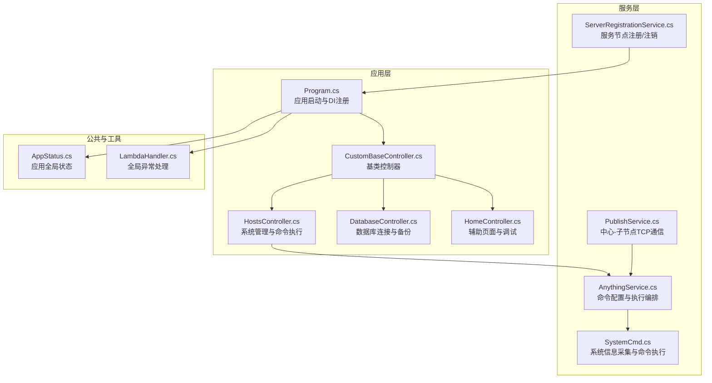
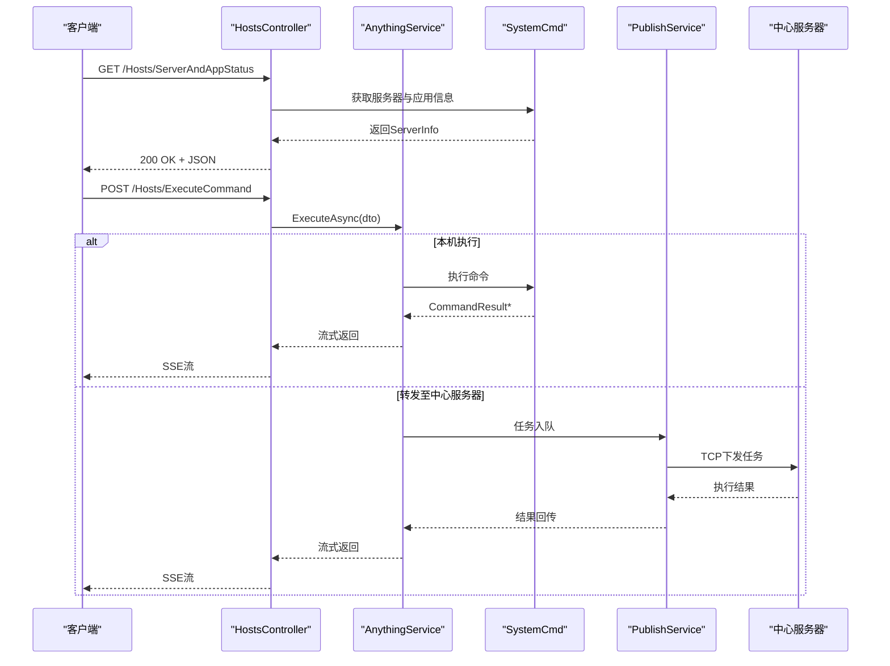
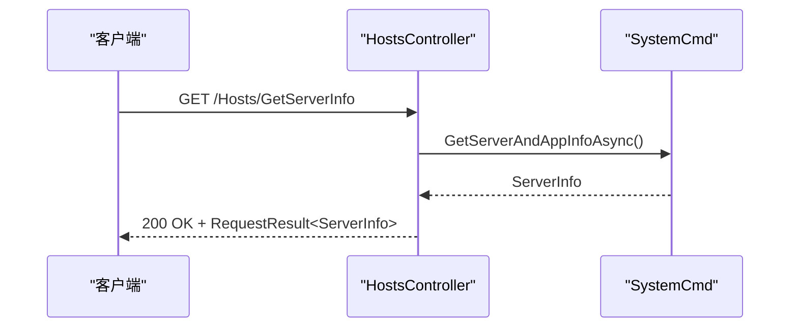
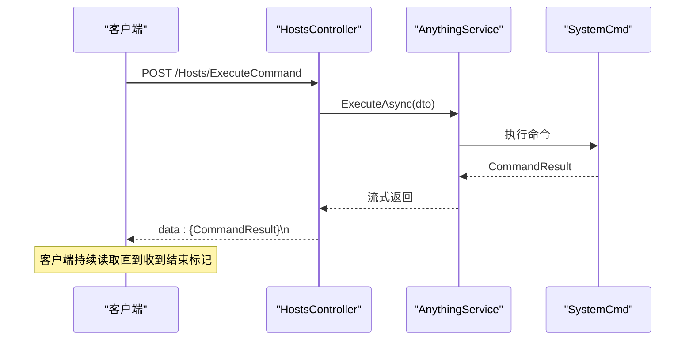
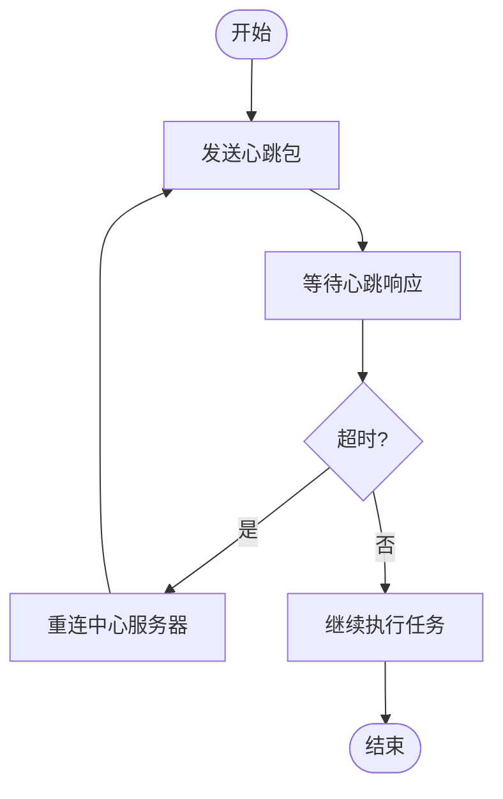
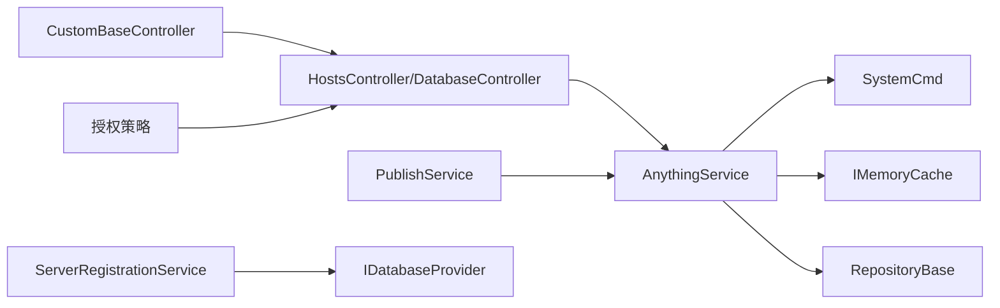

# 系统管理 API

<cite>
**本文引用的文件**
- [Program.cs](file://Sylas.RemoteTasks.App/Program.cs)
- [CustomBaseController.cs](file://Sylas.RemoteTasks.App/Controllers/CustomBaseController.cs)
- [HostsController.cs](file://Sylas.RemoteTasks.App/Controllers/HostsController.cs)
- [DatabaseController.cs](file://Sylas.RemoteTasks.App/Controllers/DatabaseController.cs)
- [HomeController.cs](file://Sylas.RemoteTasks.App/Controllers/HomeController.cs)
- [AnythingService.cs](file://Sylas.RemoteTasks.App/RemoteHostModule/Anything/AnythingService.cs)
- [SystemCmd.cs](file://Sylas.RemoteTasks.Utils/CommandExecutor/SystemCmd.cs)
- [AppStatus.cs](file://Sylas.RemoteTasks.Common/AppStatus.cs)
- [PublishService.cs](file://Sylas.RemoteTasks.App/BackgroundServices/PublishService.cs)
- [ServerRegistrationService.cs](file://Sylas.RemoteTasks.App/BackgroundServices/ServerRegistrationService.cs)
- [LambdaHandler.cs](file://Sylas.RemoteTasks.App/ExceptionHandlers/LambdaHandler.cs)
</cite>

## 目录
1. [简介](#简介)
2. [项目结构](#项目结构)
3. [核心组件](#核心组件)
4. [架构总览](#架构总览)
5. [详细组件分析](#详细组件分析)
6. [依赖关系分析](#依赖关系分析)
7. [性能考量](#性能考量)
8. [故障排查指南](#故障排查指南)
9. [结论](#结论)
10. [附录](#附录)

## 简介
本文件面向系统管理员与运维工程师，系统性梳理并规范“系统管理 API”的设计与使用，覆盖以下能力：
- 系统信息查询：服务器与应用基础信息、资源使用情况
- 状态监控：服务节点状态、命令执行状态、心跳与告警
- 配置管理：数据库连接串管理、备份与恢复、命令与工作流配置
- 健康检查与告警：基于心跳与队列的健康监测与超时告警
- 最佳实践与运维建议：权限控制、异常处理、日志与监控

## 项目结构
系统采用 ASP.NET Core MVC + SignalR + 自定义后台服务的架构，控制器负责对外暴露 API，服务层封装业务逻辑，后台服务负责跨节点通信与状态上报。

图表来源
- [Program.cs](file://Sylas.RemoteTasks.App/Program.cs#L1-L122)
- [CustomBaseController.cs](file://Sylas.RemoteTasks.App/Controllers/CustomBaseController.cs#L1-L145)
- [HostsController.cs](file://Sylas.RemoteTasks.App/Controllers/HostsController.cs#L1-L468)
- [DatabaseController.cs](file://Sylas.RemoteTasks.App/Controllers/DatabaseController.cs#L1-L235)
- [HomeController.cs](file://Sylas.RemoteTasks.App/Controllers/HomeController.cs#L1-L975)
- [AnythingService.cs](file://Sylas.RemoteTasks.App/RemoteHostModule/Anything/AnythingService.cs#L1-L680)
- [SystemCmd.cs](file://Sylas.RemoteTasks.Utils/CommandExecutor/SystemCmd.cs#L1-L788)
- [PublishService.cs](file://Sylas.RemoteTasks.App/BackgroundServices/PublishService.cs#L1-L645)
- [ServerRegistrationService.cs](file://Sylas.RemoteTasks.App/BackgroundServices/ServerRegistrationService.cs#L1-L138)
- [AppStatus.cs](file://Sylas.RemoteTasks.Common/AppStatus.cs#L1-L35)
- [LambdaHandler.cs](file://Sylas.RemoteTasks.App/ExceptionHandlers/LambdaHandler.cs#L1-L27)

章节来源
- [Program.cs](file://Sylas.RemoteTasks.App/Program.cs#L1-L122)

## 核心组件
- 控制器层：统一鉴权策略、参数过滤、返回统一结构
- 服务层：命令执行编排、系统信息采集、跨节点通信
- 后台服务：服务节点注册、心跳与命令下发、结果回传
- 公共状态：应用域、中心服务器标识、进程信息

章节来源
- [CustomBaseController.cs](file://Sylas.RemoteTasks.App/Controllers/CustomBaseController.cs#L1-L145)
- [HostsController.cs](file://Sylas.RemoteTasks.App/Controllers/HostsController.cs#L1-L468)
- [DatabaseController.cs](file://Sylas.RemoteTasks.App/Controllers/DatabaseController.cs#L1-L235)
- [AnythingService.cs](file://Sylas.RemoteTasks.App/RemoteHostModule/Anything/AnythingService.cs#L1-L680)
- [SystemCmd.cs](file://Sylas.RemoteTasks.Utils/CommandExecutor/SystemCmd.cs#L1-L788)
- [PublishService.cs](file://Sylas.RemoteTasks.App/BackgroundServices/PublishService.cs#L1-L645)
- [ServerRegistrationService.cs](file://Sylas.RemoteTasks.App/BackgroundServices/ServerRegistrationService.cs#L1-L138)
- [AppStatus.cs](file://Sylas.RemoteTasks.Common/AppStatus.cs#L1-L35)

## 架构总览
系统管理 API 的典型调用链路如下：

图表来源
- [HostsController.cs](file://Sylas.RemoteTasks.App/Controllers/HostsController.cs#L236-L124)
- [AnythingService.cs](file://Sylas.RemoteTasks.App/RemoteHostModule/Anything/AnythingService.cs#L294-L389)
- [SystemCmd.cs](file://Sylas.RemoteTasks.Utils/CommandExecutor/SystemCmd.cs#L630-L648)
- [PublishService.cs](file://Sylas.RemoteTasks.App/BackgroundServices/PublishService.cs#L443-L624)

## 详细组件分析

### 1) 系统信息查询 API
- 端点：GET /Hosts/GetServerInfo
- 功能：获取服务器与应用基础信息（主机名、系统、架构、.NET版本、IP、CPU核数、磁盘、内存、应用启动/运行时间、应用内存与使用率）
- 请求：无
- 响应：JSON，包含 ServerInfo 结构
- 权限：匿名访问（用于前端展示）

图表来源
- [HostsController.cs](file://Sylas.RemoteTasks.App/Controllers/HostsController.cs#L236-L244)
- [SystemCmd.cs](file://Sylas.RemoteTasks.Utils/CommandExecutor/SystemCmd.cs#L630-L648)

章节来源
- [HostsController.cs](file://Sylas.RemoteTasks.App/Controllers/HostsController.cs#L236-L244)
- [SystemCmd.cs](file://Sylas.RemoteTasks.Utils/CommandExecutor/SystemCmd.cs#L630-L648)

### 2) 应用状态检查 API
- 端点：GET /Hosts/ServerAndAppStatus（页面），GET /Hosts/GetServerInfo（数据）
- 功能：页面展示服务器与应用状态；数据接口返回实时系统指标
- 请求：无
- 响应：页面或 JSON
- 权限：匿名访问

章节来源
- [HostsController.cs](file://Sylas.RemoteTasks.App/Controllers/HostsController.cs#L249-L253)
- [HostsController.cs](file://Sylas.RemoteTasks.App/Controllers/HostsController.cs#L236-L244)

### 3) 命令执行与监控 API
- 端点：POST /Hosts/ExecuteCommand（SSE 流）、POST /Hosts/ExecuteCommands（批量）
- 功能：执行命令并以 Server-Sent Events 流式返回结果；支持单个或批量命令
- 请求体：CommandInfoInDto 或数组
- 响应：SSE 流，逐条返回 CommandResult；结束标志为特殊 CommandExecuteNo
- 权限：受统一鉴权策略保护

图表来源
- [HostsController.cs](file://Sylas.RemoteTasks.App/Controllers/HostsController.cs#L85-L124)
- [AnythingService.cs](file://Sylas.RemoteTasks.App/RemoteHostModule/Anything/AnythingService.cs#L294-L389)
- [SystemCmd.cs](file://Sylas.RemoteTasks.Utils/CommandExecutor/SystemCmd.cs#L129-L138)

章节来源
- [HostsController.cs](file://Sylas.RemoteTasks.App/Controllers/HostsController.cs#L85-L124)
- [HostsController.cs](file://Sylas.RemoteTasks.App/Controllers/HostsController.cs#L131-L158)
- [AnythingService.cs](file://Sylas.RemoteTasks.App/RemoteHostModule/Anything/AnythingService.cs#L294-L389)

### 4) 命令配置与工作流 API
- 端点：
  - 分页查询命令配置：POST /Hosts/AnythingSettingsAsync
  - 查询命令详情：GET /Hosts/AnythingSettingAndInfoAsync/{id}
  - 添加/更新/删除命令配置：POST /Hosts/AddAnythingSettingAsync、POST /Hosts/UpdateAnythingSettingAsync、DELETE /Hosts/DeleteAnythingSettingByIdAsync
  - 添加/更新/删除命令：POST /Hosts/AddCommandAsync、POST /Hosts/UpdateCommandAsync、DELETE /Hosts/DeleteAnythingCommandByIdAsync
  - 解析命令模板：POST /Hosts/ResolveCommandAsync
  - 工作流管理：增删改查、节点排序、环境变量同步
- 请求体：JSON DTO（如 AnythingSetting、AnythingCommand、CommandResolveDto 等）
- 响应：统一 RequestResult/OperationResult 包裹

章节来源
- [HostsController.cs](file://Sylas.RemoteTasks.App/Controllers/HostsController.cs#L32-L56)
- [HostsController.cs](file://Sylas.RemoteTasks.App/Controllers/HostsController.cs#L164-L216)
- [HostsController.cs](file://Sylas.RemoteTasks.App/Controllers/HostsController.cs#L231-L234)
- [HostsController.cs](file://Sylas.RemoteTasks.App/Controllers/HostsController.cs#L290-L391)
- [HostsController.cs](file://Sylas.RemoteTasks.App/Controllers/HostsController.cs#L425-L465)

### 5) 数据库连接与备份恢复 API
- 端点：
  - 分页查询连接串：POST /Database/ConnectionStringsAsync
  - 新增连接串：POST /Database/AddConnectionStringAsync
  - 更新连接串：POST /Database/UpdateConnectionStringAsync
  - 克隆连接串：POST /Database/CloneConnectionStringAsync
  - 删除连接串：POST /Database/DeleteConnectionStringsAsync
  - 备份数据库：POST /Database/BackupAsync
  - 备份记录分页：POST /Database/BackupRecordsAsync
  - 还原数据库：POST /Database/RestoreAsync
- 请求体：JSON DTO（如 DbConnectionInfoInDto、BackupInDto、RestoreInDto 等）
- 响应：统一 RequestResult/OperationResult 包裹
- 加解密：连接串存储前 AES 加密，读取后 AES 解密

章节来源
- [DatabaseController.cs](file://Sylas.RemoteTasks.App/Controllers/DatabaseController.cs#L30-L43)
- [DatabaseController.cs](file://Sylas.RemoteTasks.App/Controllers/DatabaseController.cs#L49-L79)
- [DatabaseController.cs](file://Sylas.RemoteTasks.App/Controllers/DatabaseController.cs#L85-L108)
- [DatabaseController.cs](file://Sylas.RemoteTasks.App/Controllers/DatabaseController.cs#L115-L138)
- [DatabaseController.cs](file://Sylas.RemoteTasks.App/Controllers/DatabaseController.cs#L154-L159)
- [DatabaseController.cs](file://Sylas.RemoteTasks.App/Controllers/DatabaseController.cs#L166-L205)
- [DatabaseController.cs](file://Sylas.RemoteTasks.App/Controllers/DatabaseController.cs#L213-L232)

### 6) 健康检查与告警机制
- 心跳与超时：
  - 子节点定时发送心跳包，若超过阈值未收到心跳，自动重连
  - 中心服务器检测心跳超时并记录日志
- 命令执行超时：
  - 服务端维护远程命令结果容器，超时返回提示
- 服务节点注册/注销：
  - 启动时注册节点状态为在线，停止时置为离线

图表来源
- [PublishService.cs](file://Sylas.RemoteTasks.App/BackgroundServices/PublishService.cs#L482-L543)
- [PublishService.cs](file://Sylas.RemoteTasks.App/BackgroundServices/PublishService.cs#L545-L602)
- [ServerRegistrationService.cs](file://Sylas.RemoteTasks.App/BackgroundServices/ServerRegistrationService.cs#L66-L90)
- [ServerRegistrationService.cs](file://Sylas.RemoteTasks.App/BackgroundServices/ServerRegistrationService.cs#L100-L109)

章节来源
- [PublishService.cs](file://Sylas.RemoteTasks.App/BackgroundServices/PublishService.cs#L482-L543)
- [PublishService.cs](file://Sylas.RemoteTasks.App/BackgroundServices/PublishService.cs#L545-L602)
- [ServerRegistrationService.cs](file://Sylas.RemoteTasks.App/BackgroundServices/ServerRegistrationService.cs#L66-L90)
- [ServerRegistrationService.cs](file://Sylas.RemoteTasks.App/BackgroundServices/ServerRegistrationService.cs#L100-L109)

### 7) 统一响应与错误码约定
- 统一响应结构：RequestResult<T>/OperationResult
- 异常处理：全局异常中间件返回统一 JSON 错误
- 建议错误码：
  - 200：成功
  - 401：未授权/令牌无效
  - 403：权限不足
  - 404：资源不存在
  - 500：服务器内部错误

章节来源
- [LambdaHandler.cs](file://Sylas.RemoteTasks.App/ExceptionHandlers/LambdaHandler.cs#L1-L27)

## 依赖关系分析
- 控制器依赖服务层与仓储；服务层依赖系统命令执行器与缓存；后台服务依赖配置与网络通信
- 权限策略：基于角色与作用域的授权策略，要求具备管理策略与 API 作用域

图表来源
- [HostsController.cs](file://Sylas.RemoteTasks.App/Controllers/HostsController.cs#L1-L468)
- [DatabaseController.cs](file://Sylas.RemoteTasks.App/Controllers/DatabaseController.cs#L1-L235)
- [AnythingService.cs](file://Sylas.RemoteTasks.App/RemoteHostModule/Anything/AnythingService.cs#L1-L680)
- [SystemCmd.cs](file://Sylas.RemoteTasks.Utils/CommandExecutor/SystemCmd.cs#L1-L788)
- [PublishService.cs](file://Sylas.RemoteTasks.App/BackgroundServices/PublishService.cs#L1-L645)
- [ServerRegistrationService.cs](file://Sylas.RemoteTasks.App/BackgroundServices/ServerRegistrationService.cs#L1-L138)
- [CustomBaseController.cs](file://Sylas.RemoteTasks.App/Controllers/CustomBaseController.cs#L1-L145)
- [Program.cs](file://Sylas.RemoteTasks.App/Program.cs#L74-L87)

章节来源
- [Program.cs](file://Sylas.RemoteTasks.App/Program.cs#L74-L87)

## 性能考量
- 命令执行：SSE 流式返回，避免一次性大响应；注意客户端缓冲与断线重连
- 缓存：命令执行器映射与执行器对象缓存减少重复创建
- IO：文件上传/下载使用流式写入，避免内存峰值
- 并发：后台服务多线程处理不同节点连接，注意线程安全与资源释放

## 故障排查指南
- 命令执行无返回或延迟高
  - 检查中心服务器心跳是否正常
  - 查看命令执行日志与结果容器长度
- 401/403
  - 核对令牌与作用域配置
  - 确认授权策略匹配
- 备份/还原失败
  - 检查连接串加密/解密流程
  - 确认允许还原的目标数据库关键字白名单
- 服务节点状态异常
  - 查看注册/注销日志
  - 检查数据库节点表字段一致性

章节来源
- [PublishService.cs](file://Sylas.RemoteTasks.App/BackgroundServices/PublishService.cs#L482-L543)
- [LambdaHandler.cs](file://Sylas.RemoteTasks.App/ExceptionHandlers/LambdaHandler.cs#L1-L27)
- [DatabaseController.cs](file://Sylas.RemoteTasks.App/Controllers/DatabaseController.cs#L224-L228)
- [ServerRegistrationService.cs](file://Sylas.RemoteTasks.App/BackgroundServices/ServerRegistrationService.cs#L66-L90)

## 结论
系统管理 API 通过清晰的控制器-服务-后台服务分层，提供了完善的系统信息查询、命令执行、配置管理与健康监控能力。配合统一的鉴权与异常处理机制，能够满足生产环境的运维需求。建议在实际部署中结合本文最佳实践与运维建议，确保稳定性与可观测性。

## 附录
- 最佳实践与运维建议
  - 权限控制：严格启用授权策略，避免匿名访问敏感接口
  - 日志与监控：开启心跳日志与命令执行日志，定期巡检
  - 备份策略：定期备份数据库连接串与备份记录，验证还原流程
  - 健康检查：通过 GetServerInfo 与心跳机制持续监控节点状态
  - 安全加固：连接串加密存储，限制可还原数据库白名单