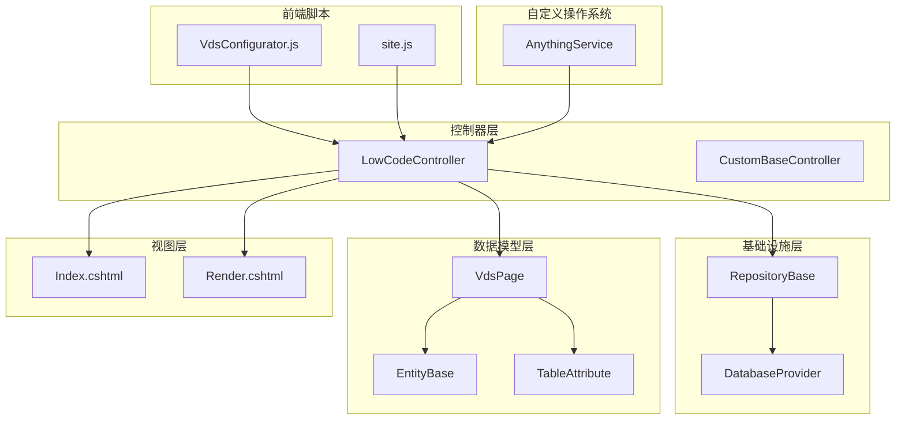
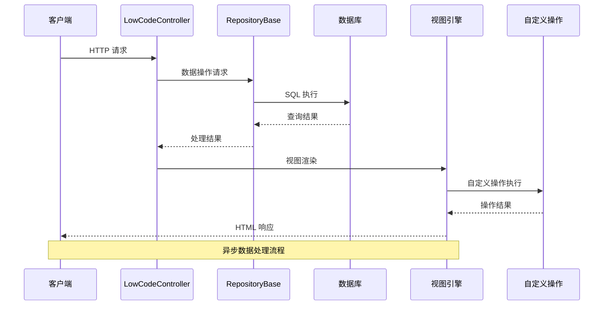
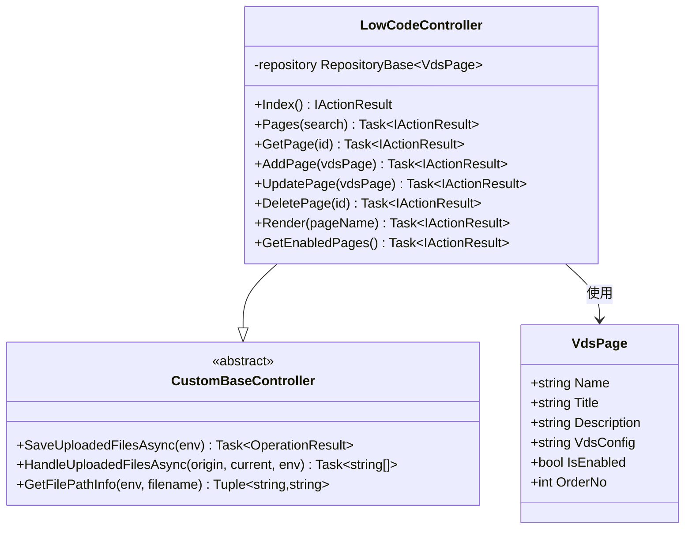
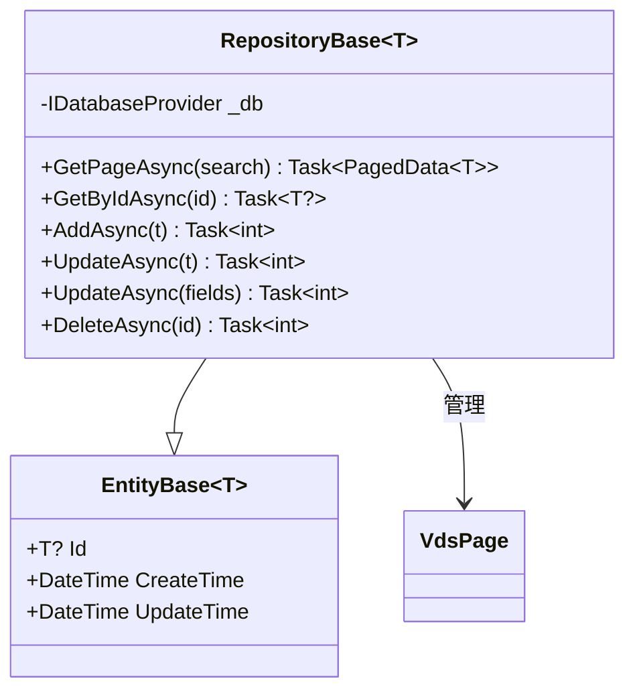
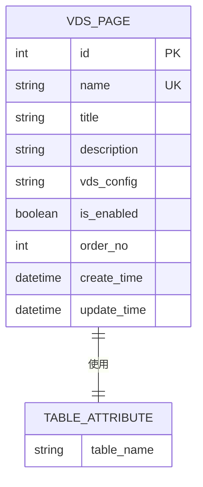
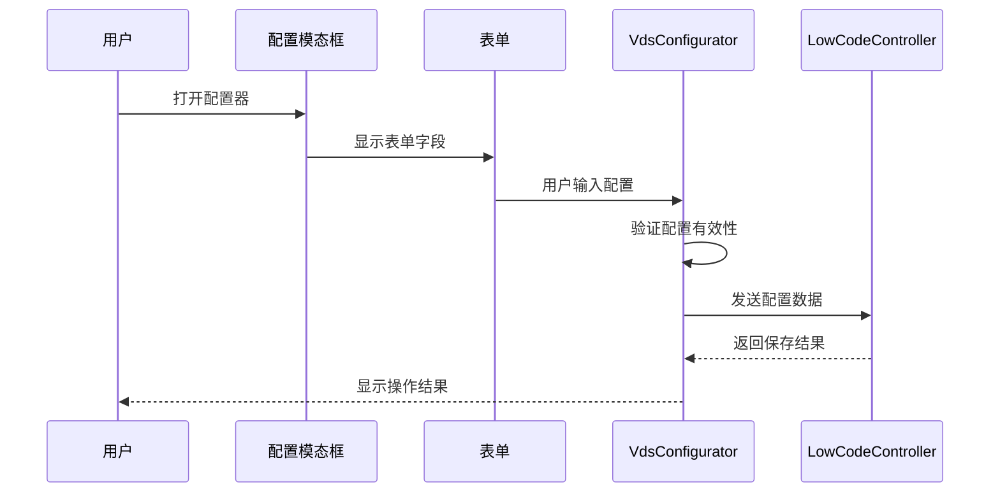
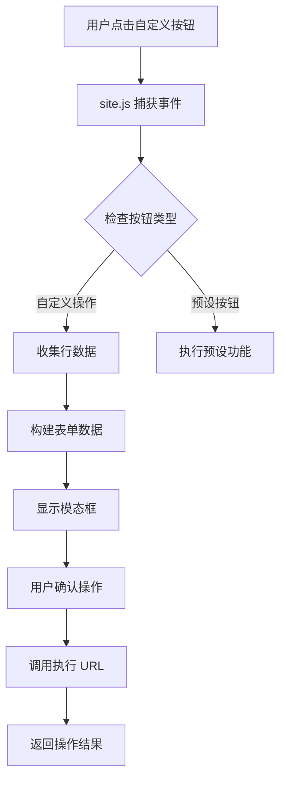

# LowCodeController API 文档

<cite>
**本文档引用的文件**
- [LowCodeController.cs](file://Sylas.RemoteTasks.App/Controllers/LowCodeController.cs)
- [VdsPage.cs](file://Sylas.RemoteTasks.App/LowCode/VdsPage.cs)
- [RepositoryBase.cs](file://Sylas.RemoteTasks.App/Infrastructure/RepositoryBase.cs)
- [CustomBaseController.cs](file://Sylas.RemoteTasks.App/Controllers/CustomBaseController.cs)
- [vds-configurator.js](file://Sylas.RemoteTasks.App/wwwroot/js/vds-configurator.js)
- [Index.cshtml](file://Sylas.RemoteTasks.App/Views/LowCode/Index.cshtml)
- [Render.cshtml](file://Sylas.RemoteTasks.App/Views/LowCode/Render.cshtml)
- [RequestResult.cs](file://Sylas.RemoteTasks.Common/Dtos/RequestResult.cs)
- [OperationResult.cs](file://Sylas.RemoteTasks.Common/Dtos/OperationResult.cs)
- [DataSearch.cs](file://Sylas.RemoteTasks.Database/SyncBase/DataSearch.cs)
- [EntityBase.cs](file://Sylas.RemoteTasks.Database/EntityBase.cs)
- [TableAttribute.cs](file://Sylas.RemoteTasks.Database/Attributes/TableAttribute.cs)
- [site.js](file://Sylas.RemoteTasks.App/wwwroot/js/site.js)
- [AnythingService.cs](file://Sylas.RemoteTasks.App/RemoteHostModule/Anything/AnythingService.cs)
</cite>

## 更新摘要
**所做更改**
- 新增自定义操作配置功能的文档说明
- 更新按钮配置和执行工作流的相关内容
- 增强前端集成部分，包含自定义操作的详细说明
- 完善数据模型和配置结构的说明

## 目录
1. [简介](#简介)
2. [项目结构](#项目结构)
3. [核心组件](#核心组件)
4. [架构概览](#架构概览)
5. [详细组件分析](#详细组件分析)
6. [API 接口规范](#api-接口规范)
7. [数据模型](#数据模型)
8. [前端集成](#前端集成)
9. [性能考虑](#性能考虑)
10. [故障排除指南](#故障排除指南)
11. [总结](#总结)

## 简介

LowCodeController 是 Sylas.RemoteTasks 应用程序中的一个关键组件，负责提供低代码 VDS（Virtual Data Sheet）页面管理的完整 API 接口。该控制器实现了完整的 CRUD 操作，支持动态页面渲染，并提供了可视化的配置界面。

**更新** 新增了自定义操作系统的集成支持，允许用户通过配置自定义按钮和执行工作流，增强了系统的扩展性和功能性。

VDS 页面是一种基于 JSON 配置的低代码解决方案，允许用户通过可视化界面快速创建数据表格页面，而无需编写复杂的前端代码。系统通过配置驱动的方式，将 JSON 配置转换为可交互的 Web 页面。

## 项目结构

LowCodeController API 的项目结构采用典型的 ASP.NET Core MVC 架构模式：



**图表来源**
- [LowCodeController.cs](file://Sylas.RemoteTasks.App/Controllers/LowCodeController.cs#L1-L163)
- [RepositoryBase.cs](file://Sylas.RemoteTasks.App/Infrastructure/RepositoryBase.cs#L1-L233)
- [VdsPage.cs](file://Sylas.RemoteTasks.App/LowCode/VdsPage.cs#L1-L64)
- [AnythingService.cs](file://Sylas.RemoteTasks.App/RemoteHostModule/Anything/AnythingService.cs#L1-L200)

**章节来源**
- [LowCodeController.cs](file://Sylas.RemoteTasks.App/Controllers/LowCodeController.cs#L1-L163)
- [Sylas.RemoteTasks.App.csproj](file://Sylas.RemoteTasks.App/Sylas.RemoteTasks.App.csproj#L1-L61)

## 核心组件

### LowCodeController 控制器

LowCodeController 继承自 CustomBaseController，提供了完整的 VDS 页面管理功能：

- **页面管理页面**: 提供 VDS 配置管理的 Web 界面
- **CRUD 接口**: 支持页面配置的增删改查操作
- **动态渲染**: 根据配置动态生成页面内容
- **权限控制**: 基于策略的访问控制
- **自定义操作支持**: 集成自定义按钮配置和执行工作流

### VdsPage 实体模型

VdsPage 是存储 VDS 配置的核心数据模型，包含以下关键属性：

- `Name`: 页面唯一标识符（用于路由）
- `Title`: 页面显示标题
- `Description`: 页面描述信息
- `VdsConfig`: 完整的 VDS 配置 JSON
- `IsEnabled`: 页面启用状态
- `OrderNo`: 排序编号

**更新** VdsConfig 现在支持自定义操作配置，包括按钮类型、执行 URL 和参数映射等高级功能。

### RepositoryBase 仓储层

RepositoryBase 提供了通用的数据访问功能，支持多种数据库类型的统一操作：

- **分页查询**: 支持复杂条件的分页数据检索
- **CRUD 操作**: 标准的增删改查功能
- **数据库抽象**: 支持多种数据库类型（MySQL、PostgreSQL、SQL Server 等）

**章节来源**
- [LowCodeController.cs](file://Sylas.RemoteTasks.App/Controllers/LowCodeController.cs#L10-L163)
- [VdsPage.cs](file://Sylas.RemoteTasks.App/LowCode/VdsPage.cs#L6-L64)
- [RepositoryBase.cs](file://Sylas.RemoteTasks.App/Infrastructure/RepositoryBase.cs#L10-L233)

## 架构概览

LowCodeController API 采用了分层架构设计，确保了良好的可维护性和扩展性：



**图表来源**
- [LowCodeController.cs](file://Sylas.RemoteTasks.App/Controllers/LowCodeController.cs#L30-L36)
- [RepositoryBase.cs](file://Sylas.RemoteTasks.App/Infrastructure/RepositoryBase.cs#L20-L25)
- [site.js](file://Sylas.RemoteTasks.App/wwwroot/js/site.js#L1556-L1590)

### 数据流架构

```mermaid
flowchart TD
A[前端请求) --> B[LowCodeController]
B --> C[参数验证]
C --> D{操作类型}
D --> |查询| E[RepositoryBase.GetPageAsync]
D --> |添加| F[RepositoryBase.AddAsync]
D --> |更新| G[RepositoryBase.UpdateAsync]
D --> |删除| H[RepositoryBase.DeleteAsync]
D --> |自定义操作| I[site.js 处理自定义动作]
E --> J[数据库查询]
F --> K[数据库插入]
G --> L[数据库更新]
H --> M[数据库删除]
I --> N[调用 AnythingService]
J --> O[RequestResult 包装]
K --> P[OperationResult 包装]
L --> P
M --> P
O --> Q[JSON 响应]
P --> Q
N --> R[执行远程操作]
R --> S[返回操作结果]
S --> Q
```

**图表来源**
- [LowCodeController.cs](file://Sylas.RemoteTasks.App/Controllers/LowCodeController.cs#L26-L117)
- [RequestResult.cs](file://Sylas.RemoteTasks.Common/Dtos/RequestResult.cs#L6-L65)
- [OperationResult.cs](file://Sylas.RemoteTasks.Common/Dtos/OperationResult.cs#L8-L51)
- [site.js](file://Sylas.RemoteTasks.App/wwwroot/js/site.js#L1556-L1590)

## 详细组件分析

### LowCodeController 类结构



**图表来源**
- [LowCodeController.cs](file://Sylas.RemoteTasks.App/Controllers/LowCodeController.cs#L13-L163)
- [CustomBaseController.cs](file://Sylas.RemoteTasks.App/Controllers/CustomBaseController.cs#L14-L145)
- [VdsPage.cs](file://Sylas.RemoteTasks.App/LowCode/VdsPage.cs#L11-L62)

### RepositoryBase 仓储模式

RepositoryBase 实现了数据访问层的抽象，提供了统一的 CRUD 操作接口：



**图表来源**
- [RepositoryBase.cs](file://Sylas.RemoteTasks.App/Infrastructure/RepositoryBase.cs#L10-L233)
- [EntityBase.cs](file://Sylas.RemoteTasks.Database/EntityBase.cs#L9-L31)

**章节来源**
- [LowCodeController.cs](file://Sylas.RemoteTasks.App/Controllers/LowCodeController.cs#L13-L163)
- [RepositoryBase.cs](file://Sylas.RemoteTasks.App/Infrastructure/RepositoryBase.cs#L10-L233)

## API 接口规范

### 页面管理接口

| 方法 | 路径 | 描述 | 请求参数 | 响应数据 |
|------|------|------|----------|----------|
| GET | `/LowCode/Index` | VDS 配置管理页面 | 无 | HTML 页面 |
| POST | `/LowCode/Pages` | 分页查询 VDS 页面 | DataSearch 对象 | RequestResult<PagedData<VdsPage>> |
| POST | `/LowCode/GetPage` | 根据 ID 获取页面 | int id | RequestResult<VdsPage> |
| POST | `/LowCode/AddPage` | 添加新页面 | VdsPage 表单数据 | OperationResult |
| POST | `/LowCode/UpdatePage` | 更新页面配置 | VdsPage 表单数据 | OperationResult |
| POST | `/LowCode/DeletePage` | 删除页面 | int id | OperationResult |

### 动态渲染接口

| 方法 | 路径 | 描述 | 请求参数 | 响应数据 |
|------|------|------|----------|----------|
| GET | `/LowCode/Render/{pageName}` | 根据名称渲染页面 | string pageName | HTML 页面 |
| GET | `/LowCode/GetEnabledPages` | 获取启用的页面列表 | 无 | RequestResult<object[]> |

### 自定义操作接口

**更新** 新增自定义操作相关的接口支持：

| 方法 | 路径 | 描述 | 请求参数 | 响应数据 |
|------|------|------|----------|----------|
| POST | `/LowCode/ProcessCustomAction` | 处理自定义操作 | customAction 配置 | RequestResult<object> |
| GET | `/LowCode/GetCustomActionConfig` | 获取自定义操作配置 | 无 | RequestResult<customActions[]> |

### 请求和响应格式

所有 API 响应都遵循统一的格式：

**成功响应格式：**
```json
{
  "code": 1,
  "errMsg": "",
  "data": {}
}
```

**错误响应格式：**
```json
{
  "code": 0,
  "errMsg": "错误消息",
  "data": null
}
```

**章节来源**
- [LowCodeController.cs](file://Sylas.RemoteTasks.App/Controllers/LowCodeController.cs#L16-L160)
- [RequestResult.cs](file://Sylas.RemoteTasks.Common/Dtos/RequestResult.cs#L6-L65)
- [OperationResult.cs](file://Sylas.RemoteTasks.Common/Dtos/OperationResult.cs#L8-L51)

## 数据模型

### VdsPage 数据结构

VdsPage 是存储 VDS 配置的核心实体，具有以下属性：



**图表来源**
- [VdsPage.cs](file://Sylas.RemoteTasks.App/LowCode/VdsPage.cs#L10-L62)
- [TableAttribute.cs](file://Sylas.RemoteTasks.Database/Attributes/TableAttribute.cs#L14-L31)

### 数据库表映射

VdsPage 实体通过 TableAttribute 注解映射到数据库表：

- **表名**: VdsPages
- **主键**: Id (自动递增)
- **唯一约束**: Name
- **索引**: IsEnabled, OrderNo

### 配置数据结构

**更新** VdsConfig JSON 配置现在包含自定义操作支持：

| 配置项 | 类型 | 必需 | 描述 |
|--------|------|------|------|
| apiUrl | string | 是 | 数据查询接口 URL |
| ths | array | 是 | 表头字段配置数组 |
| pageSize | number | 否 | 每页显示数量，默认 10 |
| idFieldName | string | 否 | 主键字段名，默认 'id' |
| modalSettings | object | 否 | 模态框配置 |
| orderRules | array | 否 | 排序规则 |
| customActions | array | 否 | 自定义操作配置数组 |

**自定义操作配置结构**：

```json
{
  "className": "string",
  "modalTitle": "string",
  "executeUrl": "string",
  "executeMethod": "string",
  "modalFields": [
    {
      "name": "string",
      "label": "string",
      "type": "string",
      "reuseFrom": "string"
    }
  ],
  "dataContent": {
    "key": "string|value|$form|$form:fieldName"
  }
}
```

**章节来源**
- [VdsPage.cs](file://Sylas.RemoteTasks.App/LowCode/VdsPage.cs#L13-L31)
- [TableAttribute.cs](file://Sylas.RemoteTasks.Database/Attributes/TableAttribute.cs#L14-L31)

## 前端集成

### VDS 配置器

前端通过 VdsConfigurator.js 提供可视化的配置界面：



**图表来源**
- [vds-configurator.js](file://Sylas.RemoteTasks.App/wwwroot/js/vds-configurator.js#L646-L700)
- [Index.cshtml](file://Sylas.RemoteTasks.App/Views/LowCode/Index.cshtml#L1-L200)

### 自定义按钮配置

**新增** 自定义按钮配置功能允许用户创建自定义操作按钮：



**图表来源**
- [vds-configurator.js](file://Sylas.RemoteTasks.App/wwwroot/js/vds-configurator.js#L545-L1175)
- [site.js](file://Sylas.RemoteTasks.App/wwwroot/js/site.js#L1556-L1590)

### 动态页面渲染

渲染流程展示了如何将配置转换为实际的页面内容：

```mermaid
flowchart TD
A[请求 /LowCode/Render/{pageName}] --> B[查询 VdsPage 配置]
B --> C{页面是否存在且启用}
C --> |否| D[返回 404 错误]
C --> |是| E[加载 VdsConfig JSON]
E --> F[设置默认配置参数]
F --> G[调用 createTable 函数]
G --> H[渲染页面内容]
H --> I[初始化自定义操作]
I --> J[绑定事件监听器]
J --> K[显示最终页面]
```

**图表来源**
- [LowCodeController.cs](file://Sylas.RemoteTasks.App/Controllers/LowCodeController.cs#L125-L144)
- [Render.cshtml](file://Sylas.RemoteTasks.App/Views/LowCode/Render.cshtml#L15-L44)

**章节来源**
- [vds-configurator.js](file://Sylas.RemoteTasks.App/wwwroot/js/vds-configurator.js#L1-L1430)
- [Index.cshtml](file://Sylas.RemoteTasks.App/Views/LowCode/Index.cshtml#L1-L376)
- [Render.cshtml](file://Sylas.RemoteTasks.App/Views/LowCode/Render.cshtml#L1-L45)
- [site.js](file://Sylas.RemoteTasks.App/wwwroot/js/site.js#L1556-L1590)

## 性能考虑

### 数据库优化

1. **索引策略**: VdsPage 表针对常用查询字段建立了适当的索引
2. **分页查询**: 使用 DataSearch 对象实现高效的分页查询
3. **批量操作**: 支持批量数据处理以提高性能

### 缓存机制

- **配置缓存**: 经常访问的页面配置可以缓存到内存中
- **模板缓存**: 视图模板编译结果可以缓存以减少编译开销
- **自定义操作缓存**: 自定义操作配置可以缓存以提高响应速度

### 异步处理

- **异步 API**: 所有数据库操作都使用异步方法实现
- **并发控制**: 合理的并发访问控制避免资源竞争
- **自定义操作异步执行**: 自定义操作通过异步方式执行，不阻塞主线程

## 故障排除指南

### 常见问题及解决方案

| 问题类型 | 症状 | 可能原因 | 解决方案 |
|----------|------|----------|----------|
| 页面无法渲染 | 返回 404 | 页面未找到或禁用 | 检查页面配置和启用状态 |
| 配置保存失败 | 返回错误信息 | 验证失败或数据库错误 | 检查配置格式和数据库连接 |
| 数据查询异常 | API 返回错误 | 查询参数错误 | 验证 DataSearch 参数 |
| 权限不足 | 访问被拒绝 | 认证失败 | 检查用户权限和令牌 |
| 自定义操作失败 | 操作无响应 | 配置错误或网络问题 | 检查自定义操作配置和执行 URL |

### 调试技巧

1. **日志记录**: 启用详细的日志记录以便追踪问题
2. **参数验证**: 在控制器中添加参数验证逻辑
3. **错误处理**: 实现统一的错误处理机制
4. **自定义操作调试**: 使用浏览器开发者工具检查自定义操作的事件绑定和 AJAX 调用

**章节来源**
- [LowCodeController.cs](file://Sylas.RemoteTasks.App/Controllers/LowCodeController.cs#L45-L48)
- [LowCodeController.cs](file://Sylas.RemoteTasks.App/Controllers/LowCodeController.cs#L78-L82)

## 总结

LowCodeController API 提供了一个完整、灵活且易于使用的低代码页面管理系统。通过配置驱动的方式，用户可以快速创建和管理各种数据页面，而无需编写复杂的前端代码。

**更新** 新增的自定义操作系统集成功能进一步增强了系统的扩展性，允许用户通过配置自定义按钮和执行工作流，提供了更强大的业务自动化能力。

### 主要优势

1. **配置驱动**: 通过 JSON 配置实现高度灵活性
2. **可视化编辑**: 提供直观的图形化配置界面
3. **统一接口**: 标准化的 API 设计便于集成
4. **多数据库支持**: 支持多种数据库类型
5. **安全可靠**: 完善的权限控制和错误处理机制
6. **自定义操作**: 支持自定义按钮配置和执行工作流
7. **异步处理**: 支持异步操作执行，提升用户体验

### 技术特点

- 基于 ASP.NET Core MVC 架构
- 使用 Dapper 进行高效的数据访问
- 支持多种数据库类型
- 提供完整的前后端分离架构
- 具备良好的扩展性和维护性
- 集成自定义操作系统支持

这个系统为开发者提供了一个强大的低代码解决方案，大大提高了开发效率和用户体验。自定义操作系统的集成使得系统能够更好地适应各种复杂的业务场景，为用户提供更加灵活和强大的功能。