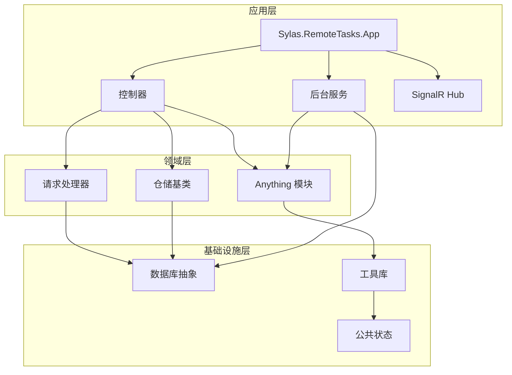
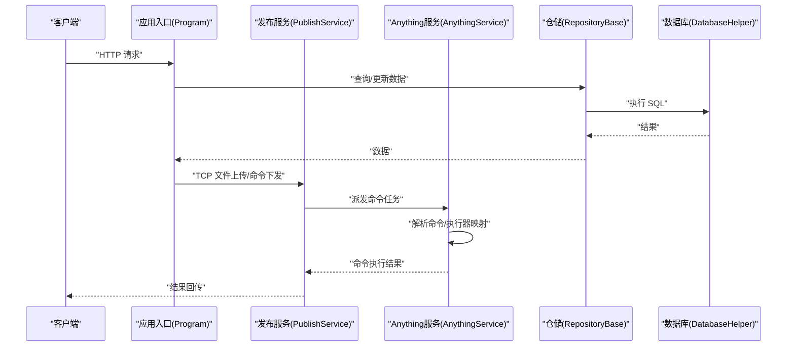
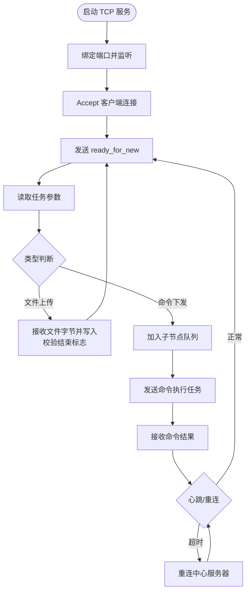
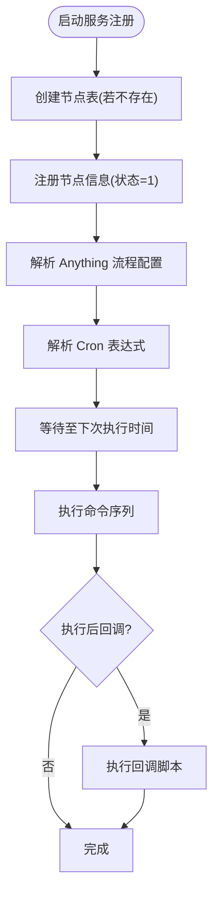
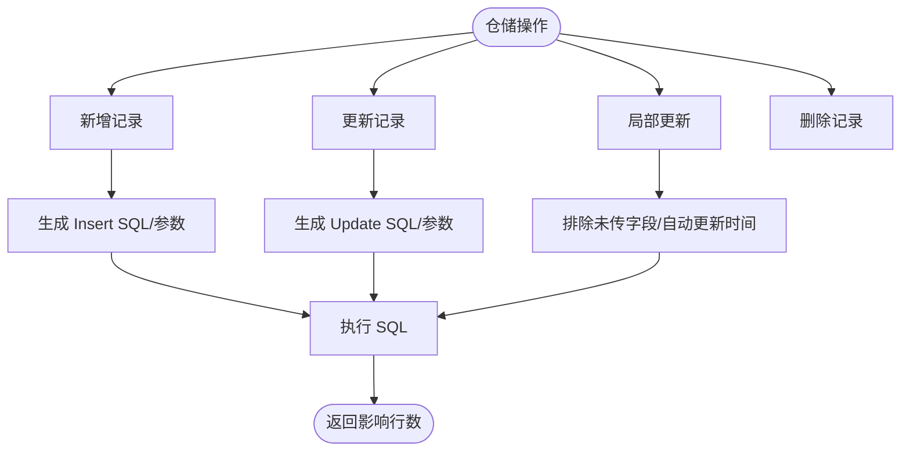
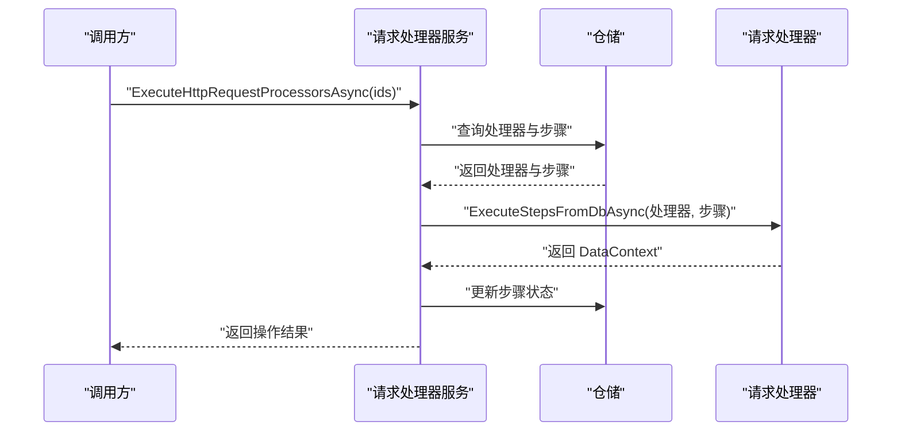
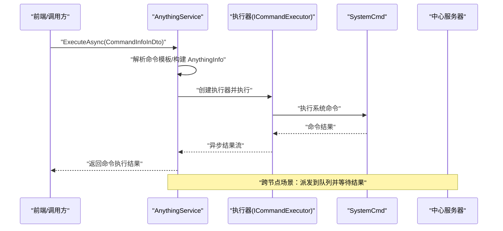
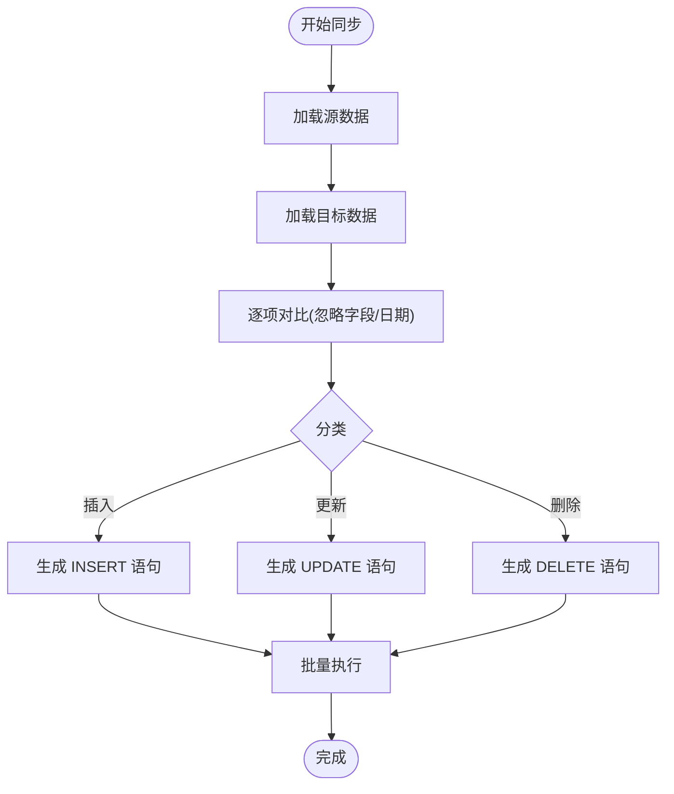
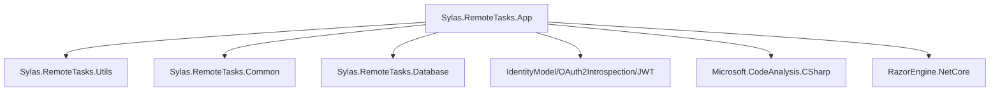

# 项目维护

<cite>
**本文档引用的文件**
- [Program.cs](file://Sylas.RemoteTasks.App/Program.cs)
- [appsettings.json](file://Sylas.RemoteTasks.App/appsettings.json)
- [Dockerfile](file://Sylas.RemoteTasks.App/Dockerfile)
- [PublishService.cs](file://Sylas.RemoteTasks.App/BackgroundServices/PublishService.cs)
- [ServerRegistrationService.cs](file://Sylas.RemoteTasks.App/BackgroundServices/ServerRegistrationService.cs)
- [RepositoryBase.cs](file://Sylas.RemoteTasks.App/Infrastructure/RepositoryBase.cs)
- [RequestProcessorService.cs](file://Sylas.RemoteTasks.App/RequestProcessor/RequestProcessorService.cs)
- [AnythingService.cs](file://Sylas.RemoteTasks.App/RemoteHostModule/Anything/AnythingService.cs)
- [AppStatus.cs](file://Sylas.RemoteTasks.Common/AppStatus.cs)
- [DatabaseHelper.cs](file://Sylas.RemoteTasks.Database/DatabaseHelper.cs)
- [SystemCmd.cs](file://Sylas.RemoteTasks.Utils/CommandExecutor/SystemCmd.cs)
- [README.md](file://README.md)
- [Sylas.RemoteTasks.App.csproj](file://Sylas.RemoteTasks.App/Sylas.RemoteTasks.App.csproj)
</cite>

## 目录
1. [简介](#简介)
2. [项目结构](#项目结构)
3. [核心组件](#核心组件)
4. [架构概览](#架构概览)
5. [详细组件分析](#详细组件分析)
6. [依赖分析](#依赖分析)
7. [性能考量](#性能考量)
8. [故障排查指南](#故障排查指南)
9. [结论](#结论)
10. [附录](#附录)

## 简介
本项目是一个基于 .NET 的远程任务与运维平台，提供以下能力：
- 远程命令与任务编排：通过“Anything”模块定义可执行命令、模板解析与执行器映射，支持跨节点任务派发与结果收集。
- TCP 服务与心跳机制：内置 TCP 服务用于文件上传、命令下发与结果回传，并支持中心节点与子节点的心跳与重连。
- 数据库同步与对比：提供多数据库类型支持与数据同步算法，支持增量/变更对比与批量写入。
- 请求处理器流水线：通过配置驱动的请求处理器，支持多步骤数据处理与数据处理器链路。
- 前端交互与部署：提供前端交互示例与 Docker 部署脚本，便于快速上线。

## 项目结构
项目采用多项目组合的解决方案，核心模块如下：
- Sylas.RemoteTasks.App：ASP.NET Core Web 应用，承载控制器、后台服务、管道与 UI。
- Sylas.RemoteTasks.Common：公共状态与工具类，如 AppStatus。
- Sylas.RemoteTasks.Database：数据库抽象与同步工具。
- Sylas.RemoteTasks.Utils：命令执行器、模板引擎、网络与系统辅助工具。
- Sylas.RemoteTasks.Test：单元测试与集成测试。

图表来源
- [Program.cs](file://Sylas.RemoteTasks.App/Program.cs#L1-L122)
- [AnythingService.cs](file://Sylas.RemoteTasks.App/RemoteHostModule/Anything/AnythingService.cs#L1-L680)
- [RequestProcessorService.cs](file://Sylas.RemoteTasks.App/RequestProcessor/RequestProcessorService.cs#L1-L72)
- [RepositoryBase.cs](file://Sylas.RemoteTasks.App/Infrastructure/RepositoryBase.cs#L1-L233)
- [DatabaseHelper.cs](file://Sylas.RemoteTasks.Database/DatabaseHelper.cs#L1-L245)
- [SystemCmd.cs](file://Sylas.RemoteTasks.Utils/CommandExecutor/SystemCmd.cs#L1-L788)
- [AppStatus.cs](file://Sylas.RemoteTasks.Common/AppStatus.cs#L1-L35)

章节来源
- [Program.cs](file://Sylas.RemoteTasks.App/Program.cs#L1-L122)
- [Sylas.RemoteTasks.App.csproj](file://Sylas.RemoteTasks.App/Sylas.RemoteTasks.App.csproj#L1-L61)

## 核心组件
- 应用入口与配置
  - Program.cs：注册服务、中间件、认证授权、SignalR、后台服务与全局过滤器；配置 Kestrel 上传限制与 HTTPS/HSTS。
  - appsettings.json：日志、全局热键、连接字符串、TCP/HTTP 端口、请求流水线、身份认证、邮件配置等。
  - Dockerfile：容器镜像构建与运行环境配置。
- 后台服务
  - PublishService：TCP 服务、文件上传、命令下发与结果回传、心跳与重连。
  - ServerRegistrationService：服务节点注册/注销、定时任务调度与执行。
- 仓储与数据处理
  - RepositoryBase：泛型仓储，支持分页、增删改、局部更新与 SQL 参数生成。
  - DatabaseHelper：数据库类型识别、连接创建、数据对比与同步。
- 请求处理器
  - RequestProcessorService：按配置执行请求处理器流水线，支持上下文传递与步骤持久化。
- 命令执行与任务编排
  - AnythingService：Anything 配置、命令解析、执行器映射、跨节点任务派发与结果收集。
  - SystemCmd：系统命令执行、并发执行、主机信息采集与磁盘/内存/CPU 信息。
- 公共状态
  - AppStatus：中心服务器地址、是否中心节点、域名、实例路径、进程 ID 等。

章节来源
- [Program.cs](file://Sylas.RemoteTasks.App/Program.cs#L1-L122)
- [appsettings.json](file://Sylas.RemoteTasks.App/appsettings.json#L1-L142)
- [Dockerfile](file://Sylas.RemoteTasks.App/Dockerfile#L1-L21)
- [PublishService.cs](file://Sylas.RemoteTasks.App/BackgroundServices/PublishService.cs#L1-L645)
- [ServerRegistrationService.cs](file://Sylas.RemoteTasks.App/BackgroundServices/ServerRegistrationService.cs#L1-L493)
- [RepositoryBase.cs](file://Sylas.RemoteTasks.App/Infrastructure/RepositoryBase.cs#L1-L233)
- [RequestProcessorService.cs](file://Sylas.RemoteTasks.App/RequestProcessor/RequestProcessorService.cs#L1-L72)
- [AnythingService.cs](file://Sylas.RemoteTasks.App/RemoteHostModule/Anything/AnythingService.cs#L1-L680)
- [AppStatus.cs](file://Sylas.RemoteTasks.Common/AppStatus.cs#L1-L35)
- [DatabaseHelper.cs](file://Sylas.RemoteTasks.Database/DatabaseHelper.cs#L1-L245)
- [SystemCmd.cs](file://Sylas.RemoteTasks.Utils/CommandExecutor/SystemCmd.cs#L1-L788)

## 架构概览
系统采用分层架构与模块化设计，核心交互如下：
- 控制器通过仓储与请求处理器访问数据库与外部系统。
- AnythingService 负责命令解析与执行器映射，支持本地与跨节点执行。
- PublishService 作为 TCP 通道，承载文件上传与命令下发。
- ServerRegistrationService 负责服务注册与定时任务调度。
- SystemCmd 提供系统命令执行与主机状态采集。

图表来源
- [Program.cs](file://Sylas.RemoteTasks.App/Program.cs#L88-L122)
- [PublishService.cs](file://Sylas.RemoteTasks.App/BackgroundServices/PublishService.cs#L88-L340)
- [AnythingService.cs](file://Sylas.RemoteTasks.App/RemoteHostModule/Anything/AnythingService.cs#L294-L389)
- [RepositoryBase.cs](file://Sylas.RemoteTasks.App/Infrastructure/RepositoryBase.cs#L14-L193)
- [DatabaseHelper.cs](file://Sylas.RemoteTasks.Database/DatabaseHelper.cs#L69-L164)

## 详细组件分析

### 发布服务（TCP 与心跳）
- 功能要点
  - 绑定 TCP 端口，监听客户端连接与任务下发。
  - 支持文件上传：接收文件大小、文件名与保存目录，写入本地文件并校验结束标志。
  - 支持命令下发：将命令任务推送到子节点队列，接收命令执行结果并持久化。
  - 心跳与重连：定期发送心跳包，检测超时并自动重连中心服务器。
- 关键流程

图表来源
- [PublishService.cs](file://Sylas.RemoteTasks.App/BackgroundServices/PublishService.cs#L88-L340)
- [PublishService.cs](file://Sylas.RemoteTasks.App/BackgroundServices/PublishService.cs#L346-L434)
- [PublishService.cs](file://Sylas.RemoteTasks.App/BackgroundServices/PublishService.cs#L443-L624)

章节来源
- [PublishService.cs](file://Sylas.RemoteTasks.App/BackgroundServices/PublishService.cs#L1-L645)

### 服务注册与定时任务
- 功能要点
  - 服务启动时注册节点信息到数据库，停止时注销。
  - 解析 Anything 流程配置，按 Cron 表达式调度执行。
  - 支持执行后回调脚本，将结果作为参数传入。
- 关键流程

图表来源
- [ServerRegistrationService.cs](file://Sylas.RemoteTasks.App/BackgroundServices/ServerRegistrationService.cs#L55-L110)
- [ServerRegistrationService.cs](file://Sylas.RemoteTasks.App/BackgroundServices/ServerRegistrationService.cs#L187-L341)
- [ServerRegistrationService.cs](file://Sylas.RemoteTasks.App/BackgroundServices/ServerRegistrationService.cs#L362-L490)

章节来源
- [ServerRegistrationService.cs](file://Sylas.RemoteTasks.App/BackgroundServices/ServerRegistrationService.cs#L1-L493)

### 仓储与数据处理
- 功能要点
  - RepositoryBase 提供泛型增删改查、分页查询与局部更新。
  - 支持不同数据库类型（SQL Server、MySQL、Oracle、SQLite、PostgreSQL）的参数化 SQL 生成与执行。
  - 局部更新自动排除非显式传入字段与更新时间字段。
- 关键流程

图表来源
- [RepositoryBase.cs](file://Sylas.RemoteTasks.App/Infrastructure/RepositoryBase.cs#L71-L121)
- [RepositoryBase.cs](file://Sylas.RemoteTasks.App/Infrastructure/RepositoryBase.cs#L129-L181)

章节来源
- [RepositoryBase.cs](file://Sylas.RemoteTasks.App/Infrastructure/RepositoryBase.cs#L1-L233)

### 请求处理器流水线
- 功能要点
  - RequestProcessorService 按配置加载请求处理器，执行步骤并传递 DataContext。
  - 支持步骤持久化，便于断点续跑。
- 关键流程

图表来源
- [RequestProcessorService.cs](file://Sylas.RemoteTasks.App/RequestProcessor/RequestProcessorService.cs#L11-L69)

章节来源
- [RequestProcessorService.cs](file://Sylas.RemoteTasks.App/RequestProcessor/RequestProcessorService.cs#L1-L72)

### 命令执行与任务编排
- 功能要点
  - AnythingService：解析 Anything 配置，构建 AnythingInfo，映射执行器，解析命令模板，支持跨节点任务派发与结果收集。
  - SystemCmd：封装系统命令执行、并发执行、主机信息采集与磁盘/内存/CPU 信息。
- 关键流程

图表来源
- [AnythingService.cs](file://Sylas.RemoteTasks.App/RemoteHostModule/Anything/AnythingService.cs#L294-L389)
- [SystemCmd.cs](file://Sylas.RemoteTasks.Utils/CommandExecutor/SystemCmd.cs#L129-L138)

章节来源
- [AnythingService.cs](file://Sylas.RemoteTasks.App/RemoteHostModule/Anything/AnythingService.cs#L1-L680)
- [SystemCmd.cs](file://Sylas.RemoteTasks.Utils/CommandExecutor/SystemCmd.cs#L1-L788)

### 数据库同步与对比
- 功能要点
  - DatabaseHelper：提供多数据库连接创建、DDL 获取、数据对比（插入/更新/删除）与 SQL 转换。
  - 支持忽略字段与日期字段特殊比较逻辑。
- 关键流程

图表来源
- [DatabaseHelper.cs](file://Sylas.RemoteTasks.Database/DatabaseHelper.cs#L69-L164)

章节来源
- [DatabaseHelper.cs](file://Sylas.RemoteTasks.Database/DatabaseHelper.cs#L1-L245)

## 依赖分析
- 项目依赖
  - Sylas.RemoteTasks.App 依赖 Sylas.RemoteTasks.Utils 与 Sylas.RemoteTasks.Common。
  - Sylas.RemoteTasks.Database 提供数据库抽象与同步工具。
- 外部依赖
  - 身份认证：IdentityModel、OAuth2 Introspection、JWT Bearer/OpenId Connect。
  - 代码分析：Microsoft.CodeAnalysis.CSharp。
  - 模板引擎：RazorEngine.NetCore。
- 关键依赖关系

图表来源
- [Sylas.RemoteTasks.App.csproj](file://Sylas.RemoteTasks.App/Sylas.RemoteTasks.App.csproj#L36-L44)

章节来源
- [Sylas.RemoteTasks.App.csproj](file://Sylas.RemoteTasks.App/Sylas.RemoteTasks.App.csproj#L1-L61)

## 性能考量
- 线程与并发
  - PublishService 使用多线程处理客户端连接与命令下发，注意线程安全与资源释放。
  - ServerRegistrationService 使用并发字典与内存缓存，避免重复查询与频繁 GC。
- I/O 与网络
  - TCP 上传采用缓冲区与结束标志校验，建议根据文件大小调整缓冲区大小与超时策略。
  - 心跳与重连采用固定频率，建议结合网络质量动态调整。
- 数据库
  - RepositoryBase 支持不同数据库类型参数化 SQL，注意连接池配置与事务边界。
  - DatabaseHelper 的数据对比逻辑在大数据量场景下建议分批处理与索引优化。
- 命令执行
  - SystemCmd 支持并发执行，注意系统资源限制与输出合并策略。

## 故障排查指南
- 启动与配置
  - 检查 appsettings.json 中的 TCP/HTTP 端口、中心服务器地址与证书配置。
  - 确认 Dockerfile 中的环境变量与暴露端口一致。
- TCP 上传失败
  - 校验客户端发送的参数格式与结束标志，确认服务端保存目录权限。
  - 查看心跳日志与连接状态，确认网络连通性。
- 身份认证问题
  - 检查 IdentityServer 配置与作用域/角色声明，确保令牌有效。
- 数据同步异常
  - 核对忽略字段与日期字段配置，确认源/目标表结构一致。
- 命令执行超时
  - 检查 SystemCmd 的执行策略与输出捕获，必要时增加超时与重试。
- 前端交互
  - 参考 README 中的 execute 函数使用方式，确保 data-execute-url、data-method 与 data-content 正确。

章节来源
- [appsettings.json](file://Sylas.RemoteTasks.App/appsettings.json#L1-L142)
- [Dockerfile](file://Sylas.RemoteTasks.App/Dockerfile#L1-L21)
- [README.md](file://README.md#L1-L43)

## 结论
本项目通过模块化设计与配置驱动的流水线，提供了完善的远程任务编排、跨节点通信与数据库同步能力。建议在生产环境中重点关注：
- 网络与安全：合理配置 TLS、防火墙与身份认证。
- 性能与稳定性：优化数据库连接池、I/O 缓冲与并发策略。
- 可观测性：完善日志与监控，特别是 TCP 心跳与命令执行链路。
- 可维护性：持续优化配置项与模板解析，降低维护成本。

## 附录
- 部署参考
  - 使用 Dockerfile 构建镜像并运行容器，映射所需端口与卷。
  - 参考 README 中的部署脚本与前端交互示例。
- 前端交互
  - 通过 data-execute-url 与 execute 函数发起 API 请求，支持简单与复杂参数传递。

章节来源
- [Dockerfile](file://Sylas.RemoteTasks.App/Dockerfile#L1-L21)
- [README.md](file://README.md#L1-L43)