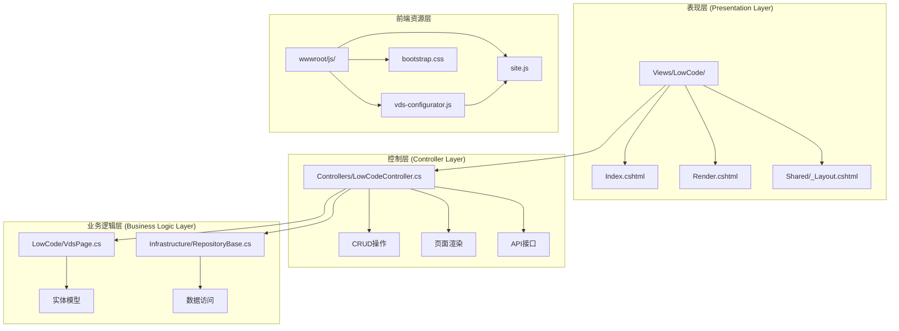
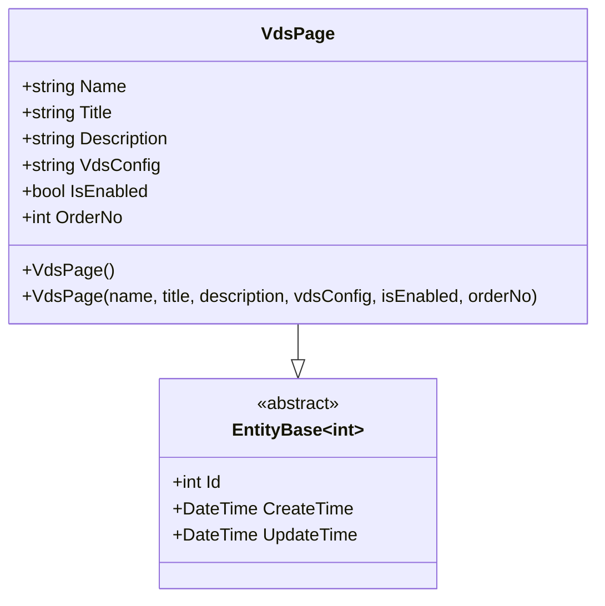
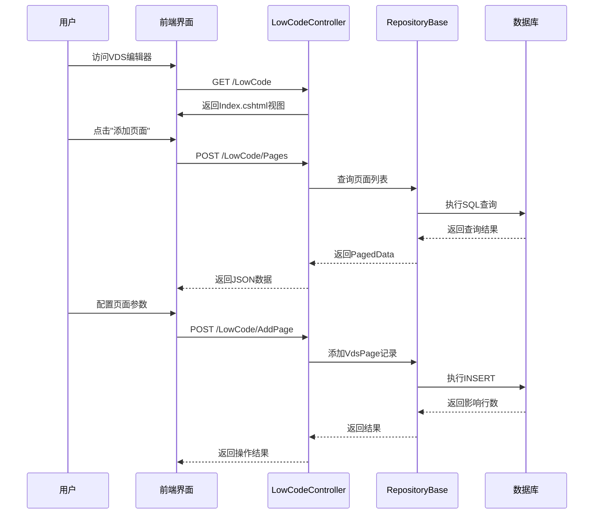
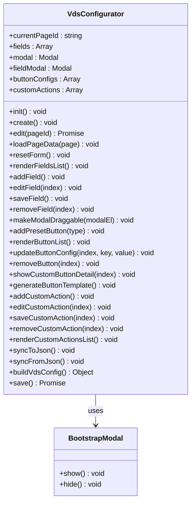
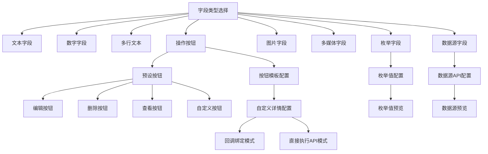
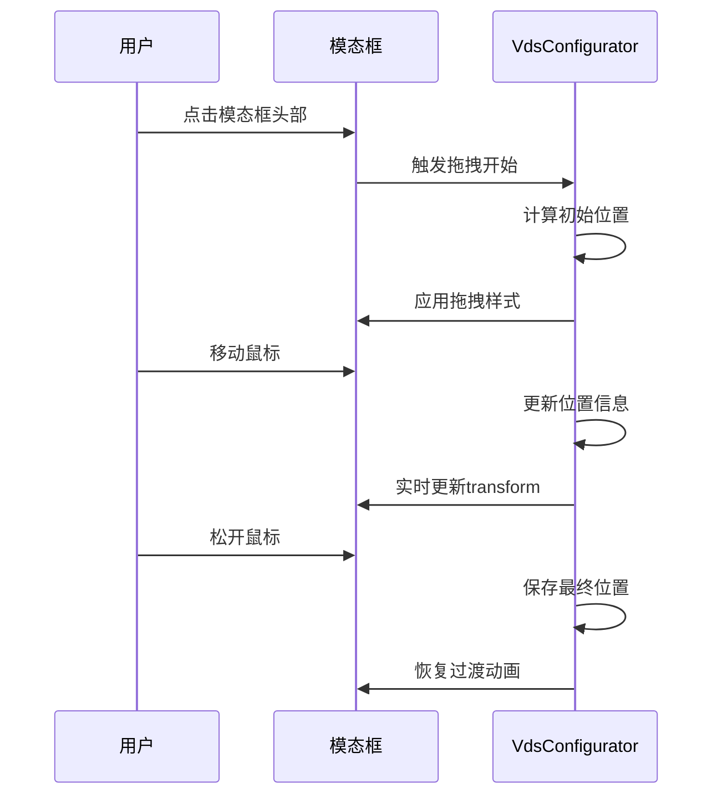
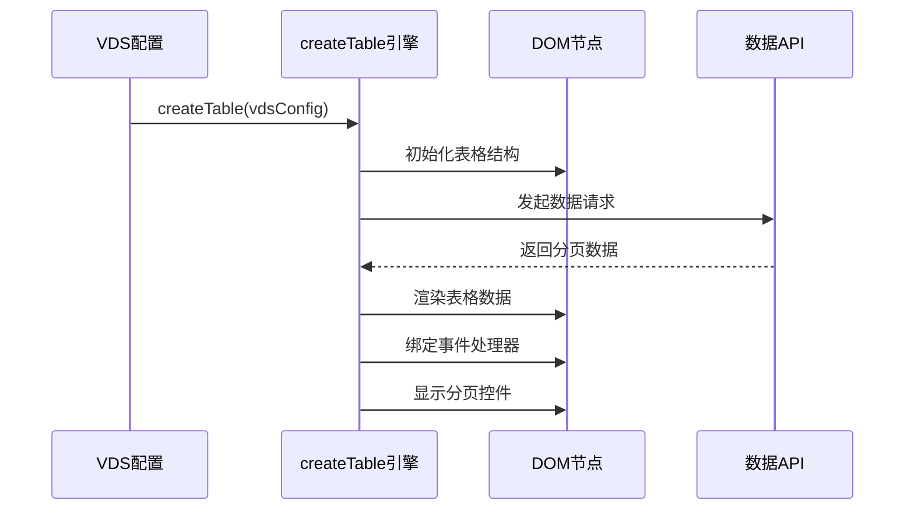
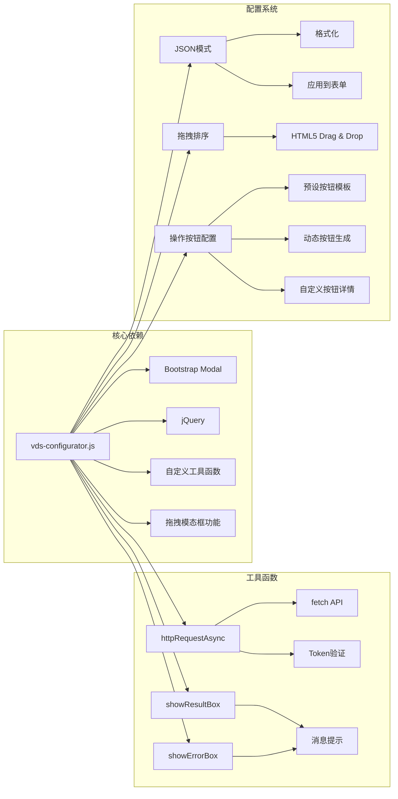
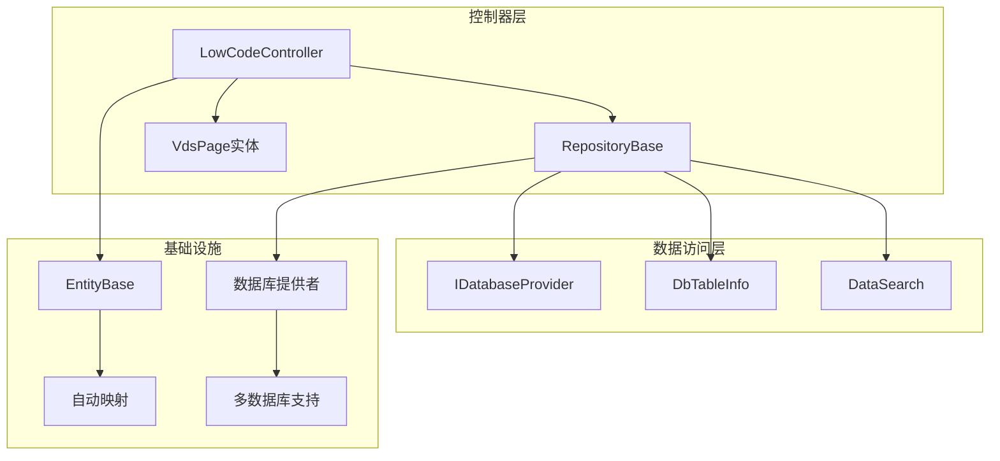

# VDS可视化编辑器界面

<cite>
**本文档引用的文件**
- [VdsPage.cs](file://Sylas.RemoteTasks.App/LowCode/VdsPage.cs)
- [LowCodeController.cs](file://Sylas.RemoteTasks.App/Controllers/LowCodeController.cs)
- [Index.cshtml](file://Sylas.RemoteTasks.App/Views/LowCode/Index.cshtml)
- [Render.cshtml](file://Sylas.RemoteTasks.App/Views/LowCode/Render.cshtml)
- [vds-configurator.js](file://Sylas.RemoteTasks.App/wwwroot/js/vds-configurator.js)
- [site.js](file://Sylas.RemoteTasks.App/wwwroot/js/site.js)
- [RepositoryBase.cs](file://Sylas.RemoteTasks.App/Infrastructure/RepositoryBase.cs)
</cite>

## 更新摘要
**变更内容**
- 新增操作按钮配置系统，支持编辑、删除、查看、自定义按钮
- 新增拖拽模态框功能，提升用户体验
- 新增预设按钮模板和动态按钮配置
- 新增自定义操作配置系统
- 增强字段类型系统，支持操作按钮字段

## 目录
1. [简介](#简介)
2. [项目结构](#项目结构)
3. [核心组件](#核心组件)
4. [架构概览](#架构概览)
5. [详细组件分析](#详细组件分析)
6. [依赖关系分析](#依赖关系分析)
7. [性能考虑](#性能考虑)
8. [故障排除指南](#故障排除指南)
9. [结论](#结论)

## 简介

VDS（Visual Data System）可视化编辑器是一个基于ASP.NET Core开发的低代码平台，允许用户通过可视化的界面设计和配置数据表格页面。该系统提供了完整的CRUD操作、拖拽排序、字段类型配置、数据源绑定、**操作按钮配置**等功能，使非技术人员也能轻松创建复杂的数据管理界面。

系统采用前后端分离的设计模式，后端使用C#和Entity Framework进行数据持久化，前端使用JavaScript和Bootstrap提供丰富的用户交互体验。通过VDS配置器，用户可以直观地配置数据表格的外观、行为和交互逻辑，**特别是新增的操作按钮配置系统**，支持编辑、删除、查看、自定义等多种按钮类型的灵活配置。

## 项目结构

VDS可视化编辑器遵循典型的三层架构设计，主要包含以下层次：

**图表来源**
- [Index.cshtml](file://Sylas.RemoteTasks.App/Views/LowCode/Index.cshtml#L1-L376)
- [LowCodeController.cs](file://Sylas.RemoteTasks.App/Controllers/LowCodeController.cs#L1-L163)
- [vds-configurator.js](file://Sylas.RemoteTasks.App/wwwroot/js/vds-configurator.js#L1-L1230)

**章节来源**
- [Index.cshtml](file://Sylas.RemoteTasks.App/Views/LowCode/Index.cshtml#L1-L376)
- [LowCodeController.cs](file://Sylas.RemoteTasks.App/Controllers/LowCodeController.cs#L1-L163)

## 核心组件

### VDS页面配置实体

VdsPage实体是整个系统的核心数据模型，负责存储每个VDS页面的完整配置信息。

**图表来源**
- [VdsPage.cs](file://Sylas.RemoteTasks.App/LowCode/VdsPage.cs#L1-L64)

### VDS配置器核心功能

VDS配置器是一个功能完整的JavaScript模块，提供了以下核心功能：

- **页面配置管理**：创建、编辑、删除VDS页面配置
- **字段类型配置**：支持文本、数字、枚举、图片、多媒体、数据源、**操作按钮**等多种字段类型
- **拖拽排序**：支持字段顺序的拖拽调整
- **JSON模式**：提供直接编辑配置JSON的功能
- **预设按钮**：内置编辑、删除、查看、**自定义**等预设按钮配置
- **拖拽模态框**：支持模态框的拖拽操作，提升用户体验
- **自定义操作**：支持复杂的自定义操作配置

**章节来源**
- [vds-configurator.js](file://Sylas.RemoteTasks.App/wwwroot/js/vds-configurator.js#L1-L1230)

## 架构概览

VDS可视化编辑器采用经典的MVC架构模式，结合现代前端框架技术：

**图表来源**
- [LowCodeController.cs](file://Sylas.RemoteTasks.App/Controllers/LowCodeController.cs#L26-L117)
- [RepositoryBase.cs](file://Sylas.RemoteTasks.App/Infrastructure/RepositoryBase.cs#L20-L25)

**章节来源**
- [LowCodeController.cs](file://Sylas.RemoteTasks.App/Controllers/LowCodeController.cs#L1-L163)
- [RepositoryBase.cs](file://Sylas.RemoteTasks.App/Infrastructure/RepositoryBase.cs#L1-L233)

## 详细组件分析

### VDS配置器类结构

VdsConfigurator是一个单例模式的JavaScript对象，包含了完整的页面配置管理逻辑：

**图表来源**
- [vds-configurator.js](file://Sylas.RemoteTasks.App/wwwroot/js/vds-configurator.js#L5-L1230)

### 字段类型系统

系统支持多种字段类型，每种类型都有特定的配置选项和渲染逻辑：

**图表来源**
- [vds-configurator.js](file://Sylas.RemoteTasks.App/wwwroot/js/vds-configurator.js#L227-L706)

### 拖拽模态框功能

系统新增了拖拽模态框功能，提升了用户的操作体验：

**图表来源**
- [vds-configurator.js](file://Sylas.RemoteTasks.App/wwwroot/js/vds-configurator.js#L38-L122)

### 数据表格渲染引擎

系统使用createTable函数作为核心的数据表格渲染引擎，支持复杂的表格配置和交互：

**图表来源**
- [site.js](file://Sylas.RemoteTasks.App/wwwroot/js/site.js#L32-L666)

**章节来源**
- [vds-configurator.js](file://Sylas.RemoteTasks.App/wwwroot/js/vds-configurator.js#L1-L1230)
- [site.js](file://Sylas.RemoteTasks.App/wwwroot/js/site.js#L1-L800)

## 依赖关系分析

### 前端依赖关系

**图表来源**
- [vds-configurator.js](file://Sylas.RemoteTasks.App/wwwroot/js/vds-configurator.js#L1-L1230)

### 后端依赖关系

**图表来源**
- [LowCodeController.cs](file://Sylas.RemoteTasks.App/Controllers/LowCodeController.cs#L1-L163)
- [RepositoryBase.cs](file://Sylas.RemoteTasks.App/Infrastructure/RepositoryBase.cs#L10-L194)

**章节来源**
- [LowCodeController.cs](file://Sylas.RemoteTasks.App/Controllers/LowCodeController.cs#L1-L163)
- [RepositoryBase.cs](file://Sylas.RemoteTasks.App/Infrastructure/RepositoryBase.cs#L1-L233)

## 性能考虑

### 前端性能优化

1. **懒加载机制**：VDS配置器采用按需加载策略，只有在用户需要时才初始化相关功能
2. **事件委托**：使用事件委托减少DOM事件监听器的数量
3. **虚拟滚动**：对于大量数据的表格，可以考虑实现虚拟滚动以提升性能
4. **缓存策略**：数据源配置采用缓存机制，避免重复的API调用
5. **拖拽优化**：拖拽模态框使用requestAnimationFrame优化渲染性能
6. **实时更新**：按钮配置采用实时更新机制，避免不必要的重绘

### 后端性能优化

1. **分页查询**：所有数据查询都支持分页，避免一次性加载大量数据
2. **索引优化**：VdsPages表的关键字段建立了适当的索引
3. **连接池**：使用Dapper进行高效的数据访问
4. **异步处理**：所有数据库操作都采用异步模式

## 故障排除指南

### 常见问题及解决方案

1. **页面无法加载**
   - 检查VDS配置JSON格式是否正确
   - 确认API接口地址配置正确
   - 验证用户权限和认证状态

2. **字段配置无效**
   - 确认字段类型选择正确
   - 检查数据源API是否可访问
   - 验证枚举值格式是否正确

3. **拖拽排序失效**
   - 检查浏览器兼容性
   - 确认HTML5 Drag & Drop支持
   - 验证CSS样式冲突

4. **操作按钮不显示**
   - 检查按钮配置是否正确
   - 确认按钮模板生成是否成功
   - 验证占位符替换是否正常

5. **模态框无法拖拽**
   - 检查拖拽功能是否被禁用
   - 确认CSS样式是否正确
   - 验证JavaScript事件绑定

**章节来源**
- [vds-configurator.js](file://Sylas.RemoteTasks.App/wwwroot/js/vds-configurator.js#L598-L606)
- [site.js](file://Sylas.RemoteTasks.App/wwwroot/js/site.js#L728-L782)

## 结论

VDS可视化编辑器是一个功能完整、架构清晰的低代码平台。它通过简洁的界面设计和强大的功能实现了数据表格的可视化配置，大大降低了开发复杂数据管理界面的技术门槛。

系统的主要优势包括：
- **易用性**：直观的拖拽界面和丰富的配置选项，**新增拖拽模态框功能**提升了用户体验
- **灵活性**：支持多种字段类型和**自定义操作按钮配置**，**支持编辑、删除、查看、自定义等多种按钮类型**
- **扩展性**：模块化的架构设计便于功能扩展，**新增自定义操作配置系统**
- **性能**：前后端分离的设计确保了良好的用户体验，**拖拽模态框使用高性能的requestAnimationFrame优化**

未来可以考虑的功能增强包括：
- 支持更复杂的布局系统
- 增加主题定制功能
- 实现版本管理和协作功能
- 提供更多的集成选项
- **扩展操作按钮的类型和功能**
- **增加按钮样式的自定义选项**
- **支持批量操作按钮配置**

**更新** 本次更新重点反映了新增的操作按钮配置功能，包括拖拽模态框、预设按钮模板、动态按钮配置和模板生成功能，这些功能显著增强了系统的灵活性和用户体验。