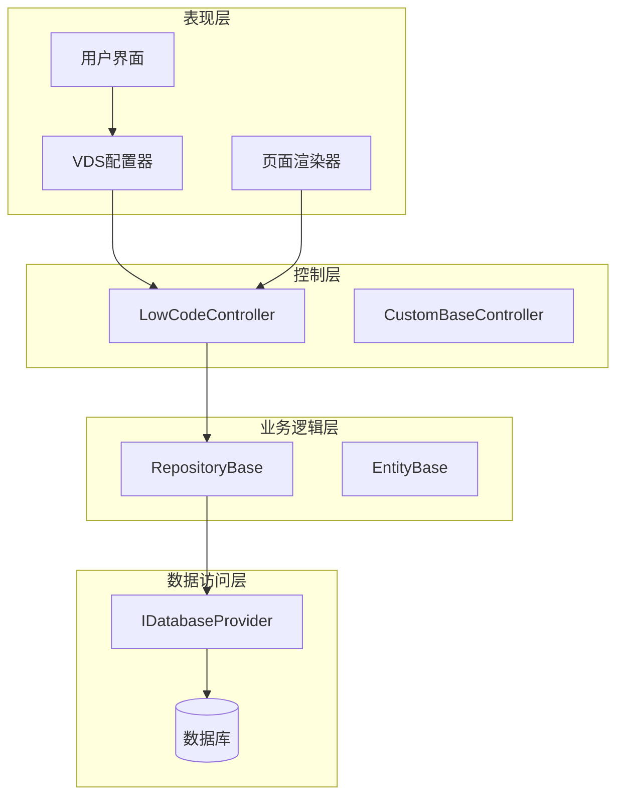
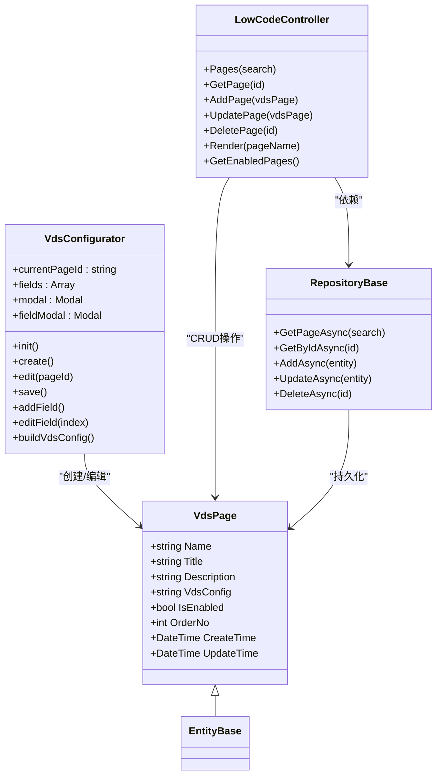
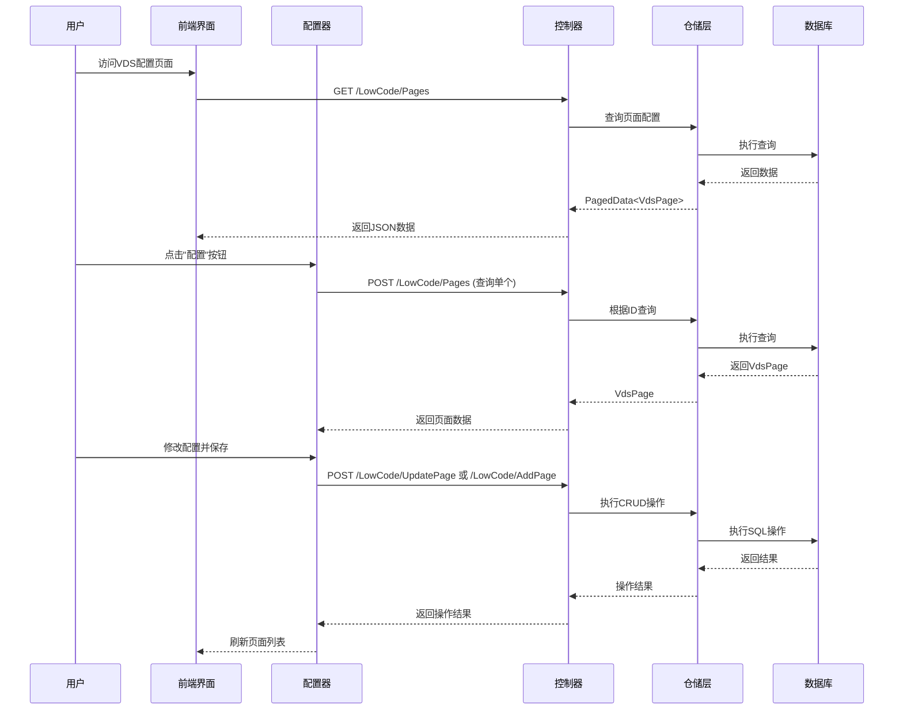
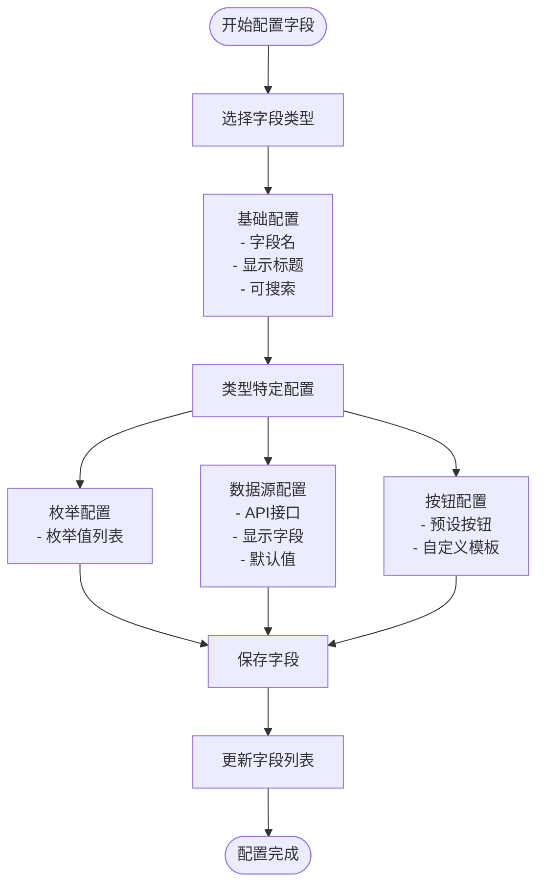
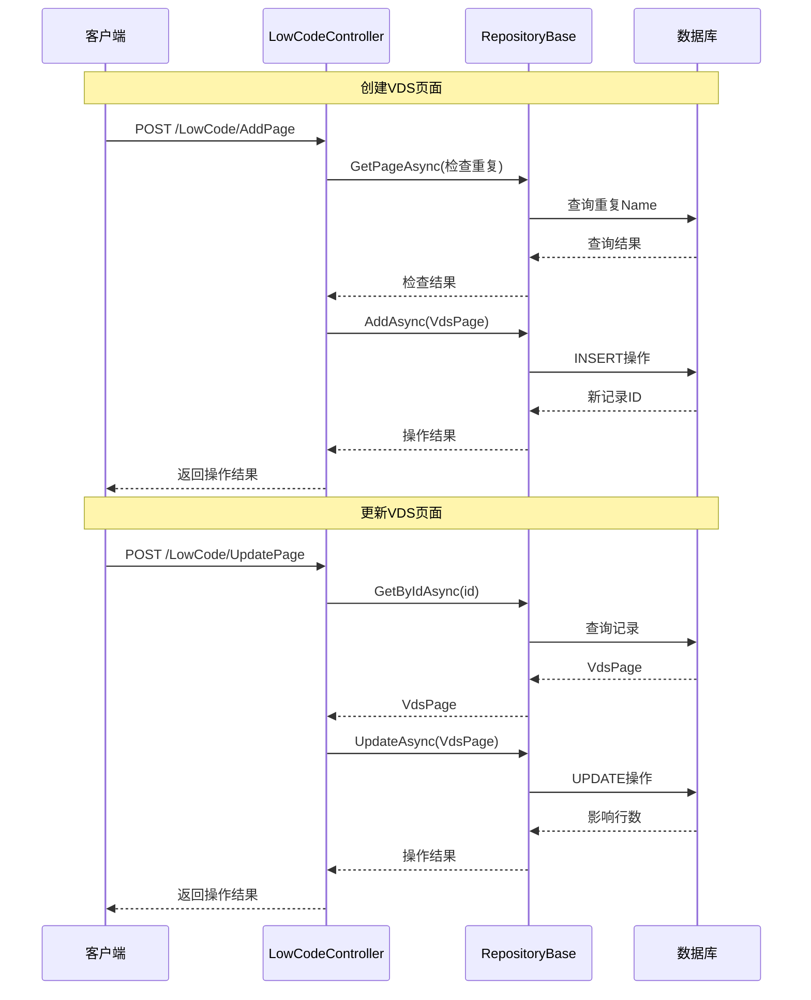
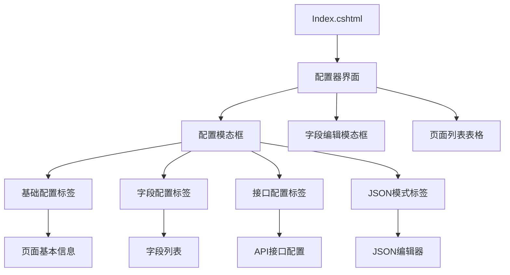
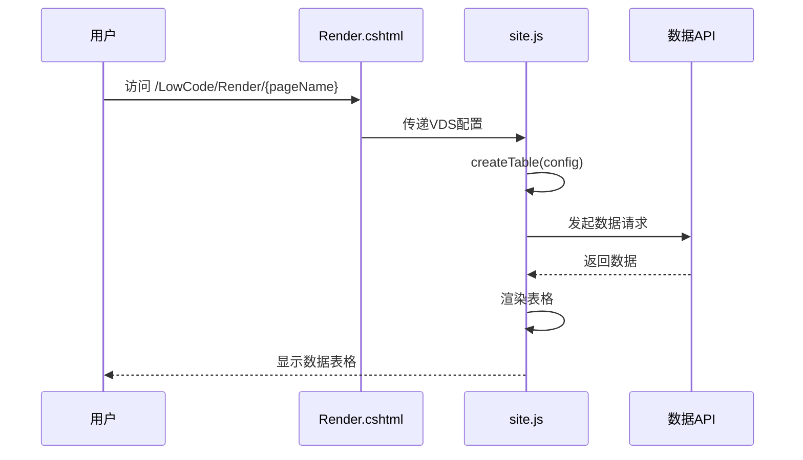
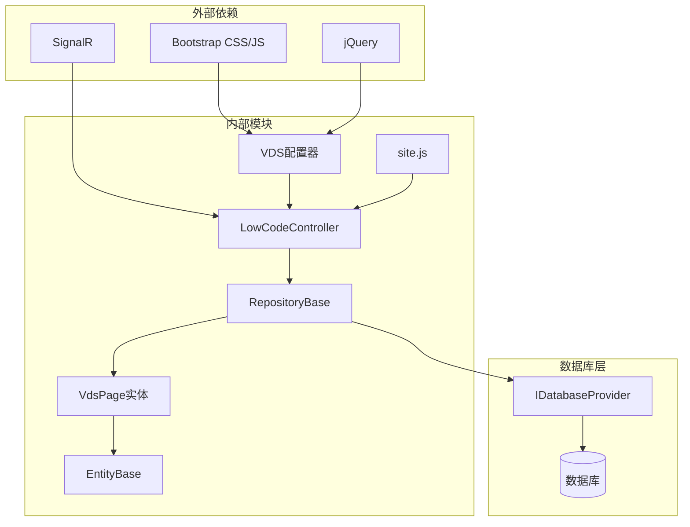
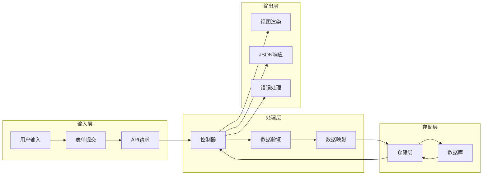
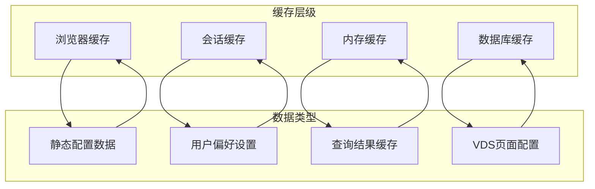

# VDS字段配置系统

<cite>
**本文档引用的文件**
- [VdsPage.cs](file://Sylas.RemoteTasks.App/LowCode/VdsPage.cs)
- [LowCodeController.cs](file://Sylas.RemoteTasks.App/Controllers/LowCodeController.cs)
- [vds-configurator.js](file://Sylas.RemoteTasks.App/wwwroot/js/vds-configurator.js)
- [Index.cshtml](file://Sylas.RemoteTasks.App/Views/LowCode/Index.cshtml)
- [Render.cshtml](file://Sylas.RemoteTasks.App/Views/LowCode/Render.cshtml)
- [RepositoryBase.cs](file://Sylas.RemoteTasks.App/Infrastructure/RepositoryBase.cs)
- [EntityBase.cs](file://Sylas.RemoteTasks.Database/EntityBase.cs)
- [site.js](file://Sylas.RemoteTasks.App/wwwroot/js/site.js)
</cite>

## 目录
1. [简介](#简介)
2. [项目结构](#项目结构)
3. [核心组件](#核心组件)
4. [架构概览](#架构概览)
5. [详细组件分析](#详细组件分析)
6. [依赖关系分析](#依赖关系分析)
7. [性能考虑](#性能考虑)
8. [故障排除指南](#故障排除指南)
9. [结论](#结论)

## 简介

VDS字段配置系统是一个基于ASP.NET Core的低代码页面配置平台，专门用于可视化配置和管理数据表格页面。该系统允许用户通过直观的界面创建和编辑VDS（Virtual Data Sheet）页面配置，实现数据的可视化展示和交互。

系统的核心特性包括：
- 可视化字段配置器
- 多种字段类型支持（文本、数字、枚举、图片、多媒体、数据源、操作按钮）
- 动态页面渲染
- 完整的CRUD操作
- 支持多种数据库类型

## 项目结构

VDS字段配置系统采用典型的三层架构设计，主要分为以下层次：

**图表来源**
- [LowCodeController.cs](file://Sylas.RemoteTasks.App/Controllers/LowCodeController.cs#L13-L162)
- [RepositoryBase.cs](file://Sylas.RemoteTasks.App/Infrastructure/RepositoryBase.cs#L10-L194)

**章节来源**
- [LowCodeController.cs](file://Sylas.RemoteTasks.App/Controllers/LowCodeController.cs#L1-L163)
- [RepositoryBase.cs](file://Sylas.RemoteTasks.App/Infrastructure/RepositoryBase.cs#L1-L233)

## 核心组件

### VdsPage实体模型

VdsPage是系统的核心数据模型，用于存储VDS页面的配置信息：

| 属性名 | 类型 | 描述 | 默认值 |
|--------|------|------|--------|
| Id | int | 主键标识 | null |
| Name | string | 页面唯一标识（用于路由） | "" |
| Title | string | 页面标题（显示用） | "" |
| Description | string | 页面描述 | "" |
| VdsConfig | string | VDS配置JSON | "{}" |
| IsEnabled | bool | 是否启用 | true |
| OrderNo | int | 排序号 | 0 |
| CreateTime | DateTime | 创建时间 | 当前时间 |
| UpdateTime | DateTime | 更新时间 | 当前时间 |

### VDS配置器架构

**图表来源**
- [VdsPage.cs](file://Sylas.RemoteTasks.App/LowCode/VdsPage.cs#L11-L62)
- [vds-configurator.js](file://Sylas.RemoteTasks.App/wwwroot/js/vds-configurator.js#L5-L715)
- [LowCodeController.cs](file://Sylas.RemoteTasks.App/Controllers/LowCodeController.cs#L13-L162)

**章节来源**
- [VdsPage.cs](file://Sylas.RemoteTasks.App/LowCode/VdsPage.cs#L1-L64)
- [vds-configurator.js](file://Sylas.RemoteTasks.App/wwwroot/js/vds-configurator.js#L1-L715)

## 架构概览

VDS字段配置系统采用现代化的前后端分离架构，结合了传统的MVC模式和现代的前端框架技术：

**图表来源**
- [LowCodeController.cs](file://Sylas.RemoteTasks.App/Controllers/LowCodeController.cs#L31-L116)
- [vds-configurator.js](file://Sylas.RemoteTasks.App/wwwroot/js/vds-configurator.js#L45-L700)

## 详细组件分析

### VDS配置器组件

VDS配置器是系统的核心前端组件，提供了完整的可视化配置功能：

#### 字段类型系统

系统支持多种字段类型，每种类型都有特定的配置选项：

| 字段类型 | 描述 | 配置选项 | 用途 |
|----------|------|----------|------|
| 文本 | 基础文本字段 | 名称、标题、对齐方式 | 显示普通文本内容 |
| 数字 | 数值类型字段 | 名称、标题、数值格式 | 显示数字数据 |
| 多行文本 | 长文本字段 | 名称、标题、截断长度 | 显示长文本内容 |
| 枚举 | 下拉选择字段 | 名称、标题、枚举值列表 | 提供固定选项选择 |
| 图片 | 图片显示字段 | 名称、标题、图片链接 | 显示单张图片 |
| 多媒体 | 媒体文件字段 | 名称、标题、媒体URL列表 | 显示视频、音频、图片 |
| 数据源 | 动态数据字段 | API接口、显示字段、默认值 | 从外部API获取数据 |
| 操作按钮 | 交互按钮字段 | 按钮配置、模板 | 提供用户交互操作 |

#### 字段配置流程

**图表来源**
- [vds-configurator.js](file://Sylas.RemoteTasks.App/wwwroot/js/vds-configurator.js#L227-L544)

#### 拖拽排序机制

系统实现了直观的拖拽排序功能，允许用户通过鼠标拖拽重新排列字段顺序：

**图表来源**
- [vds-configurator.js](file://Sylas.RemoteTasks.App/wwwroot/js/vds-configurator.js#L183-L222)

**章节来源**
- [vds-configurator.js](file://Sylas.RemoteTasks.App/wwwroot/js/vds-configurator.js#L1-L715)

### 控制器层组件

LowCodeController负责处理所有与VDS页面相关的HTTP请求：

#### CRUD操作流程

**图表来源**
- [LowCodeController.cs](file://Sylas.RemoteTasks.App/Controllers/LowCodeController.cs#L55-L99)
- [RepositoryBase.cs](file://Sylas.RemoteTasks.App/Infrastructure/RepositoryBase.cs#L71-L121)

**章节来源**
- [LowCodeController.cs](file://Sylas.RemoteTasks.App/Controllers/LowCodeController.cs#L1-L163)
- [RepositoryBase.cs](file://Sylas.RemoteTasks.App/Infrastructure/RepositoryBase.cs#L1-L233)

### 页面渲染组件

系统支持两种页面渲染模式：管理页面和用户页面。

#### 管理页面渲染

管理页面提供VDS配置的可视化编辑界面：

**图表来源**
- [Index.cshtml](file://Sylas.RemoteTasks.App/Views/LowCode/Index.cshtml#L14-L195)

#### 用户页面渲染

用户页面根据VDS配置动态渲染数据表格：

**图表来源**
- [Render.cshtml](file://Sylas.RemoteTasks.App/Views/LowCode/Render.cshtml#L15-L42)
- [site.js](file://Sylas.RemoteTasks.App/wwwroot/js/site.js#L32-L200)

**章节来源**
- [Index.cshtml](file://Sylas.RemoteTasks.App/Views/LowCode/Index.cshtml#L1-L366)
- [Render.cshtml](file://Sylas.RemoteTasks.App/Views/LowCode/Render.cshtml#L1-L45)

## 依赖关系分析

系统采用松耦合的设计模式，各组件之间的依赖关系清晰明确：

**图表来源**
- [vds-configurator.js](file://Sylas.RemoteTasks.App/wwwroot/js/vds-configurator.js#L1-L715)
- [LowCodeController.cs](file://Sylas.RemoteTasks.App/Controllers/LowCodeController.cs#L1-L163)
- [RepositoryBase.cs](file://Sylas.RemoteTasks.App/Infrastructure/RepositoryBase.cs#L1-L233)

### 数据流分析

系统中的数据流向遵循标准的MVC模式：

**图表来源**
- [LowCodeController.cs](file://Sylas.RemoteTasks.App/Controllers/LowCodeController.cs#L27-L116)
- [RepositoryBase.cs](file://Sylas.RemoteTasks.App/Infrastructure/RepositoryBase.cs#L20-L192)

**章节来源**
- [EntityBase.cs](file://Sylas.RemoteTasks.Database/EntityBase.cs#L1-L33)
- [site.js](file://Sylas.RemoteTasks.App/wwwroot/js/site.js#L1-L200)

## 性能考虑

### 数据库优化

系统在数据库操作方面采用了多项优化策略：

1. **批量查询优化**：使用Dapper进行高性能的数据库操作
2. **分页查询**：支持大数据量的分页显示
3. **索引优化**：对常用查询字段建立适当的索引
4. **连接池管理**：合理管理数据库连接资源

### 前端性能优化

1. **懒加载机制**：页面按需加载，减少初始加载时间
2. **缓存策略**：对静态资源和配置数据进行缓存
3. **异步操作**：所有网络请求都采用异步处理
4. **内存管理**：及时释放不再使用的DOM元素和事件监听器

### 缓存策略

系统实现了多层次的缓存机制：

## 故障排除指南

### 常见问题及解决方案

#### 配置器无法加载

**问题症状**：VDS配置器页面无法正常显示

**可能原因**：
1. JavaScript文件加载失败
2. Bootstrap依赖未正确加载
3. Token验证失败

**解决步骤**：
1. 检查浏览器控制台是否有JavaScript错误
2. 确认所有必需的CSS和JS文件都能正常访问
3. 验证用户登录状态和权限

#### 字段配置异常

**问题症状**：字段配置保存后不生效

**可能原因**：
1. JSON格式错误
2. 字段类型配置不匹配
3. 数据源API不可用

**解决步骤**：
1. 使用JSON格式化工具检查配置格式
2. 验证字段类型与数据类型的匹配性
3. 测试数据源API的可用性和响应格式

#### 页面渲染问题

**问题症状**：VDS页面无法正确显示数据

**可能原因**：
1. API接口返回格式不正确
2. 字段映射配置错误
3. 权限不足

**解决步骤**：
1. 检查API接口的响应格式和数据结构
2. 验证字段配置与实际数据结构的匹配
3. 确认用户具有访问相应数据的权限

**章节来源**
- [vds-configurator.js](file://Sylas.RemoteTasks.App/wwwroot/js/vds-configurator.js#L598-L606)
- [LowCodeController.cs](file://Sylas.RemoteTasks.App/Controllers/LowCodeController.cs#L42-L50)

## 结论

VDS字段配置系统是一个功能完整、架构清晰的低代码配置平台。系统通过模块化的组件设计和标准化的开发流程，为用户提供了强大而易用的VDS页面配置能力。

### 主要优势

1. **可视化配置**：直观的图形界面让用户无需编程知识即可创建复杂的表格页面
2. **灵活的字段系统**：支持多种字段类型和丰富的配置选项
3. **良好的扩展性**：模块化设计便于功能扩展和定制
4. **性能优化**：采用多种优化策略确保系统的高效运行
5. **用户体验**：简洁明了的操作流程和即时反馈机制

### 技术特色

- **前后端分离**：采用现代化的前端框架和RESTful API设计
- **数据驱动**：通过JSON配置实现数据驱动的页面渲染
- **安全可靠**：完善的权限控制和数据验证机制
- **跨平台支持**：支持多种数据库和部署环境

该系统为类似的数据表格配置需求提供了一个优秀的解决方案，具有很高的实用价值和推广前景。