# VDS字段配置系统

<cite>
**本文档引用的文件**
- [VdsPage.cs](file://Sylas.RemoteTasks.App/LowCode/VdsPage.cs)
- [LowCodeController.cs](file://Sylas.RemoteTasks.App/Controllers/LowCodeController.cs)
- [vds-configurator.js](file://Sylas.RemoteTasks.App/wwwroot/js/vds-configurator.js)
- [Index.cshtml](file://Sylas.RemoteTasks.App/Views/LowCode/Index.cshtml)
- [Render.cshtml](file://Sylas.RemoteTasks.App/Views/LowCode/Render.cshtml)
- [RepositoryBase.cs](file://Sylas.RemoteTasks.App/Infrastructure/RepositoryBase.cs)
- [EntityBase.cs](file://Sylas.RemoteTasks.Database/EntityBase.cs)
- [site.js](file://Sylas.RemoteTasks.App/wwwroot/js/site.js)
- [DataSearch.cs](file://Sylas.RemoteTasks.Database/SyncBase/DataSearch.cs)
- [DataFilter.cs](file://Sylas.RemoteTasks.Database/SyncBase/DataFilter.cs)
- [FilterGroup.cs](file://Sylas.RemoteTasks.Database/SyncBase/FilterGroup.cs)
- [CompareTypeConsts.cs](file://Sylas.RemoteTasks.Database/SyncBase/CompareTypeConsts.cs)
</cite>

## 更新摘要
**变更内容**
- 新增数据源字段搜索机制，支持区分普通字段和数据源字段的不同搜索逻辑
- 实现条件搜索功能，支持多种比较类型（等于、包含、大于、小于等）
- 增强字段配置系统，支持数据源字段的筛选和关键字搜索
- 完善前端搜索表单，支持动态生成数据源字段的下拉搜索框

## 目录
1. [简介](#简介)
2. [项目结构](#项目结构)
3. [核心组件](#核心组件)
4. [架构概览](#架构概览)
5. [详细组件分析](#详细组件分析)
6. [依赖关系分析](#依赖关系分析)
7. [性能考虑](#性能考虑)
8. [故障排除指南](#故障排除指南)
9. [结论](#结论)

## 简介

VDS字段配置系统是一个基于ASP.NET Core的低代码页面配置平台，专门用于可视化配置和管理数据表格页面。该系统允许用户通过直观的界面创建和编辑VDS（Virtual Data Sheet）页面配置，实现数据的可视化展示和交互。

**更新** 系统现已支持增强的数据源字段搜索机制，能够区分普通字段和数据源字段的不同搜索逻辑，并实现了条件搜索功能，支持多种比较类型。

系统的核心特性包括：
- 可视化字段配置器
- 多种字段类型支持（文本、数字、枚举、图片、多媒体、数据源、操作按钮）
- 动态页面渲染
- 完整的CRUD操作
- 支持多种数据库类型
- **新增** 数据源字段搜索机制
- **新增** 条件搜索功能
- **新增** 关键字搜索与条件搜索的组合使用

## 项目结构

VDS字段配置系统采用典型的三层架构设计，主要分为以下层次：

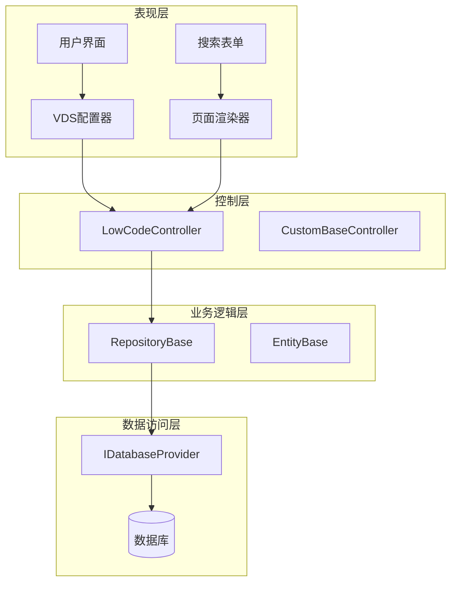
```mermaid
graph TB
subgraph "表现层"
UI[用户界面]
Configurator[VDS配置器]
Renderer[页面渲染器]
SearchForm[搜索表单]
end
subgraph "控制层"
Controller[LowCodeController]
BaseCtrl[CustomBaseController]
end
subgraph "业务逻辑层"
Repository[RepositoryBase]
Entity[EntityBase]
end
subgraph "数据访问层"
DB[(数据库)]
Provider[IDatabaseProvider]
end
UI --> Configurator
Configurator --> Controller
Renderer --> Controller
SearchForm --> Renderer
Controller --> Repository
Repository --> Provider
Provider --> DB
```

**图表来源**
- [LowCodeController.cs:13-162](file://Sylas.RemoteTasks.App/Controllers/LowCodeController.cs#L13-L162)
- [RepositoryBase.cs:10-194](file://Sylas.RemoteTasks.App/Infrastructure/RepositoryBase.cs#L10-L194)

**章节来源**
- [LowCodeController.cs:1-163](file://Sylas.RemoteTasks.App/Controllers/LowCodeController.cs#L1-L163)
- [RepositoryBase.cs:1-233](file://Sylas.RemoteTasks.App/Infrastructure/RepositoryBase.cs#L1-L233)

## 核心组件

### VdsPage实体模型

VdsPage是系统的核心数据模型，用于存储VDS页面的配置信息：

| 属性名 | 类型 | 描述 | 默认值 |
|--------|------|------|--------|
| Id | int | 主键标识 | null |
| Name | string | 页面唯一标识（用于路由） | "" |
| Title | string | 页面标题（显示用） | "" |
| Description | string | 页面描述 | "" |
| VdsConfig | string | VDS配置JSON | "{}" |
| IsEnabled | bool | 是否启用 | true |
| OrderNo | int | 排序号 | 0 |
| CreateTime | DateTime | 创建时间 | 当前时间 |
| UpdateTime | DateTime | 更新时间 | 当前时间 |

### VDS配置器架构

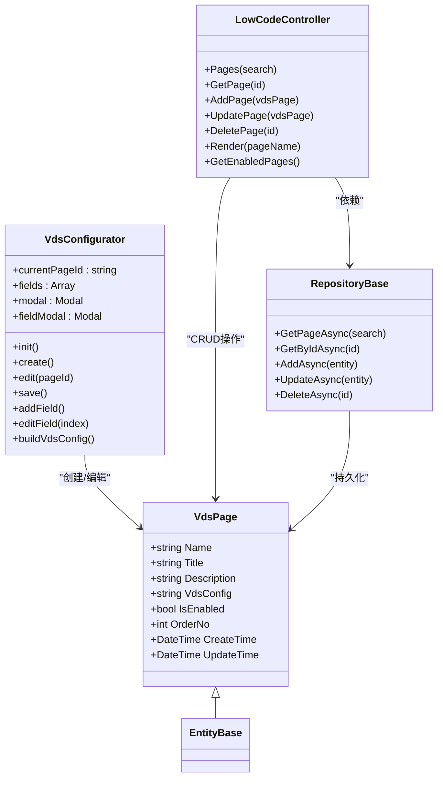
```mermaid
classDiagram
class VdsPage {
+string Name
+string Title
+string Description
+string VdsConfig
+bool IsEnabled
+int OrderNo
+DateTime CreateTime
+DateTime UpdateTime
}
class VdsConfigurator {
+currentPageId : string
+fields : Array
+modal : Modal
+fieldModal : Modal
+init()
+create()
+edit(pageId)
+save()
+addField()
+editField(index)
+buildVdsConfig()
}
class LowCodeController {
+Pages(search)
+GetPage(id)
+AddPage(vdsPage)
+UpdatePage(vdsPage)
+DeletePage(id)
+Render(pageName)
+GetEnabledPages()
}
class RepositoryBase {
+GetPageAsync(search)
+GetByIdAsync(id)
+AddAsync(entity)
+UpdateAsync(entity)
+DeleteAsync(id)
}
VdsPage <|-- EntityBase
VdsConfigurator --> VdsPage : "创建/编辑"
LowCodeController --> VdsPage : "CRUD操作"
LowCodeController --> RepositoryBase : "依赖"
RepositoryBase --> VdsPage : "持久化"
```

**图表来源**
- [VdsPage.cs:11-62](file://Sylas.RemoteTasks.App/LowCode/VdsPage.cs#L11-L62)
- [vds-configurator.js:5-715](file://Sylas.RemoteTasks.App/wwwroot/js/vds-configurator.js#L5-L715)
- [LowCodeController.cs:13-162](file://Sylas.RemoteTasks.App/Controllers/LowCodeController.cs#L13-L162)

**章节来源**
- [VdsPage.cs:1-64](file://Sylas.RemoteTasks.App/LowCode/VdsPage.cs#L1-L64)
- [vds-configurator.js:1-715](file://Sylas.RemoteTasks.App/wwwroot/js/vds-configurator.js#L1-L715)

## 架构概览

VDS字段配置系统采用现代化的前后端分离架构，结合了传统的MVC模式和现代的前端框架技术：

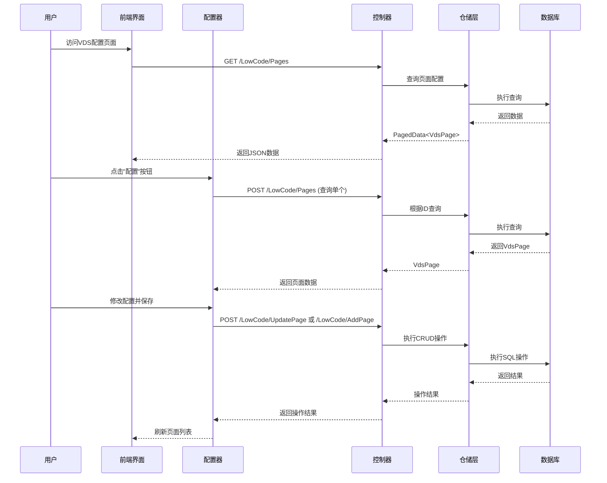
```mermaid
sequenceDiagram
participant User as 用户
participant UI as 前端界面
participant Config as 配置器
participant Ctrl as 控制器
participant Repo as 仓储层
participant DB as 数据库
User->>UI : 访问VDS配置页面
UI->>Ctrl : GET /LowCode/Pages
Ctrl->>Repo : 查询页面配置
Repo->>DB : 执行查询
DB-->>Repo : 返回数据
Repo-->>Ctrl : PagedData<VdsPage>
Ctrl-->>UI : 返回JSON数据
User->>Config : 点击"配置"按钮
Config->>Ctrl : POST /LowCode/Pages (查询单个)
Ctrl->>Repo : 根据ID查询
Repo->>DB : 执行查询
DB-->>Repo : 返回VdsPage
Repo-->>Ctrl : VdsPage
Ctrl-->>Config : 返回页面数据
User->>Config : 修改配置并保存
Config->>Ctrl : POST /LowCode/UpdatePage 或 /LowCode/AddPage
Ctrl->>Repo : 执行CRUD操作
Repo->>DB : 执行SQL操作
DB-->>Repo : 返回结果
Repo-->>Ctrl : 操作结果
Ctrl-->>Config : 返回操作结果
Config-->>UI : 刷新页面列表
```

**图表来源**
- [LowCodeController.cs:31-116](file://Sylas.RemoteTasks.App/Controllers/LowCodeController.cs#L31-L116)
- [vds-configurator.js:45-700](file://Sylas.RemoteTasks.App/wwwroot/js/vds-configurator.js#L45-L700)

## 详细组件分析

### VDS配置器组件

VDS配置器是系统的核心前端组件，提供了完整的可视化配置功能：

#### 字段类型系统

系统支持多种字段类型，每种类型都有特定的配置选项：

| 字段类型 | 描述 | 配置选项 | 用途 |
|----------|------|----------|------|
| 文本 | 基础文本字段 | 名称、标题、对齐方式 | 显示普通文本内容 |
| 数字 | 数值类型字段 | 名称、标题、数值格式 | 显示数字数据 |
| 多行文本 | 长文本字段 | 名称、标题、截断长度 | 显示长文本内容 |
| 枚举 | 下拉选择字段 | 名称、标题、枚举值列表 | 提供固定选项选择 |
| 图片 | 图片显示字段 | 名称、标题、图片链接 | 显示单张图片 |
| 多媒体 | 媒体文件字段 | 名称、标题、媒体URL列表 | 显示视频、音频、图片 |
| 数据源 | 动态数据字段 | API接口、显示字段、默认值、可筛选 | 从外部API获取数据 |
| 操作按钮 | 交互按钮字段 | 按钮配置、模板 | 提供用户交互操作 |

#### 字段配置流程

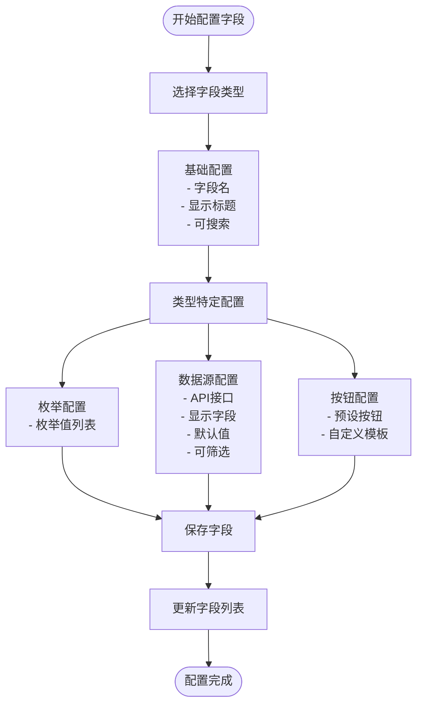
```mermaid
flowchart TD
Start([开始配置字段]) --> SelectType["选择字段类型"]
SelectType --> BasicConfig["基础配置<br/>- 字段名<br/>- 显示标题<br/>- 可搜索"]
BasicConfig --> TypeSpecific["类型特定配置"]
TypeSpecific --> EnumConfig["枚举配置<br/>- 枚举值列表"]
TypeSpecific --> DataSourceConfig["数据源配置<br/>- API接口<br/>- 显示字段<br/>- 默认值<br/>- 可筛选"]
TypeSpecific --> ButtonConfig["按钮配置<br/>- 预设按钮<br/>- 自定义模板"]
EnumConfig --> SaveField["保存字段"]
DataSourceConfig --> SaveField
ButtonConfig --> SaveField
SaveField --> FieldList["更新字段列表"]
FieldList --> End([配置完成])
```

**图表来源**
- [vds-configurator.js:227-544](file://Sylas.RemoteTasks.App/wwwroot/js/vds-configurator.js#L227-L544)

#### 拖拽排序机制

系统实现了直观的拖拽排序功能，允许用户通过鼠标拖拽重新排列字段顺序：

```mermaid
flowchart LR
DragStart["拖拽开始"] --> DragOver["拖拽经过"]
DragOver --> CheckPosition["检查位置"]
CheckPosition --> Insert["插入元素"]
Insert --> UpdateOrder["更新排序数组"]
UpdateOrder --> RefreshList["刷新字段列表"]
RefreshList --> DragEnd["拖拽结束"]
DragStart --> |用户操作| DragOver
DragOver --> |移动光标| CheckPosition
CheckPosition --> |确定位置| Insert
Insert --> |更新DOM| UpdateOrder
UpdateOrder --> |重新渲染| RefreshList
RefreshList --> |完成| DragEnd
```

**图表来源**
- [vds-configurator.js:183-222](file://Sylas.RemoteTasks.App/wwwroot/js/vds-configurator.js#L183-L222)

#### 数据源字段搜索机制

**更新** 系统新增了数据源字段搜索机制，能够区分普通字段和数据源字段的不同搜索逻辑：

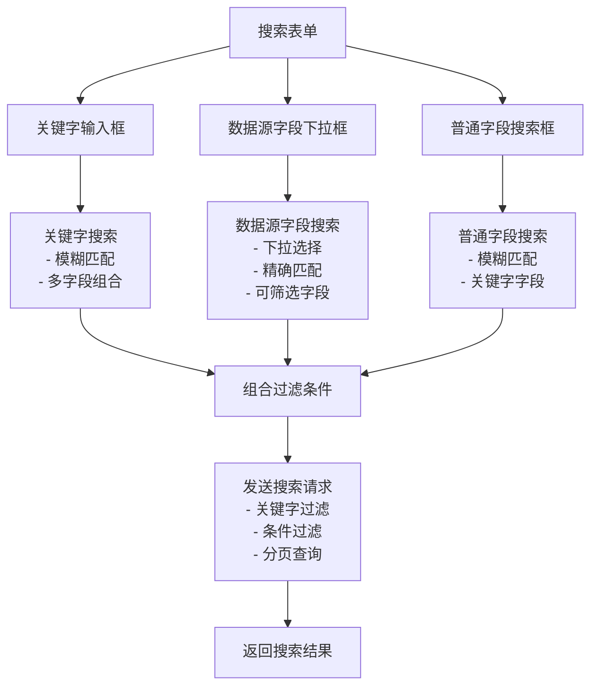
```mermaid
flowchart TD
SearchForm["搜索表单"] --> KeywordInput["关键字输入框"]
SearchForm --> DataSourceFields["数据源字段下拉框"]
SearchForm --> NormalFields["普通字段搜索框"]
KeywordInput --> KeywordSearch["关键字搜索<br/>- 模糊匹配<br/>- 多字段组合"]
DataSourceFields --> DataSourceSearch["数据源字段搜索<br/>- 下拉选择<br/>- 精确匹配<br/>- 可筛选字段"]
NormalFields --> NormalSearch["普通字段搜索<br/>- 模糊匹配<br/>- 关键字字段"]
KeywordSearch --> CombinedFilter["组合过滤条件"]
DataSourceSearch --> CombinedFilter
NormalSearch --> CombinedFilter
CombinedFilter --> BackendRequest["发送搜索请求<br/>- 关键字过滤<br/>- 条件过滤<br/>- 分页查询"]
BackendRequest --> Result["返回搜索结果"]
```

**图表来源**
- [site.js:583-669](file://Sylas.RemoteTasks.App/wwwroot/js/site.js#L583-L669)
- [vds-configurator.js:1114-1120](file://Sylas.RemoteTasks.App/wwwroot/js/vds-configurator.js#L1114-L1120)

**章节来源**
- [vds-configurator.js:1-715](file://Sylas.RemoteTasks.App/wwwroot/js/vds-configurator.js#L1-L715)
- [site.js:583-669](file://Sylas.RemoteTasks.App/wwwroot/js/site.js#L583-L669)

### 控制器层组件

LowCodeController负责处理所有与VDS页面相关的HTTP请求：

#### CRUD操作流程

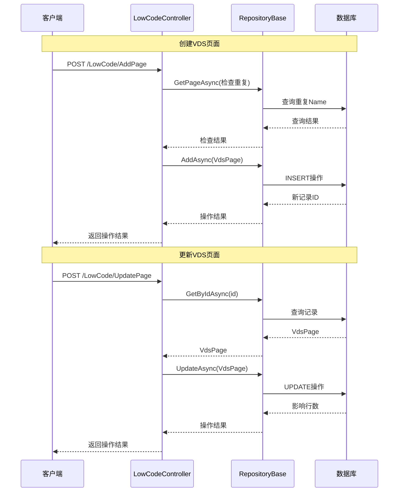
```mermaid
sequenceDiagram
participant Client as 客户端
participant Controller as LowCodeController
participant Repository as RepositoryBase
participant Database as 数据库
Note over Client,Database : 创建VDS页面
Client->>Controller : POST /LowCode/AddPage
Controller->>Repository : GetPageAsync(检查重复)
Repository->>Database : 查询重复Name
Database-->>Repository : 查询结果
Repository-->>Controller : 检查结果
Controller->>Repository : AddAsync(VdsPage)
Repository->>Database : INSERT操作
Database-->>Repository : 新记录ID
Repository-->>Controller : 操作结果
Controller-->>Client : 返回操作结果
Note over Client,Database : 更新VDS页面
Client->>Controller : POST /LowCode/UpdatePage
Controller->>Repository : GetByIdAsync(id)
Repository->>Database : 查询记录
Database-->>Repository : VdsPage
Repository-->>Controller : VdsPage
Controller->>Repository : UpdateAsync(VdsPage)
Repository->>Database : UPDATE操作
Database-->>Repository : 影响行数
Repository-->>Controller : 操作结果
Controller-->>Client : 返回操作结果
```

**图表来源**
- [LowCodeController.cs:55-99](file://Sylas.RemoteTasks.App/Controllers/LowCodeController.cs#L55-L99)
- [RepositoryBase.cs:71-121](file://Sylas.RemoteTasks.App/Infrastructure/RepositoryBase.cs#L71-L121)

**章节来源**
- [LowCodeController.cs:1-163](file://Sylas.RemoteTasks.App/Controllers/LowCodeController.cs#L1-L163)
- [RepositoryBase.cs:1-233](file://Sylas.RemoteTasks.App/Infrastructure/RepositoryBase.cs#L1-L233)

### 页面渲染组件

系统支持两种页面渲染模式：管理页面和用户页面。

#### 管理页面渲染

管理页面提供VDS配置的可视化编辑界面：

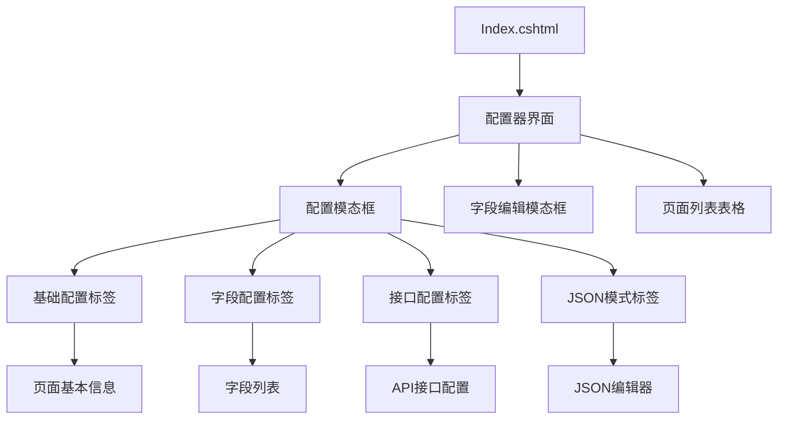
```mermaid
graph TD
Index[Index.cshtml] --> Configurator[配置器界面]
Configurator --> Modal[配置模态框]
Configurator --> FieldModal[字段编辑模态框]
Configurator --> Table[页面列表表格]
Modal --> BasicTab[基础配置标签]
Modal --> FieldsTab[字段配置标签]
Modal --> ApiTab[接口配置标签]
Modal --> JsonTab[JSON模式标签]
BasicTab --> PageConfig[页面基本信息]
FieldsTab --> FieldList[字段列表]
ApiTab --> ApiConfig[API接口配置]
JsonTab --> JsonEditor[JSON编辑器]
```

**图表来源**
- [Index.cshtml:14-195](file://Sylas.RemoteTasks.App/Views/LowCode/Index.cshtml#L14-L195)

#### 用户页面渲染

用户页面根据VDS配置动态渲染数据表格：

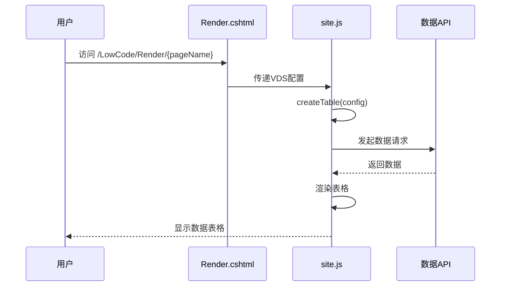
```mermaid
sequenceDiagram
participant User as 用户
participant Render as Render.cshtml
participant SiteJS as site.js
participant API as 数据API
User->>Render : 访问 /LowCode/Render/{pageName}
Render->>SiteJS : 传递VDS配置
SiteJS->>SiteJS : createTable(config)
SiteJS->>API : 发起数据请求
API-->>SiteJS : 返回数据
SiteJS->>SiteJS : 渲染表格
SiteJS-->>User : 显示数据表格
```

**图表来源**
- [Render.cshtml:15-42](file://Sylas.RemoteTasks.App/Views/LowCode/Render.cshtml#L15-L42)
- [site.js:32-200](file://Sylas.RemoteTasks.App/wwwroot/js/site.js#L32-L200)

**章节来源**
- [Index.cshtml:1-366](file://Sylas.RemoteTasks.App/Views/LowCode/Index.cshtml#L1-L366)
- [Render.cshtml:1-45](file://Sylas.RemoteTasks.App/Views/LowCode/Render.cshtml#L1-L45)

### 数据搜索与过滤系统

**更新** 系统新增了完善的数据搜索与过滤系统，支持多种搜索方式：

#### 数据搜索参数结构

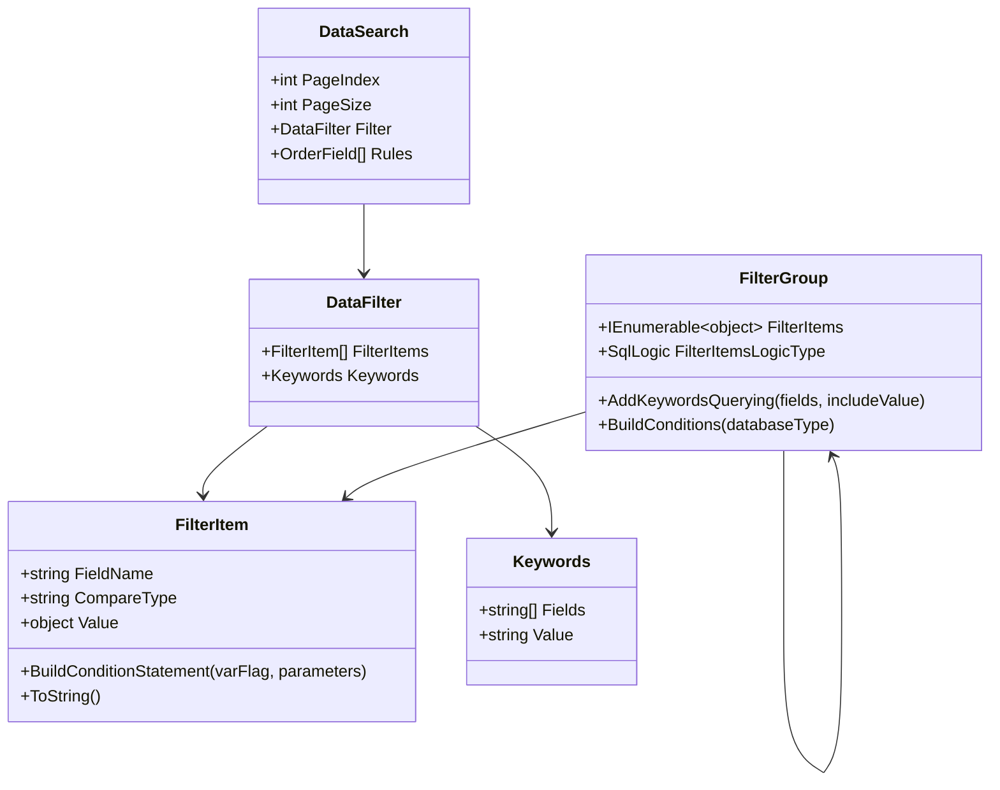
```mermaid
classDiagram
class DataSearch {
+int PageIndex
+int PageSize
+DataFilter Filter
+OrderField[] Rules
}
class DataFilter {
+FilterItem[] FilterItems
+Keywords Keywords
}
class FilterItem {
+string FieldName
+string CompareType
+object Value
+BuildConditionStatement(varFlag, parameters)
+ToString()
}
class Keywords {
+string[] Fields
+string Value
}
class FilterGroup {
+IEnumerable~object~ FilterItems
+SqlLogic FilterItemsLogicType
+AddKeywordsQuerying(fields, includeValue)
+BuildConditions(databaseType)
}
DataSearch --> DataFilter
DataFilter --> FilterItem
DataFilter --> Keywords
FilterGroup --> FilterItem
FilterGroup --> FilterGroup
```

**图表来源**
- [DataSearch.cs:8-47](file://Sylas.RemoteTasks.Database/SyncBase/DataSearch.cs#L8-L47)
- [DataFilter.cs:14-370](file://Sylas.RemoteTasks.Database/SyncBase/DataFilter.cs#L14-L370)
- [FilterGroup.cs:13-143](file://Sylas.RemoteTasks.Database/SyncBase/FilterGroup.cs#L13-L143)

#### 比较类型系统

系统支持多种比较类型，用于不同的搜索和过滤需求：

| 比较类型 | 符号 | 描述 | SQL语句示例 |
|----------|------|------|-------------|
| 等于 | = | 精确匹配 | WHERE field = ? |
| 不等于 | != | 不等于 | WHERE field != ? |
| 大于 | > | 大于 | WHERE field > ? |
| 小于 | < | 小于 | WHERE field < ? |
| 大于等于 | >= | 大于等于 | WHERE field >= ? |
| 小于等于 | <= | 小于等于 | WHERE field <= ? |
| 包含 | include | 模糊匹配 | WHERE field LIKE %?% |
| 在...之中 | in | 多值匹配 | WHERE field IN (?, ?, ?) |

**图表来源**
- [CompareTypeConsts.cs:8-53](file://Sylas.RemoteTasks.Database/SyncBase/CompareTypeConsts.cs#L8-L53)

**章节来源**
- [DataSearch.cs:1-49](file://Sylas.RemoteTasks.Database/SyncBase/DataSearch.cs#L1-L49)
- [DataFilter.cs:1-470](file://Sylas.RemoteTasks.Database/SyncBase/DataFilter.cs#L1-L470)
- [FilterGroup.cs:1-201](file://Sylas.RemoteTasks.Database/SyncBase/FilterGroup.cs#L1-L201)
- [CompareTypeConsts.cs:1-55](file://Sylas.RemoteTasks.Database/SyncBase/CompareTypeConsts.cs#L1-L55)

## 依赖关系分析

系统采用松耦合的设计模式，各组件之间的依赖关系清晰明确：

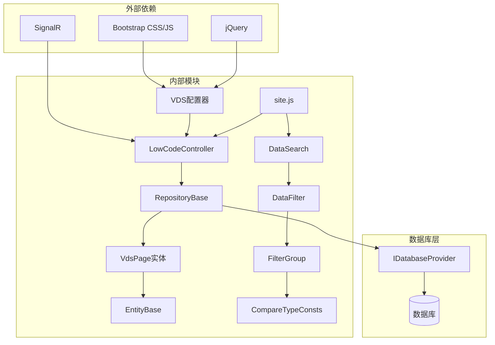
```mermaid
graph TB
subgraph "外部依赖"
Bootstrap[Bootstrap CSS/JS]
jQuery[jQuery]
SignalR[SignalR]
end
subgraph "内部模块"
VdsPage[VdsPage实体]
Configurator[VDS配置器]
Controller[LowCodeController]
Repository[RepositoryBase]
Entity[EntityBase]
SiteJS[site.js]
DataSearch[DataSearch]
DataFilter[DataFilter]
FilterGroup[FilterGroup]
CompareTypeConsts[CompareTypeConsts]
end
subgraph "数据库层"
Database[(数据库)]
Provider[IDatabaseProvider]
end
Bootstrap --> Configurator
jQuery --> Configurator
SignalR --> Controller
Configurator --> Controller
Controller --> Repository
Repository --> Provider
Provider --> Database
VdsPage --> Entity
Repository --> VdsPage
SiteJS --> Controller
SiteJS --> DataSearch
DataSearch --> DataFilter
DataFilter --> FilterGroup
FilterGroup --> CompareTypeConsts
```

**图表来源**
- [vds-configurator.js:1-715](file://Sylas.RemoteTasks.App/wwwroot/js/vds-configurator.js#L1-L715)
- [LowCodeController.cs:1-163](file://Sylas.RemoteTasks.App/Controllers/LowCodeController.cs#L1-L163)
- [RepositoryBase.cs:1-233](file://Sylas.RemoteTasks.App/Infrastructure/RepositoryBase.cs#L1-L233)

### 数据流分析

系统中的数据流向遵循标准的MVC模式：

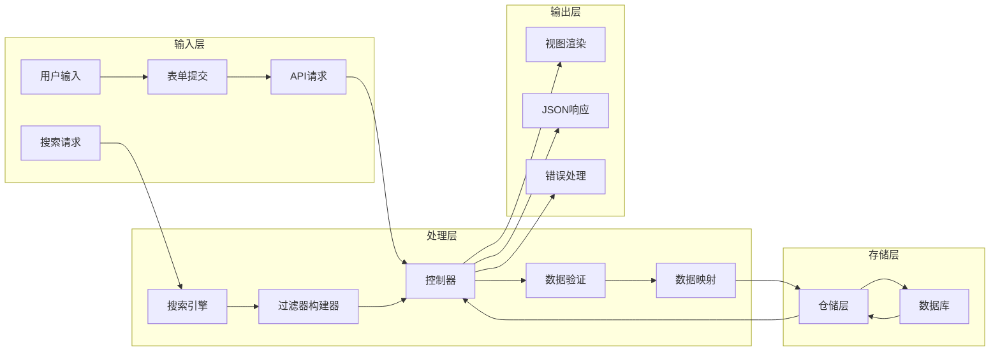
```mermaid
flowchart LR
subgraph "输入层"
User[用户输入]
Form[表单提交]
APIReq[API请求]
SearchReq[搜索请求]
end
subgraph "处理层"
Controller[控制器]
Validator[数据验证]
Mapper[数据映射]
SearchEngine[搜索引擎]
FilterBuilder[过滤器构建器]
end
subgraph "存储层"
Repository[仓储层]
Database[数据库]
end
subgraph "输出层"
View[视图渲染]
JsonResponse[JSON响应]
Error[错误处理]
end
User --> Form
Form --> APIReq
APIReq --> Controller
SearchReq --> SearchEngine
SearchEngine --> FilterBuilder
FilterBuilder --> Controller
Controller --> Validator
Validator --> Mapper
Mapper --> Repository
Repository --> Database
Database --> Repository
Repository --> Controller
Controller --> View
Controller --> JsonResponse
Controller --> Error
```

**图表来源**
- [LowCodeController.cs:27-116](file://Sylas.RemoteTasks.App/Controllers/LowCodeController.cs#L27-L116)
- [RepositoryBase.cs:20-192](file://Sylas.RemoteTasks.App/Infrastructure/RepositoryBase.cs#L20-L192)

**章节来源**
- [EntityBase.cs:1-33](file://Sylas.RemoteTasks.Database/EntityBase.cs#L1-L33)
- [site.js:1-200](file://Sylas.RemoteTasks.App/wwwroot/js/site.js#L1-L200)

## 性能考虑

### 数据库优化

系统在数据库操作方面采用了多项优化策略：

1. **批量查询优化**：使用Dapper进行高性能的数据库操作
2. **分页查询**：支持大数据量的分页显示
3. **索引优化**：对常用查询字段建立适当的索引
4. **连接池管理**：合理管理数据库连接资源
5. **数据源缓存**：对数据源字段的下拉选项进行缓存，避免重复请求

### 前端性能优化

1. **懒加载机制**：页面按需加载，减少初始加载时间
2. **缓存策略**：对静态资源和配置数据进行缓存
3. **异步操作**：所有网络请求都采用异步处理
4. **内存管理**：及时释放不再使用的DOM元素和事件监听器
5. **搜索防抖**：关键字搜索采用防抖机制，避免频繁请求

### 缓存策略

系统实现了多层次的缓存机制：

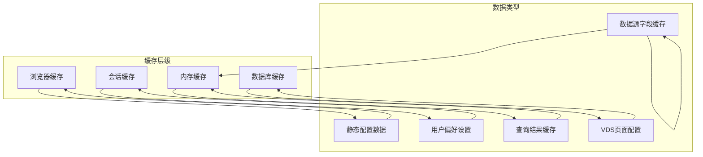
```mermaid
graph TD
subgraph "缓存层级"
BrowserCache[浏览器缓存]
SessionCache[会话缓存]
MemoryCache[内存缓存]
DatabaseCache[数据库缓存]
end
subgraph "数据类型"
StaticData[静态配置数据]
UserPref[用户偏好设置]
QueryResult[查询结果缓存]
PageConfig[VDS页面配置]
DataSourceCache[数据源字段缓存]
end
BrowserCache --> StaticData
SessionCache --> UserPref
MemoryCache --> QueryResult
DatabaseCache --> PageConfig
DataSourceCache --> DataSourceCache
StaticData --> BrowserCache
UserPref --> SessionCache
QueryResult --> MemoryCache
PageConfig --> DatabaseCache
DataSourceCache --> MemoryCache
```

**章节来源**
- [site.js:100-101](file://Sylas.RemoteTasks.App/wwwroot/js/site.js#L100-L101)
- [site.js:551-563](file://Sylas.RemoteTasks.App/wwwroot/js/site.js#L551-L563)

## 故障排除指南

### 常见问题及解决方案

#### 配置器无法加载

**问题症状**：VDS配置器页面无法正常显示

**可能原因**：
1. JavaScript文件加载失败
2. Bootstrap依赖未正确加载
3. Token验证失败

**解决步骤**：
1. 检查浏览器控制台是否有JavaScript错误
2. 确认所有必需的CSS和JS文件都能正常访问
3. 验证用户登录状态和权限

#### 字段配置异常

**问题症状**：字段配置保存后不生效

**可能原因**：
1. JSON格式错误
2. 字段类型配置不匹配
3. 数据源API不可用

**解决步骤**：
1. 使用JSON格式化工具检查配置格式
2. 验证字段类型与数据类型的匹配性
3. 测试数据源API的可用性和响应格式

#### 页面渲染问题

**问题症状**：VDS页面无法正确显示数据

**可能原因**：
1. API接口返回格式不正确
2. 字段映射配置错误
3. 权限不足

**解决步骤**：
1. 检查API接口的响应格式和数据结构
2. 验证字段配置与实际数据结构的匹配
3. 确认用户具有访问相应数据的权限

#### 数据源字段搜索问题

**问题症状**：数据源字段搜索功能异常

**可能原因**：
1. 数据源API配置错误
2. 数据源字段未正确标记为可筛选
3. 搜索表单未正确生成

**解决步骤**：
1. 验证数据源API的URL和参数配置
2. 确认数据源字段的`searchable`属性已设置
3. 检查搜索表单的动态生成逻辑
4. 验证数据源字段的下拉选项是否正确加载

#### 条件搜索功能异常

**问题症状**：条件搜索无法正常工作

**可能原因**：
1. 比较类型配置错误
2. 过滤条件构建器异常
3. SQL语句生成错误

**解决步骤**：
1. 验证比较类型是否在支持列表中
2. 检查FilterItem的BuildConditionStatement方法
3. 确认SQL语句的参数绑定正确
4. 验证数据库类型兼容性

**章节来源**
- [vds-configurator.js:598-606](file://Sylas.RemoteTasks.App/wwwroot/js/vds-configurator.js#L598-L606)
- [LowCodeController.cs:42-50](file://Sylas.RemoteTasks.App/Controllers/LowCodeController.cs#L42-L50)
- [site.js:583-669](file://Sylas.RemoteTasks.App/wwwroot/js/site.js#L583-L669)

## 结论

VDS字段配置系统是一个功能完整、架构清晰的低代码配置平台。系统通过模块化的组件设计和标准化的开发流程，为用户提供了强大而易用的VDS页面配置能力。

**更新** 系统现已增强了数据源字段搜索机制，能够智能区分普通字段和数据源字段的不同搜索逻辑，并实现了条件搜索功能，支持多种比较类型。这些改进大大提升了系统的搜索能力和用户体验。

### 主要优势

1. **可视化配置**：直观的图形界面让用户无需编程知识即可创建复杂的表格页面
2. **灵活的字段系统**：支持多种字段类型和丰富的配置选项
3. **强大的搜索功能**：支持关键字搜索、条件搜索和数据源字段搜索
4. **良好的扩展性**：模块化设计便于功能扩展和定制
5. **性能优化**：采用多种优化策略确保系统的高效运行
6. **用户体验**：简洁明了的操作流程和即时反馈机制

### 技术特色

- **前后端分离**：采用现代化的前端框架和RESTful API设计
- **数据驱动**：通过JSON配置实现数据驱动的页面渲染
- **安全可靠**：完善的权限控制和数据验证机制
- **跨平台支持**：支持多种数据库和部署环境
- **智能搜索**：支持多种搜索方式和过滤条件
- **实时缓存**：对数据源字段进行智能缓存优化

该系统为类似的数据表格配置需求提供了一个优秀的解决方案，具有很高的实用价值和推广前景。