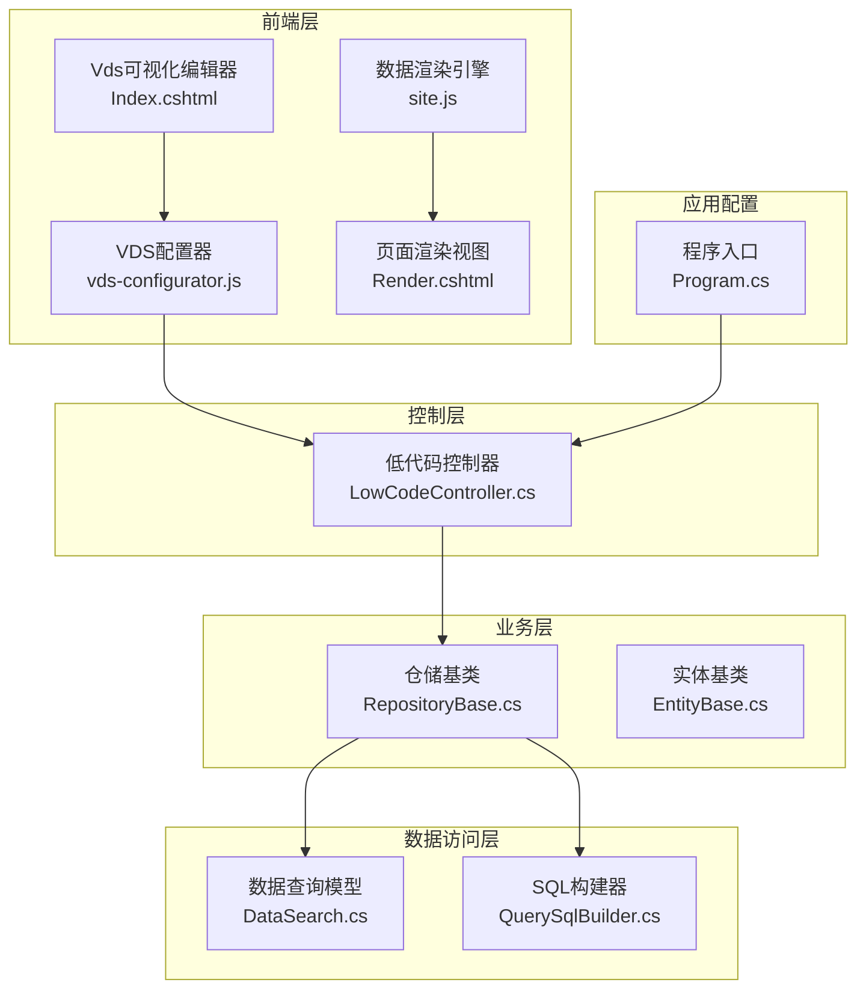
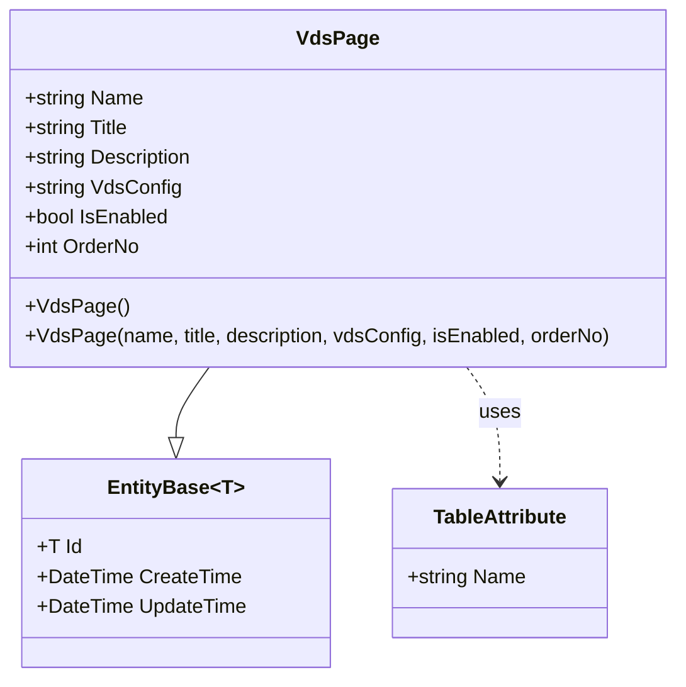
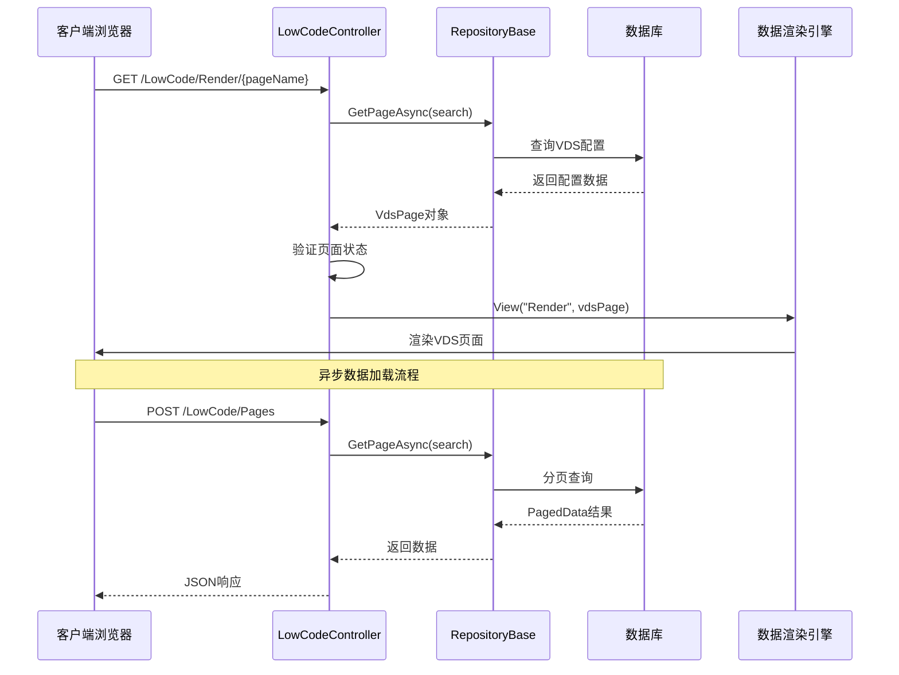
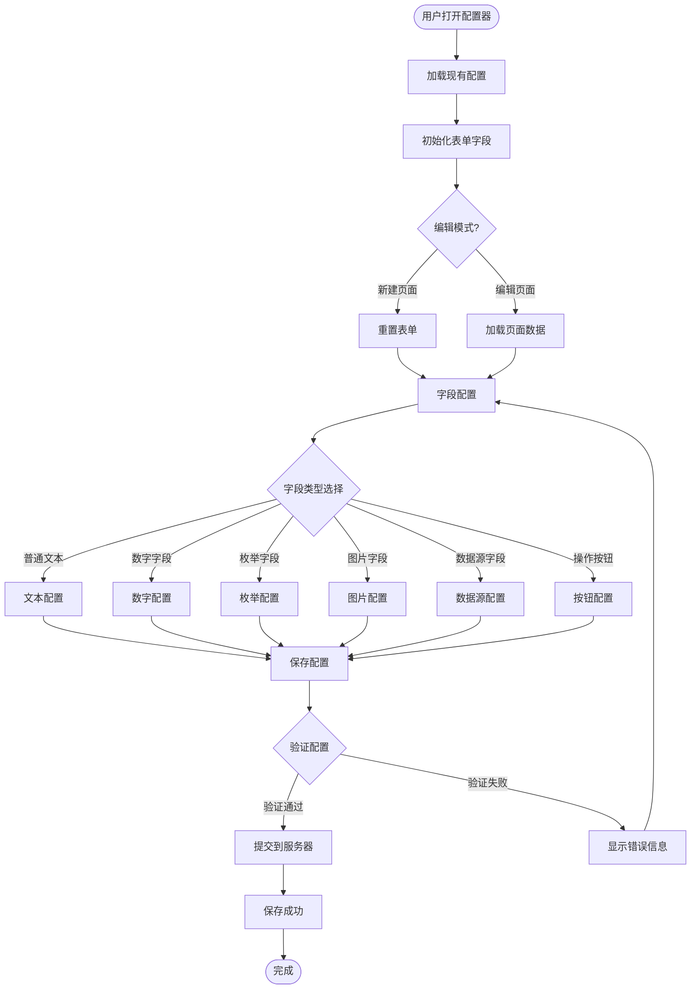
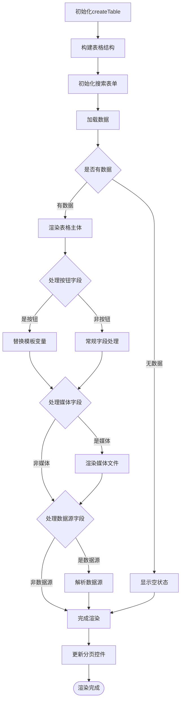
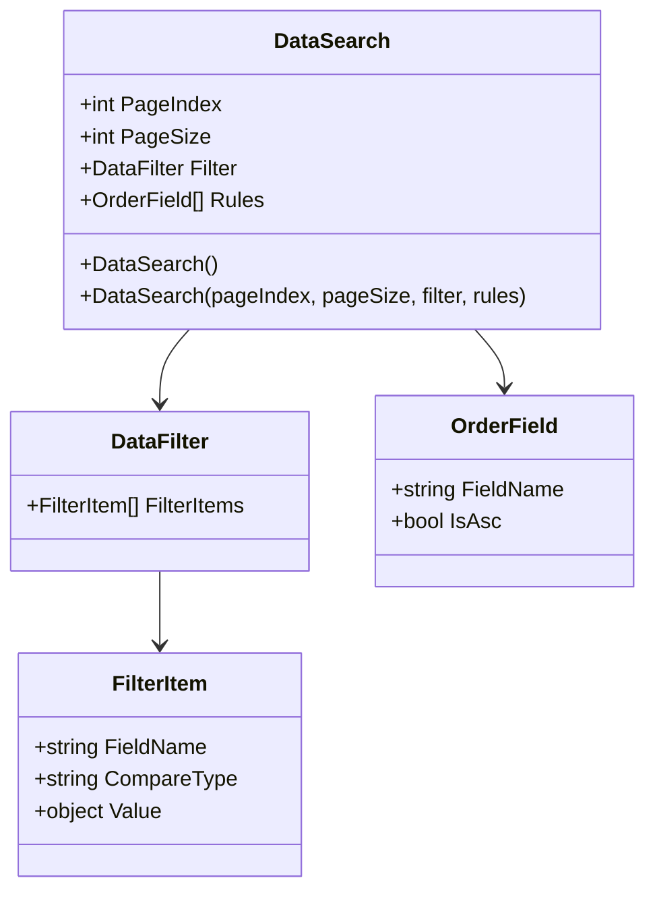
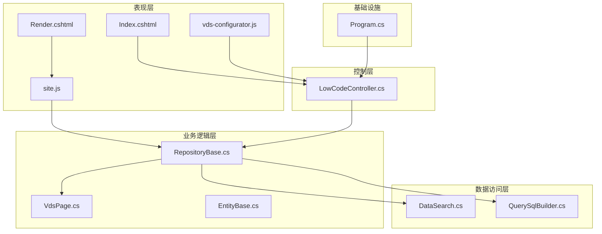

# VDS渲染系统

<cite>
**本文档引用的文件**
- [VdsPage.cs](file://Sylas.RemoteTasks.App/LowCode/VdsPage.cs)
- [LowCodeController.cs](file://Sylas.RemoteTasks.App/Controllers/LowCodeController.cs)
- [Index.cshtml](file://Sylas.RemoteTasks.App/Views/LowCode/Index.cshtml)
- [Render.cshtml](file://Sylas.RemoteTasks.App/Views/LowCode/Render.cshtml)
- [vds-configurator.js](file://Sylas.RemoteTasks.App/wwwroot/js/vds-configurator.js)
- [site.js](file://Sylas.RemoteTasks.App/wwwroot/js/site.js)
- [RepositoryBase.cs](file://Sylas.RemoteTasks.App/Infrastructure/RepositoryBase.cs)
- [DataSearch.cs](file://Sylas.RemoteTasks.Database/SyncBase/DataSearch.cs)
- [QuerySqlBuilder.cs](file://Sylas.RemoteTasks.Database/SyncBase/QuerySqlBuilder.cs)
- [EntityBase.cs](file://Sylas.RemoteTasks.App/Database/EntityBase.cs)
- [Program.cs](file://Sylas.RemoteTasks.App/Program.cs)
</cite>

## 目录
1. [简介](#简介)
2. [项目结构](#项目结构)
3. [核心组件](#核心组件)
4. [架构概览](#架构概览)
5. [详细组件分析](#详细组件分析)
6. [依赖关系分析](#依赖关系分析)
7. [性能考虑](#性能考虑)
8. [故障排除指南](#故障排除指南)
9. [结论](#结论)

## 简介

VDS渲染系统是一个基于ASP.NET Core的低代码可视化数据表格渲染引擎。该系统允许用户通过可视化的界面配置数据表格的显示方式，包括字段映射、数据接口、排序规则等，然后自动生成可交互的数据表格页面。

系统采用前后端分离的架构设计，前端使用JavaScript的createTable函数作为核心渲染引擎，后端提供RESTful API进行数据管理和配置存储。整个系统支持多种数据库类型，具有良好的扩展性和可维护性。

## 项目结构

VDS渲染系统采用典型的三层架构设计，主要包含以下模块：

**图表来源**
- [Program.cs](file://Sylas.RemoteTasks.App/Program.cs#L1-L122)
- [LowCodeController.cs](file://Sylas.RemoteTasks.App/Controllers/LowCodeController.cs#L1-L163)
- [RepositoryBase.cs](file://Sylas.RemoteTasks.App/Infrastructure/RepositoryBase.cs#L1-L233)

**章节来源**
- [Program.cs](file://Sylas.RemoteTasks.App/Program.cs#L1-L122)
- [LowCodeController.cs](file://Sylas.RemoteTasks.App/Controllers/LowCodeController.cs#L1-L163)

## 核心组件

### VDS页面配置实体

VdsPage实体是系统的核心数据模型，用于存储低代码页面的配置信息：

**图表来源**
- [VdsPage.cs](file://Sylas.RemoteTasks.App/LowCode/VdsPage.cs#L1-L64)
- [EntityBase.cs](file://Sylas.RemoteTasks.App/Database/EntityBase.cs#L1-L33)

### 低代码控制器

LowCodeController提供完整的CRUD操作接口，支持VDS页面的增删改查：

| 方法 | HTTP方法 | 描述 | 参数 |
|------|----------|------|------|
| Index | GET | VDS配置管理首页 | 无 |
| Pages | POST | 分页查询VDS页面配置 | DataSearch |
| GetPage | POST | 根据ID获取单个VDS配置 | int id |
| AddPage | POST | 添加VDS页面配置 | VdsPage |
| UpdatePage | POST | 更新VDS页面配置 | VdsPage |
| DeletePage | POST | 删除VDS页面配置 | int id |
| Render | GET | 根据页面名称动态渲染VDS页面 | string pageName |
| GetEnabledPages | GET | 获取所有已启用的VDS页面列表 | 无 |

**章节来源**
- [LowCodeController.cs](file://Sylas.RemoteTasks.App/Controllers/LowCodeController.cs#L1-L163)

### 数据渲染引擎

site.js中的createTable函数是系统的核心渲染引擎，提供以下功能：

- **数据表格渲染**：支持标准表格和自定义视图渲染
- **分页处理**：内置分页控件和导航
- **搜索过滤**：支持关键字搜索和多字段过滤
- **数据源处理**：支持下拉框数据源的异步加载
- **表单管理**：自动生成增删改查表单
- **媒体文件显示**：支持图片、视频、音频文件的预览

**章节来源**
- [site.js](file://Sylas.RemoteTasks.App/wwwroot/js/site.js#L32-L666)

## 架构概览

VDS渲染系统采用经典的MVC架构，结合现代前端框架的特点：

**图表来源**
- [LowCodeController.cs](file://Sylas.RemoteTasks.App/Controllers/LowCodeController.cs#L125-L144)
- [RepositoryBase.cs](file://Sylas.RemoteTasks.App/Infrastructure/RepositoryBase.cs#L20-L25)

**章节来源**
- [LowCodeController.cs](file://Sylas.RemoteTasks.App/Controllers/LowCodeController.cs#L125-L144)
- [RepositoryBase.cs](file://Sylas.RemoteTasks.App/Infrastructure/RepositoryBase.cs#L20-L25)

## 详细组件分析

### VDS可视化配置器

vds-configurator.js提供了完整的可视化配置界面，支持复杂的字段配置：

**图表来源**
- [vds-configurator.js](file://Sylas.RemoteTasks.App/wwwroot/js/vds-configurator.js#L45-L701)

#### 字段类型支持

系统支持多种字段类型的配置：

| 字段类型 | 描述 | 配置选项 |
|----------|------|----------|
| 文本 | 普通文本显示 | 搜索标记、截断长度、对齐方式 |
| 数字 | 数值类型显示 | 搜索标记、格式化显示 |
| 多行文本 | 支持换行的文本 | 搜索标记、截断长度 |
| 枚举 | 下拉选择框 | 枚举值列表、默认值 |
| 图片 | 图片文件显示 | 文件上传、预览功能 |
| 媒体 | 多媒体文件显示 | 视频、音频、图片混合 |
| 数据源 | 异步数据源 | API接口、显示字段、默认值 |
| 操作按钮 | 表格操作按钮 | 编辑、删除、自定义按钮 |

**章节来源**
- [vds-configurator.js](file://Sylas.RemoteTasks.App/wwwroot/js/vds-configurator.js#L298-L544)

### 数据渲染流程

数据渲染引擎的处理流程如下：

**图表来源**
- [site.js](file://Sylas.RemoteTasks.App/wwwroot/js/site.js#L115-L212)

**章节来源**
- [site.js](file://Sylas.RemoteTasks.App/wwwroot/js/site.js#L115-L212)

### 数据查询与分页

系统使用DataSearch模型进行数据查询参数的封装：

**图表来源**
- [DataSearch.cs](file://Sylas.RemoteTasks.Database/SyncBase/DataSearch.cs#L1-L49)

**章节来源**
- [DataSearch.cs](file://Sylas.RemoteTasks.Database/SyncBase/DataSearch.cs#L1-L49)

## 依赖关系分析

系统采用清晰的依赖层次结构：

**图表来源**
- [Program.cs](file://Sylas.RemoteTasks.App/Program.cs#L46-L58)
- [LowCodeController.cs](file://Sylas.RemoteTasks.App/Controllers/LowCodeController.cs#L13-L13)

**章节来源**
- [Program.cs](file://Sylas.RemoteTasks.App/Program.cs#L46-L58)

### 数据库支持

系统支持多种数据库类型，通过QuerySqlBuilder进行SQL语句的动态构建：

| 数据库类型 | 参数符号 | 分页语法 | 特殊处理 |
|------------|----------|----------|----------|
| SQL Server | @ | OFFSET/FETCH | 支持SCOPE_IDENTITY |
| MySQL | @ | LIMIT | 支持LAST_INSERT_ID |
| PostgreSQL | $ | LIMIT/OFFSET | 支持lastval |
| SQLite | @ | LIMIT/OFFSET | 支持last_insert_rowid |
| Oracle | : | ROWNUM | 支持RETURNING |
| 达梦 | : | ROWNUM | 支持参数绑定 |

**章节来源**
- [QuerySqlBuilder.cs](file://Sylas.RemoteTasks.Database/SyncBase/QuerySqlBuilder.cs#L366-L382)

## 性能考虑

### 前端性能优化

1. **懒加载机制**：数据源采用按需加载，避免一次性加载大量数据
2. **虚拟滚动**：对于大数据量场景，建议实现虚拟滚动以提升渲染性能
3. **缓存策略**：下拉框数据源支持缓存，减少重复请求
4. **模板复用**：按钮模板支持复用和组合，减少DOM操作

### 后端性能优化

1. **分页查询**：默认使用分页查询，避免全表扫描
2. **参数化查询**：使用参数化SQL防止SQL注入
3. **连接池管理**：合理配置数据库连接池大小
4. **查询优化**：支持复杂查询条件的SQL优化

### 内存管理

1. **对象生命周期**：合理管理JavaScript对象的生命周期
2. **事件监听器**：及时清理不再使用的事件监听器
3. **DOM操作**：批量DOM操作，减少重排重绘

## 故障排除指南

### 常见问题及解决方案

| 问题类型 | 症状 | 可能原因 | 解决方案 |
|----------|------|----------|----------|
| 页面无法加载 | 404错误 | 路由配置错误 | 检查路由配置和URL路径 |
| 数据不显示 | 表格为空 | API接口异常 | 检查API响应和网络连接 |
| 配置保存失败 | 保存提示错误 | 权限不足 | 检查用户权限和认证状态 |
| 字段显示异常 | 字段值错误 | 数据源配置错误 | 检查数据源API和字段映射 |
| 性能问题 | 页面加载缓慢 | 数据量过大 | 实施分页和缓存策略 |

### 调试技巧

1. **浏览器开发者工具**：使用Network标签监控API请求
2. **控制台日志**：检查JavaScript错误和警告
3. **服务器日志**：查看后端异常堆栈信息
4. **数据库查询日志**：监控SQL执行情况

**章节来源**
- [site.js](file://Sylas.RemoteTasks.App/wwwroot/js/site.js#L728-L782)

## 结论

VDS渲染系统是一个功能完整、架构清晰的低代码数据表格渲染解决方案。系统的主要优势包括：

1. **高度可配置性**：通过可视化界面即可完成复杂的数据表格配置
2. **良好的扩展性**：支持多种数据库类型和字段类型
3. **优秀的用户体验**：提供直观的配置界面和流畅的交互体验
4. **完善的错误处理**：具备完整的错误捕获和处理机制

系统适用于各种数据管理场景，特别是需要快速搭建数据表格展示页面的业务需求。通过合理的配置和优化，可以满足大多数企业级应用的数据展示需求。

未来可以考虑的功能增强包括：
- 增加更多的字段类型支持
- 实现虚拟滚动以提升大数据量性能
- 添加数据导出功能
- 支持更复杂的查询条件
- 增强移动端适配能力