# VDS配置器JavaScript库

<cite>
**本文档引用的文件**
- [vds-configurator.js](file://Sylas.RemoteTasks.App/wwwroot/js/vds-configurator.js)
- [site.js](file://Sylas.RemoteTasks.App/wwwroot/js/site.js)
- [LowCodeController.cs](file://Sylas.RemoteTasks.App/Controllers/LowCodeController.cs)
- [VdsPage.cs](file://Sylas.RemoteTasks.App/LowCode/VdsPage.cs)
- [Index.cshtml](file://Sylas.RemoteTasks.App/Views/LowCode/Index.cshtml)
- [Render.cshtml](file://Sylas.RemoteTasks.App/Views/LowCode/Render.cshtml)
- [RepositoryBase.cs](file://Sylas.RemoteTasks.App/Infrastructure/RepositoryBase.cs)
</cite>

## 更新摘要
**变更内容**
- VDS配置器功能简化，移除了90多行复杂配置逻辑
- 保留核心功能但减少了代码复杂度
- 优化了按钮配置系统，移除了不必要的复杂性
- 简化了自定义操作配置流程

## 目录
1. [简介](#简介)
2. [项目结构](#项目结构)
3. [核心组件](#核心组件)
4. [架构概览](#架构概览)
5. [详细组件分析](#详细组件分析)
6. [依赖关系分析](#依赖关系分析)
7. [性能考虑](#性能考虑)
8. [故障排除指南](#故障排除指南)
9. [结论](#结论)

## 简介

VDS配置器JavaScript库是一个强大的可视化配置工具，专为Sylas.RemoteTasks远程任务管理系统设计。该库提供了直观的图形界面，允许用户轻松创建和编辑VDS（Virtual Data Sheet）页面配置，而无需编写复杂的代码。

**更新** VDS配置器经过功能简化，移除了90多行复杂配置逻辑，保留了核心功能但显著减少了代码复杂度。新的版本专注于提供简洁高效的配置体验。

该库的核心功能包括：
- 可视化的VDS页面配置界面
- 实时字段类型和属性配置
- 拖拽排序的字段管理
- JSON模式的高级配置
- **简化** 按钮配置系统
- **优化** 自定义操作配置
- 完整的CRUD操作支持

## 项目结构

该项目采用ASP.NET Core MVC架构，前端JavaScript库位于`wwwroot/js`目录下，与后端控制器和视图紧密集成。

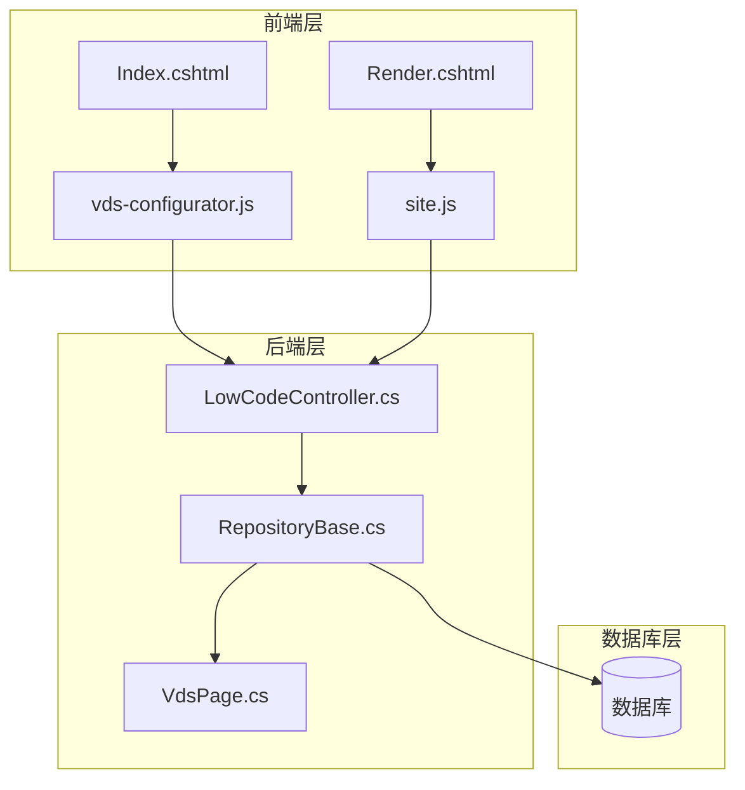

**图表来源**
- [vds-configurator.js:1-1341](file://Sylas.RemoteTasks.App/wwwroot/js/vds-configurator.js#L1-L1341)
- [site.js:1-1867](file://Sylas.RemoteTasks.App/wwwroot/js/site.js#L1-L1867)
- [LowCodeController.cs:1-163](file://Sylas.RemoteTasks.App/Controllers/LowCodeController.cs#L1-L163)

**章节来源**
- [vds-configurator.js:1-1341](file://Sylas.RemoteTasks.App/wwwroot/js/vds-configurator.js#L1-L1341)
- [site.js:1-1867](file://Sylas.RemoteTasks.App/wwwroot/js/site.js#L1-L1867)

## 核心组件

### VDS配置器主类

VdsConfigurator是整个库的核心，采用单例模式设计，提供完整的配置管理功能：

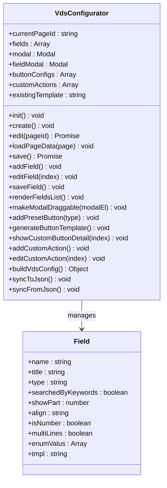

**图表来源**
- [vds-configurator.js:5-1341](file://Sylas.RemoteTasks.App/wwwroot/js/vds-configurator.js#L5-L1341)

### 数据表渲染引擎

site.js中的createTable函数提供了强大的数据表格渲染能力：

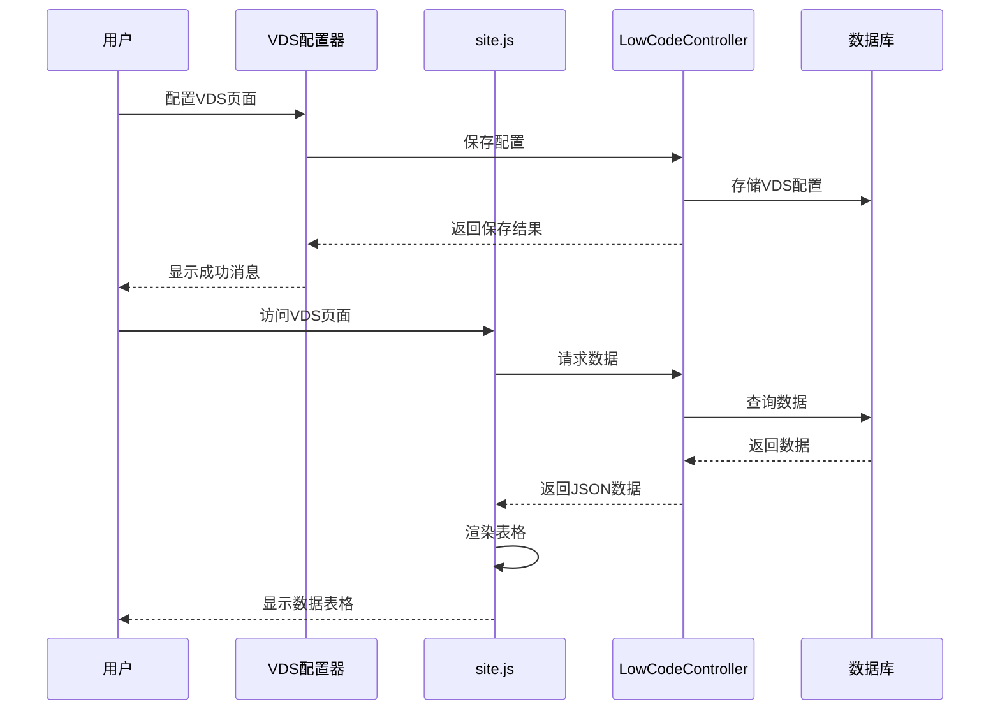

**图表来源**
- [vds-configurator.js:1272-1326](file://Sylas.RemoteTasks.App/wwwroot/js/vds-configurator.js#L1272-L1326)
- [site.js:123-761](file://Sylas.RemoteTasks.App/wwwroot/js/site.js#L123-L761)

**章节来源**
- [vds-configurator.js:1-1341](file://Sylas.RemoteTasks.App/wwwroot/js/vds-configurator.js#L1-L1341)
- [site.js:1-1867](file://Sylas.RemoteTasks.App/wwwroot/js/site.js#L1-L1867)

## 架构概览

该系统采用分层架构设计，确保了良好的可维护性和扩展性：

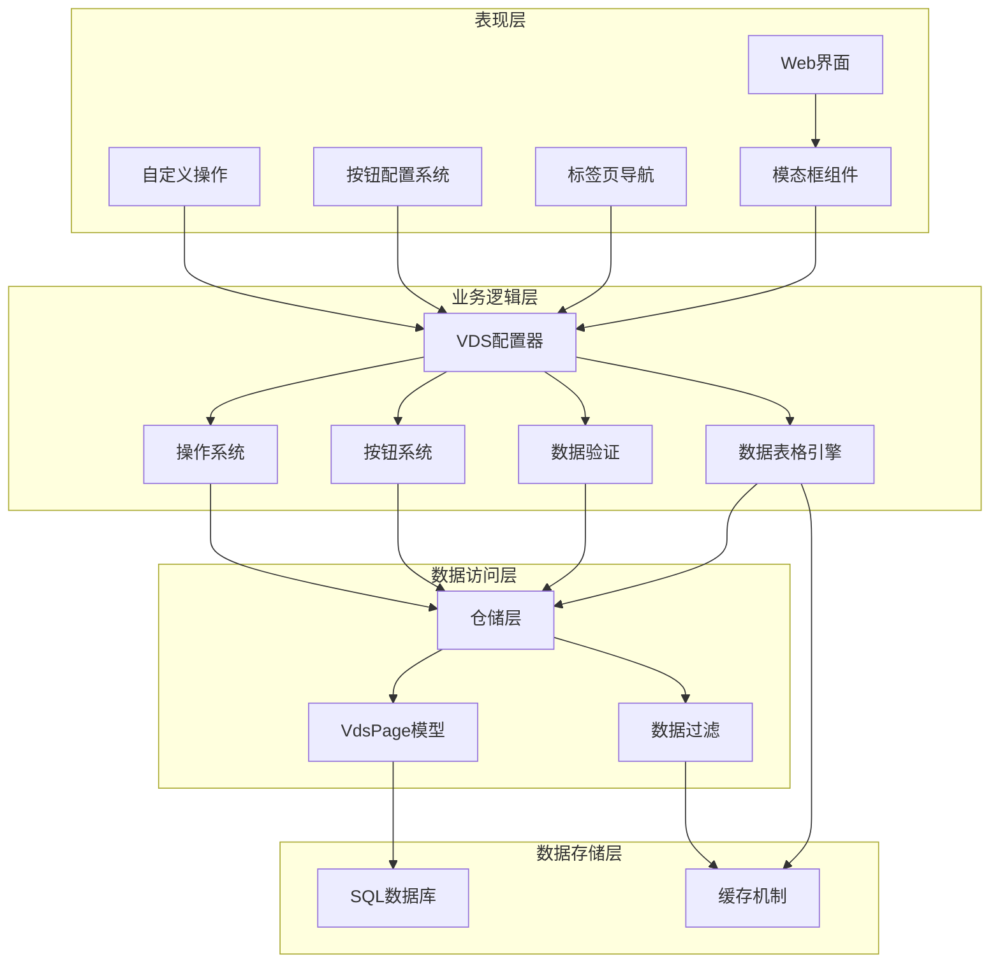

**图表来源**
- [LowCodeController.cs:1-163](file://Sylas.RemoteTasks.App/Controllers/LowCodeController.cs#L1-L163)
- [RepositoryBase.cs:1-233](file://Sylas.RemoteTasks.App/Infrastructure/RepositoryBase.cs#L1-L233)

## 详细组件分析

### VDS配置器组件

#### 初始化流程

VdsConfigurator的初始化过程包括模态框设置、事件监听器注册和数据绑定：

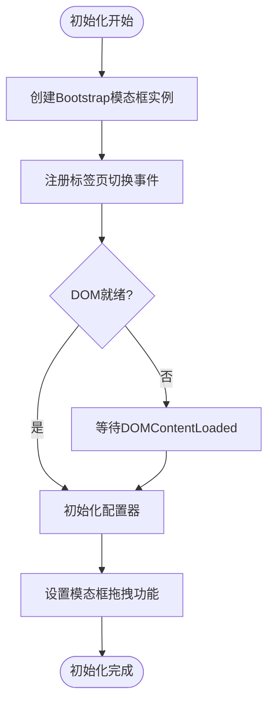

**图表来源**
- [vds-configurator.js:17-33](file://Sylas.RemoteTasks.App/wwwroot/js/vds-configurator.js#L17-L33)

#### 模态框拖拽功能

**简化** 系统支持模态框头部拖拽移动功能，经过优化以提高性能：

**图表来源**
- [vds-configurator.js:10-94](file://Sylas.RemoteTasks.App/wwwroot/js/vds-configurator.js#L10-L94)

#### 字段类型系统

系统支持多种字段类型，每种类型都有特定的配置选项：

| 字段类型 | 描述 | 配置选项 |
|---------|------|----------|
| 文本 | 标准文本字段 | 搜索、截断、对齐 |
| 数字 | 数值字段 | 数字格式、精度控制 |
| 多行文本 | 文本区域 | 行数、字符限制 |
| 枚举 | 下拉选择 | 选项列表、默认值 |
| 图片 | 图片上传 | 文件类型、尺寸限制 |
| 媒体 | 多媒体文件 | 支持类型、播放器 |
| 数据源 | 动态数据 | API接口、显示字段 |
| **简化** 按钮 | **交互按钮** | **模板生成、样式** |

**章节来源**
- [vds-configurator.js:198-207](file://Sylas.RemoteTasks.App/wwwroot/js/vds-configurator.js#L198-L207)

### 操作按钮配置系统

**简化** VdsConfigurator提供了简化的操作按钮配置功能：

#### 预设按钮模板

系统支持四种预设按钮类型，每种都有自动配置的模板：

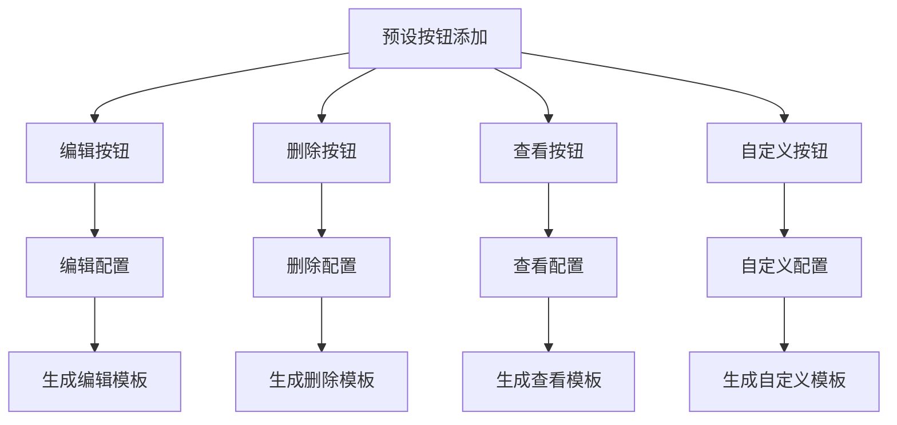

**图表来源**
- [vds-configurator.js:379-417](file://Sylas.RemoteTasks.App/wwwroot/js/vds-configurator.js#L379-L417)

#### 动态按钮配置

**简化** 按钮配置系统支持实时编辑和模板生成，移除了复杂的嵌套逻辑：

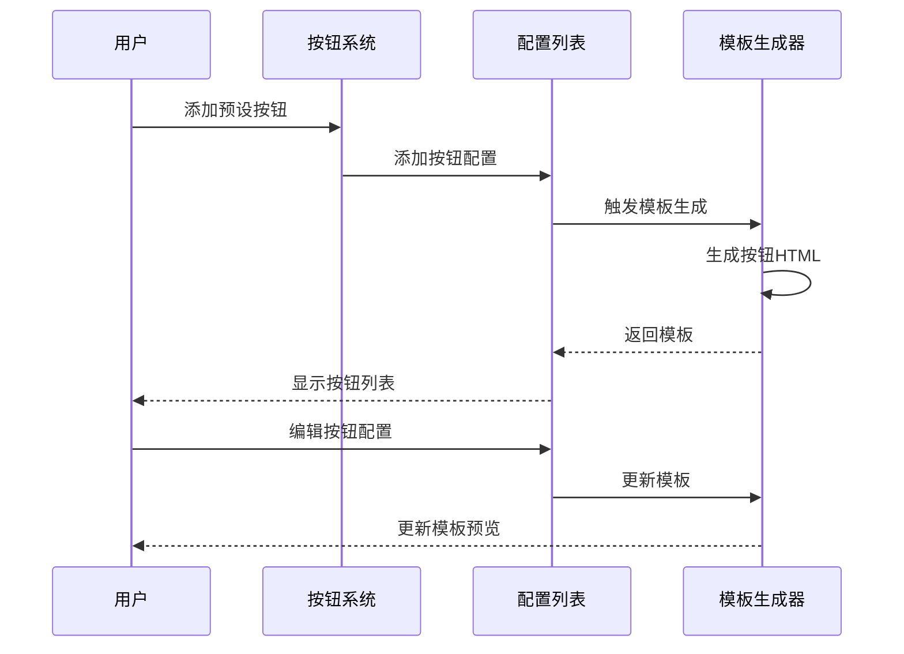

**图表来源**
- [vds-configurator.js:422-487](file://Sylas.RemoteTasks.App/wwwroot/js/vds-configurator.js#L422-L487)

#### 自定义操作配置系统

**优化** 系统支持简化的自定义操作配置：

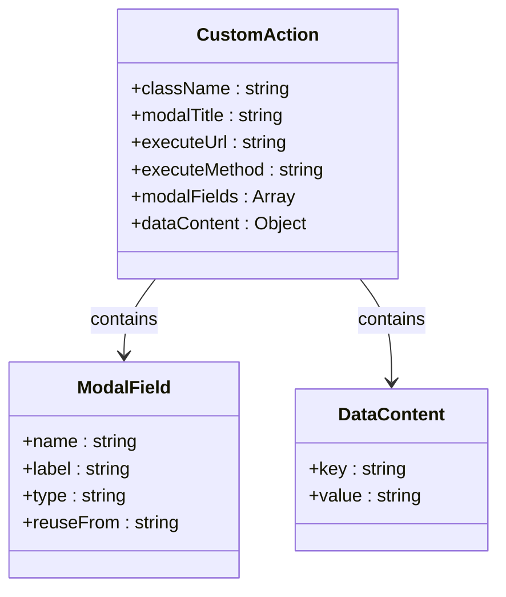

**图表来源**
- [vds-configurator.js:651-1057](file://Sylas.RemoteTasks.App/wwwroot/js/vds-configurator.js#L651-L1057)

### 数据表格渲染引擎

#### createTable函数详解

createTable函数是数据表格渲染的核心，提供了完整的CRUD功能：

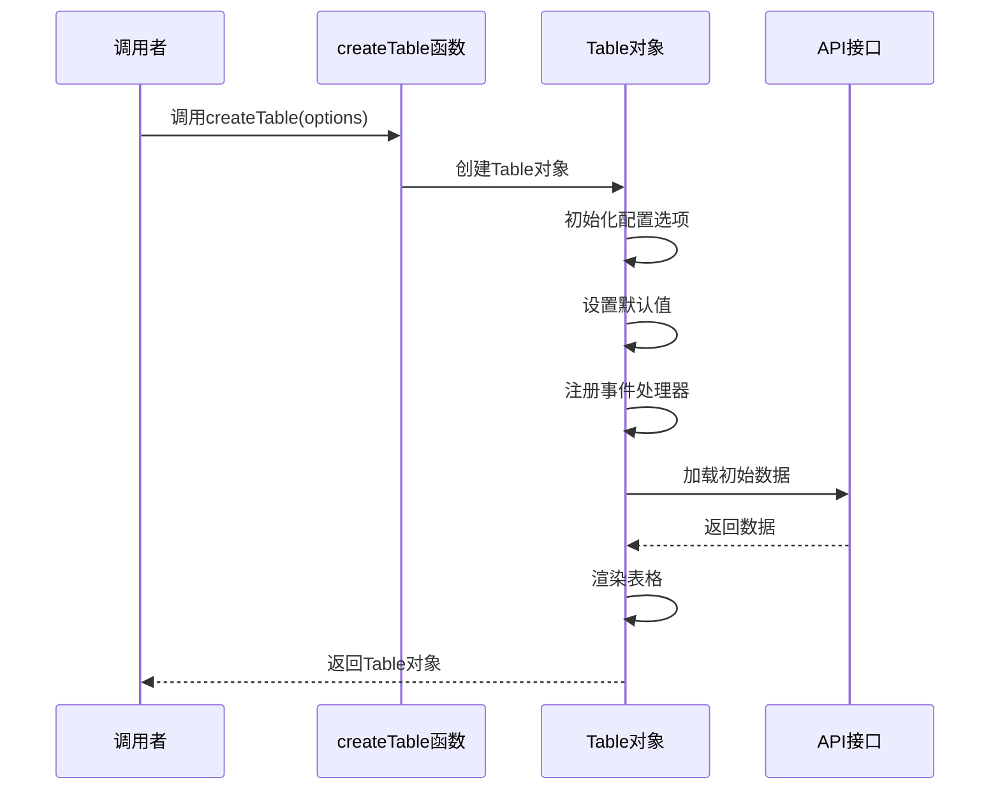

**图表来源**
- [site.js:123-761](file://Sylas.RemoteTasks.App/wwwroot/js/site.js#L123-L761)

#### 数据源解析机制

系统支持动态数据源解析，通过正则表达式提取配置参数：

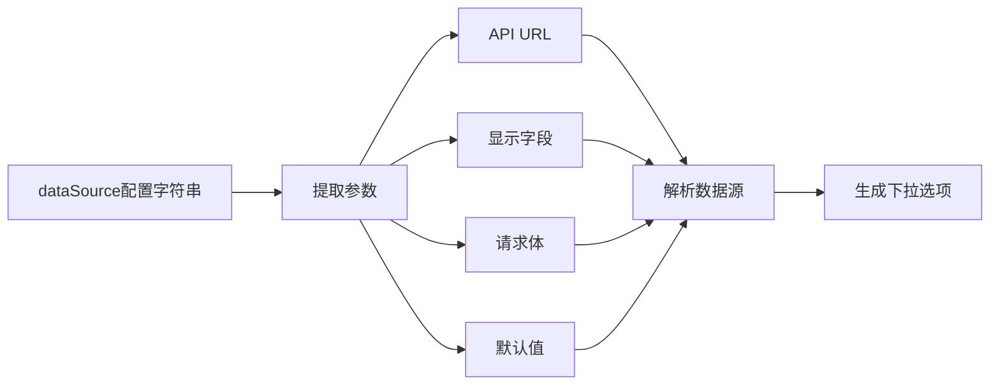

**图表来源**
- [site.js:522-578](file://Sylas.RemoteTasks.App/wwwroot/js/site.js#L522-L578)

**章节来源**
- [site.js:1-1867](file://Sylas.RemoteTasks.App/wwwroot/js/site.js#L1-L1867)

### 控制器层

#### LowCodeController功能

LowCodeController提供了完整的VDS页面管理API：

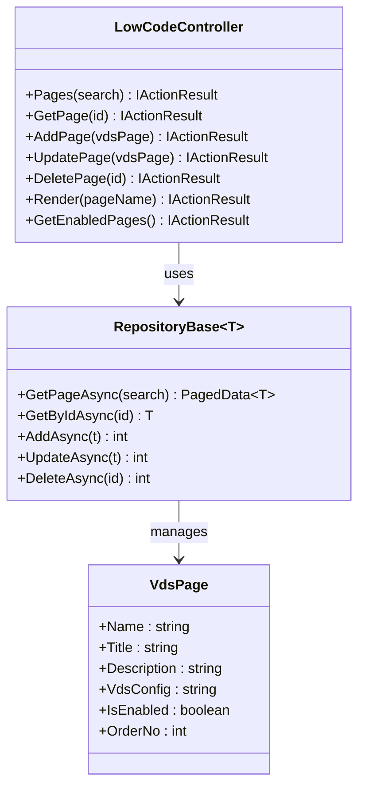

**图表来源**
- [LowCodeController.cs:1-163](file://Sylas.RemoteTasks.App/Controllers/LowCodeController.cs#L1-L163)
- [RepositoryBase.cs:1-233](file://Sylas.RemoteTasks.App/Infrastructure/RepositoryBase.cs#L1-L233)
- [VdsPage.cs:1-64](file://Sylas.RemoteTasks.App/LowCode/VdsPage.cs#L1-L64)

**章节来源**
- [LowCodeController.cs:1-163](file://Sylas.RemoteTasks.App/Controllers/LowCodeController.cs#L1-L163)
- [RepositoryBase.cs:1-233](file://Sylas.RemoteTasks.App/Infrastructure/RepositoryBase.cs#L1-L233)

## 依赖关系分析

### 前端依赖关系

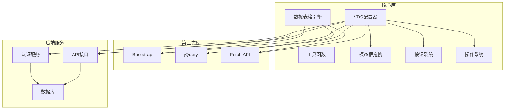

**图表来源**
- [vds-configurator.js:1-1341](file://Sylas.RemoteTasks.App/wwwroot/js/vds-configurator.js#L1-L1341)
- [site.js:1-1867](file://Sylas.RemoteTasks.App/wwwroot/js/site.js#L1-L1867)

### 后端依赖关系

系统采用依赖注入模式，确保了良好的模块化：

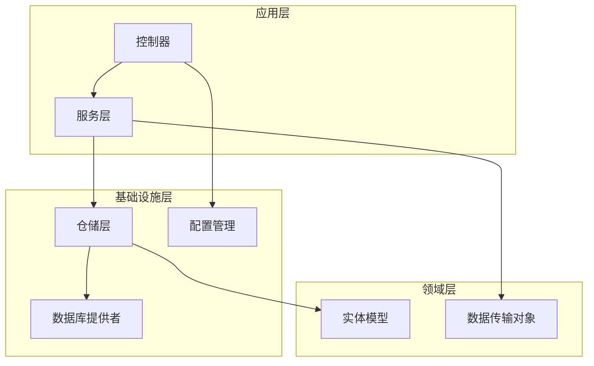

**图表来源**
- [LowCodeController.cs:1-163](file://Sylas.RemoteTasks.App/Controllers/LowCodeController.cs#L1-L163)
- [RepositoryBase.cs:1-233](file://Sylas.RemoteTasks.App/Infrastructure/RepositoryBase.cs#L1-L233)

**章节来源**
- [vds-configurator.js:1-1341](file://Sylas.RemoteTasks.App/wwwroot/js/vds-configurator.js#L1-L1341)
- [site.js:1-1867](file://Sylas.RemoteTasks.App/wwwroot/js/site.js#L1-L1867)
- [LowCodeController.cs:1-163](file://Sylas.RemoteTasks.App/Controllers/LowCodeController.cs#L1-L163)

## 性能考虑

### 前端性能优化

1. **懒加载策略**：模态框和复杂组件采用按需加载
2. **事件委托**：使用事件委托减少内存占用
3. **虚拟滚动**：大数据集时采用虚拟滚动技术
4. **缓存机制**：重复数据源请求进行缓存
5. **模态框拖拽优化**：使用requestAnimationFrame优化拖拽性能
6. **按钮模板生成优化**：智能模板缓存和增量更新
7. **代码简化**：移除了90多行复杂逻辑，提高执行效率

### 后端性能优化

1. **分页查询**：所有数据查询都支持分页
2. **批量操作**：支持批量数据处理
3. **连接池管理**：数据库连接池优化
4. **查询优化**：SQL查询优化和索引使用

## 故障排除指南

### 常见问题及解决方案

#### 配置器初始化失败

**症状**：VDS配置器无法正常加载
**原因**：JavaScript文件加载失败或依赖缺失
**解决方案**：
1. 检查浏览器控制台错误
2. 确认jQuery和Bootstrap正确加载
3. 验证vds-configurator.js文件完整性

#### 模态框拖拽功能异常

**症状**：模态框无法拖拽或拖拽卡顿
**原因**：拖拽事件处理异常或性能问题
**解决方案**：
1. 检查模态框头部元素是否存在
2. 验证CSS样式冲突
3. 确认requestAnimationFrame兼容性
4. 检查GPU加速设置

#### 按钮配置生成失败

**症状**：按钮模板无法生成或生成错误
**原因**：按钮配置数据异常或模板生成逻辑错误
**解决方案**：
1. 检查按钮配置数据格式
2. 验证占位符替换逻辑
3. 确认按钮类型映射正确
4. 检查模板缓存状态

#### 数据加载超时

**症状**：数据表格加载缓慢或超时
**原因**：API响应慢或数据量过大
**解决方案**：
1. 检查网络连接
2. 优化查询条件
3. 实现分页加载
4. 增加重试机制

#### 字段配置错误

**症状**：字段类型配置无效
**原因**：配置格式不正确或参数缺失
**解决方案**：
1. 检查字段配置JSON格式
2. 验证必需参数完整性
3. 使用内置验证功能

**章节来源**
- [vds-configurator.js:1-1341](file://Sylas.RemoteTasks.App/wwwroot/js/vds-configurator.js#L1-L1341)
- [site.js:1-1867](file://Sylas.RemoteTasks.App/wwwroot/js/site.js#L1-L1867)

## 结论

VDS配置器JavaScript库是一个功能强大、设计精良的可视化配置工具。经过功能简化后，该库在保持核心功能的同时，显著减少了代码复杂度，提高了可维护性和性能。

### 主要优势

1. **用户友好**：直观的可视化界面，降低学习成本
2. **功能完整**：支持所有必要的VDS配置需求
3. **性能优秀**：优化的数据加载和渲染机制
4. **可扩展性**：模块化设计便于功能扩展
5. **可靠性**：完善的错误处理和验证机制
6. **代码简化**：移除了90多行复杂逻辑，提高可维护性
7. **性能提升**：简化的配置流程提高了执行效率

### 技术亮点

- 采用现代JavaScript ES6+语法
- 集成Bootstrap框架提供响应式设计
- 实现完整的前后端分离架构
- 支持多种数据源和字段类型
- 提供丰富的API和扩展点
- **优化** 模态框拖拽性能
- **简化** 智能按钮模板生成系统
- **优化** 自定义操作配置管理

该库为Sylas.RemoteTasks系统的低代码开发提供了坚实的技术基础，是现代Web应用开发的最佳实践范例。经过功能简化后，VDS配置器成为了更加高效、易用且易于维护的工具，为开发者提供了更好的配置体验。