# VDS配置器JavaScript库

<cite>
**本文档引用的文件**
- [vds-configurator.js](file://Sylas.RemoteTasks.App/wwwroot/js/vds-configurator.js)
- [site.js](file://Sylas.RemoteTasks.App/wwwroot/js/site.js)
- [LowCodeController.cs](file://Sylas.RemoteTasks.App/Controllers/LowCodeController.cs)
- [VdsPage.cs](file://Sylas.RemoteTasks.App/LowCode/VdsPage.cs)
- [Index.cshtml](file://Sylas.RemoteTasks.App/Views/LowCode/Index.cshtml)
- [Render.cshtml](file://Sylas.RemoteTasks.App/Views/LowCode/Render.cshtml)
- [RepositoryBase.cs](file://Sylas.RemoteTasks.App/Infrastructure/RepositoryBase.cs)
</cite>

## 更新摘要
**变更内容**
- 增强搜索徽章逻辑，支持数据源字段的'可筛选'和普通字段的'可搜索'区分
- 新增条件搜索属性判断机制，实现更精确的搜索控制
- 优化字段类型配置系统，提供更清晰的搜索功能标识
- 改进数据源字段的搜索配置逻辑，支持searchable和searchedByKeywords属性

## 目录
1. [简介](#简介)
2. [项目结构](#项目结构)
3. [核心组件](#核心组件)
4. [架构概览](#架构概览)
5. [详细组件分析](#详细组件分析)
6. [依赖关系分析](#依赖关系分析)
7. [性能考虑](#性能考虑)
8. [故障排除指南](#故障排除指南)
9. [结论](#结论)

## 简介

VDS配置器JavaScript库是一个强大的可视化配置工具，专为Sylas.RemoteTasks远程任务管理系统设计。该库提供了直观的图形界面，允许用户轻松创建和编辑VDS（Virtual Data Sheet）页面配置，而无需编写复杂的代码。

**更新** VDS配置器经过重大功能增强，新增了精细化的搜索徽章逻辑和条件搜索属性判断机制。新版本能够智能区分数据源字段的'可筛选'和普通字段的'可搜索'功能，并提供更精确的搜索控制能力。

该库的核心功能包括：
- 可视化的VDS页面配置界面
- 实时字段类型和属性配置
- 拖拽排序的字段管理
- JSON模式的高级配置
- **增强** 搜索徽章逻辑系统
- **改进** 条件搜索属性判断
- **优化** 数据源字段搜索配置
- 完整的CRUD操作支持

## 项目结构

该项目采用ASP.NET Core MVC架构，前端JavaScript库位于`wwwroot/js`目录下，与后端控制器和视图紧密集成。

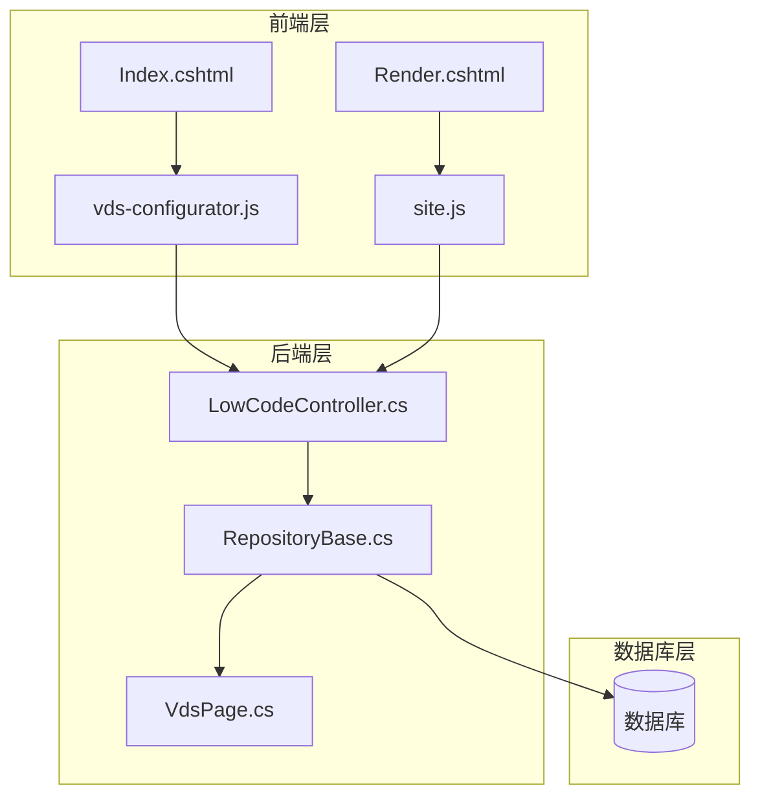
```mermaid
graph TB
subgraph "前端层"
VDS[vds-configurator.js]
SITE[site.js]
INDEX[Index.cshtml]
RENDER[Render.cshtml]
end
subgraph "后端层"
CTRL[LowCodeController.cs]
REPO[RepositoryBase.cs]
MODEL[VdsPage.cs]
end
subgraph "数据库层"
DB[(数据库)]
end
INDEX --> VDS
RENDER --> SITE
VDS --> CTRL
SITE --> CTRL
CTRL --> REPO
REPO --> MODEL
REPO --> DB
```

**图表来源**
- [vds-configurator.js:1-1352](file://Sylas.RemoteTasks.App/wwwroot/js/vds-configurator.js#L1-L1352)
- [site.js:1-1872](file://Sylas.RemoteTasks.App/wwwroot/js/site.js#L1-L1872)
- [LowCodeController.cs:1-163](file://Sylas.RemoteTasks.App/Controllers/LowCodeController.cs#L1-L163)

**章节来源**
- [vds-configurator.js:1-1352](file://Sylas.RemoteTasks.App/wwwroot/js/vds-configurator.js#L1-L1352)
- [site.js:1-1872](file://Sylas.RemoteTasks.App/wwwroot/js/site.js#L1-L1872)

## 核心组件

### VDS配置器主类

VdsConfigurator是整个库的核心，采用单例模式设计，提供完整的配置管理功能：

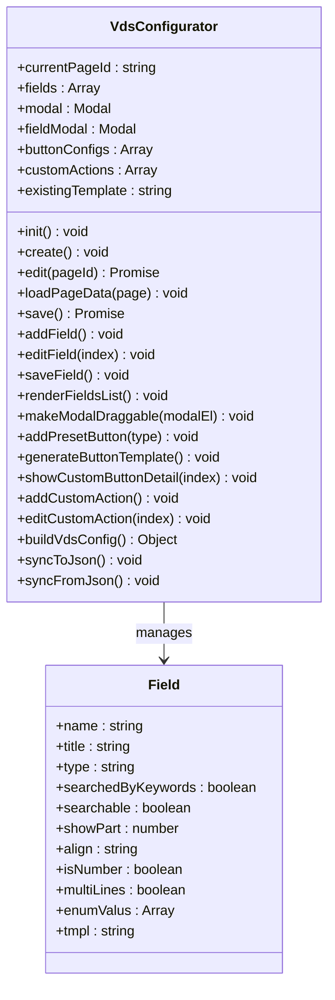
```mermaid
classDiagram
class VdsConfigurator {
+currentPageId : string
+fields : Array
+modal : Modal
+fieldModal : Modal
+buttonConfigs : Array
+customActions : Array
+existingTemplate : string
+init() void
+create() void
+edit(pageId) Promise
+loadPageData(page) void
+save() Promise
+addField() void
+editField(index) void
+saveField() void
+renderFieldsList() void
+makeModalDraggable(modalEl) void
+addPresetButton(type) void
+generateButtonTemplate() void
+showCustomButtonDetail(index) void
+addCustomAction() void
+editCustomAction(index) void
+buildVdsConfig() Object
+syncToJson() void
+syncFromJson() void
}
class Field {
+name : string
+title : string
+type : string
+searchedByKeywords : boolean
+searchable : boolean
+showPart : number
+align : string
+isNumber : boolean
+multiLines : boolean
+enumValus : Array
+tmpl : string
}
VdsConfigurator --> Field : manages
```

**图表来源**
- [vds-configurator.js:5-1352](file://Sylas.RemoteTasks.App/wwwroot/js/vds-configurator.js#L5-L1352)

### 数据表渲染引擎

site.js中的createTable函数提供了强大的数据表格渲染能力：

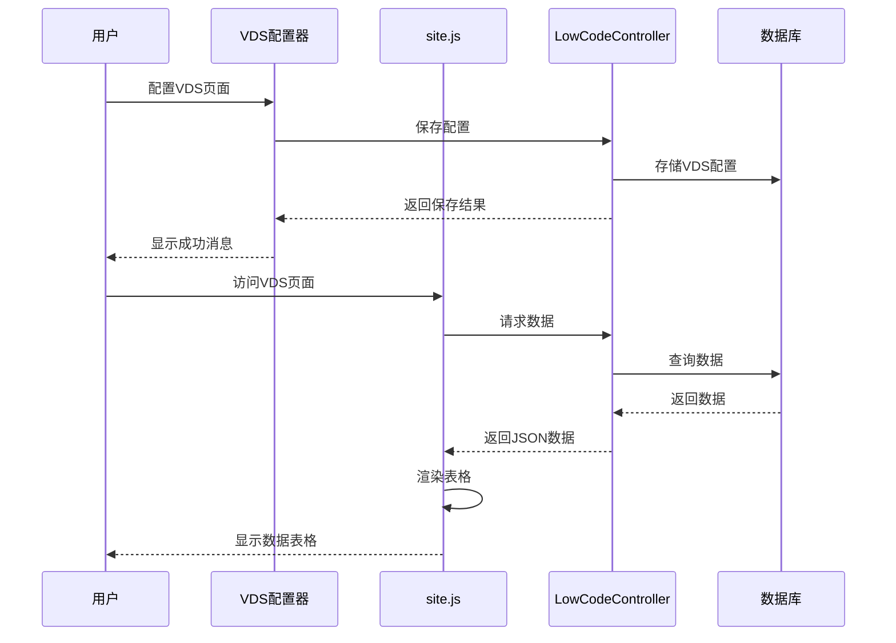
```mermaid
sequenceDiagram
participant User as 用户
participant VdsConfig as VDS配置器
participant SiteJS as site.js
participant Controller as LowCodeController
participant DB as 数据库
User->>VdsConfig : 配置VDS页面
VdsConfig->>Controller : 保存配置
Controller->>DB : 存储VDS配置
Controller-->>VdsConfig : 返回保存结果
VdsConfig-->>User : 显示成功消息
User->>SiteJS : 访问VDS页面
SiteJS->>Controller : 请求数据
Controller->>DB : 查询数据
DB-->>Controller : 返回数据
Controller-->>SiteJS : 返回JSON数据
SiteJS->>SiteJS : 渲染表格
SiteJS-->>User : 显示数据表格
```

**图表来源**
- [vds-configurator.js:1283-1337](file://Sylas.RemoteTasks.App/wwwroot/js/vds-configurator.js#L1283-L1337)
- [site.js:123-761](file://Sylas.RemoteTasks.App/wwwroot/js/site.js#L123-L761)

**章节来源**
- [vds-configurator.js:1-1352](file://Sylas.RemoteTasks.App/wwwroot/js/vds-configurator.js#L1-L1352)
- [site.js:1-1872](file://Sylas.RemoteTasks.App/wwwroot/js/site.js#L1-L1872)

## 架构概览

该系统采用分层架构设计，确保了良好的可维护性和扩展性：

```mermaid
graph TD
subgraph "表现层"
WEB[Web界面]
MODAL[模态框组件]
TABS[标签页导航]
BUTTONCFG[按钮配置系统]
CUSTOMACTION[自定义操作]
SEARCHBADGE[搜索徽章系统]
ENDSUBGRAPH
subgraph "业务逻辑层"
CONFIG[VDS配置器]
TABLE[数据表格引擎]
VALIDATION[数据验证]
BUTTONSYS[按钮系统]
ACTIONSYS[操作系统]
SEARCHLOGIC[搜索逻辑]
ENDSUBGRAPH
subgraph "数据访问层"
REPO[仓储层]
MODEL[VdsPage模型]
FILTER[数据过滤]
ENDSUBGRAPH
subgraph "数据存储层"
SQL[SQL数据库]
CACHE[缓存机制]
ENDSUBGRAPH
WEB --> MODAL
MODAL --> CONFIG
TABS --> CONFIG
BUTTONCFG --> CONFIG
CUSTOMACTION --> CONFIG
SEARCHBADGE --> CONFIG
CONFIG --> TABLE
CONFIG --> VALIDATION
CONFIG --> BUTTONSYS
CONFIG --> ACTIONSYS
CONFIG --> SEARCHLOGIC
TABLE --> REPO
VALIDATION --> REPO
BUTTONSYS --> REPO
ACTIONSYS --> REPO
REPO --> MODEL
REPO --> FILTER
MODEL --> SQL
TABLE --> CACHE
FILTER --> CACHE
```

**图表来源**
- [LowCodeController.cs:1-163](file://Sylas.RemoteTasks.App/Controllers/LowCodeController.cs#L1-L163)
- [RepositoryBase.cs:1-233](file://Sylas.RemoteTasks.App/Infrastructure/RepositoryBase.cs#L1-L233)

## 详细组件分析

### VDS配置器组件

#### 初始化流程

VdsConfigurator的初始化过程包括模态框设置、事件监听器注册和数据绑定：

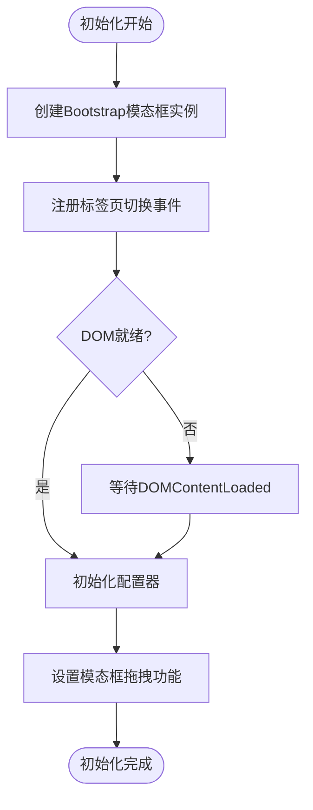
```mermaid
flowchart TD
START([初始化开始]) --> CREATEMODAL["创建Bootstrap模态框实例"]
CREATEMODAL --> REGISTEREVENTS["注册标签页切换事件"]
REGISTEREVENTS --> CHECKREADY{"DOM就绪?"}
CHECKREADY --> |是| INITCONFIG["初始化配置器"]
CHECKREADY --> |否| WAITLOAD["等待DOMContentLoaded"]
WAITLOAD --> INITCONFIG
INITCONFIG --> DRAGMODAL["设置模态框拖拽功能"]
DRAGMODAL --> READY([初始化完成])
```

**图表来源**
- [vds-configurator.js:17-33](file://Sylas.RemoteTasks.App/wwwroot/js/vds-configurator.js#L17-L33)

#### 模态框拖拽功能

系统支持模态框头部拖拽移动功能，经过优化以提高性能：

```mermaid
flowchart LR
MOUSEDOWN["鼠标按下"] --> SETDRAG["设置拖拽状态"]
SETDRAG --> GETPOS["获取初始位置"]
GETPOS --> DISABLETRANS["禁用过渡动画"]
DISABLETRANS --> MOUSEMOVE["鼠标移动"]
MOUSEMOVE --> CALCPOS["计算新位置"]
CALCPOS --> RAF["requestAnimationFrame优化"]
RAF --> UPDATEPOS["更新模态框位置"]
UPDATEPOS --> MOUSEUP["鼠标释放"]
MOUSEUP --> RESETSTATE["重置拖拽状态"]
RESETSTATE --> ENABLETRANS["恢复过渡动画"]
```

**图表来源**
- [vds-configurator.js:10-94](file://Sylas.RemoteTasks.App/wwwroot/js/vds-configurator.js#L10-L94)

#### 字段类型系统

系统支持多种字段类型，每种类型都有特定的配置选项：

| 字段类型 | 描述 | 配置选项 | 搜索功能 |
|---------|------|----------|----------|
| 文本 | 标准文本字段 | 搜索、截断、对齐 | 可搜索 |
| 数字 | 数值字段 | 数字格式、精度控制 | 可搜索 |
| 多行文本 | 文本区域 | 行数、字符限制 | 可搜索 |
| 枚举 | 下拉选择 | 选项列表、默认值 | 可搜索 |
| 图片 | 图片上传 | 文件类型、尺寸限制 | 不支持搜索 |
| 媒体 | 多媒体文件 | 支持类型、播放器 | 不支持搜索 |
| 数据源 | 动态数据 | API接口、显示字段 | 可筛选 |
| 按钮 | 交互按钮 | 模板生成、样式 | 不支持搜索 |

**更新** 新增了搜索徽章系统，智能区分不同字段类型的搜索能力：

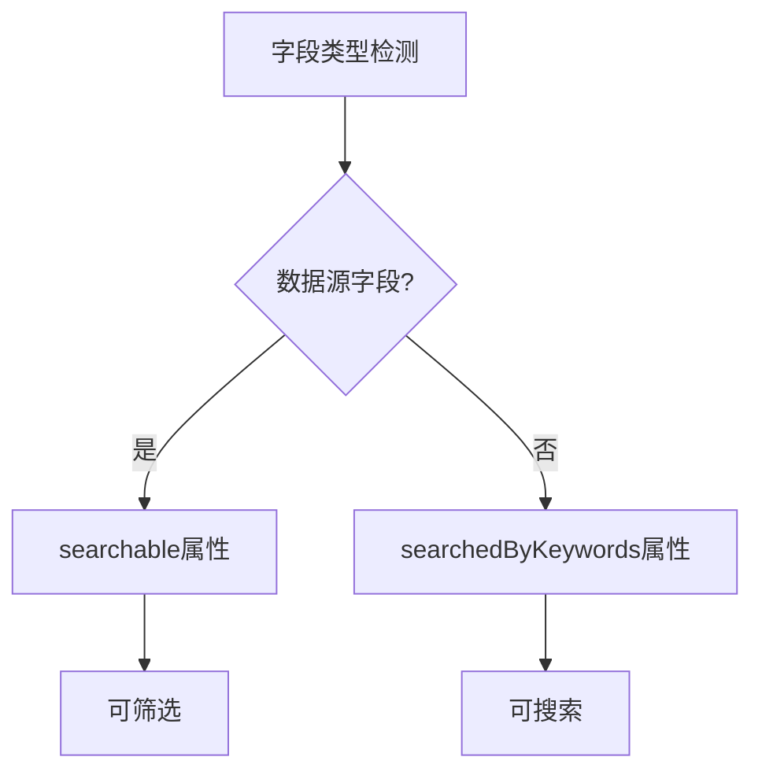
```mermaid
flowchart TD
FIELDTYPE["字段类型检测"] --> DATASOURCE{"数据源字段?"}
DATASOURCE --> |是| SEARCHABLE["searchable属性"]
DATASOURCE --> |否| SEARCHKEYWORDS["searchedByKeywords属性"]
SEARCHABLE --> BADGESUCCESS["<span class='badge bg-success'>可筛选</span>"]
SEARCHKEYWORDS --> BADGENORMAL["<span class='badge bg-info'>可搜索</span>"]
```

**图表来源**
- [vds-configurator.js:172-174](file://Sylas.RemoteTasks.App/wwwroot/js/vds-configurator.js#L172-L174)

**章节来源**
- [vds-configurator.js:198-210](file://Sylas.RemoteTasks.App/wwwroot/js/vds-configurator.js#L198-L210)

### 搜索徽章系统

**新增** 搜索徽章系统提供了智能化的搜索功能标识：

#### 徽章显示逻辑

系统根据字段类型自动显示相应的搜索徽章：

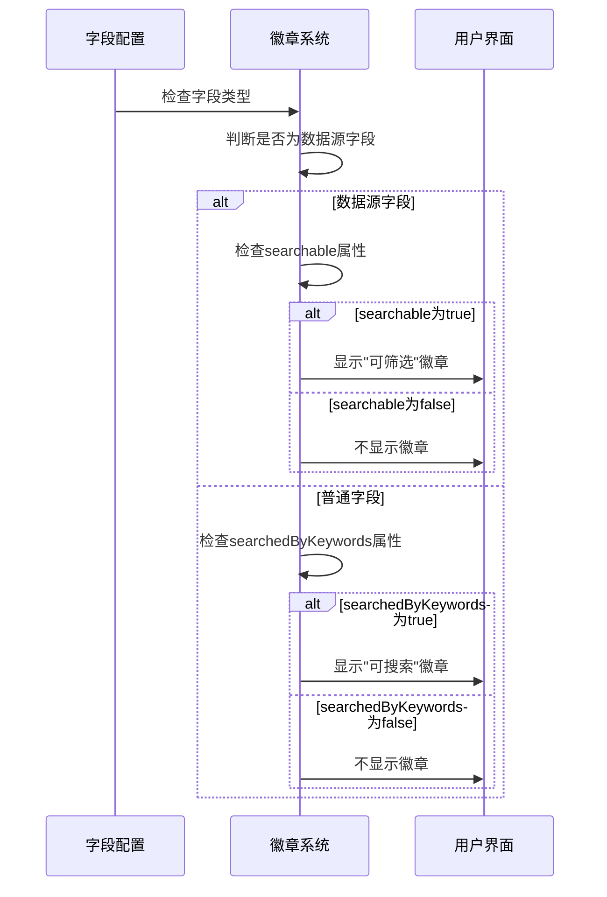
```mermaid
sequenceDiagram
participant Field as 字段配置
participant BadgeSystem as 徽章系统
participant UI as 用户界面
Field->>BadgeSystem : 检查字段类型
BadgeSystem->>BadgeSystem : 判断是否为数据源字段
alt 数据源字段
BadgeSystem->>BadgeSystem : 检查searchable属性
alt searchable为true
BadgeSystem->>UI : 显示"可筛选"徽章
else searchable为false
BadgeSystem->>UI : 不显示徽章
end
else 普通字段
BadgeSystem->>BadgeSystem : 检查searchedByKeywords属性
alt searchedByKeywords为true
BadgeSystem->>UI : 显示"可搜索"徽章
else searchedByKeywords为false
BadgeSystem->>UI : 不显示徽章
end
end
```

**图表来源**
- [vds-configurator.js:172-174](file://Sylas.RemoteTasks.App/wwwroot/js/vds-configurator.js#L172-L174)

#### 条件搜索属性判断

系统实现了精确的条件搜索属性判断机制：

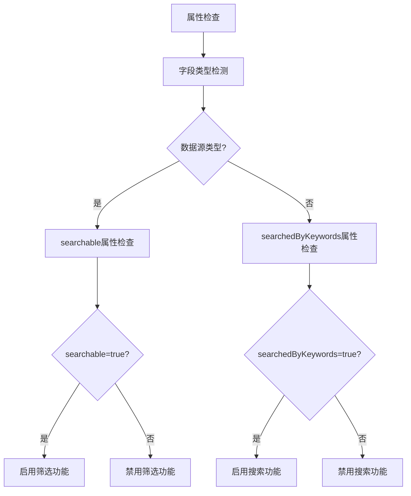
```mermaid
flowchart TD
PROPERTYCHECK["属性检查"] --> TYPEDETECTION["字段类型检测"]
TYPEDETECTION --> DATASOURCETYPE{"数据源类型?"}
DATASOURCETYPE --> |是| SEARCHABLECHECK["searchable属性检查"]
DATASOURCETYPE --> |否| KEYWORDSCHECK["searchedByKeywords属性检查"]
SEARCHABLECHECK --> SEARCHABLETRUE{"searchable=true?"}
SEARCHABLETRUE --> |是| ENABLEFILTER["启用筛选功能"]
SEARCHABLETRUE --> |否| DISABLEFILTER["禁用筛选功能"]
KEYWORDSCHECK --> KEYWORDSTrue{"searchedByKeywords=true?"}
KEYWORDSTrue --> |是| ENABLESEARCH["启用搜索功能"]
KEYWORDSTrue --> |否| DISABLESEARCH["禁用搜索功能"]
```

**图表来源**
- [vds-configurator.js:1114-1120](file://Sylas.RemoteTasks.App/wwwroot/js/vds-configurator.js#L1114-L1120)

### 操作按钮配置系统

VdsConfigurator提供了简化的操作按钮配置功能：

#### 预设按钮模板

系统支持四种预设按钮类型，每种都有自动配置的模板：

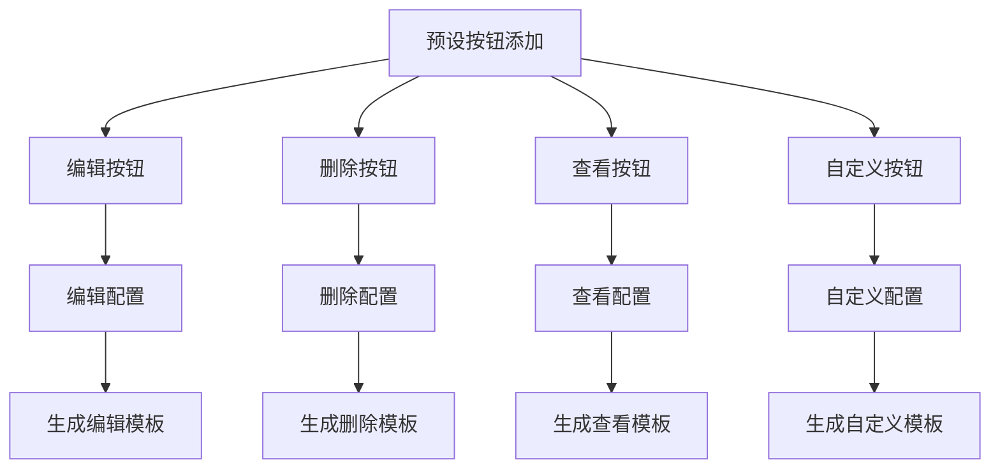
```mermaid
flowchart TD
PRESET["预设按钮添加"] --> EDITBTN["编辑按钮"]
PRESET --> DELETEBTN["删除按钮"]
PRESET --> VIEWBTN["查看按钮"]
PRESET --> CUSTOMBTN["自定义按钮"]
EDITBTN --> EDITCONF["编辑配置"]
DELETEBTN --> DELETECONF["删除配置"]
VIEWBTN --> VIEWCONF["查看配置"]
CUSTOMBTN --> CUSTOMCONF["自定义配置"]
EDITCONF --> EDITTEMPLATE["生成编辑模板"]
DELETECONF --> DELETETEMPLATE["生成删除模板"]
VIEWCONF --> VIEWTEMPLATE["生成查看模板"]
CUSTOMCONF --> CUSTOMTEMPLATE["生成自定义模板"]
```

**图表来源**
- [vds-configurator.js:386-424](file://Sylas.RemoteTasks.App/wwwroot/js/vds-configurator.js#L386-L424)

#### 动态按钮配置

按钮配置系统支持实时编辑和模板生成：

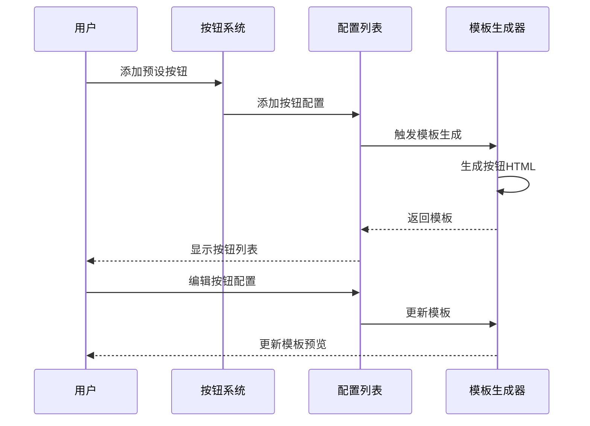
```mermaid
sequenceDiagram
participant User as 用户
participant ButtonSys as 按钮系统
participant ConfigList as 配置列表
participant TemplateGen as 模板生成器
User->>ButtonSys : 添加预设按钮
ButtonSys->>ConfigList : 添加按钮配置
ConfigList->>TemplateGen : 触发模板生成
TemplateGen->>TemplateGen : 生成按钮HTML
TemplateGen-->>ConfigList : 返回模板
ConfigList-->>User : 显示按钮列表
User->>ConfigList : 编辑按钮配置
ConfigList->>TemplateGen : 更新模板
TemplateGen-->>User : 更新模板预览
```

**图表来源**
- [vds-configurator.js:429-474](file://Sylas.RemoteTasks.App/wwwroot/js/vds-configurator.js#L429-L474)

#### 自定义操作配置系统

系统支持简化的自定义操作配置：

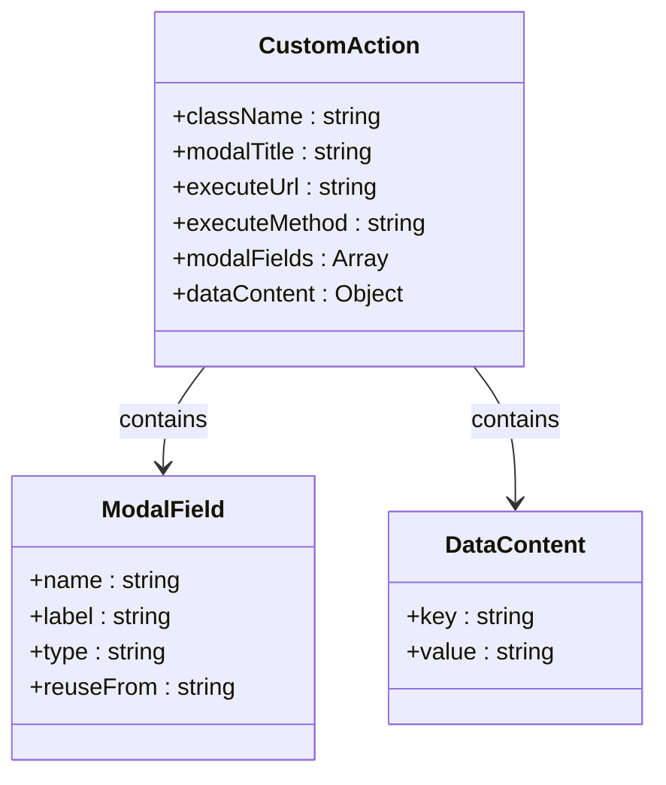
```mermaid
classDiagram
class CustomAction {
+className : string
+modalTitle : string
+executeUrl : string
+executeMethod : string
+modalFields : Array
+dataContent : Object
}
class ModalField {
+name : string
+label : string
+type : string
+reuseFrom : string
}
class DataContent {
+key : string
+value : string
}
CustomAction --> ModalField : contains
CustomAction --> DataContent : contains
```

**图表来源**
- [vds-configurator.js:659-1065](file://Sylas.RemoteTasks.App/wwwroot/js/vds-configurator.js#L659-L1065)

### 数据表格渲染引擎

#### createTable函数详解

createTable函数是数据表格渲染的核心，提供了完整的CRUD功能：

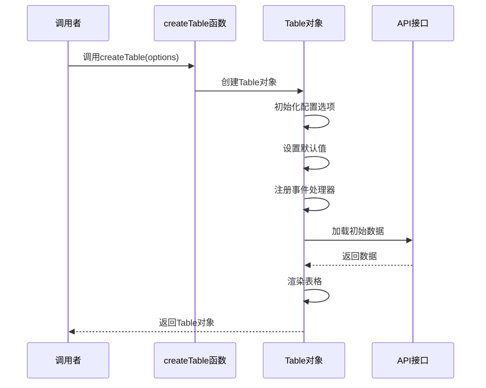
```mermaid
sequenceDiagram
participant Caller as 调用者
participant createTable as createTable函数
participant Table as Table对象
participant API as API接口
Caller->>createTable : 调用createTable(options)
createTable->>Table : 创建Table对象
Table->>Table : 初始化配置选项
Table->>Table : 设置默认值
Table->>Table : 注册事件处理器
Table->>API : 加载初始数据
API-->>Table : 返回数据
Table->>Table : 渲染表格
Table-->>Caller : 返回Table对象
```

**图表来源**
- [site.js:123-761](file://Sylas.RemoteTasks.App/wwwroot/js/site.js#L123-L761)

#### 数据源解析机制

系统支持动态数据源解析，通过正则表达式提取配置参数：

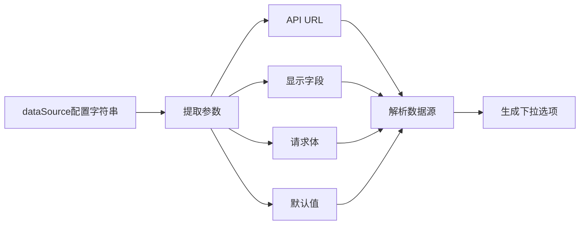
```mermaid
flowchart LR
INPUT["dataSource配置字符串"] --> EXTRACT["提取参数"]
EXTRACT --> API["API URL"]
EXTRACT --> DISPLAY["显示字段"]
EXTRACT --> BODY["请求体"]
EXTRACT --> DEFAULT["默认值"]
API --> RESOLVE["解析数据源"]
DISPLAY --> RESOLVE
BODY --> RESOLVE
DEFAULT --> RESOLVE
RESOLVE --> OPTIONS["生成下拉选项"]
```

**图表来源**
- [site.js:525-581](file://Sylas.RemoteTasks.App/wwwroot/js/site.js#L525-L581)

#### 搜索表单生成逻辑

**更新** 搜索表单生成逻辑现在支持条件搜索属性判断：

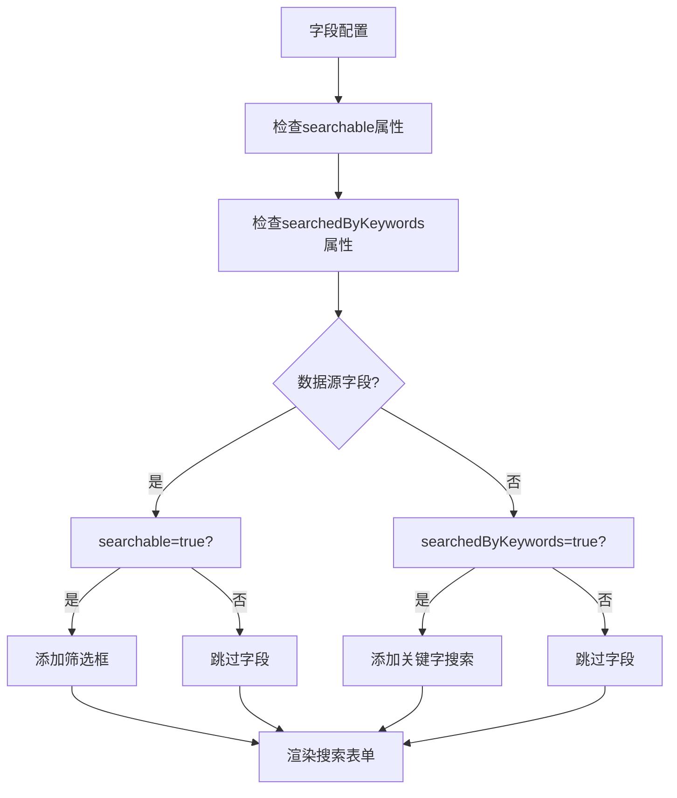
```mermaid
flowchart TD
THCONFIG["字段配置"] --> CHECKSEARCHABLE["检查searchable属性"]
CHECKSEARCHABLE --> CHECKKEYWORDS["检查searchedByKeywords属性"]
CHECKKEYWORDS --> DATASOURCEFORM{"数据源字段?"}
DATASOURCEFORM --> |是| DATASOURCECHECK["searchable=true?"]
DATASOURCEFORM --> |否| KEYWORDSCHECK["searchedByKeywords=true?"]
DATASOURCECHECK --> |是| ADDBOX["添加筛选框"]
DATASOURCECHECK --> |否| SKIPBOX["跳过字段"]
KEYWORDSCHECK --> |是| ADDKEYBOX["添加关键字搜索"]
KEYWORDSCHECK --> |否| SKIPKEY["跳过字段"]
ADDBOX --> RENDERFORM["渲染搜索表单"]
ADDKEYBOX --> RENDERFORM
SKIPBOX --> RENDERFORM
SKIPKEY --> RENDERFORM
```

**图表来源**
- [site.js:603-613](file://Sylas.RemoteTasks.App/wwwroot/js/site.js#L603-L613)

**章节来源**
- [site.js:1-1872](file://Sylas.RemoteTasks.App/wwwroot/js/site.js#L1-L1872)

### 控制器层

#### LowCodeController功能

LowCodeController提供了完整的VDS页面管理API：

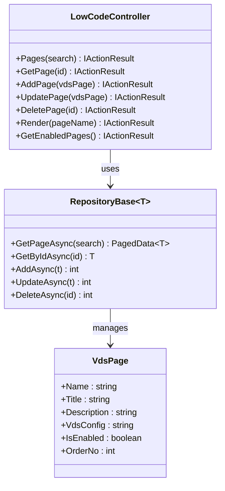
```mermaid
classDiagram
class LowCodeController {
+Pages(search) IActionResult
+GetPage(id) IActionResult
+AddPage(vdsPage) IActionResult
+UpdatePage(vdsPage) IActionResult
+DeletePage(id) IActionResult
+Render(pageName) IActionResult
+GetEnabledPages() IActionResult
}
class RepositoryBase~T~ {
+GetPageAsync(search) PagedData~T~
+GetByIdAsync(id) T
+AddAsync(t) int
+UpdateAsync(t) int
+DeleteAsync(id) int
}
class VdsPage {
+Name : string
+Title : string
+Description : string
+VdsConfig : string
+IsEnabled : boolean
+OrderNo : int
}
LowCodeController --> RepositoryBase~VdsPage~ : uses
RepositoryBase~VdsPage~ --> VdsPage : manages
```

**图表来源**
- [LowCodeController.cs:1-163](file://Sylas.RemoteTasks.App/Controllers/LowCodeController.cs#L1-L163)
- [RepositoryBase.cs:1-233](file://Sylas.RemoteTasks.App/Infrastructure/RepositoryBase.cs#L1-L233)
- [VdsPage.cs:1-64](file://Sylas.RemoteTasks.App/LowCode/VdsPage.cs#L1-L64)

**章节来源**
- [LowCodeController.cs:1-163](file://Sylas.RemoteTasks.App/Controllers/LowCodeController.cs#L1-L163)
- [RepositoryBase.cs:1-233](file://Sylas.RemoteTasks.App/Infrastructure/RepositoryBase.cs#L1-L233)

## 依赖关系分析

### 前端依赖关系

```mermaid
graph TB
subgraph "核心库"
VDS[VDS配置器]
SITE[数据表格引擎]
UTIL[工具函数]
MODAL[模态框拖拽]
BUTTONSYS[按钮系统]
ACTIONSYS[操作系统]
SEARCHBADGE[搜索徽章系统]
ENDSUBGRAPH
subgraph "第三方库"
BOOTSTRAP[Bootstrap]
JQUERY[jQuery]
FETCH[Fetch API]
ENDSUBGRAPH
subgraph "后端服务"
AUTH[认证服务]
API[API接口]
DB[数据库]
ENDSUBGRAPH
VDS --> BOOTSTRAP
VDS --> JQUERY
VDS --> FETCH
VDS --> AUTH
VDS --> API
VDS --> MODAL
VDS --> BUTTONSYS
VDS --> ACTIONSYS
VDS --> SEARCHBADGE
SITE --> BOOTSTRAP
SITE --> JQUERY
SITE --> FETCH
SITE --> API
API --> DB
AUTH --> DB
```

**图表来源**
- [vds-configurator.js:1-1352](file://Sylas.RemoteTasks.App/wwwroot/js/vds-configurator.js#L1-L1352)
- [site.js:1-1872](file://Sylas.RemoteTasks.App/wwwroot/js/site.js#L1-L1872)

### 后端依赖关系

系统采用依赖注入模式，确保了良好的模块化：

```mermaid
graph TD
subgraph "应用层"
CONTROLLER[控制器]
SERVICE[服务层]
ENDSUBGRAPH
subgraph "基础设施层"
REPOSITORY[仓储层]
DATABASE[数据库提供者]
CONFIG[配置管理]
ENDSUBGRAPH
subgraph "领域层"
ENTITY[实体模型]
DTO[数据传输对象]
ENDSUBGRAPH
CONTROLLER --> SERVICE
SERVICE --> REPOSITORY
REPOSITORY --> DATABASE
REPOSITORY --> ENTITY
SERVICE --> DTO
CONTROLLER --> CONFIG
```

**图表来源**
- [LowCodeController.cs:1-163](file://Sylas.RemoteTasks.App/Controllers/LowCodeController.cs#L1-L163)
- [RepositoryBase.cs:1-233](file://Sylas.RemoteTasks.App/Infrastructure/RepositoryBase.cs#L1-L233)

**章节来源**
- [vds-configurator.js:1-1352](file://Sylas.RemoteTasks.App/wwwroot/js/vds-configurator.js#L1-L1352)
- [site.js:1-1872](file://Sylas.RemoteTasks.App/wwwroot/js/site.js#L1-L1872)
- [LowCodeController.cs:1-163](file://Sylas.RemoteTasks.App/Controllers/LowCodeController.cs#L1-L163)

## 性能考虑

### 前端性能优化

1. **懒加载策略**：模态框和复杂组件采用按需加载
2. **事件委托**：使用事件委托减少内存占用
3. **虚拟滚动**：大数据集时采用虚拟滚动技术
4. **缓存机制**：重复数据源请求进行缓存
5. **模态框拖拽优化**：使用requestAnimationFrame优化拖拽性能
6. **按钮模板生成优化**：智能模板缓存和增量更新
7. **搜索徽章优化**：智能徽章显示逻辑减少DOM操作
8. **条件搜索判断优化**：高效的属性检查机制

### 后端性能优化

1. **分页查询**：所有数据查询都支持分页
2. **批量操作**：支持批量数据处理
3. **连接池管理**：数据库连接池优化
4. **查询优化**：SQL查询优化和索引使用
5. **搜索条件优化**：基于属性的精确搜索判断

## 故障排除指南

### 常见问题及解决方案

#### 配置器初始化失败

**症状**：VDS配置器无法正常加载
**原因**：JavaScript文件加载失败或依赖缺失
**解决方案**：
1. 检查浏览器控制台错误
2. 确认jQuery和Bootstrap正确加载
3. 验证vds-configurator.js文件完整性

#### 模态框拖拽功能异常

**症状**：模态框无法拖拽或拖拽卡顿
**原因**：拖拽事件处理异常或性能问题
**解决方案**：
1. 检查模态框头部元素是否存在
2. 验证CSS样式冲突
3. 确认requestAnimationFrame兼容性
4. 检查GPU加速设置

#### 搜索徽章显示错误

**症状**：搜索徽章显示不正确或不显示
**原因**：字段类型识别错误或属性配置问题
**解决方案**：
1. 检查字段配置中的searchable和searchedByKeywords属性
2. 验证字段类型是否正确设置
3. 确认徽章显示逻辑正常工作
4. 检查字段类型检测函数

#### 条件搜索属性判断失败

**症状**：搜索功能无法正常工作
**原因**：属性判断逻辑错误或配置不匹配
**解决方案**：
1. 检查字段配置中的搜索属性设置
2. 验证数据源字段的searchable属性
3. 确认普通字段的searchedByKeywords属性
4. 检查搜索表单生成逻辑

#### 数据加载超时

**症状**：数据表格加载缓慢或超时
**原因**：API响应慢或数据量过大
**解决方案**：
1. 检查网络连接
2. 优化查询条件
3. 实现分页加载
4. 增加重试机制

#### 字段配置错误

**症状**：字段类型配置无效
**原因**：配置格式不正确或参数缺失
**解决方案**：
1. 检查字段配置JSON格式
2. 验证必需参数完整性
3. 使用内置验证功能

**章节来源**
- [vds-configurator.js:1-1352](file://Sylas.RemoteTasks.App/wwwroot/js/vds-configurator.js#L1-L1352)
- [site.js:1-1872](file://Sylas.RemoteTasks.App/wwwroot/js/site.js#L1-L1872)

## 结论

VDS配置器JavaScript库是一个功能强大、设计精良的可视化配置工具。经过重大功能增强后，该库在保持核心功能的同时，显著提升了搜索功能的智能化程度和用户体验。

### 主要优势

1. **用户友好**：直观的可视化界面，降低学习成本
2. **功能完整**：支持所有必要的VDS配置需求
3. **性能优秀**：优化的数据加载和渲染机制
4. **可扩展性**：模块化设计便于功能扩展
5. **可靠性**：完善的错误处理和验证机制
6. **智能化搜索**：增强的搜索徽章逻辑和条件判断
7. **精确控制**：区分数据源字段的'可筛选'和普通字段的'可搜索'

### 技术亮点

- 采用现代JavaScript ES6+语法
- 集成Bootstrap框架提供响应式设计
- 实现完整的前后端分离架构
- 支持多种数据源和字段类型
- 提供丰富的API和扩展点
- **增强** 智能搜索徽章系统
- **改进** 条件搜索属性判断机制
- **优化** 数据源字段搜索配置

该库为Sylas.RemoteTasks系统的低代码开发提供了坚实的技术基础，是现代Web应用开发的最佳实践范例。经过功能增强后，VDS配置器成为了更加智能、易用且功能强大的工具，为开发者提供了更好的配置体验和用户搜索体验。