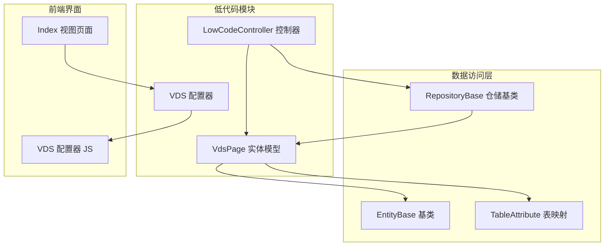
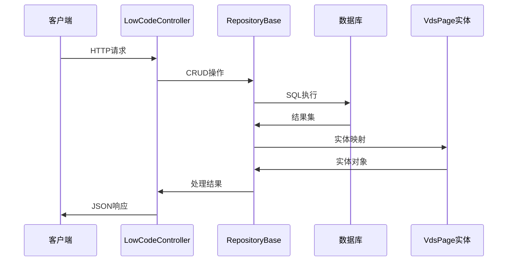
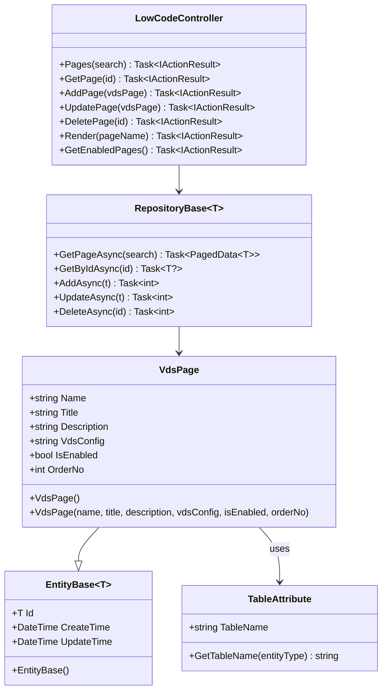
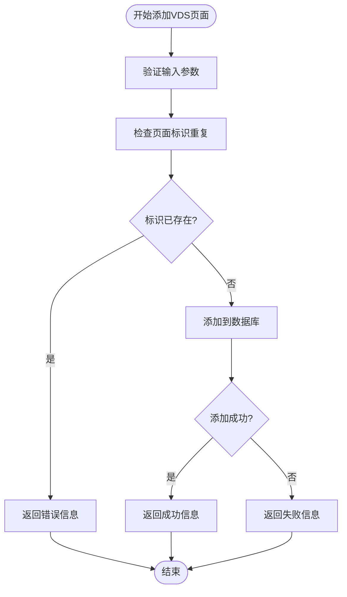
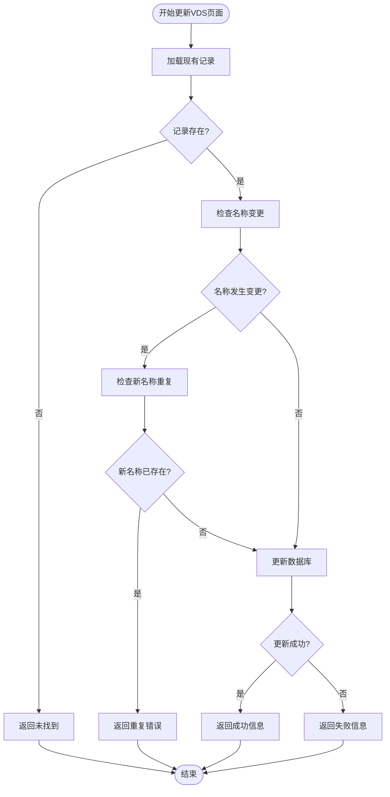
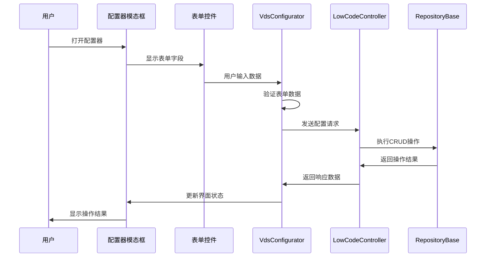
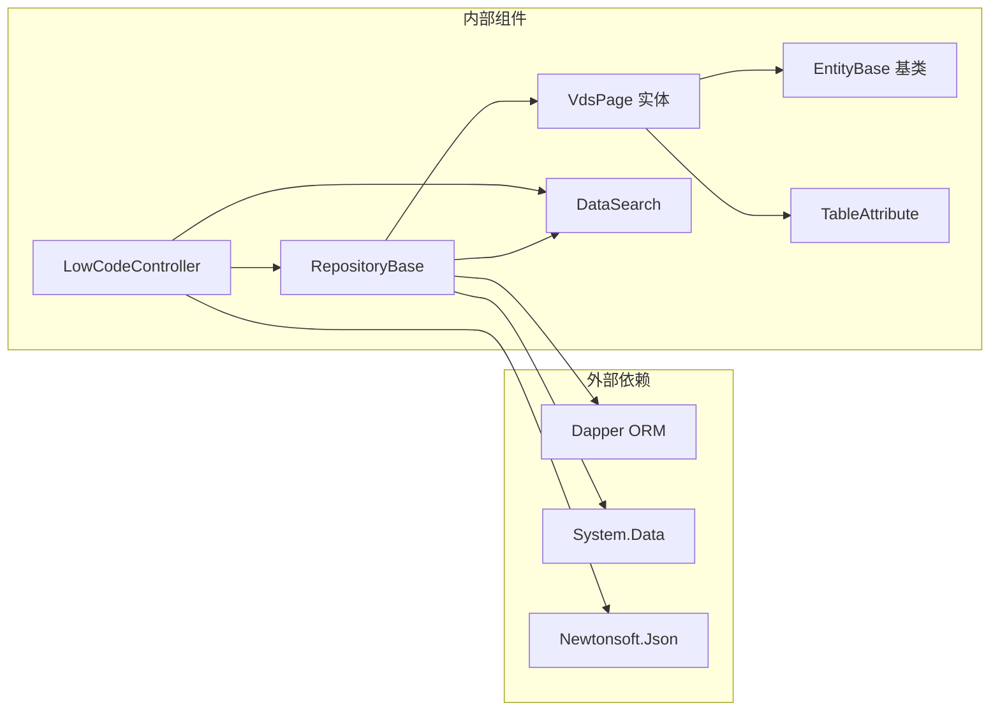

# VdsPage实体模型

<cite>
**本文档引用的文件**
- [VdsPage.cs](file://Sylas.RemoteTasks.App/LowCode/VdsPage.cs)
- [EntityBase.cs](file://Sylas.RemoteTasks.Database/EntityBase.cs)
- [TableAttribute.cs](file://Sylas.RemoteTasks.Database/Attributes/TableAttribute.cs)
- [LowCodeController.cs](file://Sylas.RemoteTasks.App/Controllers/LowCodeController.cs)
- [RepositoryBase.cs](file://Sylas.RemoteTasks.App/Infrastructure/RepositoryBase.cs)
- [DataSearch.cs](file://Sylas.RemoteTasks.Database/SyncBase/DataSearch.cs)
- [Index.cshtml](file://Sylas.RemoteTasks.App/Views/LowCode/Index.cshtml)
- [vds-configurator.js](file://Sylas.RemoteTasks.App/wwwroot/js/vds-configurator.js)
</cite>

## 目录
1. [简介](#简介)
2. [项目结构](#项目结构)
3. [核心组件](#核心组件)
4. [架构概览](#架构概览)
5. [详细组件分析](#详细组件分析)
6. [依赖关系分析](#依赖关系分析)
7. [性能考虑](#性能考虑)
8. [故障排除指南](#故障排除指南)
9. [结论](#结论)

## 简介

VdsPage实体模型是Sylas.RemoteTasks应用程序中低代码功能的核心数据结构，用于存储和管理VDS（Virtual Data Sheet）页面配置信息。该实体模型支持动态页面生成、可视化配置编辑和RESTful API集成，为开发者提供了一个灵活的低代码解决方案。

VdsPage继承自EntityBase<int>基类，采用表映射特性将实体与数据库表进行关联，实现了完整的CRUD操作支持。该模型的设计充分考虑了可扩展性和易用性，通过JSON格式存储复杂的VDS配置信息。

## 项目结构

VdsPage实体模型位于应用程序的低代码功能模块中，与相关的控制器、仓储层和前端界面紧密协作：

**图表来源**
- [VdsPage.cs](file://Sylas.RemoteTasks.App/LowCode/VdsPage.cs#L1-L64)
- [LowCodeController.cs](file://Sylas.RemoteTasks.App/Controllers/LowCodeController.cs#L1-L163)
- [RepositoryBase.cs](file://Sylas.RemoteTasks.App/Infrastructure/RepositoryBase.cs#L1-L233)

**章节来源**
- [VdsPage.cs](file://Sylas.RemoteTasks.App/LowCode/VdsPage.cs#L1-L64)
- [LowCodeController.cs](file://Sylas.RemoteTasks.App/Controllers/LowCodeController.cs#L1-L163)

## 核心组件

### 实体模型设计

VdsPage实体模型采用了现代.NET开发的最佳实践，具有以下核心特征：

- **强类型设计**：使用泛型基类EntityBase<int>确保类型安全
- **表映射支持**：通过Table特性将实体映射到数据库表
- **属性验证**：内置属性验证机制确保数据完整性
- **版本控制**：自动跟踪创建和更新时间

### 主要属性说明

| 属性名 | 类型 | 描述 | 默认值 |
|--------|------|------|--------|
| Id | int | 主键标识符 | null |
| Name | string | 页面唯一标识符 | string.Empty |
| Title | string | 页面显示标题 | string.Empty |
| Description | string | 页面功能描述 | string.Empty |
| VdsConfig | string | VDS配置JSON字符串 | "{}" |
| IsEnabled | bool | 页面启用状态 | true |
| OrderNo | int | 排序编号 | 0 |
| CreateTime | DateTime | 创建时间 | 当前时间 |
| UpdateTime | DateTime | 更新时间 | 当前时间 |

**章节来源**
- [VdsPage.cs](file://Sylas.RemoteTasks.App/LowCode/VdsPage.cs#L13-L41)
- [EntityBase.cs](file://Sylas.RemoteTasks.Database/EntityBase.cs#L22-L30)

## 架构概览

VdsPage实体模型遵循分层架构设计原则，与应用程序的其他组件形成清晰的职责分离：

**图表来源**
- [LowCodeController.cs](file://Sylas.RemoteTasks.App/Controllers/LowCodeController.cs#L13-L163)
- [RepositoryBase.cs](file://Sylas.RemoteTasks.App/Infrastructure/RepositoryBase.cs#L10-L194)

### 数据流处理

系统采用异步编程模式处理数据流，确保高性能和响应性：

1. **请求接收**：控制器接收HTTP请求并验证输入参数
2. **业务逻辑**：执行业务规则和数据验证
3. **数据持久化**：通过仓储层进行数据库操作
4. **结果返回**：将处理结果转换为JSON格式响应

**章节来源**
- [LowCodeController.cs](file://Sylas.RemoteTasks.App/Controllers/LowCodeController.cs#L26-L117)
- [RepositoryBase.cs](file://Sylas.RemoteTasks.App/Infrastructure/RepositoryBase.cs#L20-L193)

## 详细组件分析

### 实体模型类结构

**图表来源**
- [VdsPage.cs](file://Sylas.RemoteTasks.App/LowCode/VdsPage.cs#L10-L61)
- [EntityBase.cs](file://Sylas.RemoteTasks.Database/EntityBase.cs#L9-L31)
- [LowCodeController.cs](file://Sylas.RemoteTasks.App/Controllers/LowCodeController.cs#L13-L163)
- [RepositoryBase.cs](file://Sylas.RemoteTasks.App/Infrastructure/RepositoryBase.cs#L10-L194)

### CRUD操作流程

#### 添加VDS页面配置

**图表来源**
- [LowCodeController.cs](file://Sylas.RemoteTasks.App/Controllers/LowCodeController.cs#L56-L70)

#### 更新VDS页面配置

**图表来源**
- [LowCodeController.cs](file://Sylas.RemoteTasks.App/Controllers/LowCodeController.cs#L76-L99)

**章节来源**
- [LowCodeController.cs](file://Sylas.RemoteTasks.App/Controllers/LowCodeController.cs#L56-L99)

### 前端交互设计

VdsPage实体模型与前端界面的交互通过可视化配置器实现：

**图表来源**
- [Index.cshtml](file://Sylas.RemoteTasks.App/Views/LowCode/Index.cshtml#L14-L195)
- [vds-configurator.js](file://Sylas.RemoteTasks.App/wwwroot/js/vds-configurator.js#L1-L636)

**章节来源**
- [Index.cshtml](file://Sylas.RemoteTasks.App/Views/LowCode/Index.cshtml#L1-L200)
- [vds-configurator.js](file://Sylas.RemoteTasks.App/wwwroot/js/vds-configurator.js#L1-L636)

## 依赖关系分析

### 组件耦合度分析

VdsPage实体模型与其他组件的依赖关系如下：

**图表来源**
- [RepositoryBase.cs](file://Sylas.RemoteTasks.App/Infrastructure/RepositoryBase.cs#L1-L7)
- [LowCodeController.cs](file://Sylas.RemoteTasks.App/Controllers/LowCodeController.cs#L1-L7)

### 数据库集成

VdsPage实体模型通过仓储模式与数据库进行交互，支持多种数据库类型：

| 数据库类型 | 支持状态 | 特殊处理 |
|------------|----------|----------|
| SQL Server | ✅ 完全支持 | 使用SCOPE_IDENTITY() |
| MySQL | ✅ 完全支持 | 使用LAST_INSERT_ID() |
| PostgreSQL | ✅ 完全支持 | 使用lastval() |
| SQLite | ✅ 完全支持 | 使用last_insert_rowid() |
| Oracle | ⚠️ 部分支持 | 需要参数绑定 |
| 达梦 | ⚠️ 部分支持 | 需要参数绑定 |

**章节来源**
- [RepositoryBase.cs](file://Sylas.RemoteTasks.App/Infrastructure/RepositoryBase.cs#L79-L103)

## 性能考虑

### 查询优化策略

1. **索引设计**：建议在Name字段上创建唯一索引以提高查询性能
2. **分页处理**：使用DataSearch类实现高效的分页查询
3. **缓存机制**：对于频繁访问的配置数据可以考虑添加缓存层
4. **批量操作**：支持批量插入和更新操作以减少数据库往返

### 内存管理

- **对象池**：对于大量VdsPage对象的创建和销毁，可以考虑使用对象池技术
- **延迟加载**：VdsConfig属性采用延迟加载策略，避免不必要的JSON解析
- **内存监控**：定期监控实体对象的内存使用情况

### 并发控制

系统采用乐观并发控制机制：
- 使用UpdateTime字段跟踪记录的最后修改时间
- 在更新操作中验证记录的版本一致性
- 提供冲突检测和处理机制

## 故障排除指南

### 常见问题及解决方案

#### 数据库连接问题

**症状**：无法连接到数据库或查询超时
**解决方案**：
1. 检查数据库连接字符串配置
2. 验证数据库服务状态
3. 查看连接池配置参数

#### 数据验证错误

**症状**：添加或更新VDS页面时返回验证错误
**解决方案**：
1. 检查Name字段的唯一性约束
2. 验证VdsConfig的JSON格式有效性
3. 确认必填字段的完整性

#### 性能问题

**症状**：查询响应缓慢或内存使用过高
**解决方案**：
1. 优化数据库索引设计
2. 实施适当的分页策略
3. 考虑添加缓存机制
4. 监控和分析慢查询日志

**章节来源**
- [LowCodeController.cs](file://Sylas.RemoteTasks.App/Controllers/LowCodeController.cs#L58-L64)
- [RepositoryBase.cs](file://Sylas.RemoteTasks.App/Infrastructure/RepositoryBase.cs#L79-L103)

## 结论

VdsPage实体模型作为Sylas.RemoteTasks应用程序低代码功能的核心组件，展现了现代.NET应用程序设计的最佳实践。该模型通过清晰的架构设计、完善的错误处理机制和优秀的性能特性，为开发者提供了一个强大而灵活的低代码解决方案。

主要优势包括：
- **模块化设计**：清晰的职责分离和依赖管理
- **可扩展性**：支持多种数据库类型和配置选项
- **易用性**：直观的API设计和丰富的前端工具
- **性能优化**：异步编程和多种性能优化策略

未来改进方向：
- 添加更完善的审计日志功能
- 实现更细粒度的权限控制
- 增加更多的配置验证规则
- 优化大数据量场景下的性能表现