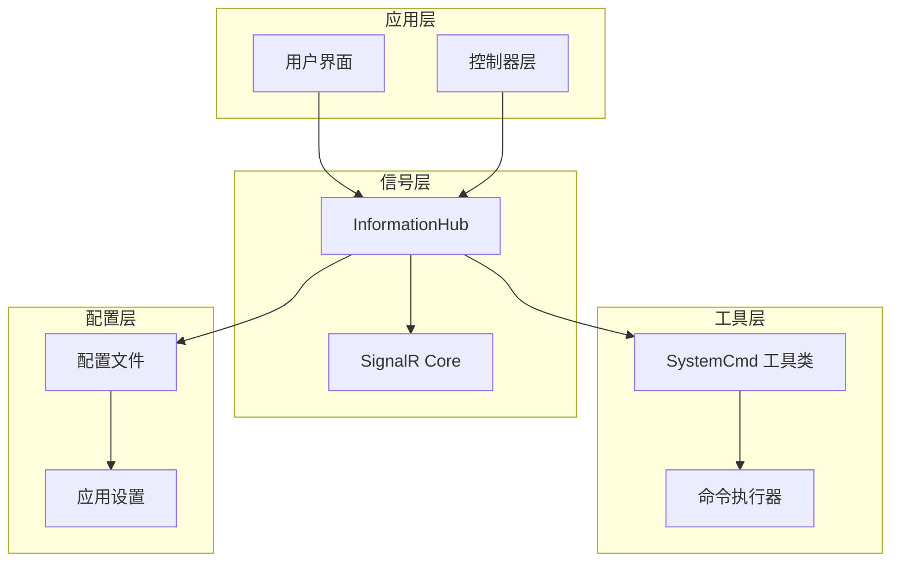
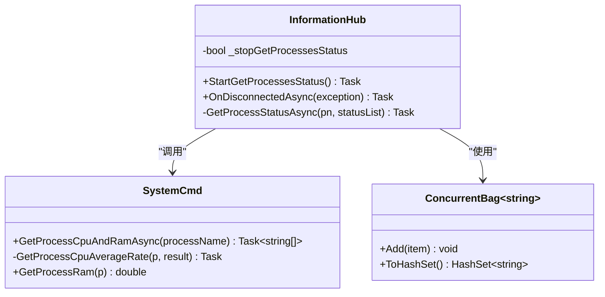
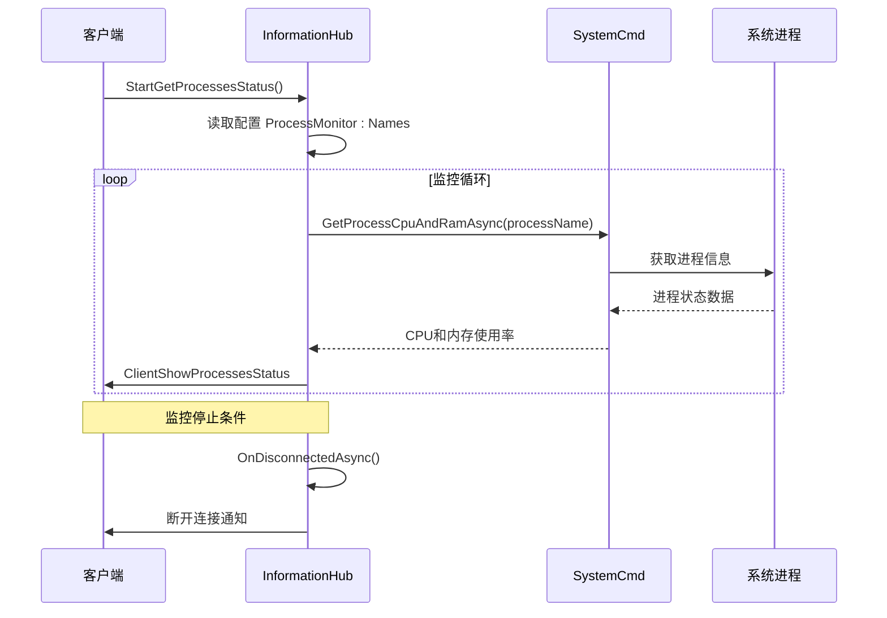
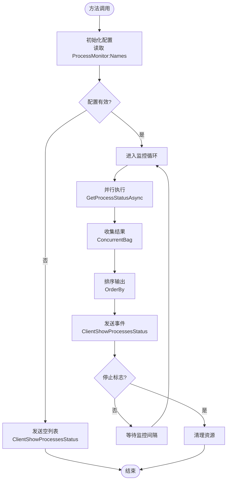
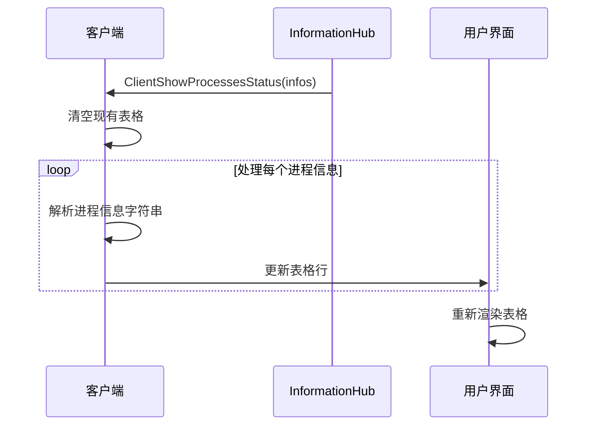
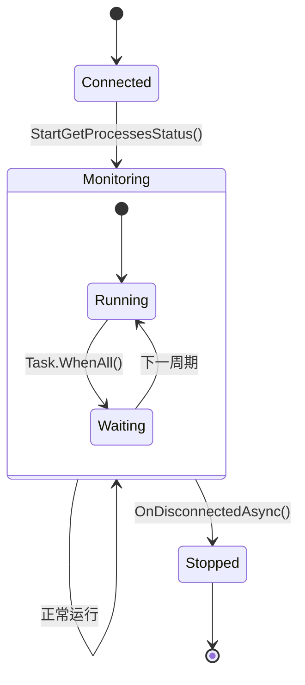
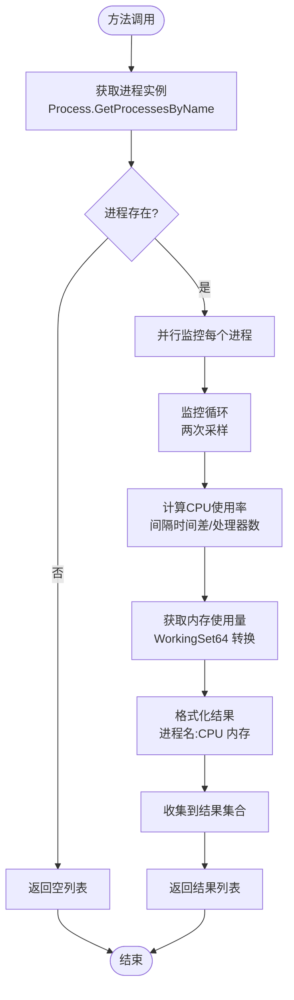
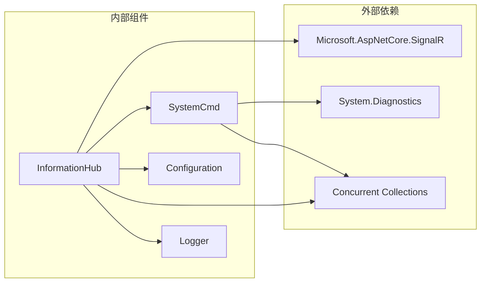

# InformationHub 实现

<cite>
**本文档引用的文件**
- [InformationHub.cs](file://Sylas.RemoteTasks.App/Hubs/InformationHub.cs)
- [SystemCmd.cs](file://Sylas.RemoteTasks.Utils/CommandExecutor/SystemCmd.cs)
- [appsettings.json](file://Sylas.RemoteTasks.App/appsettings.json)
- [Program.cs](file://Sylas.RemoteTasks.App/Program.cs)
- [ServerAndAppStatus.cshtml](file://Sylas.RemoteTasks.App/Views/Hosts/ServerAndAppStatus.cshtml)
- [signalr.js](file://Sylas.RemoteTasks.App/wwwroot/lib/signalr/dist/browser/signalr.js)
- [LambdaHandler.cs](file://Sylas.RemoteTasks.App/ExceptionHandlers/LambdaHandler.cs)
</cite>

## 目录
1. [简介](#简介)
2. [项目结构](#项目结构)
3. [核心组件](#核心组件)
4. [架构概览](#架构概览)
5. [详细组件分析](#详细组件分析)
6. [依赖关系分析](#依赖关系分析)
7. [性能考虑](#性能考虑)
8. [故障排除指南](#故障排除指南)
9. [结论](#结论)

## 简介

InformationHub 是 Sylas.RemoteTasks 应用程序中的核心 SignalR Hub 组件，负责实时进程监控和状态推送功能。该组件实现了基于 SignalR 的双向通信机制，能够动态获取指定进程的 CPU 和内存使用情况，并通过客户端事件实时推送到前端界面。

该实现采用异步编程模型，结合并发控制机制，确保在高负载环境下仍能保持良好的响应性能。系统支持多进程并行监控，通过配置化方式定义监控目标，实现了灵活的进程状态管理功能。

## 项目结构

InformationHub 位于应用程序的 Hubs 目录下，作为 SignalR Hub 的核心实现，与系统其他组件形成清晰的分层架构：

**图表来源**
- [InformationHub.cs](file://Sylas.RemoteTasks.App/Hubs/InformationHub.cs#L1-L59)
- [Program.cs](file://Sylas.RemoteTasks.App/Program.cs#L38-L119)

**章节来源**
- [InformationHub.cs](file://Sylas.RemoteTasks.App/Hubs/InformationHub.cs#L1-L59)
- [Program.cs](file://Sylas.RemoteTasks.App/Program.cs#L1-L122)

## 核心组件

### Hub 类设计架构

InformationHub 采用继承自 Microsoft.AspNetCore.SignalR.Hub 的设计模式，实现了以下核心功能：

- **静态状态管理**: 使用静态布尔变量 `_stopGetProcessesStatus` 控制进程监控循环
- **异步任务调度**: 通过 Task.WhenAll 实现多进程并行监控
- **并发控制**: 利用 ConcurrentBag 确保线程安全的状态收集
- **客户端通信**: 通过 SignalR 实现实时事件推送

### 关键数据结构

**图表来源**
- [InformationHub.cs](file://Sylas.RemoteTasks.App/Hubs/InformationHub.cs#L11-L56)
- [SystemCmd.cs](file://Sylas.RemoteTasks.Utils/CommandExecutor/SystemCmd.cs#L386-L417)

**章节来源**
- [InformationHub.cs](file://Sylas.RemoteTasks.App/Hubs/InformationHub.cs#L11-L56)
- [SystemCmd.cs](file://Sylas.RemoteTasks.Utils/CommandExecutor/SystemCmd.cs#L386-L417)

## 架构概览

InformationHub 的整体架构采用分层设计，实现了清晰的关注点分离：

**图表来源**
- [InformationHub.cs](file://Sylas.RemoteTasks.App/Hubs/InformationHub.cs#L14-L49)
- [SystemCmd.cs](file://Sylas.RemoteTasks.Utils/CommandExecutor/SystemCmd.cs#L386-L417)
- [ServerAndAppStatus.cshtml](file://Sylas.RemoteTasks.App/Views/Hosts/ServerAndAppStatus.cshtml#L66-L75)

## 详细组件分析

### 进程监控功能实现

#### StartGetProcessesStatus 方法工作流程

StartGetProcessesStatus 方法是进程监控的核心入口，实现了完整的监控生命周期：

**图表来源**
- [InformationHub.cs](file://Sylas.RemoteTasks.App/Hubs/InformationHub.cs#L14-L49)

#### 异步任务调度机制

系统采用 Task.WhenAll 实现高效的并行监控：

- **并行执行**: 对每个进程名创建独立的异步任务
- **批量等待**: 使用 Task.WhenAll 等待所有任务完成
- **线程安全**: 通过 ConcurrentBag 确保并发写入的安全性
- **异常传播**: 单个任务失败不影响其他任务执行

**章节来源**
- [InformationHub.cs](file://Sylas.RemoteTasks.App/Hubs/InformationHub.cs#L23-L47)

### 客户端事件通信协议

#### ClientShowProcessesStatus 事件

ClientShowProcessesStatus 是 Hub 与客户端之间的核心事件协议：

**事件触发时机**:
- 每次监控周期完成后自动触发
- 当配置为空时立即触发空列表
- 监控循环正常退出时触发

**数据格式规范**:
- **事件名**: `"ClientShowProcessesStatus"`
- **数据类型**: `List<string>`
- **字符串格式**: `"进程名 进程ID:CPU使用率 内存占用"`
- **排序规则**: 按字符串自然顺序排序

**客户端处理流程**:

**图表来源**
- [InformationHub.cs](file://Sylas.RemoteTasks.App/Hubs/InformationHub.cs#L32-L32)
- [ServerAndAppStatus.cshtml](file://Sylas.RemoteTasks.App/Views/Hosts/ServerAndAppStatus.cshtml#L48-L64)

**章节来源**
- [InformationHub.cs](file://Sylas.RemoteTasks.App/Hubs/InformationHub.cs#L20-L32)
- [ServerAndAppStatus.cshtml](file://Sylas.RemoteTasks.App/Views/Hosts/ServerAndAppStatus.cshtml#L48-L64)

### 连接生命周期管理

#### OnDisconnectedAsync 方法实现

OnDisconnectedAsync 方法负责处理客户端断开连接的清理工作：

**图表来源**
- [InformationHub.cs](file://Sylas.RemoteTasks.App/Hubs/InformationHub.cs#L51-L56)

**清理策略**:
- **停止标志设置**: 将 `_stopGetProcessesStatus` 设为 `true`
- **资源释放**: 自动释放监控循环中的资源
- **异常处理**: 优雅处理断开连接异常

**章节来源**
- [InformationHub.cs](file://Sylas.RemoteTasks.App/Hubs/InformationHub.cs#L51-L56)

### 进程状态获取实现细节

#### SystemCmd.GetProcessCpuAndRamAsync 方法

该方法实现了精确的进程状态采集算法：

**核心算法流程**:

**图表来源**
- [SystemCmd.cs](file://Sylas.RemoteTasks.Utils/CommandExecutor/SystemCmd.cs#L386-L417)

**关键实现细节**:
- **双样本采样**: 通过两次时间戳采样计算平均 CPU 使用率
- **多进程并行**: 使用 LINQ Select 和 Task.WhenAll 实现并行处理
- **精度计算**: 考虑逻辑 CPU 数量进行归一化计算
- **内存转换**: 将字节单位转换为 MB 单位

**章节来源**
- [SystemCmd.cs](file://Sylas.RemoteTasks.Utils/CommandExecutor/SystemCmd.cs#L386-L417)

### 错误处理策略

#### 异常情况处理方案

系统采用多层次的错误处理策略：

**配置错误处理**:
- 空配置列表: 返回空监控结果
- 缺少配置项: 快速返回空列表
- 配置解析失败: 记录日志并返回空结果

**进程监控错误处理**:
- 进程不存在: 跳过该进程继续监控
- 权限不足: 记录异常但不中断整个监控流程
- 系统调用失败: 捕获异常并继续处理其他进程

**客户端通信错误处理**:
- 连接断开: 触发 OnDisconnectedAsync 清理资源
- 发送失败: 记录错误但不中断监控循环
- 序列化异常: 使用安全的字符串格式化

**章节来源**
- [InformationHub.cs](file://Sylas.RemoteTasks.App/Hubs/InformationHub.cs#L17-L22)
- [SystemCmd.cs](file://Sylas.RemoteTasks.Utils/CommandExecutor/SystemCmd.cs#L386-L417)

## 依赖关系分析

### 组件耦合关系

**图表来源**
- [InformationHub.cs](file://Sylas.RemoteTasks.App/Hubs/InformationHub.cs#L1-L3)
- [SystemCmd.cs](file://Sylas.RemoteTasks.Utils/CommandExecutor/SystemCmd.cs#L1-L16)

### 外部依赖集成

**SignalR 集成**:
- 通过 Program.cs 中的 `AddSignalR()` 注册
- 支持多种传输协议（WebSockets、Server-Sent Events）
- 自动处理连接管理和重连机制

**配置系统集成**:
- 通过 IConfiguration 读取 ProcessMonitor:Names 配置
- 支持运行时配置更新
- 提供类型安全的配置访问

**异常处理集成**:
- 全局异常处理器统一处理
- SignalR 连接异常的专门处理
- 客户端断开连接的优雅处理

**章节来源**
- [Program.cs](file://Sylas.RemoteTasks.App/Program.cs#L38-L119)
- [appsettings.json](file://Sylas.RemoteTasks.App/appsettings.json#L122-L124)

## 性能考虑

### 并发性能优化

**多进程并行监控**:
- 使用 Task.WhenAll 实现真正的并行执行
- 避免串行等待，提升监控效率
- 合理的并发度控制，避免过度竞争

**内存使用优化**:
- 使用 ConcurrentBag 减少锁竞争
- 及时释放临时对象和缓冲区
- 避免内存泄漏和资源浪费

**网络传输优化**:
- 批量发送监控结果减少网络开销
- 有序的数据格式便于客户端处理
- 合理的事件频率避免过度刷新

### 可扩展性设计

**配置驱动的监控目标**:
- 通过配置文件动态定义监控进程
- 支持运行时调整监控范围
- 灵活的进程命名模式支持

**模块化架构**:
- Hub 与业务逻辑分离
- 工具类独立封装系统调用
- 清晰的职责边界便于维护

## 故障排除指南

### 常见问题诊断

**监控结果为空**:
1. 检查 ProcessMonitor:Names 配置是否正确
2. 验证进程名称是否匹配（区分大小写）
3. 确认进程是否正在运行

**连接断开问题**:
1. 查看 SignalR 连接日志
2. 检查网络连接稳定性
3. 验证防火墙设置

**性能问题**:
1. 监控进程过多导致性能下降
2. 检查系统资源使用情况
3. 调整监控频率和采样间隔

### 调试技巧

**启用详细日志**:
- 在 appsettings.json 中设置日志级别
- 监控 Console.WriteLine 输出
- 使用浏览器开发者工具查看 SignalR 通信

**性能分析**:
- 使用 .NET Profiler 分析 CPU 使用
- 监控内存分配和垃圾回收
- 分析异步任务的执行时间

**章节来源**
- [InformationHub.cs](file://Sylas.RemoteTasks.App/Hubs/InformationHub.cs#L41-L42)
- [appsettings.json](file://Sylas.RemoteTasks.App/appsettings.json#L2-L14)

## 结论

InformationHub 作为 Sylas.RemoteTasks 应用程序的核心组件，成功实现了高性能的进程监控和实时状态推送功能。该实现具有以下特点：

**技术优势**:
- 采用异步编程模型，充分利用现代 .NET 的并发能力
- 通过 SignalR 实现可靠的双向通信机制
- 实现了线程安全的状态收集和事件推送
- 提供了完善的错误处理和异常恢复机制

**架构特色**:
- 清晰的分层设计，职责分离明确
- 配置驱动的监控目标管理
- 模块化的组件设计便于维护和扩展
- 良好的性能表现和可扩展性

**应用场景**:
- 实时系统监控和状态展示
- 进程资源使用情况跟踪
- 分布式系统的健康检查
- 运维管理平台的核心功能

该实现为类似的应用场景提供了优秀的参考模板，展示了如何在 ASP.NET Core 环境下构建高性能的实时通信应用。