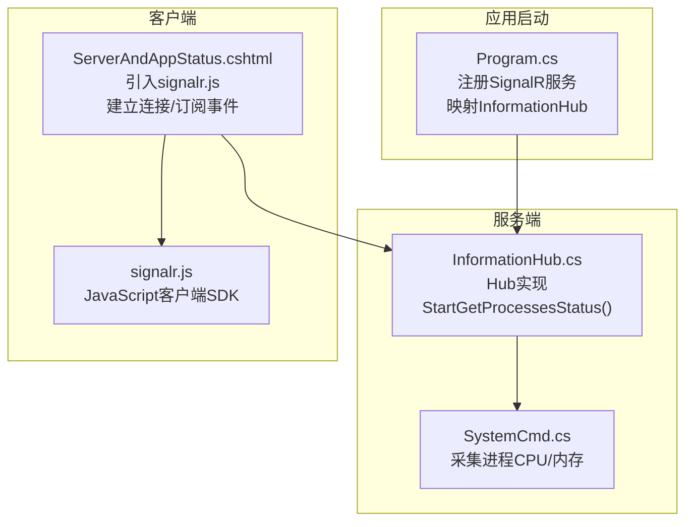
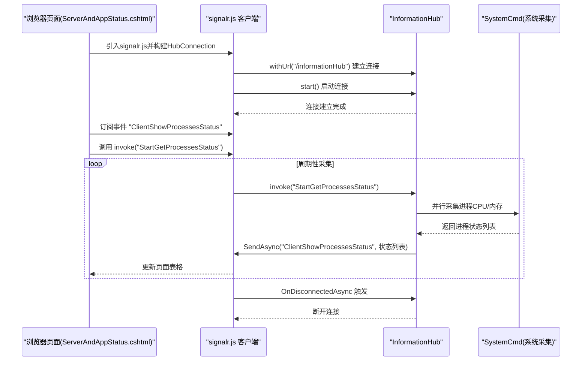
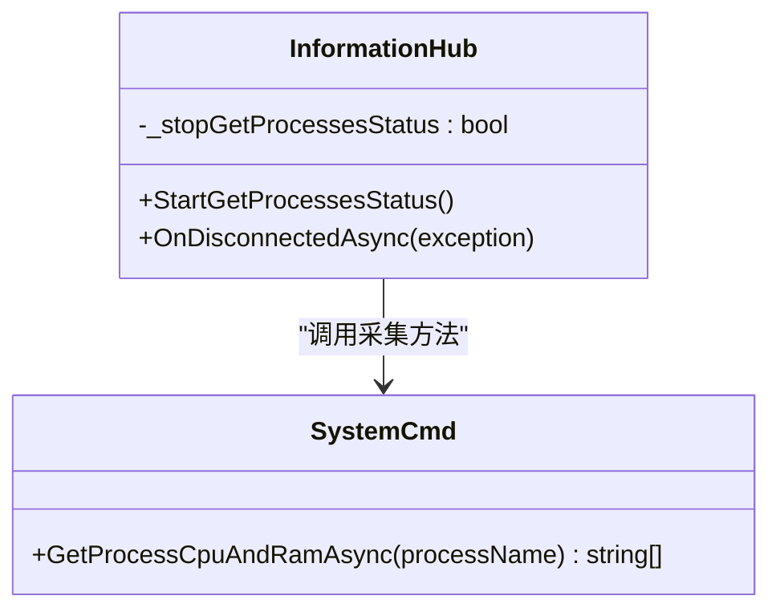
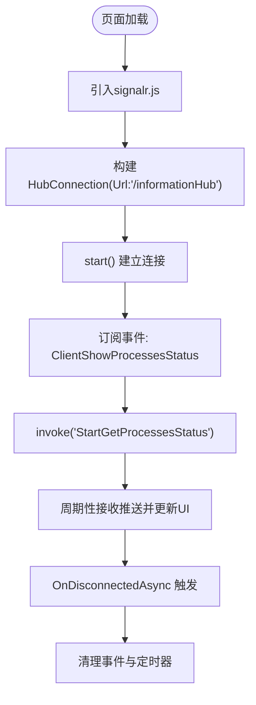
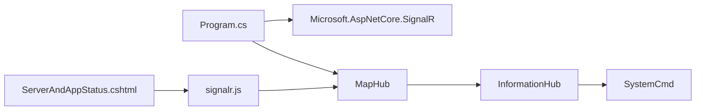

# SignalR 集成

<cite>
**本文引用的文件**
- [Program.cs](file://Sylas.RemoteTasks.App/Program.cs)
- [InformationHub.cs](file://Sylas.RemoteTasks.App/Hubs/InformationHub.cs)
- [ServerAndAppStatus.cshtml](file://Sylas.RemoteTasks.App/Views/Hosts/ServerAndAppStatus.cshtml)
- [SystemCmd.cs](file://Sylas.RemoteTasks.Utils/CommandExecutor/SystemCmd.cs)
- [appsettings.json](file://Sylas.RemoteTasks.App/appsettings.json)
- [signalr.js](file://Sylas.RemoteTasks.App/wwwroot/lib/signalr/dist/browser/signalr.js)
</cite>

## 目录
1. [简介](#简介)
2. [项目结构](#项目结构)
3. [核心组件](#核心组件)
4. [架构概览](#架构概览)
5. [详细组件分析](#详细组件分析)
6. [依赖关系分析](#依赖关系分析)
7. [性能考量](#性能考量)
8. [故障排查指南](#故障排查指南)
9. [结论](#结论)

## 简介
本文件系统性阐述本项目中 SignalR 的集成方式与实现细节，覆盖以下方面：
- 在 ASP.NET Core 应用中的启用与映射
- 依赖注入与中间件管线配置
- Hub 的定义与生命周期行为
- 客户端连接建立、消息订阅与断开处理
- 配置项与性能优化要点（基于现有实现）
- 与应用其他模块的协作关系（如系统监控）

本说明面向初学者与有经验的开发者，既提供高层概览，也给出可追溯到具体源码的实现路径。

## 项目结构
SignalR 在本项目中的落地主要涉及三部分：
- 服务端：在应用启动阶段注册 SignalR 服务并在路由中映射 Hub
- Hub：定义服务端逻辑，负责周期性采集系统/进程状态并向客户端推送
- 客户端：在特定页面中引入浏览器端 SignalR JS SDK，建立连接并订阅事件

图表来源
- [Program.cs](file://Sylas.RemoteTasks.App/Program.cs#L38-L39)
- [Program.cs](file://Sylas.RemoteTasks.App/Program.cs#L119-L119)
- [InformationHub.cs](file://Sylas.RemoteTasks.App/Hubs/InformationHub.cs#L11-L59)
- [SystemCmd.cs](file://Sylas.RemoteTasks.Utils/CommandExecutor/SystemCmd.cs#L386-L416)
- [ServerAndAppStatus.cshtml](file://Sylas.RemoteTasks.App/Views/Hosts/ServerAndAppStatus.cshtml#L36-L75)
- [signalr.js](file://Sylas.RemoteTasks.App/wwwroot/lib/signalr/dist/browser/signalr.js#L1-L120)

章节来源
- [Program.cs](file://Sylas.RemoteTasks.App/Program.cs#L38-L39)
- [Program.cs](file://Sylas.RemoteTasks.App/Program.cs#L119-L119)
- [InformationHub.cs](file://Sylas.RemoteTasks.App/Hubs/InformationHub.cs#L11-L59)
- [ServerAndAppStatus.cshtml](file://Sylas.RemoteTasks.App/Views/Hosts/ServerAndAppStatus.cshtml#L36-L75)
- [signalr.js](file://Sylas.RemoteTasks.App/wwwroot/lib/signalr/dist/browser/signalr.js#L1-L120)

## 核心组件
- 服务端 Hub：定义服务端推送能力与客户端交互方法
- 客户端页面：引入 SignalR JavaScript SDK，建立连接并订阅事件
- 应用启动：注册 SignalR 服务并映射 Hub 路由

章节来源
- [InformationHub.cs](file://Sylas.RemoteTasks.App/Hubs/InformationHub.cs#L11-L59)
- [ServerAndAppStatus.cshtml](file://Sylas.RemoteTasks.App/Views/Hosts/ServerAndAppStatus.cshtml#L36-L75)
- [Program.cs](file://Sylas.RemoteTasks.App/Program.cs#L38-L39)
- [Program.cs](file://Sylas.RemoteTasks.App/Program.cs#L119-L119)

## 架构概览
下面的序列图展示了客户端连接、订阅与服务端推送的完整流程：

图表来源
- [ServerAndAppStatus.cshtml](file://Sylas.RemoteTasks.App/Views/Hosts/ServerAndAppStatus.cshtml#L42-L75)
- [InformationHub.cs](file://Sylas.RemoteTasks.App/Hubs/InformationHub.cs#L14-L56)
- [SystemCmd.cs](file://Sylas.RemoteTasks.Utils/CommandExecutor/SystemCmd.cs#L386-L416)
- [signalr.js](file://Sylas.RemoteTasks.App/wwwroot/lib/signalr/dist/browser/signalr.js#L1262-L1281)

## 详细组件分析

### 服务端 Hub：InformationHub
- 方法职责
  - StartGetProcessesStatus：启动周期性采集并推送结果给调用方
  - OnDisconnectedAsync：连接断开时终止采集循环
- 关键实现要点
  - 使用配置节读取需要监控的进程名列表
  - 对每个进程名并发采集 CPU/内存，聚合后按名称排序推送
  - 通过 Caller 发送事件，避免广播带来的资源浪费
- 生命周期与状态
  - Hub 实例随连接建立而存在；断开时清理采集标志位

图表来源
- [InformationHub.cs](file://Sylas.RemoteTasks.App/Hubs/InformationHub.cs#L11-L59)
- [SystemCmd.cs](file://Sylas.RemoteTasks.Utils/CommandExecutor/SystemCmd.cs#L386-L416)

章节来源
- [InformationHub.cs](file://Sylas.RemoteTasks.App/Hubs/InformationHub.cs#L11-L59)
- [SystemCmd.cs](file://Sylas.RemoteTasks.Utils/CommandExecutor/SystemCmd.cs#L386-L416)

### 客户端页面：ServerAndAppStatus.cshtml
- 引入 SignalR JavaScript SDK
- 建立 HubConnection 并连接到 "/informationHub"
- 订阅 "ClientShowProcessesStatus" 事件，渲染进程状态表格
- 启动后调用 Hub 方法 "StartGetProcessesStatus" 开始推送
- 断开连接时自动清理

图表来源
- [ServerAndAppStatus.cshtml](file://Sylas.RemoteTasks.App/Views/Hosts/ServerAndAppStatus.cshtml#L36-L75)

章节来源
- [ServerAndAppStatus.cshtml](file://Sylas.RemoteTasks.App/Views/Hosts/ServerAndAppStatus.cshtml#L36-L75)

### 应用启动：Program.cs
- 注册 SignalR 服务
- 映射 Hub 路由 "/informationHub"

章节来源
- [Program.cs](file://Sylas.RemoteTasks.App/Program.cs#L38-L39)
- [Program.cs](file://Sylas.RemoteTasks.App/Program.cs#L119-L119)

### 配置：appsettings.json
- 通过配置节提供监控进程名列表，供 Hub 读取
- 其他应用配置（如日志、连接串、身份认证等）与 SignalR 无直接耦合

章节来源
- [InformationHub.cs](file://Sylas.RemoteTasks.App/Hubs/InformationHub.cs#L17-L22)
- [appsettings.json](file://Sylas.RemoteTasks.App/appsettings.json#L15-L18)

## 依赖关系分析
- 服务端依赖
  - Microsoft.AspNetCore.SignalR：提供 Hub 基类与连接模型
  - SystemCmd：提供系统进程状态采集能力
- 客户端依赖
  - signalr.js：浏览器端 SignalR 客户端 SDK
- 应用启动依赖
  - Program.cs：注册 SignalR 服务与映射 Hub

图表来源
- [Program.cs](file://Sylas.RemoteTasks.App/Program.cs#L38-L39)
- [Program.cs](file://Sylas.RemoteTasks.App/Program.cs#L119-L119)
- [InformationHub.cs](file://Sylas.RemoteTasks.App/Hubs/InformationHub.cs#L11-L59)
- [SystemCmd.cs](file://Sylas.RemoteTasks.Utils/CommandExecutor/SystemCmd.cs#L386-L416)
- [ServerAndAppStatus.cshtml](file://Sylas.RemoteTasks.App/Views/Hosts/ServerAndAppStatus.cshtml#L36-L75)
- [signalr.js](file://Sylas.RemoteTasks.App/wwwroot/lib/signalr/dist/browser/signalr.js#L1-L120)

## 性能考量
- 并发采集
  - Hub 对每个进程名并发采集，减少整体等待时间
- 资源推送范围
  - 使用 Caller 推送，仅向发起调用的客户端推送，避免广播
- 事件频率控制
  - 客户端在连接建立后才触发采集，避免无谓开销
- 采集粒度
  - 采集过程包含两次采样以计算平均 CPU 使用率，提升稳定性

章节来源
- [InformationHub.cs](file://Sylas.RemoteTasks.App/Hubs/InformationHub.cs#L23-L37)
- [SystemCmd.cs](file://Sylas.RemoteTasks.Utils/CommandExecutor/SystemCmd.cs#L386-L416)

## 故障排查指南
- 连接失败
  - 检查 Hub 路由映射是否正确
  - 确认客户端 withUrl 的路径与服务端映射一致
- 事件未收到
  - 确认客户端已订阅对应事件名
  - 检查 Hub 是否成功向 Caller 发送事件
- 采集无输出
  - 检查配置节中的进程名列表是否存在
  - 确认 SystemCmd 能够获取到对应进程实例
- 断开后仍继续推送
  - 确认 Hub 的 OnDisconnectedAsync 是否被触发并设置停止标志

章节来源
- [Program.cs](file://Sylas.RemoteTasks.App/Program.cs#L119-L119)
- [ServerAndAppStatus.cshtml](file://Sylas.RemoteTasks.App/Views/Hosts/ServerAndAppStatus.cshtml#L42-L75)
- [InformationHub.cs](file://Sylas.RemoteTasks.App/Hubs/InformationHub.cs#L51-L56)
- [InformationHub.cs](file://Sylas.RemoteTasks.App/Hubs/InformationHub.cs#L17-L22)

## 结论
本项目采用最小可行的 SignalR 集成方案：在应用启动阶段注册 SignalR 服务并映射 Hub，服务端 Hub 提供按需推送能力，客户端页面在需要时建立连接并订阅事件。该方案具备良好的扩展性与性能表现，适合在监控类场景中使用。后续可根据业务需求增加认证、授权、多 Hub 路由与更丰富的事件类型。