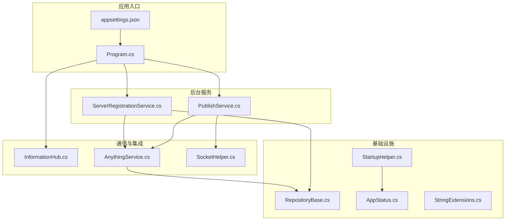
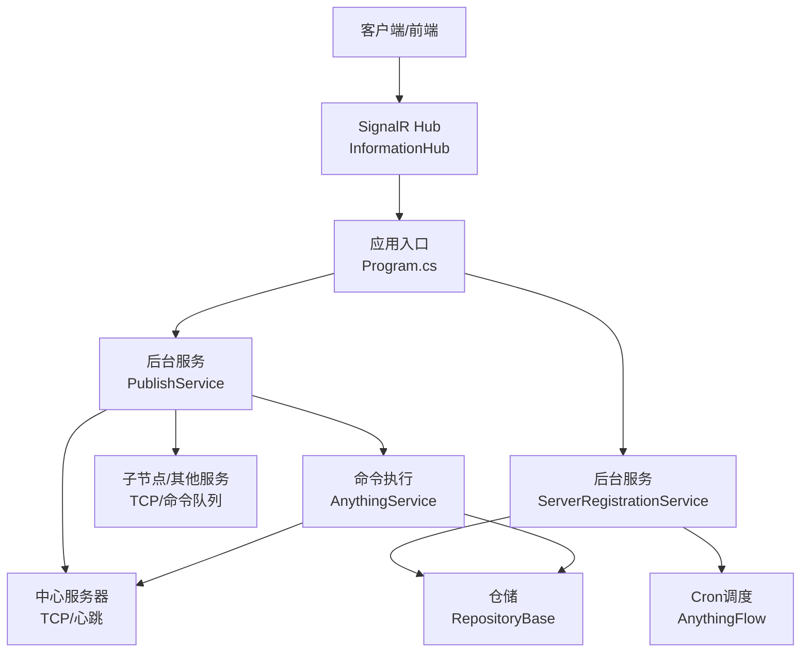
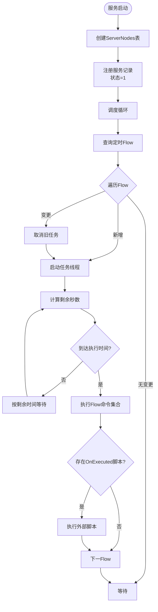
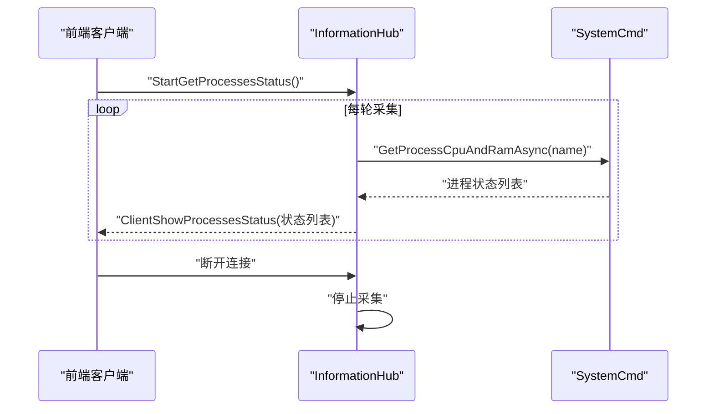
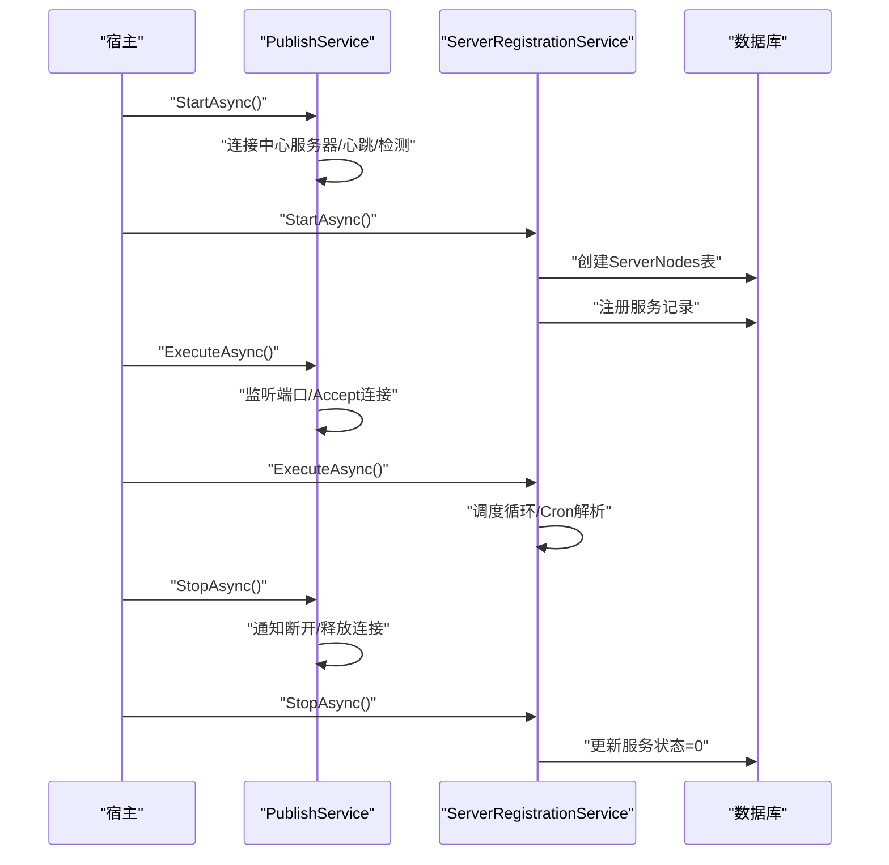
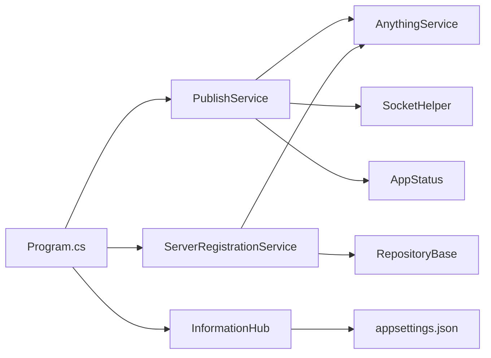

# 后台服务

<cite>
**本文引用的文件**
- [PublishService.cs](file://Sylas.RemoteTasks.App/BackgroundServices/PublishService.cs)
- [ServerRegistrationService.cs](file://Sylas.RemoteTasks.App/BackgroundServices/ServerRegistrationService.cs)
- [InformationHub.cs](file://Sylas.RemoteTasks.App/Hubs/InformationHub.cs)
- [Program.cs](file://Sylas.RemoteTasks.App/Program.cs)
- [appsettings.json](file://Sylas.RemoteTasks.App/appsettings.json)
- [AnythingService.cs](file://Sylas.RemoteTasks.App/RemoteHostModule/Anything/AnythingService.cs)
- [RepositoryBase.cs](file://Sylas.RemoteTasks.App/Infrastructure/RepositoryBase.cs)
- [AppStatus.cs](file://Sylas.RemoteTasks.Common/AppStatus.cs)
- [StartupHelper.cs](file://Sylas.RemoteTasks.App/Helpers/StartupHelper.cs)
- [SocketHelper.cs](file://Sylas.RemoteTasks.Utils/SocketHelper.cs)
- [StringExtensions.cs](file://Sylas.RemoteTasks.Common/Extensions/StringExtensions.cs)
</cite>

## 目录
1. [简介](#简介)
2. [项目结构](#项目结构)
3. [核心组件](#核心组件)
4. [架构总览](#架构总览)
5. [详细组件分析](#详细组件分析)
6. [依赖关系分析](#依赖关系分析)
7. [性能考量](#性能考量)
8. [故障排查指南](#故障排查指南)
9. [结论](#结论)
10. [附录](#附录)

## 简介
本文件面向后台服务模块，系统性阐述以下内容：
- PublishService 与 ServerRegistrationService 的设计目标、实现机制与交互关系
- 后台服务的启动流程、生命周期管理与任务调度策略
- 服务注册、服务发现与健康检查机制
- 与 SignalR 的集成方式（消息发布、订阅与状态同步）
- 服务配置项、运行参数与性能调优建议
- 故障恢复、重试与监控告警的实现要点
- 服务间通信协议与数据交换格式

## 项目结构
后台服务位于 Sylas.RemoteTasks.App 项目中，核心文件如下：
- BackgroundServices：后台服务实现（PublishService、ServerRegistrationService）
- Hubs：SignalR Hub（InformationHub）
- Program.cs：应用入口与 DI 注册
- appsettings.json：运行配置（端口、中心服务器、上传目录、进程监控等）
- RemoteHostModule/Anything：命令执行与任务编排（AnythingService）
- Infrastructure：通用仓储（RepositoryBase）
- Common：应用状态（AppStatus）、扩展（StringExtensions）



**图表来源**
- [Program.cs](file://Sylas.RemoteTasks.App/Program.cs#L67-L68)
- [PublishService.cs](file://Sylas.RemoteTasks.App/BackgroundServices/PublishService.cs#L15-L85)
- [ServerRegistrationService.cs](file://Sylas.RemoteTasks.App/BackgroundServices/ServerRegistrationService.cs#L26-L49)
- [InformationHub.cs](file://Sylas.RemoteTasks.App/Hubs/InformationHub.cs#L11-L11)
- [AnythingService.cs](file://Sylas.RemoteTasks.App/RemoteHostModule/Anything/AnythingService.cs#L30-L38)
- [RepositoryBase.cs](file://Sylas.RemoteTasks.App/Infrastructure/RepositoryBase.cs#L10-L12)
- [AppStatus.cs](file://Sylas.RemoteTasks.Common/AppStatus.cs#L3-L34)
- [StartupHelper.cs](file://Sylas.RemoteTasks.App/Helpers/StartupHelper.cs#L56-L75)
- [SocketHelper.cs](file://Sylas.RemoteTasks.Utils/SocketHelper.cs#L155-L211)

**章节来源**
- [Program.cs](file://Sylas.RemoteTasks.App/Program.cs#L67-L68)
- [appsettings.json](file://Sylas.RemoteTasks.App/appsettings.json#L28-L33)

## 核心组件
- PublishService：负责 TCP 服务端监听、文件传输、子节点连接、命令下发与结果回传；同时作为子节点与中心服务器保持长连接并进行心跳维持。
- ServerRegistrationService：服务启动时注册自身到数据库表，停止时注销；并基于 Cron 表达式调度 AnythingFlow 任务。
- InformationHub：通过 SignalR 向客户端推送进程状态等信息。
- AnythingService：命令解析、执行器映射、跨节点命令转发、命令队列与结果收集。
- RepositoryBase：统一的仓储访问层，封装分页查询、增删改等操作。
- AppStatus：全局应用状态（中心服务器标识、域名、实例路径、进程 ID 等）。

**章节来源**
- [PublishService.cs](file://Sylas.RemoteTasks.App/BackgroundServices/PublishService.cs#L15-L85)
- [ServerRegistrationService.cs](file://Sylas.RemoteTasks.App/BackgroundServices/ServerRegistrationService.cs#L26-L49)
- [InformationHub.cs](file://Sylas.RemoteTasks.App/Hubs/InformationHub.cs#L11-L11)
- [AnythingService.cs](file://Sylas.RemoteTasks.App/RemoteHostModule/Anything/AnythingService.cs#L30-L38)
- [RepositoryBase.cs](file://Sylas.RemoteTasks.App/Infrastructure/RepositoryBase.cs#L10-L12)
- [AppStatus.cs](file://Sylas.RemoteTasks.Common/AppStatus.cs#L3-L34)

## 架构总览
后台服务采用“后台服务 + 通信 + 任务编排”的分层架构：
- 后台服务层：PublishService、ServerRegistrationService
- 通信层：TCP（内部节点/中心服务器）、SignalR（前端状态推送）
- 任务编排层：AnythingService（命令解析、执行器映射、队列与结果收集）
- 数据访问层：RepositoryBase + IDatabaseProvider
- 应用状态与配置：AppStatus、StartupHelper、appsettings.json



**图表来源**
- [Program.cs](file://Sylas.RemoteTasks.App/Program.cs#L67-L68)
- [PublishService.cs](file://Sylas.RemoteTasks.App/BackgroundServices/PublishService.cs#L443-L624)
- [ServerRegistrationService.cs](file://Sylas.RemoteTasks.App/BackgroundServices/ServerRegistrationService.cs#L187-L340)
- [InformationHub.cs](file://Sylas.RemoteTasks.App/Hubs/InformationHub.cs#L11-L56)
- [AnythingService.cs](file://Sylas.RemoteTasks.App/RemoteHostModule/Anything/AnythingService.cs#L399-L491)
- [RepositoryBase.cs](file://Sylas.RemoteTasks.App/Infrastructure/RepositoryBase.cs#L10-L12)

## 详细组件分析

### PublishService：TCP 服务与命令编排
- 设计目标
  - 作为服务端监听 TCP 端口，接收来自子节点的文件与命令任务
  - 作为子节点与中心服务器建立长连接，维持心跳，接收命令并执行，回传结果
  - 作为中心节点，维护子节点连接、命令队列与结果收集
- 关键机制
  - TCP 服务端：绑定端口、Accept 循环、按连接派生子线程处理
  - 命令下发：中心节点将命令入队，子线程轮询出队并发送
  - 命令结果：子线程接收结果，按结束标记拆分，写入共享结果容器
  - 心跳与重连：子节点定时发送心跳，检测超时自动重连
  - 文件传输：首包携带文件元信息，后续字节流写入文件，结束标记校验
- 生命周期
  - StartAsync：子节点连接中心服务器，建立心跳与检测线程，进入命令接收循环
  - ExecuteAsync：服务端监听端口，Accept 新连接，派生子线程处理
  - StopAsync：通知中心服务器断开，释放连接与资源
- 通信协议
  - 参数协议：type;;;;param1;;;;param2...
  - 结束标记：固定长度结束符，用于粘包拆分
  - 心跳：固定字符串，配合时间戳与日志记录
- 与 AnythingService 的协作
  - 命令队列：中心节点将命令入队，子节点出队执行
  - 结果回传：子节点将结果序列化为 JSON，按结束标记发送
  - 跨节点执行：当命令域不匹配时，中心节点转发到对应子节点

```mermaid
sequenceDiagram
participant Center as "中心节点<br/>PublishService"
participant Child as "子节点/其他服务<br/>PublishService"
participant Any as "AnythingService"
Center->>Child : "参数 : 2;;;;domain;;;;socketNo"
Note over Center,Child : "子节点连接参数上报"
Center->>Center : "维护子节点连接字典"
Center->>Any : "入队命令任务"
Child->>Center : "ready_for_new"
Center->>Child : "发送命令ID;;;;执行编号"
Child->>Any : "执行命令"
Any-->>Child : "命令结果批次"
Child->>Center : "发送结果JSON + 结束标记"
Center->>Center : "按结束标记拆分并写入结果容器"
```

**图表来源**
- [PublishService.cs](file://Sylas.RemoteTasks.App/BackgroundServices/PublishService.cs#L478-L599)
- [AnythingService.cs](file://Sylas.RemoteTasks.App/RemoteHostModule/Anything/AnythingService.cs#L399-L491)

**章节来源**
- [PublishService.cs](file://Sylas.RemoteTasks.App/BackgroundServices/PublishService.cs#L15-L85)
- [PublishService.cs](file://Sylas.RemoteTasks.App/BackgroundServices/PublishService.cs#L87-L340)
- [PublishService.cs](file://Sylas.RemoteTasks.App/BackgroundServices/PublishService.cs#L443-L624)
- [PublishService.cs](file://Sylas.RemoteTasks.App/BackgroundServices/PublishService.cs#L626-L637)
- [AnythingService.cs](file://Sylas.RemoteTasks.App/RemoteHostModule/Anything/AnythingService.cs#L399-L491)

### ServerRegistrationService：服务注册与任务调度
- 设计目标
  - 服务启动时注册自身到数据库表，停止时注销
  - 基于 Cron 表达式调度 AnythingFlow 任务，支持取消与动态变更
- 关键机制
  - 服务注册：查询当前主机与 IP 列表，若存在则更新状态为在线，否则新增记录
  - Cron 解析：支持“秒 分 时”三段表达式，缓存解析结果，寻找未来 7 天内的下一个触发时间
  - 任务调度：为每个定时任务创建独立线程，按剩余时间动态调整等待时长，执行后可选执行外部脚本
  - 任务取消：当任务配置变更时，取消旧任务并启动新任务
- 与 AnythingService 的协作
  - 读取 AnythingFlow 配置，解析命令集合，逐条执行并聚合消息
  - 执行完成后可调用外部系统命令处理结果



**图表来源**
- [ServerRegistrationService.cs](file://Sylas.RemoteTasks.App/BackgroundServices/ServerRegistrationService.cs#L167-L181)
- [ServerRegistrationService.cs](file://Sylas.RemoteTasks.App/BackgroundServices/ServerRegistrationService.cs#L187-L340)
- [ServerRegistrationService.cs](file://Sylas.RemoteTasks.App/BackgroundServices/ServerRegistrationService.cs#L362-L490)

**章节来源**
- [ServerRegistrationService.cs](file://Sylas.RemoteTasks.App/BackgroundServices/ServerRegistrationService.cs#L54-L110)
- [ServerRegistrationService.cs](file://Sylas.RemoteTasks.App/BackgroundServices/ServerRegistrationService.cs#L167-L181)
- [ServerRegistrationService.cs](file://Sylas.RemoteTasks.App/BackgroundServices/ServerRegistrationService.cs#L187-L340)
- [ServerRegistrationService.cs](file://Sylas.RemoteTasks.App/BackgroundServices/ServerRegistrationService.cs#L362-L490)

### 与 SignalR 的集成：状态同步与消息推送
- 集成方式
  - 在 Program.cs 中注册 SignalR，并映射 Hub 路由
  - InformationHub 提供 StartGetProcessesStatus 方法，周期性拉取进程 CPU/内存并推送给客户端
  - 断开连接时停止状态采集
- 使用场景
  - 前端订阅进程状态，后端按配置的进程名列表并发采集并推送
  - 与后台服务的健康检查日志结合，形成可视化运维面板



**图表来源**
- [Program.cs](file://Sylas.RemoteTasks.App/Program.cs#L38-L38)
- [Program.cs](file://Sylas.RemoteTasks.App/Program.cs#L119-L119)
- [InformationHub.cs](file://Sylas.RemoteTasks.App/Hubs/InformationHub.cs#L14-L56)

**章节来源**
- [Program.cs](file://Sylas.RemoteTasks.App/Program.cs#L38-L38)
- [Program.cs](file://Sylas.RemoteTasks.App/Program.cs#L119-L119)
- [InformationHub.cs](file://Sylas.RemoteTasks.App/Hubs/InformationHub.cs#L11-L56)

### 服务启动流程与生命周期管理
- 启动流程
  - Program.cs 注册后台服务（PublishService、ServerRegistrationService）
  - StartupHelper 读取配置，初始化 AppStatus（中心服务器、域名、实例路径、进程 ID）
  - PublishService.StartAsync：子节点连接中心服务器，建立心跳与检测线程
  - ServerRegistrationService.StartAsync：创建 ServerNodes 表，注册服务，启动调度循环
- 生命周期
  - StartAsync：注册/连接/启动后台线程
  - ExecuteAsync：服务端监听/子线程处理
  - StopAsync：通知断开/释放资源/注销服务



**图表来源**
- [Program.cs](file://Sylas.RemoteTasks.App/Program.cs#L67-L68)
- [StartupHelper.cs](file://Sylas.RemoteTasks.App/Helpers/StartupHelper.cs#L56-L75)
- [PublishService.cs](file://Sylas.RemoteTasks.App/BackgroundServices/PublishService.cs#L443-L624)
- [ServerRegistrationService.cs](file://Sylas.RemoteTasks.App/BackgroundServices/ServerRegistrationService.cs#L54-L110)

**章节来源**
- [Program.cs](file://Sylas.RemoteTasks.App/Program.cs#L67-L68)
- [StartupHelper.cs](file://Sylas.RemoteTasks.App/Helpers/StartupHelper.cs#L56-L75)
- [PublishService.cs](file://Sylas.RemoteTasks.App/BackgroundServices/PublishService.cs#L443-L624)
- [ServerRegistrationService.cs](file://Sylas.RemoteTasks.App/BackgroundServices/ServerRegistrationService.cs#L54-L110)

### 服务注册、发现与健康检查
- 服务注册
  - ServerRegistrationService 在启动时创建 ServerNodes 表，注册主机名、IP 列表与状态
- 服务发现
  - AnythingService 通过命令域（Domain）识别目标节点，中心节点将命令入队到对应队列
- 健康检查
  - PublishService 子节点定期发送心跳，检测线程在超时后触发重连
  - 日志目录记录心跳与命令结果，便于运维观测

**章节来源**
- [ServerRegistrationService.cs](file://Sylas.RemoteTasks.App/BackgroundServices/ServerRegistrationService.cs#L167-L181)
- [AnythingService.cs](file://Sylas.RemoteTasks.App/RemoteHostModule/Anything/AnythingService.cs#L303-L334)
- [PublishService.cs](file://Sylas.RemoteTasks.App/BackgroundServices/PublishService.cs#L482-L543)

### 服务间通信协议与数据交换格式
- TCP 参数协议
  - 文件传输：type=1，参数包含文件大小、文件名、保存目录
  - 子节点连接：type=2，参数包含域名、socket 标识
  - 命令下发：参数包含命令 ID 与执行编号
- 结束标记
  - 固定字符串，用于粘包拆分与完整性校验
- 心跳
  - 固定字符串，配合时间戳与日志记录
- JSON 数据
  - 命令结果以 JSON 序列化发送，包含执行编号与状态信息

**章节来源**
- [PublishService.cs](file://Sylas.RemoteTasks.App/BackgroundServices/PublishService.cs#L156-L181)
- [PublishService.cs](file://Sylas.RemoteTasks.App/BackgroundServices/PublishService.cs#L264-L278)
- [PublishService.cs](file://Sylas.RemoteTasks.App/BackgroundServices/PublishService.cs#L361-L362)
- [PublishService.cs](file://Sylas.RemoteTasks.App/BackgroundServices/PublishService.cs#L590-L598)
- [SocketHelper.cs](file://Sylas.RemoteTasks.Utils/SocketHelper.cs#L155-L211)

## 依赖关系分析
- 组件耦合
  - PublishService 依赖 AnythingService（命令队列与结果收集）、SocketHelper（Socket 扩展）、AppStatus（中心服务器标识）
  - ServerRegistrationService 依赖 RepositoryBase（数据访问）、AnythingService（任务执行）、Cron 解析器
  - InformationHub 依赖配置（ProcessMonitor.Names）与 SystemCmd（进程状态采集）
- 外部依赖
  - SignalR：前端实时推送
  - 数据库：ServerNodes 表、Anything 配置与命令
  - Kestrel：HTTP/HTTPS 服务端



**图表来源**
- [PublishService.cs](file://Sylas.RemoteTasks.App/BackgroundServices/PublishService.cs#L50-L85)
- [ServerRegistrationService.cs](file://Sylas.RemoteTasks.App/BackgroundServices/ServerRegistrationService.cs#L187-L340)
- [InformationHub.cs](file://Sylas.RemoteTasks.App/Hubs/InformationHub.cs#L11-L17)
- [Program.cs](file://Sylas.RemoteTasks.App/Program.cs#L67-L68)

**章节来源**
- [PublishService.cs](file://Sylas.RemoteTasks.App/BackgroundServices/PublishService.cs#L50-L85)
- [ServerRegistrationService.cs](file://Sylas.RemoteTasks.App/BackgroundServices/ServerRegistrationService.cs#L187-L340)
- [InformationHub.cs](file://Sylas.RemoteTasks.App/Hubs/InformationHub.cs#L11-L17)
- [Program.cs](file://Sylas.RemoteTasks.App/Program.cs#L67-L68)

## 性能考量
- 线程模型
  - 服务端 Accept 循环派生子线程处理每个连接，注意线程数量与系统负载平衡
  - 子节点心跳与检测线程分离，避免阻塞命令处理
- 内存与缓存
  - AnythingService 使用内存缓存 AnythingInfo 与执行器映射，降低重复解析成本
  - ServerRegistrationService 使用缓存解析 Cron 表达式
- I/O 优化
  - TCP 缓冲区大小与结束标记校验减少粘包影响
  - 文件传输采用流式写入，避免一次性加载大文件
- 数据库访问
  - RepositoryBase 统一分页查询与参数化 SQL，减少 SQL 注入风险与提升可维护性

[本节为通用指导，无需特定文件引用]

## 故障排查指南
- 心跳超时与断线重连
  - 现象：长时间无心跳或连接中断
  - 处理：检查网络连通性、防火墙策略；确认心跳频率与检测阈值；查看心跳日志目录
- 命令执行超时
  - 现象：命令结果长时间未返回
  - 处理：检查 AnythingService 的队列与结果收集逻辑；确认命令执行器可用性
- 文件传输异常
  - 现象：文件大小不一致或结束标记缺失
  - 处理：核对参数协议与结束标记；检查磁盘空间与权限
- 服务注册失败
  - 现象：ServerNodes 表创建失败或注册记录缺失
  - 处理：检查数据库连接与权限；确认主机名与 IP 列表解析正确
- SignalR 推送异常
  - 现象：前端无法接收进程状态
  - 处理：确认 Hub 路由映射；检查 ProcessMonitor.Names 配置；观察断开事件

**章节来源**
- [PublishService.cs](file://Sylas.RemoteTasks.App/BackgroundServices/PublishService.cs#L520-L543)
- [PublishService.cs](file://Sylas.RemoteTasks.App/BackgroundServices/PublishService.cs#L604-L618)
- [ServerRegistrationService.cs](file://Sylas.RemoteTasks.App/BackgroundServices/ServerRegistrationService.cs#L167-L181)
- [InformationHub.cs](file://Sylas.RemoteTasks.App/Hubs/InformationHub.cs#L50-L56)

## 结论
- PublishService 与 ServerRegistrationService 分别承担“命令编排与通信”和“服务注册与任务调度”的核心职责，二者协同实现分布式后台任务体系
- 通过 TCP 参数协议、结束标记与心跳机制，确保命令与文件传输的可靠性
- 与 SignalR 的集成提供了实时状态展示能力，辅助运维监控
- 建议在生产环境中完善重试与熔断策略、增强日志与指标采集，并对 Cron 调度与命令执行进行可观测性增强

[本节为总结性内容，无需特定文件引用]

## 附录

### 服务配置选项与运行参数
- TcpPort：TCP 服务端口（默认 8989）
- CenterServer：中心服务器地址（留空表示自身为中心节点）
- CenterServerPort：中心服务器端口（默认 8989）
- CenterWebServer：中心服务器 Web 地址（用于跨节点命令转发）
- Upload:SaveDir：文件上传保存目录
- ProcessMonitor:Names：SignalR 进程状态监控的进程名列表
- Logging：日志级别与控制台格式化配置

**章节来源**
- [appsettings.json](file://Sylas.RemoteTasks.App/appsettings.json#L28-L33)
- [appsettings.json](file://Sylas.RemoteTasks.App/appsettings.json#L39-L43)
- [appsettings.json](file://Sylas.RemoteTasks.App/appsettings.json#L122-L124)
- [appsettings.json](file://Sylas.RemoteTasks.App/appsettings.json#L2-L14)
- [StartupHelper.cs](file://Sylas.RemoteTasks.App/Helpers/StartupHelper.cs#L56-L75)

### 服务间通信协议与数据交换格式
- 参数协议
  - 文件传输：type=1；参数：文件大小、文件名、保存目录
  - 子节点连接：type=2；参数：域名、socket 标识
  - 命令下发：参数：命令 ID、执行编号
- 结束标记：固定字符串，用于粘包拆分
- 心跳：固定字符串，配合时间戳与日志记录
- JSON：命令结果序列化格式

**章节来源**
- [PublishService.cs](file://Sylas.RemoteTasks.App/BackgroundServices/PublishService.cs#L156-L181)
- [PublishService.cs](file://Sylas.RemoteTasks.App/BackgroundServices/PublishService.cs#L264-L278)
- [PublishService.cs](file://Sylas.RemoteTasks.App/BackgroundServices/PublishService.cs#L361-L362)
- [PublishService.cs](file://Sylas.RemoteTasks.App/BackgroundServices/PublishService.cs#L590-L598)
- [SocketHelper.cs](file://Sylas.RemoteTasks.Utils/SocketHelper.cs#L155-L211)