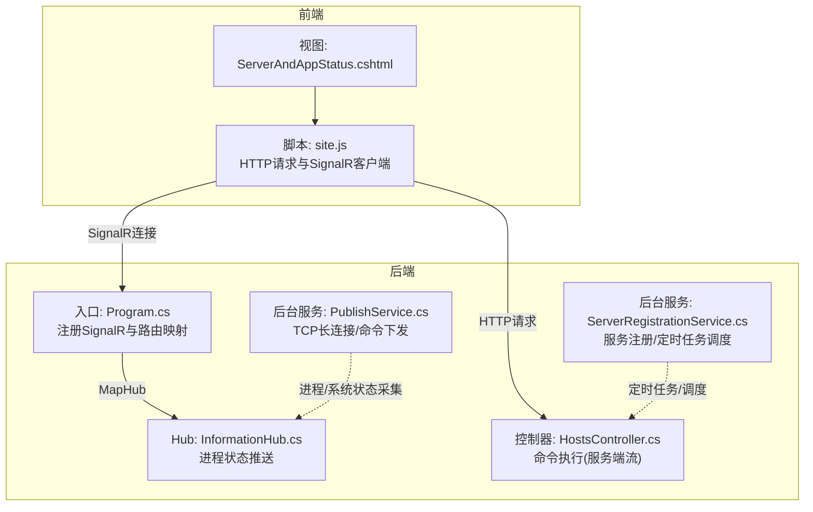
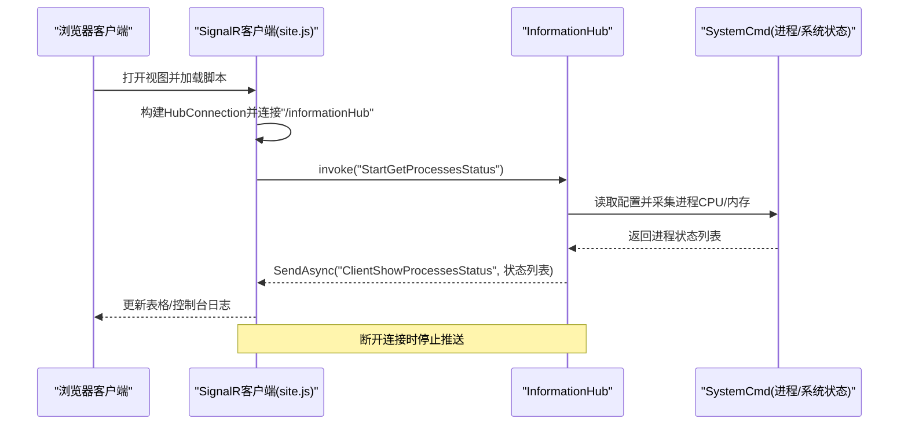
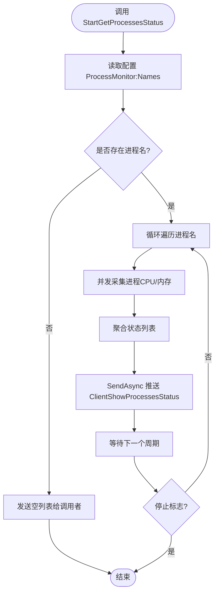
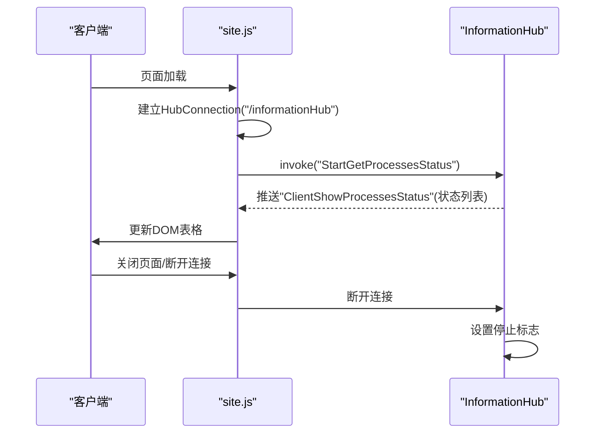
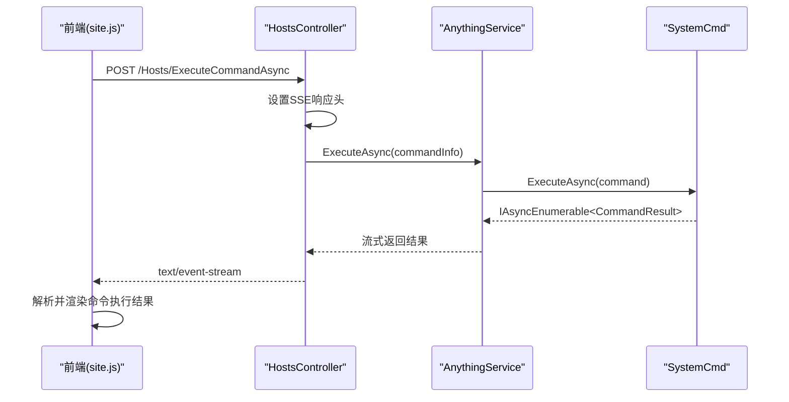
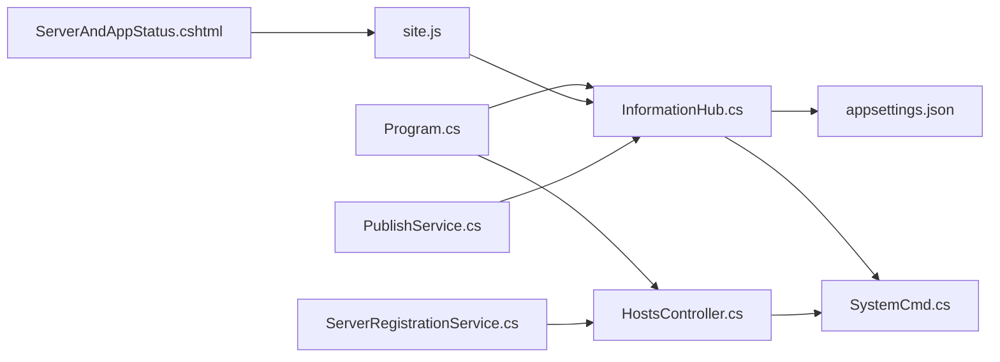

# 实时通信系统

<cite>
**本文引用的文件**
- [InformationHub.cs](file://Sylas.RemoteTasks.App/Hubs/InformationHub.cs)
- [Program.cs](file://Sylas.RemoteTasks.App/Program.cs)
- [appsettings.json](file://Sylas.RemoteTasks.App/appsettings.json)
- [ServerAndAppStatus.cshtml](file://Sylas.RemoteTasks.App/Views/Hosts/ServerAndAppStatus.cshtml)
- [site.js](file://Sylas.RemoteTasks.App/wwwroot/js/site.js)
- [PublishService.cs](file://Sylas.RemoteTasks.App/BackgroundServices/PublishService.cs)
- [ServerRegistrationService.cs](file://Sylas.RemoteTasks.App/BackgroundServices/ServerRegistrationService.cs)
- [SystemCmd.cs](file://Sylas.RemoteTasks.Utils/CommandExecutor/SystemCmd.cs)
- [CommandResult.cs](file://Sylas.RemoteTasks.Utils/CommandExecutor/CommandResult.cs)
- [ICommandExecutor.cs](file://Sylas.RemoteTasks.Utils/CommandExecutor/ICommandExecutor.cs)
- [HostsController.cs](file://Sylas.RemoteTasks.App/Controllers/HostsController.cs)
- [AnythingFlow.cs](file://Sylas.RemoteTasks.App/RemoteHostModule/Anything/AnythingFlow.cs)
</cite>

## 目录
1. [简介](#简介)
2. [项目结构](#项目结构)
3. [核心组件](#核心组件)
4. [架构总览](#架构总览)
5. [详细组件分析](#详细组件分析)
6. [依赖关系分析](#依赖关系分析)
7. [性能考量](#性能考量)
8. [故障排查指南](#故障排查指南)
9. [结论](#结论)
10. [附录](#附录)

## 简介
本文件面向实时通信系统，聚焦以下主题：SignalR 集成、InformationHub 实现、进程监控功能、状态推送机制、客户端连接管理。文档基于实际代码库进行分析，提供配置项、参数与返回值说明、组件间关系图解、常见问题与解决方案，兼顾初学者易懂与资深开发者所需的技术深度。

## 项目结构
本项目采用 ASP.NET Core + SignalR 的前后端分离架构，前端通过浏览器 SignalR JavaScript 客户端连接后端 Hub；后端通过 Hub 实现服务端向特定客户端推送状态信息；同时结合后台服务实现进程监控与状态采集。

图表来源
- [Program.cs](file://Sylas.RemoteTasks.App/Program.cs#L119-L119)
- [InformationHub.cs](file://Sylas.RemoteTasks.App/Hubs/InformationHub.cs#L11-L11)
- [ServerAndAppStatus.cshtml](file://Sylas.RemoteTasks.App/Views/Hosts/ServerAndAppStatus.cshtml#L42-L42)
- [HostsController.cs](file://Sylas.RemoteTasks.App/Controllers/HostsController.cs#L85-L97)
- [PublishService.cs](file://Sylas.RemoteTasks.App/BackgroundServices/PublishService.cs#L88-L120)
- [ServerRegistrationService.cs](file://Sylas.RemoteTasks.App/BackgroundServices/ServerRegistrationService.cs#L187-L204)

章节来源
- [Program.cs](file://Sylas.RemoteTasks.App/Program.cs#L119-L119)
- [InformationHub.cs](file://Sylas.RemoteTasks.App/Hubs/InformationHub.cs#L11-L11)
- [ServerAndAppStatus.cshtml](file://Sylas.RemoteTasks.App/Views/Hosts/ServerAndAppStatus.cshtml#L42-L42)
- [HostsController.cs](file://Sylas.RemoteTasks.App/Controllers/HostsController.cs#L85-L97)

## 核心组件
- SignalR Hub（InformationHub）：负责向连接到当前 Hub 的客户端推送进程状态信息。
- 客户端（浏览器）：通过 SignalR JavaScript 客户端连接 Hub，订阅“进程状态”推送事件。
- 后台服务（PublishService/ServerRegistrationService）：采集系统与进程状态，驱动 Hub 推送。
- 命令执行（HostsController + SystemCmd）：提供命令执行的服务器端流式响应能力，作为实时通信的补充场景。

章节来源
- [InformationHub.cs](file://Sylas.RemoteTasks.App/Hubs/InformationHub.cs#L11-L56)
- [ServerAndAppStatus.cshtml](file://Sylas.RemoteTasks.App/Views/Hosts/ServerAndAppStatus.cshtml#L42-L75)
- [PublishService.cs](file://Sylas.RemoteTasks.App/BackgroundServices/PublishService.cs#L88-L120)
- [ServerRegistrationService.cs](file://Sylas.RemoteTasks.App/BackgroundServices/ServerRegistrationService.cs#L187-L204)
- [HostsController.cs](file://Sylas.RemoteTasks.App/Controllers/HostsController.cs#L85-L97)
- [SystemCmd.cs](file://Sylas.RemoteTasks.Utils/CommandExecutor/SystemCmd.cs#L129-L138)

## 架构总览
SignalR 在本系统中承担“服务端推送”的角色。客户端连接到 Hub 后，服务端通过 Hub 方法向特定客户端推送进程状态；同时，系统还提供基于 HTTP 的服务器端流（SSE）用于命令执行结果的实时回传。

图表来源
- [ServerAndAppStatus.cshtml](file://Sylas.RemoteTasks.App/Views/Hosts/ServerAndAppStatus.cshtml#L42-L75)
- [InformationHub.cs](file://Sylas.RemoteTasks.App/Hubs/InformationHub.cs#L14-L49)
- [SystemCmd.cs](file://Sylas.RemoteTasks.Utils/CommandExecutor/SystemCmd.cs#L386-L416)

章节来源
- [ServerAndAppStatus.cshtml](file://Sylas.RemoteTasks.App/Views/Hosts/ServerAndAppStatus.cshtml#L42-L75)
- [InformationHub.cs](file://Sylas.RemoteTasks.App/Hubs/InformationHub.cs#L14-L49)
- [SystemCmd.cs](file://Sylas.RemoteTasks.Utils/CommandExecutor/SystemCmd.cs#L386-L416)

## 详细组件分析

### SignalR 集成与 Hub 配置
- 程序入口注册 SignalR 与 Hub 映射，确保客户端可通过 URL “/informationHub” 连接。
- Hub 类继承自 SignalR Hub，提供 StartGetProcessesStatus 方法用于启动/停止进程状态推送。
- 客户端通过 SignalR JavaScript 客户端连接 Hub，并订阅“ClientShowProcessesStatus”事件。

章节来源
- [Program.cs](file://Sylas.RemoteTasks.App/Program.cs#L38-L38)
- [Program.cs](file://Sylas.RemoteTasks.App/Program.cs#L119-L119)
- [InformationHub.cs](file://Sylas.RemoteTasks.App/Hubs/InformationHub.cs#L11-L11)
- [ServerAndAppStatus.cshtml](file://Sylas.RemoteTasks.App/Views/Hosts/ServerAndAppStatus.cshtml#L42-L42)

### InformationHub 实现
- 启动推送：StartGetProcessesStatus 读取配置中的进程名列表，逐个并发采集 CPU/内存占用，聚合后推送给当前连接的客户端。
- 停止推送：OnDisconnectedAsync 将停止标志置为 true，使轮询循环退出。
- 数据结构：返回每条记录包含“进程名:PID”、“CPU占用率%”、“内存占用MB”。

图表来源
- [InformationHub.cs](file://Sylas.RemoteTasks.App/Hubs/InformationHub.cs#L14-L49)

章节来源
- [InformationHub.cs](file://Sylas.RemoteTasks.App/Hubs/InformationHub.cs#L14-L49)

### 客户端连接管理与状态推送
- 客户端连接：通过 SignalR JavaScript 客户端连接 Hub。
- 事件订阅：订阅“ClientShowProcessesStatus”，将返回的状态渲染到页面表格。
- 断开处理：当连接断开时，Hub 端设置停止标志，避免继续推送。

图表来源
- [ServerAndAppStatus.cshtml](file://Sylas.RemoteTasks.App/Views/Hosts/ServerAndAppStatus.cshtml#L42-L75)
- [InformationHub.cs](file://Sylas.RemoteTasks.App/Hubs/InformationHub.cs#L51-L56)

章节来源
- [ServerAndAppStatus.cshtml](file://Sylas.RemoteTasks.App/Views/Hosts/ServerAndAppStatus.cshtml#L42-L75)
- [InformationHub.cs](file://Sylas.RemoteTasks.App/Hubs/InformationHub.cs#L51-L56)

### 进程监控功能与状态采集
- 配置项：appsettings.json 中的 ProcessMonitor:Names 定义需要监控的进程名数组。
- 采集实现：SystemCmd.GetProcessCpuAndRamAsync 并发采集每个进程的 CPU 使用率与内存占用。
- Hub 调用：InformationHub 在每次推送周期内调用 SystemCmd 并汇总结果。

章节来源
- [appsettings.json](file://Sylas.RemoteTasks.App/appsettings.json#L122-L124)
- [SystemCmd.cs](file://Sylas.RemoteTasks.Utils/CommandExecutor/SystemCmd.cs#L386-L416)
- [InformationHub.cs](file://Sylas.RemoteTasks.App/Hubs/InformationHub.cs#L17-L32)

### 服务器端流式命令执行（补充场景）
- 控制器：HostsController 提供命令执行接口，返回 SSE 流，客户端持续接收 CommandResult。
- 执行器：SystemCmd 实现命令执行，ICommandExecutor 定义异步枚举接口。
- 结果模型：CommandResult 包含执行成功标志、消息与执行编号，便于客户端匹配结果。

图表来源
- [HostsController.cs](file://Sylas.RemoteTasks.App/Controllers/HostsController.cs#L85-L97)
- [ICommandExecutor.cs](file://Sylas.RemoteTasks.Utils/CommandExecutor/ICommandExecutor.cs#L14-L21)
- [CommandResult.cs](file://Sylas.RemoteTasks.Utils/CommandExecutor/CommandResult.cs#L6-L36)
- [SystemCmd.cs](file://Sylas.RemoteTasks.Utils/CommandExecutor/SystemCmd.cs#L129-L138)

章节来源
- [HostsController.cs](file://Sylas.RemoteTasks.App/Controllers/HostsController.cs#L85-L97)
- [ICommandExecutor.cs](file://Sylas.RemoteTasks.Utils/CommandExecutor/ICommandExecutor.cs#L14-L21)
- [CommandResult.cs](file://Sylas.RemoteTasks.Utils/CommandExecutor/CommandResult.cs#L6-L36)
- [SystemCmd.cs](file://Sylas.RemoteTasks.Utils/CommandExecutor/SystemCmd.cs#L129-L138)

### 后台服务与系统集成
- PublishService：监听本地 TCP 端口，接收子节点上报的心跳与命令结果；同时作为子节点时与中心服务器保持长连接并转发命令。
- ServerRegistrationService：服务启动/停止时注册/注销节点；按 Cron 表达式调度 AnythingFlow 任务并在执行完成后可触发后续脚本。

章节来源
- [PublishService.cs](file://Sylas.RemoteTasks.App/BackgroundServices/PublishService.cs#L88-L120)
- [ServerRegistrationService.cs](file://Sylas.RemoteTasks.App/BackgroundServices/ServerRegistrationService.cs#L55-L110)
- [ServerRegistrationService.cs](file://Sylas.RemoteTasks.App/BackgroundServices/ServerRegistrationService.cs#L187-L341)
- [AnythingFlow.cs](file://Sylas.RemoteTasks.App/RemoteHostModule/Anything/AnythingFlow.cs#L6-L27)

## 依赖关系分析
- Program.cs 注册 SignalR 并映射 Hub。
- InformationHub 依赖 IConfiguration 读取进程监控配置，并依赖 SystemCmd 执行状态采集。
- 客户端通过 SignalR JavaScript 客户端与 Hub 交互。
- HostsController 依赖 AnythingService 与 SystemCmd 提供命令执行的服务器端流。
- PublishService/ServerRegistrationService 作为后台服务参与系统级监控与调度。

图表来源
- [Program.cs](file://Sylas.RemoteTasks.App/Program.cs#L38-L38)
- [Program.cs](file://Sylas.RemoteTasks.App/Program.cs#L119-L119)
- [InformationHub.cs](file://Sylas.RemoteTasks.App/Hubs/InformationHub.cs#L11-L11)
- [appsettings.json](file://Sylas.RemoteTasks.App/appsettings.json#L122-L124)
- [SystemCmd.cs](file://Sylas.RemoteTasks.Utils/CommandExecutor/SystemCmd.cs#L386-L416)
- [ServerAndAppStatus.cshtml](file://Sylas.RemoteTasks.App/Views/Hosts/ServerAndAppStatus.cshtml#L42-L42)
- [site.js](file://Sylas.RemoteTasks.App/wwwroot/js/site.js#L720-L774)
- [HostsController.cs](file://Sylas.RemoteTasks.App/Controllers/HostsController.cs#L85-L97)
- [PublishService.cs](file://Sylas.RemoteTasks.App/BackgroundServices/PublishService.cs#L88-L120)
- [ServerRegistrationService.cs](file://Sylas.RemoteTasks.App/BackgroundServices/ServerRegistrationService.cs#L55-L110)

章节来源
- [Program.cs](file://Sylas.RemoteTasks.App/Program.cs#L38-L38)
- [Program.cs](file://Sylas.RemoteTasks.App/Program.cs#L119-L119)
- [InformationHub.cs](file://Sylas.RemoteTasks.App/Hubs/InformationHub.cs#L11-L11)
- [appsettings.json](file://Sylas.RemoteTasks.App/appsettings.json#L122-L124)
- [SystemCmd.cs](file://Sylas.RemoteTasks.Utils/CommandExecutor/SystemCmd.cs#L386-L416)
- [ServerAndAppStatus.cshtml](file://Sylas.RemoteTasks.App/Views/Hosts/ServerAndAppStatus.cshtml#L42-L42)
- [site.js](file://Sylas.RemoteTasks.App/wwwroot/js/site.js#L720-L774)
- [HostsController.cs](file://Sylas.RemoteTasks.App/Controllers/HostsController.cs#L85-L97)
- [PublishService.cs](file://Sylas.RemoteTasks.App/BackgroundServices/PublishService.cs#L88-L120)
- [ServerRegistrationService.cs](file://Sylas.RemoteTasks.App/BackgroundServices/ServerRegistrationService.cs#L55-L110)

## 性能考量
- 并发采集：InformationHub 对每个进程名启动独立 Task 并行采集，提升整体吞吐。
- 内存与线程：注意并发 Task 数量与进程数量，避免过多并发造成资源争用。
- 推送频率：合理设置推送周期，避免过于频繁导致客户端渲染压力。
- 服务器端流：命令执行返回 SSE 时，建议分块发送并设置合适的缓冲区大小，避免内存峰值过高。

## 故障排查指南
- 客户端无法连接 Hub
  - 检查 Program.cs 中是否正确映射 Hub 路由。
  - 检查客户端 URL 是否为正确的 Hub 地址。
  - 查看浏览器 Network 面板与控制台错误。
- 无法收到进程状态推送
  - 检查 appsettings.json 中 ProcessMonitor:Names 是否配置有效进程名。
  - 确认客户端已调用 StartGetProcessesStatus 并订阅 ClientShowProcessesStatus。
  - 检查 Hub 的 OnDisconnectedAsync 是否提前触发（如页面刷新/断开）。
- 命令执行无响应
  - 确认 HostsController 的 SSE 响应头设置正确。
  - 检查 AnythingService 与 SystemCmd 的执行链路是否抛出异常。
  - 查看服务器日志定位异常点。

章节来源
- [Program.cs](file://Sylas.RemoteTasks.App/Program.cs#L119-L119)
- [ServerAndAppStatus.cshtml](file://Sylas.RemoteTasks.App/Views/Hosts/ServerAndAppStatus.cshtml#L42-L75)
- [InformationHub.cs](file://Sylas.RemoteTasks.App/Hubs/InformationHub.cs#L17-L22)
- [HostsController.cs](file://Sylas.RemoteTasks.App/Controllers/HostsController.cs#L85-L97)

## 结论
本系统通过 SignalR 实现服务端向客户端的实时状态推送，结合后台服务与命令执行能力，形成完整的实时通信闭环。InformationHub 作为核心 Hub，负责进程状态采集与推送；客户端通过 SignalR JavaScript 客户端订阅事件并渲染；后台服务提供系统级监控与任务调度。整体设计清晰、职责明确，具备良好的扩展性与可维护性。

## 附录

### 配置项与参数说明
- 进程监控配置
  - 键名：ProcessMonitor:Names
  - 类型：字符串数组
  - 用途：定义需要监控的进程名列表
  - 示例路径：[appsettings.json](file://Sylas.RemoteTasks.App/appsettings.json#L122-L124)
- SignalR Hub 映射
  - 路径：/informationHub
  - 映射位置：Program.cs
  - 示例路径：[Program.cs](file://Sylas.RemoteTasks.App/Program.cs#L119-L119)
- 客户端连接与事件
  - 连接 URL：/informationHub
  - 事件名：ClientShowProcessesStatus
  - 示例路径：[ServerAndAppStatus.cshtml](file://Sylas.RemoteTasks.App/Views/Hosts/ServerAndAppStatus.cshtml#L42-L75)

### 返回值与数据模型
- CommandResult
  - 字段：Succeed、Message、CommandExecuteNo
  - 用途：承载命令执行结果，便于客户端匹配与展示
  - 示例路径：[CommandResult.cs](file://Sylas.RemoteTasks.Utils/CommandExecutor/CommandResult.cs#L6-L36)
- 进程状态格式
  - 格式：进程名:PID CPU占用率% 内存占用MB
  - 来源：SystemCmd.GetProcessCpuAndRamAsync
  - 示例路径：[SystemCmd.cs](file://Sylas.RemoteTasks.Utils/CommandExecutor/SystemCmd.cs#L386-L416)