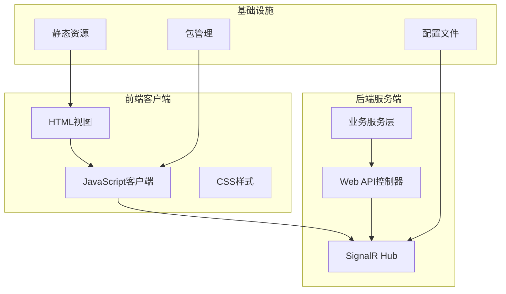
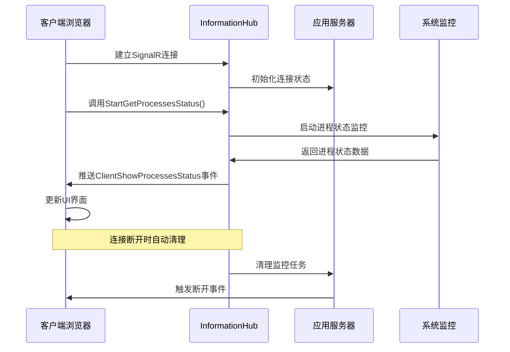
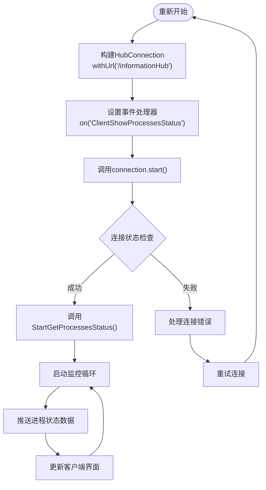
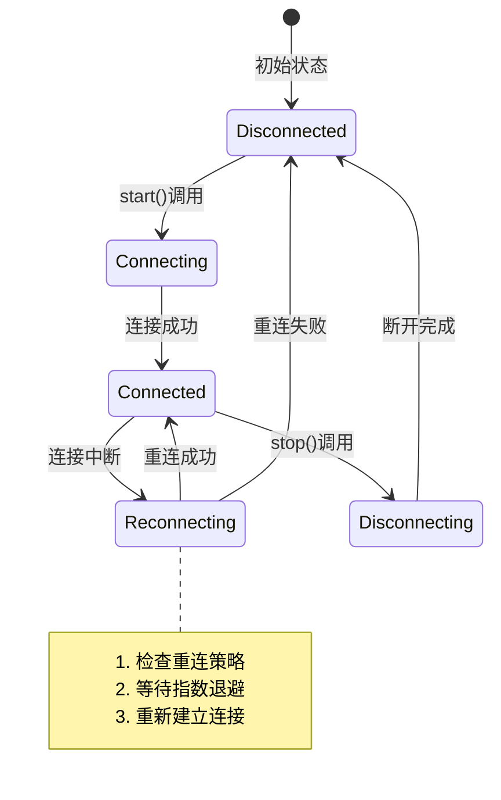
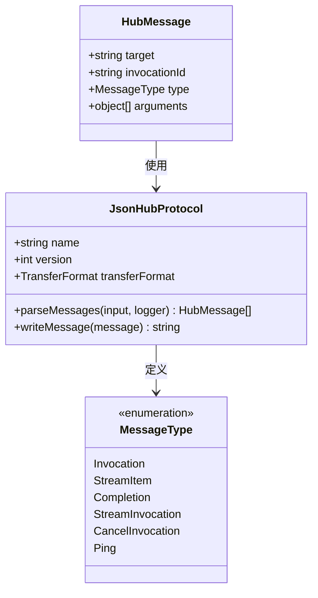
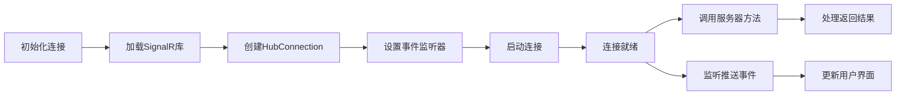
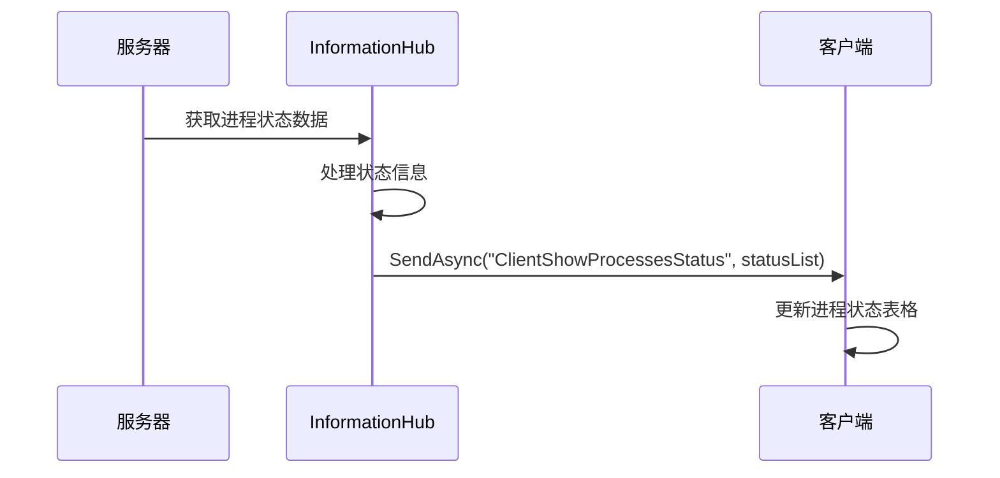
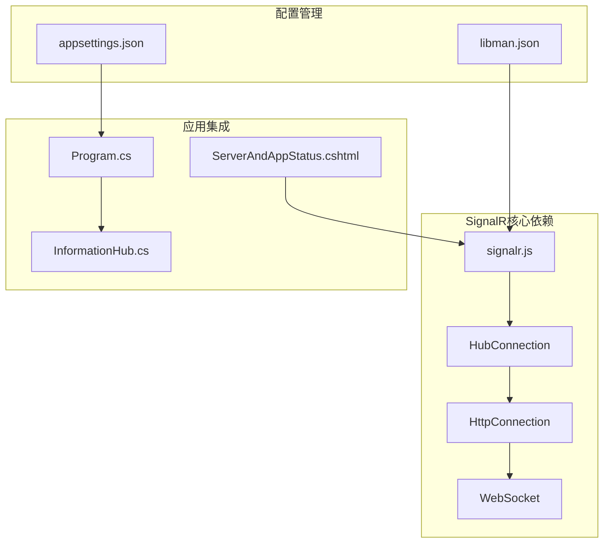
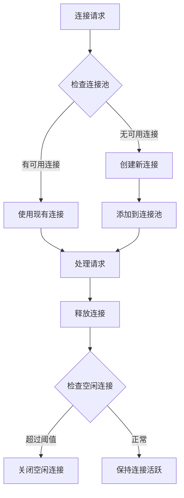
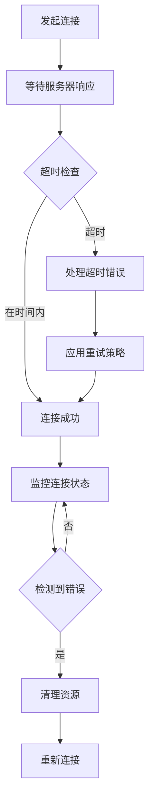

# 客户端连接管理

<cite>
**本文档引用的文件**
- [InformationHub.cs](file://Sylas.RemoteTasks.App/Hubs/InformationHub.cs)
- [Program.cs](file://Sylas.RemoteTasks.App/Program.cs)
- [ServerAndAppStatus.cshtml](file://Sylas.RemoteTasks.App/Views/Hosts/ServerAndAppStatus.cshtml)
- [HostsController.cs](file://Sylas.RemoteTasks.App/Controllers/HostsController.cs)
- [signalr.js](file://Sylas.RemoteTasks.App/wwwroot/lib/signalr/dist/browser/signalr.js)
- [anything.js](file://Sylas.RemoteTasks.App/wwwroot/js/anything.js)
- [site.js](file://Sylas.RemoteTasks.App/wwwroot/js/site.js)
- [appsettings.json](file://Sylas.RemoteTasks.App/appsettings.json)
- [libman.json](file://Sylas.RemoteTasks.App/libman.json)
</cite>

## 目录
1. [简介](#简介)
2. [项目结构](#项目结构)
3. [核心组件](#核心组件)
4. [架构概览](#架构概览)
5. [详细组件分析](#详细组件分析)
6. [依赖关系分析](#依赖关系分析)
7. [性能考虑](#性能考虑)
8. [故障排除指南](#故障排除指南)
9. [结论](#结论)

## 简介

本文档深入分析了Sylas.RemoteTasks项目中的SignalR客户端连接管理系统。该项目实现了基于SignalR的实时双向通信功能，主要包含服务器状态监控和命令执行两大核心场景。

系统采用ASP.NET Core SignalR框架，结合JavaScript客户端实现动态连接管理、事件通信协议和状态维护。客户端通过SignalR Hub与服务器建立持久连接，实现实时数据推送和命令执行反馈。

## 项目结构

项目采用典型的ASP.NET Core MVC架构，SignalR相关组件分布如下：

**图表来源**
- [Program.cs](file://Sylas.RemoteTasks.App/Program.cs#L38-L119)
- [ServerAndAppStatus.cshtml](file://Sylas.RemoteTasks.App/Views/Hosts/ServerAndAppStatus.cshtml#L36-L75)

**章节来源**
- [Program.cs](file://Sylas.RemoteTasks.App/Program.cs#L1-L122)
- [libman.json](file://Sylas.RemoteTasks.App/libman.json#L1-L14)

## 核心组件

### SignalR Hub连接管理

系统实现了专门的InformationHub用于服务器状态监控，支持动态启动/停止进程状态收集。

### JavaScript客户端实现

客户端通过统一的JavaScript模块管理连接生命周期，包括连接建立、事件监听、错误处理和重连机制。

### 事件通信协议

系统定义了标准化的事件名称约定和消息格式规范，确保客户端与服务器之间的可靠通信。

**章节来源**
- [InformationHub.cs](file://Sylas.RemoteTasks.App/Hubs/InformationHub.cs#L11-L59)
- [site.js](file://Sylas.RemoteTasks.App/wwwroot/js/site.js#L703-L774)

## 架构概览

系统采用客户端-服务器双向通信架构，通过SignalR实现低延迟的实时数据传输。

**图表来源**
- [ServerAndAppStatus.cshtml](file://Sylas.RemoteTasks.App/Views/Hosts/ServerAndAppStatus.cshtml#L42-L75)
- [InformationHub.cs](file://Sylas.RemoteTasks.App/Hubs/InformationHub.cs#L14-L56)

## 详细组件分析

### SignalR Hub连接建立过程

#### 连接初始化流程

**图表来源**
- [ServerAndAppStatus.cshtml](file://Sylas.RemoteTasks.App/Views/Hosts/ServerAndAppStatus.cshtml#L42-L75)

#### 连接状态维护机制

系统实现了完整的连接状态管理，包括连接建立、保持活跃和断开清理：

**章节来源**
- [InformationHub.cs](file://Sylas.RemoteTasks.App/Hubs/InformationHub.cs#L14-L56)
- [signalr.js](file://Sylas.RemoteTasks.App/wwwroot/lib/signalr/dist/browser/signalr.js#L1174-L1190)

### 断开连接处理机制

#### 自动重连策略

**图表来源**
- [signalr.js](file://Sylas.RemoteTasks.App/wwwroot/lib/signalr/dist/browser/signalr.js#L1847-L1906)

#### 断开清理流程

**章节来源**
- [InformationHub.cs](file://Sylas.RemoteTasks.App/Hubs/InformationHub.cs#L51-L56)
- [signalr.js](file://Sylas.RemoteTasks.App/wwwroot/lib/signalr/dist/browser/signalr.js#L1828-L1846)

### 客户端事件通信协议

#### 事件名称约定

系统采用标准化的事件命名约定，确保客户端与服务器的一致性：

| 事件类型 | 事件名称 | 描述 |
|---------|----------|------|
| 推送事件 | ClientShowProcessesStatus | 服务器向客户端推送进程状态 |
| 调用事件 | StartGetProcessesStatus | 客户端请求服务器开始监控 |

#### 消息格式规范

**图表来源**
- [signalr.js](file://Sylas.RemoteTasks.App/wwwroot/lib/signalr/dist/browser/signalr.js#L3253-L3334)

#### 数据序列化方式

系统使用JSON格式进行数据序列化，支持复杂对象的传输：

**章节来源**
- [signalr.js](file://Sylas.RemoteTasks.App/wwwroot/lib/signalr/dist/browser/signalr.js#L3267-L3316)

### 客户端JavaScript实现

#### 连接初始化

客户端通过统一的初始化函数管理连接生命周期：

**图表来源**
- [ServerAndAppStatus.cshtml](file://Sylas.RemoteTasks.App/Views/Hosts/ServerAndAppStatus.cshtml#L42-L75)

#### 错误处理机制

系统实现了多层次的错误处理策略：

**章节来源**
- [site.js](file://Sylas.RemoteTasks.App/wwwroot/js/site.js#L703-L774)
- [signalr.js](file://Sylas.RemoteTasks.App/wwwroot/lib/signalr/dist/browser/signalr.js#L83-L216)

### 服务端与客户端双向通信

#### 服务器向客户端推送消息

**图表来源**
- [InformationHub.cs](file://Sylas.RemoteTasks.App/Hubs/InformationHub.cs#L20-L32)

#### 客户端向服务器发送指令

**章节来源**
- [ServerAndAppStatus.cshtml](file://Sylas.RemoteTasks.App/Views/Hosts/ServerAndAppStatus.cshtml#L66-L75)
- [HostsController.cs](file://Sylas.RemoteTasks.App/Controllers/HostsController.cs#L85-L124)

## 依赖关系分析

系统的关键依赖关系如下：

**图表来源**
- [Program.cs](file://Sylas.RemoteTasks.App/Program.cs#L38-L119)
- [libman.json](file://Sylas.RemoteTasks.App/libman.json#L4-L12)

**章节来源**
- [Program.cs](file://Sylas.RemoteTasks.App/Program.cs#L1-L122)
- [appsettings.json](file://Sylas.RemoteTasks.App/appsettings.json#L122-L124)

## 性能考虑

### 连接池管理

系统通过以下机制优化连接性能：

1. **连接复用**: 单个HubConnection实例可重复使用
2. **自动重连**: 智能重连策略减少连接中断影响
3. **心跳机制**: 默认15秒保活间隔确保连接稳定

### 并发连接控制

### 资源清理最佳实践

**章节来源**
- [InformationHub.cs](file://Sylas.RemoteTasks.App/Hubs/InformationHub.cs#L51-L56)
- [signalr.js](file://Sylas.RemoteTasks.App/wwwroot/lib/signalr/dist/browser/signalr.js#L1828-L1846)

## 故障排除指南

### 连接超时处理

系统提供了完善的超时处理机制：

### 网络异常恢复

**章节来源**
- [signalr.js](file://Sylas.RemoteTasks.App/wwwroot/lib/signalr/dist/browser/signalr.js#L1847-L1906)
- [ServerAndAppStatus.cshtml](file://Sylas.RemoteTasks.App/Views/Hosts/ServerAndAppStatus.cshtml#L73-L75)

### 性能监控实现

系统内置了详细的日志记录和性能监控：

**章节来源**
- [InformationHub.cs](file://Sylas.RemoteTasks.App/Hubs/InformationHub.cs#L51-L56)
- [signalr.js](file://Sylas.RemoteTasks.App/wwwroot/lib/signalr/dist/browser/signalr.js#L274-L290)

## 结论

Sylas.RemoteTasks项目的SignalR客户端连接管理系统展现了现代Web应用的实时通信最佳实践。系统通过精心设计的架构实现了：

1. **可靠的连接管理**: 完整的连接生命周期管理和自动重连机制
2. **高效的双向通信**: 基于SignalR的低延迟实时数据传输
3. **健壮的错误处理**: 多层次的异常捕获和恢复策略
4. **优秀的性能表现**: 优化的连接池管理和资源清理机制

该系统为类似的企业级应用提供了完整的SignalR客户端连接管理解决方案，具有良好的扩展性和维护性。