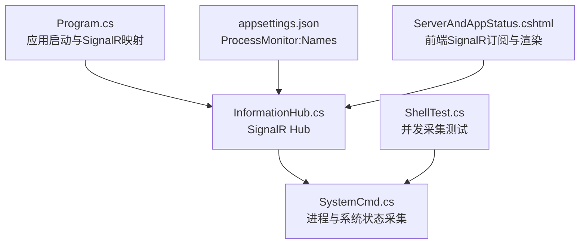
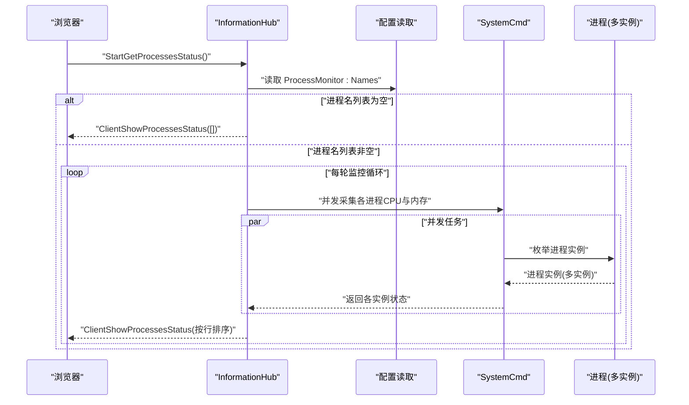
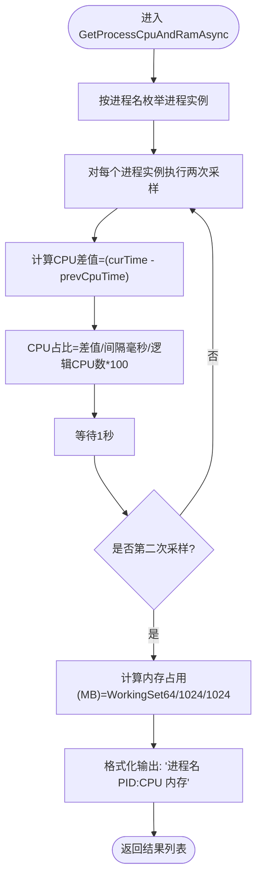
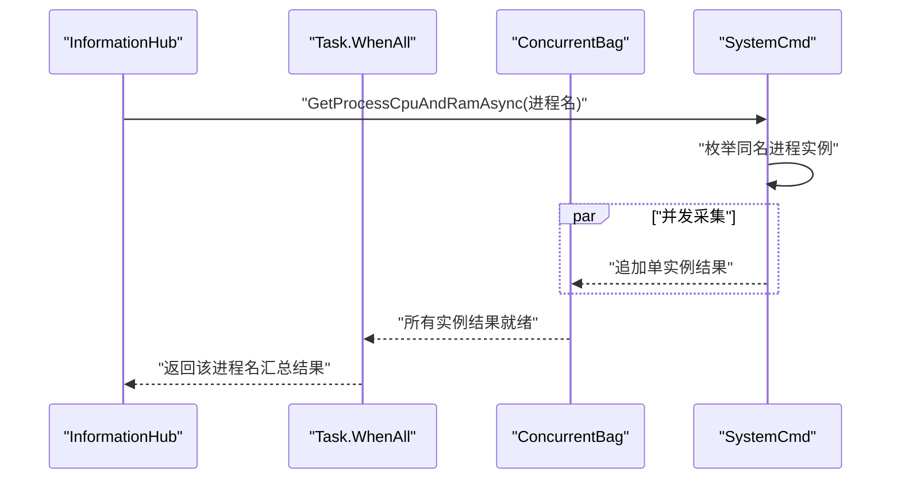
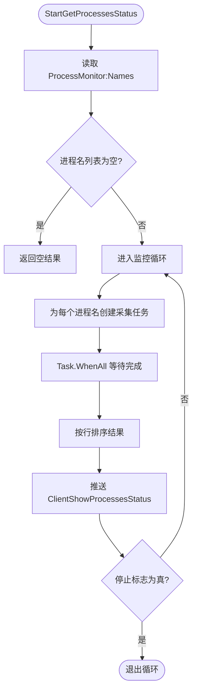
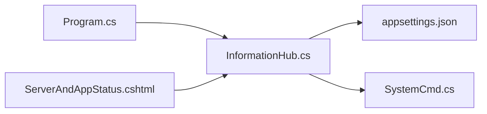

# 进程监控

<cite>
**本文引用的文件**
- [Program.cs](file://Sylas.RemoteTasks.App/Program.cs)
- [InformationHub.cs](file://Sylas.RemoteTasks.App/Hubs/InformationHub.cs)
- [SystemCmd.cs](file://Sylas.RemoteTasks.Utils/CommandExecutor/SystemCmd.cs)
- [appsettings.json](file://Sylas.RemoteTasks.App/appsettings.json)
- [ServerAndAppStatus.cshtml](file://Sylas.RemoteTasks.App/Views/Hosts/ServerAndAppStatus.cshtml)
- [ShellTest.cs](file://Sylas.RemoteTasks.Test/SystemHelperTest/ShellTest.cs)
- [LoggerHelper.cs](file://Sylas.RemoteTasks.Common/LoggerHelper.cs)
</cite>

## 目录
1. [简介](#简介)
2. [项目结构](#项目结构)
3. [核心组件](#核心组件)
4. [架构总览](#架构总览)
5. [详细组件分析](#详细组件分析)
6. [依赖关系分析](#依赖关系分析)
7. [性能考虑](#性能考虑)
8. [故障排查指南](#故障排查指南)
9. [结论](#结论)

## 简介
本文件围绕进程监控功能展开，系统性阐述以下方面：
- 进程状态获取的实现原理：CPU 与内存占用的计算方法、系统调用封装与数据采集频率控制
- 并发进程监控机制：Task.WhenAll 的使用、ConcurrentBag 的线程安全保证、异步任务管理
- 进程配置管理：appsettings.json 中 ProcessMonitor:Names 配置项的读取与解析
- 监控循环的实现逻辑：无限循环控制、停止条件判断、资源释放机制
- 进程状态数据的格式化与排序处理
- 监控性能优化策略、内存使用控制与异常处理方案

## 项目结构
与进程监控直接相关的模块分布如下：
- 应用入口与 SignalR 映射：在应用启动时注册并映射 Hub
- 信号通道（Hub）：负责接收前端请求、拉取进程状态、推送结果
- 系统命令执行器：封装进程与系统状态采集逻辑
- 配置文件：定义被监控进程名称集合
- 视图页面：前端通过 SignalR 订阅并渲染进程状态表格
- 测试用例：验证并发采集与聚合流程

**图表来源**
- [Program.cs](file://Sylas.RemoteTasks.App/Program.cs#L119-L121)
- [InformationHub.cs](file://Sylas.RemoteTasks.App/Hubs/InformationHub.cs#L11-L59)
- [SystemCmd.cs](file://Sylas.RemoteTasks.Utils/CommandExecutor/SystemCmd.cs#L386-L417)
- [appsettings.json](file://Sylas.RemoteTasks.App/appsettings.json#L122-L124)
- [ServerAndAppStatus.cshtml](file://Sylas.RemoteTasks.App/Views/Hosts/ServerAndAppStatus.cshtml#L42-L76)
- [ShellTest.cs](file://Sylas.RemoteTasks.Test/SystemHelperTest/ShellTest.cs#L84-L100)

**章节来源**
- [Program.cs](file://Sylas.RemoteTasks.App/Program.cs#L119-L121)
- [InformationHub.cs](file://Sylas.RemoteTasks.App/Hubs/InformationHub.cs#L11-L59)
- [SystemCmd.cs](file://Sylas.RemoteTasks.Utils/CommandExecutor/SystemCmd.cs#L386-L417)
- [appsettings.json](file://Sylas.RemoteTasks.App/appsettings.json#L122-L124)
- [ServerAndAppStatus.cshtml](file://Sylas.RemoteTasks.App/Views/Hosts/ServerAndAppStatus.cshtml#L42-L76)
- [ShellTest.cs](file://Sylas.RemoteTasks.Test/SystemHelperTest/ShellTest.cs#L84-L100)

## 核心组件
- SignalR Hub（InformationHub）
  - 负责接收前端 StartGetProcessesStatus 请求
  - 从配置读取被监控进程名称列表
  - 并发采集各进程 CPU 与内存状态，排序后推送给前端
  - 断开连接时触发停止条件
- 系统命令执行器（SystemCmd）
  - 通过进程枚举与时间差法计算 CPU 占用率
  - 通过 WorkingSet64 计算内存占用（MB）
  - 提供系统整体状态采集能力（CPU 使用率、内存总量/使用量等）
- 配置管理（appsettings.json）
  - ProcessMonitor:Names 定义监控进程名数组
- 前端页面（ServerAndAppStatus.cshtml）
  - 建立 SignalR 连接，订阅 ClientShowProcessesStatus 事件，渲染表格

**章节来源**
- [InformationHub.cs](file://Sylas.RemoteTasks.App/Hubs/InformationHub.cs#L11-L59)
- [SystemCmd.cs](file://Sylas.RemoteTasks.Utils/CommandExecutor/SystemCmd.cs#L386-L417)
- [SystemCmd.cs](file://Sylas.RemoteTasks.Utils/CommandExecutor/SystemCmd.cs#L625-L625)
- [appsettings.json](file://Sylas.RemoteTasks.App/appsettings.json#L122-L124)
- [ServerAndAppStatus.cshtml](file://Sylas.RemoteTasks.App/Views/Hosts/ServerAndAppStatus.cshtml#L42-L76)

## 架构总览
下图展示了从浏览器到后端 Hub，再到系统命令执行器的完整调用链路。

**图表来源**
- [InformationHub.cs](file://Sylas.RemoteTasks.App/Hubs/InformationHub.cs#L14-L37)
- [SystemCmd.cs](file://Sylas.RemoteTasks.Utils/CommandExecutor/SystemCmd.cs#L386-L417)
- [appsettings.json](file://Sylas.RemoteTasks.App/appsettings.json#L122-L124)

## 详细组件分析

### 进程状态采集与计算方法
- CPU 占用率计算
  - 采用两次采样间隔 TotalProcessorTime 的差值，除以间隔毫秒数、逻辑 CPU 数量，再乘以 100 得到百分比
  - 采集间隔固定为 1 秒，两次采样后才输出结果，避免首次采样无意义
- 内存占用计算
  - 通过 WorkingSet64（字节）转换为 MB 并四舍五入取整
- 数据格式
  - 返回字符串格式："进程名 PID:CPU占用 内存占用(MB)"

**图表来源**
- [SystemCmd.cs](file://Sylas.RemoteTasks.Utils/CommandExecutor/SystemCmd.cs#L386-L417)
- [SystemCmd.cs](file://Sylas.RemoteTasks.Utils/CommandExecutor/SystemCmd.cs#L625-L625)

**章节来源**
- [SystemCmd.cs](file://Sylas.RemoteTasks.Utils/CommandExecutor/SystemCmd.cs#L386-L417)
- [SystemCmd.cs](file://Sylas.RemoteTasks.Utils/CommandExecutor/SystemCmd.cs#L625-L625)

### 并发进程监控机制
- 并发策略
  - 对每个进程名创建一个异步任务，使用 Task.WhenAll 并发等待所有任务完成
  - 每个进程名内部对同名所有进程实例并行采集
- 线程安全
  - 使用 ConcurrentBag 存储中间结果，确保多任务并发追加的安全性
- 异步任务管理
  - 每轮循环创建新任务列表，完成后统一等待，避免任务堆积
  - 通过断开连接事件设置停止标志，退出监控循环

**图表来源**
- [InformationHub.cs](file://Sylas.RemoteTasks.App/Hubs/InformationHub.cs#L25-L31)
- [InformationHub.cs](file://Sylas.RemoteTasks.App/Hubs/InformationHub.cs#L39-L47)
- [SystemCmd.cs](file://Sylas.RemoteTasks.Utils/CommandExecutor/SystemCmd.cs#L386-L417)

**章节来源**
- [InformationHub.cs](file://Sylas.RemoteTasks.App/Hubs/InformationHub.cs#L25-L31)
- [InformationHub.cs](file://Sylas.RemoteTasks.App/Hubs/InformationHub.cs#L39-L47)
- [SystemCmd.cs](file://Sylas.RemoteTasks.Utils/CommandExecutor/SystemCmd.cs#L386-L417)

### 进程配置管理
- 配置项位置
  - ProcessMonitor:Names：字符串数组，定义被监控的进程名集合
- 读取与解析
  - Hub 中通过 IConfiguration 读取该配置段，转为 List<string>
  - 若为空或长度为 0，则直接返回空结果

**章节来源**
- [appsettings.json](file://Sylas.RemoteTasks.App/appsettings.json#L122-L124)
- [InformationHub.cs](file://Sylas.RemoteTasks.App/Hubs/InformationHub.cs#L17-L22)

### 监控循环实现逻辑
- 无限循环控制
  - 使用 while (true) 实现持续监控
- 停止条件判断
  - OnDisconnectedAsync 中将停止标志置为 true，当轮询结束时检查并退出
- 资源释放机制
  - 每轮循环使用局部 ConcurrentBag，避免跨轮内存累积
  - 任务列表在每轮结束后自然回收，减少长生命周期对象持有

**图表来源**
- [InformationHub.cs](file://Sylas.RemoteTasks.App/Hubs/InformationHub.cs#L14-L37)
- [InformationHub.cs](file://Sylas.RemoteTasks.App/Hubs/InformationHub.cs#L51-L56)

**章节来源**
- [InformationHub.cs](file://Sylas.RemoteTasks.App/Hubs/InformationHub.cs#L14-L37)
- [InformationHub.cs](file://Sylas.RemoteTasks.App/Hubs/InformationHub.cs#L51-L56)

### 进程状态数据的格式化与排序处理
- 格式化
  - 返回字符串格式："进程名 PID:CPU占用 内存占用(MB)"
- 排序
  - 每轮推送前对结果进行按行排序，保证前端展示稳定有序

**章节来源**
- [SystemCmd.cs](file://Sylas.RemoteTasks.Utils/CommandExecutor/SystemCmd.cs#L413-L413)
- [InformationHub.cs](file://Sylas.RemoteTasks.App/Hubs/InformationHub.cs#L32-L32)

### 前端集成与展示
- 建立 SignalR 连接并订阅 ClientShowProcessesStatus 事件
- 解析返回的字符串，拆分为进程名、CPU、内存三列，动态渲染表格

**章节来源**
- [ServerAndAppStatus.cshtml](file://Sylas.RemoteTasks.App/Views/Hosts/ServerAndAppStatus.cshtml#L42-L76)
- [ServerAndAppStatus.cshtml](file://Sylas.RemoteTasks.App/Views/Hosts/ServerAndAppStatus.cshtml#L48-L64)

## 依赖关系分析
- Program.cs 将 Hub 映射到 /informationHub，使前端可连接
- InformationHub 依赖 IConfiguration 读取配置，并调用 SystemCmd 执行采集
- SystemCmd 依赖 .NET Process API 与系统命令执行能力
- 前端通过 SignalR JavaScript SDK 订阅 Hub 事件

**图表来源**
- [Program.cs](file://Sylas.RemoteTasks.App/Program.cs#L119-L121)
- [InformationHub.cs](file://Sylas.RemoteTasks.App/Hubs/InformationHub.cs#L11-L59)
- [SystemCmd.cs](file://Sylas.RemoteTasks.Utils/CommandExecutor/SystemCmd.cs#L386-L417)
- [appsettings.json](file://Sylas.RemoteTasks.App/appsettings.json#L122-L124)
- [ServerAndAppStatus.cshtml](file://Sylas.RemoteTasks.App/Views/Hosts/ServerAndAppStatus.cshtml#L42-L76)

**章节来源**
- [Program.cs](file://Sylas.RemoteTasks.App/Program.cs#L119-L121)
- [InformationHub.cs](file://Sylas.RemoteTasks.App/Hubs/InformationHub.cs#L11-L59)
- [SystemCmd.cs](file://Sylas.RemoteTasks.Utils/CommandExecutor/SystemCmd.cs#L386-L417)
- [appsettings.json](file://Sylas.RemoteTasks.App/appsettings.json#L122-L124)
- [ServerAndAppStatus.cshtml](file://Sylas.RemoteTasks.App/Views/Hosts/ServerAndAppStatus.cshtml#L42-L76)

## 性能考虑
- 并发采集
  - 使用 Task.WhenAll 并发处理多个进程名，显著降低整体轮询延迟
- 采样频率
  - CPU 采样间隔为 1 秒，兼顾精度与开销；可根据需求调整
- 内存控制
  - 每轮使用局部 ConcurrentBag，避免跨轮内存累积
  - 结果在推送前一次性排序，减少前端重复处理
- I/O 与系统命令
  - SystemCmd 通过系统命令与进程 API 采集，注意在高负载场景下的系统调用成本
- 日志与诊断
  - 使用 LoggerHelper 输出关键信息，便于定位性能瓶颈

**章节来源**
- [InformationHub.cs](file://Sylas.RemoteTasks.App/Hubs/InformationHub.cs#L25-L31)
- [SystemCmd.cs](file://Sylas.RemoteTasks.Utils/CommandExecutor/SystemCmd.cs#L386-L417)
- [LoggerHelper.cs](file://Sylas.RemoteTasks.Common/LoggerHelper.cs#L16-L39)

## 故障排查指南
- 配置问题
  - 确认 appsettings.json 中 ProcessMonitor:Names 是否存在且非空
  - 若为空，Hub 将直接返回空结果
- 进程不存在
  - 当进程名不存在时，枚举结果为空，不会抛出异常，但也不会产生任何数据
- 并发异常
  - ConcurrentBag 为线程安全集合，一般不会出现并发写入异常
  - 若出现异常，检查 SystemCmd 的内部逻辑与外部调用方的异常处理
- 连接中断
  - 断开连接时 Hub 会设置停止标志，监控循环会在本轮结束后退出
- 前端无数据
  - 检查 SignalR 连接是否成功建立，确认事件名称 ClientShowProcessesStatus 是否一致
  - 检查前端解析逻辑是否正确拆分字符串并渲染表格

**章节来源**
- [InformationHub.cs](file://Sylas.RemoteTasks.App/Hubs/InformationHub.cs#L17-L22)
- [InformationHub.cs](file://Sylas.RemoteTasks.App/Hubs/InformationHub.cs#L51-L56)
- [ServerAndAppStatus.cshtml](file://Sylas.RemoteTasks.App/Views/Hosts/ServerAndAppStatus.cshtml#L42-L76)
- [ShellTest.cs](file://Sylas.RemoteTasks.Test/SystemHelperTest/ShellTest.cs#L84-L100)

## 结论
本进程监控方案通过 SignalR 实现实时推送，结合 SystemCmd 的进程与系统状态采集能力，实现了对指定进程的并发监控。其核心优势在于：
- 利用 Task.WhenAll 与 ConcurrentBag 实现高效、线程安全的并发采集
- 通过配置驱动灵活管理被监控进程集合
- 以简单稳定的字符串格式输出，便于前端快速渲染
- 在断开连接时自动停止，避免资源泄露

建议在生产环境中结合日志与监控指标进一步优化采样频率与异常处理策略，确保在高并发与复杂环境下保持稳定与低开销。