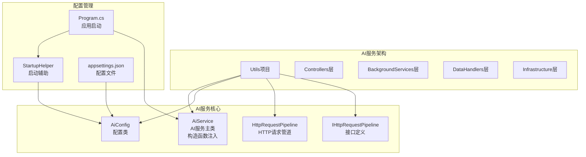
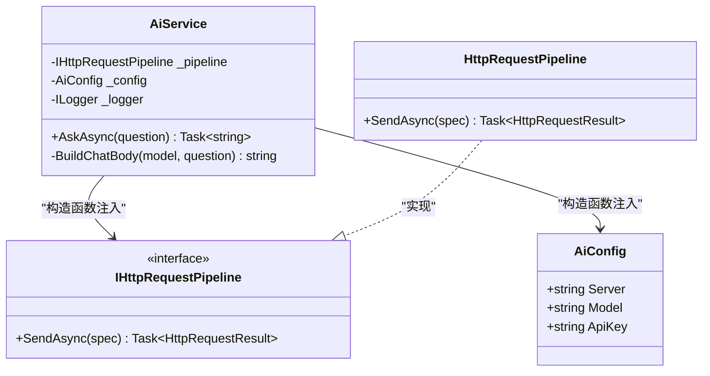
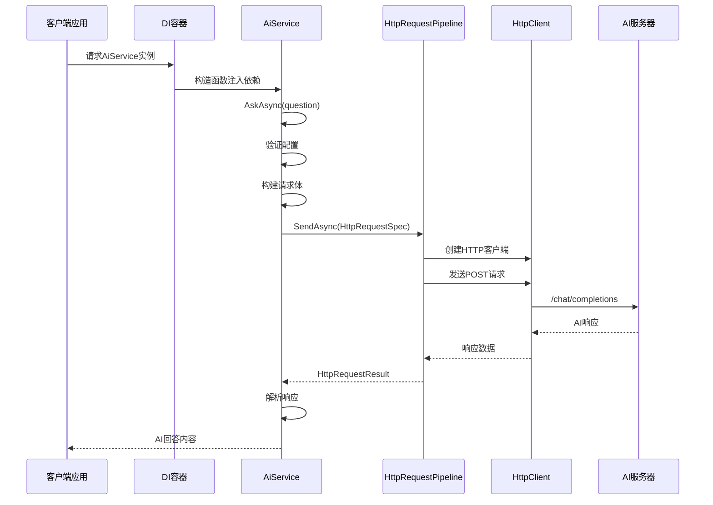
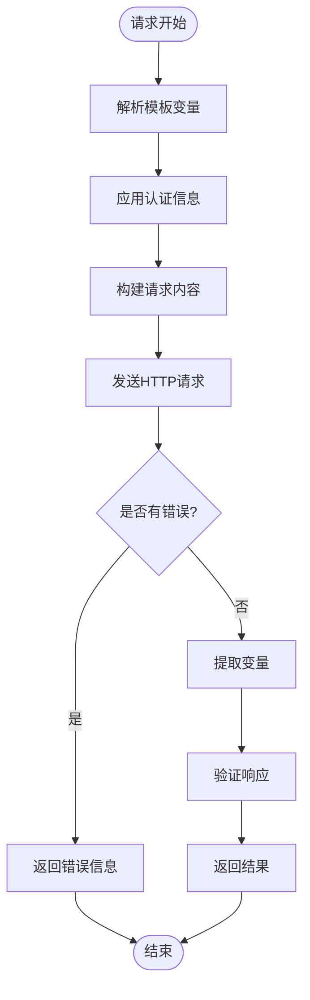
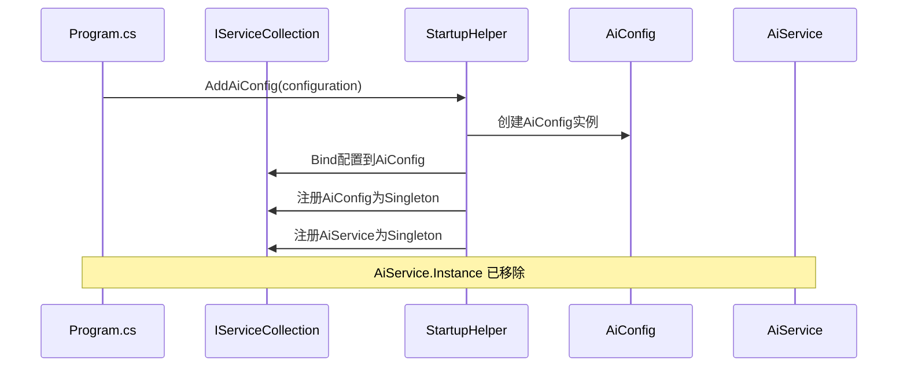

# AI服务

<cite>
**本文档引用的文件**
- [AiService.cs](file://Sylas.RemoteTasks.Utils/AiService.cs)
- [AiConfig.cs](file://Sylas.RemoteTasks.Utils/Dtos/AiConfig.cs)
- [Program.cs](file://Sylas.RemoteTasks.App/Program.cs)
- [appsettings.json](file://Sylas.RemoteTasks.App/appsettings.json)
- [StartupHelper.cs](file://Sylas.RemoteTasks.App/Helpers/StartupHelper.cs)
- [IHttpRequestPipeline.cs](file://Sylas.RemoteTasks.Utils/CommandExecutor/Http/IHttpRequestPipeline.cs)
- [HttpRequestPipeline.cs](file://Sylas.RemoteTasks.Utils/CommandExecutor/Http/HttpRequestPipeline.cs)
- [FileHelper.cs](file://Sylas.RemoteTasks.Utils/CommandExecutor/FileHelper.cs)
- [TestFixture.cs](file://Sylas.RemoteTasks.Test/TestFixture.cs)
</cite>

## 更新摘要
**变更内容**
- 移除AiService静态Instance属性，采用标准依赖注入模式
- 更新构造函数注入方式，支持IHttpRequestPipeline、AiConfig、ILogger参数
- 重构生命周期管理，采用Singleton注册模式
- 更新使用示例，展示标准DI容器使用方式

## 目录
1. [简介](#简介)
2. [项目结构](#项目结构)
3. [核心组件](#核心组件)
4. [架构概览](#架构概览)
5. [详细组件分析](#详细组件分析)
6. [依赖关系分析](#依赖关系分析)
7. [性能考虑](#性能考虑)
8. [故障排除指南](#故障排除指南)
9. [结论](#结论)

## 简介

AI服务是Sylas.RemoteTasks项目中的重要功能模块，提供基于HTTP的AI模型调用能力。该服务允许应用程序通过配置化的AI服务器和模型来执行问答任务，支持多种AI提供商的兼容接口。

**更新** 服务已重构为标准依赖注入模式，移除了静态Instance属性，采用构造函数注入方式，提供更规范的依赖管理和服务生命周期控制。

该服务采用依赖注入模式设计，通过HTTP请求管道实现与AI服务的通信，并提供了灵活的配置管理和错误处理机制。重构后的服务完全符合现代.NET应用的最佳实践，支持标准的DI容器集成。

## 项目结构

AI服务位于Sylas.RemoteTasks.Utils项目中，采用清晰的分层架构设计：



**图表来源**
- [AiService.cs:14](file://Sylas.RemoteTasks.Utils/AiService.cs#L14)
- [Program.cs:43](file://Sylas.RemoteTasks.App/Program.cs#L43)
- [StartupHelper.cs:77-85](file://Sylas.RemoteTasks.App/Helpers/StartupHelper.cs#L77-L85)

**章节来源**
- [AiService.cs:1-79](file://Sylas.RemoteTasks.Utils/AiService.cs#L1-L79)
- [Program.cs:1-132](file://Sylas.RemoteTasks.App/Program.cs#L1-L132)
- [StartupHelper.cs:77-85](file://Sylas.RemoteTasks.App/Helpers/StartupHelper.cs#L77-L85)

## 核心组件

### AiService - AI服务主类

**更新** AiService已重构为标准依赖注入模式，移除了静态Instance属性，采用构造函数注入方式：



**图表来源**
- [AiService.cs:14-79](file://Sylas.RemoteTasks.Utils/AiService.cs#L14-L79)
- [AiConfig.cs:6-21](file://Sylas.RemoteTasks.Utils/Dtos/AiConfig.cs#L6-L21)
- [IHttpRequestPipeline.cs:11-18](file://Sylas.RemoteTasks.Utils/CommandExecutor/Http/IHttpRequestPipeline.cs#L11-L18)

### 配置系统

AI服务的配置通过AiConfig类管理，支持服务器地址、模型名称和API密钥的配置：

| 配置项 | 类型 | 描述 | 默认值 |
|--------|------|------|--------|
| Server | string | AI服务器地址 | 空字符串 |
| Model | string | 使用的大模型名称 | 空字符串 |
| ApiKey | string | API访问密钥 | 空字符串 |

**章节来源**
- [AiConfig.cs:1-22](file://Sylas.RemoteTasks.Utils/Dtos/AiConfig.cs#L1-L22)
- [appsettings.json:44-49](file://Sylas.RemoteTasks.App/appsettings.json#L44-L49)

## 架构概览

**更新** AI服务采用重构后的标准依赖注入架构，通过构造函数注入实现松耦合：



**图表来源**
- [AiService.cs:26-59](file://Sylas.RemoteTasks.Utils/AiService.cs#L26-L59)
- [HttpRequestPipeline.cs:31-148](file://Sylas.RemoteTasks.Utils/CommandExecutor/Http/HttpRequestPipeline.cs#L31-L148)

## 详细组件分析

### HTTP请求管道

HttpRequestPipeline实现了IHttpRequestPipeline接口，提供完整的HTTP请求处理流程：



**图表来源**
- [HttpRequestPipeline.cs:31-148](file://Sylas.RemoteTasks.Utils/CommandExecutor/Http/HttpRequestPipeline.cs#L31-L148)

### 配置注册流程

**更新** 应用启动时通过StartupHelper完成AI服务的配置注册，采用标准依赖注入模式：



**图表来源**
- [StartupHelper.cs:77-85](file://Sylas.RemoteTasks.App/Helpers/StartupHelper.cs#L77-L85)
- [Program.cs:26](file://Sylas.RemoteTasks.App/Program.cs#L26)

**章节来源**
- [HttpRequestPipeline.cs:1-532](file://Sylas.RemoteTasks.Utils/CommandExecutor/Http/HttpRequestPipeline.cs#L1-L532)
- [StartupHelper.cs:77-85](file://Sylas.RemoteTasks.App/Helpers/StartupHelper.cs#L77-L85)

### 使用示例

**更新** 展示重构后的标准依赖注入使用方式：

#### 在控制器中使用
```csharp
public class MyController : ControllerBase
{
    private readonly AiService _aiService;
    
    public MyController(AiService aiService)
    {
        _aiService = aiService;
    }
    
    public async Task<IActionResult> AskQuestion(string question)
    {
        var answer = await _aiService.AskAsync(question);
        return Ok(answer);
    }
}
```

#### 在其他服务中使用
```csharp
public class FileHelper(AiService aiService) : ICommandExecutor
{
    // 使用注入的AiService实例
    public async Task ProcessFileAsync(string filePath)
    {
        var content = await File.ReadAllTextAsync(filePath);
        var answer = await aiService.AskAsync($"分析文件内容: {content}");
        // 处理AI回答...
    }
}
```

**章节来源**
- [FileHelper.cs:27-28](file://Sylas.RemoteTasks.Utils/CommandExecutor/FileHelper.cs#L27-L28)
- [TestFixture.cs:60](file://Sylas.RemoteTasks.Test/TestFixture.cs#L60)

### 错误处理机制

AI服务提供了完善的错误处理机制：

| 错误类型 | 触发条件 | 处理方式 |
|----------|----------|----------|
| 配置错误 | Server或Model为空 | 抛出异常，提示配置不完整 |
| 网络错误 | HTTP请求失败 | 记录日志并抛出异常 |
| 响应格式错误 | JSON解析失败 | 抛出异常，提示响应格式异常 |
| 超时错误 | 请求超时 | 记录超时信息并返回错误 |

**章节来源**
- [AiService.cs:28-58](file://Sylas.RemoteTasks.Utils/AiService.cs#L28-L58)

## 依赖关系分析

**更新** AI服务的依赖关系已重构为标准依赖注入模式：

```mermaid
graph TB
subgraph "外部依赖"
HttpClient[System.Net.Http.HttpClient]
Newtonsoft[Newtonsoft.Json]
MicrosoftLogging[Microsoft.Extensions.Logging]
end
subgraph "内部依赖"
AiService[AiService<br/>构造函数注入]
HttpRequestPipeline[HttpRequestPipeline]
AiConfig[AiConfig]
IHttpRequestPipeline[IHttpRequestPipeline]
end
subgraph "配置依赖"
Program[Program.cs]
StartupHelper[StartupHelper]
AppSettings[appsettings.json]
end
AiService --> IHttpRequestPipeline : "构造函数注入"
AiService --> AiConfig : "构造函数注入"
HttpRequestPipeline --> HttpClient
HttpRequestPipeline --> Newtonsoft
HttpRequestPipeline --> MicrosoftLogging
Program --> StartupHelper
StartupHelper --> AppSettings
Program --> AiService
```

**图表来源**
- [AiService.cs:14](file://Sylas.RemoteTasks.Utils/AiService.cs#L14)
- [HttpRequestPipeline.cs:1-15](file://Sylas.RemoteTasks.Utils/CommandExecutor/Http/HttpRequestPipeline.cs#L1-L15)
- [Program.cs:43](file://Sylas.RemoteTasks.App/Program.cs#L43)

**章节来源**
- [AiService.cs:1-79](file://Sylas.RemoteTasks.Utils/AiService.cs#L1-L79)
- [HttpRequestPipeline.cs:1-532](file://Sylas.RemoteTasks.Utils/CommandExecutor/Http/HttpRequestPipeline.cs#L1-L532)

## 性能考虑

AI服务在设计时考虑了以下性能因素：

### 超时配置
- 默认超时时间为60秒
- AI调用设置为无限超时，适应长耗时的AI处理
- 支持自定义超时时间配置

### 连接管理
- 使用HttpClientFactory管理HTTP客户端生命周期
- 支持连接池复用，减少连接建立开销
- 异步操作避免阻塞线程

### 缓存策略
- 配置信息作为Singleton注册，避免重复创建
- 日志记录采用异步方式，减少I/O阻塞

## 故障排除指南

### 常见问题及解决方案

| 问题类型 | 症状 | 解决方案 |
|----------|------|----------|
| 配置错误 | 启动时报"AI配置不完整"错误 | 检查appsettings.json中的AiConfig配置 |
| 网络连接失败 | HTTP请求异常 | 验证AI服务器地址可达性 |
| 认证失败 | 401 Unauthorized | 检查ApiKey配置正确性 |
| 响应解析错误 | JSON解析异常 | 验证AI服务器返回格式 |
| 依赖注入错误 | 无法解析AiService | 确保在StartupHelper中正确注册服务 |

### 调试建议

1. **启用详细日志**：在appsettings.json中调整日志级别
2. **检查网络连接**：使用curl或浏览器测试AI服务器连通性
3. **验证配置文件**：确保AiConfig各项配置完整且正确
4. **监控HTTP请求**：使用网络抓包工具分析请求响应
5. **检查DI容器**：确认AiService已正确注册为Singleton

**章节来源**
- [AiService.cs:28-58](file://Sylas.RemoteTasks.Utils/AiService.cs#L28-L58)
- [appsettings.json:44-49](file://Sylas.RemoteTasks.App/appsettings.json#L44-L49)

## 结论

AI服务模块经过重构后展现了更好的软件工程实践，具有以下特点：

1. **标准依赖注入**：完全采用构造函数注入，移除静态实例，符合现代.NET最佳实践
2. **清晰的架构设计**：采用分层架构和依赖注入，实现了高内聚低耦合
3. **灵活的配置管理**：支持运行时配置和环境特定配置
4. **完善的错误处理**：提供了多层次的错误捕获和处理机制
5. **可扩展性**：接口设计支持未来扩展新的AI提供商
6. **性能优化**：合理的超时配置和连接管理策略
7. **测试友好**：支持单元测试和集成测试，便于验证服务行为

**更新** 重构后的AI服务模块为Sylas.RemoteTasks项目提供了更加规范和可靠的智能问答能力，通过标准化的依赖注入设计和完善的配置管理，为后续的功能扩展奠定了坚实基础。开发者现在可以使用标准的DI容器模式来使用AI服务，避免了静态依赖带来的测试和维护困难。