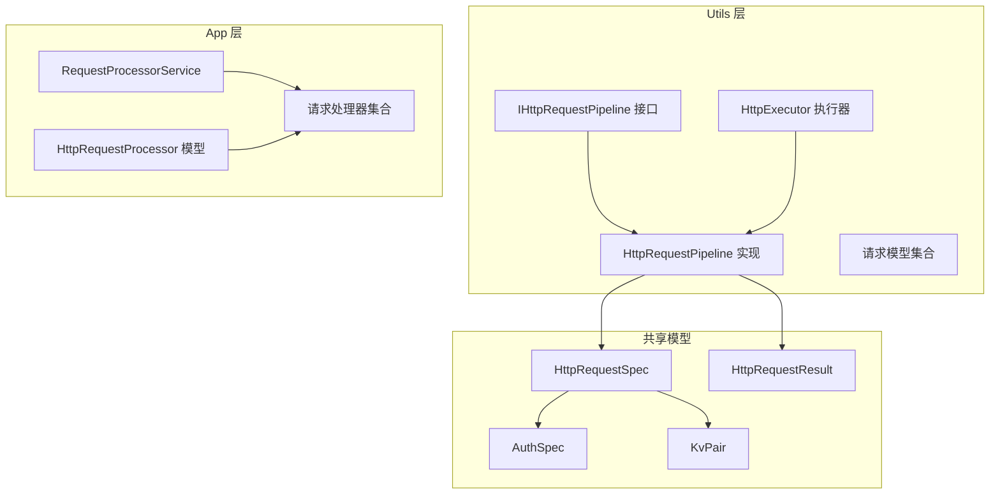
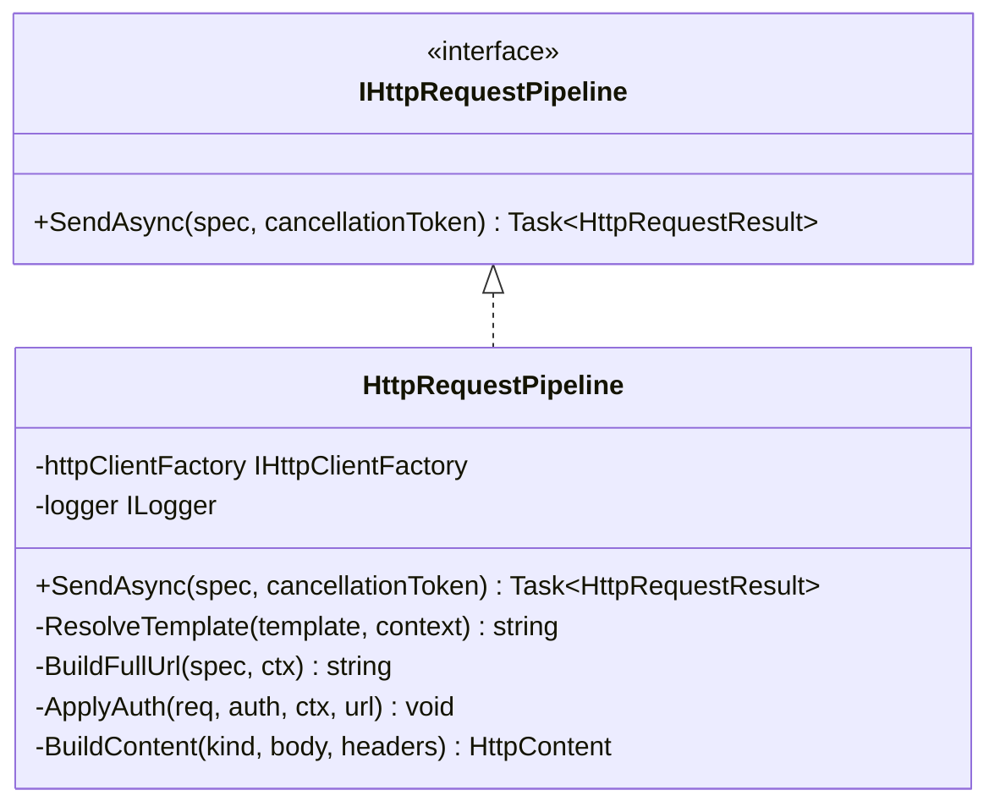
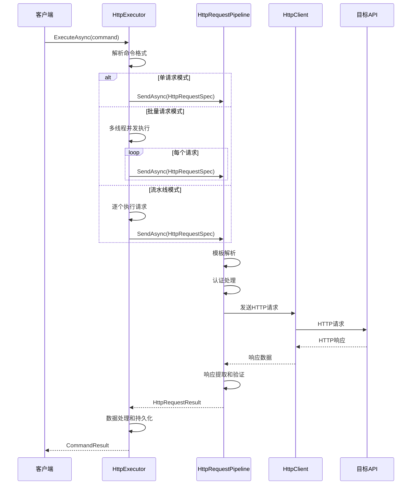
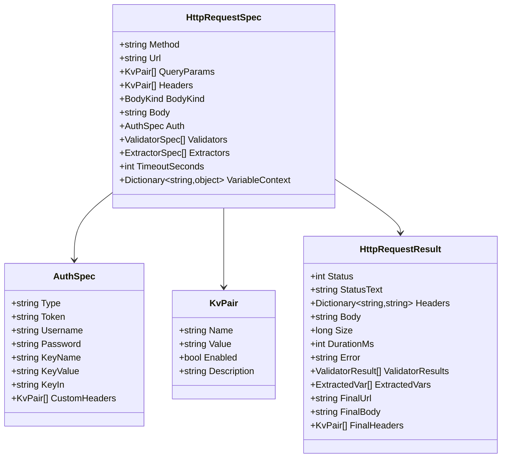
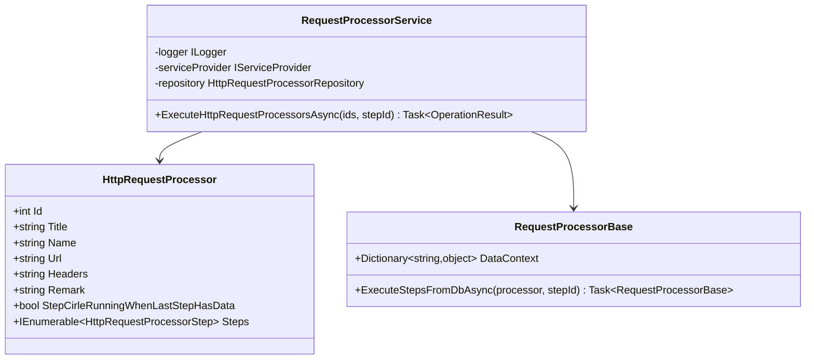
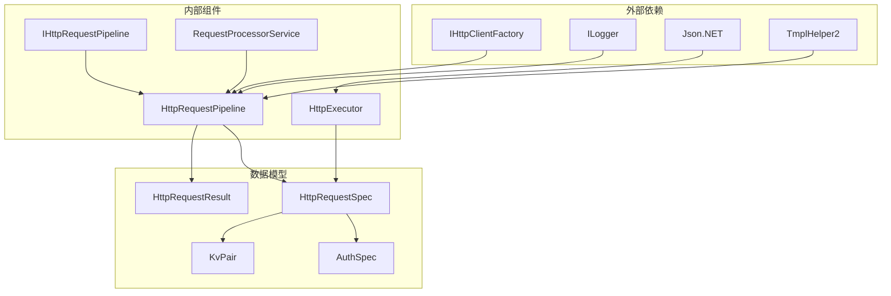

# HTTP 请求管道基础设施

<cite>
**本文档引用的文件**
- [IHttpRequestPipeline.cs](file://Sylas.RemoteTasks.Utils/CommandExecutor/Http/IHttpRequestPipeline.cs)
- [HttpRequestPipeline.cs](file://Sylas.RemoteTasks.Utils/CommandExecutor/Http/HttpRequestPipeline.cs)
- [HttpExecutor.cs](file://Sylas.RemoteTasks.Utils/CommandExecutor/HttpExecutor.cs)
- [HttpRequestSpec.cs](file://Sylas.RemoteTasks.Utils/CommandExecutor/Http/Models/HttpRequestSpec.cs)
- [AuthSpec.cs](file://Sylas.RemoteTasks.Utils/CommandExecutor/Http/Models/AuthSpec.cs)
- [BodyKind.cs](file://Sylas.RemoteTasks.Utils/CommandExecutor/Http/Models/BodyKind.cs)
- [KvPair.cs](file://Sylas.RemoteTasks.Utils/CommandExecutor/Http/Models/KvPair.cs)
- [HttpRequestResult.cs](file://Sylas.RemoteTasks.Utils/CommandExecutor/Http/Models/HttpRequestResult.cs)
- [ValidatorSpec.cs](file://Sylas.RemoteTasks.Utils/CommandExecutor/Http/Models/ValidatorSpec.cs)
- [ExtractorSpec.cs](file://Sylas.RemoteTasks.Utils/CommandExecutor/Http/Models/ExtractorSpec.cs)
- [ExtractedVar.cs](file://Sylas.RemoteTasks.Utils/CommandExecutor/Http/Models/ExtractedVar.cs)
- [ValidatorResult.cs](file://Sylas.RemoteTasks.Utils/CommandExecutor/Http/Models/ValidatorResult.cs)
- [HttpRequestDto.cs](file://Sylas.RemoteTasks.Utils/CommandExecutor/HttpRequestDto.cs)
- [RequestProcessorService.cs](file://Sylas.RemoteTasks.App/RequestProcessor/RequestProcessorService.cs)
- [HttpRequestProcessor.cs](file://Sylas.RemoteTasks.App/RequestProcessor/Models/HttpRequestProcessor.cs)
</cite>

## 目录
1. [简介](#简介)
2. [项目结构](#项目结构)
3. [核心组件](#核心组件)
4. [架构概览](#架构概览)
5. [详细组件分析](#详细组件分析)
6. [依赖关系分析](#依赖关系分析)
7. [性能考虑](#性能考虑)
8. [故障排除指南](#故障排除指南)
9. [结论](#结论)

## 简介

本文档深入分析了 Sylas.RemoteTasks 项目中的 HTTP 请求管道基础设施。该系统提供了完整的 HTTP 请求执行能力，包括模板解析、认证处理、请求构建、响应提取和验证等功能。系统采用模块化设计，支持单请求执行、批量请求执行和复杂的请求流水线处理。

该基础设施的核心目标是提供一个灵活、可扩展的 HTTP 请求执行框架，能够处理从简单 API 调用到复杂业务流程的各种场景。

## 项目结构

HTTP 请求管道基础设施主要分布在两个核心项目中：

**图表来源**
- [IHttpRequestPipeline.cs:1-19](file://Sylas.RemoteTasks.Utils/CommandExecutor/Http/IHttpRequestPipeline.cs#L1-L19)
- [HttpRequestPipeline.cs:1-145](file://Sylas.RemoteTasks.Utils/CommandExecutor/Http/HttpRequestPipeline.cs#L1-L145)
- [HttpExecutor.cs:1-258](file://Sylas.RemoteTasks.Utils/CommandExecutor/HttpExecutor.cs#L1-L258)

**章节来源**
- [IHttpRequestPipeline.cs:1-19](file://Sylas.RemoteTasks.Utils/CommandExecutor/Http/IHttpRequestPipeline.cs#L1-L19)
- [HttpRequestPipeline.cs:1-145](file://Sylas.RemoteTasks.Utils/CommandExecutor/Http/HttpRequestPipeline.cs#L1-L145)
- [HttpExecutor.cs:1-258](file://Sylas.RemoteTasks.Utils/CommandExecutor/HttpExecutor.cs#L1-L258)

## 核心组件

### HTTP 请求管道接口

IHttpRequestPipeline 定义了 HTTP 请求执行的核心接口，采用职责链模式设计：

**图表来源**
- [IHttpRequestPipeline.cs:11-17](file://Sylas.RemoteTasks.Utils/CommandExecutor/Http/IHttpRequestPipeline.cs#L11-L17)
- [HttpRequestPipeline.cs:17-145](file://Sylas.RemoteTasks.Utils/CommandExecutor/Http/HttpRequestPipeline.cs#L17-L145)

### HTTP 执行器

HttpExecutor 提供了多种执行模式：

1. **单请求执行**：适用于简单的 API 调用
2. **多线程批量执行**：支持压力测试场景
3. **请求流水线执行**：支持复杂的业务流程

**章节来源**
- [HttpExecutor.cs:20-102](file://Sylas.RemoteTasks.Utils/CommandExecutor/HttpExecutor.cs#L20-L102)
- [HttpExecutor.cs:109-140](file://Sylas.RemoteTasks.Utils/CommandExecutor/HttpExecutor.cs#L109-L140)
- [HttpExecutor.cs:148-255](file://Sylas.RemoteTasks.Utils/CommandExecutor/HttpExecutor.cs#L148-L255)

## 架构概览

HTTP 请求管道采用分层架构设计，实现了清晰的关注点分离：

**图表来源**
- [HttpExecutor.cs:29-102](file://Sylas.RemoteTasks.Utils/CommandExecutor/HttpExecutor.cs#L29-L102)
- [HttpRequestPipeline.cs:19-28](file://Sylas.RemoteTasks.Utils/CommandExecutor/Http/HttpRequestPipeline.cs#L19-L28)

## 详细组件分析

### 请求规格模型

HttpRequestSpec 是整个管道的核心数据模型，定义了完整的 HTTP 请求描述：

**图表来源**
- [HttpRequestSpec.cs:8-55](file://Sylas.RemoteTasks.Utils/CommandExecutor/Http/Models/HttpRequestSpec.cs#L8-L55)
- [AuthSpec.cs:8-47](file://Sylas.RemoteTasks.Utils/CommandExecutor/Http/Models/AuthSpec.cs#L8-L47)
- [KvPair.cs:6-28](file://Sylas.RemoteTasks.Utils/CommandExecutor/Http/Models/KvPair.cs#L6-L28)
- [HttpRequestResult.cs:8-70](file://Sylas.RemoteTasks.Utils/CommandExecutor/Http/Models/HttpRequestResult.cs#L8-L70)

### 认证处理机制

系统支持五种认证方式：

1. **无认证 (None)**：不添加任何认证信息
2. **Bearer Token**：支持 JWT 令牌认证
3. **Basic Auth**：标准 HTTP 基本身份验证
4. **API Key**：支持在头部或查询参数中传递
5. **自定义头部**：允许用户自定义任意请求头

**章节来源**
- [HttpRequestPipeline.cs:82-136](file://Sylas.RemoteTasks.Utils/CommandExecutor/Http/HttpRequestPipeline.cs#L82-L136)

### 请求构建流程

**图表来源**
- [HttpRequestPipeline.cs:19-145](file://Sylas.RemoteTasks.Utils/CommandExecutor/Http/HttpRequestPipeline.cs#L19-L145)

### 数据处理和持久化

RequestProcessorService 提供了基于数据库的请求处理器管理：

**图表来源**
- [RequestProcessorService.cs:7-72](file://Sylas.RemoteTasks.App/RequestProcessor/RequestProcessorService.cs#L7-L72)
- [HttpRequestProcessor.cs:9-22](file://Sylas.RemoteTasks.App/RequestProcessor/Models/HttpRequestProcessor.cs#L9-L22)

**章节来源**
- [RequestProcessorService.cs:11-69](file://Sylas.RemoteTasks.App/RequestProcessor/RequestProcessorService.cs#L11-L69)

## 依赖关系分析

系统采用松耦合的设计，通过接口和依赖注入实现模块间的解耦：

**图表来源**
- [HttpRequestPipeline.cs:17](file://Sylas.RemoteTasks.Utils/CommandExecutor/Http/HttpRequestPipeline.cs#L17)
- [HttpExecutor.cs:21](file://Sylas.RemoteTasks.Utils/CommandExecutor/HttpExecutor.cs#L21)
- [RequestProcessorService.cs:7-9](file://Sylas.RemoteTasks.App/RequestProcessor/RequestProcessorService.cs#L7-L9)

**章节来源**
- [HttpRequestPipeline.cs:17](file://Sylas.RemoteTasks.Utils/CommandExecutor/Http/HttpRequestPipeline.cs#L17)
- [HttpExecutor.cs:21](file://Sylas.RemoteTasks.Utils/CommandExecutor/HttpExecutor.cs#L21)
- [RequestProcessorService.cs:7-9](file://Sylas.RemoteTasks.App/RequestProcessor/RequestProcessorService.cs#L7-L9)

## 性能考虑

### 并发处理

系统支持多线程并发执行，适用于压力测试场景：

- **批量请求并发**：同一时间可并行执行多个请求
- **线程安全**：每个线程拥有独立的变量上下文
- **资源管理**：合理使用 HttpClientFactory 管理连接池

### 缓存和优化

- **模板缓存**：避免重复解析相同的模板
- **连接复用**：通过 IHttpClientFactory 复用 HTTP 连接
- **内存管理**：及时释放临时对象和缓冲区

### 错误处理

- **超时控制**：支持请求超时设置
- **重试机制**：可扩展的重试策略
- **降级处理**：网络异常时的优雅降级

## 故障排除指南

### 常见问题诊断

1. **认证失败**
   - 检查认证类型配置
   - 验证令牌或凭据格式
   - 确认自定义头部正确设置

2. **模板解析错误**
   - 检查模板语法
   - 验证变量上下文完整性
   - 查看日志中的解析错误信息

3. **请求超时**
   - 调整超时时间设置
   - 检查网络连接状况
   - 分析服务器响应时间

### 调试技巧

- **启用详细日志**：查看模板解析和请求发送过程
- **监控响应时间**：分析请求耗时分布
- **验证数据流**：确认变量提取和传递正确性

**章节来源**
- [HttpRequestPipeline.cs:49-53](file://Sylas.RemoteTasks.Utils/CommandExecutor/Http/HttpRequestPipeline.cs#L49-L53)

## 结论

Sylas.RemoteTasks 的 HTTP 请求管道基础设施展现了现代 .NET 应用的优秀实践：

1. **模块化设计**：清晰的职责分离和接口抽象
2. **可扩展性**：支持多种认证方式和请求类型
3. **性能优化**：并发处理和资源管理
4. **易用性**：简洁的 API 和丰富的配置选项

该基础设施为复杂的 HTTP 请求场景提供了坚实的基础，无论是简单的 API 调用还是复杂的业务流程编排，都能提供稳定可靠的支持。通过合理的架构设计和完善的错误处理机制，确保了系统的健壮性和可维护性。