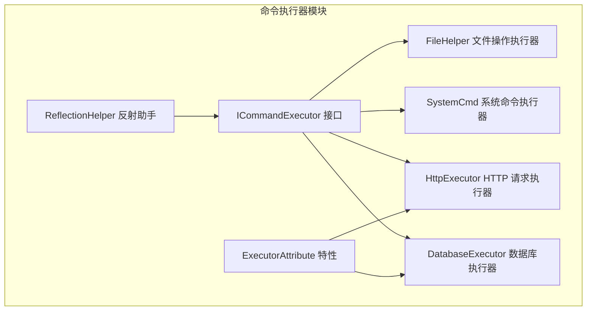
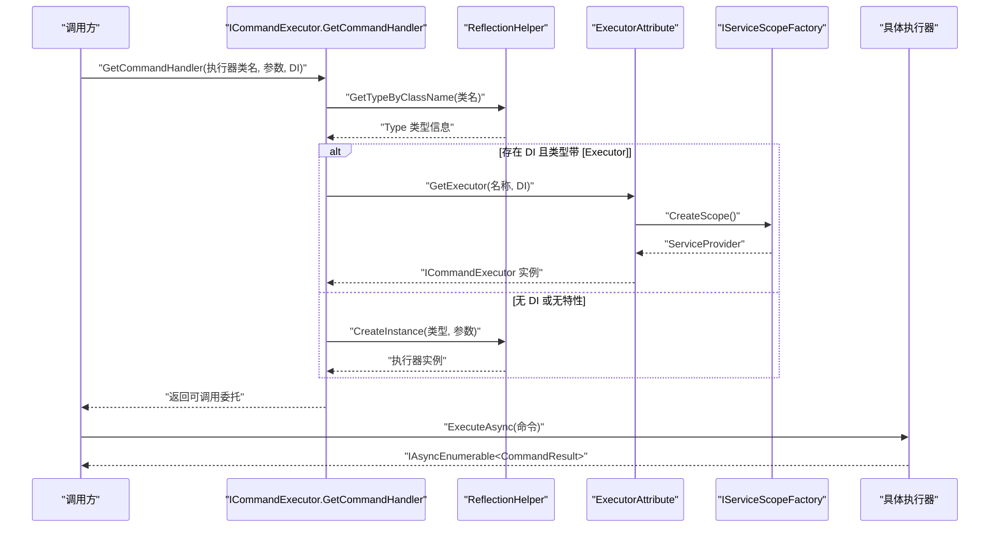
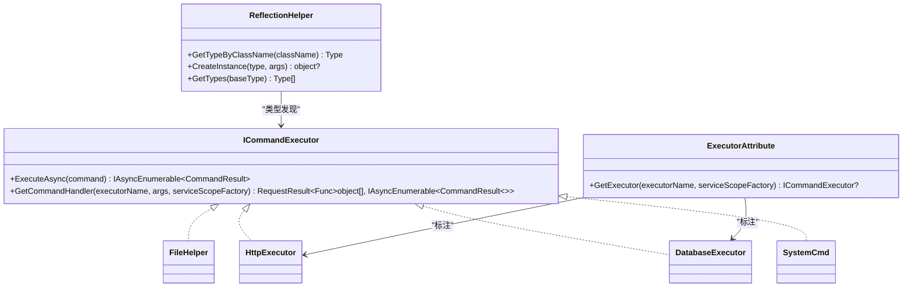
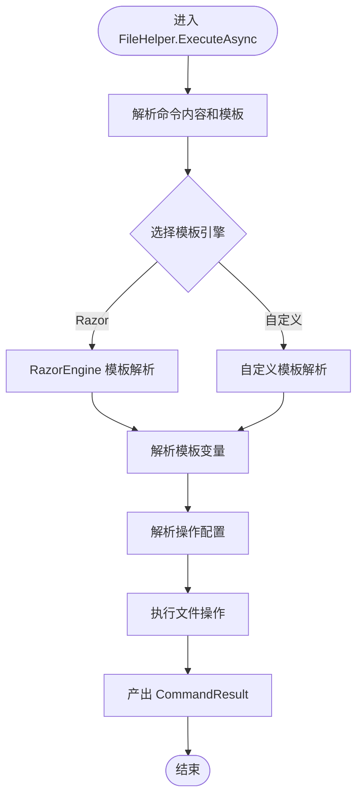
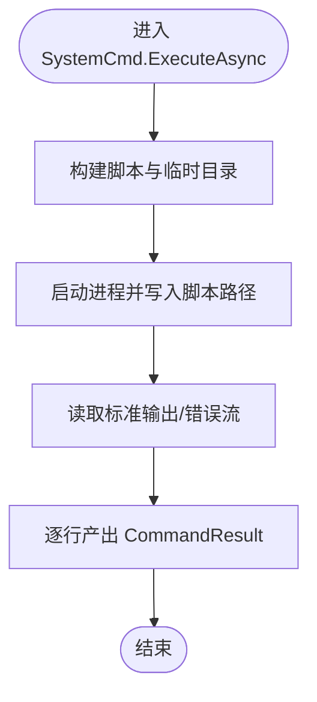
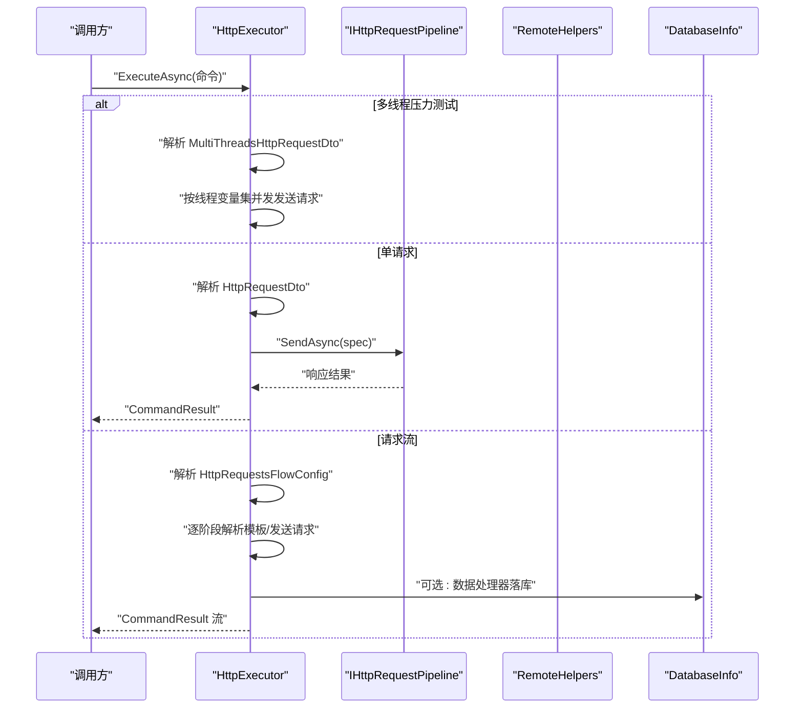
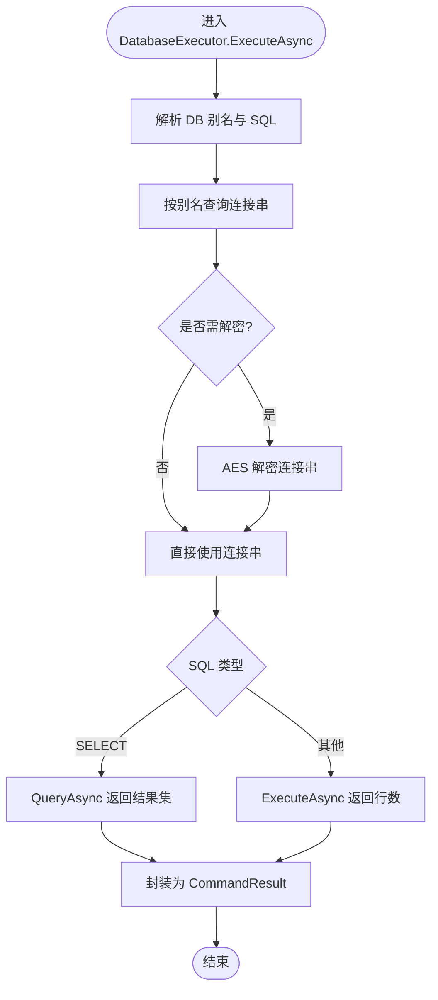

# 命令执行器

<cite>
**本文档引用的文件**
- [ICommandExecutor.cs](file://Sylas.RemoteTasks.Utils/CommandExecutor/ICommandExecutor.cs)
- [ExecutorAttribute.cs](file://Sylas.RemoteTasks.Utils/CommandExecutor/ExecutorAttribute.cs)
- [FileHelper.cs](file://Sylas.RemoteTasks.Utils/CommandExecutor/FileHelper.cs)
- [SystemCmd.cs](file://Sylas.RemoteTasks.Utils/CommandExecutor/SystemCmd.cs)
- [HttpExecutor.cs](file://Sylas.RemoteTasks.Utils/CommandExecutor/HttpExecutor.cs)
- [DatabaseExecutor.cs](file://Sylas.RemoteTasks.Utils/CommandExecutor/DatabaseExecutor.cs)
- [CommandResult.cs](file://Sylas.RemoteTasks.Utils/CommandExecutor/CommandResult.cs)
- [HttpRequestDto.cs](file://Sylas.RemoteTasks.Utils/CommandExecutor/HttpRequestDto.cs)
- [HttpRequestsFlowConfig.cs](file://Sylas.RemoteTasks.Utils/CommandExecutor/HttpRequestsFlowConfig.cs)
- [MultiThreadsHttpRequestDto.cs](file://Sylas.RemoteTasks.Utils/CommandExecutor/MultiThreadsHttpRequestDto.cs)
- [ReflectionHelper.cs](file://Sylas.RemoteTasks.Utils/ReflectionHelper.cs)
- [StartupHelper.cs](file://Sylas.RemoteTasks.App/Helpers/StartupHelper.cs)
- [FileHelperTest.cs](file://Sylas.RemoteTasks.Test/FileOp/FileHelperTest.cs)
- [AnythingService.cs](file://Sylas.RemoteTasks.App/RemoteHostModule/Anything/AnythingService.cs)
</cite>

## 更新摘要
**所做更改**
- 更新了 ICommandExecutor 接口方法重命名：从 Create 改为 GetCommandHandler
- 更新了工厂方法签名和工作原理说明
- 移除了未使用的导入语句
- 更新了反射式服务发现机制的描述
- 新增了实际使用示例和测试用例

## 目录
1. [简介](#简介)
2. [项目结构](#项目结构)
3. [核心组件](#核心组件)
4. [架构总览](#架构总览)
5. [组件详解](#组件详解)
6. [依赖关系分析](#依赖关系分析)
7. [性能与并发特性](#性能与并发特性)
8. [故障排查指南](#故障排查指南)
9. [结论](#结论)
10. [附录](#附录)

## 简介
本文件系统性阐述命令执行器系列的设计与实现，覆盖 ICommandExecutor 接口、ExecutorAttribute 特性机制，以及 FileHelper 文件操作执行器、SystemCmd 系统命令执行器、HttpExecutor HTTP 请求执行器、DatabaseExecutor 数据库执行器的实现细节与使用方法。同时，记录 CommandResult 结果封装、HttpRequestDto 请求参数、HttpRequestsFlowConfig 流配置等核心数据结构，并解释执行器的注册机制、扩展方式与最佳实践，最后提供常见问题与解决方案。

## 项目结构
命令执行器位于 Sylas.RemoteTasks.Utils/CommandExecutor 目录，围绕统一接口 ICommandExecutor 提供四类具体执行器：
- FileHelper：文件操作执行器，支持文件查找、模板解析、批量文件操作等。
- SystemCmd：系统命令执行器，支持单命令、批量命令、并行命令与主机信息采集。
- HttpExecutor：HTTP 请求执行器，支持单请求、请求流、压力测试多线程请求、响应提取与数据处理器。
- DatabaseExecutor：数据库执行器，基于别名定位目标连接串，支持查询与非查询命令。



**图表来源**
- [ICommandExecutor.cs:13-71](file://Sylas.RemoteTasks.Utils/CommandExecutor/ICommandExecutor.cs#L13-L71)
- [FileHelper.cs:27-28](file://Sylas.RemoteTasks.Utils/CommandExecutor/FileHelper.cs#L27-L28)
- [SystemCmd.cs:23-23](file://Sylas.RemoteTasks.Utils/CommandExecutor/SystemCmd.cs#L23-L23)
- [HttpExecutor.cs:21-22](file://Sylas.RemoteTasks.Utils/CommandExecutor/HttpExecutor.cs#L21-L22)
- [DatabaseExecutor.cs:18-19](file://Sylas.RemoteTasks.Utils/CommandExecutor/DatabaseExecutor.cs#L18-L19)
- [ExecutorAttribute.cs:10-24](file://Sylas.RemoteTasks.Utils/CommandExecutor/ExecutorAttribute.cs#L10-L24)
- [ReflectionHelper.cs:26-78](file://Sylas.RemoteTasks.Utils/ReflectionHelper.cs#L26-L78)

**章节来源**
- [ICommandExecutor.cs:1-73](file://Sylas.RemoteTasks.Utils/CommandExecutor/ICommandExecutor.cs#L1-L73)
- [FileHelper.cs:1-1667](file://Sylas.RemoteTasks.Utils/CommandExecutor/FileHelper.cs#L1-L1667)
- [SystemCmd.cs:1-788](file://Sylas.RemoteTasks.Utils/CommandExecutor/SystemCmd.cs#L1-L788)
- [HttpExecutor.cs:1-320](file://Sylas.RemoteTasks.Utils/CommandExecutor/HttpExecutor.cs#L1-L320)
- [DatabaseExecutor.cs:1-84](file://Sylas.RemoteTasks.Utils/CommandExecutor/DatabaseExecutor.cs#L1-L84)

## 核心组件
- ICommandExecutor：统一的异步命令执行接口，定义 ExecuteAsync(string command) 与静态工厂 GetCommandHandler(...)。
- ExecutorAttribute：标记类为执行器，并通过 DI 容器按键获取执行器实例。
- FileHelper：首个实现 ICommandExecutor 的文件操作执行器，支持模板解析、批量文件操作、代码生成等功能。
- CommandResult：封装执行结果，包含成功标志、消息与可选的命令执行编号。
- HttpRequestDto：描述一次 HTTP 请求的参数，包括 URL、方法、头、体、成功正则、响应提取器、数据处理器等。
- HttpRequestsFlowConfig：描述一系列按阶段顺序执行的 HTTP 请求流，包含环境变量与请求 JSON 模板。
- MultiThreadsHttpRequestDto：描述多线程压力测试场景下的请求配置，支持线程变量文件与并发请求分组。

**章节来源**
- [ICommandExecutor.cs:13-71](file://Sylas.RemoteTasks.Utils/CommandExecutor/ICommandExecutor.cs#L13-L71)
- [ExecutorAttribute.cs:10-24](file://Sylas.RemoteTasks.Utils/CommandExecutor/ExecutorAttribute.cs#L10-L24)
- [FileHelper.cs:27-28](file://Sylas.RemoteTasks.Utils/CommandExecutor/FileHelper.cs#L27-L28)
- [CommandResult.cs:6-36](file://Sylas.RemoteTasks.Utils/CommandExecutor/CommandResult.cs#L6-L36)
- [HttpRequestDto.cs:9-95](file://Sylas.RemoteTasks.Utils/CommandExecutor/HttpRequestDto.cs#L9-L95)
- [HttpRequestsFlowConfig.cs:6-16](file://Sylas.RemoteTasks.Utils/CommandExecutor/HttpRequestsFlowConfig.cs#L6-L16)
- [MultiThreadsHttpRequestDto.cs:8-18](file://Sylas.RemoteTasks.Utils/CommandExecutor/MultiThreadsHttpRequestDto.cs#L8-L18)

## 架构总览
命令执行器采用"接口 + 特性 + 反射 + DI"的解耦架构：
- 接口约束：所有执行器实现统一的 ExecuteAsync 签名，便于上层以统一方式调度。
- 特性标注：通过 [Executor] 标注的执行器由 StartupHelper 注册到 DI 容器，使用键控服务按名称解析。
- 反射工厂：ICommandExecutor.GetCommandHandler 支持通过类名反射创建执行器实例或从 DI 获取，动态绑定 ExecuteAsync 方法。
- 异步流式输出：各执行器返回 IAsyncEnumerable<CommandResult>，便于实时消费与进度反馈。



**图表来源**
- [ICommandExecutor.cs:30-70](file://Sylas.RemoteTasks.Utils/CommandExecutor/ICommandExecutor.cs#L30-L70)
- [ExecutorAttribute.cs:18-23](file://Sylas.RemoteTasks.Utils/CommandExecutor/ExecutorAttribute.cs#L18-L23)
- [ReflectionHelper.cs:51-77](file://Sylas.RemoteTasks.Utils/ReflectionHelper.cs#L51-L77)
- [StartupHelper.cs:88-101](file://Sylas.RemoteTasks.App/Helpers/StartupHelper.cs#L88-L101)

**章节来源**
- [ICommandExecutor.cs:30-70](file://Sylas.RemoteTasks.Utils/CommandExecutor/ICommandExecutor.cs#L30-L70)
- [ExecutorAttribute.cs:18-23](file://Sylas.RemoteTasks.Utils/CommandExecutor/ExecutorAttribute.cs#L18-L23)
- [ReflectionHelper.cs:51-77](file://Sylas.RemoteTasks.Utils/ReflectionHelper.cs#L51-L77)
- [StartupHelper.cs:88-101](file://Sylas.RemoteTasks.App/Helpers/StartupHelper.cs#L88-L101)

## 组件详解

### ICommandExecutor 接口与工厂
- ExecuteAsync：接收命令字符串，返回异步枚举的 CommandResult，支持边执行边产出结果。
- GetCommandHandler 静态工厂：
  - 通过类名反射获取类型；
  - 若传入 IServiceScopeFactory 且类型带有 ExecutorAttribute，则通过 DI 键控服务解析；
  - 否则尝试直接实例化（排除静态类）；
  - 动态绑定 ExecuteAsync 方法，返回可调用委托，内部自动遍历 IAsyncEnumerable 并逐项产出。

**更新** 方法重命名为 GetCommandHandler，移除了未使用的导入语句，优化了接口设计



**图表来源**
- [ICommandExecutor.cs:13-71](file://Sylas.RemoteTasks.Utils/CommandExecutor/ICommandExecutor.cs#L13-L71)
- [ExecutorAttribute.cs:10-24](file://Sylas.RemoteTasks.Utils/CommandExecutor/ExecutorAttribute.cs#L10-L24)
- [ReflectionHelper.cs:26-78](file://Sylas.RemoteTasks.Utils/ReflectionHelper.cs#L26-L78)
- [FileHelper.cs:27-28](file://Sylas.RemoteTasks.Utils/CommandExecutor/FileHelper.cs#L27-L28)
- [HttpExecutor.cs:21-22](file://Sylas.RemoteTasks.Utils/CommandExecutor/HttpExecutor.cs#L21-L22)
- [DatabaseExecutor.cs:18-19](file://Sylas.RemoteTasks.Utils/CommandExecutor/DatabaseExecutor.cs#L18-L19)
- [SystemCmd.cs:23-23](file://Sylas.RemoteTasks.Utils/CommandExecutor/SystemCmd.cs#L23-L23)

**章节来源**
- [ICommandExecutor.cs:13-71](file://Sylas.RemoteTasks.Utils/CommandExecutor/ICommandExecutor.cs#L13-L71)

### ExecutorAttribute 特性机制
- 作用：标记类为执行器，并提供从 DI 中按名称解析执行器的能力。
- 解析策略：在 GetCommandHandler 工厂中检测类型是否带特性，若带则通过 Scoped ServiceProvider 的 GetKeyedService 获取对应执行器实例。

**章节来源**
- [ExecutorAttribute.cs:10-24](file://Sylas.RemoteTasks.Utils/CommandExecutor/ExecutorAttribute.cs#L10-L24)

### FileHelper 文件操作执行器
- 职责：首个实现 ICommandExecutor 的文件操作执行器，支持文件查找、模板解析、批量文件操作、代码生成等功能。
- 关键能力：
  - ExecuteAsync(string)：解析命令内容，支持模板引擎、文件操作、批量处理等。
  - 文件查找：FindFilesRecursive 支持递归查找文件，过滤特定目录。
  - 模板解析：支持 RazorEngine 和自定义模板引擎，实现复杂的文件操作自动化。
  - 代码生成：支持 Blazor 组件、MudBlazor 集成、项目配置更新等。
  - 批量操作：支持多文件、多步骤的复杂文件操作流程。
- 使用建议：
  - 命令格式支持多行配置，使用 ### 分隔不同操作步骤。
  - 支持模板变量替换，实现动态文件操作。
  - 注意文件编码和路径处理，避免跨平台兼容性问题。

**新增** FileHelper 是第一个实现 ICommandExecutor 的执行器，提供了强大的文件操作能力



**图表来源**
- [FileHelper.cs:574-649](file://Sylas.RemoteTasks.Utils/CommandExecutor/FileHelper.cs#L574-L649)
- [FileHelper.cs:650-739](file://Sylas.RemoteTasks.Utils/CommandExecutor/FileHelper.cs#L650-L739)

**章节来源**
- [FileHelper.cs:27-1667](file://Sylas.RemoteTasks.Utils/CommandExecutor/FileHelper.cs#L27-L1667)

### SystemCmd 系统命令执行器
- 职责：在本地执行系统命令，支持单命令、批量命令、并行命令与主机信息采集。
- 关键能力：
  - ExecuteAsync(string)：将命令文本转为 PowerShell/Bash 脚本，异步产出每行输出或错误。
  - ExecuteAsync(params string[])：批量顺序执行，返回每条命令的输出列表。
  - ExecuteParallellyAsync(params string[])：并行执行多命令，聚合输出。
  - 主机信息：CPU、内存、磁盘、进程、IP、运行时等信息采集。
- 使用建议：
  - 建议在 Windows 使用 PowerShell，Linux/macOS 使用 Bash。
  - 注意输出编码与临时文件清理，避免磁盘占用。



**图表来源**
- [SystemCmd.cs:129-138](file://Sylas.RemoteTasks.Utils/CommandExecutor/SystemCmd.cs#L129-L138)
- [SystemCmd.cs:227-295](file://Sylas.RemoteTasks.Utils/CommandExecutor/SystemCmd.cs#L227-L295)

**章节来源**
- [SystemCmd.cs:129-295](file://Sylas.RemoteTasks.Utils/CommandExecutor/SystemCmd.cs#L129-L295)
- [SystemCmd.cs:301-379](file://Sylas.RemoteTasks.Utils/CommandExecutor/SystemCmd.cs#L301-L379)
- [SystemCmd.cs:505-648](file://Sylas.RemoteTasks.Utils/CommandExecutor/SystemCmd.cs#L505-L648)

### HttpExecutor HTTP 请求执行器
- 职责：执行单次 HTTP 请求、请求流、压力测试多线程请求。
- 三种命令模式：
  - 单请求：JSON 字符串直接反序列化为 HttpRequestDto，发送并校验成功正则。
  - 请求流：HttpRequestsFlowConfig 描述多阶段请求，逐个发送，支持模板解析、响应提取、数据处理器。
  - 多线程压力测试：MultiThreadsHttpRequestDto 指定线程变量文件与并发请求分组，按线程变量集循环执行。
- 关键点：
  - 成功判定：基于 IsSuccessPattern 正则匹配。
  - 响应提取：ResponseExtractors 支持将响应数据注入后续请求或处理器。
  - 数据处理器：DataHandlers 支持将数据落库等操作（如 DatabaseInfo.TransferDataAsync）。
  - 日志与可观测性：打印请求开始/结束、失败原因等。



**图表来源**
- [HttpExecutor.cs:29-102](file://Sylas.RemoteTasks.Utils/CommandExecutor/HttpExecutor.cs#L29-L102)
- [HttpExecutor.cs:148-255](file://Sylas.RemoteTasks.Utils/CommandExecutor/HttpExecutor.cs#L148-L255)

**章节来源**
- [HttpExecutor.cs:29-102](file://Sylas.RemoteTasks.Utils/CommandExecutor/HttpExecutor.cs#L29-L102)
- [HttpExecutor.cs:148-255](file://Sylas.RemoteTasks.Utils/CommandExecutor/HttpExecutor.cs#L148-L255)
- [HttpRequestDto.cs:9-95](file://Sylas.RemoteTasks.Utils/CommandExecutor/HttpRequestDto.cs#L9-L95)
- [HttpRequestsFlowConfig.cs:6-16](file://Sylas.RemoteTasks.Utils/CommandExecutor/HttpRequestsFlowConfig.cs#L6-L16)
- [MultiThreadsHttpRequestDto.cs:8-18](file://Sylas.RemoteTasks.Utils/CommandExecutor/MultiThreadsHttpRequestDto.cs#L8-L18)

### DatabaseExecutor 数据库执行器
- 职责：根据命令前缀的数据库别名，定位连接串并执行 SQL。
- 命令格式：DB_ALIAS: SQL
  - 查询：返回序列化后的结果集；
  - 其他：返回受影响行数。
- 安全与连接：
  - 若连接串未包含特定关键字，则进行 AES 解密后再建立连接；
  - 使用 Dapper 执行 SQL，异常包装为 CommandResult 失败。
- 使用建议：
  - 为连接串配置安全别名，避免明文存储；
  - 合理控制查询规模，避免阻塞。



**图表来源**
- [DatabaseExecutor.cs:26-81](file://Sylas.RemoteTasks.Utils/CommandExecutor/DatabaseExecutor.cs#L26-L81)

**章节来源**
- [DatabaseExecutor.cs:26-81](file://Sylas.RemoteTasks.Utils/CommandExecutor/DatabaseExecutor.cs#L26-L81)

### 数据结构与配置
- CommandResult：统一结果封装，包含成功标志、消息与可选的命令执行编号。
- HttpRequestDto：描述一次 HTTP 请求的完整参数，支持模板解析、成功正则、响应提取与数据处理器。
- HttpRequestsFlowConfig：描述多阶段请求流，包含环境变量与请求 JSON 模板。
- MultiThreadsHttpRequestDto：描述多线程压力测试配置，支持线程变量文件与并发请求分组。

**章节来源**
- [CommandResult.cs:6-36](file://Sylas.RemoteTasks.Utils/CommandExecutor/CommandResult.cs#L6-L36)
- [HttpRequestDto.cs:9-95](file://Sylas.RemoteTasks.Utils/CommandExecutor/HttpRequestDto.cs#L9-L95)
- [HttpRequestsFlowConfig.cs:6-16](file://Sylas.RemoteTasks.Utils/CommandExecutor/HttpRequestsFlowConfig.cs#L6-L16)
- [MultiThreadsHttpRequestDto.cs:8-18](file://Sylas.RemoteTasks.Utils/CommandExecutor/MultiThreadsHttpRequestDto.cs#L8-L18)

## 依赖关系分析
- 接口与实现：
  - FileHelper、SystemCmd、HttpExecutor、DatabaseExecutor 均实现 ICommandExecutor。
  - FileHelper 作为首个实现，提供了丰富的文件操作能力。
  - HttpExecutor 与 DatabaseExecutor 带 [Executor] 标注，需经 DI 注册并通过键控服务解析。
- DI 注册：
  - StartupHelper.AddExecutor 扫描所有 ICommandExecutor 实现类型，对带 ExecutorAttribute 的类型按名称注册为 Scoped 服务。
- 外部依赖：
  - FileHelper 依赖 AI 服务、模板引擎、文件系统操作。
  - HttpExecutor 依赖 IHttpRequestPipeline、模板引擎与数据库同步基础组件。
  - DatabaseExecutor 依赖 Dapper、数据库连接信息模型与安全解密工具。

```mermaid
graph LR
IH["ICommandExecutor 接口"]
FH["FileHelper"]
SYS["SystemCmd"]
HX["HttpExecutor"]
DBX["DatabaseExecutor"]
EA["ExecutorAttribute"]
SH["StartupHelper.AddExecutor"]
RH["ReflectionHelper"]
AI["AiService"]
TE["模板引擎"]
FS["文件系统"]
end
IH --> FH
IH --> SYS
IH --> HX
IH --> DBX
EA --> HX
EA --> DBX
SH --> HX
SH --> DBX
FH --> AI
FH --> TE
FH --> FS
RH --> IH
```

**图表来源**
- [ICommandExecutor.cs:13-21](file://Sylas.RemoteTasks.Utils/CommandExecutor/ICommandExecutor.cs#L13-L21)
- [FileHelper.cs:27-28](file://Sylas.RemoteTasks.Utils/CommandExecutor/FileHelper.cs#L27-L28)
- [SystemCmd.cs:23-23](file://Sylas.RemoteTasks.Utils/CommandExecutor/SystemCmd.cs#L23-L23)
- [HttpExecutor.cs:21-22](file://Sylas.RemoteTasks.Utils/CommandExecutor/HttpExecutor.cs#L21-L22)
- [DatabaseExecutor.cs:18-19](file://Sylas.RemoteTasks.Utils/CommandExecutor/DatabaseExecutor.cs#L18-L19)
- [ExecutorAttribute.cs:10-24](file://Sylas.RemoteTasks.Utils/CommandExecutor/ExecutorAttribute.cs#L10-L24)
- [StartupHelper.cs:88-101](file://Sylas.RemoteTasks.App/Helpers/StartupHelper.cs#L88-L101)
- [ReflectionHelper.cs:26-78](file://Sylas.RemoteTasks.Utils/ReflectionHelper.cs#L26-L78)

**章节来源**
- [StartupHelper.cs:88-101](file://Sylas.RemoteTasks.App/Helpers/StartupHelper.cs#L88-L101)

## 性能与并发特性
- FileHelper：
  - 模板解析：支持 RazorEngine 和自定义模板引擎，适合复杂的文件操作自动化。
  - 批量操作：支持多文件、多步骤的并行处理，提高文件操作效率。
  - 异步流式：逐操作产出 CommandResult，适合长时间运行的文件处理任务。
- SystemCmd：
  - 单命令：逐行读取输出，边执行边产出，适合长耗时命令的实时反馈。
  - 批量命令：顺序执行，适合串行依赖场景。
  - 并行命令：多进程并发执行，注意资源竞争与输出合并。
- HttpExecutor：
  - 单请求：轻量级，适合简单调用。
  - 请求流：按阶段顺序执行，阶段内可并发请求，提升吞吐。
  - 压力测试：按线程变量集并发执行，适合模拟多用户场景。
- DatabaseExecutor：
  - 查询与非查询分别处理，注意大结果集的序列化成本与超时控制。

**章节来源**
- [FileHelper.cs:574-649](file://Sylas.RemoteTasks.Utils/CommandExecutor/FileHelper.cs#L574-L649)
- [SystemCmd.cs:144-221](file://Sylas.RemoteTasks.Utils/CommandExecutor/SystemCmd.cs#L144-L221)
- [SystemCmd.cs:301-379](file://Sylas.RemoteTasks.Utils/CommandExecutor/SystemCmd.cs#L301-L379)
- [HttpExecutor.cs:31-82](file://Sylas.RemoteTasks.Utils/CommandExecutor/HttpExecutor.cs#L31-L82)
- [HttpExecutor.cs:148-255](file://Sylas.RemoteTasks.Utils/CommandExecutor/HttpExecutor.cs#L148-L255)
- [DatabaseExecutor.cs:65-74](file://Sylas.RemoteTasks.Utils/CommandExecutor/DatabaseExecutor.cs#L65-L74)

## 故障排查指南
- 执行器未被 DI 解析：
  - 确认类型已标注 [Executor]，并已在 StartupHelper.AddExecutor 中注册。
  - 检查服务名称与键控名称一致。
- 命令返回类型不正确：
  - GetCommandHandler 工厂要求 ExecuteAsync 返回 IAsyncEnumerable<CommandResult>，否则抛出异常。
- FileHelper 模板解析失败：
  - 检查模板语法和变量替换是否正确。
  - 确认文件路径和编码格式。
- HTTP 请求失败：
  - 检查 IsSuccessPattern 是否匹配响应内容；
  - 确认请求头、URL、Body 是否正确；
  - 查看日志输出的失败原因。
- 数据库连接失败：
  - 确认别名存在且连接串可解密；
  - 检查关键字判断与加密算法一致性。
- 系统命令执行卡顿：
  - 检查输出编码与临时文件清理；
  - 避免过长命令链导致缓冲区溢出。

**章节来源**
- [ICommandExecutor.cs:58-70](file://Sylas.RemoteTasks.Utils/CommandExecutor/ICommandExecutor.cs#L58-L70)
- [FileHelper.cs:574-649](file://Sylas.RemoteTasks.Utils/CommandExecutor/FileHelper.cs#L574-L649)
- [HttpExecutor.cs:118-139](file://Sylas.RemoteTasks.Utils/CommandExecutor/HttpExecutor.cs#L118-L139)
- [DatabaseExecutor.cs:57-60](file://Sylas.RemoteTasks.Utils/CommandExecutor/DatabaseExecutor.cs#L57-L60)
- [SystemCmd.cs:151-200](file://Sylas.RemoteTasks.Utils/CommandExecutor/SystemCmd.cs#L151-L200)

## 结论
命令执行器系列通过统一接口与特性机制实现了高度可扩展的执行框架。FileHelper 作为首个实现，提供了强大的文件操作能力；SystemCmd、HttpExecutor、DatabaseExecutor 分别覆盖系统命令、HTTP 请求与数据库操作三大场景，配合异步流式结果与模板化配置，满足从简单调用到复杂工作流的多样化需求。结合 DI 注册与工厂反射，开发者可快速扩展新的执行器并融入现有体系。

## 附录

### 使用示例与参考路径
- FileHelper 文件操作示例：[FileHelperTest.cs:432-443](file://Sylas.RemoteTasks.Test/FileOp/FileHelperTest.cs#L432-L443)
- 远程主机模块执行器解析示例：[AnythingService.cs:581-588](file://Sylas.RemoteTasks.App/RemoteHostModule/Anything/AnythingService.cs#L581-L588)
- SystemCmd 批量命令与并行命令示例：参考相关实现文件
- HttpExecutor 单请求与请求流示例：参考 [HttpExecutor.cs:86-101](file://Sylas.RemoteTasks.Utils/CommandExecutor/HttpExecutor.cs#L86-L101) 与 [HttpExecutor.cs:148-255](file://Sylas.RemoteTasks.Utils/CommandExecutor/HttpExecutor.cs#L148-L255)
- DatabaseExecutor 命令格式与执行逻辑：参考 [DatabaseExecutor.cs:26-81](file://Sylas.RemoteTasks.Utils/CommandExecutor/DatabaseExecutor.cs#L26-L81)

**章节来源**
- [FileHelperTest.cs:432-443](file://Sylas.RemoteTasks.Test/FileOp/FileHelperTest.cs#L432-L443)
- [AnythingService.cs:581-588](file://Sylas.RemoteTasks.App/RemoteHostModule/Anything/AnythingService.cs#L581-L588)
- [HttpExecutor.cs:86-101](file://Sylas.RemoteTasks.Utils/CommandExecutor/HttpExecutor.cs#L86-L101)
- [HttpExecutor.cs:148-255](file://Sylas.RemoteTasks.Utils/CommandExecutor/HttpExecutor.cs#L148-L255)
- [DatabaseExecutor.cs:26-81](file://Sylas.RemoteTasks.Utils/CommandExecutor/DatabaseExecutor.cs#L26-L81)