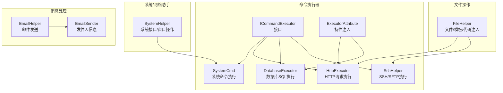
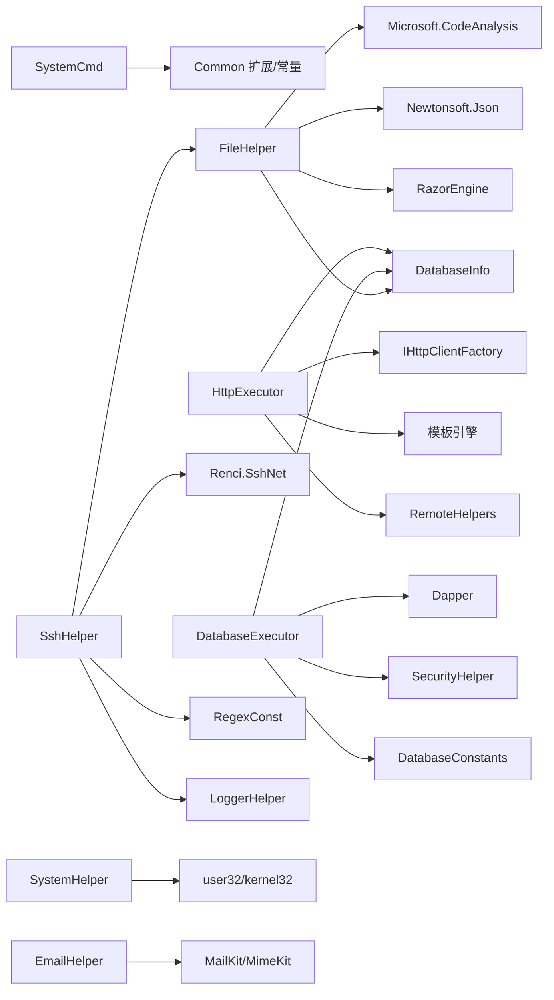

# 工具库详解

<cite>
**本文引用的文件**
- [SystemCmd.cs](file://Sylas.RemoteTasks.Utils/CommandExecutor/SystemCmd.cs)
- [HttpExecutor.cs](file://Sylas.RemoteTasks.Utils/CommandExecutor/HttpExecutor.cs)
- [DatabaseExecutor.cs](file://Sylas.RemoteTasks.Utils/CommandExecutor/DatabaseExecutor.cs)
- [FileHelper.cs](file://Sylas.RemoteTasks.Utils/CommandExecutor/FileHelper.cs)
- [SshHelper.cs](file://Sylas.RemoteTasks.Utils/CommandExecutor/SshHelper.cs)
- [ICommandExecutor.cs](file://Sylas.RemoteTasks.Utils/CommandExecutor/ICommandExecutor.cs)
- [CommandResult.cs](file://Sylas.RemoteTasks.Utils/CommandExecutor/CommandResult.cs)
- [HttpRequestDto.cs](file://Sylas.RemoteTasks.Utils/CommandExecutor/HttpRequestDto.cs)
- [MultiThreadsHttpRequestDto.cs](file://Sylas.RemoteTasks.Utils/CommandExecutor/MultiThreadsHttpRequestDto.cs)
- [HttpRequestsFlowConfig.cs](file://Sylas.RemoteTasks.Utils/CommandExecutor/HttpRequestsFlowConfig.cs)
- [ExecutorAttribute.cs](file://Sylas.RemoteTasks.Utils/CommandExecutor/ExecutorAttribute.cs)
- [SystemHelper.cs](file://Sylas.RemoteTasks.Utils/SystemHelper.cs)
- [EmailHelper.cs](file://Sylas.RemoteTasks.Utils/Message/EmailHelper.cs)
- [EmailSender.cs](file://Sylas.RemoteTasks.Utils/Message/EmailSender.cs)
</cite>

## 目录
1. [简介](#简介)
2. [项目结构](#项目结构)
3. [核心组件](#核心组件)
4. [架构总览](#架构总览)
5. [详细组件分析](#详细组件分析)
6. [依赖关系分析](#依赖关系分析)
7. [性能与并发特性](#性能与并发特性)
8. [故障排查指南](#故障排查指南)
9. [结论](#结论)
10. [附录](#附录)

## 简介
本文件面向“工具库”模块，系统性梳理命令执行器系列（SystemCmd、HttpExecutor、DatabaseExecutor、SshHelper）、文件操作工具、系统助手、网络助手、消息处理等实现细节。内容涵盖：
- 组件职责与数据流
- 关键参数与返回值
- 配置选项与模板变量
- 与其他组件的集成关系
- 常见问题与解决方案
- 面向初学者的入门路径与面向资深开发者的深度要点

## 项目结构
工具库位于 Sylas.RemoteTasks.Utils 命名空间下，核心由命令执行器、文件操作、系统/网络辅助、消息处理四大部分组成。命令执行器统一实现 ICommandExecutor 接口，通过反射与特性注入创建实例；文件操作封装了递归查找、模板解析、代码注入等能力；系统/网络助手提供跨平台系统信息采集与窗口操作；消息处理提供邮件发送能力。

图表来源
- [ICommandExecutor.cs](file://Sylas.RemoteTasks.Utils/CommandExecutor/ICommandExecutor.cs#L14-L72)
- [ExecutorAttribute.cs](file://Sylas.RemoteTasks.Utils/CommandExecutor/ExecutorAttribute.cs#L10-L24)
- [SystemCmd.cs](file://Sylas.RemoteTasks.Utils/CommandExecutor/SystemCmd.cs#L23-L650)
- [HttpExecutor.cs](file://Sylas.RemoteTasks.Utils/CommandExecutor/HttpExecutor.cs#L21-L257)
- [DatabaseExecutor.cs](file://Sylas.RemoteTasks.Utils/CommandExecutor/DatabaseExecutor.cs#L19-L82)
- [SshHelper.cs](file://Sylas.RemoteTasks.Utils/CommandExecutor/SshHelper.cs#L18-L618)
- [FileHelper.cs](file://Sylas.RemoteTasks.Utils/CommandExecutor/FileHelper.cs#L27-L800)
- [SystemHelper.cs](file://Sylas.RemoteTasks.Utils/SystemHelper.cs#L13-L800)
- [EmailHelper.cs](file://Sylas.RemoteTasks.Utils/Message/EmailHelper.cs#L13-L77)
- [EmailSender.cs](file://Sylas.RemoteTasks.Utils/Message/EmailSender.cs#L6-L34)

章节来源
- [ICommandExecutor.cs](file://Sylas.RemoteTasks.Utils/CommandExecutor/ICommandExecutor.cs#L14-L72)
- [ExecutorAttribute.cs](file://Sylas.RemoteTasks.Utils/CommandExecutor/ExecutorAttribute.cs#L10-L24)

## 核心组件
- 命令执行器接口与工厂
  - ICommandExecutor 定义 ExecuteAsync 契约，统一异步枚举返回 CommandResult。
  - ExecutorAttribute 用于基于 DI 的 keyed 服务解析，支持按名称创建执行器实例。
- SystemCmd：系统命令执行、主机信息采集、磁盘/内存/CPU采集、进程信息查询。
- HttpExecutor：单请求/批量请求/多线程压力测试、请求流程编排、响应提取与数据处理器。
- DatabaseExecutor：按数据库别名路由到目标连接，自动解密敏感连接串，支持 select/非select。
- SshHelper：SSH/SFTP 连接池、命令块解析、上传/下载/远程文件处理。
- FileHelper：文件递归查找、模板引擎（Razor/Tmpl）、代码注入、JSON/正则解析、自动化文件读写。
- SystemHelper：系统接口常量与 P/Invoke 封装，窗口枚举与前台窗口操作。
- EmailHelper/EmailSender：邮件发送（HTML正文），支持单发/群发。

章节来源
- [ICommandExecutor.cs](file://Sylas.RemoteTasks.Utils/CommandExecutor/ICommandExecutor.cs#L14-L72)
- [ExecutorAttribute.cs](file://Sylas.RemoteTasks.Utils/CommandExecutor/ExecutorAttribute.cs#L10-L24)
- [CommandResult.cs](file://Sylas.RemoteTasks.Utils/CommandExecutor/CommandResult.cs#L6-L38)
- [SystemCmd.cs](file://Sylas.RemoteTasks.Utils/CommandExecutor/SystemCmd.cs#L23-L650)
- [HttpExecutor.cs](file://Sylas.RemoteTasks.Utils/CommandExecutor/HttpExecutor.cs#L21-L257)
- [DatabaseExecutor.cs](file://Sylas.RemoteTasks.Utils/CommandExecutor/DatabaseExecutor.cs#L19-L82)
- [SshHelper.cs](file://Sylas.RemoteTasks.Utils/CommandExecutor/SshHelper.cs#L18-L618)
- [FileHelper.cs](file://Sylas.RemoteTasks.Utils/CommandExecutor/FileHelper.cs#L27-L800)
- [SystemHelper.cs](file://Sylas.RemoteTasks.Utils/SystemHelper.cs#L13-L800)
- [EmailHelper.cs](file://Sylas.RemoteTasks.Utils/Message/EmailHelper.cs#L13-L77)
- [EmailSender.cs](file://Sylas.RemoteTasks.Utils/Message/EmailSender.cs#L6-L34)

## 架构总览
命令执行器采用“接口 + 特性注入 + 反射”的统一入口，不同执行器负责不同领域（系统、HTTP、数据库、SSH）。文件操作与模板引擎贯穿 HTTP 与 SSH 的配置解析与自动化任务执行。系统助手提供底层系统能力，消息处理独立于执行器链路。

```mermaid
classDiagram
class ICommandExecutor {
+ExecuteAsync(command) IAsyncEnumerable<CommandResult>
+Create(executorName, args, serviceScopeFactory) RequestResult<Func<object[], IAsyncEnumerable<CommandResult>>>
}
class ExecutorAttribute {
+GetExecutor(executorName, serviceScopeFactory) ICommandExecutor?
}
class SystemCmd {
+ExecuteAsync(command) IAsyncEnumerable<CommandResult>
+ExecuteAsync(commands) Task<List<string>>
+ExecuteSingleCommandAsync(cmdTxt) IAsyncEnumerable<string>
+ExecuteParallellyAsync(commands) Task<List<string>>
+GetProcessCpuAndRamAsync(processName) Task<List<string>>
+GetServerAndAppInfoAsync() Task<ServerInfo>
}
class HttpExecutor {
+ExecuteAsync(command) IAsyncEnumerable<CommandResult>
-SendRequestAsync(dto, threadVars) Task<CommandResult>
-ExecuteFetchFlowsAsync(configContent) IAsyncEnumerable<CommandResult>
}
class DatabaseExecutor {
+ExecuteAsync(cmdTxt) IAsyncEnumerable<CommandResult>
}
class SshHelper {
+RunCommandAsync(commandContent) IAsyncEnumerable<OperationResult>
+UploadAsync(local, remote, includes, excludes) Task<string>
+DownloadAsync(local, remote, includes, excludes) Task<void>
+GetRemoteFiles(remotePath, includes, excludes) Task<string[]>
+HandleFile(localPathSourceFile, remotePathSourceFile, localPathResultFile, remotePathResultFile, command) Task<Tuple<bool,string>>
+ExecuteAsync(command) IAsyncEnumerable<CommandResult>
}
class FileHelper {
+FindFilesRecursive(dir, filter, stopCond, files) List<string>
+ExecuteAsync(commandContent) IAsyncEnumerable<CommandResult>
}
class SystemHelper {
+GetAllWindows() List<WindowInfo>
+GetForegroundWindowHandlerAndTitle() (IntPtr, string)
}
class EmailHelper {
+SendAsync(sender, to, subject, body) Task<OperationResult>
+SendAsync(sender, tos, subject, body) Task<OperationResult>
}
ICommandExecutor <|.. SystemCmd
ICommandExecutor <|.. HttpExecutor
ICommandExecutor <|.. DatabaseExecutor
ICommandExecutor <|.. SshHelper
ExecutorAttribute --> HttpExecutor : "DI注入"
ExecutorAttribute --> DatabaseExecutor : "DI注入"
```

图表来源
- [ICommandExecutor.cs](file://Sylas.RemoteTasks.Utils/CommandExecutor/ICommandExecutor.cs#L14-L72)
- [ExecutorAttribute.cs](file://Sylas.RemoteTasks.Utils/CommandExecutor/ExecutorAttribute.cs#L10-L24)
- [SystemCmd.cs](file://Sylas.RemoteTasks.Utils/CommandExecutor/SystemCmd.cs#L23-L650)
- [HttpExecutor.cs](file://Sylas.RemoteTasks.Utils/CommandExecutor/HttpExecutor.cs#L21-L257)
- [DatabaseExecutor.cs](file://Sylas.RemoteTasks.Utils/CommandExecutor/DatabaseExecutor.cs#L19-L82)
- [SshHelper.cs](file://Sylas.RemoteTasks.Utils/CommandExecutor/SshHelper.cs#L18-L618)
- [FileHelper.cs](file://Sylas.RemoteTasks.Utils/CommandExecutor/FileHelper.cs#L27-L800)
- [SystemHelper.cs](file://Sylas.RemoteTasks.Utils/SystemHelper.cs#L13-L800)
- [EmailHelper.cs](file://Sylas.RemoteTasks.Utils/Message/EmailHelper.cs#L13-L77)

## 详细组件分析

### SystemCmd：系统命令执行与主机信息采集
- 能力概览
  - 异步执行单条或多条命令，支持 PowerShell/Bash。
  - 串行/并行执行，支持捕获标准输出与错误。
  - 主机信息采集：CPU/内存/磁盘/进程/CPU使用率。
- 关键参数与返回
  - ExecuteAsync(command)：逐行产出 CommandResult。
  - ExecuteAsync(commands)：返回每条命令输出列表。
  - ExecuteSingleCommandAsync(cmdTxt)：逐行返回输出。
  - ExecuteParallellyAsync(commands)：并行执行，聚合输出。
  - GetProcessCpuAndRamAsync(processName)：返回每个进程的CPU与内存。
  - GetServerAndAppInfoAsync()：返回 ServerInfo 结构（主机名、OS、IP、CPU、磁盘、内存、应用运行时信息）。
- 典型用法
  - 串行执行：传入多条命令，按顺序执行并收集输出。
  - 并行执行：传入多条命令，内部并发执行，合并结果。
  - 主机信息：调用 GetServerAndAppInfoAsync 获取系统状态快照。
- 注意事项
  - Windows 默认使用 PowerShell，Linux 使用 Bash。
  - 输出编码统一为 UTF-8。
  - 临时脚本与日志文件清理策略避免磁盘膨胀。

章节来源
- [SystemCmd.cs](file://Sylas.RemoteTasks.Utils/CommandExecutor/SystemCmd.cs#L129-L221)
- [SystemCmd.cs](file://Sylas.RemoteTasks.Utils/CommandExecutor/SystemCmd.cs#L227-L295)
- [SystemCmd.cs](file://Sylas.RemoteTasks.Utils/CommandExecutor/SystemCmd.cs#L301-L379)
- [SystemCmd.cs](file://Sylas.RemoteTasks.Utils/CommandExecutor/SystemCmd.cs#L386-L417)
- [SystemCmd.cs](file://Sylas.RemoteTasks.Utils/CommandExecutor/SystemCmd.cs#L630-L648)

### HttpExecutor：HTTP请求执行与流程编排
- 能力概览
  - 单请求：解析 JSON 命令，发送请求，校验正则成功模板。
  - 请求流程：解析多阶段请求配置，按阶段顺序执行，支持模板变量与响应提取。
  - 多线程压力测试：基于线程变量文件，按批次并发发送请求。
  - 响应数据处理器：支持将响应数据写入数据库（TransferData）。
- 关键参数与返回
  - ExecuteAsync(command)：当命令包含多线程配置时进入多线程分支；否则解析为单请求或流程配置。
  - SendRequestAsync(dto, threadVars)：发送请求，返回 CommandResult。
  - ExecuteFetchFlowsAsync(configContent)：解析 EnvVars 与 HttpRequestDtosJson，逐阶段执行请求，产出中间结果。
- 配置要点
  - HttpRequestDto 字段：Url、Method、ContentType、Headers、Body、PrintResponseContent、IsSuccessPattern、ResponseExtractors、ResponseDataPropty、DataHandlers。
  - MultiThreadsHttpRequestDto：ThreadVarsFile（CSV首行为字段名，其余为变量行）、Requests（二维：阶段->并发请求）。
  - HttpRequestsFlowConfig：EnvVars（全局变量）、HttpRequestDtosJson（含模板表达式的JSON数组）。
- 典型用法
  - 单请求：传入 JSON 命令，自动解析并发送。
  - 流程：传入包含多阶段请求的配置，按顺序执行，自动注入 data 上下文。
  - 多线程：准备线程变量文件，按批次并发请求，支持并发内并行。
- 注意事项
  - 成功判定依赖 IsSuccessPattern 正则。
  - ResponseExtractors 与 ResponseDataPropty 需配合模板引擎解析。
  - DataHandlers 中 TransferData 参数需满足最少参数个数与命名规范。

章节来源
- [HttpExecutor.cs](file://Sylas.RemoteTasks.Utils/CommandExecutor/HttpExecutor.cs#L29-L102)
- [HttpExecutor.cs](file://Sylas.RemoteTasks.Utils/CommandExecutor/HttpExecutor.cs#L110-L140)
- [HttpExecutor.cs](file://Sylas.RemoteTasks.Utils/CommandExecutor/HttpExecutor.cs#L148-L255)
- [HttpRequestDto.cs](file://Sylas.RemoteTasks.Utils/CommandExecutor/HttpRequestDto.cs#L11-L77)
- [MultiThreadsHttpRequestDto.cs](file://Sylas.RemoteTasks.Utils/CommandExecutor/MultiThreadsHttpRequestDto.cs#L8-L19)
- [HttpRequestsFlowConfig.cs](file://Sylas.RemoteTasks.Utils/CommandExecutor/HttpRequestsFlowConfig.cs#L6-L17)

### DatabaseExecutor：数据库SQL执行
- 能力概览
  - 以“数据库别名: SQL”格式解析目标数据库。
  - 查询连接信息表，按别名匹配目标连接。
  - 自动解密加密连接串（若包含特定关键字则跳过解密）。
  - 支持 select 返回 JSON，非 select 返回影响行数。
- 关键参数与返回
  - ExecuteAsync(cmdTxt)：解析目标库与SQL，执行并返回 CommandResult。
- 典型用法
  - “DB_ALIAS:SELECT * FROM Users WHERE Id = @id”
  - “DB_ALIAS:INSERT INTO Logs VALUES(...)”
- 注意事项
  - 若找不到别名，直接返回失败结果。
  - 异常将被捕获并包装为失败结果。

章节来源
- [DatabaseExecutor.cs](file://Sylas.RemoteTasks.Utils/CommandExecutor/DatabaseExecutor.cs#L26-L81)

### SshHelper：SSH/SFTP 远程执行与文件传输
- 能力概览
  - 连接池：限制最大连接数，支持 SSH/SFTP 两类连接池。
  - 命令块解析：识别 upload/download 与普通 shell 命令块。
  - 文件传输：支持本地目录/文件上传、远程目录/文件下载、包含/排除规则。
  - 远程文件处理：将本地文件上传至远端，执行命令，再下载结果并清理。
- 关键参数与返回
  - RunCommandAsync(commandContent)：解析命令块，逐块执行，产出 OperationResult。
  - UploadAsync/local/remote/includes/excludes：上传目录/文件，按 include/exclude 过滤。
  - DownloadAsync/local/remote/includes/excludes：下载目录/文件。
  - GetRemoteFiles(remotePath, includes, excludes)：远端文件列表（带正则过滤）。
  - HandleFile(..., command)：上传源文件->执行命令->下载结果->清理。
- 典型用法
  - “upload C:/temp/* /remote/path -include=.dll -exclude=debug”
  - “download ./local/ /remote/dir -include=.log”
  - 多命令块组合，自动拆分执行。
- 注意事项
  - 连接池上限默认 20，超出抛出异常。
  - 上传/下载前确保远端目录存在，必要时通过 SSH 命令创建。
  - 临时脚本在远端执行成功后自动清理。

章节来源
- [SshHelper.cs](file://Sylas.RemoteTasks.Utils/CommandExecutor/SshHelper.cs#L206-L318)
- [SshHelper.cs](file://Sylas.RemoteTasks.Utils/CommandExecutor/SshHelper.cs#L319-L421)
- [SshHelper.cs](file://Sylas.RemoteTasks.Utils/CommandExecutor/SshHelper.cs#L423-L484)
- [SshHelper.cs](file://Sylas.RemoteTasks.Utils/CommandExecutor/SshHelper.cs#L511-L546)
- [SshHelper.cs](file://Sylas.RemoteTasks.Utils/CommandExecutor/SshHelper.cs#L551-L558)
- [SshHelper.cs](file://Sylas.RemoteTasks.Utils/CommandExecutor/SshHelper.cs#L568-L616)

### FileHelper：文件操作与模板自动化
- 能力概览
  - 递归查找文件/目录，支持过滤与停止条件。
  - 模板引擎：支持 Razor 与自研 Tmpl 引擎，解析全局变量、IF 条件、占位符替换。
  - 代码注入：在类文件中插入属性/方法代码，避免重复。
  - JSON/正则：读取 JSON 数据、按字段路径提取、正则分组搜索去重。
  - 自动化文件读写：基于“节点-步骤”配置，批量执行文件修改。
- 关键参数与返回
  - ExecuteAsync(commandContent)：解析标题、节点与步骤，执行自动化任务，逐条产出日志。
  - ResolveNodeFromConfig(nodeConfig)：从配置文本解析节点与步骤。
- 典型用法
  - 递归查找：FindFilesRecursive(slnDir, filter, stopCond)
  - 模板解析：Razor/Tmpl 引擎渲染，支持变量注入与条件指令。
  - 代码注入：InsertCodeProperty/InsertCode
  - JSON提取：GetRecords(filePath, ["result","data"])
- 注意事项
  - 模板变量语法与 IF 指令需严格遵循约定。
  - 代码注入会检查重复，避免重复插入。

章节来源
- [FileHelper.cs](file://Sylas.RemoteTasks.Utils/CommandExecutor/FileHelper.cs#L45-L150)
- [FileHelper.cs](file://Sylas.RemoteTasks.Utils/CommandExecutor/FileHelper.cs#L587-L662)
- [FileHelper.cs](file://Sylas.RemoteTasks.Utils/CommandExecutor/FileHelper.cs#L663-L747)

### SystemHelper：系统接口与窗口操作
- 能力概览
  - 键盘/鼠标常量与消息码。
  - 全局热键注册/注销（需窗体消息循环）。
  - 窗口枚举、前台窗口、窗口状态、可见性、矩形区域、线程/进程ID。
- 典型用法
  - GetAllWindows() 获取所有可见窗口列表。
  - GetForegroundWindowHandlerAndTitle() 获取当前焦点窗口句柄与标题。
  - SetForegroundWindow(hWnd) 将指定窗口置前。
- 注意事项
  - 需要有效的窗体消息循环以接收热键消息。
  - 窗口状态与可见性判断需结合多种 API。

章节来源
- [SystemHelper.cs](file://Sylas.RemoteTasks.Utils/SystemHelper.cs#L711-L768)
- [SystemHelper.cs](file://Sylas.RemoteTasks.Utils/SystemHelper.cs#L773-L784)
- [SystemHelper.cs](file://Sylas.RemoteTasks.Utils/SystemHelper.cs#L790-L797)

### EmailHelper：邮件发送
- 能力概览
  - 单发/群发 HTML 邮件，支持 SSL/TLS。
  - 发件人信息由 EmailSender 提供（名称、邮箱、SMTP、端口、SSL）。
- 关键参数与返回
  - SendAsync(sender, to, subject, body)：单发。
  - SendAsync(sender, tos, subject, body)：群发，内部并发等待完成。
- 典型用法
  - 配置 EmailSender，调用 SendAsync 发送通知或报告。
- 注意事项
  - SMTP 认证失败或连接异常会返回失败结果。
  - 群发时注意并发与速率限制。

章节来源
- [EmailHelper.cs](file://Sylas.RemoteTasks.Utils/Message/EmailHelper.cs#L22-L74)
- [EmailSender.cs](file://Sylas.RemoteTasks.Utils/Message/EmailSender.cs#L6-L34)

## 依赖关系分析
- 命令执行器依赖
  - SystemCmd：Common 扩展、常量、系统信息采集。
  - HttpExecutor：IHttpClientFactory、模板引擎、RemoteHelpers、DatabaseInfo（数据处理器）。
  - DatabaseExecutor：Dapper、DatabaseInfo、SecurityHelper、DatabaseConstants。
  - SshHelper：Renci.SshNet、FileHelper、RegexConst、LoggerHelper。
- 文件操作依赖
  - FileHelper：Microsoft.CodeAnalysis、Newtonsoft.Json、RazorEngine、DatabaseInfo、RegexConst。
- 系统/网络助手
  - SystemHelper：P/Invoke user32/kernel32，封装窗口与热键。
- 消息处理
  - EmailHelper：MailKit、MimeKit、Common.Dtos。

图表来源
- [SystemCmd.cs](file://Sylas.RemoteTasks.Utils/CommandExecutor/SystemCmd.cs#L1-L20)
- [HttpExecutor.cs](file://Sylas.RemoteTasks.Utils/CommandExecutor/HttpExecutor.cs#L1-L15)
- [DatabaseExecutor.cs](file://Sylas.RemoteTasks.Utils/CommandExecutor/DatabaseExecutor.cs#L1-L12)
- [SshHelper.cs](file://Sylas.RemoteTasks.Utils/CommandExecutor/SshHelper.cs#L1-L12)
- [FileHelper.cs](file://Sylas.RemoteTasks.Utils/CommandExecutor/FileHelper.cs#L1-L22)
- [SystemHelper.cs](file://Sylas.RemoteTasks.Utils/SystemHelper.cs#L1-L10)
- [EmailHelper.cs](file://Sylas.RemoteTasks.Utils/Message/EmailHelper.cs#L1-L7)

## 性能与并发特性
- SystemCmd
  - 串行执行：逐条命令等待完成，适合顺序依赖场景。
  - 并行执行：Task.WhenAll 并发执行，适合独立命令集。
  - 进程监控：多进程 CPU/内存采样，采样间隔与平均计算提升稳定性。
- HttpExecutor
  - 单请求：轻量同步 I/O。
  - 流程：阶段顺序执行，阶段内并发请求，提升吞吐。
  - 多线程：按线程变量文件生成上下文，批次并发，适合压测。
- SshHelper
  - 连接池：限制最大连接数，避免资源耗尽。
  - 命令块：将连续 upload/download 与 shell 命令块拆分执行，减少阻塞。
  - 文件传输：目录上传按文件粒度处理，避免一次性加载导致内存峰值。
- FileHelper
  - 递归遍历：支持停止条件，避免全盘扫描。
  - 模板解析：Razor 编译缓存，减少重复编译开销。
- DatabaseExecutor
  - 连接串解密：仅在必要时解密，避免重复解密。
  - SQL 分支：select 返回 JSON，非 select 返回影响行数，减少不必要的序列化。

章节来源
- [SystemCmd.cs](file://Sylas.RemoteTasks.Utils/CommandExecutor/SystemCmd.cs#L301-L379)
- [HttpExecutor.cs](file://Sylas.RemoteTasks.Utils/CommandExecutor/HttpExecutor.cs#L33-L82)
- [HttpExecutor.cs](file://Sylas.RemoteTasks.Utils/CommandExecutor/HttpExecutor.cs#L148-L255)
- [SshHelper.cs](file://Sylas.RemoteTasks.Utils/CommandExecutor/SshHelper.cs#L36-L80)
- [SshHelper.cs](file://Sylas.RemoteTasks.Utils/CommandExecutor/SshHelper.cs#L206-L318)
- [FileHelper.cs](file://Sylas.RemoteTasks.Utils/CommandExecutor/FileHelper.cs#L116-L150)
- [FileHelper.cs](file://Sylas.RemoteTasks.Utils/CommandExecutor/FileHelper.cs#L604-L640)

## 故障排查指南
- SystemCmd
  - 现象：命令无输出或输出乱码
    - 排查：确认输出编码为 UTF-8；Windows 使用 PowerShell，Linux 使用 Bash。
  - 现象：临时目录未清理
    - 排查：检查保留策略（最多保留最近 10 个临时目录）。
- HttpExecutor
  - 现象：请求失败或结果不匹配
    - 排查：检查 IsSuccessPattern 正则；查看 PrintResponseContent 是否开启。
  - 现象：多线程变量文件为空
    - 排查：确认首行字段名与后续行数据一致，字段数量匹配。
  - 现象：数据处理器异常
    - 排查：TransferData 参数个数与命名规范，目标表与忽略字段格式。
- DatabaseExecutor
  - 现象：找不到数据库别名
    - 排查：确认别名拼写与连接信息表一致。
  - 现象：连接串解密失败
    - 排查：确认包含特定关键字的连接串无需解密。
- SshHelper
  - 现象：连接池上限异常
    - 排查：确认最大连接数阈值与并发需求匹配。
  - 现象：上传/下载路径不存在
    - 排查：使用 EnsureDirectoryExistAsync 或通过 SSH 命令创建目录。
  - 现象：权限问题导致脚本不可执行
    - 排查：上传后执行 chmod +x。
- FileHelper
  - 现象：模板变量语法错误
    - 排查：检查变量赋值与分隔符；IF 指令格式。
  - 现象：代码注入重复
    - 排查：避免重复插入相同代码段。
- SystemHelper
  - 现象：热键未生效
    - 排查：确保窗体消息循环有效；RegisterHotKey 参数正确。
- EmailHelper
  - 现象：认证失败
    - 排查：核对 SMTP 地址、端口、SSL、用户名与授权码。

章节来源
- [SystemCmd.cs](file://Sylas.RemoteTasks.Utils/CommandExecutor/SystemCmd.cs#L144-L221)
- [HttpExecutor.cs](file://Sylas.RemoteTasks.Utils/CommandExecutor/HttpExecutor.cs#L31-L82)
- [HttpExecutor.cs](file://Sylas.RemoteTasks.Utils/CommandExecutor/HttpExecutor.cs#L161-L188)
- [DatabaseExecutor.cs](file://Sylas.RemoteTasks.Utils/CommandExecutor/DatabaseExecutor.cs#L50-L54)
- [SshHelper.cs](file://Sylas.RemoteTasks.Utils/CommandExecutor/SshHelper.cs#L185-L187)
- [SshHelper.cs](file://Sylas.RemoteTasks.Utils/CommandExecutor/SshHelper.cs#L394-L402)
- [FileHelper.cs](file://Sylas.RemoteTasks.Utils/CommandExecutor/FileHelper.cs#L617-L635)
- [EmailHelper.cs](file://Sylas.RemoteTasks.Utils/Message/EmailHelper.cs#L36-L54)

## 结论
工具库通过统一的命令执行器接口与丰富的执行器实现，覆盖系统命令、HTTP 请求、数据库操作、远程文件与命令执行、文件自动化、系统接口与消息发送等场景。其设计强调：
- 可扩展：通过特性注入与反射工厂创建执行器实例。
- 可组合：文件模板与自动化任务贯穿执行器链路。
- 可观测：大量日志与进度输出，便于调试与监控。
- 可靠性：连接池、超时控制、异常捕获与清理策略。

建议在生产环境中：
- 为每个执行器配置合适的超时与重试策略。
- 对敏感连接串进行加密存储，并在运行时解密。
- 对多线程/并发场景进行限速与资源上限控制。
- 使用日志与指标监控关键路径的延迟与失败率。

## 附录
- 关键数据模型与配置
  - CommandResult：Succeed、Message、CommandExecuteNo
  - ServerInfo：MachineName、OSName、OSArchitecture、DoNetName、IP、CpuCount、DiskInfos、MemoryInfo、AppStartTime、AppRunTime、AppRam、AppRamRate
  - MemoryInfo：Total、Used、Free、UsedRam、CpuRate、TotalRAM、RAMRate、FreeRam
  - DiskInfo：DiskName、TypeName、TotalFree、TotalSize、Used、AvailableFreeSpace、AvailablePercent
  - HttpRequestDto：Title、Url、Method、ContentType、Headers、Body、PrintResponseContent、IsSuccessPattern、ResponseExtractors、ResponseDataPropty、DataHandlers
  - MultiThreadsHttpRequestDto：ThreadVarsFile、Requests
  - HttpRequestsFlowConfig：EnvVars、HttpRequestDtosJson
  - EmailSender：Name、Password、Address、Server、Port、UseSsl

章节来源
- [CommandResult.cs](file://Sylas.RemoteTasks.Utils/CommandExecutor/CommandResult.cs#L6-L38)
- [SystemCmd.cs](file://Sylas.RemoteTasks.Utils/CommandExecutor/SystemCmd.cs#L654-L786)
- [HttpRequestDto.cs](file://Sylas.RemoteTasks.Utils/CommandExecutor/HttpRequestDto.cs#L11-L77)
- [MultiThreadsHttpRequestDto.cs](file://Sylas.RemoteTasks.Utils/CommandExecutor/MultiThreadsHttpRequestDto.cs#L8-L19)
- [HttpRequestsFlowConfig.cs](file://Sylas.RemoteTasks.Utils/CommandExecutor/HttpRequestsFlowConfig.cs#L6-L17)
- [EmailSender.cs](file://Sylas.RemoteTasks.Utils/Message/EmailSender.cs#L6-L34)