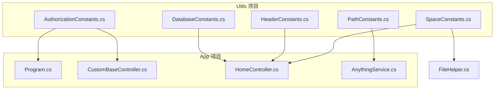
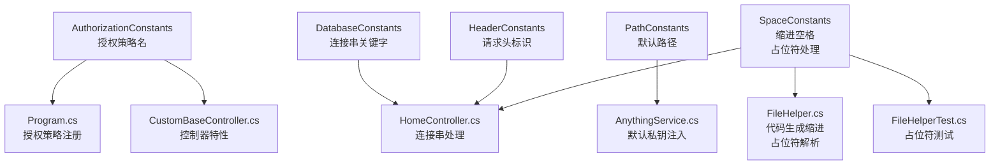
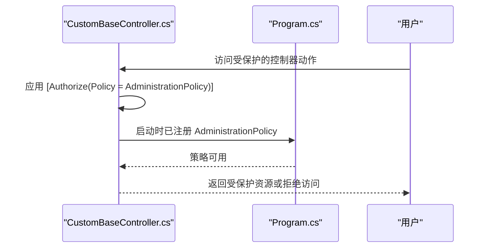
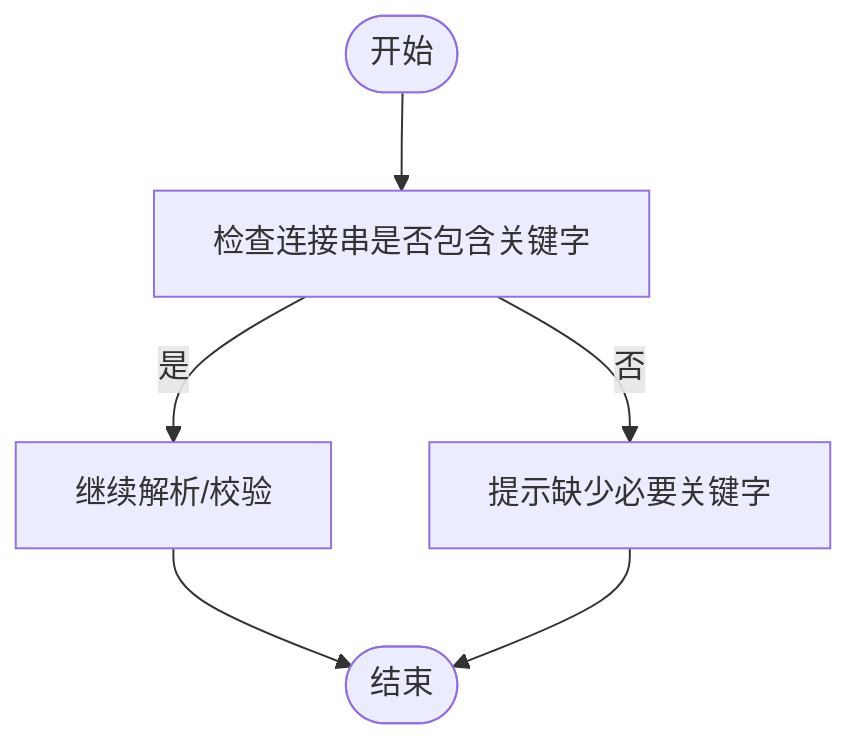
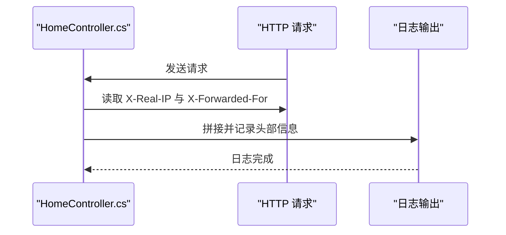
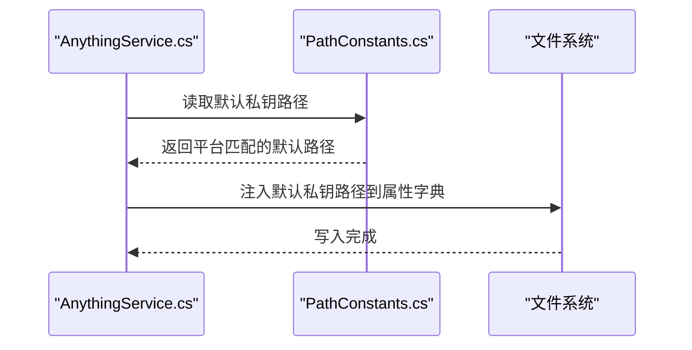
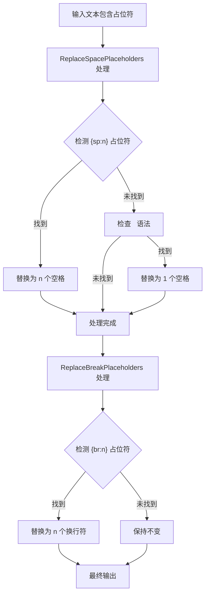
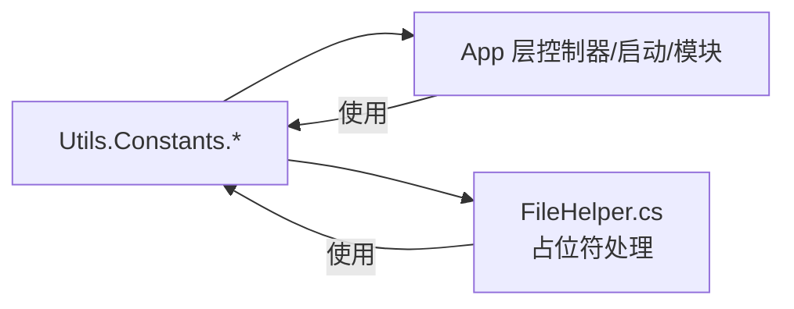

# 常量和配置

<cite>
**本文引用的文件**
- [AuthorizationConstants.cs](file://Sylas.RemoteTasks.Utils/Constants/AuthorizationConstants.cs)
- [DatabaseConstants.cs](file://Sylas.RemoteTasks.Utils/Constants/DatabaseConstants.cs)
- [HeaderConstants.cs](file://Sylas.RemoteTasks.Utils/Constants/HeaderConstants.cs)
- [PathConstants.cs](file://Sylas.RemoteTasks.Utils/Constants/PathConstants.cs)
- [SpaceConstants.cs](file://Sylas.RemoteTasks.Utils/Constants/SpaceConstants.cs)
- [CustomBaseController.cs](file://Sylas.RemoteTasks.App/Controllers/CustomBaseController.cs)
- [Program.cs](file://Sylas.RemoteTasks.App/Program.cs)
- [HomeController.cs](file://Sylas.RemoteTasks.App/Controllers/HomeController.cs)
- [AnythingService.cs](file://Sylas.RemoteTasks.App/RemoteHostModule/Anything/AnythingService.cs)
- [FileHelper.cs](file://Sylas.RemoteTasks.Utils/CommandExecutor/FileHelper.cs)
- [FileHelperTest.cs](file://Sylas.RemoteTasks.Test/FileOp/FileHelperTest.cs)
</cite>

## 更新摘要
**变更内容**
- 更新 SpaceConstants 章节，反映新增的占位符处理功能
- 新增占位符语法说明和使用示例
- 更新使用场景和最佳实践指南
- 增强占位符处理流程的详细说明

## 目录
1. [引言](#引言)
2. [项目结构](#项目结构)
3. [核心组件](#核心组件)
4. [架构总览](#架构总览)
5. [详细组件分析](#详细组件分析)
6. [依赖关系分析](#依赖关系分析)
7. [性能考量](#性能考量)
8. [故障排查指南](#故障排查指南)
9. [结论](#结论)
10. [附录](#附录)

## 引言
本章节系统性梳理与常量及配置相关的代码设计与使用方式，重点覆盖以下常量类：
- AuthorizationConstants 授权常量：集中管理授权策略名称，用于控制器层面的访问控制。
- DatabaseConstants 数据库常量：集中管理连接字符串关键字，便于连接串解析与校验。
- HeaderConstants HTTP 头常量：集中管理请求头标识，用于客户端真实 IP 与代理转发信息的识别。
- PathConstants 路径常量：集中管理默认 SSH 私钥路径等关键路径，适配不同平台。
- SpaceConstants 空格常量：集中管理不同缩进长度的空格字符串，统一前端模板渲染与代码生成时的缩进风格，**现已增强占位符处理功能，支持 {sp:n} 和 {br:n} 占位符以及向后兼容的 &nbsp; 语法**。

通过对各常量类的职责边界、命名规范、可维护性与扩展性进行说明，并结合项目中真实使用场景，帮助读者正确使用与安全地修改这些常量。

## 项目结构
常量类位于 Utils 项目下的 Constants 命名空间中，作为跨模块共享的只读资源；在 App 项目中通过显式 using 引用并在控制器、启动配置与远程主机模块中使用，形成"常量定义—使用—测试"的闭环。

**图表来源**
- [AuthorizationConstants.cs:1-14](file://Sylas.RemoteTasks.Utils/Constants/AuthorizationConstants.cs#L1-L14)
- [DatabaseConstants.cs:1-14](file://Sylas.RemoteTasks.Utils/Constants/DatabaseConstants.cs#L1-L14)
- [HeaderConstants.cs:1-18](file://Sylas.RemoteTasks.Utils/Constants/HeaderConstants.cs#L1-L18)
- [PathConstants.cs:1-25](file://Sylas.RemoteTasks.Utils/Constants/PathConstants.cs#L1-L25)
- [SpaceConstants.cs:1-108](file://Sylas.RemoteTasks.Utils/Constants/SpaceConstants.cs#L1-L108)
- [Program.cs:70-122](file://Sylas.RemoteTasks.App/Program.cs#L70-L122)
- [CustomBaseController.cs:1-145](file://Sylas.RemoteTasks.App/Controllers/CustomBaseController.cs#L1-L145)
- [HomeController.cs:390-589](file://Sylas.RemoteTasks.App/Controllers/HomeController.cs#L390-L589)
- [AnythingService.cs:645-651](file://Sylas.RemoteTasks.App/RemoteHostModule/Anything/AnythingService.cs#L645-L651)
- [FileHelper.cs:1611-1656](file://Sylas.RemoteTasks.Utils/CommandExecutor/FileHelper.cs#L1611-L1656)

**章节来源**
- [AuthorizationConstants.cs:1-14](file://Sylas.RemoteTasks.Utils/Constants/AuthorizationConstants.cs#L1-L14)
- [DatabaseConstants.cs:1-14](file://Sylas.RemoteTasks.Utils/Constants/DatabaseConstants.cs#L1-L14)
- [HeaderConstants.cs:1-18](file://Sylas.RemoteTasks.Utils/Constants/HeaderConstants.cs#L1-L18)
- [PathConstants.cs:1-25](file://Sylas.RemoteTasks.Utils/Constants/PathConstants.cs#L1-L25)
- [SpaceConstants.cs:1-108](file://Sylas.RemoteTasks.Utils/Constants/SpaceConstants.cs#L1-L108)

## 核心组件
本节对五个常量类进行逐项说明，包括设计原则、字段含义、典型使用场景与注意事项。

- AuthorizationConstants
  - 设计原则：集中化策略名，避免魔法字符串散落各处，提升可读性与一致性。
  - 字段与用途：AdministrationPolicy 作为授权策略名称，在控制器特性与授权策略构建中统一引用。
  - 使用示例路径：
    - 控制器特性：[CustomBaseController.cs:10-11](file://Sylas.RemoteTasks.App/Controllers/CustomBaseController.cs#L10-L11)
    - 授权策略注册：[Program.cs:77-87](file://Sylas.RemoteTasks.App/Program.cs#L77-L87)

- DatabaseConstants
  - 设计原则：集中化连接串关键字，便于解析、校验与兼容多数据库方言。
  - 字段与用途：ConnectionStringKeywords 提供关键字集合，用于判断连接串是否包含关键字段。
  - 使用示例路径：
    - 连接串关键字检测：[HomeController.cs:540-549](file://Sylas.RemoteTasks.App/Controllers/HomeController.cs#L540-L549)

- HeaderConstants
  - 设计原则：统一请求头标识，减少硬编码带来的维护成本。
  - 字段与用途：RealIp、ForwardedFor 分别对应真实 IP 与代理转发头，用于日志记录与安全审计。
  - 使用示例路径：
    - 请求头读取与日志拼接：[HomeController.cs:62-68](file://Sylas.RemoteTasks.App/Controllers/HomeController.cs#L62-L68)

- PathConstants
  - 设计原则：跨平台路径常量化，避免平台差异导致的路径错误。
  - 字段与用途：UserHomeDir、DefaultSshPrivateKeyFileEd25519、DefaultSshPrivateKeyFileRsa 用于定位默认 SSH 私钥路径。
  - 使用示例路径：
    - 默认私钥路径注入：[AnythingService.cs:645-651](file://Sylas.RemoteTasks.App/RemoteHostModule/Anything/AnythingService.cs#L645-L651)

- SpaceConstants **（已更新）**
  - 设计原则：统一缩进风格，保证模板渲染与代码生成的一致性，**现已增强占位符处理功能**。
  - 字段与用途：OneSpace、OneSpaceStr、TwoSpaces、OneTabSpaces、TwoTabsSpaces 至 SevenTabsSpaces 用于 HTML/文本模板缩进；**新增 ReplaceSpacePlaceholders 和 ReplaceBreakPlaceholders 方法用于处理占位符语法**。
  - 占位符语法：
    - `{sp:n}`：替换为 n 个空格（默认为 1 个空格）
    - `{br:n}`：替换为 n 个换行符（默认为 1 个换行）
    - `&nbsp;`：向后兼容的不间断空格，替换为 1 个空格
  - 使用示例路径：
    - 模板缩进拼接：[HomeController.cs:395-401](file://Sylas.RemoteTasks.App/Controllers/HomeController.cs#L395-L401)
    - 代码生成缩进：[FileHelper.cs:1620-1642](file://Sylas.RemoteTasks.Utils/CommandExecutor/FileHelper.cs#L1620-L1642)
    - 占位符处理：[FileHelper.cs:689-705](file://Sylas.RemoteTasks.Utils/CommandExecutor/FileHelper.cs#L689-L705)

**章节来源**
- [AuthorizationConstants.cs:1-14](file://Sylas.RemoteTasks.Utils/Constants/AuthorizationConstants.cs#L1-L14)
- [DatabaseConstants.cs:1-14](file://Sylas.RemoteTasks.Utils/Constants/DatabaseConstants.cs#L1-L14)
- [HeaderConstants.cs:1-18](file://Sylas.RemoteTasks.Utils/Constants/HeaderConstants.cs#L1-L18)
- [PathConstants.cs:1-25](file://Sylas.RemoteTasks.Utils/Constants/PathConstants.cs#L1-L25)
- [SpaceConstants.cs:1-108](file://Sylas.RemoteTasks.Utils/Constants/SpaceConstants.cs#L1-L108)
- [CustomBaseController.cs:10-11](file://Sylas.RemoteTasks.App/Controllers/CustomBaseController.cs#L10-L11)
- [Program.cs:77-87](file://Sylas.RemoteTasks.App/Program.cs#L77-L87)
- [HomeController.cs:62-68](file://Sylas.RemoteTasks.App/Controllers/HomeController.cs#L62-L68)
- [HomeController.cs:395-401](file://Sylas.RemoteTasks.App/Controllers/HomeController.cs#L395-L401)
- [HomeController.cs:540-549](file://Sylas.RemoteTasks.App/Controllers/HomeController.cs#L540-L549)
- [AnythingService.cs:645-651](file://Sylas.RemoteTasks.App/RemoteHostModule/Anything/AnythingService.cs#L645-L651)
- [FileHelper.cs:689-705](file://Sylas.RemoteTasks.Utils/CommandExecutor/FileHelper.cs#L689-L705)
- [FileHelper.cs:1620-1642](file://Sylas.RemoteTasks.Utils/CommandExecutor/FileHelper.cs#L1620-L1642)

## 架构总览
下图展示了常量类在系统中的角色与调用关系：Utils 中的常量类作为只读资源，由 App 层的控制器、启动配置与远程模块消费，形成清晰的单向依赖。

**图表来源**
- [AuthorizationConstants.cs:1-14](file://Sylas.RemoteTasks.Utils/Constants/AuthorizationConstants.cs#L1-L14)
- [Program.cs:77-87](file://Sylas.RemoteTasks.App/Program.cs#L77-L87)
- [CustomBaseController.cs:10-11](file://Sylas.RemoteTasks.App/Controllers/CustomBaseController.cs#L10-L11)
- [DatabaseConstants.cs:1-14](file://Sylas.RemoteTasks.Utils/Constants/DatabaseConstants.cs#L1-L14)
- [HomeController.cs:540-549](file://Sylas.RemoteTasks.App/Controllers/HomeController.cs#L540-L549)
- [HeaderConstants.cs:1-18](file://Sylas.RemoteTasks.Utils/Constants/HeaderConstants.cs#L1-L18)
- [PathConstants.cs:1-25](file://Sylas.RemoteTasks.Utils/Constants/PathConstants.cs#L1-L25)
- [AnythingService.cs:645-651](file://Sylas.RemoteTasks.App/RemoteHostModule/Anything/AnythingService.cs#L645-L651)
- [SpaceConstants.cs:1-108](file://Sylas.RemoteTasks.Utils/Constants/SpaceConstants.cs#L1-L108)
- [FileHelper.cs:689-705](file://Sylas.RemoteTasks.Utils/CommandExecutor/FileHelper.cs#L689-L705)
- [FileHelper.cs:1620-1642](file://Sylas.RemoteTasks.Utils/CommandExecutor/FileHelper.cs#L1620-L1642)
- [FileHelperTest.cs:700-742](file://Sylas.RemoteTasks.Test/FileOp/FileHelperTest.cs#L700-L742)

## 详细组件分析

### AuthorizationConstants 授权常量
- 设计要点
  - 使用常量统一策略名，避免分散的字符串字面量。
  - 在 Program.cs 中注册策略，确保运行期策略与编译期引用一致。
- 典型流程
  - 控制器特性引用策略名进行访问控制。
  - 启动配置中基于策略名与声明类型组合权限要求。

**图表来源**
- [CustomBaseController.cs:10-11](file://Sylas.RemoteTasks.App/Controllers/CustomBaseController.cs#L10-L11)
- [Program.cs:77-87](file://Sylas.RemoteTasks.App/Program.cs#L77-L87)

**章节来源**
- [AuthorizationConstants.cs:1-14](file://Sylas.RemoteTasks.Utils/Constants/AuthorizationConstants.cs#L1-L14)
- [CustomBaseController.cs:10-11](file://Sylas.RemoteTasks.App/Controllers/CustomBaseController.cs#L10-L11)
- [Program.cs:77-87](file://Sylas.RemoteTasks.App/Program.cs#L77-L87)

### DatabaseConstants 数据库常量
- 设计要点
  - 关键字集合集中管理，便于后续扩展支持更多关键字。
  - 与连接串解析逻辑配合，提高健壮性与可维护性。
- 使用流程

**图表来源**
- [DatabaseConstants.cs:1-14](file://Sylas.RemoteTasks.Utils/Constants/DatabaseConstants.cs#L1-L14)
- [HomeController.cs:540-549](file://Sylas.RemoteTasks.App/Controllers/HomeController.cs#L540-L549)

**章节来源**
- [DatabaseConstants.cs:1-14](file://Sylas.RemoteTasks.Utils/Constants/DatabaseConstants.cs#L1-L14)
- [HomeController.cs:540-549](file://Sylas.RemoteTasks.App/Controllers/HomeController.cs#L540-L549)

### HeaderConstants HTTP 头常量
- 设计要点
  - 统一请求头标识，减少硬编码风险。
  - 与日志记录、安全审计结合，便于追踪来源与代理链路。
- 使用流程

**图表来源**
- [HeaderConstants.cs:1-18](file://Sylas.RemoteTasks.Utils/Constants/HeaderConstants.cs#L1-L18)
- [HomeController.cs:62-68](file://Sylas.RemoteTasks.App/Controllers/HomeController.cs#L62-L68)

**章节来源**
- [HeaderConstants.cs:1-18](file://Sylas.RemoteTasks.Utils/Constants/HeaderConstants.cs#L1-L18)
- [HomeController.cs:62-68](file://Sylas.RemoteTasks.App/Controllers/HomeController.cs#L62-L68)

### PathConstants 路径常量
- 设计要点
  - 跨平台路径常量化，避免平台差异导致的路径错误。
  - 默认 SSH 私钥路径与算法类型分离，便于扩展其他算法。
- 使用流程

**图表来源**
- [PathConstants.cs:1-25](file://Sylas.RemoteTasks.Utils/Constants/PathConstants.cs#L1-L25)
- [AnythingService.cs:645-651](file://Sylas.RemoteTasks.App/RemoteHostModule/Anything/AnythingService.cs#L645-L651)

**章节来源**
- [PathConstants.cs:1-25](file://Sylas.RemoteTasks.Utils/Constants/PathConstants.cs#L1-L25)
- [AnythingService.cs:645-651](file://Sylas.RemoteTasks.App/RemoteHostModule/Anything/AnythingService.cs#L645-L651)

### SpaceConstants 空格常量 **（已更新）**
- 设计要点
  - 统一缩进风格，保证模板渲染与代码生成的一致性。
  - 通过构造重复字符的方式生成不同长度的缩进，避免魔法数字。
  - **新增占位符处理功能，支持现代化的 {sp:n} 和 {br:n} 语法以及向后兼容的 &nbsp; 语法**。
- 占位符处理机制
  - **ReplaceSpacePlaceholders**：处理 {sp:n} 和 &nbsp; 占位符，支持可选的数字参数
  - **ReplaceBreakPlaceholders**：处理 {br:n} 占位符，支持可选的数字参数
  - **向后兼容**：自动将旧版 &nbsp; 语法转换为现代占位符语法
- 使用流程

**图表来源**
- [SpaceConstants.cs:25-65](file://Sylas.RemoteTasks.Utils/Constants/SpaceConstants.cs#L25-L65)
- [FileHelper.cs:689-705](file://Sylas.RemoteTasks.Utils/CommandExecutor/FileHelper.cs#L689-L705)
- [FileHelper.cs:1379-1380](file://Sylas.RemoteTasks.Utils/CommandExecutor/FileHelper.cs#L1379-L1380)
- [FileHelperTest.cs:700-742](file://Sylas.RemoteTasks.Test/FileOp/FileHelperTest.cs#L700-L742)

**章节来源**
- [SpaceConstants.cs:1-108](file://Sylas.RemoteTasks.Utils/Constants/SpaceConstants.cs#L1-L108)
- [HomeController.cs:395-401](file://Sylas.RemoteTasks.App/Controllers/HomeController.cs#L395-L401)
- [FileHelper.cs:689-705](file://Sylas.RemoteTasks.Utils/CommandExecutor/FileHelper.cs#L689-L705)
- [FileHelper.cs:902-903](file://Sylas.RemoteTasks.Utils/CommandExecutor/FileHelper.cs#L902-L903)
- [FileHelper.cs:1379-1380](file://Sylas.RemoteTasks.Utils/CommandExecutor/FileHelper.cs#L1379-L1380)
- [FileHelper.cs:1620-1642](file://Sylas.RemoteTasks.Utils/CommandExecutor/FileHelper.cs#L1620-L1642)
- [FileHelperTest.cs:700-742](file://Sylas.RemoteTasks.Test/FileOp/FileHelperTest.cs#L700-L742)

## 依赖关系分析
- 耦合与内聚
  - 常量类均为纯静态/只读定义，内聚度高、对外部无状态依赖，耦合度低。
- 直接与间接依赖
  - App 层直接依赖 Utils 中的常量类；远程模块与模板生成工具间接受益于统一的缩进与路径约定。
  - **SpaceConstants 现在还被 FileHelper 和测试框架广泛使用**。
- 循环依赖
  - 常量类之间无循环依赖，常量仅被消费不相互引用，保持单向依赖。

**图表来源**
- [AuthorizationConstants.cs:1-14](file://Sylas.RemoteTasks.Utils/Constants/AuthorizationConstants.cs#L1-L14)
- [Program.cs:77-87](file://Sylas.RemoteTasks.App/Program.cs#L77-L87)
- [CustomBaseController.cs:10-11](file://Sylas.RemoteTasks.App/Controllers/CustomBaseController.cs#L10-L11)
- [DatabaseConstants.cs:1-14](file://Sylas.RemoteTasks.Utils/Constants/DatabaseConstants.cs#L1-L14)
- [HeaderConstants.cs:1-18](file://Sylas.RemoteTasks.Utils/Constants/HeaderConstants.cs#L1-L18)
- [PathConstants.cs:1-25](file://Sylas.RemoteTasks.Utils/Constants/PathConstants.cs#L1-L25)
- [SpaceConstants.cs:1-108](file://Sylas.RemoteTasks.Utils/Constants/SpaceConstants.cs#L1-L108)
- [FileHelper.cs:689-705](file://Sylas.RemoteTasks.Utils/CommandExecutor/FileHelper.cs#L689-L705)

**章节来源**
- [Program.cs:77-87](file://Sylas.RemoteTasks.App/Program.cs#L77-L87)
- [CustomBaseController.cs:10-11](file://Sylas.RemoteTasks.App/Controllers/CustomBaseController.cs#L10-L11)
- [HomeController.cs:540-549](file://Sylas.RemoteTasks.App/Controllers/HomeController.cs#L540-L549)
- [AnythingService.cs:645-651](file://Sylas.RemoteTasks.App/RemoteHostModule/Anything/AnythingService.cs#L645-L651)
- [FileHelper.cs:689-705](file://Sylas.RemoteTasks.Utils/CommandExecutor/FileHelper.cs#L689-L705)
- [FileHelper.cs:1620-1642](file://Sylas.RemoteTasks.Utils/CommandExecutor/FileHelper.cs#L1620-L1642)

## 性能考量
- 常量访问开销极低：常量在编译期内联，运行时几乎无额外分配与计算成本。
- 集中化带来的维护收益：统一的常量定义减少了重复解析与字符串比较，间接降低运行时负担。
- **占位符处理优化**：使用预编译的正则表达式，避免重复编译开销；支持空输入快速返回。
- 建议
  - 优先使用常量而非硬编码字符串，避免重复创建相同字面量。
  - 对于频繁使用的路径与缩进，建议复用现有常量，避免临时拼接。
  - **在处理大量文本时，建议先使用 ReplaceSpacePlaceholders 再使用 ReplaceBreakPlaceholders，以获得最佳性能**。

## 故障排查指南
- 授权策略未生效
  - 检查控制器特性是否引用正确的策略名常量。
  - 检查启动配置中是否已注册该策略。
  - 参考路径：
    - [CustomBaseController.cs:10-11](file://Sylas.RemoteTasks.App/Controllers/CustomBaseController.cs#L10-L11)
    - [Program.cs:77-87](file://Sylas.RemoteTasks.App/Program.cs#L77-L87)

- 连接串解析失败
  - 确认连接串包含关键字集合中的至少一项。
  - 参考路径：
    - [HomeController.cs:540-549](file://Sylas.RemoteTasks.App/Controllers/HomeController.cs#L540-L549)
    - [DatabaseConstants.cs:1-14](file://Sylas.RemoteTasks.Utils/Constants/DatabaseConstants.cs#L1-L14)

- 请求头缺失或为空
  - 确认网关/代理正确传递 X-Real-IP 与 X-Forwarded-For。
  - 参考路径：
    - [HomeController.cs:62-68](file://Sylas.RemoteTasks.App/Controllers/HomeController.cs#L62-L68)
    - [HeaderConstants.cs:1-18](file://Sylas.RemoteTasks.Utils/Constants/HeaderConstants.cs#L1-L18)

- 默认 SSH 私钥路径不正确
  - 检查平台差异与用户目录配置，确认返回路径符合预期。
  - 参考路径：
    - [PathConstants.cs:1-25](file://Sylas.RemoteTasks.Utils/Constants/PathConstants.cs#L1-L25)
    - [AnythingService.cs:645-651](file://Sylas.RemoteTasks.App/RemoteHostModule/Anything/AnythingService.cs#L645-L651)

- 模板/代码缩进不一致
  - 统一使用 SpaceConstants 的预定义缩进常量，避免手写空格。
  - 参考路径：
    - [SpaceConstants.cs:1-108](file://Sylas.RemoteTasks.Utils/Constants/SpaceConstants.cs#L1-L108)
    - [HomeController.cs:395-401](file://Sylas.RemoteTasks.App/Controllers/HomeController.cs#L395-L401)
    - [FileHelper.cs:1620-1642](file://Sylas.RemoteTasks.Utils/CommandExecutor/FileHelper.cs#L1620-L1642)

- **占位符处理异常**
  - **检查占位符语法是否正确：{sp:n}、{br:n} 或 &nbsp;**
  - **确认数字参数是否为有效整数**
  - **验证输入字符串是否为 null 或空字符串**
  - **参考测试用例验证占位符行为**：
    - [FileHelperTest.cs:700-742](file://Sylas.RemoteTasks.Test/FileOp/FileHelperTest.cs#L700-L742)

## 结论
常量与配置类在本项目中承担"定义—使用—维护"的关键角色。通过集中化管理授权策略名、连接串关键字、HTTP 头标识、路径与缩进风格，显著提升了系统的可读性、可维护性与一致性。**SpaceConstants 的增强功能进一步完善了占位符处理能力，提供了现代化的语法支持和向后兼容性**。建议在新增或修改常量时遵循本文的设计原则与最佳实践，确保变更可控且影响面清晰。

## 附录
- 常量设计原则与最佳实践
  - 单一职责：每个常量类聚焦某一领域，避免"大杂烩"。
  - 命名清晰：常量名应准确表达其语义，避免歧义。
  - 不可变性：常量应为只读，避免运行时修改。
  - 平台适配：涉及路径与平台差异时，应考虑跨平台兼容。
  - 统一风格：缩进与格式统一使用 SpaceConstants，避免魔法数字。
  - 明确作用域：仅在需要的地方引入命名空间，避免污染全局。
  - 文档注释：为每个常量提供简明注释，说明用途与取值范围。
  - **占位符语法**：优先使用 {sp:n} 和 {br:n} 语法，保持向后兼容性。
- 修改与扩展指南
  - 新增常量：在对应常量类中添加新字段，提供清晰注释；在使用处统一替换硬编码。
  - 修改常量：评估影响范围，确保所有引用点同步更新；必要时提供迁移指引。
  - 删除常量：先清理所有使用点，再移除定义，避免遗留引用导致编译或运行时错误。
  - 跨模块使用：如需在其他项目共享，建议抽取为独立包或公共库，明确版本与契约。
  - **占位符扩展**：如需新增占位符语法，应在 SpaceConstants 中添加相应处理方法和正则表达式。
- **占位符语法参考**
  - `{sp}`：默认替换为 1 个空格
  - `{sp:4}`：替换为 4 个空格
  - `{br}`：默认替换为 1 个换行符
  - `{br:2}`：替换为 2 个换行符（产生一个空行效果）
  - `&nbsp;`：向后兼容的不间断空格，替换为 1 个空格
  - **处理顺序**：先处理空格占位符，再处理换行占位符，最后处理 &nbsp; 语法