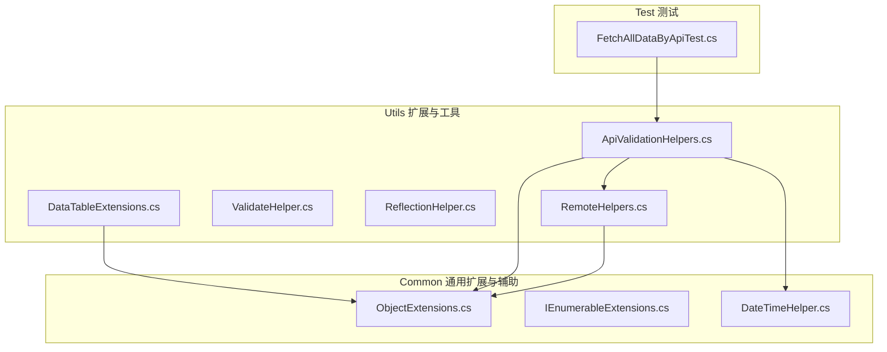
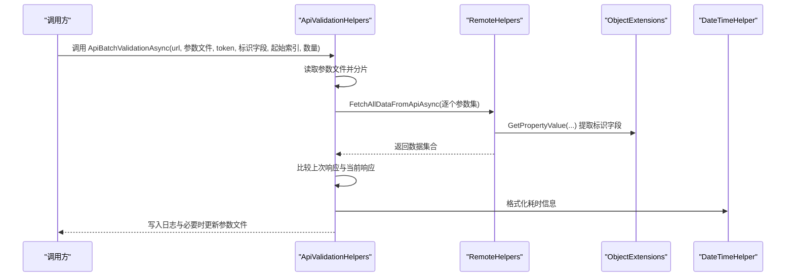
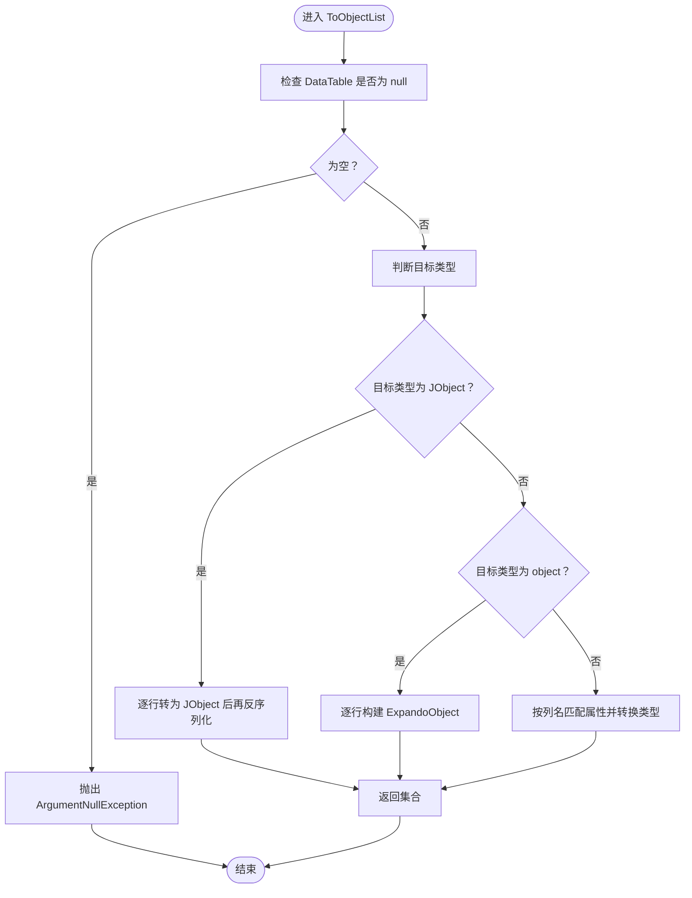
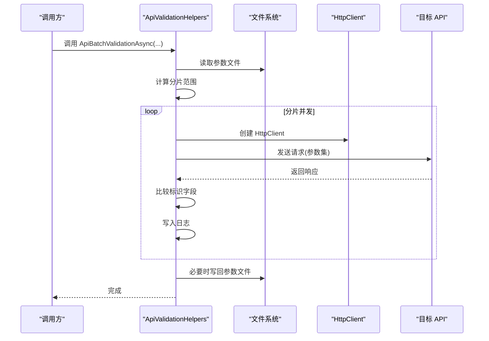
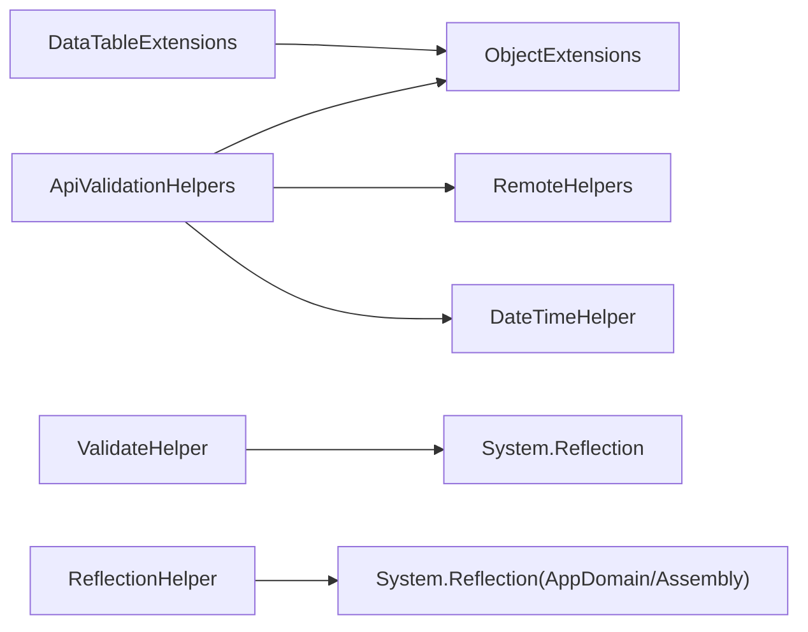

# 数据扩展工具

<cite>
**本文引用的文件列表**
- [DataTableExtensions.cs](file://Sylas.RemoteTasks.Utils/Extensions/DataTableExtensions.cs)
- [ApiValidationHelpers.cs](file://Sylas.RemoteTasks.Utils/ApiValidationHelpers.cs)
- [ValidateHelper.cs](file://Sylas.RemoteTasks.Utils/ValidateHelper.cs)
- [ReflectionHelper.cs](file://Sylas.RemoteTasks.Utils/ReflectionHelper.cs)
- [RemoteHelpers.cs](file://Sylas.RemoteTasks.Utils/RemoteHelpers.cs)
- [ObjectExtensions.cs](file://Sylas.RemoteTasks.Common/Extensions/ObjectExtensions.cs)
- [IEnumerableExtensions.cs](file://Sylas.RemoteTasks.Common/Extensions/IEnumerableExtensions.cs)
- [DateTimeHelper.cs](file://Sylas.RemoteTasks.Common/DateTimeHelper.cs)
- [FetchAllDataByApiTest.cs](file://Sylas.RemoteTasks.Test/Remote/FetchAllDataByApiTest.cs)
</cite>

## 目录
1. [简介](#简介)
2. [项目结构](#项目结构)
3. [核心组件](#核心组件)
4. [架构总览](#架构总览)
5. [组件详解](#组件详解)
6. [依赖关系分析](#依赖关系分析)
7. [性能考量](#性能考量)
8. [故障排查指南](#故障排查指南)
9. [结论](#结论)
10. [附录：最佳实践与常见问题](#附录最佳实践与常见问题)

## 简介
本文件聚焦于数据扩展工具，系统性解析以下能力：
- DataTableExtensions：将 DataTable 中的数据转换为强类型集合或动态对象集合，支持泛型映射、JObject 转换与动态对象转换。
- ApiValidationHelpers：批量校验 API 接口在多组参数下的稳定性与一致性，支持并发分片、日志记录与首次响应缓存。
- ValidateHelper：基于反射对对象属性进行非空校验，并可排除指定属性。
- ReflectionHelper：在运行时扫描项目程序集、按类名或基类筛选类型、创建实例，辅助动态装配与插件化开发。

文档提供参数与返回值说明、典型使用场景、性能优化建议与常见问题解决方案，帮助开发者在数据处理、接口验证与反射装配方面高效落地。

## 项目结构
围绕“数据扩展工具”的核心文件分布如下：
- Utils 层：扩展方法与工具类（DataTableExtensions、ApiValidationHelpers、ValidateHelper、ReflectionHelper、RemoteHelpers）
- Common 层：通用扩展（ObjectExtensions、IEnumerableExtensions）与辅助类（DateTimeHelper）
- Test 层：对 ApiValidationHelpers 的集成测试样例

图表来源
- [DataTableExtensions.cs](file://Sylas.RemoteTasks.Utils/Extensions/DataTableExtensions.cs#L1-L59)
- [ApiValidationHelpers.cs](file://Sylas.RemoteTasks.Utils/ApiValidationHelpers.cs#L1-L171)
- [ValidateHelper.cs](file://Sylas.RemoteTasks.Utils/ValidateHelper.cs#L1-L36)
- [ReflectionHelper.cs](file://Sylas.RemoteTasks.Utils/ReflectionHelper.cs#L1-L80)
- [RemoteHelpers.cs](file://Sylas.RemoteTasks.Utils/RemoteHelpers.cs#L1-L624)
- [ObjectExtensions.cs](file://Sylas.RemoteTasks.Common/Extensions/ObjectExtensions.cs#L1-L256)
- [IEnumerableExtensions.cs](file://Sylas.RemoteTasks.Common/Extensions/IEnumerableExtensions.cs#L1-L69)
- [DateTimeHelper.cs](file://Sylas.RemoteTasks.Common/DateTimeHelper.cs#L1-L79)
- [FetchAllDataByApiTest.cs](file://Sylas.RemoteTasks.Test/Remote/FetchAllDataByApiTest.cs#L56-L81)

章节来源
- [DataTableExtensions.cs](file://Sylas.RemoteTasks.Utils/Extensions/DataTableExtensions.cs#L1-L59)
- [ApiValidationHelpers.cs](file://Sylas.RemoteTasks.Utils/ApiValidationHelpers.cs#L1-L171)
- [ValidateHelper.cs](file://Sylas.RemoteTasks.Utils/ValidateHelper.cs#L1-L36)
- [ReflectionHelper.cs](file://Sylas.RemoteTasks.Utils/ReflectionHelper.cs#L1-L80)
- [RemoteHelpers.cs](file://Sylas.RemoteTasks.Utils/RemoteHelpers.cs#L1-L624)
- [ObjectExtensions.cs](file://Sylas.RemoteTasks.Common/Extensions/ObjectExtensions.cs#L1-L256)
- [IEnumerableExtensions.cs](file://Sylas.RemoteTasks.Common/Extensions/IEnumerableExtensions.cs#L1-L69)
- [DateTimeHelper.cs](file://Sylas.RemoteTasks.Common/DateTimeHelper.cs#L1-L79)
- [FetchAllDataByApiTest.cs](file://Sylas.RemoteTasks.Test/Remote/FetchAllDataByApiTest.cs#L56-L81)

## 核心组件
- DataTableExtensions：提供 ToObjectList 扩展方法，支持将 DataTable 行转换为指定类型、JObject 或动态对象集合。
- ApiValidationHelpers：提供 ApiBatchValidationAsync 方法，支持批量参数集并发校验、日志聚合与首次响应缓存写回。
- ValidateHelper：提供 ValidateArgumentIsNull 静态方法，基于反射遍历对象属性并校验非空，支持排除属性。
- ReflectionHelper：提供 GetCustomAssemblyTypes、GetTypeByClassName、GetTypes、CreateInstance 等方法，支持程序集扫描与实例创建。

章节来源
- [DataTableExtensions.cs](file://Sylas.RemoteTasks.Utils/Extensions/DataTableExtensions.cs#L11-L56)
- [ApiValidationHelpers.cs](file://Sylas.RemoteTasks.Utils/ApiValidationHelpers.cs#L18-L95)
- [ValidateHelper.cs](file://Sylas.RemoteTasks.Utils/ValidateHelper.cs#L9-L33)
- [ReflectionHelper.cs](file://Sylas.RemoteTasks.Utils/ReflectionHelper.cs#L26-L77)

## 架构总览
下图展示了数据扩展工具在系统中的位置与交互关系，重点体现 DataTable 扩展、API 校验与远程请求之间的协作。

图表来源
- [ApiValidationHelpers.cs](file://Sylas.RemoteTasks.Utils/ApiValidationHelpers.cs#L35-L95)
- [RemoteHelpers.cs](file://Sylas.RemoteTasks.Utils/RemoteHelpers.cs#L147-L226)
- [ObjectExtensions.cs](file://Sylas.RemoteTasks.Common/Extensions/ObjectExtensions.cs#L23-L54)
- [DateTimeHelper.cs](file://Sylas.RemoteTasks.Common/DateTimeHelper.cs#L16-L76)

## 组件详解

### DataTableExtensions 数据表扩展
- 功能概述
  - 将 DataTable 的行转换为指定类型的集合；当目标类型为 JObject 时，先转为 JObject 再反序列化为目标类型；当目标类型为 object 时，转换为动态对象集合；否则按列名与属性名匹配进行转换。
- 关键方法
  - ToObjectList(this DataTable source) where T : new()
- 参数与返回
  - 参数：source（DataTable 实例）
  - 返回：IEnumerable<T>，其中 T 为 new() 约束的类型
- 异常与边界
  - 当 source 为 null 时抛出 ArgumentNullException
  - 当转换失败时抛出异常
- 性能与复杂度
  - 时间复杂度：O(R*C)，R 为行数，C 为列数
  - 内存占用：与输出集合大小成正比
- 使用建议
  - 目标类型尽量与列名一致，避免不必要的类型转换
  - 大数据量建议分批处理，减少内存峰值

图表来源
- [DataTableExtensions.cs](file://Sylas.RemoteTasks.Utils/Extensions/DataTableExtensions.cs#L20-L56)

章节来源
- [DataTableExtensions.cs](file://Sylas.RemoteTasks.Utils/Extensions/DataTableExtensions.cs#L11-L56)

### ApiValidationHelpers API 验证助手
- 功能概述
  - 支持批量参数集并发校验 API 接口，记录“相同”“变更”“首次请求”等日志，并在检测到首次请求时将响应写回参数文件以供后续对比。
- 关键方法
  - ApiBatchValidationAsync(string url, string parametersFile, string authorizationHeaderToken, string responseIdentityField, int firstIndex, int count, int countPerClient = 10)
- 参数与返回
  - url：待测 API 地址
  - parametersFile：参数集 JSON 文件路径
  - authorizationHeaderToken：认证头 token
  - responseIdentityField：响应对象的标识字段（用于比较）
  - firstIndex/count：参数集范围控制
  - countPerClient：每个 HttpClient 执行的请求数
  - 返回：Task（无返回值）
- 处理流程
  - 读取参数文件，解析为参数集列表
  - 按 countPerClient 分片，创建多个任务并发执行
  - 逐个参数集调用远程接口，提取 responseIdentityField 并与上次结果比较
  - 记录日志并统计耗时，必要时将最新响应写回参数文件
- 性能与复杂度
  - 并发度由分片数量决定，I/O 密集场景收益显著
  - 日志聚合与文件写回为同步操作，建议在批量结束后统一处理
- 使用建议
  - 合理设置 countPerClient，避免超出后端限流
  - 使用独立的参数文件，便于回放与调试
  - 在高并发场景下注意网络与后端资源限制

图表来源
- [ApiValidationHelpers.cs](file://Sylas.RemoteTasks.Utils/ApiValidationHelpers.cs#L35-L95)
- [ApiValidationHelpers.cs](file://Sylas.RemoteTasks.Utils/ApiValidationHelpers.cs#L96-L168)

章节来源
- [ApiValidationHelpers.cs](file://Sylas.RemoteTasks.Utils/ApiValidationHelpers.cs#L18-L95)
- [ApiValidationHelpers.cs](file://Sylas.RemoteTasks.Utils/ApiValidationHelpers.cs#L96-L168)
- [FetchAllDataByApiTest.cs](file://Sylas.RemoteTasks.Test/Remote/FetchAllDataByApiTest.cs#L59-L68)

### ValidateHelper 数据验证助手
- 功能概述
  - 基于反射遍历对象属性，校验非空；支持排除指定属性，便于兼容可选字段。
- 关键方法
  - ValidateArgumentIsNull<T>(T? instance, List<string> excludeProps)
- 参数与返回
  - instance：待校验对象
  - excludeProps：排除校验的属性名列表
  - 返回：void（异常时抛出）
- 异常与边界
  - instance 为 null 时抛出 ArgumentNullException
  - 属性值为 null 时抛出 ArgumentNullException（属性名）
- 使用建议
  - 在业务入口处集中调用，确保输入完整性
  - excludeProps 仅用于可选字段，避免遗漏关键字段

章节来源
- [ValidateHelper.cs](file://Sylas.RemoteTasks.Utils/ValidateHelper.cs#L9-L33)

### ReflectionHelper 反射助手
- 功能概述
  - 扫描项目程序集，按类名或基类筛选类型，创建实例，支持主程序与当前程序集选择。
- 关键方法
  - GetCustomAssemblyTypes(ProjectAssembly assemblyType = ProjectAssembly.Main)
  - GetTypeByClassName(string className)
  - GetTypes(Type baseType)
  - CreateInstance(Type type, params object[] args)
- 参数与返回
  - assemblyType：选择主程序或当前程序集
  - className/baseType：类型筛选条件
  - args：构造函数参数
  - 返回：Type[] 或实例对象
- 使用建议
  - 优先使用 GetTypes(baseType) 进行接口或抽象类派生类型筛选
  - CreateInstance 适合工厂模式与插件化架构

章节来源
- [ReflectionHelper.cs](file://Sylas.RemoteTasks.Utils/ReflectionHelper.cs#L26-L77)

## 依赖关系分析
- DataTableExtensions 依赖 Common 的 ObjectExtensions（用于 DataRow 转字典等内部转换）
- ApiValidationHelpers 依赖 RemoteHelpers（远程请求）、ObjectExtensions（属性访问）、DateTimeHelper（耗时格式化）
- ValidateHelper 依赖反射（System.Reflection）进行属性遍历
- ReflectionHelper 依赖 AppDomain 与 Assembly 进行程序集扫描

图表来源
- [DataTableExtensions.cs](file://Sylas.RemoteTasks.Utils/Extensions/DataTableExtensions.cs#L1-L59)
- [ApiValidationHelpers.cs](file://Sylas.RemoteTasks.Utils/ApiValidationHelpers.cs#L1-L171)
- [RemoteHelpers.cs](file://Sylas.RemoteTasks.Utils/RemoteHelpers.cs#L1-L624)
- [ObjectExtensions.cs](file://Sylas.RemoteTasks.Common/Extensions/ObjectExtensions.cs#L1-L256)
- [DateTimeHelper.cs](file://Sylas.RemoteTasks.Common/DateTimeHelper.cs#L1-L79)
- [ValidateHelper.cs](file://Sylas.RemoteTasks.Utils/ValidateHelper.cs#L1-L36)
- [ReflectionHelper.cs](file://Sylas.RemoteTasks.Utils/ReflectionHelper.cs#L1-L80)

章节来源
- [DataTableExtensions.cs](file://Sylas.RemoteTasks.Utils/Extensions/DataTableExtensions.cs#L1-L59)
- [ApiValidationHelpers.cs](file://Sylas.RemoteTasks.Utils/ApiValidationHelpers.cs#L1-L171)
- [RemoteHelpers.cs](file://Sylas.RemoteTasks.Utils/RemoteHelpers.cs#L1-L624)
- [ObjectExtensions.cs](file://Sylas.RemoteTasks.Common/Extensions/ObjectExtensions.cs#L1-L256)
- [DateTimeHelper.cs](file://Sylas.RemoteTasks.Common/DateTimeHelper.cs#L1-L79)
- [ValidateHelper.cs](file://Sylas.RemoteTasks.Utils/ValidateHelper.cs#L1-L36)
- [ReflectionHelper.cs](file://Sylas.RemoteTasks.Utils/ReflectionHelper.cs#L1-L80)

## 性能考量
- DataTableExtensions
  - 大数据量转换建议分批处理，避免一次性创建大量对象导致 GC 压力
  - JObject 转换涉及序列化/反序列化，建议在必要时使用
- ApiValidationHelpers
  - 并发分片提升吞吐，但需关注后端限流与网络带宽
  - 日志聚合与文件写回为同步 I/O，建议批量完成后统一落盘
- ValidateHelper
  - 反射开销较高，建议在高频路径谨慎使用，或缓存属性元数据
- ReflectionHelper
  - 程序集扫描成本较高，建议缓存扫描结果并在应用生命周期内复用

## 故障排查指南
- DataTableExtensions
  - 现象：转换失败或属性值为 null
  - 排查：确认目标类型属性名与列名一致；检查 DBNull.Value 处理
- ApiValidationHelpers
  - 现象：参数范围越界或请求异常
  - 排查：核对 firstIndex/count 与文件参数数量；检查 token 与标识字段
  - 现象：日志中出现“首次请求”
  - 处理：确认是否需要将最新响应写回参数文件
- ValidateHelper
  - 现象：非空校验失败
  - 排查：确认 excludeProps 是否包含应校验字段
- ReflectionHelper
  - 现象：未找到类型
  - 排查：确认程序集命名空间前缀与类名；检查程序集是否已加载

章节来源
- [DataTableExtensions.cs](file://Sylas.RemoteTasks.Utils/Extensions/DataTableExtensions.cs#L20-L56)
- [ApiValidationHelpers.cs](file://Sylas.RemoteTasks.Utils/ApiValidationHelpers.cs#L96-L168)
- [ValidateHelper.cs](file://Sylas.RemoteTasks.Utils/ValidateHelper.cs#L18-L33)
- [ReflectionHelper.cs](file://Sylas.RemoteTasks.Utils/ReflectionHelper.cs#L51-L56)

## 结论
数据扩展工具提供了从数据转换、API 校验到反射装配的完整能力链路。通过合理使用 DataTableExtensions、ApiValidationHelpers、ValidateHelper 与 ReflectionHelper，可以在保证性能与可维护性的前提下，快速构建稳定的数据处理与验证流程。建议结合项目实际场景，采用分片并发、缓存与日志聚合等策略，持续优化整体吞吐与稳定性。

## 附录：最佳实践与常见问题
- 最佳实践
  - 数据转换：优先使用强类型映射，避免频繁 JObject 转换
  - API 校验：参数文件独立管理，分片并发时注意限流与幂等
  - 输入校验：在业务入口集中使用 ValidateHelper，明确排除字段
  - 反射装配：缓存程序集扫描结果，避免重复扫描
- 常见问题
  - 列名与属性名不一致导致映射失败
  - 参数范围越界引发异常
  - 首次请求响应未写回导致后续比较不一致
  - 反射性能瓶颈影响高频路径