# 文件操作工具

<cite>
**本文档引用的文件**
- [FileHelper.cs](file://Sylas.RemoteTasks.Utils/CommandExecutor/FileHelper.cs)
- [SshHelper.cs](file://Sylas.RemoteTasks.Utils/CommandExecutor/SshHelper.cs)
- [RemoteHelpers.cs](file://Sylas.RemoteTasks.Utils/RemoteHelpers.cs)
- [AiService.cs](file://Sylas.RemoteTasks.Utils/AiService.cs)
- [AiConfig.cs](file://Sylas.RemoteTasks.Utils/Dtos/AiConfig.cs)
- [DatabaseInfo.cs](file://Sylas.RemoteTasks.Database/SyncBase/DatabaseInfo.cs)
- [RegexConst.cs](file://Sylas.RemoteTasks.Common/RegexConst.cs)
- [PathConstants.cs](file://Sylas.RemoteTasks.Utils/Constants/PathConstants.cs)
- [OperationResult.cs](file://Sylas.RemoteTasks.Common/Dtos/OperationResult.cs)
- [CommandResult.cs](file://Sylas.RemoteTasks.Utils/CommandExecutor/CommandResult.cs)
- [SshHelperTest.cs](file://Sylas.RemoteTasks.Test/Remote/SshHelperTest.cs)
- [FileHelperTest.cs](file://Sylas.RemoteTasks.Test/FileOp/FileHelperTest.cs)
</cite>

## 更新摘要
**变更内容**
- AI 调用模式迁移：FileHelper 中的 AI 调用已迁移到新的 AiService.Instance.AskAsync 模式，移除了对 RemoteHelpers.AskAiAsync 的直接依赖
- 新增复杂文件修改能力：增强的模板引擎支持、条件语句处理、函数变量解析
- 新增数据库实体生成功能：基于数据库表结构自动生成实体类代码
- 新增模板处理系统：支持Razor引擎和自定义模板引擎的双引擎模式
- 扩展文件操作能力：增加文件属性提取、命名空间解析、WhereIf链构建等高级功能

## 目录
1. [简介](#简介)
2. [项目结构](#项目结构)
3. [核心组件](#核心组件)
4. [架构总览](#架构总览)
5. [详细组件分析](#详细组件分析)
6. [依赖关系分析](#依赖关系分析)
7. [性能考量](#性能考量)
8. [故障排查指南](#故障排查指南)
9. [结论](#结论)
10. [附录](#附录)

## 简介
本文件面向文件操作工具的使用者与维护者，系统性梳理本地文件操作助手 FileHelper 与远程 SSH/SFTP 文件操作工具 SshHelper 的实现与使用方法。内容涵盖：
- 本地文件读写、目录遍历、文件内容注入与模板化批量修改
- 远程文件传输（上传/下载）、远程命令执行、远程文件管理
- 复杂文件修改能力：模板引擎、条件语句、函数变量解析
- 数据库实体生成功能：自动代码生成、命名空间解析、WhereIf链构建
- AI辅助功能：新的 AiService.Instance.AskAsync 模式集成、智能代码生成
- 配置项、参数与返回值说明
- 安全注意事项与最佳实践
- 常见问题与解决方案

## 项目结构
围绕文件操作功能的关键文件组织如下：
- Utils 层提供通用工具：FileHelper（本地文件操作）、SshHelper（远程文件与命令）、AiService（AI服务）、RemoteHelpers（远程HTTP请求处理）
- Database 层提供数据库操作：DatabaseInfo（数据库信息管理）
- Common 层提供通用常量与扩展：RegexConst（正则常量）、OperationResult（操作结果模型）
- Test 层提供端到端测试样例：SshHelperTest、FileHelperTest

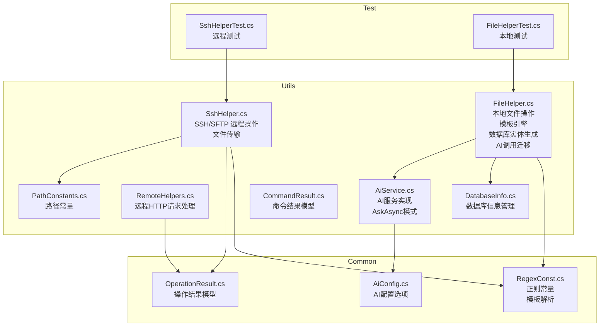

**图表来源**
- [FileHelper.cs:1-1679](file://Sylas.RemoteTasks.Utils/CommandExecutor/FileHelper.cs#L1-L1679)
- [SshHelper.cs:1-619](file://Sylas.RemoteTasks.Utils/CommandExecutor/SshHelper.cs#L1-L619)
- [AiService.cs:1-86](file://Sylas.RemoteTasks.Utils/AiService.cs#L1-L86)
- [RemoteHelpers.cs:1-464](file://Sylas.RemoteTasks.Utils/RemoteHelpers.cs#L1-L464)
- [AiConfig.cs:1-21](file://Sylas.RemoteTasks.Utils/Dtos/AiConfig.cs#L1-L21)
- [DatabaseInfo.cs:1-4195](file://Sylas.RemoteTasks.Database/SyncBase/DatabaseInfo.cs#L1-L4195)
- [RegexConst.cs:1-161](file://Sylas.RemoteTasks.Common/RegexConst.cs#L1-L161)
- [PathConstants.cs:1-25](file://Sylas.RemoteTasks.Utils/Constants/PathConstants.cs#L1-L25)
- [OperationResult.cs:1-52](file://Sylas.RemoteTasks.Common/Dtos/OperationResult.cs#L1-L52)
- [CommandResult.cs:1-38](file://Sylas.RemoteTasks.Utils/CommandExecutor/CommandResult.cs#L1-L38)
- [SshHelperTest.cs:1-59](file://Sylas.RemoteTasks.Test/Remote/SshHelperTest.cs#L1-L59)
- [FileHelperTest.cs:1-21](file://Sylas.RemoteTasks.Test/FileOp/FileHelperTest.cs#L1-L21)

## 核心组件
- FileHelper（本地文件操作助手）
  - 文件读写：同步/异步写入、内容存在性检查、编码检测
  - 目录操作：递归查找文件/目录、过滤条件与停止条件
  - 内容注入：在类文件中插入属性/方法代码、基于正则的行级插入
  - **新增** 复杂文件修改：模板化配置 + 变量解析 + 条件语句 + 函数调用
  - **新增** 数据库实体生成：自动代码生成、命名空间解析、WhereIf链构建
  - **更新** AI调用模式：迁移到 AiService.Instance.AskAsync 模式
  - JSON/文本处理：JSON 紧凑化、按路径提取 Records、正则分组搜索
- SshHelper（SSH/SFTP 远程文件操作）
  - 连接池：SSH/SFTP 连接池管理，最大连接数限制与并发控制
  - 命令执行：远程命令执行、脚本临时上传执行、清理
  - 文件传输：上传/下载目录与文件，支持 include/exclude 过滤
  - 远程文件管理：远程文件存在性检查、目录确保、远程文件列表
  - 文件处理流程：本地文件 → 远程上传 → 远程处理 → 下载结果 → 清理
- **新增** AiService（AI服务实现）
  - AI调用实现：统一的 AI 服务接口，支持 AskAsync 模式
  - 静态实例：AiService.Instance 供静态方法调用
  - 配置管理：AiConfig 配置选项（服务器地址、模型名称、API密钥）
- **新增** RemoteHelpers（远程HTTP请求处理）
  - HTTP请求处理：统一的HTTP客户端封装，支持多种请求格式
  - 数据获取：分页递归获取API数据，支持父子关系数据处理

**章节来源**
- [FileHelper.cs:27-1679](file://Sylas.RemoteTasks.Utils/CommandExecutor/FileHelper.cs#L27-L1679)
- [SshHelper.cs:18-619](file://Sylas.RemoteTasks.Utils/CommandExecutor/SshHelper.cs#L18-L619)
- [AiService.cs:16-86](file://Sylas.RemoteTasks.Utils/AiService.cs#L16-L86)
- [RemoteHelpers.cs:21-464](file://Sylas.RemoteTasks.Utils/RemoteHelpers.cs#L21-L464)

## 架构总览
FileHelper 与 SshHelper 分别承担本地与远程文件操作职责，通过统一的命令/结果模型进行集成。新增的 AiService 和 RemoteHelpers 进一步增强了整体能力，其中 FileHelper 的 AI 调用已迁移到新的 AiService.Instance.AskAsync 模式。

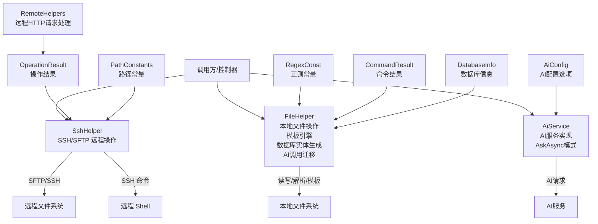

**图表来源**
- [FileHelper.cs:1-1679](file://Sylas.RemoteTasks.Utils/CommandExecutor/FileHelper.cs#L1-L1679)
- [SshHelper.cs:1-619](file://Sylas.RemoteTasks.Utils/CommandExecutor/SshHelper.cs#L1-L619)
- [AiService.cs:1-86](file://Sylas.RemoteTasks.Utils/AiService.cs#L1-L86)
- [AiConfig.cs:1-21](file://Sylas.RemoteTasks.Utils/Dtos/AiConfig.cs#L1-L21)
- [RemoteHelpers.cs:1-464](file://Sylas.RemoteTasks.Utils/RemoteHelpers.cs#L1-L464)
- [RegexConst.cs:1-161](file://Sylas.RemoteTasks.Common/RegexConst.cs#L1-L161)
- [OperationResult.cs:1-52](file://Sylas.RemoteTasks.Common/Dtos/OperationResult.cs#L1-L52)
- [CommandResult.cs:1-38](file://Sylas.RemoteTasks.Utils/CommandExecutor/CommandResult.cs#L1-L38)
- [PathConstants.cs:1-25](file://Sylas.RemoteTasks.Utils/Constants/PathConstants.cs#L1-L25)
- [DatabaseInfo.cs:1-4195](file://Sylas.RemoteTasks.Database/SyncBase/DatabaseInfo.cs#L1-L4195)

## 详细组件分析

### FileHelper 本地文件操作
- 文件读写
  - 异步写入：WriteAsync(file, input, append)
  - 内容存在性检查：IsContentExists(file, content)
  - 编码检测：GetFileEncoding(filename)
- 目录与文件遍历
  - 递归查找文件：FindFilesRecursive(dir, filter, stopRecursionConditionOfFiles, files)
  - 递归查找目录：GetDirectoriesRecursive(dir, filter, stopRecursionConditionOfDirs, dirs)
  - 解决方案目录与子目录：GetSolutionDirectory()、GetDirectoriesUnderSolution()
- 内容注入与修改
  - 插入代码片段：InsertContent(file, newContentHandler)
  - 类文件属性注入：InsertCodeProperty(classFile, code)
  - 方法内代码注入：InsertCode(classFile, methodName, codes, insertPositionPredicate, codesExistPredicate)
  - 属性列表提取：GetProperties(classFile)
- **新增** 复杂文件修改（模板化）
  - 执行配置：ExecuteAsync(commandContent)
  - 节点解析：ResolveNodeFromConfig(nodeConfig)
  - 变量解析：全局变量、函数变量、条件分支 #IF/#ELSE
  - 步骤执行：ModifyAsync(file, operationTitle, value, appendedLinePattern, operationType)
  - 操作类型：Append、Prepend、Replace、Override、Create
  - **新增** 模板引擎支持：Razor引擎和自定义模板引擎双模式
- **新增** 数据库实体生成辅助
  - 数据库表列信息 → 实体类代码：BuildEntityClassCodeAsync(connectionString, table)
  - 命名空间解析：ResolveTargetFileNamespace(...)
  - WhereIf 链构建：BuildWhereIfStatement(propsCode)
  - **更新** AI辅助：AskAiAsync(question) 已迁移到 AiService.Instance.AskAsync 模式

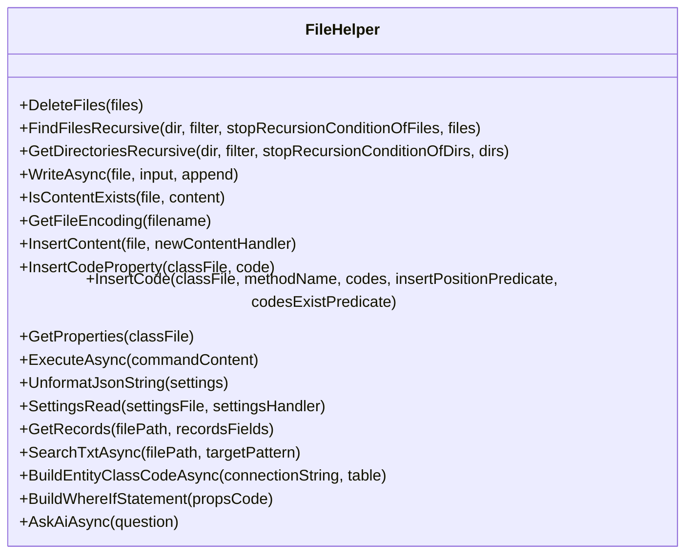

**图表来源**
- [FileHelper.cs:27-1679](file://Sylas.RemoteTasks.Utils/CommandExecutor/FileHelper.cs#L27-L1679)

**章节来源**
- [FileHelper.cs:27-1679](file://Sylas.RemoteTasks.Utils/CommandExecutor/FileHelper.cs#L27-L1679)

### SshHelper SSH/SFTP 远程文件操作
- 连接管理
  - 构造：SshHelper(host, port, username, privateKey)
  - 连接池：GetConnectionAsync()、GetSftpConnection()
  - 归还连接：ReturnConnection(...)
  - 资源释放：Dispose()
- 命令执行
  - 批量命令：RunCommandAsync(commandContent)
  - 命令块解析：支持 upload/download 与普通命令混合
  - 临时脚本：自动上传本地脚本至远程 temp 目录并执行，成功后清理
- 文件传输
  - 上传：UploadAsync(local, remotePath, includes, excludes)
    - 支持本地目录/文件上传，自动创建远程目录
    - 支持 include/exclude 过滤
  - 下载：DownloadAsync(local, remote, includes, excludes)
    - 支持远程目录/文件下载，自动创建本地目录
- 远程文件管理
  - 目录确保：EnsureDirectoryExistAsync(remoteDirectory, conn)
  - 远程文件列表：GetRemoteFiles(remotePath, includes, excludes)
  - 文件处理流程：HandleFile(localPathSourceFile, remotePathSourceFile, localPathResultFile, remotePathResultFile, command)

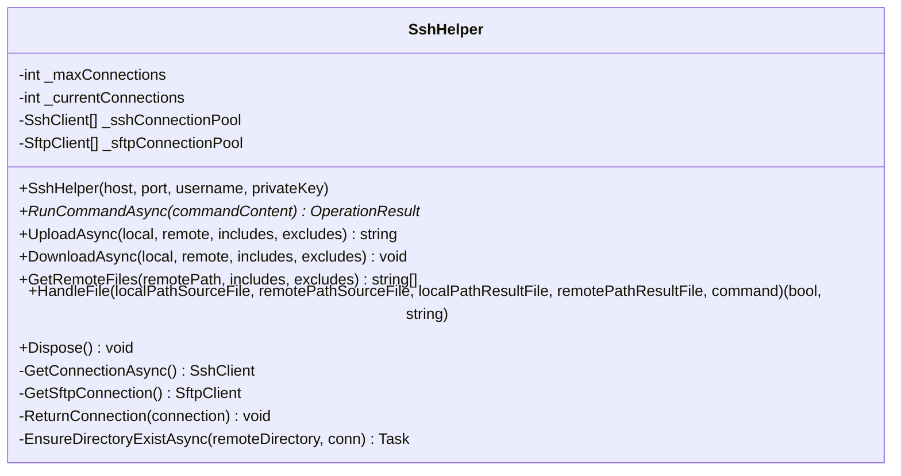

**图表来源**
- [SshHelper.cs:18-619](file://Sylas.RemoteTasks.Utils/CommandExecutor/SshHelper.cs#L18-L619)

**章节来源**
- [SshHelper.cs:18-619](file://Sylas.RemoteTasks.Utils/CommandExecutor/SshHelper.cs#L18-L619)

### AiService AI服务实现
- **新增** AI服务实现：统一的 AI 服务接口，支持 AskAsync 模式
- 静态实例：AiService.Instance 供静态方法调用
- 配置管理：AiConfig 配置选项（服务器地址、模型名称、API密钥）
- 请求处理：向AI模型提问并获取回答，支持无限超时设置
- 错误处理：配置验证、响应格式检查、异常抛出

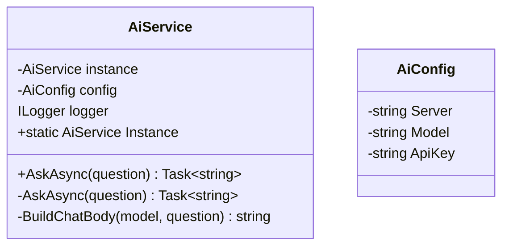

**图表来源**
- [AiService.cs:16-86](file://Sylas.RemoteTasks.Utils/AiService.cs#L16-L86)
- [AiConfig.cs:6-21](file://Sylas.RemoteTasks.Utils/Dtos/AiConfig.cs#L6-L21)

**章节来源**
- [AiService.cs:16-86](file://Sylas.RemoteTasks.Utils/AiService.cs#L16-L86)
- [AiConfig.cs:6-21](file://Sylas.RemoteTasks.Utils/Dtos/AiConfig.cs#L6-L21)

### RemoteHelpers 远程HTTP请求处理
- **新增** HTTP请求处理：统一的HTTP客户端封装，支持多种请求格式
- 数据获取：分页递归获取API数据，支持父子关系数据处理
- 请求配置：RequestConfig（URL、分页参数、认证信息、响应处理等）

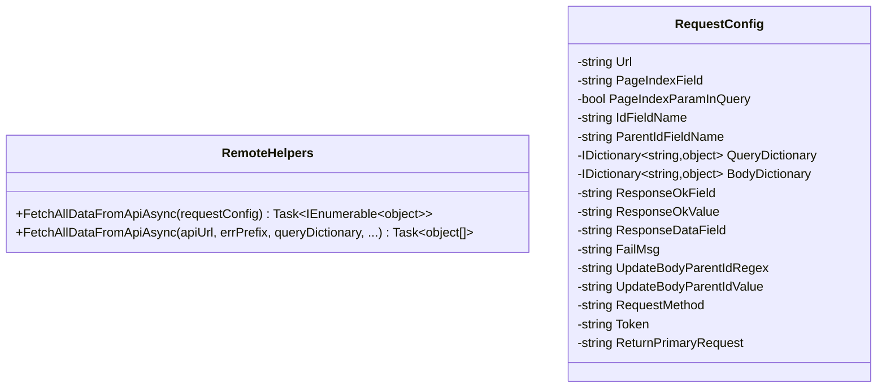

**图表来源**
- [RemoteHelpers.cs:21-464](file://Sylas.RemoteTasks.Utils/RemoteHelpers.cs#L21-L464)

**章节来源**
- [RemoteHelpers.cs:21-464](file://Sylas.RemoteTasks.Utils/RemoteHelpers.cs#L21-L464)

### 命令执行与结果模型
- OperationResult：远程操作结果（Succeed、Message、Data）
- CommandResult：本地命令执行结果（Succeed、Message、CommandExecuteNo）

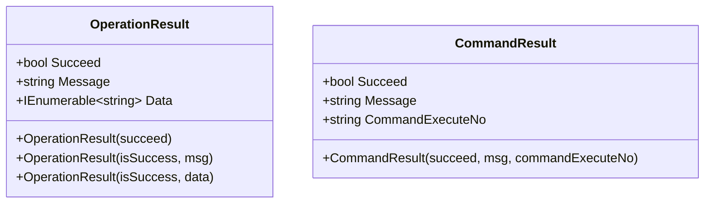

**图表来源**
- [OperationResult.cs:8-51](file://Sylas.RemoteTasks.Common/Dtos/OperationResult.cs#L8-L51)
- [CommandResult.cs:6-37](file://Sylas.RemoteTasks.Utils/CommandExecutor/CommandResult.cs#L6-L37)

**章节来源**
- [OperationResult.cs:1-52](file://Sylas.RemoteTasks.Common/Dtos/OperationResult.cs#L1-L52)
- [CommandResult.cs:1-38](file://Sylas.RemoteTasks.Utils/CommandExecutor/CommandResult.cs#L1-L38)

### 命令解析与正则常量
- RegexConst：提供命令解析、模板解析、分组匹配等常用正则
  - CommandRegex：upload/download 命令解析
  - PatternGroup：正则分组匹配
  - StringTmpl：字符串模板匹配
  - AssignmentRulesTmpl：赋值规则模板
- PathConstants：默认 SSH 私钥路径常量（跨平台）

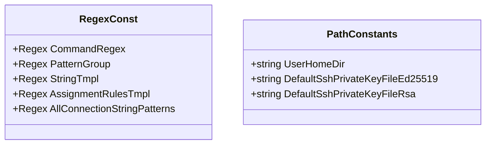

**图表来源**
- [RegexConst.cs:140-158](file://Sylas.RemoteTasks.Common/RegexConst.cs#L140-L158)
- [PathConstants.cs:11-23](file://Sylas.RemoteTasks.Utils/Constants/PathConstants.cs#L11-L23)

**章节来源**
- [RegexConst.cs:1-161](file://Sylas.RemoteTasks.Common/RegexConst.cs#L1-L161)
- [PathConstants.cs:1-25](file://Sylas.RemoteTasks.Utils/Constants/PathConstants.cs#L1-L25)

### API 流程示例

#### 本地文件批量修改（模板化）
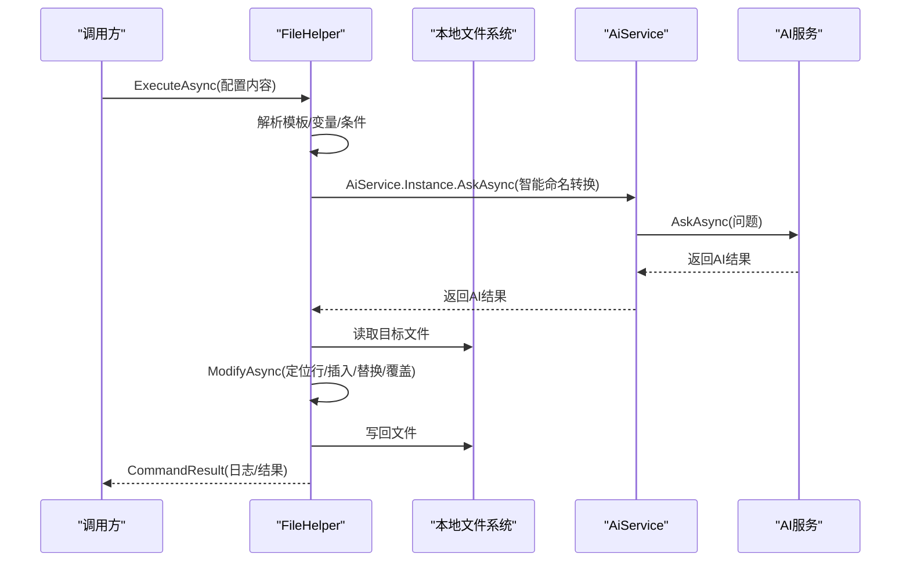

**图表来源**
- [FileHelper.cs:893-898](file://Sylas.RemoteTasks.Utils/CommandExecutor/FileHelper.cs#L893-L898)
- [AiService.cs:33-66](file://Sylas.RemoteTasks.Utils/AiService.cs#L33-L66)

#### 远程文件上传/下载
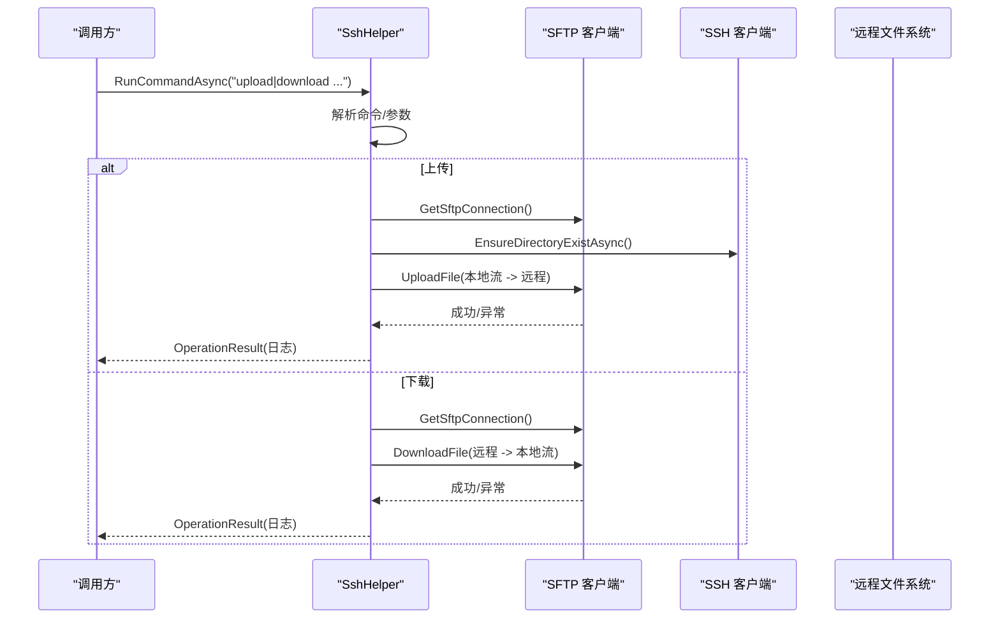

**图表来源**
- [SshHelper.cs:206-484](file://Sylas.RemoteTasks.Utils/CommandExecutor/SshHelper.cs#L206-L484)

## 依赖关系分析
- FileHelper 依赖
  - RegexConst：命令解析、模板解析、正则匹配
  - DatabaseInfo：数据库信息获取、表结构分析
  - AiService：AI服务集成、智能代码生成
  - RemoteHelpers：HTTP请求处理（间接依赖）
  - Common 扩展：字符串/集合扩展
  - System.IO、System.Text、System.Text.RegularExpressions
- SshHelper 依赖
  - Renci.SshNet：SSH/SFTP 客户端
  - RegexConst：命令解析
  - OperationResult：结果封装
  - PathConstants：默认私钥路径
- **新增** AiService 依赖
  - IHttpRequestPipeline：HTTP请求管道
  - AiConfig：AI配置选项
  - ILogger：日志记录
- **新增** RemoteHelpers 依赖
  - HttpClient：HTTP请求处理
  - Newtonsoft.Json：JSON序列化
  - Common 扩展：字符串/集合扩展

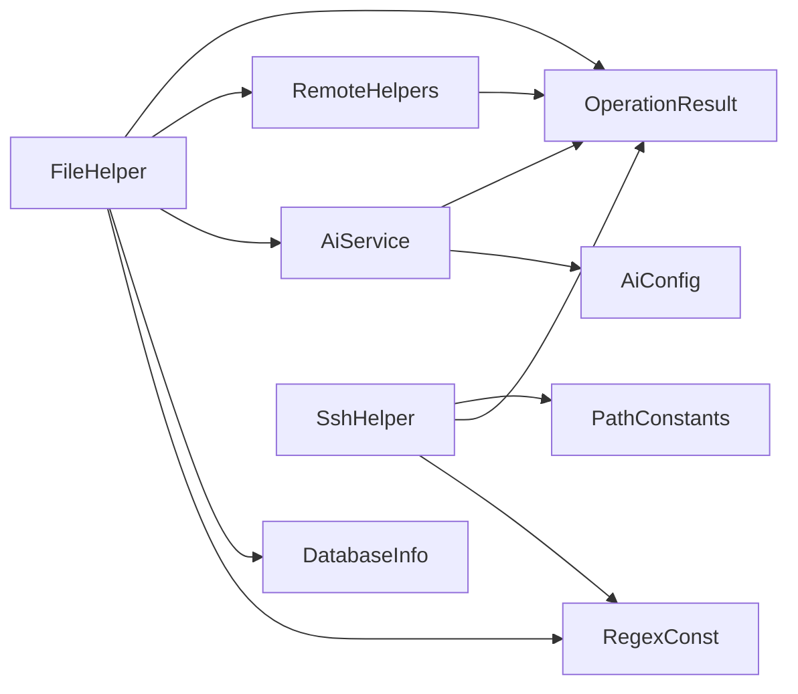

**图表来源**
- [FileHelper.cs:1-22](file://Sylas.RemoteTasks.Utils/CommandExecutor/FileHelper.cs#L1-L22)
- [SshHelper.cs:1-11](file://Sylas.RemoteTasks.Utils/CommandExecutor/SshHelper.cs#L1-L11)
- [AiService.cs:1-86](file://Sylas.RemoteTasks.Utils/AiService.cs#L1-L86)
- [AiConfig.cs:1-21](file://Sylas.RemoteTasks.Utils/Dtos/AiConfig.cs#L1-L21)
- [RemoteHelpers.cs:1-464](file://Sylas.RemoteTasks.Utils/RemoteHelpers.cs#L1-L464)
- [RegexConst.cs:1-161](file://Sylas.RemoteTasks.Common/RegexConst.cs#L1-L161)
- [OperationResult.cs:1-52](file://Sylas.RemoteTasks.Common/Dtos/OperationResult.cs#L1-L52)
- [PathConstants.cs:1-25](file://Sylas.RemoteTasks.Utils/Constants/PathConstants.cs#L1-L25)
- [DatabaseInfo.cs:1-4195](file://Sylas.RemoteTasks.Database/SyncBase/DatabaseInfo.cs#L1-L4195)

**章节来源**
- [FileHelper.cs:1-22](file://Sylas.RemoteTasks.Utils/CommandExecutor/FileHelper.cs#L1-L22)
- [SshHelper.cs:1-11](file://Sylas.RemoteTasks.Utils/CommandExecutor/SshHelper.cs#L1-L11)
- [AiService.cs:1-86](file://Sylas.RemoteTasks.Utils/AiService.cs#L1-L86)
- [AiConfig.cs:1-21](file://Sylas.RemoteTasks.Utils/Dtos/AiConfig.cs#L1-L21)
- [RemoteHelpers.cs:1-464](file://Sylas.RemoteTasks.Utils/RemoteHelpers.cs#L1-L464)

## 性能考量
- 连接池与并发
  - SshHelper 使用连接池与信号量限制最大连接数，避免资源耗尽
  - 建议合理设置并发任务数量，避免频繁创建/销毁连接
- I/O 优化
  - FileHelper 使用异步写入 WriteAsync，减少阻塞
  - 上传/下载采用流式处理，避免一次性加载大文件
  - **新增** 模板引擎缓存：RazorEngine 模板缓存机制，避免重复编译
- 正则与遍历
  - 递归遍历时建议提供合理的过滤条件与停止条件，避免无谓扫描
  - 正则匹配应尽量精确，避免回溯风暴
- **新增** AI服务优化
  - AI请求超时设置：Timeout.InfiniteTimeSpan 避免超时中断
  - 请求头缓存：Authorization 头部设置一次即可
  - **更新** AI调用模式：AiService.Instance.AskAsync 模式提供更好的性能和稳定性

## 故障排查指南
- 远程连接失败
  - 检查主机、端口、用户名与私钥配置
  - 确认私钥路径正确（PathConstants 默认路径）
  - 观察连接池状态与最大连接数限制
- 上传/下载异常
  - 确认本地路径存在且权限足够
  - 远程路径不存在时，先确保目录存在（EnsureDirectoryExistAsync）
  - 使用 include/exclude 过滤排除不需要的文件
- 命令执行失败
  - 临时脚本上传后需赋予可执行权限（chmod +x）
  - 成功后自动清理远程临时脚本
- **新增** 模板引擎问题
  - 确认 ENGINE: Razor 指令正确设置
  - 检查模板变量语法：{{varName}} 和 {varName}
  - 验证条件语句格式：#IF:Variable.Contains('substring').Content#IFEND
- **新增** AI服务问题
  - 检查 AiConfig 配置：Server、Model、ApiKey
  - 确认网络连接和API可用性
  - 查看请求超时设置是否合适
  - **更新** 确认 AiService.Instance 已正确初始化
- **新增** 数据库实体生成问题
  - 确认数据库连接字符串正确
  - 检查表结构和字段信息
  - 验证命名空间解析逻辑

**章节来源**
- [SshHelperTest.cs:16-56](file://Sylas.RemoteTasks.Test/Remote/SshHelperTest.cs#L16-L56)
- [FileHelperTest.cs:8-21](file://Sylas.RemoteTasks.Test/FileOp/FileHelperTest.cs#L8-L21)
- [SshHelper.cs:36-120](file://Sylas.RemoteTasks.Utils/CommandExecutor/SshHelper.cs#L36-L120)
- [FileHelper.cs:1375-1442](file://Sylas.RemoteTasks.Utils/CommandExecutor/FileHelper.cs#L1375-L1442)
- [AiService.cs:33-66](file://Sylas.RemoteTasks.Utils/AiService.cs#L33-L66)

## 结论
FileHelper 与 SshHelper 提供了从本地到远程的完整文件操作能力。新增的复杂文件修改能力、数据库实体生成功能和 AI 服务集成为系统带来了更强大的自动化能力。**重要更新**：FileHelper 的 AI 调用已成功迁移到新的 AiService.Instance.AskAsync 模式，提供了更好的性能、稳定性和可维护性。通过合理的配置与参数设置、严格的错误处理与安全实践，可在复杂场景中稳定高效地完成文件操作任务。

## 附录

### 配置与参数速查
- FileHelper.ExecuteAsync(commandContent)
  - 支持 ENGINE: Razor 或默认模板引擎
  - 全局变量与函数变量解析
  - 操作节点：TargetFilePattern、Value、OperationType、LinePattern
  - **新增** 条件语句：#IF:Variable.Contains('substring').Content#IFEND
- SshHelper.RunCommandAsync(commandContent)
  - upload local remote [-include=...] [-exclude=...]
  - download local remote [-include=...] [-exclude=...]
  - 混合普通命令执行（自动上传临时脚本）
- SshHelper.HandleFile(...)
  - 本地源文件路径、远程源文件路径
  - 本地结果文件路径、远程结果文件路径
  - 远程处理命令
- **新增** AiService.AskAsync(question)
  - AI服务配置：AiConfig.Server、AiConfig.Model、AiConfig.ApiKey
  - 问答请求：支持系统提示词和用户问题
  - 静态实例：AiService.Instance 供静态方法调用
- **新增** 数据库实体生成
  - BuildEntityClassCodeAsync(connectionString, table)
  - 自动类型推断和特性生成
  - WhereIf链构建和命名空间解析

**章节来源**
- [FileHelper.cs:587-747](file://Sylas.RemoteTasks.Utils/CommandExecutor/FileHelper.cs#L587-L747)
- [SshHelper.cs:206-318](file://Sylas.RemoteTasks.Utils/CommandExecutor/SshHelper.cs#L206-L318)
- [AiService.cs:33-66](file://Sylas.RemoteTasks.Utils/AiService.cs#L33-L66)
- [AiConfig.cs:6-21](file://Sylas.RemoteTasks.Utils/Dtos/AiConfig.cs#L6-L21)
- [RegexConst.cs:140-146](file://Sylas.RemoteTasks.Common/RegexConst.cs#L140-L146)
- [DatabaseInfo.cs:1-4195](file://Sylas.RemoteTasks.Database/SyncBase/DatabaseInfo.cs#L1-L4195)