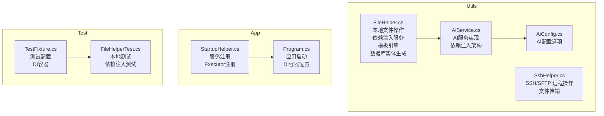
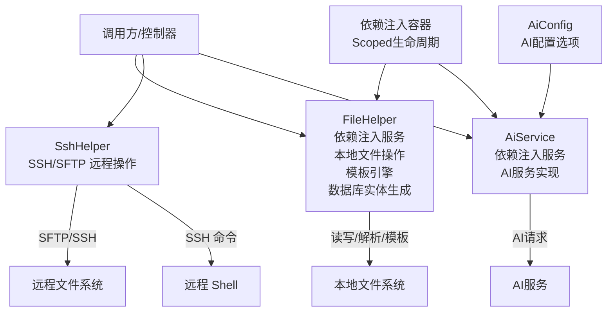
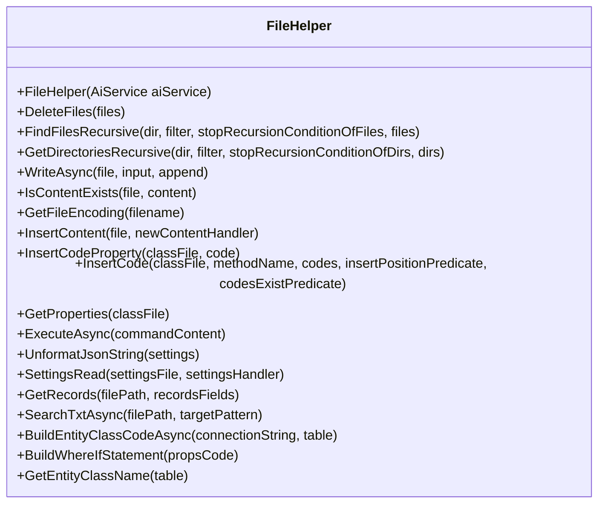
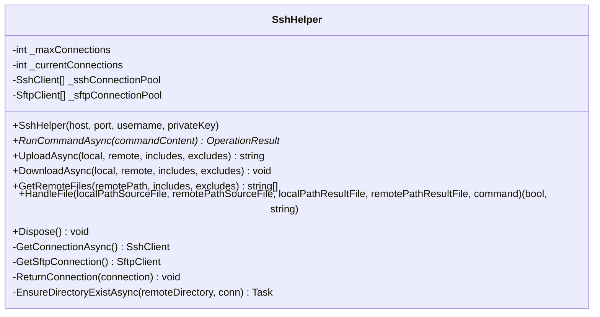
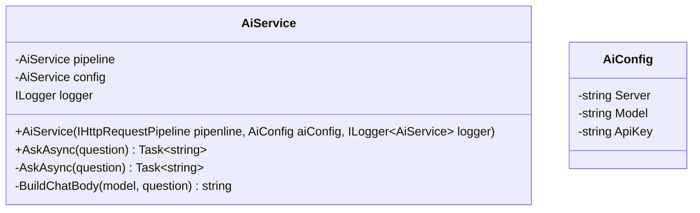
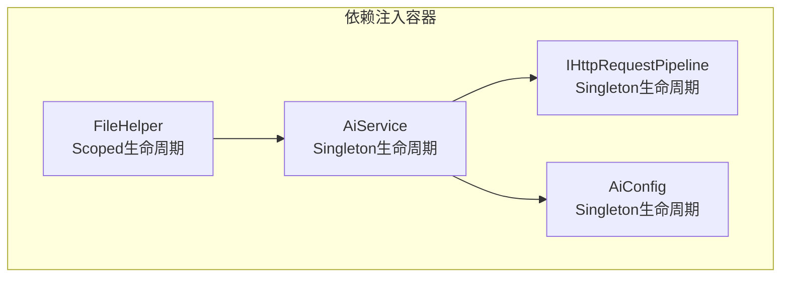
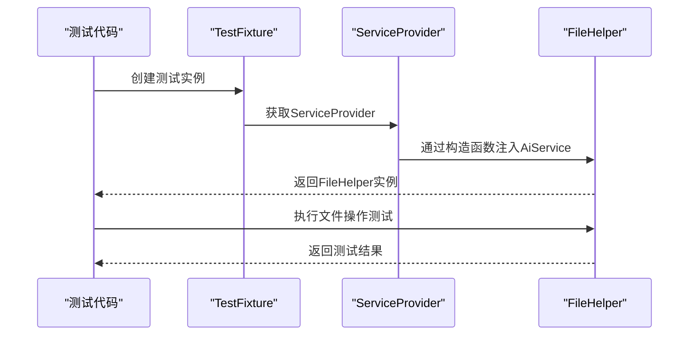

# 文件操作工具

<cite>
**本文档引用的文件**
- [FileHelper.cs](file://Sylas.RemoteTasks.Utils/CommandExecutor/FileHelper.cs)
- [SshHelper.cs](file://Sylas.RemoteTasks.Utils/CommandExecutor/SshHelper.cs)
- [AiService.cs](file://Sylas.RemoteTasks.Utils/AiService.cs)
- [AiConfig.cs](file://Sylas.RemoteTasks.Utils/Dtos/AiConfig.cs)
- [StartupHelper.cs](file://Sylas.RemoteTasks.App/Helpers/StartupHelper.cs)
- [Program.cs](file://Sylas.RemoteTasks.App/Program.cs)
- [TestFixture.cs](file://Sylas.RemoteTasks.Test/TestFixture.cs)
- [FileHelperTest.cs](file://Sylas.RemoteTasks.Test/FileOp/FileHelperTest.cs)
</cite>

## 更新摘要
**变更内容**
- 重大架构重构：FileHelper从静态工具类重构为依赖注入服务，通过构造函数注入AiService依赖
- 移除AiService.Instance全局访问模式，采用标准的依赖注入架构
- 增加Scoped生命周期管理，提升服务可测试性和可维护性
- 更新测试配置以支持新的依赖注入架构

## 目录
1. [简介](#简介)
2. [项目结构](#项目结构)
3. [核心组件](#核心组件)
4. [架构总览](#架构总览)
5. [详细组件分析](#详细组件分析)
6. [依赖注入架构](#依赖注入架构)
7. [测试配置更新](#测试配置更新)
8. [性能考量](#性能考量)
9. [故障排查指南](#故障排查指南)
10. [结论](#结论)
11. [附录](#附录)

## 简介
本文件面向文件操作工具的使用者与维护者，系统性梳理本地文件操作助手 FileHelper 与远程 SSH/SFTP 文件操作工具 SshHelper 的实现与使用方法。本次更新重点反映了FileHelper从静态工具类到依赖注入服务的重大架构重构，以及相关的测试配置更新。

内容涵盖：
- 本地文件读写、目录遍历、文件内容注入与模板化批量修改
- 远程文件传输（上传/下载）、远程命令执行、远程文件管理
- 复杂文件修改能力：模板引擎、条件语句、函数变量解析
- 数据库实体生成功能：自动代码生成、命名空间解析、WhereIf链构建
- AI辅助功能：新的依赖注入架构集成、智能代码生成
- 配置项、参数与返回值说明
- 安全注意事项与最佳实践
- 常见问题与解决方案

## 项目结构
围绕文件操作功能的关键文件组织如下：
- Utils 层提供通用工具：FileHelper（本地文件操作，现为依赖注入服务）、SshHelper（远程文件与命令）、AiService（AI服务，依赖注入实现）
- App 层提供应用配置：StartupHelper（服务注册）、Program（应用启动）
- Test 层提供端到端测试样例：TestFixture（测试配置）、FileHelperTest（文件操作测试）

**图表来源**
- [FileHelper.cs:28-29](file://Sylas.RemoteTasks.Utils/CommandExecutor/FileHelper.cs#L28-L29)
- [AiService.cs:14-18](file://Sylas.RemoteTasks.Utils/AiService.cs#L14-L18)
- [StartupHelper.cs:90-101](file://Sylas.RemoteTasks.App/Helpers/StartupHelper.cs#L90-L101)
- [Program.cs:25-28](file://Sylas.RemoteTasks.App/Program.cs#L25-L28)
- [TestFixture.cs:27-67](file://Sylas.RemoteTasks.Test/TestFixture.cs#L27-L67)

## 核心组件
- **更新** FileHelper（本地文件操作助手，现为依赖注入服务）
  - 构造函数注入：FileHelper(AiService aiService) - 通过依赖注入获取AI服务
  - 文件读写：同步/异步写入、内容存在性检查、编码检测
  - 目录操作：递归查找文件/目录、过滤条件与停止条件
  - 内容注入：在类文件中插入属性/方法代码、基于正则的行级插入
  - 复杂文件修改：模板化配置 + 变量解析 + 条件语句 + 函数调用
  - 数据库实体生成：自动代码生成、命名空间解析、WhereIf链构建
  - **更新** AI调用模式：迁移到依赖注入的AiService实例，移除AiService.Instance全局访问
  - JSON/文本处理：JSON 紧凑化、按路径提取 Records、正则分组搜索
- SshHelper（SSH/SFTP 远程文件操作）
  - 连接池：SSH/SFTP 连接池管理，最大连接数限制与并发控制
  - 命令执行：远程命令执行、脚本临时上传执行、清理
  - 文件传输：上传/下载目录与文件，支持 include/exclude 过滤
  - 远程文件管理：远程文件存在性检查、目录确保、远程文件列表
  - 文件处理流程：本地文件 → 远程上传 → 远程处理 → 下载结果 → 清理
- **更新** AiService（AI服务实现，现为依赖注入服务）
  - 构造函数注入：AiService(IHttpRequestPipeline pipenline, AiConfig aiConfig, ILogger<AiService> logger)
  - AI调用实现：统一的 AI 服务接口，支持 AskAsync 模式
  - 配置管理：AiConfig 配置选项（服务器地址、模型名称、API密钥）
  - 请求处理：向AI模型提问并获取回答，支持无限超时设置
  - 错误处理：配置验证、响应格式检查、异常抛出

**章节来源**
- [FileHelper.cs:28-29](file://Sylas.RemoteTasks.Utils/CommandExecutor/FileHelper.cs#L28-L29)
- [FileHelper.cs:881](file://Sylas.RemoteTasks.Utils/CommandExecutor/FileHelper.cs#L881)
- [AiService.cs:14-18](file://Sylas.RemoteTasks.Utils/AiService.cs#L14-L18)

## 架构总览
FileHelper 与 SshHelper 分别承担本地与远程文件操作职责，通过统一的命令/结果模型进行集成。新增的依赖注入架构使得FileHelper能够通过构造函数注入AiService依赖，替代了原有的AiService.Instance全局访问模式。

**图表来源**
- [FileHelper.cs:28-29](file://Sylas.RemoteTasks.Utils/CommandExecutor/FileHelper.cs#L28-L29)
- [AiService.cs:14-18](file://Sylas.RemoteTasks.Utils/AiService.cs#L14-L18)
- [StartupHelper.cs:90-101](file://Sylas.RemoteTasks.App/Helpers/StartupHelper.cs#L90-L101)

## 详细组件分析

### FileHelper 本地文件操作（依赖注入架构）
- **更新** 构造函数注入
  - FileHelper(AiService aiService) - 通过依赖注入获取AI服务实例
  - 移除了静态方法中的AiService.Instance全局访问
  - 支持Scoped生命周期管理，提升测试友好性
- 文件读写
  - 异步写入：WriteAsync(file, input, append)
  - 内容存在性检查：IsContentExists(file, content)
  - 编码检测：GetFileEncoding(filename)
- 目录与文件遍历
  - 递归查找文件：FindFilesRecursive(dir, filter, stopRecursionConditionOfFiles, files)
  - 递归查找目录：GetDirectoriesRecursive(dir, filter, stopRecursionConditionOfDirs, dirs)
  - 解决方案目录与子目录：GetSolutionDirectory()、GetDirectoriesUnderSolution()
- 内容注入与修改
  - 插入代码片段：InsertContent(file, newContentHandler)
  - 类文件属性注入：InsertCodeProperty(classFile, code)
  - 方法内代码注入：InsertCode(classFile, methodName, codes, insertPositionPredicate, codesExistPredicate)
  - 属性列表提取：GetProperties(classFile)
- 复杂文件修改（模板化）
  - 执行配置：ExecuteAsync(commandContent)
  - 节点解析：ResolveNodeFromConfig(nodeConfig)
  - 变量解析：全局变量、函数变量、条件分支 #IF/#ELSE
  - 步骤执行：ModifyAsync(file, operationTitle, value, appendedLinePattern, operationType)
  - 操作类型：Append、Prepend、Replace、Override、Create
- **更新** 数据库实体生成辅助
  - 数据库表列信息 → 实体类代码：BuildEntityClassCodeAsync(connectionString, table)
  - 命名空间解析：ResolveTargetFileNamespace(...)
  - WhereIf 链构建：BuildWhereIfStatement(propsCode)
  - **更新** AI辅助：GetEntityClassName(table) 已迁移到依赖注入的AiService实例

**图表来源**
- [FileHelper.cs:28-29](file://Sylas.RemoteTasks.Utils/CommandExecutor/FileHelper.cs#L28-L29)
- [FileHelper.cs:881](file://Sylas.RemoteTasks.Utils/CommandExecutor/FileHelper.cs#L881)

**章节来源**
- [FileHelper.cs:28-29](file://Sylas.RemoteTasks.Utils/CommandExecutor/FileHelper.cs#L28-L29)
- [FileHelper.cs:881](file://Sylas.RemoteTasks.Utils/CommandExecutor/FileHelper.cs#L881)

### SshHelper SSH/SFTP 远程文件操作
- 连接管理
  - 构造：SshHelper(host, port, username, privateKey)
  - 连接池：GetConnectionAsync()、GetSftpConnection()
  - 归还连接：ReturnConnection(...)
  - 资源释放：Dispose()
- 命令执行
  - 批量命令：RunCommandAsync(commandContent)
  - 命令块解析：支持 upload/download 与普通命令混合
  - 临时脚本：自动上传本地脚本至远程 temp 目录并执行，成功后清理
- 文件传输
  - 上传：UploadAsync(local, remotePath, includes, excludes)
    - 支持本地目录/文件上传，自动创建远程目录
    - 支持 include/exclude 过滤
  - 下载：DownloadAsync(local, remotePath, includes, excludes)
    - 支持远程目录/文件下载，自动创建本地目录
- 远程文件管理
  - 目录确保：EnsureDirectoryExistAsync(remoteDirectory, conn)
  - 远程文件列表：GetRemoteFiles(remotePath, includes, excludes)
  - 文件处理流程：HandleFile(localPathSourceFile, remotePathSourceFile, localPathResultFile, remotePathResultFile, command)

**图表来源**
- [SshHelper.cs:18-619](file://Sylas.RemoteTasks.Utils/CommandExecutor/SshHelper.cs#L18-L619)

**章节来源**
- [SshHelper.cs:18-619](file://Sylas.RemoteTasks.Utils/CommandExecutor/SshHelper.cs#L18-L619)

### AiService AI服务实现（依赖注入架构）
- **更新** 构造函数注入
  - AiService(IHttpRequestPipeline pipenline, AiConfig aiConfig, ILogger<AiService> logger)
  - 通过依赖注入获取HTTP请求管道、AI配置和日志记录器
  - 移除了静态实例模式，采用标准的依赖注入架构
- 配置管理：AiConfig 配置选项（服务器地址、模型名称、API密钥）
- 请求处理：向AI模型提问并获取回答，支持无限超时设置
- 错误处理：配置验证、响应格式检查、异常抛出

**图表来源**
- [AiService.cs:14-18](file://Sylas.RemoteTasks.Utils/AiService.cs#L14-L18)
- [AiConfig.cs:6-21](file://Sylas.RemoteTasks.Utils/Dtos/AiConfig.cs#L6-L21)

**章节来源**
- [AiService.cs:14-18](file://Sylas.RemoteTasks.Utils/AiService.cs#L14-L18)
- [AiConfig.cs:6-21](file://Sylas.RemoteTasks.Utils/Dtos/AiConfig.cs#L6-L21)

## 依赖注入架构
- **更新** 服务注册
  - StartupHelper.AddExecutor()：通过ExecutorAttribute自动注册依赖注入服务
  - Program.cs：应用启动时配置AI服务相关配置
  - TestFixture：测试环境中配置依赖注入容器
- 生命周期管理
  - FileHelper：Scoped生命周期，适合Web请求上下文
  - AiService：Singleton生命周期，全局共享
  - IHttpRequestPipeline：Singleton生命周期
- 依赖关系
  - FileHelper依赖AiService（构造函数注入）
  - AiService依赖IHttpRequestPipeline、AiConfig、ILogger
  - 所有服务通过依赖注入容器管理

**图表来源**
- [StartupHelper.cs:90-101](file://Sylas.RemoteTasks.App/Helpers/StartupHelper.cs#L90-L101)
- [Program.cs:25-28](file://Sylas.RemoteTasks.App/Program.cs#L25-L28)
- [TestFixture.cs:57-67](file://Sylas.RemoteTasks.Test/TestFixture.cs#L57-L67)

**章节来源**
- [StartupHelper.cs:90-101](file://Sylas.RemoteTasks.App/Helpers/StartupHelper.cs#L90-L101)
- [Program.cs:25-28](file://Sylas.RemoteTasks.App/Program.cs#L25-L28)
- [TestFixture.cs:57-67](file://Sylas.RemoteTasks.Test/TestFixture.cs#L57-L67)

## 测试配置更新
- **更新** TestFixture配置
  - 使用ServiceCollection配置依赖注入容器
  - 注册AiConfig、AiService、IHttpRequestPipeline等服务
  - 设置FileHelper为Scoped生命周期
  - 提供ServiceProvider供测试使用
- **更新** FileHelperTest测试
  - 通过ServiceProvider获取FileHelper实例
  - 使用IServiceScopeFactory创建作用域
  - 测试文件操作功能，验证依赖注入架构
- **更新** 服务注册方式
  - StartupHelper.AddExecutor()：自动注册所有带ExecutorAttribute的服务
  - Program.cs：应用启动时自动配置服务
  - TestFixture：测试环境独立配置服务

**图表来源**
- [TestFixture.cs:15-25](file://Sylas.RemoteTasks.Test/TestFixture.cs#L15-L25)
- [FileHelperTest.cs:432-444](file://Sylas.RemoteTasks.Test/FileOp/FileHelperTest.cs#L432-L444)

**章节来源**
- [TestFixture.cs:15-25](file://Sylas.RemoteTasks.Test/TestFixture.cs#L15-L25)
- [FileHelperTest.cs:432-444](file://Sylas.RemoteTasks.Test/FileOp/FileHelperTest.cs#L432-L444)

## 性能考量
- **更新** 依赖注入性能
  - Scoped生命周期：FileHelper在每次请求中创建，避免线程安全问题
  - Singleton生命周期：AiService全局共享，减少内存占用
  - 依赖注入容器：优化服务解析性能
- 连接池与并发
  - SshHelper 使用连接池与信号量限制最大连接数，避免资源耗尽
  - 建议合理设置并发任务数量，避免频繁创建/销毁连接
- I/O 优化
  - FileHelper 使用异步写入 WriteAsync，减少阻塞
  - 上传/下载采用流式处理，避免一次性加载大文件
  - **新增** 模板引擎缓存：RazorEngine 模板缓存机制，避免重复编译
- 正则与遍历
  - 递归遍历时建议提供合理的过滤条件与停止条件，避免无谓扫描
  - 正则匹配应尽量精确，避免回溯风暴
- **更新** AI服务优化
  - 依赖注入架构：避免静态实例带来的线程安全问题
  - 请求头缓存：Authorization 头部设置一次即可
  - **更新** AI调用模式：依赖注入的AiService实例提供更好的性能和稳定性

## 故障排查指南
- **更新** 依赖注入问题
  - 检查服务注册：确保FileHelper和AiService正确注册到依赖注入容器
  - 验证生命周期：确认FileHelper为Scoped，AiService为Singleton
  - 作用域管理：确保在正确的服务作用域内获取服务实例
- 远程连接失败
  - 检查主机、端口、用户名与私钥配置
  - 确认私钥路径正确（PathConstants 默认路径）
  - 观察连接池状态与最大连接数限制
- 上传/下载异常
  - 确认本地路径存在且权限足够
  - 远程路径不存在时，先确保目录存在（EnsureDirectoryExistAsync）
  - 使用 include/exclude 过滤排除不需要的文件
- 命令执行失败
  - 临时脚本上传后需赋予可执行权限（chmod +x）
  - 成功后自动清理远程临时脚本
- **新增** 模板引擎问题
  - 确认 ENGINE: Razor 指令正确设置
  - 检查模板变量语法：{{varName}} 和 {varName}
  - 验证条件语句格式：#IF:Variable.Contains('substring').Content#IFEND
- **更新** AI服务问题
  - 检查 AiConfig 配置：Server、Model、ApiKey
  - 确认依赖注入容器正确配置AiService
  - 验证网络连接和API可用性
  - 查看请求超时设置是否合适
  - **更新** 确认依赖注入的AiService实例已正确初始化
- **新增** 数据库实体生成问题
  - 确认数据库连接字符串正确
  - 检查表结构和字段信息
  - 验证命名空间解析逻辑

**章节来源**
- [FileHelperTest.cs:432-444](file://Sylas.RemoteTasks.Test/FileOp/FileHelperTest.cs#L432-L444)
- [SshHelper.cs:36-120](file://Sylas.RemoteTasks.Utils/CommandExecutor/SshHelper.cs#L36-L120)
- [AiService.cs:26-59](file://Sylas.RemoteTasks.Utils/AiService.cs#L26-L59)

## 结论
FileHelper 与 SshHelper 提供了从本地到远程的完整文件操作能力。**重大更新**：FileHelper已成功从静态工具类重构为依赖注入服务，通过构造函数注入AiService依赖，移除了AiService.Instance全局访问模式，采用了Scoped生命周期管理。这一重构提升了系统的可测试性、可维护性和线程安全性。新增的复杂文件修改能力、数据库实体生成功能和依赖注入的AI服务集成为系统带来了更强大的自动化能力。通过合理的配置与参数设置、严格的错误处理与安全实践，可在复杂场景中稳定高效地完成文件操作任务。

## 附录

### 配置与参数速查
- **更新** FileHelper构造函数
  - FileHelper(AiService aiService) - 通过依赖注入获取AI服务
  - 移除了静态方法中的AiService.Instance全局访问
- FileHelper.ExecuteAsync(commandContent)
  - 支持 ENGINE: Razor 或默认模板引擎
  - 全局变量与函数变量解析
  - 操作节点：TargetFilePattern、Value、OperationType、LinePattern
  - **新增** 条件语句：#IF:Variable.Contains('substring').Content#IFEND
- SshHelper.RunCommandAsync(commandContent)
  - upload local remote [-include=...] [-exclude=...]
  - download local remote [-include=...] [-exclude=...]
  - 混合普通命令执行（自动上传临时脚本）
- SshHelper.HandleFile(...)
  - 本地源文件路径、远程源文件路径
  - 本地结果文件路径、远程结果文件路径
  - 远程处理命令
- **更新** AiService构造函数
  - AiService(IHttpRequestPipeline pipenline, AiConfig aiConfig, ILogger<AiService> logger)
  - 通过依赖注入获取HTTP请求管道、AI配置和日志记录器
  - 移除了静态实例模式
- **更新** 依赖注入配置
  - StartupHelper.AddExecutor()：自动注册ExecutorAttribute标记的服务
  - Program.cs：应用启动时配置AI服务相关配置
  - TestFixture：测试环境配置依赖注入容器

**章节来源**
- [FileHelper.cs:28-29](file://Sylas.RemoteTasks.Utils/CommandExecutor/FileHelper.cs#L28-L29)
- [AiService.cs:14-18](file://Sylas.RemoteTasks.Utils/AiService.cs#L14-L18)
- [StartupHelper.cs:90-101](file://Sylas.RemoteTasks.App/Helpers/StartupHelper.cs#L90-L101)
- [Program.cs:25-28](file://Sylas.RemoteTasks.App/Program.cs#L25-L28)
- [TestFixture.cs:57-67](file://Sylas.RemoteTasks.Test/TestFixture.cs#L57-L67)