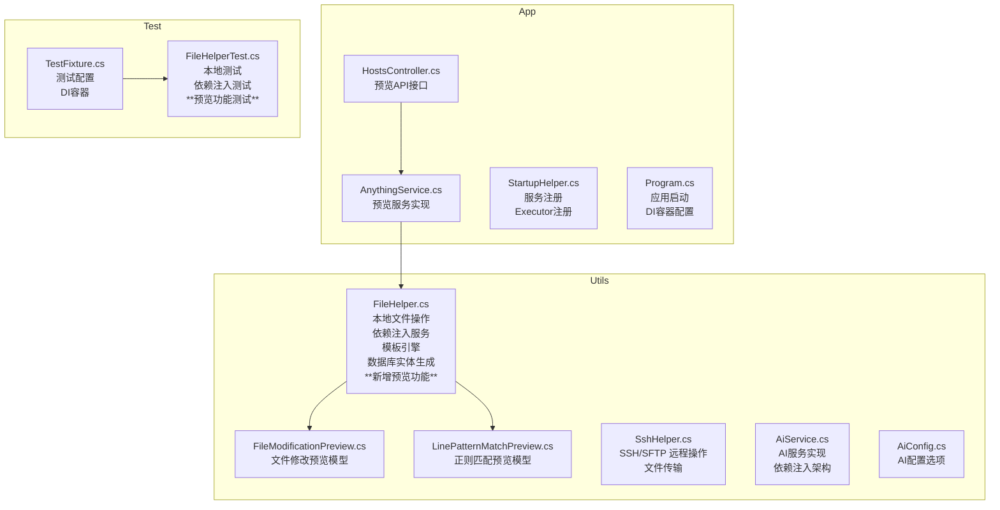
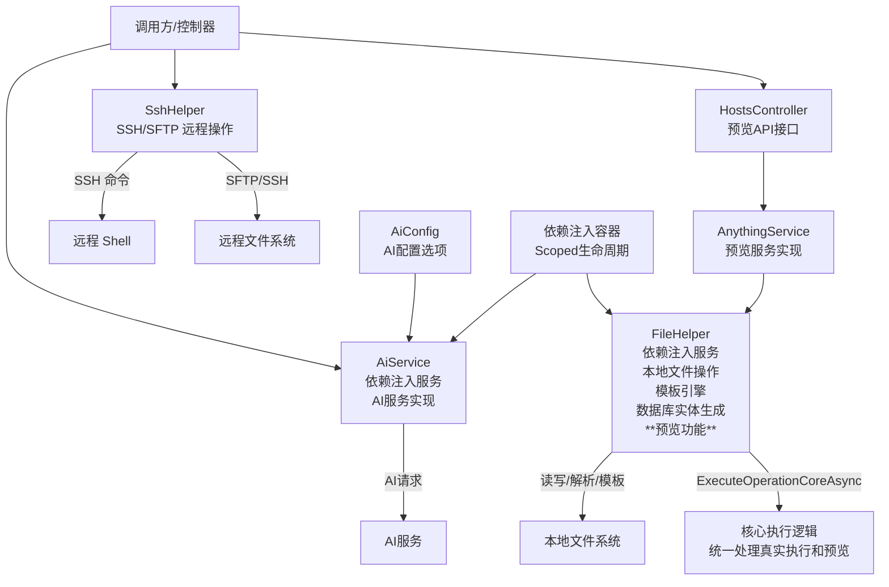
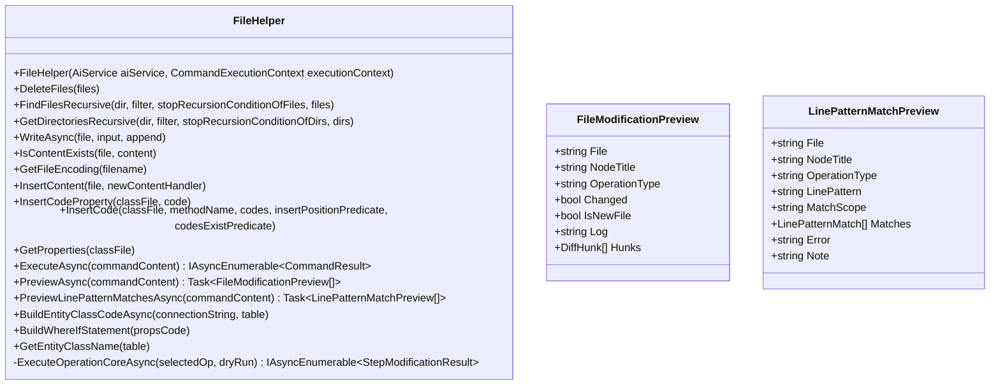
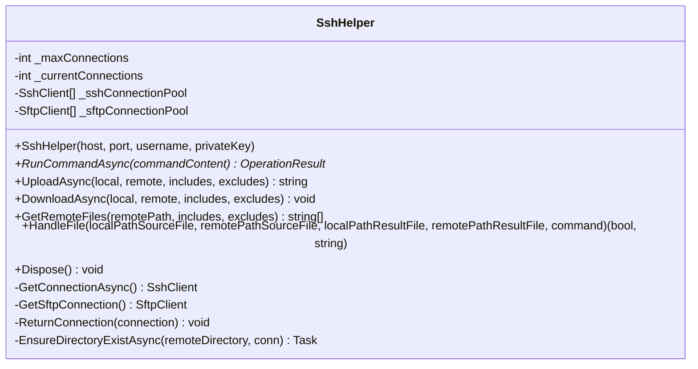
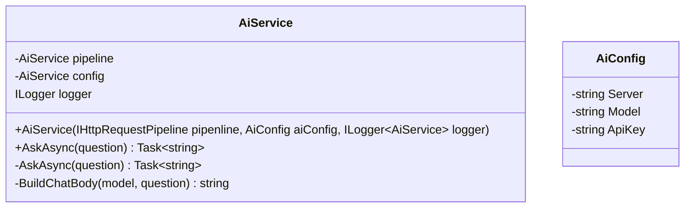
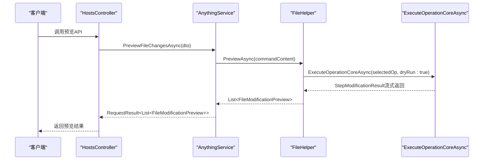
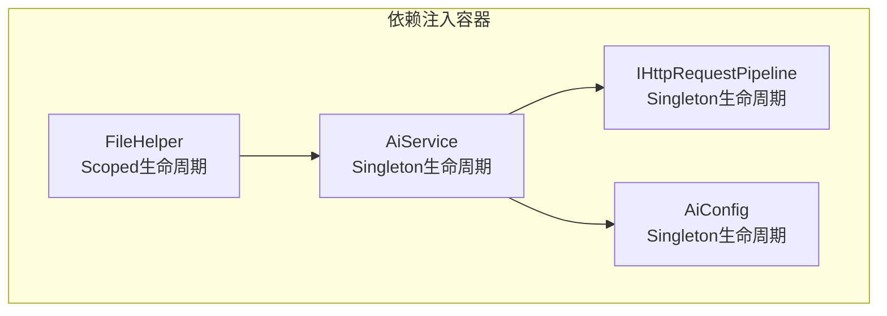
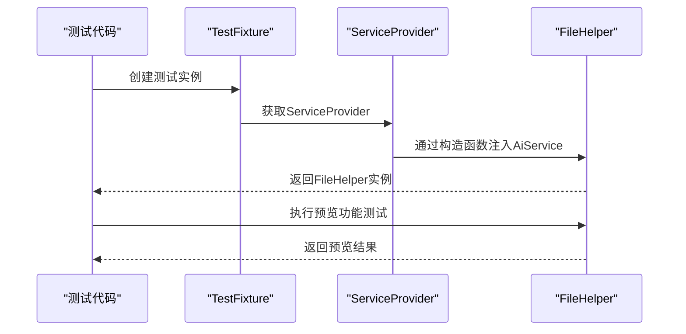

# 文件操作工具

<cite>
**本文档引用的文件**
- [FileHelper.cs](file://Sylas.RemoteTasks.Utils/CommandExecutor/FileHelper.cs)
- [FileModificationPreview.cs](file://Sylas.RemoteTasks.Utils/CommandExecutor/FileModificationPreview.cs)
- [LinePatternMatchPreview.cs](file://Sylas.RemoteTasks.Utils/CommandExecutor/LinePatternMatchPreview.cs)
- [SshHelper.cs](file://Sylas.RemoteTasks.Utils/CommandExecutor/SshHelper.cs)
- [AiService.cs](file://Sylas.RemoteTasks.Utils/AiService.cs)
- [AiConfig.cs](file://Sylas.RemoteTasks.Utils/Dtos/AiConfig.cs)
- [HostsController.cs](file://Sylas.RemoteTasks.App/Controllers/HostsController.cs)
- [AnythingService.cs](file://Sylas.RemoteTasks.App/RemoteHostModule/Anything/AnythingService.cs)
- [StartupHelper.cs](file://Sylas.RemoteTasks.App/Helpers/StartupHelper.cs)
- [Program.cs](file://Sylas.RemoteTasks.App/Program.cs)
- [TestFixture.cs](file://Sylas.RemoteTasks.Test/TestFixture.cs)
- [FileHelperTest.cs](file://Sylas.RemoteTasks.Test/FileOp/FileHelperTest.cs)
</cite>

## 更新摘要
**变更内容**
- **重大新增**：FileHelper新增完整的预览功能，包括PreviewAsync()和PreviewLinePatternMatchesAsync()方法
- **新增类**：FileModificationPreview、LinePatternMatchPreview、StepModificationResult等预览相关类
- **架构重构**：核心执行逻辑重构为ExecuteOperationCoreAsync方法，支持真实执行和预览两种模式
- **增强正则匹配**：针对不同操作类型（Append/Prepend/Replace）的精确正则匹配预览
- **改进错误处理**：预览模式下不会中断整个流程，单个步骤的错误不会影响其他步骤的执行

## 目录
1. [简介](#简介)
2. [项目结构](#项目结构)
3. [核心组件](#核心组件)
4. [架构总览](#架构总览)
5. [详细组件分析](#详细组件分析)
6. [预览功能详解](#预览功能详解)
7. [依赖注入架构](#依赖注入架构)
8. [测试配置更新](#测试配置更新)
9. [性能考量](#性能考量)
10. [故障排查指南](#故障排查指南)
11. [结论](#结论)
12. [附录](#附录)

## 简介
本文件面向文件操作工具的使用者与维护者，系统性梳理本地文件操作助手 FileHelper 与远程 SSH/SFTP 文件操作工具 SshHelper 的实现与使用方法。**本次重大更新**重点介绍了FileHelper新增的完整预览功能，该功能允许用户在执行文件修改前预览所有改动和正则匹配结果，确保操作的准确性和安全性。

内容涵盖：
- 本地文件读写、目录遍历、文件内容注入与模板化批量修改
- **新增** 文件修改预览功能：不修改任何文件，仅计算改动差异和正则匹配结果
- 远程文件传输（上传/下载）、远程命令执行、远程文件管理
- 复杂文件修改能力：模板引擎、条件语句、函数变量解析
- 数据库实体生成功能：自动代码生成、命名空间解析、WhereIf链构建
- AI辅助功能：新的依赖注入架构集成、智能代码生成
- 配置项、参数与返回值说明
- 安全注意事项与最佳实践
- 常见问题与解决方案

## 项目结构
围绕文件操作功能的关键文件组织如下：
- Utils 层提供通用工具：FileHelper（本地文件操作，现为依赖注入服务，**新增预览功能**）、SshHelper（远程文件与命令）、AiService（AI服务，依赖注入实现）
- App 层提供应用配置：HostsController（预览API接口）、AnythingService（预览服务实现）、StartupHelper（服务注册）、Program（应用启动）
- Test 层提供端到端测试样例：TestFixture（测试配置）、FileHelperTest（文件操作测试，**包含预览功能测试**）

```mermaid
graph TB
subgraph "Utils"
FH["FileHelper.cs<br/>本地文件操作<br/>依赖注入服务<br/>模板引擎<br/>数据库实体生成<br/>**新增预览功能**"]
FMP["FileModificationPreview.cs<br/>文件修改预览模型"]
LPM["LinePatternMatchPreview.cs<br/>正则匹配预览模型"]
SH["SshHelper.cs<br/>SSH/SFTP 远程操作<br/>文件传输"]
AS["AiService.cs<br/>AI服务实现<br/>依赖注入架构"]
AC["AiConfig.cs<br/>AI配置选项"]
end
subgraph "App"
HC["HostsController.cs<br/>预览API接口"]
ASVC["AnythingService.cs<br/>预览服务实现"]
SHU["StartupHelper.cs<br/>服务注册<br/>Executor注册"]
PRG["Program.cs<br/>应用启动<br/>DI容器配置"]
end
subgraph "Test"
TF["TestFixture.cs<br/>测试配置<br/>DI容器"]
FHT["FileHelperTest.cs<br/>本地测试<br/>依赖注入测试<br/>**预览功能测试**"]
end
FH --> FMP
FH --> LPM
HC --> ASVC
ASVC --> FH
TF --> FHT
```

**图表来源**
- [FileHelper.cs:28-29](file://Sylas.RemoteTasks.Utils/CommandExecutor/FileHelper.cs#L28-L29)
- [FileModificationPreview.cs:8-38](file://Sylas.RemoteTasks.Utils/CommandExecutor/FileModificationPreview.cs#L8-L38)
- [LinePatternMatchPreview.cs:27-61](file://Sylas.RemoteTasks.Utils/CommandExecutor/LinePatternMatchPreview.cs#L27-L61)
- [HostsController.cs:239-252](file://Sylas.RemoteTasks.App/Controllers/HostsController.cs#L239-L252)
- [AnythingService.cs:741-783](file://Sylas.RemoteTasks.App/RemoteHostModule/Anything/AnythingService.cs#L741-L783)

## 核心组件
- **更新** FileHelper（本地文件操作助手，现为依赖注入服务，**新增完整预览功能**）
  - 构造函数注入：FileHelper(AiService aiService, CommandExecutionContext executionContext)
  - **新增预览功能**：
    - PreviewAsync(commandContent)：预览文件修改结果，返回每个步骤的改动差异
    - PreviewLinePatternMatchesAsync(commandContent)：预览正则匹配结果，验证正则表达式有效性
  - 文件读写：同步/异步写入、内容存在性检查、编码检测
  - 目录操作：递归查找文件/目录、过滤条件与停止条件
  - 内容注入：在类文件中插入属性/方法代码、基于正则的行级插入
  - 复杂文件修改：模板化配置 + 变量解析 + 条件语句 + 函数调用
  - 数据库实体生成：自动代码生成、命名空间解析、WhereIf链构建
  - AI调用模式：迁移到依赖注入的AiService实例，移除AiService.Instance全局访问
  - JSON/文本处理：JSON 紧凑化、按路径提取 Records、正则分组搜索
- SshHelper（SSH/SFTP 远程文件操作）
  - 连接池：SSH/SFTP 连接池管理，最大连接数限制与并发控制
  - 命令执行：远程命令执行、脚本临时上传执行、清理
  - 文件传输：上传/下载目录与文件，支持 include/exclude 过滤
  - 远程文件管理：远程文件存在性检查、目录确保、远程文件列表
  - 文件处理流程：本地文件 → 远程上传 → 远程处理 → 下载结果 → 清理
- **更新** AiService（AI服务实现，现为依赖注入服务）
  - 构造函数注入：AiService(IHttpRequestPipeline pipenline, AiConfig aiConfig, ILogger<AiService> logger)
  - AI调用实现：统一的 AI 服务接口，支持 AskAsync 模式
  - 配置管理：AiConfig 配置选项（服务器地址、模型名称、API密钥）
  - 请求处理：向AI模型提问并获取回答，支持无限超时设置
  - 错误处理：配置验证、响应格式检查、异常抛出

**章节来源**
- [FileHelper.cs:28-29](file://Sylas.RemoteTasks.Utils/CommandExecutor/FileHelper.cs#L28-L29)
- [FileHelper.cs:589-607](file://Sylas.RemoteTasks.Utils/CommandExecutor/FileHelper.cs#L589-L607)
- [FileHelper.cs:615-691](file://Sylas.RemoteTasks.Utils/CommandExecutor/FileHelper.cs#L615-L691)
- [AiService.cs:14-18](file://Sylas.RemoteTasks.Utils/AiService.cs#L14-L18)

## 架构总览
FileHelper 与 SshHelper 分别承担本地与远程文件操作职责，通过统一的命令/结果模型进行集成。**重大更新**：FileHelper新增了完整的预览功能，通过ExecuteOperationCoreAsync方法统一处理真实执行和预览两种模式，确保预览结果与实际执行完全一致。

```mermaid
graph TB
Client["调用方/控制器"] --> HC["HostsController<br/>预览API接口"]
Client --> SH["SshHelper<br/>SSH/SFTP 远程操作"]
Client --> AS["AiService<br/>依赖注入服务<br/>AI服务实现"]
HC --> ASVC["AnythingService<br/>预览服务实现"]
ASVC --> FH["FileHelper<br/>依赖注入服务<br/>本地文件操作<br/>模板引擎<br/>数据库实体生成<br/>**预览功能**"]
FH --> |ExecuteOperationCoreAsync| Core["核心执行逻辑<br/>统一处理真实执行和预览"]
FH --> |读写/解析/模板| LocalFS["本地文件系统"]
SH --> |SFTP/SSH| RemoteFS["远程文件系统"]
SH --> |SSH 命令| RemoteShell["远程 Shell"]
AS --> |AI请求| AIServer["AI服务"]
AC["AiConfig<br/>AI配置选项"] --> AS
DI["依赖注入容器<br/>Scoped生命周期"] --> FH
DI --> AS
```

**图表来源**
- [FileHelper.cs:28-29](file://Sylas.RemoteTasks.Utils/CommandExecutor/FileHelper.cs#L28-L29)
- [FileHelper.cs:1406-1471](file://Sylas.RemoteTasks.Utils/CommandExecutor/FileHelper.cs#L1406-L1471)
- [HostsController.cs:239-252](file://Sylas.RemoteTasks.App/Controllers/HostsController.cs#L239-L252)
- [AnythingService.cs:741-783](file://Sylas.RemoteTasks.App/RemoteHostModule/Anything/AnythingService.cs#L741-L783)

## 详细组件分析

### FileHelper 本地文件操作（依赖注入架构 + 预览功能）
- **更新** 构造函数注入
  - FileHelper(AiService aiService, CommandExecutionContext executionContext) - 通过依赖注入获取AI服务和执行上下文
  - 移除了静态方法中的AiService.Instance全局访问
  - 支持Scoped生命周期管理，提升测试友好性
- **新增** 预览功能
  - PreviewAsync(commandContent)：预览文件修改结果，返回FileModificationPreview列表
  - PreviewLinePatternMatchesAsync(commandContent)：预览正则匹配结果，返回LinePatternMatchPreview列表
  - ExecuteOperationCoreAsync(selectedOp, dryRun)：核心执行逻辑，支持dryRun模式用于预览
- 文件读写
  - 异步写入：WriteAsync(file, input, append)
  - 内容存在性检查：IsContentExists(file, content)
  - 编码检测：GetFileEncoding(filename)
- 目录与文件遍历
  - 递归查找文件：FindFilesRecursive(dir, filter, stopRecursionConditionOfFiles, files)
  - 递归查找目录：GetDirectoriesRecursive(dir, filter, stopRecursionConditionOfDirs, dirs)
  - 解决方案目录与子目录：GetSolutionDirectory()、GetDirectoriesUnderSolution()
- 内容注入与修改
  - 插入代码片段：InsertContent(file, newContentHandler)
  - 类文件属性注入：InsertCodeProperty(classFile, code)
  - 方法内代码注入：InsertCode(classFile, methodName, codes, insertPositionPredicate, codesExistPredicate)
  - 属性列表提取：GetProperties(classFile)
- 复杂文件修改（模板化）
  - 执行配置：ExecuteAsync(commandContent)
  - 节点解析：ResolveNodeFromConfig(nodeConfig)
  - 变量解析：全局变量、函数变量、条件分支 #IF/#ELSE
  - 步骤执行：ModifyAsync(file, operationTitle, value, appendedLinePattern, operationType)
  - 操作类型：Append、Prepend、Replace、Override、Create
- **更新** 数据库实体生成辅助
  - 数据库表列信息 → 实体类代码：BuildEntityClassCodeAsync(connectionString, table)
  - 命名空间解析：ResolveTargetFileNamespace(...)
  - WhereIf 链构建：BuildWhereIfStatement(propsCode)
  - **更新** AI辅助：GetEntityClassName(table) 已迁移到依赖注入的AiService实例

```mermaid
classDiagram
class FileHelper {
+FileHelper(AiService aiService, CommandExecutionContext executionContext)
+DeleteFiles(files)
+FindFilesRecursive(dir, filter, stopRecursionConditionOfFiles, files)
+GetDirectoriesRecursive(dir, filter, stopRecursionConditionOfDirs, dirs)
+WriteAsync(file, input, append)
+IsContentExists(file, content)
+GetFileEncoding(filename)
+InsertContent(file, newContentHandler)
+InsertCodeProperty(classFile, code)
+InsertCode(classFile, methodName, codes, insertPositionPredicate, codesExistPredicate)
+GetProperties(classFile)
+ExecuteAsync(commandContent) IAsyncEnumerable~CommandResult~
+PreviewAsync(commandContent) Task~FileModificationPreview[]~
+PreviewLinePatternMatchesAsync(commandContent) Task~LinePatternMatchPreview[]~
+BuildEntityClassCodeAsync(connectionString, table)
+BuildWhereIfStatement(propsCode)
+GetEntityClassName(table)
-ExecuteOperationCoreAsync(selectedOp, dryRun) IAsyncEnumerable~StepModificationResult~
}
class FileModificationPreview {
+string File
+string NodeTitle
+string OperationType
+bool Changed
+bool IsNewFile
+string Log
+DiffHunk[] Hunks
}
class LinePatternMatchPreview {
+string File
+string NodeTitle
+string OperationType
+string LinePattern
+string MatchScope
+LinePatternMatch[] Matches
+string Error
+string Note
}
```

**图表来源**
- [FileHelper.cs:28-29](file://Sylas.RemoteTasks.Utils/CommandExecutor/FileHelper.cs#L28-L29)
- [FileHelper.cs:589-607](file://Sylas.RemoteTasks.Utils/CommandExecutor/FileHelper.cs#L589-L607)
- [FileHelper.cs:615-691](file://Sylas.RemoteTasks.Utils/CommandExecutor/FileHelper.cs#L615-L691)
- [FileModificationPreview.cs:8-38](file://Sylas.RemoteTasks.Utils/CommandExecutor/FileModificationPreview.cs#L8-L38)
- [LinePatternMatchPreview.cs:27-61](file://Sylas.RemoteTasks.Utils/CommandExecutor/LinePatternMatchPreview.cs#L27-L61)

**章节来源**
- [FileHelper.cs:28-29](file://Sylas.RemoteTasks.Utils/CommandExecutor/FileHelper.cs#L28-L29)
- [FileHelper.cs:589-607](file://Sylas.RemoteTasks.Utils/CommandExecutor/FileHelper.cs#L589-L607)
- [FileHelper.cs:615-691](file://Sylas.RemoteTasks.Utils/CommandExecutor/FileHelper.cs#L615-L691)

### SshHelper SSH/SFTP 远程文件操作
- 连接管理
  - 构造：SshHelper(host, port, username, privateKey)
  - 连接池：GetConnectionAsync()、GetSftpConnection()
  - 归还连接：ReturnConnection(...)
  - 资源释放：Dispose()
- 命令执行
  - 批量命令：RunCommandAsync(commandContent)
  - 命令块解析：支持 upload/download 与普通命令混合
  - 临时脚本：自动上传本地脚本至远程 temp 目录并执行，成功后清理
- 文件传输
  - 上传：UploadAsync(local, remotePath, includes, excludes)
    - 支持本地目录/文件上传，自动创建远程目录
    - 支持 include/exclude 过滤
  - 下载：DownloadAsync(local, remotePath, includes, excludes)
    - 支持远程目录/文件下载，自动创建本地目录
- 远程文件管理
  - 目录确保：EnsureDirectoryExistAsync(remoteDirectory, conn)
  - 远程文件列表：GetRemoteFiles(remotePath, includes, excludes)
  - 文件处理流程：HandleFile(localPathSourceFile, remotePathSourceFile, localPathResultFile, remotePathResultFile, command)

```mermaid
classDiagram
class SshHelper {
-int _maxConnections
-int _currentConnections
-SshClient[] _sshConnectionPool
-SftpClient[] _sftpConnectionPool
+SshHelper(host, port, username, privateKey)
+RunCommandAsync(commandContent) OperationResult*
+UploadAsync(local, remote, includes, excludes) string
+DownloadAsync(local, remote, includes, excludes) void
+GetRemoteFiles(remotePath, includes, excludes) string[]
+HandleFile(localPathSourceFile, remotePathSourceFile, localPathResultFile, remotePathResultFile, command) (bool, string)
+Dispose() void
-GetConnectionAsync() SshClient
-GetSftpConnection() SftpClient
-ReturnConnection(connection) void
-EnsureDirectoryExistAsync(remoteDirectory, conn) Task
}
```

**图表来源**
- [SshHelper.cs:18-619](file://Sylas.RemoteTasks.Utils/CommandExecutor/SshHelper.cs#L18-L619)

**章节来源**
- [SshHelper.cs:18-619](file://Sylas.RemoteTasks.Utils/CommandExecutor/SshHelper.cs#L18-L619)

### AiService AI服务实现（依赖注入架构）
- **更新** 构造函数注入
  - AiService(IHttpRequestPipeline pipenline, AiConfig aiConfig, ILogger<AiService> logger)
  - 通过依赖注入获取HTTP请求管道、AI配置和日志记录器
  - 移除了静态实例模式，采用标准的依赖注入架构
- 配置管理：AiConfig 配置选项（服务器地址、模型名称、API密钥）
- 请求处理：向AI模型提问并获取回答，支持无限超时设置
- 错误处理：配置验证、响应格式检查、异常抛出

```mermaid
classDiagram
class AiService {
-AiService pipeline
-AiService config
ILogger logger
+AiService(IHttpRequestPipeline pipenline, AiConfig aiConfig, ILogger~AiService~ logger)
+AskAsync(question) Task~string~
-AskAsync(question) Task~string~
-BuildChatBody(model, question) string
}
class AiConfig {
-string Server
-string Model
-string ApiKey
}
```

**图表来源**
- [AiService.cs:14-18](file://Sylas.RemoteTasks.Utils/AiService.cs#L14-L18)
- [AiConfig.cs:6-21](file://Sylas.RemoteTasks.Utils/Dtos/AiConfig.cs#L6-L21)

**章节来源**
- [AiService.cs:14-18](file://Sylas.RemoteTasks.Utils/AiService.cs#L14-L18)
- [AiConfig.cs:6-21](file://Sylas.RemoteTasks.Utils/Dtos/AiConfig.cs#L6-L21)

## 预览功能详解

### 文件修改预览（PreviewAsync）
- **功能概述**：预览文件修改结果，不实际修改任何文件，仅计算改动差异
- **核心方法**：`PreviewAsync(string commandContent)` 返回 `List<FileModificationPreview>`
- **预览结果**：
  - FileModificationPreview：包含文件路径、操作类型、是否产生改动、差异块等信息
  - DiffHunk：详细的差异块信息，包含改动前后的行号和具体内容
  - DiffLine：每行的详细信息，包括行类型（equal/del/add）和内容
- **使用场景**：在执行复杂的文件修改操作前，预览所有可能的改动效果

### 正则匹配预览（PreviewLinePatternMatchesAsync）
- **功能概述**：预览正则表达式的匹配结果，验证正则表达式的有效性
- **核心方法**：`PreviewLinePatternMatchesAsync(string commandContent)` 返回 `List<LinePatternMatchPreview>`
- **匹配范围**：
  - Line：按行匹配（Append/Prepend操作）
  - Content：全文匹配（Replace操作，允许跨行）
  - None：不使用LinePattern（Override/Create操作）
- **错误处理**：单个步骤的正则错误不会影响整个预览流程
- **使用场景**：调试和验证正则表达式，确保定位行的准确性

### 核心执行架构（ExecuteOperationCoreAsync）
- **统一架构**：通过ExecuteOperationCoreAsync方法统一处理真实执行和预览两种模式
- **Dry Run模式**：当dryRun=true时，只计算改动而不实际写入文件
- **模拟内容**：预览时使用simulatedContents字典模拟文件内容的逐步变化
- **一致性保证**：预览逻辑与实际执行逻辑完全一致，确保预览结果的准确性

```mermaid
sequenceDiagram
participant Client as "客户端"
participant Controller as "HostsController"
participant Service as "AnythingService"
participant Helper as "FileHelper"
participant Core as "ExecuteOperationCoreAsync"
Client->>Controller : 调用预览API
Controller->>Service : PreviewFileChangesAsync(dto)
Service->>Helper : PreviewAsync(commandContent)
Helper->>Core : ExecuteOperationCoreAsync(selectedOp, dryRun : true)
Core-->>Helper : StepModificationResult流式返回
Helper-->>Service : List<FileModificationPreview>
Service-->>Controller : RequestResult<List<FileModificationPreview>>
Controller-->>Client : 返回预览结果
```

**图表来源**
- [HostsController.cs:239-252](file://Sylas.RemoteTasks.App/Controllers/HostsController.cs#L239-L252)
- [AnythingService.cs:741-783](file://Sylas.RemoteTasks.App/RemoteHostModule/Anything/AnythingService.cs#L741-L783)
- [FileHelper.cs:589-607](file://Sylas.RemoteTasks.Utils/CommandExecutor/FileHelper.cs#L589-L607)
- [FileHelper.cs:1406-1471](file://Sylas.RemoteTasks.Utils/CommandExecutor/FileHelper.cs#L1406-L1471)

**章节来源**
- [FileHelper.cs:589-607](file://Sylas.RemoteTasks.Utils/CommandExecutor/FileHelper.cs#L589-L607)
- [FileHelper.cs:615-691](file://Sylas.RemoteTasks.Utils/CommandExecutor/FileHelper.cs#L615-L691)
- [FileHelper.cs:1406-1471](file://Sylas.RemoteTasks.Utils/CommandExecutor/FileHelper.cs#L1406-L1471)

## 依赖注入架构
- **更新** 服务注册
  - StartupHelper.AddExecutor()：通过ExecutorAttribute自动注册依赖注入服务
  - Program.cs：应用启动时配置AI服务相关配置
  - TestFixture：测试环境中配置依赖注入容器
- 生命周期管理
  - FileHelper：Scoped生命周期，适合Web请求上下文
  - AiService：Singleton生命周期，全局共享
  - IHttpRequestPipeline：Singleton生命周期
- 依赖关系
  - FileHelper依赖AiService（构造函数注入）
  - AiService依赖IHttpRequestPipeline、AiConfig、ILogger
  - 所有服务通过依赖注入容器管理

```mermaid
graph TB
subgraph "依赖注入容器"
FH["FileHelper<br/>Scoped生命周期"]
AS["AiService<br/>Singleton生命周期"]
IP["IHttpRequestPipeline<br/>Singleton生命周期"]
AC["AiConfig<br/>Singleton生命周期"]
end
FH --> AS
AS --> IP
AS --> AC
```

**图表来源**
- [StartupHelper.cs:90-101](file://Sylas.RemoteTasks.App/Helpers/StartupHelper.cs#L90-L101)
- [Program.cs:25-28](file://Sylas.RemoteTasks.App/Program.cs#L25-L28)
- [TestFixture.cs:57-67](file://Sylas.RemoteTasks.Test/TestFixture.cs#L57-L67)

**章节来源**
- [StartupHelper.cs:90-101](file://Sylas.RemoteTasks.App/Helpers/StartupHelper.cs#L90-L101)
- [Program.cs:25-28](file://Sylas.RemoteTasks.App/Program.cs#L25-L28)
- [TestFixture.cs:57-67](file://Sylas.RemoteTasks.Test/TestFixture.cs#L57-L67)

## 测试配置更新
- **更新** TestFixture配置
  - 使用ServiceCollection配置依赖注入容器
  - 注册AiConfig、AiService、IHttpRequestPipeline等服务
  - 设置FileHelper为Scoped生命周期
  - 提供ServiceProvider供测试使用
- **更新** FileHelperTest测试
  - 通过ServiceProvider获取FileHelper实例
  - 使用IServiceScopeFactory创建作用域
  - **新增预览功能测试**：
    - FileExecutor_UpdateFileTest：测试文件修改预览功能
    - FileExecutor_PreviewLinePatternMatchesTest：测试正则匹配预览功能
  - 测试文件操作功能，验证依赖注入架构
- **更新** 服务注册方式
  - StartupHelper.AddExecutor()：自动注册所有带ExecutorAttribute的服务
  - Program.cs：应用启动时自动配置服务
  - TestFixture：测试环境独立配置服务

```mermaid
sequenceDiagram
participant Test as "测试代码"
participant TF as "TestFixture"
participant SP as "ServiceProvider"
participant FH as "FileHelper"
Test->>TF : 创建测试实例
TF->>SP : 获取ServiceProvider
SP->>FH : 通过构造函数注入AiService
FH-->>Test : 返回FileHelper实例
Test->>FH : 执行预览功能测试
FH-->>Test : 返回预览结果
```

**图表来源**
- [TestFixture.cs:15-25](file://Sylas.RemoteTasks.Test/TestFixture.cs#L15-L25)
- [FileHelperTest.cs:834-889](file://Sylas.RemoteTasks.Test/FileOp/FileHelperTest.cs#L834-L889)
- [FileHelperTest.cs:898-1019](file://Sylas.RemoteTasks.Test/FileOp/FileHelperTest.cs#L898-L1019)

**章节来源**
- [TestFixture.cs:15-25](file://Sylas.RemoteTasks.Test/TestFixture.cs#L15-L25)
- [FileHelperTest.cs:834-889](file://Sylas.RemoteTasks.Test/FileOp/FileHelperTest.cs#L834-L889)
- [FileHelperTest.cs:898-1019](file://Sylas.RemoteTasks.Test/FileOp/FileHelperTest.cs#L898-L1019)

## 性能考量
- **更新** 依赖注入性能
  - Scoped生命周期：FileHelper在每次请求中创建，避免线程安全问题
  - Singleton生命周期：AiService全局共享，减少内存占用
  - 依赖注入容器：优化服务解析性能
- **新增** 预览功能性能
  - Dry Run模式：预览时不实际写入文件，减少I/O开销
  - 模拟内容缓存：使用simulatedContents字典缓存模拟的文件内容，避免重复读取
  - 流式处理：ExecuteOperationCoreAsync使用IAsyncEnumerable流式返回结果
- 连接池与并发
  - SshHelper 使用连接池与信号量限制最大连接数，避免资源耗尽
  - 建议合理设置并发任务数量，避免频繁创建/销毁连接
- I/O 优化
  - FileHelper 使用异步写入 WriteAsync，减少阻塞
  - 上传/下载采用流式处理，避免一次性加载大文件
  - **新增** 模板引擎缓存：RazorEngine 模板缓存机制，避免重复编译
- 正则与遍历
  - 递归遍历时建议提供合理的过滤条件与停止条件，避免无谓扫描
  - 正则匹配应尽量精确，避免回溯风暴
  - **新增** 预览模式下的正则匹配优化：只读取文件内容，不进行实际修改
- **更新** AI服务优化
  - 依赖注入架构：避免静态实例带来的线程安全问题
  - 请求头缓存：Authorization 头部设置一次即可
  - **更新** AI调用模式：依赖注入的AiService实例提供更好的性能和稳定性

## 故障排查指南
- **更新** 依赖注入问题
  - 检查服务注册：确保FileHelper和AiService正确注册到依赖注入容器
  - 验证生命周期：确认FileHelper为Scoped，AiService为Singleton
  - 作用域管理：确保在正确的服务作用域内获取服务实例
- **新增** 预览功能问题
  - 预览API不可用：检查HostsController和AnythingService是否正确配置
  - 预览结果为空：确认命令配置正确，工作目录存在且可访问
  - 正则匹配失败：使用PreviewLinePatternMatchesAsync验证正则表达式
  - 预览与实际执行不一致：检查ExecuteOperationCoreAsync的dryRun逻辑
- 远程连接失败
  - 检查主机、端口、用户名与私钥配置
  - 确认私钥路径正确（PathConstants 默认路径）
  - 观察连接池状态与最大连接数限制
- 上传/下载异常
  - 确认本地路径存在且权限足够
  - 远程路径不存在时，先确保目录存在（EnsureDirectoryExistAsync）
  - 使用 include/exclude 过滤排除不需要的文件
- 命令执行失败
  - 临时脚本上传后需赋予可执行权限（chmod +x）
  - 成功后自动清理远程临时脚本
- **新增** 模板引擎问题
  - 确认 ENGINE: Razor 指令正确设置
  - 检查模板变量语法：{{varName}} 和 {varName}
  - 验证条件语句格式：#IF:Variable.Contains('substring').Content#IFEND
- **更新** AI服务问题
  - 检查 AiConfig 配置：Server、Model、ApiKey
  - 确认依赖注入容器正确配置AiService
  - 验证网络连接和API可用性
  - 查看请求超时设置是否合适
  - **更新** 确认依赖注入的AiService实例已正确初始化
- **新增** 数据库实体生成问题
  - 确认数据库连接字符串正确
  - 检查表结构和字段信息
  - 验证命名空间解析逻辑

**章节来源**
- [FileHelperTest.cs:834-889](file://Sylas.RemoteTasks.Test/FileOp/FileHelperTest.cs#L834-L889)
- [FileHelperTest.cs:898-1019](file://Sylas.RemoteTasks.Test/FileOp/FileHelperTest.cs#L898-L1019)
- [SshHelper.cs:36-120](file://Sylas.RemoteTasks.Utils/CommandExecutor/SshHelper.cs#L36-L120)
- [AiService.cs:26-59](file://Sylas.RemoteTasks.Utils/AiService.cs#L26-L59)

## 结论
FileHelper 与 SshHelper 提供了从本地到远程的完整文件操作能力。**重大更新**：FileHelper已成功从静态工具类重构为依赖注入服务，并通过构造函数注入AiService依赖，移除了AiService.Instance全局访问模式，采用了Scoped生命周期管理。**更重大的更新**是新增了完整的预览功能，包括PreviewAsync()和PreviewLinePatternMatchesAsync()方法，以及相关的数据模型和API接口。这些新功能使得用户可以在执行文件修改前预览所有改动和正则匹配结果，大大提高了操作的安全性和可靠性。通过ExecuteOperationCoreAsync方法的统一架构设计，确保了预览结果与实际执行的完全一致性。这一系列改进为系统带来了更强大的自动化能力和更好的用户体验。

## 附录

### 配置与参数速查
- **更新** FileHelper构造函数
  - FileHelper(AiService aiService, CommandExecutionContext executionContext) - 通过依赖注入获取AI服务和执行上下文
  - 移除了静态方法中的AiService.Instance全局访问
- **新增** 预览功能API
  - PreviewAsync(commandContent)：预览文件修改结果，返回FileModificationPreview列表
  - PreviewLinePatternMatchesAsync(commandContent)：预览正则匹配结果，返回LinePatternMatchPreview列表
- FileHelper.ExecuteAsync(commandContent)
  - 支持 ENGINE: Razor 或默认模板引擎
  - 全局变量与函数变量解析
  - 操作节点：TargetFilePattern、Value、OperationType、LinePattern
  - **新增** 条件语句：#IF:Variable.Contains('substring').Content#IFEND
- SshHelper.RunCommandAsync(commandContent)
  - upload local remote [-include=...] [-exclude=...]
  - download local remote [-include=...] [-exclude=...]
  - 混合普通命令执行（自动上传临时脚本）
- SshHelper.HandleFile(...)
  - 本地源文件路径、远程源文件路径
  - 本地结果文件路径、远程结果文件路径
  - 远程处理命令
- **更新** AiService构造函数
  - AiService(IHttpRequestPipeline pipenline, AiConfig aiConfig, ILogger<AiService> logger)
  - 通过依赖注入获取HTTP请求管道、AI配置和日志记录器
  - 移除了静态实例模式
- **更新** 依赖注入配置
  - StartupHelper.AddExecutor()：自动注册ExecutorAttribute标记的服务
  - Program.cs：应用启动时配置AI服务相关配置
  - TestFixture：测试环境配置依赖注入容器

**章节来源**
- [FileHelper.cs:28-29](file://Sylas.RemoteTasks.Utils/CommandExecutor/FileHelper.cs#L28-L29)
- [FileHelper.cs:589-607](file://Sylas.RemoteTasks.Utils/CommandExecutor/FileHelper.cs#L589-L607)
- [FileHelper.cs:615-691](file://Sylas.RemoteTasks.Utils/CommandExecutor/FileHelper.cs#L615-L691)
- [AiService.cs:14-18](file://Sylas.RemoteTasks.Utils/AiService.cs#L14-L18)
- [StartupHelper.cs:90-101](file://Sylas.RemoteTasks.App/Helpers/StartupHelper.cs#L90-L101)
- [Program.cs:25-28](file://Sylas.RemoteTasks.App/Program.cs#L25-L28)
- [TestFixture.cs:57-67](file://Sylas.RemoteTasks.Test/TestFixture.cs#L57-L67)