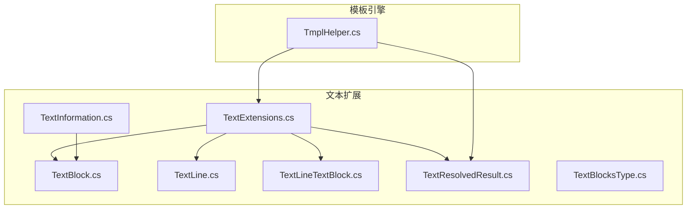
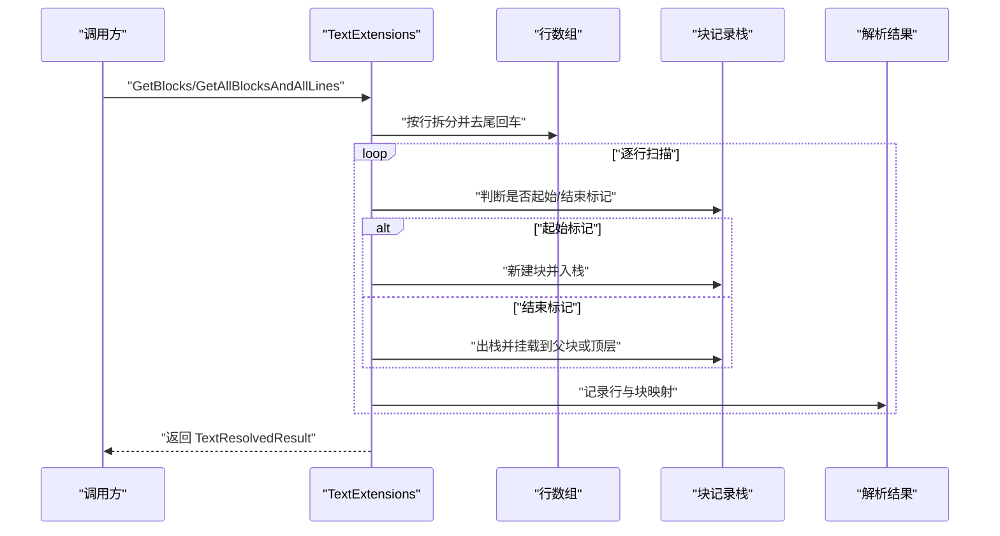
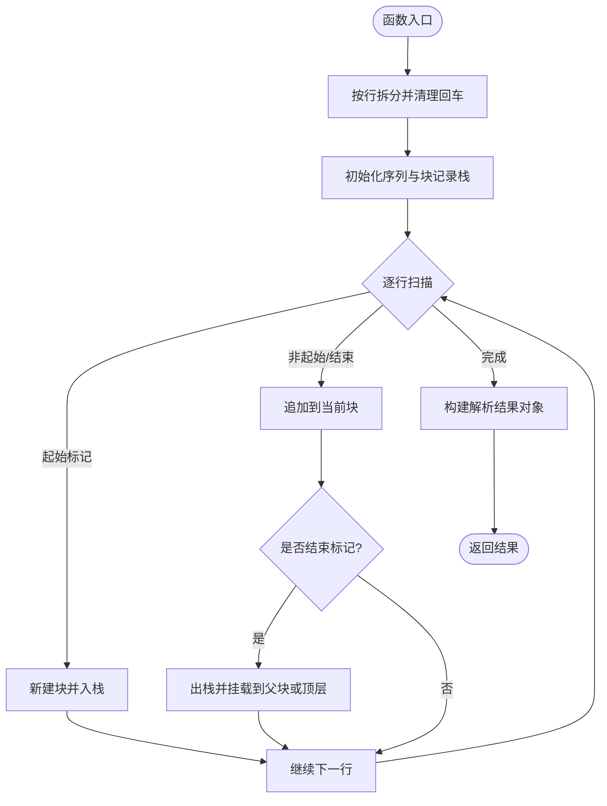
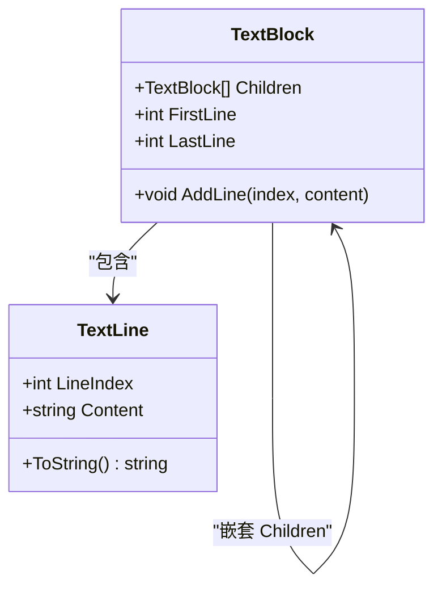
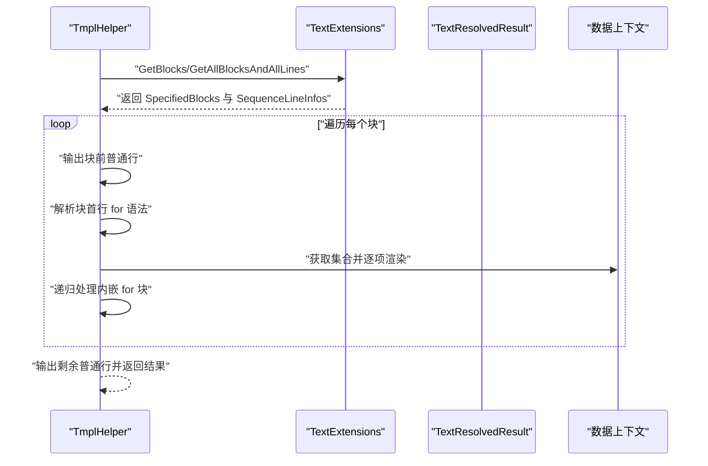
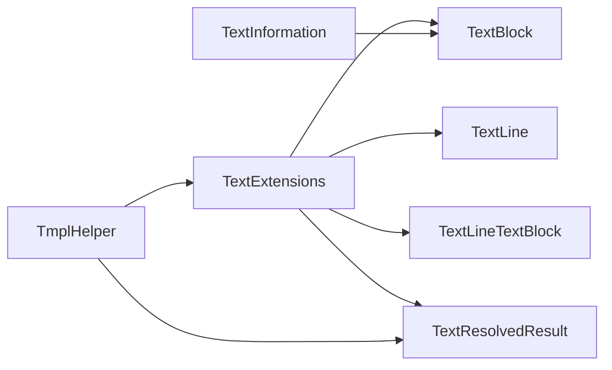

# 文本处理工具

<cite>
**本文引用的文件**
- [TextExtensions.cs](file://Sylas.RemoteTasks.Utils/Extensions/Text/TextExtensions.cs)
- [TextBlock.cs](file://Sylas.RemoteTasks.Utils/Extensions/Text/TextBlock.cs)
- [TextLine.cs](file://Sylas.RemoteTasks.Utils/Extensions/Text/TextLine.cs)
- [TextInformation.cs](file://Sylas.RemoteTasks.Utils/Extensions/Text/TextInformation.cs)
- [TextBlocksType.cs](file://Sylas.RemoteTasks.Utils/Extensions/Text/TextBlocksType.cs)
- [TextLineTextBlock.cs](file://Sylas.RemoteTasks.Utils/Extensions/Text/TextLineTextBlock.cs)
- [TextResolvedResult.cs](file://Sylas.RemoteTasks.Utils/Extensions/Text/TextResolvedResult.cs)
- [TmplHelper.cs](file://Sylas.RemoteTasks.Utils/Template/TmplHelper.cs)
- [TmplParserTest.cs](file://Sylas.RemoteTasks.Test/Tmpl/TmplParserTest.cs)
</cite>

## 目录
1. [简介](#简介)
2. [项目结构](#项目结构)
3. [核心组件](#核心组件)
4. [架构总览](#架构总览)
5. [详细组件分析](#详细组件分析)
6. [依赖分析](#依赖分析)
7. [性能考虑](#性能考虑)
8. [故障排除指南](#故障排除指南)
9. [结论](#结论)
10. [附录：使用示例与最佳实践](#附录使用示例与最佳实践)

## 简介
本文件系统性梳理了文本处理工具的实现与使用，重点围绕以下主题展开：
- TextExtensions 文本扩展方法：提供基于起止标记的文本块识别与层级化解析能力，并输出有序行信息与解析结果。
- 核心数据结构：TextBlock（文本块）、TextLine（文本行）、TextInformation（文本信息）、TextResolvedResult（解析结果）等。
- 关联结构：TextBlocksType（文本块类型枚举）、TextLineTextBlock（行与块的映射）。
- 实际应用：在模板引擎中通过 TextExtensions 识别 for 循环块并进行渲染，展示文本分割、合并与格式化流程。
- 算法与性能：解析算法的时间复杂度、栈式层级管理策略、以及常见问题与优化建议。

## 项目结构
文本处理工具位于 Sylas.RemoteTasks.Utils 的 Extensions/Text 目录下，核心文件包括：
- TextExtensions.cs：扩展方法入口，负责按行扫描、匹配起止标记、构建层级文本块与行映射。
- TextBlock.cs：文本块容器，继承自 List<TextLine>，支持 Children 嵌套。
- TextLine.cs：单行文本抽象，包含行索引与原始内容。
- TextInformation.cs：解析结果容器（仅包含 Blocks）。
- TextBlocksType.cs：文本块类型枚举（All/Specific）。
- TextLineTextBlock.cs：行与块的关联映射。
- TextResolvedResult.cs：解析结果对象，包含指定块集合与有序行映射。

模板引擎 TmplHelper.cs 在解析模板时调用 TextExtensions 的 GetBlocks/GetAllBlocksAndAllLines 方法，以识别 for 循环块并进行渲染。

图表来源
- [TextExtensions.cs](file://Sylas.RemoteTasks.Utils/Extensions/Text/TextExtensions.cs#L1-L188)
- [TextBlock.cs](file://Sylas.RemoteTasks.Utils/Extensions/Text/TextBlock.cs#L1-L33)
- [TextLine.cs](file://Sylas.RemoteTasks.Utils/Extensions/Text/TextLine.cs#L1-L45)
- [TextLineTextBlock.cs](file://Sylas.RemoteTasks.Utils/Extensions/Text/TextLineTextBlock.cs#L1-L23)
- [TextResolvedResult.cs](file://Sylas.RemoteTasks.Utils/Extensions/Text/TextResolvedResult.cs#L1-L26)
- [TextInformation.cs](file://Sylas.RemoteTasks.Utils/Extensions/Text/TextInformation.cs#L1-L17)
- [TextBlocksType.cs](file://Sylas.RemoteTasks.Utils/Extensions/Text/TextBlocksType.cs#L1-L18)
- [TmplHelper.cs](file://Sylas.RemoteTasks.Utils/Template/TmplHelper.cs#L350-L740)

章节来源
- [TextExtensions.cs](file://Sylas.RemoteTasks.Utils/Extensions/Text/TextExtensions.cs#L1-L188)
- [TextBlock.cs](file://Sylas.RemoteTasks.Utils/Extensions/Text/TextBlock.cs#L1-L33)
- [TextLine.cs](file://Sylas.RemoteTasks.Utils/Extensions/Text/TextLine.cs#L1-L45)
- [TextInformation.cs](file://Sylas.RemoteTasks.Utils/Extensions/Text/TextInformation.cs#L1-L17)
- [TextBlocksType.cs](file://Sylas.RemoteTasks.Utils/Extensions/Text/TextBlocksType.cs#L1-L18)
- [TextLineTextBlock.cs](file://Sylas.RemoteTasks.Utils/Extensions/Text/TextLineTextBlock.cs#L1-L23)
- [TextResolvedResult.cs](file://Sylas.RemoteTasks.Utils/Extensions/Text/TextResolvedResult.cs#L1-L26)
- [TmplHelper.cs](file://Sylas.RemoteTasks.Utils/Template/TmplHelper.cs#L350-L740)

## 核心组件
- TextExtensions：提供 GetBlocks 与 GetAllBlocksAndAllLines 两个扩展方法，用于从字符串或行数组中识别由 startFlag 与 endFlag 标记的文本块，并维护层级关系与行级映射。
- TextBlock：文本块容器，继承 List<TextLine>，新增 Children 支持嵌套；提供 FirstLine/LastLine 快速定位块边界。
- TextLine：单行文本抽象，包含 LineIndex 与 Content。
- TextLineTextBlock：行与块的关联映射，便于在解析后对“某行属于哪个块”进行快速查询。
- TextResolvedResult：解析结果对象，包含 SpecifiedBlocks（按层级组织的块集合）与 SequenceLineInfos（按顺序的行与块映射）。
- TextInformation：历史结构，仅包含 Blocks 字段，用于承载解析结果。
- TextBlocksType：枚举 All/Specific，用于描述解析结果所包含的内容范围。

章节来源
- [TextExtensions.cs](file://Sylas.RemoteTasks.Utils/Extensions/Text/TextExtensions.cs#L18-L86)
- [TextBlock.cs](file://Sylas.RemoteTasks.Utils/Extensions/Text/TextBlock.cs#L8-L31)
- [TextLine.cs](file://Sylas.RemoteTasks.Utils/Extensions/Text/TextLine.cs#L6-L42)
- [TextLineTextBlock.cs](file://Sylas.RemoteTasks.Utils/Extensions/Text/TextLineTextBlock.cs#L11-L21)
- [TextResolvedResult.cs](file://Sylas.RemoteTasks.Utils/Extensions/Text/TextResolvedResult.cs#L13-L24)
- [TextInformation.cs](file://Sylas.RemoteTasks.Utils/Extensions/Text/TextInformation.cs#L8-L15)
- [TextBlocksType.cs](file://Sylas.RemoteTasks.Utils/Extensions/Text/TextBlocksType.cs#L6-L16)

## 架构总览
TextExtensions 将输入文本按行拆分后进行线性扫描，利用栈式结构 blockRecords 维护当前层级的块，遇到起始标记即新建块并入栈，遇到结束标记则出栈并将当前块挂载到父块 Children 或加入顶层块集合。最终输出 TextResolvedResult，供上层模板引擎或其他模块使用。

图表来源
- [TextExtensions.cs](file://Sylas.RemoteTasks.Utils/Extensions/Text/TextExtensions.cs#L18-L86)
- [TmplHelper.cs](file://Sylas.RemoteTasks.Utils/Template/TmplHelper.cs#L641-L718)

## 详细组件分析

### TextExtensions：文本块识别与层级解析
- 输入处理：将字符串按换行符拆分为行数组，并去除每行末尾的回车符，确保匹配逻辑稳定。
- 层级管理：使用 List<TextBlock> 作为栈，记录当前路径上的块；当遇到起始标记时入栈，遇到结束标记时出栈并挂载到父块。
- 结果产出：返回 TextResolvedResult，包含两部分：
  - SpecifiedBlocks：按层级组织的块集合（顶层块列表）。
  - SequenceLineInfos：按顺序的行与块映射，便于后续渲染或二次处理。
- 匹配规则：
  - 起始行判定：行内容包含“起始标识 + 空格”的模式。
  - 结束行判定：行内容经 Trim 后等于“结束标识”。

图表来源
- [TextExtensions.cs](file://Sylas.RemoteTasks.Utils/Extensions/Text/TextExtensions.cs#L18-L86)

章节来源
- [TextExtensions.cs](file://Sylas.RemoteTasks.Utils/Extensions/Text/TextExtensions.cs#L18-L86)

### TextBlock：文本块容器与嵌套关系
- 继承自 List<TextLine>，天然具备顺序性与可遍历性。
- Children：支持嵌套子块，形成树形层级结构。
- 辅助属性：FirstLine/LastLine 提供块边界索引，便于快速定位与范围计算。

图表来源
- [TextBlock.cs](file://Sylas.RemoteTasks.Utils/Extensions/Text/TextBlock.cs#L8-L31)
- [TextLine.cs](file://Sylas.RemoteTasks.Utils/Extensions/Text/TextLine.cs#L6-L42)

章节来源
- [TextBlock.cs](file://Sylas.RemoteTasks.Utils/Extensions/Text/TextBlock.cs#L8-L31)
- [TextLine.cs](file://Sylas.RemoteTasks.Utils/Extensions/Text/TextLine.cs#L6-L42)

### TextLine：行抽象与显示
- 默认构造与带参构造，保证 LineIndex 与 Content 的一致性。
- ToString 提供简洁的行信息展示，便于调试与日志输出。

章节来源
- [TextLine.cs](file://Sylas.RemoteTasks.Utils/Extensions/Text/TextLine.cs#L11-L42)

### TextLineTextBlock：行与块的映射
- 记录某行所属的块（可能为空），用于区分“在块内”与“不在任何块内”的行。
- 与 TextResolvedResult 的 SequenceLineInfos 协同，支撑模板渲染与二次处理。

章节来源
- [TextLineTextBlock.cs](file://Sylas.RemoteTasks.Utils/Extensions/Text/TextLineTextBlock.cs#L11-L21)

### TextResolvedResult：解析结果对象
- SpecifiedBlocks：按层级组织的块集合，供上层按块处理。
- SequenceLineInfos：按顺序的行与块映射，便于顺序渲染或区间处理。

章节来源
- [TextResolvedResult.cs](file://Sylas.RemoteTasks.Utils/Extensions/Text/TextResolvedResult.cs#L13-L24)

### TextInformation 与 TextBlocksType：历史结构与类型枚举
- TextInformation：仅包含 Blocks 字段，用于承载解析结果。
- TextBlocksType：枚举 All/Specific，描述解析结果所包含的内容范围（当前实现主要使用 Specific）。

章节来源
- [TextInformation.cs](file://Sylas.RemoteTasks.Utils/Extensions/Text/TextInformation.cs#L8-L15)
- [TextBlocksType.cs](file://Sylas.RemoteTasks.Utils/Extensions/Text/TextBlocksType.cs#L6-L16)

### 模板引擎集成：TmplHelper 中的文本块解析
- TmplHelper 在解析模板时，先调用 TextExtensions 的 GetBlocks/GetAllBlocksAndAllLines 识别 for 循环块。
- 对每个块：
  - 输出块之前的普通行（通过 SequenceLineInfos 定位）。
  - 解析块首行的 for 语法，获取迭代变量与集合。
  - 遍历集合，构造临时上下文，递归渲染块体内容。
- 渲染完成后输出剩余普通行，拼接为最终结果。

图表来源
- [TmplHelper.cs](file://Sylas.RemoteTasks.Utils/Template/TmplHelper.cs#L641-L718)
- [TextExtensions.cs](file://Sylas.RemoteTasks.Utils/Extensions/Text/TextExtensions.cs#L18-L86)

章节来源
- [TmplHelper.cs](file://Sylas.RemoteTasks.Utils/Template/TmplHelper.cs#L350-L740)
- [TextExtensions.cs](file://Sylas.RemoteTasks.Utils/Extensions/Text/TextExtensions.cs#L18-L86)

## 依赖分析
- TextExtensions 依赖：
  - TextBlock、TextLine、TextLineTextBlock、TextResolvedResult。
  - 通过 blockRecords 栈维护层级，避免递归复杂度。
- 模板引擎依赖：
  - TmplHelper 依赖 TextExtensions 的 GetBlocks/GetAllBlocksAndAllLines，以识别 for 循环块并进行渲染。
- 数据结构耦合：
  - TextBlock 与 TextLine 的组合关系清晰，Children 支持多层嵌套。
  - TextLineTextBlock 与 TextResolvedResult 的组合提供顺序访问与归属查询。

图表来源
- [TextExtensions.cs](file://Sylas.RemoteTasks.Utils/Extensions/Text/TextExtensions.cs#L18-L86)
- [TextBlock.cs](file://Sylas.RemoteTasks.Utils/Extensions/Text/TextBlock.cs#L8-L31)
- [TextLine.cs](file://Sylas.RemoteTasks.Utils/Extensions/Text/TextLine.cs#L6-L42)
- [TextLineTextBlock.cs](file://Sylas.RemoteTasks.Utils/Extensions/Text/TextLineTextBlock.cs#L11-L21)
- [TextResolvedResult.cs](file://Sylas.RemoteTasks.Utils/Extensions/Text/TextResolvedResult.cs#L13-L24)
- [TextInformation.cs](file://Sylas.RemoteTasks.Utils/Extensions/Text/TextInformation.cs#L8-L15)
- [TmplHelper.cs](file://Sylas.RemoteTasks.Utils/Template/TmplHelper.cs#L641-L718)

章节来源
- [TextExtensions.cs](file://Sylas.RemoteTasks.Utils/Extensions/Text/TextExtensions.cs#L18-L86)
- [TextBlock.cs](file://Sylas.RemoteTasks.Utils/Extensions/Text/TextBlock.cs#L8-L31)
- [TextLine.cs](file://Sylas.RemoteTasks.Utils/Extensions/Text/TextLine.cs#L6-L42)
- [TextLineTextBlock.cs](file://Sylas.RemoteTasks.Utils/Extensions/Text/TextLineTextBlock.cs#L11-L21)
- [TextResolvedResult.cs](file://Sylas.RemoteTasks.Utils/Extensions/Text/TextResolvedResult.cs#L13-L24)
- [TextInformation.cs](file://Sylas.RemoteTasks.Utils/Extensions/Text/TextInformation.cs#L8-L15)
- [TmplHelper.cs](file://Sylas.RemoteTasks.Utils/Template/TmplHelper.cs#L641-L718)

## 性能考虑
- 时间复杂度：线性扫描行数组，每行仅做常数时间的判定与入栈/出栈操作，总体 O(n)。
- 空间复杂度：blockRecords 栈深最大为嵌套层数 k，额外存储 O(n) 的行与块映射。
- 优化建议：
  - 预分配 List 容量：在已知规模时预估行数，减少扩容开销。
  - 避免重复 Trim：若输入已清洗，可跳过 Trim 步骤以降低常数开销。
  - 批量渲染：在模板引擎中，尽量批量拼接字符串，减少中间对象创建。
  - 嵌套控制：限制 for 嵌套深度，防止栈过深导致内存压力。

## 故障排除指南
- 异常场景与原因：
  - “属于文本片段中的行找不到它的文本片段”：通常由于结束标记缺失或起始/结束标识不匹配导致栈状态异常。
  - for 循环不足三行：块体必须包含起始行、至少一行体内容与结束行。
  - 表达式不可迭代：for 循环的集合必须可枚举，否则抛出异常。
- 排查步骤：
  - 检查起止标识格式与空格约定（起始行需包含“标识 + 空格”）。
  - 校验嵌套层级是否正确闭合，确保每层都有对应结束标记。
  - 在模板引擎中打印 SequenceLineInfos，确认行归属与块边界。
  - 对于 for 循环，验证首行语法与集合类型。

章节来源
- [TextExtensions.cs](file://Sylas.RemoteTasks.Utils/Extensions/Text/TextExtensions.cs#L62-L80)
- [TmplHelper.cs](file://Sylas.RemoteTasks.Utils/Template/TmplHelper.cs#L379-L396)
- [TmplHelper.cs](file://Sylas.RemoteTasks.Utils/Template/TmplHelper.cs#L669-L682)

## 结论
该文本处理工具通过 TextExtensions 提供了高效、稳定的文本块识别与层级解析能力，并以 TextResolvedResult 为载体与模板引擎无缝集成。其设计以线性扫描为核心，辅以栈式层级管理，兼顾易用性与性能。结合测试用例与模板引擎的实际使用，可满足复杂文本结构的分割、合并与格式化需求。

## 附录：使用示例与最佳实践
- 使用示例（来自测试用例）：
  - 模板中包含嵌套 for 循环块，通过 TextExtensions 识别并渲染，验证输出顺序与内容。
  - 示例路径参考：[模板 for 循环测试](file://Sylas.RemoteTasks.Test/Tmpl/TmplParserTest.cs#L353-L401)
- 最佳实践：
  - 明确起止标识格式，统一“起始标识 + 空格”的约定，避免误判。
  - 控制嵌套层级，避免过深导致性能与可读性问题。
  - 在模板引擎中优先使用 SequenceLineInfos 进行顺序渲染，减少二次遍历。
  - 对于大文本，建议先进行必要的预处理（如去空白、标准化换行），提升匹配稳定性。

章节来源
- [TmplParserTest.cs](file://Sylas.RemoteTasks.Test/Tmpl/TmplParserTest.cs#L353-L401)
- [TmplHelper.cs](file://Sylas.RemoteTasks.Utils/Template/TmplHelper.cs#L641-L718)
- [TextExtensions.cs](file://Sylas.RemoteTasks.Utils/Extensions/Text/TextExtensions.cs#L18-L86)