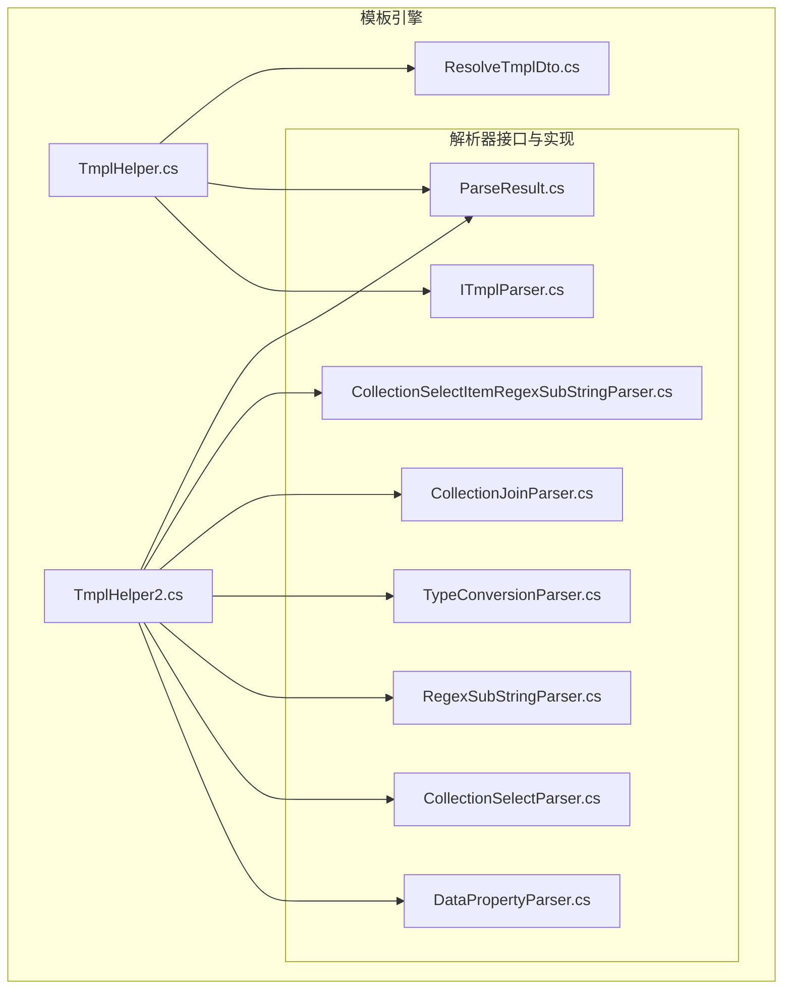
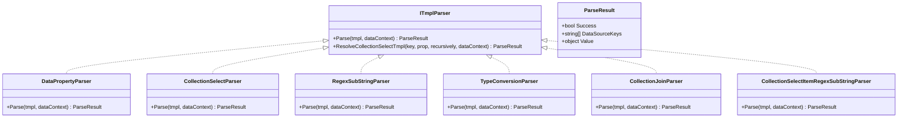
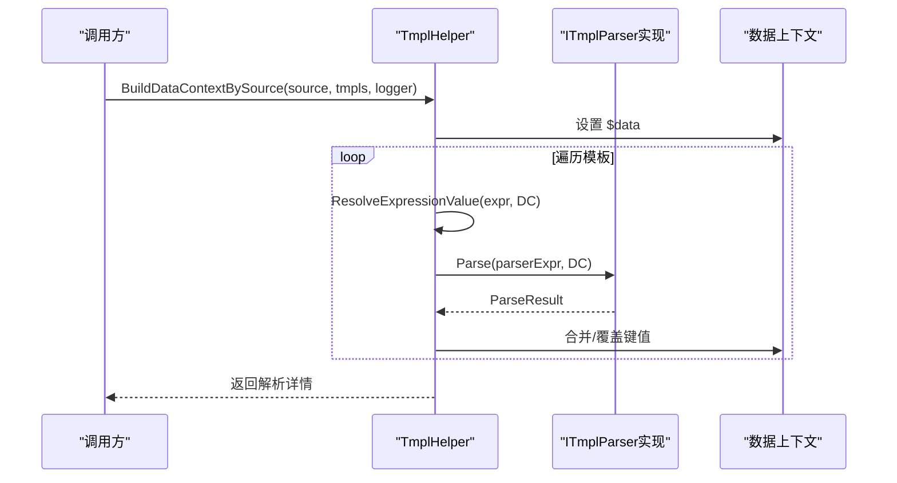
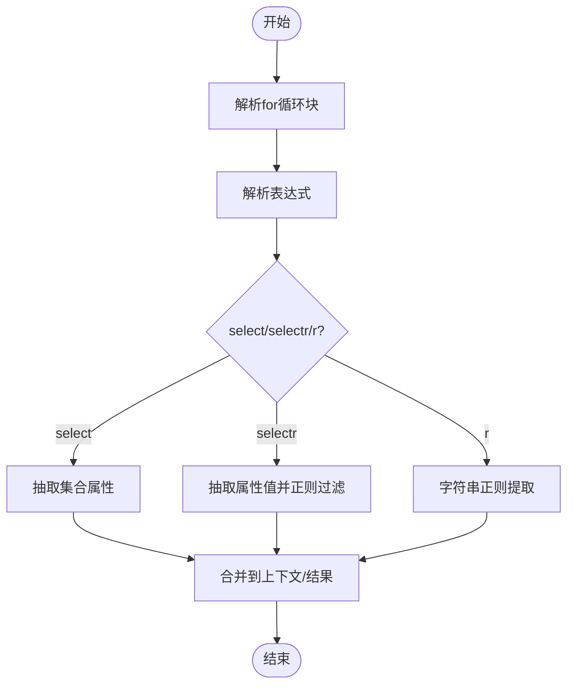
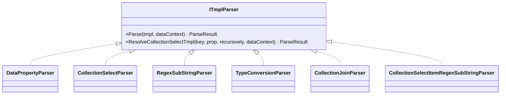
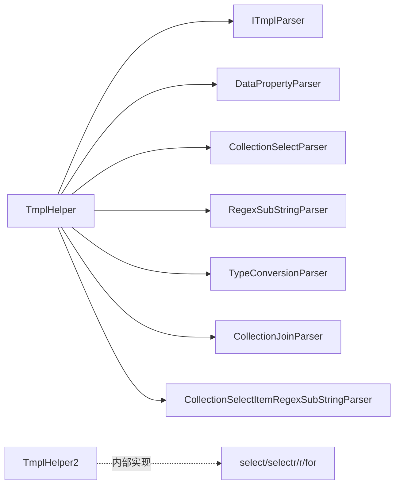

# 模板引擎系统

<cite>
**本文档引用的文件**
- [TmplHelper.cs](file://Sylas.RemoteTasks.Utils/Template/TmplHelper.cs)
- [TmplHelper2.cs](file://Sylas.RemoteTasks.Utils/Template/TmplHelper2.cs)
- [ITmplParser.cs](file://Sylas.RemoteTasks.Utils/Template/Parser/ITmplParser.cs)
- [DataPropertyParser.cs](file://Sylas.RemoteTasks.Utils/Template/Parser/DataPropertyParser.cs)
- [CollectionSelectParser.cs](file://Sylas.RemoteTasks.Utils/Template/Parser/CollectionSelectParser.cs)
- [RegexSubStringParser.cs](file://Sylas.RemoteTasks.Utils/Template/Parser/RegexSubStringParser.cs)
- [TypeConversionParser.cs](file://Sylas.RemoteTasks.Utils/Template/Parser/TypeConversionParser.cs)
- [CollectionJoinParser.cs](file://Sylas.RemoteTasks.Utils/Template/Parser/CollectionJoinParser.cs)
- [CollectionSelectItemRegexSubStringParser.cs](file://Sylas.RemoteTasks.Utils/Template/Parser/CollectionSelectItemRegexSubStringParser.cs)
- [ParseResult.cs](file://Sylas.RemoteTasks.Utils/Template/Parser/ParseResult.cs)
- [ResolveTmplDto.cs](file://Sylas.RemoteTasks.Utils/Template/Dtos/ResolveTmplDto.cs)
- [TmplParserTest.cs](file://Sylas.RemoteTasks.Test/Tmpl/TmplParserTest.cs)
- [TmplParser2Test.cs](file://Sylas.RemoteTasks.Test/Tmpl/TmplParser2Test.cs)
</cite>

## 目录
1. [简介](#简介)
2. [项目结构](#项目结构)
3. [核心组件](#核心组件)
4. [架构总览](#架构总览)
5. [组件详解](#组件详解)
6. [依赖关系分析](#依赖关系分析)
7. [性能考量](#性能考量)
8. [故障排查指南](#故障排查指南)
9. [结论](#结论)
10. [附录](#附录)

## 简介
本文件面向模板引擎系统，系统提供两套模板解析能力：
- TmplHelper：基于解析器接口 ITmplParser 的扩展解析器体系，支持属性解析、集合选择、正则截取、类型转换、集合拼接、集合+正则组合等多种解析器，并提供上下文构建、表达式解析、for 循环渲染等能力。
- TmplHelper2：面向 JSON/JToken 的轻量表达式解析器，支持 select/selectr（集合属性抽取/正则抽取）、r（正则提取）、for 循环、表达式提取器等。

本文档将深入讲解两类模板助手的实现细节、使用方法、扩展机制与常见问题的解决方案，并给出关键数据结构与解析流程图示。

## 项目结构
模板引擎位于 Utils 工程下的 Template 目录，按“功能域+解析器”组织：
- Template/TmplHelper.cs：主入口，负责上下文构建、表达式解析、for 循环渲染、解析器工厂与缓存。
- Template/TmplHelper2.cs：面向 JSON/JToken 的表达式解析器，支持 select/selectr/r/for 等。
- Template/Parser/*：解析器接口与具体实现，统一返回 ParseResult。
- Template/Dtos/*：模板解析 DTO，如 ResolveTmplDto。

图表来源
- [TmplHelper.cs](file://Sylas.RemoteTasks.Utils/Template/TmplHelper.cs#L1-L740)
- [TmplHelper2.cs](file://Sylas.RemoteTasks.Utils/Template/TmplHelper2.cs#L1-L416)
- [ITmplParser.cs](file://Sylas.RemoteTasks.Utils/Template/Parser/ITmplParser.cs#L1-L105)
- [DataPropertyParser.cs](file://Sylas.RemoteTasks.Utils/Template/Parser/DataPropertyParser.cs#L1-L145)
- [CollectionSelectParser.cs](file://Sylas.RemoteTasks.Utils/Template/Parser/CollectionSelectParser.cs#L1-L33)
- [RegexSubStringParser.cs](file://Sylas.RemoteTasks.Utils/Template/Parser/RegexSubStringParser.cs#L1-L39)
- [TypeConversionParser.cs](file://Sylas.RemoteTasks.Utils/Template/Parser/TypeConversionParser.cs#L1-L102)
- [CollectionJoinParser.cs](file://Sylas.RemoteTasks.Utils/Template/Parser/CollectionJoinParser.cs#L1-L72)
- [CollectionSelectItemRegexSubStringParser.cs](file://Sylas.RemoteTasks.Utils/Template/Parser/CollectionSelectItemRegexSubStringParser.cs#L1-L64)
- [ParseResult.cs](file://Sylas.RemoteTasks.Utils/Template/Parser/ParseResult.cs#L1-L42)
- [ResolveTmplDto.cs](file://Sylas.RemoteTasks.Utils/Template/Dtos/ResolveTmplDto.cs#L1-L18)

章节来源
- [TmplHelper.cs](file://Sylas.RemoteTasks.Utils/Template/TmplHelper.cs#L1-L740)
- [TmplHelper2.cs](file://Sylas.RemoteTasks.Utils/Template/TmplHelper2.cs#L1-L416)

## 核心组件
- TmplHelper：提供 BuildDataContextBySource、ResolveExpressionValue、ResolveTemplate、ResolveSelfTmplValues 等能力；内置解析器工厂与缓存，支持 for 循环块渲染。
- TmplHelper2：提供 ResolveTmpl、ResolveExtractors、ResolveExpression 等能力；支持 select/selectr/r/for 等表达式语法。
- ITmplParser：解析器接口，定义 Parse 方法与静态集合选择辅助 ResolveCollectionSelectTmpl。
- ParseResult：解析结果封装，包含 Success、DataSourceKeys、Value。
- ResolveTmplDto：模板解析数据传输对象，包含模板文本与数据模型 JSON 字符串。

章节来源
- [TmplHelper.cs](file://Sylas.RemoteTasks.Utils/Template/TmplHelper.cs#L19-L740)
- [TmplHelper2.cs](file://Sylas.RemoteTasks.Utils/Template/TmplHelper2.cs#L18-L416)
- [ITmplParser.cs](file://Sylas.RemoteTasks.Utils/Template/Parser/ITmplParser.cs#L14-L105)
- [ParseResult.cs](file://Sylas.RemoteTasks.Utils/Template/Parser/ParseResult.cs#L6-L42)
- [ResolveTmplDto.cs](file://Sylas.RemoteTasks.Utils/Template/Dtos/ResolveTmplDto.cs#L6-L18)

## 架构总览
模板引擎采用“解析器接口 + 多种解析器实现”的扩展架构。TmplHelper 通过反射发现 ITmplParser 的具体实现，实例化后调用 Parse；TmplHelper2 则直接在内部实现 select/selectr/r/for 等逻辑。

图表来源
- [ITmplParser.cs](file://Sylas.RemoteTasks.Utils/Template/Parser/ITmplParser.cs#L14-L105)
- [DataPropertyParser.cs](file://Sylas.RemoteTasks.Utils/Template/Parser/DataPropertyParser.cs#L16-L145)
- [CollectionSelectParser.cs](file://Sylas.RemoteTasks.Utils/Template/Parser/CollectionSelectParser.cs#L9-L33)
- [RegexSubStringParser.cs](file://Sylas.RemoteTasks.Utils/Template/Parser/RegexSubStringParser.cs#L11-L39)
- [TypeConversionParser.cs](file://Sylas.RemoteTasks.Utils/Template/Parser/TypeConversionParser.cs#L15-L102)
- [CollectionJoinParser.cs](file://Sylas.RemoteTasks.Utils/Template/Parser/CollectionJoinParser.cs#L13-L72)
- [CollectionSelectItemRegexSubStringParser.cs](file://Sylas.RemoteTasks.Utils/Template/Parser/CollectionSelectItemRegexSubStringParser.cs#L13-L64)
- [ParseResult.cs](file://Sylas.RemoteTasks.Utils/Template/Parser/ParseResult.cs#L6-L42)

## 组件详解

### TmplHelper：上下文构建与表达式解析
- 上下文构建 BuildDataContextBySource
  - 将 source 缓存到 dataContext["$data"]，遍历 dataContextBuilderTmpls，解析每个模板表达式，支持多种解析器（属性、集合选择、正则、类型转换、集合拼接、集合+正则）。
  - 对同名 key 的多次赋值进行合并（如数组追加），并记录日志。
- 表达式解析 ResolveExpressionValue
  - 支持字符串模板中包含多个表达式，自动识别 $var、${var}、{{var}} 等形式。
  - 通过解析器工厂反射加载 ITmplParser 实现，解析表达式并返回值；若解析结果为数组，则返回字符串集合。
  - 支持 for 循环块渲染 RenderTemplateWithForLoopBlocks。
- 自身模板解析 ResolveSelfTmplValues
  - 遍历 dataContext 中的字符串值，解析其中引用的表达式并替换。
- 模板解析 ResolveTemplate
  - 支持 $for/$forend 块，对块内表达式进行上下文替换与渲染。

图表来源
- [TmplHelper.cs](file://Sylas.RemoteTasks.Utils/Template/TmplHelper.cs#L213-L271)
- [TmplHelper.cs](file://Sylas.RemoteTasks.Utils/Template/TmplHelper.cs#L461-L634)
- [ITmplParser.cs](file://Sylas.RemoteTasks.Utils/Template/Parser/ITmplParser.cs#L20-L30)

章节来源
- [TmplHelper.cs](file://Sylas.RemoteTasks.Utils/Template/TmplHelper.cs#L19-L740)

### TmplHelper2：JSON/JToken 表达式解析
- ResolveTmpl
  - 先解析 for 循环，再解析表达式，支持忽略不存在的表达式。
- ResolveExtractors
  - 支持“赋值表达式”和“.add(...)”集合追加语法，链式管道解析多个提取器。
- ResolveExpression
  - 支持 select/selectr/r 等语法：select(prop) 抽取集合属性，selectr(prop, regex...) 对属性值做正则抽取，r(pattern...) 从字符串中提取正则分组。
  - 支持数组索引访问与属性链式解析。
- ResolveTmplForLoopInfos
  - 解析 for(item in $collection) {...} 语法，逐项替换并拼接结果。

图表来源
- [TmplHelper2.cs](file://Sylas.RemoteTasks.Utils/Template/TmplHelper2.cs#L39-L362)

章节来源
- [TmplHelper2.cs](file://Sylas.RemoteTasks.Utils/Template/TmplHelper2.cs#L18-L416)

### ITmplParser 接口与解析器实现
- ITmplParser
  - 定义 Parse 方法，返回 ParseResult。
  - 提供静态 ResolveCollectionSelectTmpl，支持集合属性抽取与递归抽取。
- DataPropertyParser
  - 支持 $key、$key[index]、$key.prop.subprop 等路径解析；兼容 JsonElement、JObject、IEnumerable 等类型。
- CollectionSelectParser
  - 语法：$key select prop [-r]，调用 ITmplParser.ResolveCollectionSelectTmpl。
- RegexSubStringParser
  - 语法：$key reg `pattern` group，从字符串中按正则分组提取。
- TypeConversionParser
  - 语法：$key as List/Object，将字符串/JsonElement/JArray 转换为目标类型。
- CollectionJoinParser
  - 语法：$key join separator，将集合连接为字符串。
- CollectionSelectItemRegexSubStringParser
  - 语法：$key select prop [-r] reg `pattern` group，先抽取集合属性，再对每个字符串项做正则提取。

图表来源
- [ITmplParser.cs](file://Sylas.RemoteTasks.Utils/Template/Parser/ITmplParser.cs#L14-L105)
- [DataPropertyParser.cs](file://Sylas.RemoteTasks.Utils/Template/Parser/DataPropertyParser.cs#L16-L145)
- [CollectionSelectParser.cs](file://Sylas.RemoteTasks.Utils/Template/Parser/CollectionSelectParser.cs#L9-L33)
- [RegexSubStringParser.cs](file://Sylas.RemoteTasks.Utils/Template/Parser/RegexSubStringParser.cs#L11-L39)
- [TypeConversionParser.cs](file://Sylas.RemoteTasks.Utils/Template/Parser/TypeConversionParser.cs#L15-L102)
- [CollectionJoinParser.cs](file://Sylas.RemoteTasks.Utils/Template/Parser/CollectionJoinParser.cs#L13-L72)
- [CollectionSelectItemRegexSubStringParser.cs](file://Sylas.RemoteTasks.Utils/Template/Parser/CollectionSelectItemRegexSubStringParser.cs#L13-L64)

章节来源
- [ITmplParser.cs](file://Sylas.RemoteTasks.Utils/Template/Parser/ITmplParser.cs#L14-L105)
- [DataPropertyParser.cs](file://Sylas.RemoteTasks.Utils/Template/Parser/DataPropertyParser.cs#L16-L145)
- [CollectionSelectParser.cs](file://Sylas.RemoteTasks.Utils/Template/Parser/CollectionSelectParser.cs#L9-L33)
- [RegexSubStringParser.cs](file://Sylas.RemoteTasks.Utils/Template/Parser/RegexSubStringParser.cs#L11-L39)
- [TypeConversionParser.cs](file://Sylas.RemoteTasks.Utils/Template/Parser/TypeConversionParser.cs#L15-L102)
- [CollectionJoinParser.cs](file://Sylas.RemoteTasks.Utils/Template/Parser/CollectionJoinParser.cs#L13-L72)
- [CollectionSelectItemRegexSubStringParser.cs](file://Sylas.RemoteTasks.Utils/Template/Parser/CollectionSelectItemRegexSubStringParser.cs#L13-L64)

### 核心数据结构
- ParseResult
  - Success：解析是否成功
  - DataSourceKeys：依赖的数据源键集合
  - Value：解析结果值
- ResolveTmplDto
  - TmplTxt：模板文本
  - DatamodelJson：数据模型 JSON 字符串

章节来源
- [ParseResult.cs](file://Sylas.RemoteTasks.Utils/Template/Parser/ParseResult.cs#L6-L42)
- [ResolveTmplDto.cs](file://Sylas.RemoteTasks.Utils/Template/Dtos/ResolveTmplDto.cs#L6-L18)

### 使用示例与最佳实践
- 在 TmplHelper 中使用解析器
  - 示例：属性解析、正则提取、类型转换、集合选择、集合拼接、集合+正则组合、for 循环渲染。
  - 参考测试用例路径：
    - [TmplParserTest.cs](file://Sylas.RemoteTasks.Test/Tmpl/TmplParserTest.cs#L42-L401)
- 在 TmplHelper2 中使用表达式
  - 示例：select/selectr/r/for、表达式提取器、JsonElement 上下文。
  - 参考测试用例路径：
    - [TmplParser2Test.cs](file://Sylas.RemoteTasks.Test/Tmpl/TmplParser2Test.cs#L102-L310)

章节来源
- [TmplParserTest.cs](file://Sylas.RemoteTasks.Test/Tmpl/TmplParserTest.cs#L1-L425)
- [TmplParser2Test.cs](file://Sylas.RemoteTasks.Test/Tmpl/TmplParser2Test.cs#L1-L312)

## 依赖关系分析
- TmplHelper 依赖 ITmplParser 及其所有实现，通过反射发现并缓存解析器实例，避免重复创建。
- TmplHelper2 内部实现 select/selectr/r/for 等逻辑，不依赖 ITmplParser。
- 两者均依赖通用扩展与日志工具，确保解析过程可观测。

图表来源
- [TmplHelper.cs](file://Sylas.RemoteTasks.Utils/Template/TmplHelper.cs#L451-L634)
- [ITmplParser.cs](file://Sylas.RemoteTasks.Utils/Template/Parser/ITmplParser.cs#L14-L105)
- [TmplHelper2.cs](file://Sylas.RemoteTasks.Utils/Template/TmplHelper2.cs#L39-L396)

章节来源
- [TmplHelper.cs](file://Sylas.RemoteTasks.Utils/Template/TmplHelper.cs#L451-L634)
- [TmplHelper2.cs](file://Sylas.RemoteTasks.Utils/Template/TmplHelper2.cs#L39-L396)

## 性能考量
- 解析器缓存：TmplHelper 内部维护解析器实例映射，避免重复反射与实例化，降低开销。
- 数组展开策略：当表达式解析结果为数组时，TmplHelper 会为每个元素生成一个字符串结果，可能导致结果数量爆炸，建议在模板中谨慎使用数组表达式。
- 正则匹配：RegexSubStringParser 与 TmplHelper2 的 r/selectr 正则提取需注意正则复杂度，避免回溯灾难。
- for 循环渲染：TmplHelper 的 for 块渲染会递归处理嵌套循环，注意集合规模与上下文复制成本。

## 故障排查指南
- 未找到解析器
  - 现象：抛出“未找到Parser”异常。
  - 排查：确认解析器命名与 ITmplParser 实现一致，且程序集可被反射发现。
  - 参考：[TmplHelper.cs](file://Sylas.RemoteTasks.Utils/Template/TmplHelper.cs#L609-L616)
- 表达式语法错误
  - 现象：抛出“表达式解析失败”或“for语句解析错误”等异常。
  - 排查：检查模板语法是否符合解析器要求（如 $key select prop [-r]、$key reg `pattern` group 等）。
  - 参考：[DataPropertyParser.cs](file://Sylas.RemoteTasks.Utils/Template/Parser/DataPropertyParser.cs#L32-L37)，[CollectionSelectParser.cs](file://Sylas.RemoteTasks.Utils/Template/Parser/CollectionSelectParser.cs#L20-L29)
- 数据类型不匹配
  - 现象：类型转换或数组访问异常。
  - 排查：确认上下文中的值类型与解析器期望一致（如 as List/Object、数组索引访问）。
  - 参考：[TypeConversionParser.cs](file://Sylas.RemoteTasks.Utils/Template/Parser/TypeConversionParser.cs#L28-L98)，[CollectionJoinParser.cs](file://Sylas.RemoteTasks.Utils/Template/Parser/CollectionJoinParser.cs#L25-L69)
- 正则提取失败
  - 现象：r/selectr 正则无匹配或分组不存在。
  - 排查：确认正则模式与目标字符串匹配，分组名正确。
  - 参考：[RegexSubStringParser.cs](file://Sylas.RemoteTasks.Utils/Template/Parser/RegexSubStringParser.cs#L23-L35)，[TmplHelper2.cs](file://Sylas.RemoteTasks.Utils/Template/TmplHelper2.cs#L233-L272)

章节来源
- [TmplHelper.cs](file://Sylas.RemoteTasks.Utils/Template/TmplHelper.cs#L609-L634)
- [DataPropertyParser.cs](file://Sylas.RemoteTasks.Utils/Template/Parser/DataPropertyParser.cs#L32-L37)
- [CollectionSelectParser.cs](file://Sylas.RemoteTasks.Utils/Template/Parser/CollectionSelectParser.cs#L20-L29)
- [TypeConversionParser.cs](file://Sylas.RemoteTasks.Utils/Template/Parser/TypeConversionParser.cs#L28-L98)
- [CollectionJoinParser.cs](file://Sylas.RemoteTasks.Utils/Template/Parser/CollectionJoinParser.cs#L25-L69)
- [RegexSubStringParser.cs](file://Sylas.RemoteTasks.Utils/Template/Parser/RegexSubStringParser.cs#L23-L35)
- [TmplHelper2.cs](file://Sylas.RemoteTasks.Utils/Template/TmplHelper2.cs#L233-L272)

## 结论
模板引擎系统提供了两条清晰的解析路径：
- TmplHelper：面向扩展的解析器体系，适合复杂场景与多解析器组合。
- TmplHelper2：面向 JSON/JToken 的简洁表达式解析，适合快速抽取与 for 渲染。

通过 ParseResult 统一封装解析结果，配合 ResolveTmplDto 与上下文构建，系统能够灵活应对多样化的模板解析需求。建议在大规模数据与复杂正则场景下优先考虑 TmplHelper 的解析器扩展能力，在轻量 JSON 抽取场景下优先使用 TmplHelper2。

## 附录
- 测试用例参考
  - TmplHelper：[TmplParserTest.cs](file://Sylas.RemoteTasks.Test/Tmpl/TmplParserTest.cs#L42-L401)
  - TmplHelper2：[TmplParser2Test.cs](file://Sylas.RemoteTasks.Test/Tmpl/TmplParser2Test.cs#L102-L310)