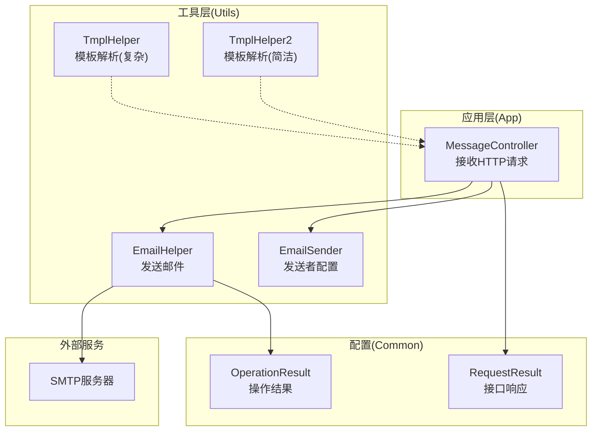
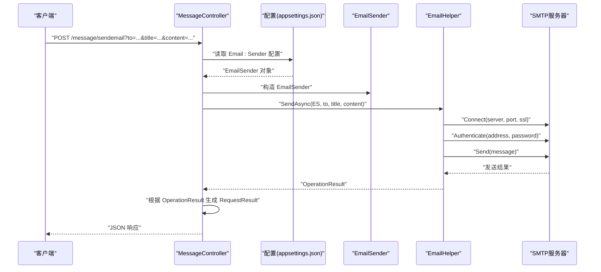
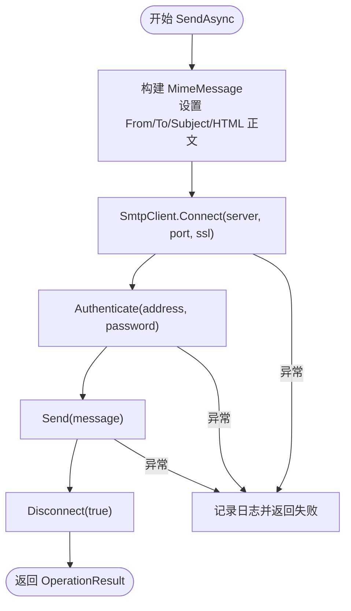
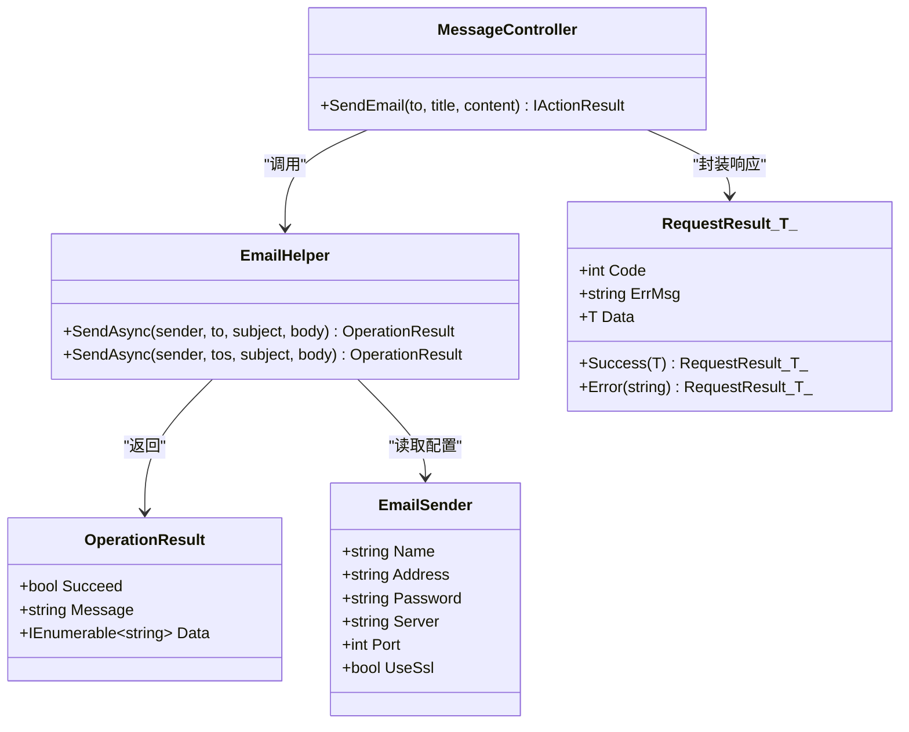

# 消息处理系统

<cite>
**本文引用的文件**
- [EmailHelper.cs](file://Sylas.RemoteTasks.Utils/Message/EmailHelper.cs)
- [EmailSender.cs](file://Sylas.RemoteTasks.Utils/Message/EmailSender.cs)
- [MessageController.cs](file://Sylas.RemoteTasks.App/Controllers/MessageController.cs)
- [appsettings.json](file://Sylas.RemoteTasks.App/appsettings.json)
- [OperationResult.cs](file://Sylas.RemoteTasks.Common/Dtos/OperationResult.cs)
- [RequestResult.cs](file://Sylas.RemoteTasks.Common/Dtos/RequestResult.cs)
- [TmplHelper.cs](file://Sylas.RemoteTasks.Utils/Template/TmplHelper.cs)
- [TmplHelper2.cs](file://Sylas.RemoteTasks.Utils/Template/TmplHelper2.cs)
</cite>

## 目录
1. [简介](#简介)
2. [项目结构](#项目结构)
3. [核心组件](#核心组件)
4. [架构总览](#架构总览)
5. [详细组件分析](#详细组件分析)
6. [依赖关系分析](#依赖关系分析)
7. [性能考量](#性能考量)
8. [故障排除指南](#故障排除指南)
9. [结论](#结论)
10. [附录](#附录)

## 简介
本文件面向“消息处理系统”，聚焦于邮件发送能力的实现与使用，包括：
- 邮件发送配置（EmailSender）
- 邮件发送流程（EmailHelper）
- 控制器层调用（MessageController）
- 配置文件（appsettings.json）中的邮件配置
- 模板处理能力（TmplHelper/TmplHelper2），用于生成邮件正文
- 返回值与错误处理（OperationResult、RequestResult）

目标是帮助读者快速理解如何配置、发送邮件，并掌握模板渲染、批量发送、错误处理、安全与性能优化等关键点。

## 项目结构
消息处理系统主要由以下模块构成：
- Utils 层：提供邮件发送与模板处理能力
- App 层：提供控制器入口，读取配置并调用邮件发送
- Common 层：提供通用 DTO（OperationResult、RequestResult）

图表来源
- [MessageController.cs](file://Sylas.RemoteTasks.App/Controllers/MessageController.cs#L1-L18)
- [EmailHelper.cs](file://Sylas.RemoteTasks.Utils/Message/EmailHelper.cs#L1-L77)
- [EmailSender.cs](file://Sylas.RemoteTasks.Utils/Message/EmailSender.cs#L1-L34)
- [OperationResult.cs](file://Sylas.RemoteTasks.Common/Dtos/OperationResult.cs#L1-L52)
- [RequestResult.cs](file://Sylas.RemoteTasks.Common/Dtos/RequestResult.cs#L1-L65)
- [TmplHelper.cs](file://Sylas.RemoteTasks.Utils/Template/TmplHelper.cs#L1-L740)
- [TmplHelper2.cs](file://Sylas.RemoteTasks.Utils/Template/TmplHelper2.cs#L1-L416)

章节来源
- [MessageController.cs](file://Sylas.RemoteTasks.App/Controllers/MessageController.cs#L1-L18)
- [EmailHelper.cs](file://Sylas.RemoteTasks.Utils/Message/EmailHelper.cs#L1-L77)
- [EmailSender.cs](file://Sylas.RemoteTasks.Utils/Message/EmailSender.cs#L1-L34)
- [appsettings.json](file://Sylas.RemoteTasks.App/appsettings.json#L125-L140)
- [OperationResult.cs](file://Sylas.RemoteTasks.Common/Dtos/OperationResult.cs#L1-L52)
- [RequestResult.cs](file://Sylas.RemoteTasks.Common/Dtos/RequestResult.cs#L1-L65)
- [TmplHelper.cs](file://Sylas.RemoteTasks.Utils/Template/TmplHelper.cs#L1-L740)
- [TmplHelper2.cs](file://Sylas.RemoteTasks.Utils/Template/TmplHelper2.cs#L1-L416)

## 核心组件
- EmailSender：封装发件人配置（名称、邮箱地址、SMTP服务器、端口、SSL开关、授权码/密码）
- EmailHelper：封装邮件发送逻辑（单收件人/批量收件人）、连接/认证/发送/断开、异常捕获与返回
- MessageController：从配置读取 EmailSender，调用 EmailHelper 发送邮件，返回统一的 RequestResult
- 模板系统：TmplHelper/TmplHelper2 提供模板解析与表达式求值，可用于生成 HTML 邮件正文
- 返回模型：OperationResult 用于内部操作结果；RequestResult<T> 用于对外接口响应

章节来源
- [EmailSender.cs](file://Sylas.RemoteTasks.Utils/Message/EmailSender.cs#L1-L34)
- [EmailHelper.cs](file://Sylas.RemoteTasks.Utils/Message/EmailHelper.cs#L1-L77)
- [MessageController.cs](file://Sylas.RemoteTasks.App/Controllers/MessageController.cs#L1-L18)
- [OperationResult.cs](file://Sylas.RemoteTasks.Common/Dtos/OperationResult.cs#L1-L52)
- [RequestResult.cs](file://Sylas.RemoteTasks.Common/Dtos/RequestResult.cs#L1-L65)
- [TmplHelper.cs](file://Sylas.RemoteTasks.Utils/Template/TmplHelper.cs#L1-L740)
- [TmplHelper2.cs](file://Sylas.RemoteTasks.Utils/Template/TmplHelper2.cs#L1-L416)

## 架构总览
下图展示了从控制器到邮件发送再到模板处理的整体流程。

图表来源
- [MessageController.cs](file://Sylas.RemoteTasks.App/Controllers/MessageController.cs#L9-L15)
- [EmailHelper.cs](file://Sylas.RemoteTasks.Utils/Message/EmailHelper.cs#L22-L55)
- [appsettings.json](file://Sylas.RemoteTasks.App/appsettings.json#L125-L140)

## 详细组件分析

### EmailSender：邮件发送者配置
- 字段说明
  - Name：收件人看到的发件人名称
  - Address：发件人邮箱地址
  - Password：授权码或密码（用于 SMTP 认证）
  - Server：SMTP 服务器地址
  - Port：SMTP 端口
  - UseSsl：是否启用 SSL/TLS
- 默认行为
  - UseSsl 默认为 true
  - Port 未显式设置时，通常使用 SMTP 服务器默认端口（如 465/587）
- 安全建议
  - 使用授权码而非账户密码（尤其对 Gmail/Outlook 等）
  - 避免在代码中硬编码敏感信息，优先通过配置文件或密钥管理服务注入

章节来源
- [EmailSender.cs](file://Sylas.RemoteTasks.Utils/Message/EmailSender.cs#L6-L32)
- [appsettings.json](file://Sylas.RemoteTasks.App/appsettings.json#L125-L140)

### EmailHelper：邮件发送器
- 单收件人发送
  - 构造 MimeMessage，设置 From/To/Subject/HTML 正文
  - 通过 SmtpClient 连接、认证、发送、断开
  - 异常捕获并返回 OperationResult
- 批量发送
  - 对每个收件人异步发送，等待所有任务完成
  - 返回 OperationResult（成功时 Data 为空）
- 关键流程图

图表来源
- [EmailHelper.cs](file://Sylas.RemoteTasks.Utils/Message/EmailHelper.cs#L22-L55)
- [EmailHelper.cs](file://Sylas.RemoteTasks.Utils/Message/EmailHelper.cs#L64-L74)

章节来源
- [EmailHelper.cs](file://Sylas.RemoteTasks.Utils/Message/EmailHelper.cs#L1-L77)

### MessageController：邮件发送入口
- 从 IConfiguration 读取 Email:Sender 配置并映射为 EmailSender
- 调用 EmailHelper.SendAsync 发送邮件
- 将 OperationResult 转换为 RequestResult<bool> 返回

章节来源
- [MessageController.cs](file://Sylas.RemoteTasks.App/Controllers/MessageController.cs#L1-L18)
- [appsettings.json](file://Sylas.RemoteTasks.App/appsettings.json#L125-L140)

### 模板处理：生成邮件正文
- TmplHelper
  - 支持复杂表达式、解析器链（如 DataPropertyParser、CollectionSelectParser、RegexSubStringParser 等）
  - 支持 for 循环块渲染
  - 支持构建数据上下文、自引用解析
- TmplHelper2
  - 提供简洁的字符串模板解析与 for 循环语法
  - 支持 select/selectr、r() 正则提取、.add() 集合追加等表达式
- 使用建议
  - 将模板与数据上下文组合，先用模板生成 HTML，再传入 EmailHelper 发送

章节来源
- [TmplHelper.cs](file://Sylas.RemoteTasks.Utils/Template/TmplHelper.cs#L1-L740)
- [TmplHelper2.cs](file://Sylas.RemoteTasks.Utils/Template/TmplHelper2.cs#L1-L416)

### 返回值与错误处理
- OperationResult
  - Succeed：是否成功
  - Message：错误信息
  - Data：可选数据（批量发送场景）
- RequestResult<T>
  - Code：状态码
  - ErrMsg：错误信息
  - Data：返回数据
- 控制器层将 OperationResult 映射为 RequestResult<bool>，便于前端统一处理

章节来源
- [OperationResult.cs](file://Sylas.RemoteTasks.Common/Dtos/OperationResult.cs#L1-L52)
- [RequestResult.cs](file://Sylas.RemoteTasks.Common/Dtos/RequestResult.cs#L1-L65)
- [MessageController.cs](file://Sylas.RemoteTasks.App/Controllers/MessageController.cs#L11-L14)

## 依赖关系分析
- EmailHelper 依赖：
  - MailKit/MimeKit（SMTP 客户端与 MIME 构建）
  - Common.Dtos（OperationResult）
- MessageController 依赖：
  - IConfiguration（读取配置）
  - EmailHelper（发送邮件）
  - RequestResult/OperationResult（封装响应）
- 模板系统：
  - TmplHelper/TmplHelper2 依赖 Common 扩展与正则表达式，用于解析表达式与渲染 HTML

图表来源
- [EmailSender.cs](file://Sylas.RemoteTasks.Utils/Message/EmailSender.cs#L6-L32)
- [EmailHelper.cs](file://Sylas.RemoteTasks.Utils/Message/EmailHelper.cs#L1-L77)
- [MessageController.cs](file://Sylas.RemoteTasks.App/Controllers/MessageController.cs#L1-L18)
- [OperationResult.cs](file://Sylas.RemoteTasks.Common/Dtos/OperationResult.cs#L1-L52)
- [RequestResult.cs](file://Sylas.RemoteTasks.Common/Dtos/RequestResult.cs#L1-L65)

## 性能考量
- 批量发送
  - EmailHelper 使用 Task.WhenAll 并行发送，提升吞吐
  - 注意 SMTP 服务器并发限制与速率限制，必要时增加节流或队列
- 连接复用
  - 当前实现每次发送均建立/断开连接，适合小规模发送
  - 大规模场景建议引入连接池或长连接策略（需评估实现复杂度与稳定性）
- 模板渲染
  - 复杂模板与大量数据上下文会增加 CPU 与内存消耗
  - 建议缓存稳定不变的模板片段，避免重复解析
- 日志与可观测性
  - 控制台输出仅作调试用途，生产环境建议接入结构化日志与监控

[本节为通用指导，不直接分析具体文件]

## 故障排除指南
- SMTP 连接失败
  - 检查 Server/Port/UseSsl 配置是否正确
  - 确认网络可达与防火墙放行
- 认证失败
  - 确认 Address 与 Password 正确
  - 对某些服务商需使用授权码而非登录密码
- 发送异常
  - EmailHelper 捕获异常并返回失败 OperationResult
  - 控制器层将失败映射为 RequestResult 错误响应
- 批量发送部分失败
  - 当前实现等待所有任务完成，失败信息会被统一记录
  - 建议在上层记录每个收件人的发送结果以便重试

章节来源
- [EmailHelper.cs](file://Sylas.RemoteTasks.Utils/Message/EmailHelper.cs#L45-L54)
- [MessageController.cs](file://Sylas.RemoteTasks.App/Controllers/MessageController.cs#L11-L14)

## 结论
本消息处理系统以简洁的方式实现了基于 SMTP 的邮件发送，配合模板系统可灵活生成 HTML 邮件正文。通过配置驱动与统一的返回模型，系统具备良好的可维护性与扩展性。建议在生产环境中完善连接池、限流与监控，并采用更安全的凭据管理方案。

[本节为总结，不直接分析具体文件]

## 附录

### 配置项与参数说明
- appsettings.json 中的 Email:Sender
  - Name：显示名称
  - Address：发件人邮箱
  - Password：授权码/密码
  - Server：SMTP 服务器
  - Port：SMTP 端口
  - UseSsl：是否启用 SSL
- MessageController 接口
  - GET/POST 参数：to、title、content
  - 返回：RequestResult<bool>

章节来源
- [appsettings.json](file://Sylas.RemoteTasks.App/appsettings.json#L125-L140)
- [MessageController.cs](file://Sylas.RemoteTasks.App/Controllers/MessageController.cs#L9-L15)

### 模板使用示例（路径参考）
- 复杂模板与解析器链：参见 [TmplHelper.cs](file://Sylas.RemoteTasks.Utils/Template/TmplHelper.cs#L195-L449)
- 简洁模板与 for 循环：参见 [TmplHelper2.cs](file://Sylas.RemoteTasks.Utils/Template/TmplHelper2.cs#L369-L396)
- 表达式解析与提取：参见 [TmplHelper2.cs](file://Sylas.RemoteTasks.Utils/Template/TmplHelper2.cs#L185-L362)

### 邮件发送示例（路径参考）
- 单收件人发送：参见 [EmailHelper.cs](file://Sylas.RemoteTasks.Utils/Message/EmailHelper.cs#L22-L55)
- 批量收件人发送：参见 [EmailHelper.cs](file://Sylas.RemoteTasks.Utils/Message/EmailHelper.cs#L64-L74)
- 控制器调用：参见 [MessageController.cs](file://Sylas.RemoteTasks.App/Controllers/MessageController.cs#L9-L15)