# 站点JavaScript增强

<cite>
**本文档引用的文件**
- [site.js](file://Sylas.RemoteTasks.App/wwwroot/js/site.js)
- [anything.js](file://Sylas.RemoteTasks.App/wwwroot/js/anything.js)
- [flow.js](file://Sylas.RemoteTasks.App/wwwroot/js/flow.js)
- [vds-configurator.js](file://Sylas.RemoteTasks.App/wwwroot/js/vds-configurator.js)
- [site.css](file://Sylas.RemoteTasks.App/wwwroot/css/site.css)
- [_Layout.cshtml](file://Sylas.RemoteTasks.App/Views/Shared/_Layout.cshtml)
- [Index.cshtml](file://Sylas.RemoteTasks.App/Views/LowCode/Index.cshtml)
- [AnythingInfos.cshtml](file://Sylas.RemoteTasks.App/Views/Hosts/AnythingInfos.cshtml)
- [Flows.cshtml](file://Sylas.RemoteTasks.App/Views/Hosts/Flows.cshtml)
- [libman.json](file://Sylas.RemoteTasks.App/libman.json)
</cite>

## 更新摘要
**变更内容**
- 新增了通用的拖拽模态框功能，支持Bootstrap模态框的拖拽操作
- 重构了SSE请求处理逻辑，新增了sendSseRequestCommon通用函数和readSSEStream异步生成器
- 简化了anything.js中的命令执行逻辑，提升了代码组织性和可维护性
- 改进了消息处理和超时控制机制
- 优化了VDS配置器的用户体验，支持拖拽排序和模态框拖拽

## 目录
1. [简介](#简介)
2. [项目结构](#项目结构)
3. [核心组件](#核心组件)
4. [架构概览](#架构概览)
5. [详细组件分析](#详细组件分析)
6. [依赖关系分析](#依赖关系分析)
7. [性能考虑](#性能考虑)
8. [故障排除指南](#故障排除指南)
9. [结论](#结论)

## 简介

这是一个基于ASP.NET Core的远程任务管理系统，重点展示了现代JavaScript前端技术的增强实现。该项目采用模块化设计，提供了完整的前端JavaScript增强功能，包括数据表格管理、动态表单构建、实时命令执行、可视化配置器等核心功能。

项目的核心特色在于其JavaScript增强架构，通过统一的工具函数和组件化设计，实现了高度可复用的前端功能模块。这些模块不仅提升了用户体验，还为后续的功能扩展奠定了坚实的基础。

**最新更新**：新增拖拽模态框功能，重构SSE请求处理逻辑，优化消息处理机制。

## 项目结构

项目的前端架构采用清晰的层次化组织：

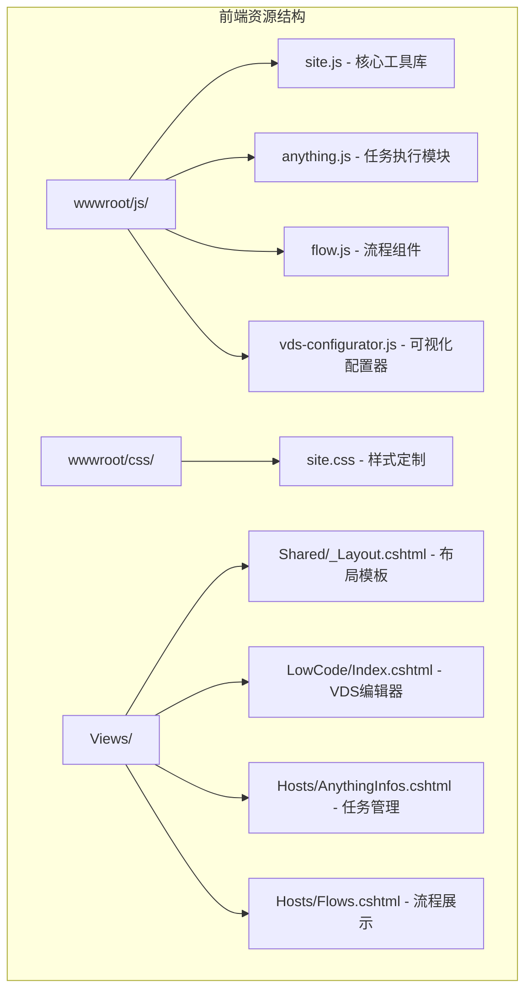

**图表来源**
- [site.js:1-1867](file://Sylas.RemoteTasks.App/wwwroot/js/site.js#L1-L1867)
- [_Layout.cshtml:1-842](file://Sylas.RemoteTasks.App/Views/Shared/_Layout.cshtml#L1-L842)

**章节来源**
- [site.js:1-1867](file://Sylas.RemoteTasks.App/wwwroot/js/site.js#L1-L1867)
- [site.css:1-178](file://Sylas.RemoteTasks.App/wwwroot/css/site.css#L1-L178)
- [_Layout.cshtml:1-842](file://Sylas.RemoteTasks.App/Views/Shared/_Layout.cshtml#L1-L842)

## 核心组件

### 1. 数据表格管理引擎

项目的核心是强大的数据表格管理功能，通过`createTable`函数实现了完整的CRUD操作：

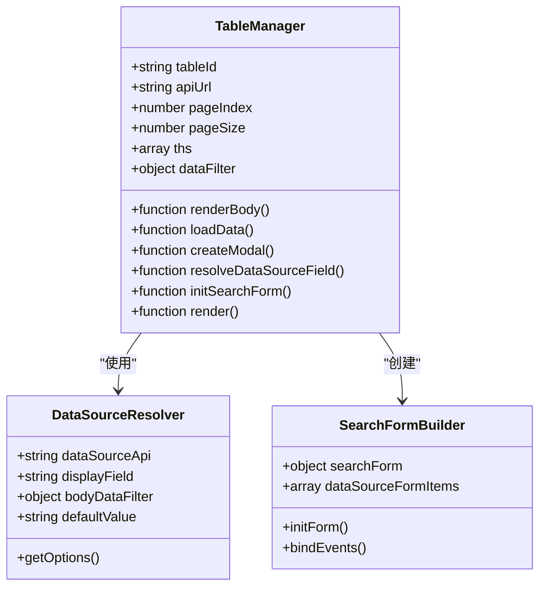

**图表来源**
- [site.js:123-761](file://Sylas.RemoteTasks.App/wwwroot/js/site.js#L123-L761)

### 2. 实时命令执行系统

anything.js模块提供了完整的命令执行和监控功能，现已重构为使用通用的SSE处理函数：

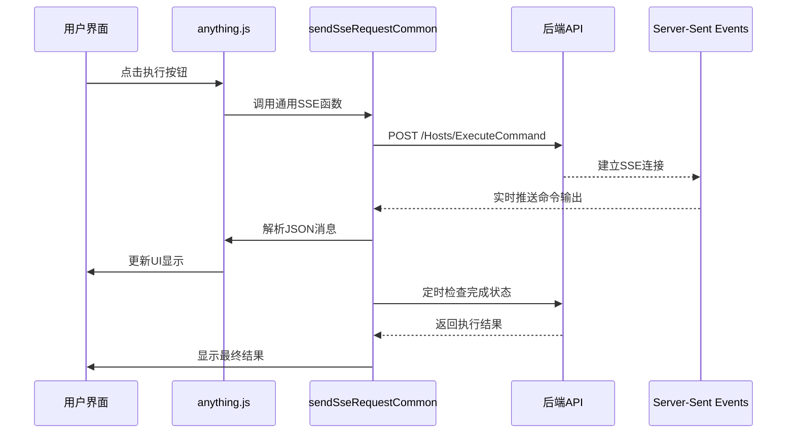

**图表来源**
- [anything.js:1-762](file://Sylas.RemoteTasks.App/wwwroot/js/anything.js#L1-L762)
- [site.js:1517-1599](file://Sylas.RemoteTasks.App/wwwroot/js/site.js#L1517-L1599)

### 3. 可视化配置器

vds-configurator.js提供了直观的VDS页面配置功能：

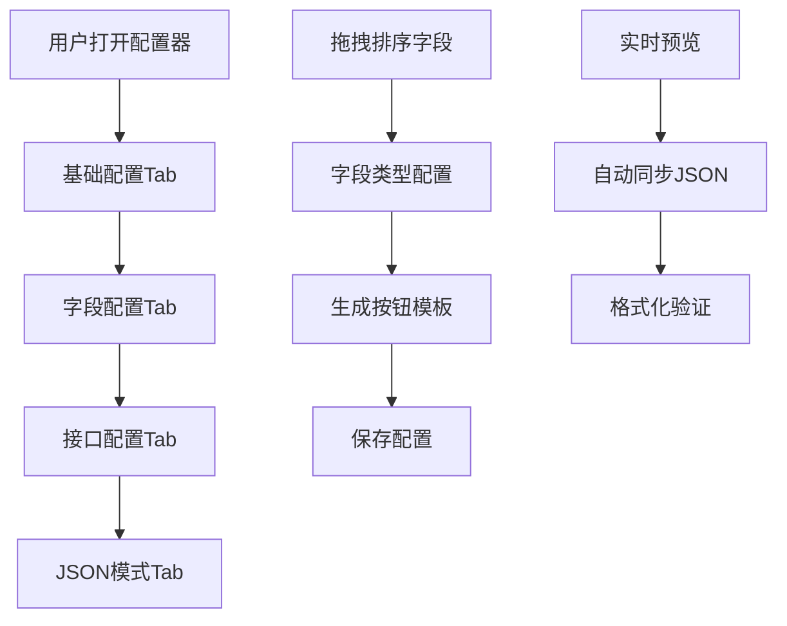

**图表来源**
- [vds-configurator.js:1-1341](file://Sylas.RemoteTasks.App/wwwroot/js/vds-configurator.js#L1-L1341)

### 4. 拖拽模态框功能

**新增** 通用的拖拽模态框功能，支持Bootstrap模态框的拖拽操作：

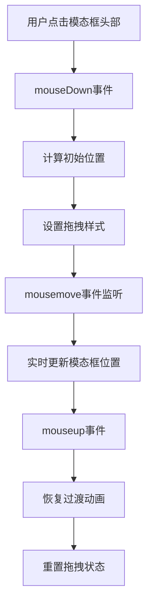

**图表来源**
- [site.js:10-94](file://Sylas.RemoteTasks.App/wwwroot/js/site.js#L10-L94)
- [vds-configurator.js:21-23](file://Sylas.RemoteTasks.App/wwwroot/js/vds-configurator.js#L21-L23)

**章节来源**
- [site.js:10-94](file://Sylas.RemoteTasks.App/wwwroot/js/site.js#L10-L94)
- [vds-configurator.js:21-23](file://Sylas.RemoteTasks.App/wwwroot/js/vds-configurator.js#L21-L23)

## 架构概览

项目采用了现代化的前端架构设计，实现了高度模块化的组件系统：

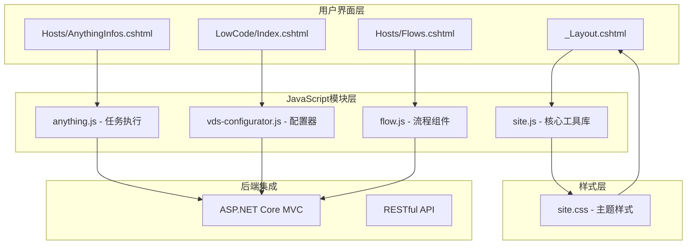

**图表来源**
- [_Layout.cshtml:1-842](file://Sylas.RemoteTasks.App/Views/Shared/_Layout.cshtml#L1-L842)
- [Index.cshtml:1-376](file://Sylas.RemoteTasks.App/Views/LowCode/Index.cshtml#L1-L376)
- [AnythingInfos.cshtml:1-11](file://Sylas.RemoteTasks.App/Views/Hosts/AnythingInfos.cshtml#L1-L11)

**章节来源**
- [_Layout.cshtml:1-842](file://Sylas.RemoteTasks.App/Views/Shared/_Layout.cshtml#L1-L842)
- [Index.cshtml:1-376](file://Sylas.RemoteTasks.App/Views/LowCode/Index.cshtml#L1-L376)
- [AnythingInfos.cshtml:1-11](file://Sylas.RemoteTasks.App/Views/Hosts/AnythingInfos.cshtml#L1-L11)

## 详细组件分析

### 1. 核心工具库 (site.js)

#### 数据表格管理器
数据表格管理器是整个系统的基础设施，提供了完整的数据操作能力：

**关键特性：**
- 动态表单生成
- 数据源自动解析
- 关键字搜索
- 分页导航
- 自定义数据视图

**章节来源**
- [site.js:123-761](file://Sylas.RemoteTasks.App/wwwroot/js/site.js#L123-L761)

#### HTTP请求处理
统一的HTTP请求处理机制确保了数据交互的一致性和可靠性：

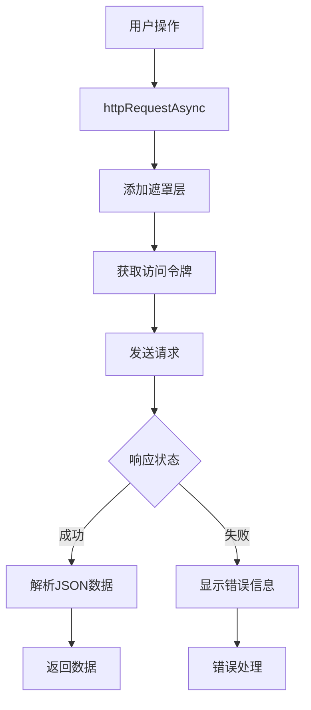

**图表来源**
- [site.js:823-877](file://Sylas.RemoteTasks.App/wwwroot/js/site.js#L823-L877)

**章节来源**
- [site.js:823-877](file://Sylas.RemoteTasks.App/wwwroot/js/site.js#L823-L877)

#### SSE请求处理系统（重构后）

**新增** 通用SSE请求处理函数，提供统一的SSE流处理机制：

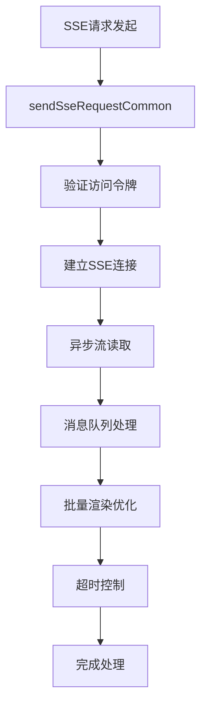

**图表来源**
- [site.js:1517-1599](file://Sylas.RemoteTasks.App/wwwroot/js/site.js#L1517-L1599)

**章节来源**
- [site.js:1467-1599](file://Sylas.RemoteTasks.App/wwwroot/js/site.js#L1467-L1599)

#### 拖拽模态框功能（新增）

**新增** 通用的模态框拖拽功能，支持Bootstrap模态框的拖拽操作：

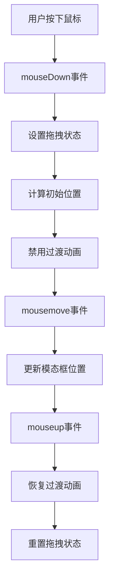

**图表来源**
- [site.js:10-94](file://Sylas.RemoteTasks.App/wwwroot/js/site.js#L10-L94)

**章节来源**
- [site.js:10-94](file://Sylas.RemoteTasks.App/wwwroot/js/site.js#L10-L94)

### 2. 任务执行模块 (anything.js)

#### 实时命令执行（重构后）
该模块现已重构为使用通用的SSE处理函数，简化了命令执行逻辑：

**核心功能：**
- SSE流式数据接收
- 命令状态跟踪
- 实时进度显示
- 错误处理和重试
- **新增** 通用消息处理函数

**章节来源**
- [anything.js:1-762](file://Sylas.RemoteTasks.App/wwwroot/js/anything.js#L1-L762)

#### 命令卡片系统
每个任务都以卡片形式展示，支持复杂的交互操作：

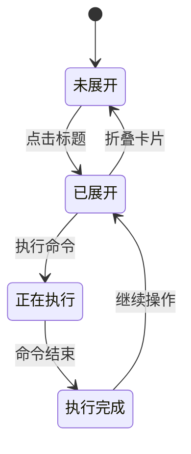

**图表来源**
- [anything.js:455-536](file://Sylas.RemoteTasks.App/wwwroot/js/anything.js#L455-L536)

**章节来源**
- [anything.js:455-536](file://Sylas.RemoteTasks.App/wwwroot/js/anything.js#L455-L536)

### 3. 可视化配置器 (vds-configurator.js)

#### 模态框配置系统
提供了完整的VDS页面配置功能：

**配置选项：**
- 基础信息配置
- 字段类型定义
- 接口参数设置
- 排序规则配置
- JSON模式支持

**新增** 拖拽模态框功能，支持配置器和字段编辑器的拖拽操作：

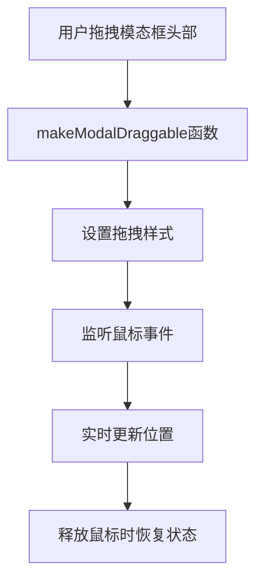

**图表来源**
- [vds-configurator.js:21-23](file://Sylas.RemoteTasks.App/wwwroot/js/vds-configurator.js#L21-L23)

**章节来源**
- [vds-configurator.js:1-1341](file://Sylas.RemoteTasks.App/wwwroot/js/vds-configurator.js#L1-L1341)

### 4. 流程组件 (flow.js)

#### Web Components实现
flow.js展示了现代Web Components的实现方式：

**特性：**
- 自定义元素定义
- Shadow DOM封装
- 样式隔离
- 事件处理

**章节来源**
- [flow.js:1-128](file://Sylas.RemoteTasks.App/wwwroot/js/flow.js#L1-L128)

## 依赖关系分析

项目中的JavaScript模块之间存在清晰的依赖关系：

```mermaid
graph TD
A[site.js] --> B[anything.js]
A --> C[vds-configurator.js]
A --> D[flow.js]
E[_Layout.cshtml] --> A
F[Index.cshtml] --> C
G[AnythingInfos.cshtml] --> B
H[Flows.cshtml] --> D
I[site.css] --> E
J[Bootstrap] --> A
K[jQuery] --> A
L[SignalR] --> B
M[libman.json] --> N[@microsoft/signalr]
N --> L
O[makeModalDraggable] --> C
```

**图表来源**
- [libman.json:1-14](file://Sylas.RemoteTasks.App/libman.json#L1-L14)
- [_Layout.cshtml:1-842](file://Sylas.RemoteTasks.App/Views/Shared/_Layout.cshtml#L1-L842)

**章节来源**
- [libman.json:1-14](file://Sylas.RemoteTasks.App/libman.json#L1-L14)
- [_Layout.cshtml:1-842](file://Sylas.RemoteTasks.App/Views/Shared/_Layout.cshtml#L1-L842)

## 性能考虑

### 1. 模块化加载优化
项目采用了按需加载的策略，通过`type="module"`确保脚本的正确执行和缓存优化。

### 2. 内存管理
- 使用弱引用避免内存泄漏
- 及时清理定时器和事件监听器
- 合理的DOM元素复用

### 3. 网络请求优化
- 统一的请求拦截和错误处理
- 适当的超时控制
- 缓存策略的应用

### 4. SSE性能优化（重构后）
**重构后改进**：
- 异步生成器流式读取，减少内存占用
- 批量渲染优化，使用requestAnimationFrame
- 消息队列处理，避免频繁DOM操作
- 超时检测机制，防止无限等待

### 5. 拖拽性能优化（新增）
**新增功能优化**：
- 使用requestAnimationFrame优化拖拽渲染
- GPU加速变换，提升拖拽流畅度
- 事件委托减少事件监听器数量
- 自动重置拖拽状态，避免内存泄漏

**章节来源**
- [site.js:1467-1599](file://Sylas.RemoteTasks.App/wwwroot/js/site.js#L1467-L1599)
- [site.js:10-94](file://Sylas.RemoteTasks.App/wwwroot/js/site.js#L10-L94)

## 故障排除指南

### 1. 常见问题诊断

**登录状态问题：**
- 检查本地存储中的访问令牌
- 验证令牌过期时间
- 确认后端认证服务状态

**数据加载失败：**
- 检查API端点可达性
- 验证请求参数格式
- 查看网络请求响应

**实时通信问题：**
- 确认SSE连接建立
- 检查服务器端推送配置
- 验证客户端事件处理

**SSE处理问题（重构后）：**
- 检查sendSseRequestCommon函数调用
- 验证消息处理函数正确性
- 确认超时设置合理

**拖拽模态框问题（新增）：**
- 检查makeModalDraggable函数调用
- 验证模态框元素存在
- 确认事件监听器正常工作

### 2. 调试技巧

**开发工具使用：**
- 利用浏览器开发者工具监控网络请求
- 检查控制台错误信息
- 使用断点调试JavaScript代码

**日志记录：**
- 在关键函数中添加console.log
- 记录异步操作的状态变化
- 监控内存使用情况

**SSE调试（重构后）：**
- 监控消息队列长度
- 检查超时计数器
- 验证异步生成器流状态

**拖拽调试（新增）：**
- 检查鼠标事件坐标
- 验证transform属性更新
- 监控requestAnimationFrame调用

**章节来源**
- [site.js:823-877](file://Sylas.RemoteTasks.App/wwwroot/js/site.js#L823-L877)
- [anything.js:1-762](file://Sylas.RemoteTasks.App/wwwroot/js/anything.js#L1-L762)

## 结论

这个站点JavaScript增强项目展现了现代前端开发的最佳实践，通过模块化设计和组件化架构，实现了高度可维护和可扩展的前端系统。

**主要成就：**
- 建立了完整的JavaScript工具库
- 实现了复杂的实时交互功能
- 提供了直观的可视化配置界面
- 采用了现代化的Web技术栈
- **新增拖拽模态框功能，提升用户体验**
- **重构SSE处理逻辑，提升了代码组织性**

**技术亮点：**
- 模块化JavaScript架构
- 实时通信技术应用
- 自定义Web Components实现
- 响应式设计和主题系统
- **通用SSE处理函数，提升可复用性**
- **拖拽模态框功能，增强交互体验**

**重构成果：**
- 新增sendSseRequestCommon通用函数，统一SSE请求处理
- 简化anything.js中的命令执行逻辑
- 提升代码组织性和可维护性
- 改进性能和错误处理机制
- **新增makeModalDraggable函数，支持模态框拖拽**

**新增功能成果：**
- **拖拽模态框功能，支持Bootstrap模态框拖拽**
- **优化VDS配置器用户体验**
- **提升整体交互流畅度**

该项目为类似的企业级应用开发提供了优秀的参考模板，展示了如何通过精心设计的前端架构来提升用户体验和开发效率。