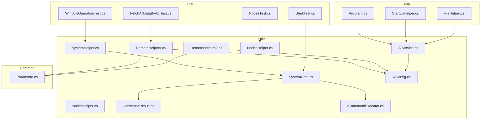
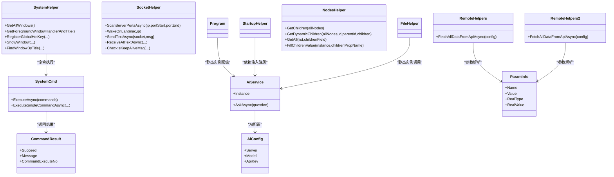
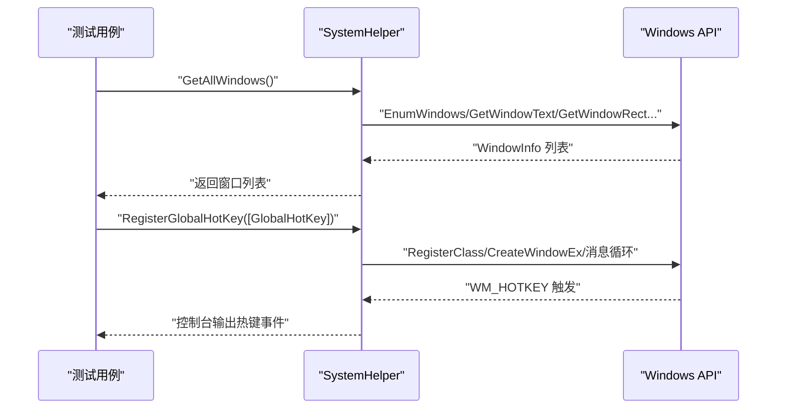
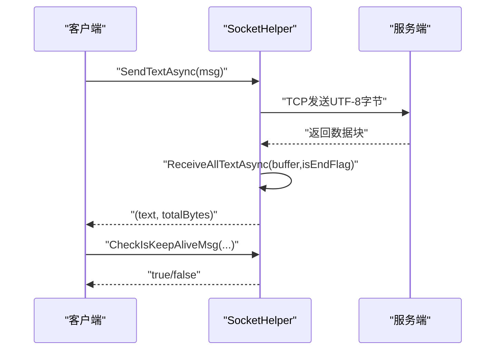
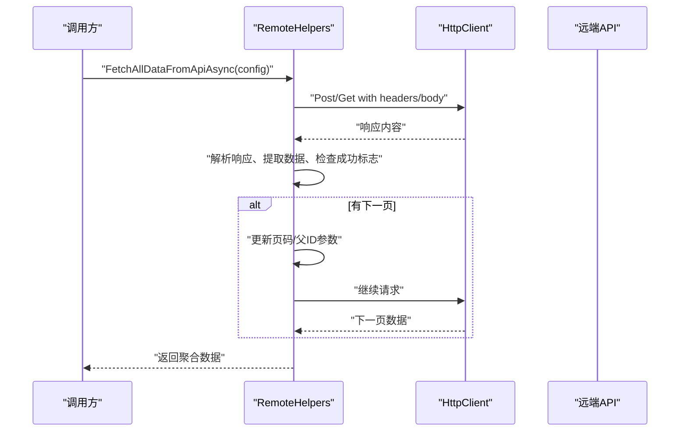
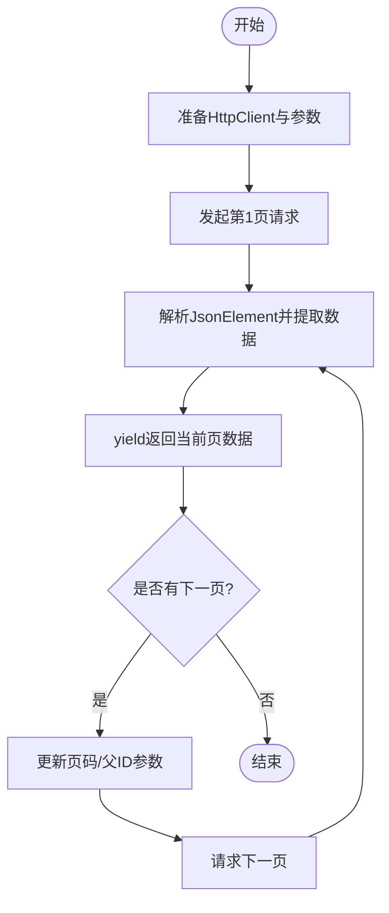
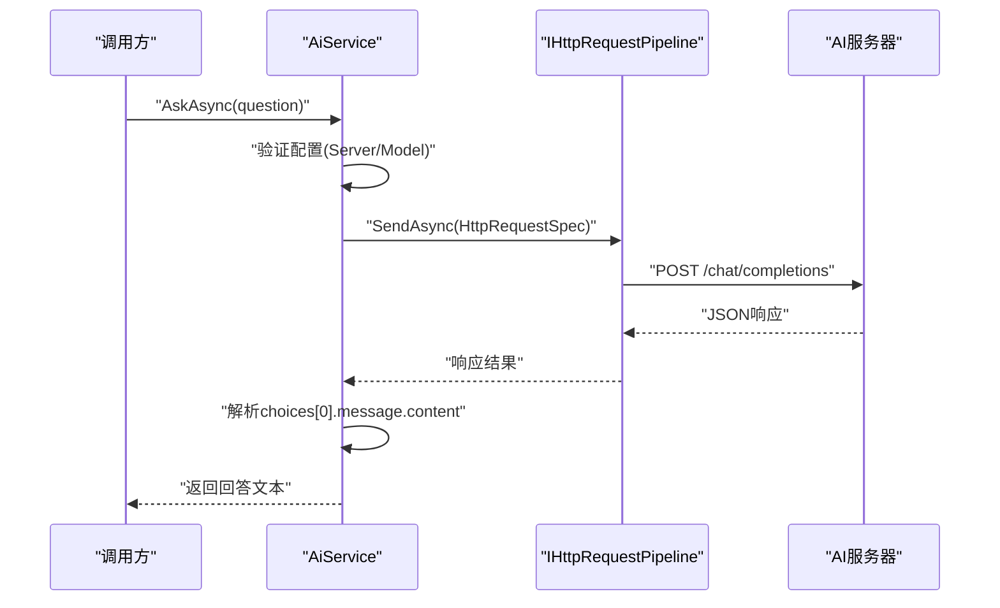
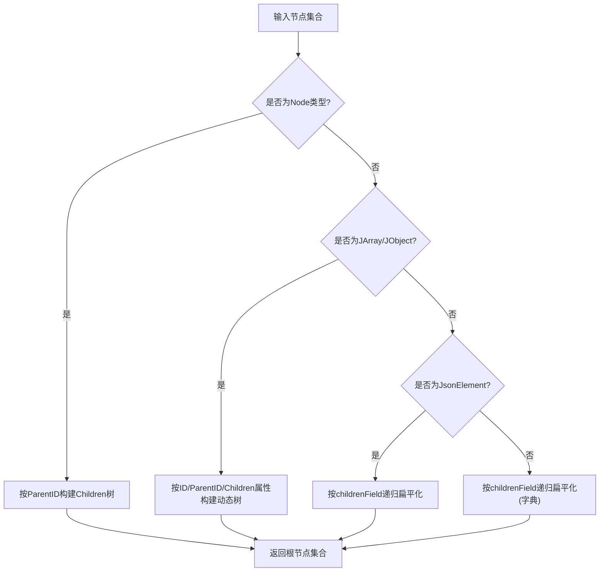
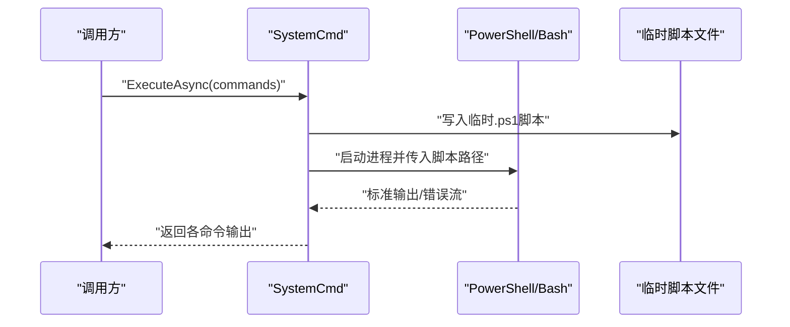
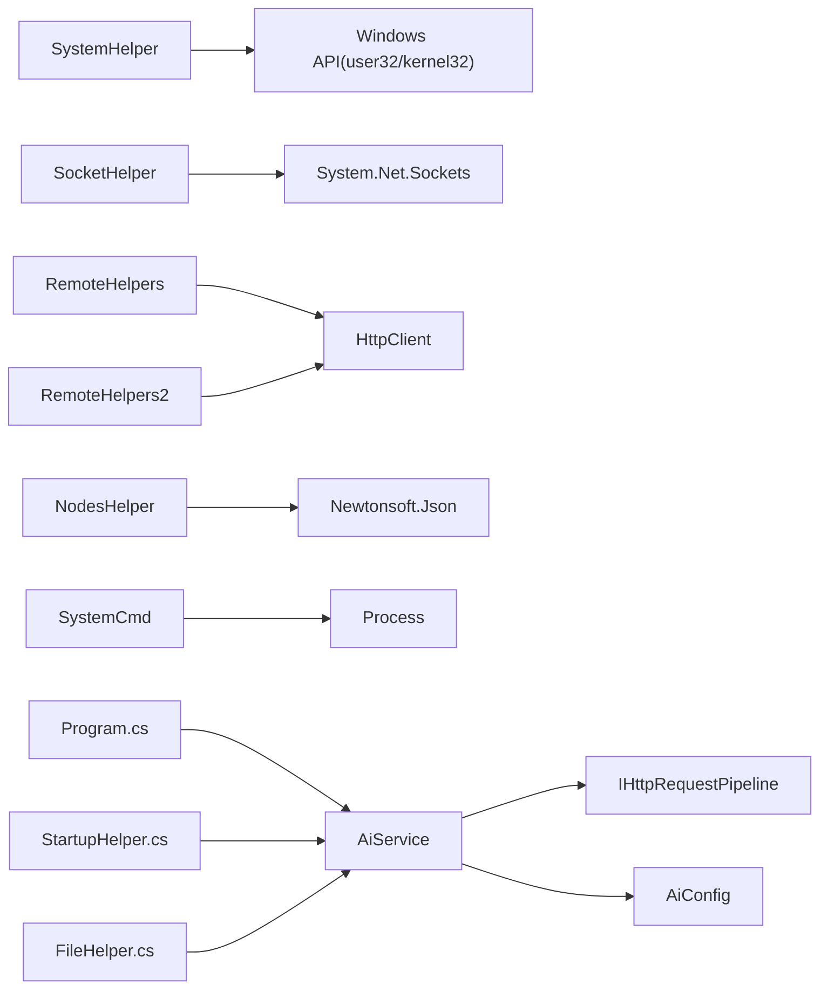

# 系统和网络助手

<cite>
**本文档引用的文件**
- [SystemHelper.cs](file://Sylas.RemoteTasks.Utils/SystemHelper.cs)
- [SocketHelper.cs](file://Sylas.RemoteTasks.Utils/SocketHelper.cs)
- [RemoteHelpers.cs](file://Sylas.RemoteTasks.Utils/RemoteHelpers.cs)
- [RemoteHelpers2.cs](file://Sylas.RemoteTasks.Utils/RemoteHelpers2.cs)
- [NodesHelper.cs](file://Sylas.RemoteTasks.Utils/NodesHelper.cs)
- [SystemCmd.cs](file://Sylas.RemoteTasks.Utils/CommandExecutor/SystemCmd.cs)
- [CommandResult.cs](file://Sylas.RemoteTasks.Utils/CommandExecutor/CommandResult.cs)
- [ICommandExecutor.cs](file://Sylas.RemoteTasks.Utils/CommandExecutor/ICommandExecutor.cs)
- [AiConfig.cs](file://Sylas.RemoteTasks.Utils/Dtos/AiConfig.cs)
- [AiService.cs](file://Sylas.RemoteTasks.Utils/AiService.cs)
- [ParamInfo.cs](file://Sylas.RemoteTasks.Common/Dtos/ParamInfo.cs)
- [ShellTest.cs](file://Sylas.RemoteTasks.Test/SystemHelperTest/ShellTest.cs)
- [WindowOperationTest.cs](file://Sylas.RemoteTasks.Test/SystemHelperTest/WindowOperationTest.cs)
- [NodesTest.cs](file://Sylas.RemoteTasks.Test/Nodes/NodesTest.cs)
- [FetchAllDataByApiTest.cs](file://Sylas.RemoteTasks.Test/Remote/FetchAllDataByApiTest.cs)
- [FileHelper.cs](file://Sylas.RemoteTasks.Utils/CommandExecutor/FileHelper.cs)
- [Program.cs](file://Sylas.RemoteTasks.App/Program.cs)
- [StartupHelper.cs](file://Sylas.RemoteTasks.App/Helpers/StartupHelper.cs)
</cite>

## 更新摘要
**变更内容**
- 更新 RemoteHelpers 和 RemoteHelpers2 章节，移除已删除的 AskAiAsync 方法描述
- 新增 AiService 章节，详细介绍新的 AI 服务实现
- 更新架构图和依赖关系分析，反映 AI 功能重构
- 更新配置和使用示例，展示新的 AiService 使用方式

## 目录
1. [简介](#简介)
2. [项目结构](#项目结构)
3. [核心组件](#核心组件)
4. [架构总览](#架构总览)
5. [详细组件分析](#详细组件分析)
6. [依赖关系分析](#依赖关系分析)
7. [性能考量](#性能考量)
8. [故障排查指南](#故障排查指南)
9. [结论](#结论)
10. [附录](#附录)

## 简介
本文件面向"系统和网络助手"模块，系统性梳理以下能力：
- SystemHelper：系统命令执行、进程管理、系统信息获取、全局热键、窗口操作等。
- SocketHelper：TCP端口扫描、远程唤醒（Wake-on-LAN）、Socket收发与心跳检测。
- RemoteHelpers/RemoteHelpers2：HTTP请求封装、分页与父子数据递归拉取。
- NodesHelper：父子节点树构建、动态树生成、扁平化遍历、属性继承填充。
- **新增** AiService：AI问答服务，提供基于 Chat Completions 的智能问答功能。

文档提供组件职责、关键API、参数与返回值、典型使用场景、安全与性能建议，并结合测试用例定位真实调用路径。

## 项目结构
该模块位于 Sylas.RemoteTasks.Utils，围绕"系统操作"和"网络通信"两大主题组织，配合 CommandExecutor 提供命令执行能力，Common 提供通用 DTO 与工具。

**图表来源**
- [SystemHelper.cs:1-1238](file://Sylas.RemoteTasks.Utils/SystemHelper.cs#L1-L1238)
- [SocketHelper.cs:1-364](file://Sylas.RemoteTasks.Utils/SocketHelper.cs#L1-L364)
- [RemoteHelpers.cs:1-464](file://Sylas.RemoteTasks.Utils/RemoteHelpers.cs#L1-L464)
- [RemoteHelpers2.cs:1-487](file://Sylas.RemoteTasks.Utils/RemoteHelpers2.cs#L1-L487)
- [NodesHelper.cs:1-462](file://Sylas.RemoteTasks.Utils/NodesHelper.cs#L1-L462)
- [SystemCmd.cs:1-788](file://Sylas.RemoteTasks.Utils/CommandExecutor/SystemCmd.cs#L1-L788)
- [CommandResult.cs:1-38](file://Sylas.RemoteTasks.Utils/CommandExecutor/CommandResult.cs#L1-L38)
- [ICommandExecutor.cs:1-74](file://Sylas.RemoteTasks.Utils/CommandExecutor/ICommandExecutor.cs#L1-L74)
- [AiConfig.cs:1-22](file://Sylas.RemoteTasks.Utils/Dtos/AiConfig.cs#L1-L22)
- [AiService.cs:1-86](file://Sylas.RemoteTasks.Utils/AiService.cs#L1-L86)
- [ParamInfo.cs:1-32](file://Sylas.RemoteTasks.Common/Dtos/ParamInfo.cs#L1-L32)
- [Program.cs:95-135](file://Sylas.RemoteTasks.App/Program.cs#L95-L135)
- [StartupHelper.cs:75-85](file://Sylas.RemoteTasks.App/Helpers/StartupHelper.cs#L75-L85)
- [FileHelper.cs:890-898](file://Sylas.RemoteTasks.Utils/CommandExecutor/FileHelper.cs#L890-L898)

**章节来源**
- [SystemHelper.cs:1-1238](file://Sylas.RemoteTasks.Utils/SystemHelper.cs#L1-L1238)
- [SocketHelper.cs:1-364](file://Sylas.RemoteTasks.Utils/SocketHelper.cs#L1-L364)
- [RemoteHelpers.cs:1-464](file://Sylas.RemoteTasks.Utils/RemoteHelpers.cs#L1-L464)
- [RemoteHelpers2.cs:1-487](file://Sylas.RemoteTasks.Utils/RemoteHelpers2.cs#L1-L487)
- [NodesHelper.cs:1-462](file://Sylas.RemoteTasks.Utils/NodesHelper.cs#L1-L462)
- [SystemCmd.cs:1-788](file://Sylas.RemoteTasks.Utils/CommandExecutor/SystemCmd.cs#L1-L788)
- [CommandResult.cs:1-38](file://Sylas.RemoteTasks.Utils/CommandExecutor/CommandResult.cs#L1-L38)
- [ICommandExecutor.cs:1-74](file://Sylas.RemoteTasks.Utils/CommandExecutor/ICommandExecutor.cs#L1-L74)
- [AiConfig.cs:1-22](file://Sylas.RemoteTasks.Utils/Dtos/AiConfig.cs#L1-L22)
- [AiService.cs:1-86](file://Sylas.RemoteTasks.Utils/AiService.cs#L1-L86)
- [ParamInfo.cs:1-32](file://Sylas.RemoteTasks.Common/Dtos/ParamInfo.cs#L1-L32)
- [ShellTest.cs:1-101](file://Sylas.RemoteTasks.Test/SystemHelperTest/ShellTest.cs#L1-L101)
- [WindowOperationTest.cs:1-50](file://Sylas.RemoteTasks.Test/SystemHelperTest/WindowOperationTest.cs#L1-L50)
- [NodesTest.cs:1-164](file://Sylas.RemoteTasks.Test/Nodes/NodesTest.cs#L1-L164)
- [FetchAllDataByApiTest.cs:1-82](file://Sylas.RemoteTasks.Test/Remote/FetchAllDataByApiTest.cs#L1-L82)
- [Program.cs:95-135](file://Sylas.RemoteTasks.App/Program.cs#L95-L135)
- [StartupHelper.cs:75-85](file://Sylas.RemoteTasks.App/Helpers/StartupHelper.cs#L75-L85)
- [FileHelper.cs:890-898](file://Sylas.RemoteTasks.Utils/CommandExecutor/FileHelper.cs#L890-L898)

## 核心组件
- SystemHelper：提供系统命令执行、进程信息查询、窗口枚举与控制、全局热键注册、键盘/鼠标虚拟键常量等。
- SocketHelper：提供端口扫描、WOL、Socket文本收发、心跳检测、关闭通知等。
- RemoteHelpers/RemoteHelpers2：封装HTTP请求、分页与父子数据递归拉取。
- NodesHelper：构建父子树、动态树、扁平化遍历、属性继承填充。
- **新增** AiService：提供AI问答服务，基于 Chat Completions API 实现智能问答功能。

**章节来源**
- [SystemHelper.cs:1-1238](file://Sylas.RemoteTasks.Utils/SystemHelper.cs#L1-L1238)
- [SocketHelper.cs:1-364](file://Sylas.RemoteTasks.Utils/SocketHelper.cs#L1-L364)
- [RemoteHelpers.cs:1-464](file://Sylas.RemoteTasks.Utils/RemoteHelpers.cs#L1-L464)
- [RemoteHelpers2.cs:1-487](file://Sylas.RemoteTasks.Utils/RemoteHelpers2.cs#L1-L487)
- [NodesHelper.cs:1-462](file://Sylas.RemoteTasks.Utils/NodesHelper.cs#L1-L462)
- [AiService.cs:1-86](file://Sylas.RemoteTasks.Utils/AiService.cs#L1-L86)

## 架构总览
系统与网络助手采用"静态工具类 + 命令执行器 + DTO + 服务层"的分层设计：
- SystemHelper/SocketHelper/RemoteHelpers/RemoteHelpers2/NodesHelper 作为静态工具类，提供统一入口。
- SystemCmd 实现命令执行器接口，支持异步流式输出与并发执行。
- Common 中的 DTO（如 ParamInfo、AiConfig）承载跨模块的参数与配置。
- **新增** AiService 作为独立服务层，提供AI问答功能，通过依赖注入和静态实例两种方式使用。

**图表来源**
- [SystemHelper.cs:1-1238](file://Sylas.RemoteTasks.Utils/SystemHelper.cs#L1-L1238)
- [SocketHelper.cs:1-364](file://Sylas.RemoteTasks.Utils/SocketHelper.cs#L1-L364)
- [RemoteHelpers.cs:1-464](file://Sylas.RemoteTasks.Utils/RemoteHelpers.cs#L1-L464)
- [RemoteHelpers2.cs:1-487](file://Sylas.RemoteTasks.Utils/RemoteHelpers2.cs#L1-L487)
- [NodesHelper.cs:1-462](file://Sylas.RemoteTasks.Utils/NodesHelper.cs#L1-L462)
- [SystemCmd.cs:1-788](file://Sylas.RemoteTasks.Utils/CommandExecutor/SystemCmd.cs#L1-L788)
- [CommandResult.cs:1-38](file://Sylas.RemoteTasks.Utils/CommandExecutor/CommandResult.cs#L1-L38)
- [AiConfig.cs:1-22](file://Sylas.RemoteTasks.Utils/Dtos/AiConfig.cs#L1-L22)
- [AiService.cs:1-86](file://Sylas.RemoteTasks.Utils/AiService.cs#L1-L86)
- [ParamInfo.cs:1-32](file://Sylas.RemoteTasks.Common/Dtos/ParamInfo.cs#L1-L32)
- [Program.cs:95-135](file://Sylas.RemoteTasks.App/Program.cs#L95-L135)
- [StartupHelper.cs:75-85](file://Sylas.RemoteTasks.App/Helpers/StartupHelper.cs#L75-L85)
- [FileHelper.cs:890-898](file://Sylas.RemoteTasks.Utils/CommandExecutor/FileHelper.cs#L890-L898)

## 详细组件分析

### SystemHelper 系统助手
- 主要职责
  - 系统命令执行与进程信息查询（通过 SystemCmd）。
  - 窗口枚举、前台窗口获取、窗口显示/最小化/从托盘恢复等。
  - 全局热键注册与消息循环处理。
  - 键盘/鼠标虚拟键常量与消息常量。
- 关键API与行为
  - 窗口操作：GetAllWindows、GetForegroundWindowHandlerAndTitle、ShowWindow、ShowWindowAsync、ShowWindowInTray、RestoreWindowFromTray、FindWindowByTitle/ClassName。
  - 全局热键：RegisterGlobalHotKey，内部创建隐藏窗口、注册热键、消息循环。
  - 命令执行：委托给 SystemCmd（见下文）。
- 参数与返回值
  - 窗口操作多返回句柄或布尔值；热键注册为无返回或后台任务。
- 使用示例（测试）
  - 窗口列表与前台窗口切换：参考 [WindowOperationTest.cs:14-41](file://Sylas.RemoteTasks.Test/SystemHelperTest/WindowOperationTest.cs#L14-L41)。
  - 全局热键注册：参考 [WindowOperationTest.cs:44-47](file://Sylas.RemoteTasks.Test/SystemHelperTest/WindowOperationTest.cs#L44-L47)。

**图表来源**
- [SystemHelper.cs:711-1032](file://Sylas.RemoteTasks.Utils/SystemHelper.cs#L711-L1032)
- [WindowOperationTest.cs:14-47](file://Sylas.RemoteTasks.Test/SystemHelperTest/WindowOperationTest.cs#L14-L47)

**章节来源**
- [SystemHelper.cs:1-1238](file://Sylas.RemoteTasks.Utils/SystemHelper.cs#L1-L1238)
- [WindowOperationTest.cs:1-50](file://Sylas.RemoteTasks.Test/SystemHelperTest/WindowOperationTest.cs#L1-L50)

### SocketHelper Socket 助手
- 主要职责
  - TCP端口扫描（批量异步连接）。
  - Wake-on-LAN（WOL）广播。
  - Socket 文本发送/接收、心跳检测、关闭通知。
- 关键API与行为
  - 端口扫描：ScanServerPortsAsync(ip, portStart, portEnd)，内部为每个端口创建TcpClient并发尝试连接。
  - WOL：WakeOnLan(macAddress, ipAddress)，构建Magic Packet，选择合适的本地地址与多播地址发送UDP广播至端口9。
  - 文本收发：SendTextAsync、ReceiveAllTextAsync（支持结束标记检测与缓冲区拼接）、NotifyCloseAsync、CheckIsCloseMsgAsync、CheckIsKeepAliveMsg。
- 参数与返回值
  - 端口扫描：无返回，控制台输出开放端口。
  - WOL：无返回，向目标网段广播。
  - 文本接收：返回文本与累计接收字节数；关闭时返回空文本与0字节。
- 使用示例（测试）
  - 端口扫描与WOL：参考 [ShellTest.cs:12-45](file://Sylas.RemoteTasks.Test/SystemHelperTest/ShellTest.cs#L12-L45)（命令执行测试，便于对比网络侧操作）。
  - Socket辅助：参考 [SocketHelper.cs:30-127](file://Sylas.RemoteTasks.Utils/SocketHelper.cs#L30-L127)。

**图表来源**
- [SocketHelper.cs:30-302](file://Sylas.RemoteTasks.Utils/SocketHelper.cs#L30-L302)

**章节来源**
- [SocketHelper.cs:1-364](file://Sylas.RemoteTasks.Utils/SocketHelper.cs#L1-L364)

### RemoteHelpers 远程助手
- 主要职责
  - HTTP请求封装：支持GET/POST、JSON/Form/FormData/Multipart。
  - 分页与父子数据递归拉取：自动更新页码、父ID参数，递归获取子节点。
  - **已移除** AI问答：原 AskAiAsync 方法已被完全移除，AI功能现在通过新的 AiService 提供。
- 关键API与行为
  - FetchAllDataFromApiAsync：支持RequestConfig配置，自动分页与父子递归，返回完整数据集。
  - **已移除** AskAiAsync：不再存在于该类中。
- 参数与返回值
  - FetchAllDataFromApiAsync：IEnumerable<object>。
  - **已移除** AskAiAsync：不再存在。
- 使用示例（测试）
  - API批量校验与映射：参考 [FetchAllDataByApiTest.cs:58-68](file://Sylas.RemoteTasks.Test/Remote/FetchAllDataByApiTest.cs#L58-L68)。
  - 参数DTO：参考 [ParamInfo.cs:1-32](file://Sylas.RemoteTasks.Common/Dtos/ParamInfo.cs#L1-L32)。

**图表来源**
- [RemoteHelpers.cs:42-121](file://Sylas.RemoteTasks.Utils/RemoteHelpers.cs#L42-L121)
- [ParamInfo.cs:1-32](file://Sylas.RemoteTasks.Common/Dtos/ParamInfo.cs#L1-L32)

**章节来源**
- [RemoteHelpers.cs:1-464](file://Sylas.RemoteTasks.Utils/RemoteHelpers.cs#L1-L464)
- [FetchAllDataByApiTest.cs:1-82](file://Sylas.RemoteTasks.Test/Remote/FetchAllDataByApiTest.cs#L1-L82)
- [ParamInfo.cs:1-32](file://Sylas.RemoteTasks.Common/Dtos/ParamInfo.cs#L1-L32)

### RemoteHelpers2 增强远程助手
- 主要职责
  - 与 RemoteHelpers 类似，但使用 System.Text.Json（JToken/JsonElement），提供更严格的类型与懒加载（IAsyncEnumerable）。
  - **已移除** AI问答：原 AskAiAsync 方法已被完全移除，AI功能现在通过新的 AiService 提供。
- 关键API与行为
  - FetchAllDataFromApiAsync：支持JsonElement/Dictionary/JObject三种输入，统一返回IAsyncEnumerable<IEnumerable<JsonElement>>，逐页逐批产出。
  - 属性访问：GetPropertyIgnoreCase 支持大小写不敏感与路径访问。
  - **已移除** AskAiAsync：不再存在于该类中。
- 参数与返回值
  - 输入：RequestConfig、HttpClient、Authorization Token、MediaType。
  - 输出：IAsyncEnumerable<IEnumerable<JsonElement>>。
- 使用示例（测试）
  - JsonElement扁平化与懒加载：参考 [NodesTest.cs:121-136](file://Sylas.RemoteTasks.Test/Nodes/NodesTest.cs#L121-L136)。

**图表来源**
- [RemoteHelpers2.cs:48-99](file://Sylas.RemoteTasks.Utils/RemoteHelpers2.cs#L48-L99)

**章节来源**
- [RemoteHelpers2.cs:1-487](file://Sylas.RemoteTasks.Utils/RemoteHelpers2.cs#L1-L487)
- [NodesTest.cs:1-164](file://Sylas.RemoteTasks.Test/Nodes/NodesTest.cs#L1-L164)

### AiService AI服务
- **新增** 主要职责
  - 提供AI问答服务，基于 Chat Completions API 实现智能问答功能。
  - 支持通过依赖注入和静态实例两种方式使用。
  - 自动处理请求构建、响应解析和错误处理。
- 关键API与行为
  - AskAsync：向AI模型提问并获取回答，支持系统提示词和用户问题。
  - Instance：静态实例入口，供无法通过DI注入的场景使用。
  - 内部使用 IHttpRequestPipeline 发送HTTP请求，解析JSON响应。
- 参数与返回值
  - AskAsync：(string) 回答文本。
  - Instance：AiService 静态实例。
- 使用示例（应用层）
  - 通过静态实例调用：参考 [FileHelper.cs:893-894](file://Sylas.RemoteTasks.Utils/CommandExecutor/FileHelper.cs#L893-L894)。
  - 通过依赖注入调用：参考 [StartupHelper.cs:77-84](file://Sylas.RemoteTasks.App/Helpers/StartupHelper.cs#L77-L84) 和 [Program.cs:101-102](file://Sylas.RemoteTasks.App/Program.cs#L101-L102)。

**图表来源**
- [AiService.cs:33-66](file://Sylas.RemoteTasks.Utils/AiService.cs#L33-L66)
- [FileHelper.cs:893-894](file://Sylas.RemoteTasks.Utils/CommandExecutor/FileHelper.cs#L893-L894)
- [Program.cs:101-102](file://Sylas.RemoteTasks.App/Program.cs#L101-L102)
- [StartupHelper.cs:77-84](file://Sylas.RemoteTasks.App/Helpers/StartupHelper.cs#L77-L84)

**章节来源**
- [AiService.cs:1-86](file://Sylas.RemoteTasks.Utils/AiService.cs#L1-L86)
- [AiConfig.cs:1-22](file://Sylas.RemoteTasks.Utils/Dtos/AiConfig.cs#L1-L22)
- [FileHelper.cs:890-898](file://Sylas.RemoteTasks.Utils/CommandExecutor/FileHelper.cs#L890-L898)
- [Program.cs:95-135](file://Sylas.RemoteTasks.App/Program.cs#L95-L135)
- [StartupHelper.cs:75-85](file://Sylas.RemoteTasks.App/Helpers/StartupHelper.cs#L75-L85)

### NodesHelper 节点管理助手
- 主要职责
  - 构建父子树：Node类型与动态JArray/JObject。
  - 扁平化遍历：支持JObject/Dictionary/JsonElement三类输入。
  - 属性继承填充：将父节点非集合属性复制到子节点。
- 关键API与行为
  - GetChildren：基于Node集合构建根到叶的树。
  - GetDynamicChildren：基于任意属性名（ID/ParentID/Children）构建动态树。
  - GetAll：递归扁平化，支持三种输入类型。
  - FillChildrenValue：递归将父节点属性复制到子节点。
- 参数与返回值
  - GetChildren：List<Node>。
  - GetDynamicChildren：JArray。
  - GetAll：IEnumerable<T>（JObject/Dictionary/JsonElement）。
  - FillChildrenValue：无返回（副作用修改子节点属性）。
- 使用示例（测试）
  - Node与JArray树构建：参考 [NodesTest.cs:22-89](file://Sylas.RemoteTasks.Test/Nodes/NodesTest.cs#L22-L89)。
  - JsonElement懒加载与扁平化：参考 [NodesTest.cs:93-136](file://Sylas.RemoteTasks.Test/Nodes/NodesTest.cs#L93-L136)。

**图表来源**
- [NodesHelper.cs:94-462](file://Sylas.RemoteTasks.Utils/NodesHelper.cs#L94-L462)

**章节来源**
- [NodesHelper.cs:1-462](file://Sylas.RemoteTasks.Utils/NodesHelper.cs#L1-L462)
- [NodesTest.cs:1-164](file://Sylas.RemoteTasks.Test/Nodes/NodesTest.cs#L1-L164)

### SystemCmd 命令执行器
- 主要职责
  - 通过 PowerShell/Bash 执行系统命令，支持多命令串行执行、脚本文件生成、标准输出/错误捕获与流式返回。
- 关键API与行为
  - ExecuteAsync：接收命令数组，生成临时脚本文件，PowerShell执行并收集输出。
  - ExecuteSingleCommandAsync：单命令流式输出。
  - 实现 ICommandExecutor 接口，支持反射创建与统一调用。
- 参数与返回值
  - ExecuteAsync：返回 List<string>（各命令输出汇总）。
  - ExecuteAsync(命令)：IAsyncEnumerable<CommandResult>。
- 使用示例（测试）
  - 多命令执行与性能对比：参考 [ShellTest.cs:12-98](file://Sylas.RemoteTasks.Test/SystemHelperTest/ShellTest.cs#L12-L98)。

**图表来源**
- [SystemCmd.cs:144-200](file://Sylas.RemoteTasks.Utils/CommandExecutor/SystemCmd.cs#L144-L200)
- [ShellTest.cs:12-98](file://Sylas.RemoteTasks.Test/SystemHelperTest/ShellTest.cs#L12-L98)

**章节来源**
- [SystemCmd.cs:1-788](file://Sylas.RemoteTasks.Utils/CommandExecutor/SystemCmd.cs#L1-L788)
- [CommandResult.cs:1-38](file://Sylas.RemoteTasks.Utils/CommandExecutor/CommandResult.cs#L1-L38)
- [ICommandExecutor.cs:1-74](file://Sylas.RemoteTasks.Utils/CommandExecutor/ICommandExecutor.cs#L1-L74)
- [ShellTest.cs:1-101](file://Sylas.RemoteTasks.Test/SystemHelperTest/ShellTest.cs#L1-L101)

## 依赖关系分析
- SystemHelper 依赖 Windows API（user32/kernel32）实现窗口与热键功能。
- SocketHelper 依赖 System.Net.Sockets、System.Net.NetworkInformation 实现网络功能。
- RemoteHelpers/RemoteHelpers2 依赖 HttpClient、System.Text.Json、Common.ParamInfo。
- **新增** AiService 依赖 IHttpRequestPipeline、AiConfig、ILogger，通过依赖注入集成。
- NodesHelper 依赖 Newtonsoft.Json（JArray/JObject）与 System.Text.Json（JsonElement）。
- SystemCmd 依赖 Process、PowerShell/Bash、临时文件。
- **新增** 应用层通过 StartupHelper 注册 AiService，Program.cs 设置静态实例。

**图表来源**
- [SystemHelper.cs:507-1032](file://Sylas.RemoteTasks.Utils/SystemHelper.cs#L507-L1032)
- [SocketHelper.cs:1-364](file://Sylas.RemoteTasks.Utils/SocketHelper.cs#L1-L364)
- [RemoteHelpers.cs:1-464](file://Sylas.RemoteTasks.Utils/RemoteHelpers.cs#L1-L464)
- [RemoteHelpers2.cs:1-487](file://Sylas.RemoteTasks.Utils/RemoteHelpers2.cs#L1-L487)
- [NodesHelper.cs:1-462](file://Sylas.RemoteTasks.Utils/NodesHelper.cs#L1-L462)
- [SystemCmd.cs:1-788](file://Sylas.RemoteTasks.Utils/CommandExecutor/SystemCmd.cs#L1-L788)
- [AiService.cs:1-86](file://Sylas.RemoteTasks.Utils/AiService.cs#L1-L86)
- [AiConfig.cs:1-22](file://Sylas.RemoteTasks.Utils/Dtos/AiConfig.cs#L1-L22)
- [Program.cs:95-135](file://Sylas.RemoteTasks.App/Program.cs#L95-L135)
- [StartupHelper.cs:75-85](file://Sylas.RemoteTasks.App/Helpers/StartupHelper.cs#L75-L85)
- [FileHelper.cs:890-898](file://Sylas.RemoteTasks.Utils/CommandExecutor/FileHelper.cs#L890-L898)

**章节来源**
- [SystemHelper.cs:1-1238](file://Sylas.RemoteTasks.Utils/SystemHelper.cs#L1-L1238)
- [SocketHelper.cs:1-364](file://Sylas.RemoteTasks.Utils/SocketHelper.cs#L1-L364)
- [RemoteHelpers.cs:1-464](file://Sylas.RemoteTasks.Utils/RemoteHelpers.cs#L1-L464)
- [RemoteHelpers2.cs:1-487](file://Sylas.RemoteTasks.Utils/RemoteHelpers2.cs#L1-L487)
- [NodesHelper.cs:1-462](file://Sylas.RemoteTasks.Utils/NodesHelper.cs#L1-L462)
- [SystemCmd.cs:1-788](file://Sylas.RemoteTasks.Utils/CommandExecutor/SystemCmd.cs#L1-L788)
- [AiService.cs:1-86](file://Sylas.RemoteTasks.Utils/AiService.cs#L1-L86)
- [AiConfig.cs:1-22](file://Sylas.RemoteTasks.Utils/Dtos/AiConfig.cs#L1-L22)
- [Program.cs:95-135](file://Sylas.RemoteTasks.App/Program.cs#L95-L135)
- [StartupHelper.cs:75-85](file://Sylas.RemoteTasks.App/Helpers/StartupHelper.cs#L75-L85)
- [FileHelper.cs:890-898](file://Sylas.RemoteTasks.Utils/CommandExecutor/FileHelper.cs#L890-L898)

## 性能考量
- 并发与批处理
  - SocketHelper 端口扫描使用 Task.WhenAll 并发连接，适合快速探测端口范围。
  - SystemCmd 支持多命令串行执行与脚本化，减少频繁进程启动开销。
- I/O与内存
  - RemoteHelpers/RemoteHelpers2 使用 IAsyncEnumerable 懒加载，避免一次性加载大量数据。
  - SocketHelper 接收采用分块读取与缓冲区拼接，避免一次性分配大块内存。
  - **新增** AiService 支持无限超时，适合长时间的AI推理任务。
- 网络与超时
  - RemoteHelpers/RemoteHelpers2 默认使用 HttpClient，建议在高延迟网络中设置合理超时与重试策略。
  - SocketHelper 心跳检测与关闭通知可降低长连接资源占用。
  - **新增** AiService 在配置中支持自定义超时时间，避免阻塞等待。
- 窗口与热键
  - SystemHelper 注册全局热键时创建隐藏窗口与消息循环，注意生命周期与资源释放。
- **新增** 依赖注入与静态实例
  - AiService 支持两种使用方式，静态实例适合简单场景，依赖注入适合复杂应用。

## 故障排查指南
- 窗口操作
  - 若窗口不可见或标题为空，GetAllWindows 会过滤掉；确认目标窗口具备可见标题。
  - 前台窗口获取需在交互态下进行，测试中可短暂延时后获取。
- 热键注册
  - RegisterGlobalHotKey 返回失败时检查修饰键与虚拟键是否有效，确保唯一ID与组合不冲突。
- Socket收发
  - 检查结束标记与缓冲区拼接逻辑，避免误判或遗漏数据。
  - 心跳消息需严格匹配"keep-alive"或其空白变体。
- HTTP请求
  - Content-Type 与Body格式需一致，Multipart需提供Boundary参数。
  - 分页与父子递归时，确认 ResponseOkField/ResponseDataField 与 UpdateBodyParentIdRegex/Value 配置正确。
- 节点扁平化
  - childrenField 名称大小写与路径需与数据结构一致，JsonElement访问使用 GetPropertyIgnoreCase。
- 命令执行
  - PowerShell 执行策略与编码（chcp 65001）会影响输出；临时脚本文件需正确写入与执行。
- **新增** AI服务
  - 检查 AiConfig 配置是否正确，Server 和 Model 字段必须设置。
  - 确认依赖注入容器已正确注册 AiService 和 AiConfig。
  - 验证静态实例赋值是否在应用启动后完成。
  - 检查网络连接和AI服务端点可达性。

**章节来源**
- [WindowOperationTest.cs:1-50](file://Sylas.RemoteTasks.Test/SystemHelperTest/WindowOperationTest.cs#L1-L50)
- [SocketHelper.cs:172-302](file://Sylas.RemoteTasks.Utils/SocketHelper.cs#L172-L302)
- [RemoteHelpers.cs:50-141](file://Sylas.RemoteTasks.Utils/RemoteHelpers.cs#L50-L141)
- [RemoteHelpers2.cs:124-397](file://Sylas.RemoteTasks.Utils/RemoteHelpers2.cs#L124-L397)
- [NodesHelper.cs:317-372](file://Sylas.RemoteTasks.Utils/NodesHelper.cs#L317-L372)
- [SystemCmd.cs:144-200](file://Sylas.RemoteTasks.Utils/CommandExecutor/SystemCmd.cs#L144-L200)
- [AiService.cs:33-66](file://Sylas.RemoteTasks.Utils/AiService.cs#L33-L66)
- [Program.cs:95-135](file://Sylas.RemoteTasks.App/Program.cs#L95-L135)
- [StartupHelper.cs:75-85](file://Sylas.RemoteTasks.App/Helpers/StartupHelper.cs#L75-L85)

## 结论
本模块通过 SystemHelper、SocketHelper、RemoteHelpers/RemoteHelpers2、NodesHelper 与 SystemCmd，提供了从系统命令、窗口控制、网络通信到数据结构处理的完整能力栈。**新增的 AiService** 通过现代化的依赖注入架构，提供了强大的AI问答能力。借助 IAsyncEnumerable、JsonElement 与 HttpClient，系统在性能与易用性之间取得平衡。建议在生产环境中结合超时、重试、日志与资源清理策略，确保稳定性与安全性。

## 附录
- 配置项与参数清单
  - RemoteHelpers.RequestConfig：Url、PageIndexField、PageIndexParamInQuery、IdFieldName、ParentIdFieldName、QueryDictionary、BodyDictionary、ResponseOkField、ResponseOkValue、ResponseDataField、FailMsg、UpdateBodyParentIdRegex、UpdateBodyParentIdValue、RequestMethod、Token、ReturnPrimaryRequest。
  - **新增** AiConfig：Server、Model、ApiKey。
  - ParamInfo：Name、Value、RealType、Others、RealValue。
- 关键返回值
  - SocketHelper.ReceiveAllTextAsync：(string, int)。
  - RemoteHelpers.FetchAllDataFromApiAsync：IEnumerable<object>。
  - **已移除** RemoteHelpers.AskAiAsync：不再存在。
  - **新增** AiService.AskAsync：string。
  - NodesHelper.GetAll：IEnumerable<T>（JObject/Dictionary/JsonElement）。
  - SystemCmd.ExecuteAsync：List<string>；ExecuteAsync(命令)：IAsyncEnumerable<CommandResult>。
- **新增** 使用方式
  - 依赖注入：通过 StartupHelper.AddAiConfig 和 AddSingleton 注册，然后在类中注入 AiService。
  - 静态实例：在 Program.cs 中设置 AiService.Instance，然后在任何地方调用静态方法。
  - 应用层调用：FileHelper 中演示了静态实例的使用方式。

**章节来源**
- [RemoteHelpers.cs:396-462](file://Sylas.RemoteTasks.Utils/RemoteHelpers.cs#L396-L462)
- [AiConfig.cs:1-22](file://Sylas.RemoteTasks.Utils/Dtos/AiConfig.cs#L1-L22)
- [AiService.cs:1-86](file://Sylas.RemoteTasks.Utils/AiService.cs#L1-L86)
- [ParamInfo.cs:1-32](file://Sylas.RemoteTasks.Common/Dtos/ParamInfo.cs#L1-L32)
- [SocketHelper.cs:172-302](file://Sylas.RemoteTasks.Utils/SocketHelper.cs#L172-L302)
- [RemoteHelpers.cs:50-141](file://Sylas.RemoteTasks.Utils/RemoteHelpers.cs#L50-L141)
- [NodesHelper.cs:317-372](file://Sylas.RemoteTasks.Utils/NodesHelper.cs#L317-L372)
- [SystemCmd.cs:144-200](file://Sylas.RemoteTasks.Utils/CommandExecutor/SystemCmd.cs#L144-L200)
- [StartupHelper.cs:75-85](file://Sylas.RemoteTasks.App/Helpers/StartupHelper.cs#L75-L85)
- [Program.cs:95-135](file://Sylas.RemoteTasks.App/Program.cs#L95-L135)
- [FileHelper.cs:890-898](file://Sylas.RemoteTasks.Utils/CommandExecutor/FileHelper.cs#L890-L898)