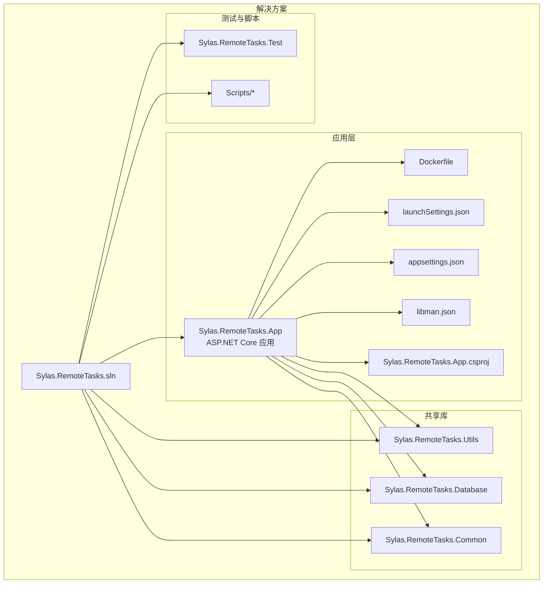
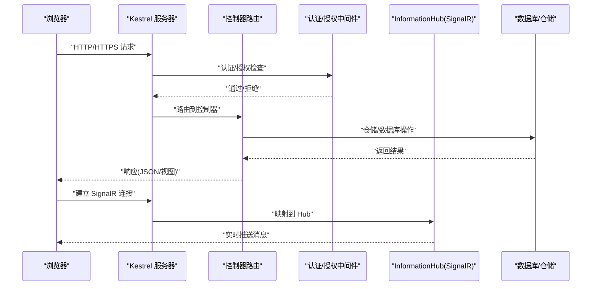
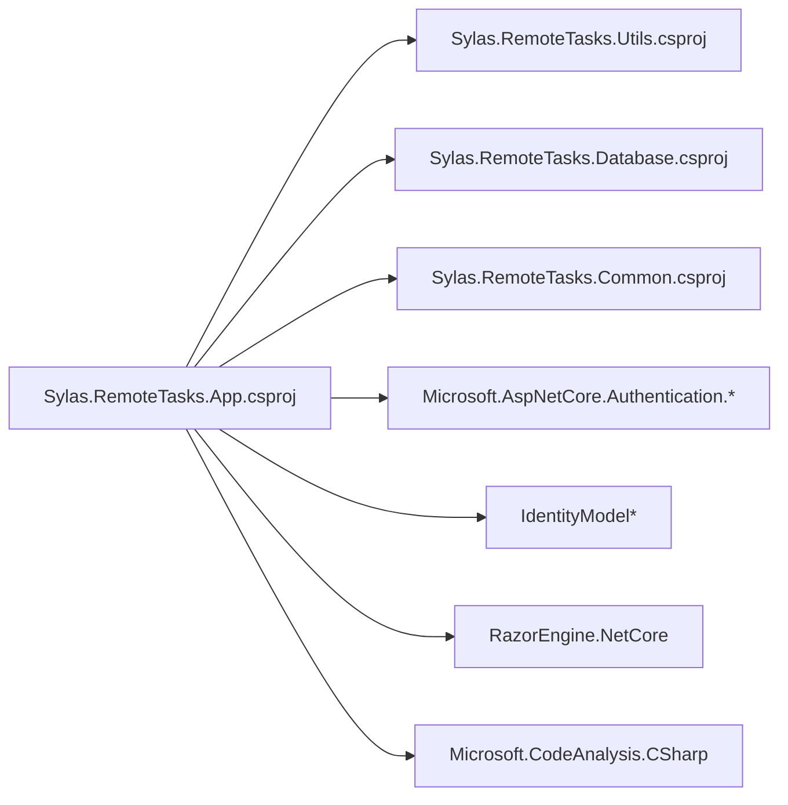

# 快速开始

<cite>
**本文引用的文件**
- [README.md](file://README.md)
- [Dockerfile](file://Sylas.RemoteTasks.App/Dockerfile)
- [appsettings.json](file://Sylas.RemoteTasks.App/appsettings.json)
- [Program.cs](file://Sylas.RemoteTasks.App/Program.cs)
- [launchSettings.json](file://Sylas.RemoteTasks.App/Properties/launchSettings.json)
- [Sylas.RemoteTasks.App.csproj](file://Sylas.RemoteTasks.App/Sylas.RemoteTasks.App.csproj)
- [libman.json](file://Sylas.RemoteTasks.App/libman.json)
- [solutions.json](file://Sylas.RemoteTasks.App/solutions.json)
- [publish nugetpkg database.ps1](file://Scripts/publish%20nugetpkg%20database.ps1)
- [publish nugetpkg utils.ps1](file://Scripts/publish%20nugetpkg%20utils.ps1)
- [TestFixture.cs](file://Sylas.RemoteTasks.Test/TestFixture.cs)
- [README.md（数据库）](file://Sylas.RemoteTasks.Database/README.md)
- [README.md（工具集）](file://Sylas.RemoteTasks.Utils/README.md)
</cite>

## 目录
1. [简介](#简介)
2. [项目结构](#项目结构)
3. [核心组件](#核心组件)
4. [架构总览](#架构总览)
5. [详细组件分析](#详细组件分析)
6. [依赖关系分析](#依赖关系分析)
7. [性能注意事项](#性能注意事项)
8. [故障排查指南](#故障排查指南)
9. [结论](#结论)
10. [附录](#附录)

## 简介
本指南面向首次接触 Sylas.RemoteTasks 的开发者，帮助你在最短时间内完成环境准备、依赖安装、本地开发与 Docker 部署，并顺利启动项目。文档覆盖以下要点：
- .NET 10 环境搭建与验证
- 本地开发环境配置（HTTP/HTTPS 端口、证书、浏览器自动打开）
- Docker 镜像构建与容器运行（含端口映射、时区、环境变量）
- 关键配置文件说明（appsettings.json、launchSettings.json、Dockerfile）
- 常见初始化问题与解决方案
- 项目内脚本与测试基座的使用建议

## 项目结构
该项目采用多项目解决方案组织，核心应用位于 Sylas.RemoteTasks.App，配套有通用工具库与数据库辅助模块，以及测试项目与脚本目录。

图表来源
- [Sylas.RemoteTasks.App.csproj](file://Sylas.RemoteTasks.App/Sylas.RemoteTasks.App.csproj#L1-L61)
- [Dockerfile](file://Sylas.RemoteTasks.App/Dockerfile#L1-L21)
- [launchSettings.json](file://Sylas.RemoteTasks.App/Properties/launchSettings.json#L1-L38)
- [appsettings.json](file://Sylas.RemoteTasks.App/appsettings.json#L1-L142)
- [libman.json](file://Sylas.RemoteTasks.App/libman.json#L1-L14)

章节来源
- [Sylas.RemoteTasks.App.csproj](file://Sylas.RemoteTasks.App/Sylas.RemoteTasks.App.csproj#L1-L61)
- [README.md](file://README.md#L1-L43)

## 核心组件
- 应用入口与管线
  - 程序入口负责注册配置、缓存、SignalR、HTTP 客户端、仓储、后台服务、认证与授权策略等。
  - 管线启用静态文件、路由、认证/授权、异常处理与 SignalR Hub。
- 配置体系
  - appsettings.json 提供日志、连接字符串、TCP/中心服务器、Kestrel 端点、请求流水线、身份服务、进程监控、邮件等配置。
  - launchSettings.json 定义 HTTP/HTTPS 端口与环境变量，支持 IIS Express 与自定义命令名。
- 容器化
  - Dockerfile 基于 .NET 10 运行时镜像，设置时区、暴露端口、复制应用并以 DLL 启动；支持通过 docker run 追加参数覆盖 URL 与环境。
- 工具与库
  - Utils 提供命令执行、模板解析、系统与远程操作等能力。
  - Database 提供数据库信息、迁移、分页查询、对比等通用方法。
- 测试基座
  - TestFixture 展示如何在测试中加载配置、注册仓储与数据库服务，便于单元测试与集成测试。

章节来源
- [Program.cs](file://Sylas.RemoteTasks.App/Program.cs#L1-L122)
- [appsettings.json](file://Sylas.RemoteTasks.App/appsettings.json#L1-L142)
- [launchSettings.json](file://Sylas.RemoteTasks.App/Properties/launchSettings.json#L1-L38)
- [Dockerfile](file://Sylas.RemoteTasks.App/Dockerfile#L1-L21)
- [README.md（工具集）](file://Sylas.RemoteTasks.Utils/README.md#L1-L3)
- [README.md（数据库）](file://Sylas.RemoteTasks.Database/README.md#L1-L24)
- [TestFixture.cs](file://Sylas.RemoteTasks.Test/TestFixture.cs#L1-L53)

## 架构总览
下图展示从浏览器到后端 API 的典型调用链路，以及 SignalR Hub 的实时通信路径。

图表来源
- [Program.cs](file://Sylas.RemoteTasks.App/Program.cs#L97-L121)
- [appsettings.json](file://Sylas.RemoteTasks.App/appsettings.json#L1-L142)

## 详细组件分析

### 环境与依赖准备
- .NET SDK/运行时
  - 目标框架为 net10.0，需安装 .NET 10 SDK 或运行时。
  - 项目启用隐式 usings、可空引用类型与不安全代码块。
- 包依赖概览
  - 身份认证：JWT Bearer、OpenId Connect、IdentityModel。
  - Razor 引擎与 C# 分析器。
  - 项目引用 Utils 与 Database 共享库。
- 前端资源
  - libman.json 指定从 unpkg 获取 SignalR 浏览器脚本并复制到 wwwroot/lib/signalr。

章节来源
- [Sylas.RemoteTasks.App.csproj](file://Sylas.RemoteTasks.App/Sylas.RemoteTasks.App.csproj#L1-L61)
- [libman.json](file://Sylas.RemoteTasks.App/libman.json#L1-L14)

### 本地开发环境配置
- 端口与协议
  - launchSettings.json 提供 http/https 两种启动配置，分别指向本地端口。
  - appsettings.json 中 Kestrel 节点预留了 Http/HttpsInlineCertFile 端点配置注释，可按需启用 HTTPS。
- 自动启动浏览器与环境变量
  - profiles.http/https 支持自动打开浏览器并设置 ASPNETCORE_ENVIRONMENT。
- 上传大小限制
  - Program.cs 中将 MaxRequestBodySize 设为无限制，便于大文件上传场景。

章节来源
- [launchSettings.json](file://Sylas.RemoteTasks.App/Properties/launchSettings.json#L10-L38)
- [appsettings.json](file://Sylas.RemoteTasks.App/appsettings.json#L51-L64)
- [Program.cs](file://Sylas.RemoteTasks.App/Program.cs#L14-L17)

### Docker 部署
- 基础镜像与系统设置
  - 使用 ASP.NET 10 运行时镜像，设置 Asia/Shanghai 时区，替换 apt 源为国内镜像并安装 vim。
- 端口与入口
  - 默认暴露 80/TCP，ENTRYPOINT 直接运行应用 DLL；可通过 docker run 追加参数覆盖 URL 与环境。
- 运行示例
  - 可将宿主端口映射到容器端口，结合 restart=always 实现开机自启。

章节来源
- [Dockerfile](file://Sylas.RemoteTasks.App/Dockerfile#L1-L21)
- [README.md](file://README.md#L4-L17)

### 关键配置文件说明
- appsettings.json
  - 日志：控制台简单格式化、时间戳前缀。
  - 全局热键：支持配置全局热键列表。
  - 连接字符串：默认 SQLite 文件路径；可扩展为多个连接串关键字白名单。
  - 服务端口：TCP 端口、中心服务器地址与 Web 地址。
  - 请求流水线：RequestPipeline 支持动态配置请求处理器与数据处理器。
  - 身份服务：IdentityServerConfiguration 提供 Authority、ClientId/Secret、Scope、缓存等。
  - 进程监控：ProcessMonitor.Names 列表。
  - 邮件：Email.Sender 提供 SMTP 地址、端口、SSL、账号与授权码。
- launchSettings.json
  - profiles.http/https 定义应用 URL 与环境变量。
  - IIS Express 配置。
- Dockerfile
  - 基于 ASP.NET 10 运行时，设置时区与端口，复制应用并 ENTRYPOINT 启动。

章节来源
- [appsettings.json](file://Sylas.RemoteTasks.App/appsettings.json#L1-L142)
- [launchSettings.json](file://Sylas.RemoteTasks.App/Properties/launchSettings.json#L1-L38)
- [Dockerfile](file://Sylas.RemoteTasks.App/Dockerfile#L1-L21)

### 数据库与工具库
- Database
  - 支持多种数据库类型，提供连接、迁移、分页查询、对比、建表、插入等通用方法。
- Utils
  - 提供命令执行、SSH、HTTP 请求、模板解析等能力，支撑远程任务与自动化流程。

章节来源
- [README.md（数据库）](file://Sylas.RemoteTasks.Database/README.md#L1-L24)
- [README.md（工具集）](file://Sylas.RemoteTasks.Utils/README.md#L1-L3)

### 测试基座与脚本
- TestFixture
  - 展示如何在测试中加载 appsettings.json、注册仓储与数据库服务，便于快速搭建测试环境。
- 脚本
  - publish nugetpkg database.ps1 与 publish nugetpkg utils.ps1：读取目标项目版本号并发布 NuGet 包至官方源。

章节来源
- [TestFixture.cs](file://Sylas.RemoteTasks.Test/TestFixture.cs#L1-L53)
- [publish nugetpkg database.ps1](file://Scripts/publish%20nugetpkg%20database.ps1#L1-L29)
- [publish nugetpkg utils.ps1](file://Scripts/publish%20nugetpkg%20utils.ps1#L1-L29)

## 依赖关系分析
应用层对共享库存在直接引用，同时通过 NuGet 管理第三方包。

图表来源
- [Sylas.RemoteTasks.App.csproj](file://Sylas.RemoteTasks.App/Sylas.RemoteTasks.App.csproj#L33-L40)

章节来源
- [Sylas.RemoteTasks.App.csproj](file://Sylas.RemoteTasks.App/Sylas.RemoteTasks.App.csproj#L1-L61)

## 性能注意事项
- 上传文件大小
  - 已将请求体大小上限设为无限制，适合大文件上传；生产环境建议配合 Nginx/CDN 与磁盘配额策略。
- 日志级别
  - 默认日志级别为 Debug，生产环境建议调整为 Warning 或更高，减少 IO 压力。
- SignalR 并发
  - 大量并发连接时注意内存与连接池配置，必要时拆分 Hub 或引入消息队列。
- 数据库操作
  - 批量插入与迁移建议分批执行，避免长时间阻塞请求线程。

## 故障排查指南
- 端口占用或访问失败
  - 检查 launchSettings.json 中的端口是否被占用；确认防火墙放行；若使用 HTTPS，确认证书与协议配置正确。
- Docker 容器无法启动
  - 确认镜像已构建成功；检查端口映射与容器重启策略；查看容器日志定位错误。
- 认证/授权失败
  - 核对 appsettings.json 中 IdentityServerConfiguration 的 Authority、ClientId/Secret、Scope 与缓存配置；确认用户角色与作用域声明。
- 数据库连接异常
  - 检查 ConnectionStrings.Default 与 AllowedConnectionStringKeywords；确认数据库服务可达与凭据正确。
- 上传失败或超时
  - 确认 MaxRequestBodySize 设置；检查网络与代理；关注服务器磁盘空间与权限。
- 前端资源加载失败
  - 确认 libman.json 已执行并复制到 wwwroot/lib/signalr；检查静态文件中间件顺序。

章节来源
- [launchSettings.json](file://Sylas.RemoteTasks.App/Properties/launchSettings.json#L10-L38)
- [appsettings.json](file://Sylas.RemoteTasks.App/appsettings.json#L1-L142)
- [Program.cs](file://Sylas.RemoteTasks.App/Program.cs#L14-L17)
- [libman.json](file://Sylas.RemoteTasks.App/libman.json#L1-L14)

## 结论
通过本指南，你可以在本地快速搭建 .NET 10 开发环境，完成应用配置与启动，并基于 Docker 进行部署。建议在开发阶段充分利用 appsettings.json 的灵活配置与 SignalR 的实时通信能力，在生产阶段关注日志、认证与数据库性能优化。遇到问题时，优先核对端口、证书、连接串与身份配置，结合容器日志与测试基座进行定位。

## 附录

### 常用命令清单
- 启动本地开发（HTTP）
  - dotnet run --launch-profile http
- 启动本地开发（HTTPS）
  - dotnet run --launch-profile https
- 构建并运行 Docker 容器
  - docker build -t sylas-remote-tasks-app .
  - docker run -d -p 80:80 -p 443:443 --name sylas-remote-tasks-app sylas-remote-tasks-app
- 发布共享库到 NuGet
  - powershell Scripts/publish nugetpkg database.ps1
  - powershell Scripts/publish nugetpkg utils.ps1

章节来源
- [launchSettings.json](file://Sylas.RemoteTasks.App/Properties/launchSettings.json#L10-L38)
- [Dockerfile](file://Sylas.RemoteTasks.App/Dockerfile#L1-L21)
- [publish nugetpkg database.ps1](file://Scripts/publish%20nugetpkg%20database.ps1#L1-L29)
- [publish nugetpkg utils.ps1](file://Scripts/publish%20nugetpkg%20utils.ps1#L1-L29)