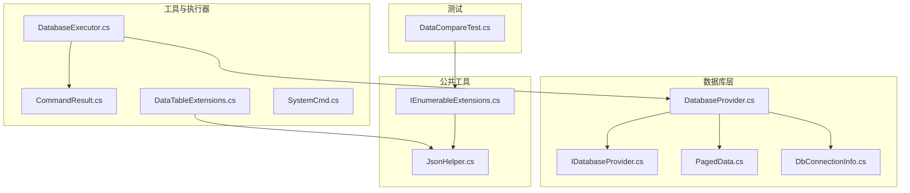
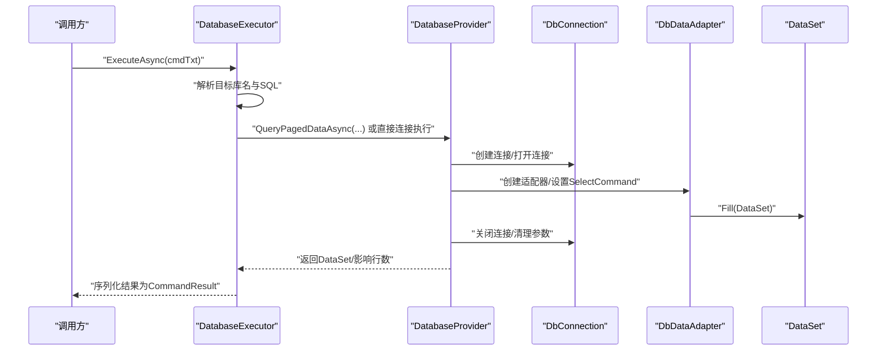
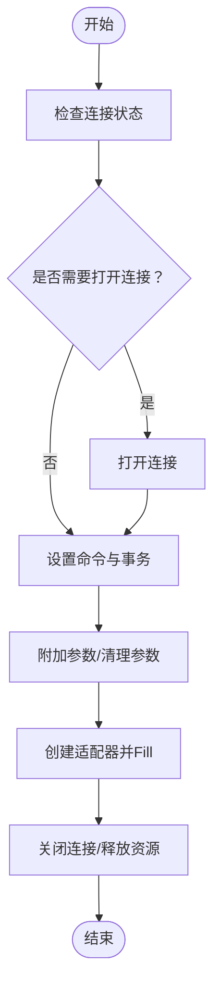
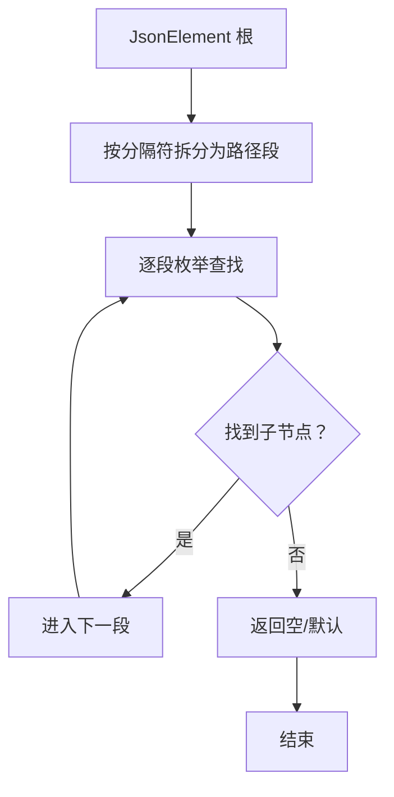
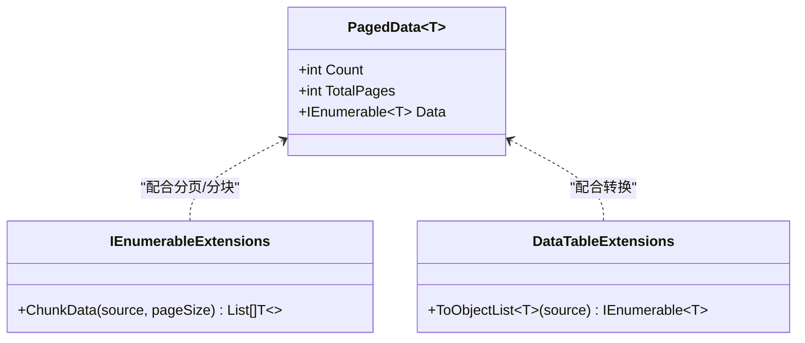
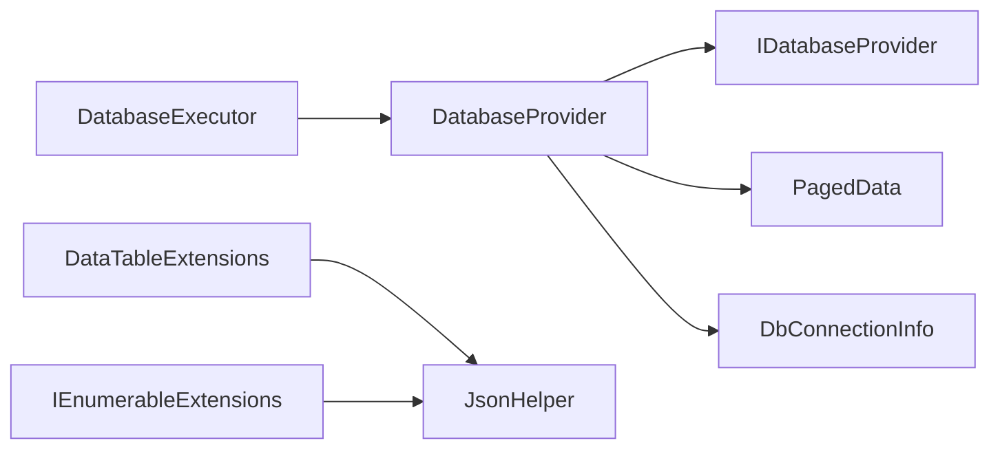

# 内存管理

<cite>
**本文引用的文件**
- [DatabaseProvider.cs](file://Sylas.RemoteTasks.Database/DatabaseProvider.cs)
- [IDatabaseProvider.cs](file://Sylas.RemoteTasks.Database/IDatabaseProvider.cs)
- [PagedData.cs](file://Sylas.RemoteTasks.Database/SyncBase/PagedData.cs)
- [DbConnectionInfo.cs](file://Sylas.RemoteTasks.Database/Dtos/DbConnectionInfo.cs)
- [CommandResult.cs](file://Sylas.RemoteTasks.Utils/CommandExecutor/CommandResult.cs)
- [JsonHelper.cs](file://Sylas.RemoteTasks.Common/JsonHelper.cs)
- [IEnumerableExtensions.cs](file://Sylas.RemoteTasks.Common/Extensions/IEnumerableExtensions.cs)
- [DataTableExtensions.cs](file://Sylas.RemoteTasks.Utils/Extensions/DataTableExtensions.cs)
- [DatabaseExecutor.cs](file://Sylas.RemoteTasks.Utils/CommandExecutor/DatabaseExecutor.cs)
- [DataCompareTest.cs](file://Sylas.RemoteTasks.Test/Database/DataCompareTest.cs)
- [SystemCmd.cs](file://Sylas.RemoteTasks.Utils/CommandExecutor/SystemCmd.cs)
</cite>

## 目录
1. [简介](#简介)
2. [项目结构](#项目结构)
3. [核心组件](#核心组件)
4. [架构总览](#架构总览)
5. [组件详细分析](#组件详细分析)
6. [依赖关系分析](#依赖关系分析)
7. [性能考量](#性能考量)
8. [故障排查指南](#故障排查指南)
9. [结论](#结论)
10. [附录](#附录)

## 简介
本文件聚焦于 Sylas.RemoteTasks 的内存管理实践，围绕以下关键点展开：数据库访问层的资源释放策略、命令执行结果对象的内存使用模式、JSON 序列化/反序列化的内存优化路径，以及针对大数据集的分页与批处理内存优化策略。同时提供内存泄漏检测方法、内存使用监控指标建议、性能调优最佳实践与常见问题排查思路。

## 项目结构
本项目采用按功能域划分的多项目结构，内存相关的关键模块主要分布在：
- 数据库访问层：Sylas.RemoteTasks.Database（DatabaseProvider、IDatabaseProvider、PagedData）
- 工具与执行器：Sylas.RemoteTasks.Utils（CommandExecutor、SystemCmd、DataTableExtensions）
- 公共工具：Sylas.RemoteTasks.Common（JsonHelper、IEnumerableExtensions）
- 测试：Sylas.RemoteTasks.Test（DataCompareTest）

图表来源
- [DatabaseProvider.cs](file://Sylas.RemoteTasks.Database/DatabaseProvider.cs#L1-L485)
- [IDatabaseProvider.cs](file://Sylas.RemoteTasks.Database/IDatabaseProvider.cs#L1-L99)
- [PagedData.cs](file://Sylas.RemoteTasks.Database/SyncBase/PagedData.cs#L1-L46)
- [DbConnectionInfo.cs](file://Sylas.RemoteTasks.Database/Dtos/DbConnectionInfo.cs#L1-L34)
- [CommandResult.cs](file://Sylas.RemoteTasks.Utils/CommandExecutor/CommandResult.cs#L1-L38)
- [DatabaseExecutor.cs](file://Sylas.RemoteTasks.Utils/CommandExecutor/DatabaseExecutor.cs#L1-L84)
- [DataTableExtensions.cs](file://Sylas.RemoteTasks.Utils/Extensions/DataTableExtensions.cs#L1-L35)
- [JsonHelper.cs](file://Sylas.RemoteTasks.Common/JsonHelper.cs#L1-L119)
- [IEnumerableExtensions.cs](file://Sylas.RemoteTasks.Common/Extensions/IEnumerableExtensions.cs#L1-L69)
- [DataCompareTest.cs](file://Sylas.RemoteTasks.Test/Database/DataCompareTest.cs#L1-L191)

章节来源
- [DatabaseProvider.cs](file://Sylas.RemoteTasks.Database/DatabaseProvider.cs#L1-L485)
- [IDatabaseProvider.cs](file://Sylas.RemoteTasks.Database/IDatabaseProvider.cs#L1-L99)
- [PagedData.cs](file://Sylas.RemoteTasks.Database/SyncBase/PagedData.cs#L1-L46)
- [DbConnectionInfo.cs](file://Sylas.RemoteTasks.Database/Dtos/DbConnectionInfo.cs#L1-L34)
- [CommandResult.cs](file://Sylas.RemoteTasks.Utils/CommandExecutor/CommandResult.cs#L1-L38)
- [JsonHelper.cs](file://Sylas.RemoteTasks.Common/JsonHelper.cs#L1-L119)
- [IEnumerableExtensions.cs](file://Sylas.RemoteTasks.Common/Extensions/IEnumerableExtensions.cs#L1-L69)
- [DataTableExtensions.cs](file://Sylas.RemoteTasks.Utils/Extensions/DataTableExtensions.cs#L1-L35)
- [DatabaseExecutor.cs](file://Sylas.RemoteTasks.Utils/CommandExecutor/DatabaseExecutor.cs#L1-L84)
- [DataCompareTest.cs](file://Sylas.RemoteTasks.Test/Database/DataCompareTest.cs#L1-L191)

## 核心组件
- DatabaseProvider：封装数据库连接、命令准备、参数绑定、适配器填充与资源释放；提供异步查询、分页查询、执行增删改等能力。
- IDatabaseProvider：定义数据库操作接口契约，约束分页查询、执行语句、插入/更新/建表、列信息获取等。
- PagedData：承载分页数据与计数，支持泛型与非泛型两种形式，用于避免一次性加载全量数据。
- CommandResult：命令执行结果载体，仅包含布尔标志、消息文本与执行编号，内存开销极小。
- JsonHelper：提供 JToken/JObject 访问、JsonElement 路径读取、JsonElement 到字典的递归转换等，避免不必要的中间对象驻留。
- IEnumerableExtensions：提供集合分块（Chunk）与字典转换等扩展，便于大集合的分批处理与内存控制。
- DataTableExtensions：将 DataTable 转换为对象集合时，对 JObject 场景进行优化，减少中间对象的重复构造。
- DatabaseExecutor：命令执行器，基于 DatabaseProvider 执行 SQL 并序列化结果，注意序列化与异常捕获对内存的影响。
- SystemCmd：系统命令执行器，提供进程内存与 CPU 使用查询，可用于运行时内存监控。

章节来源
- [DatabaseProvider.cs](file://Sylas.RemoteTasks.Database/DatabaseProvider.cs#L1-L485)
- [IDatabaseProvider.cs](file://Sylas.RemoteTasks.Database/IDatabaseProvider.cs#L1-L99)
- [PagedData.cs](file://Sylas.RemoteTasks.Database/SyncBase/PagedData.cs#L1-L46)
- [CommandResult.cs](file://Sylas.RemoteTasks.Utils/CommandExecutor/CommandResult.cs#L1-L38)
- [JsonHelper.cs](file://Sylas.RemoteTasks.Common/JsonHelper.cs#L1-L119)
- [IEnumerableExtensions.cs](file://Sylas.RemoteTasks.Common/Extensions/IEnumerableExtensions.cs#L1-L69)
- [DataTableExtensions.cs](file://Sylas.RemoteTasks.Utils/Extensions/DataTableExtensions.cs#L1-L35)
- [DatabaseExecutor.cs](file://Sylas.RemoteTasks.Utils/CommandExecutor/DatabaseExecutor.cs#L1-L84)
- [SystemCmd.cs](file://Sylas.RemoteTasks.Utils/CommandExecutor/SystemCmd.cs#L580-L639)

## 架构总览
数据库访问与命令执行的整体流程如下：

图表来源
- [DatabaseExecutor.cs](file://Sylas.RemoteTasks.Utils/CommandExecutor/DatabaseExecutor.cs#L26-L81)
- [DatabaseProvider.cs](file://Sylas.RemoteTasks.Database/DatabaseProvider.cs#L82-L104)
- [DatabaseProvider.cs](file://Sylas.RemoteTasks.Database/DatabaseProvider.cs#L230-L258)

## 组件详细分析

### DatabaseProvider 的内存分配与资源释放
- 连接与命令生命周期：在执行前根据连接状态决定是否需要关闭连接；命令执行后显式清理参数集合，避免参数对象长期持有。
- 适配器填充：使用适配器 Fill(DataSet) 一次性填充数据集，适合中等规模数据；对于超大数据集，应结合分页与流式读取策略。
- 字符串参数优化：提供带长度的参数创建方法，有助于数据库重用执行计划，减少编译开销。
- 异常安全：所有数据库对象均在 using 或显式 Close/Dispose 路径中释放，降低泄漏风险。

图表来源
- [DatabaseProvider.cs](file://Sylas.RemoteTasks.Database/DatabaseProvider.cs#L117-L143)
- [DatabaseProvider.cs](file://Sylas.RemoteTasks.Database/DatabaseProvider.cs#L230-L258)

章节来源
- [DatabaseProvider.cs](file://Sylas.RemoteTasks.Database/DatabaseProvider.cs#L82-L104)
- [DatabaseProvider.cs](file://Sylas.RemoteTasks.Database/DatabaseProvider.cs#L117-L143)
- [DatabaseProvider.cs](file://Sylas.RemoteTasks.Database/DatabaseProvider.cs#L230-L258)
- [DatabaseProvider.cs](file://Sylas.RemoteTasks.Database/DatabaseProvider.cs#L266-L311)

### CommandResult 的内存使用模式
- 结构简单：仅包含布尔标志、字符串消息与执行编号，无复杂嵌套对象，GC 压力低。
- 适用场景：命令执行器返回结果的标准载体，避免携带大量数据导致内存膨胀。
- 注意事项：若需携带大数据，建议改为轻量标识或分页拉取，而非直接序列化大对象。

章节来源
- [CommandResult.cs](file://Sylas.RemoteTasks.Utils/CommandExecutor/CommandResult.cs#L1-L38)

### JsonHelper 的序列化内存优化
- 路径读取：提供 JsonElement 按路径读取方法，避免一次性反序列化整棵树，降低峰值内存。
- 递归转换：将 JsonElement 转换为字典时采用递归遍历，按需构建对象图，减少中间 JToken/JObject 的驻留时间。
- 与 DataTableExtensions 协同：在 DataTable 转对象集合时，对 JObject 场景进行优化，减少重复构造。

图表来源
- [JsonHelper.cs](file://Sylas.RemoteTasks.Common/JsonHelper.cs#L81-L89)
- [JsonHelper.cs](file://Sylas.RemoteTasks.Common/JsonHelper.cs#L95-L116)
- [DataTableExtensions.cs](file://Sylas.RemoteTasks.Utils/Extensions/DataTableExtensions.cs#L20-L35)

章节来源
- [JsonHelper.cs](file://Sylas.RemoteTasks.Common/JsonHelper.cs#L46-L89)
- [JsonHelper.cs](file://Sylas.RemoteTasks.Common/JsonHelper.cs#L95-L116)
- [DataTableExtensions.cs](file://Sylas.RemoteTasks.Utils/Extensions/DataTableExtensions.cs#L20-L35)

### 大数据集处理的内存优化策略
- 分页查询：通过 PagedData<T> 与分页 SQL 限制单次加载记录数，避免一次性装入全量数据。
- 集合分块：使用 IEnumerableExtensions.ChunkData 将大集合分块处理，降低峰值内存占用。
- 流式转换：在 DataTable 转对象集合时，优先选择轻量字典映射，避免 JObject 层级过深导致的内存压力。
- 测试验证：DataCompareTest 显示从 IEnumerable<JObject> 迁移到 IEnumerable<IDictionary<string, object>> 后，处理时间显著下降且内存占用减少近半。

图表来源
- [PagedData.cs](file://Sylas.RemoteTasks.Database/SyncBase/PagedData.cs#L30-L44)
- [IEnumerableExtensions.cs](file://Sylas.RemoteTasks.Common/Extensions/IEnumerableExtensions.cs#L48-L66)
- [DataTableExtensions.cs](file://Sylas.RemoteTasks.Utils/Extensions/DataTableExtensions.cs#L20-L35)

章节来源
- [PagedData.cs](file://Sylas.RemoteTasks.Database/SyncBase/PagedData.cs#L10-L44)
- [IEnumerableExtensions.cs](file://Sylas.RemoteTasks.Common/Extensions/IEnumerableExtensions.cs#L48-L66)
- [DataCompareTest.cs](file://Sylas.RemoteTasks.Test/Database/DataCompareTest.cs#L184-L187)

### 垃圾回收优化与大对象处理
- 大对象堆（LOH）规避：避免频繁创建超大数组/字符串；优先使用分块与流式处理。
- 参数与中间对象：在 DatabaseProvider 中及时清理 DbParameter 集合，减少 GC 压力。
- 序列化成本控制：尽量避免对超大数据进行 JSON 序列化；必要时采用流式输出或分片传输。
- 连接池与复用：合理使用连接池，避免频繁创建/销毁连接带来的额外分配。

章节来源
- [DatabaseProvider.cs](file://Sylas.RemoteTasks.Database/DatabaseProvider.cs#L98-L103)
- [DatabaseExecutor.cs](file://Sylas.RemoteTasks.Utils/CommandExecutor/DatabaseExecutor.cs#L68-L74)

## 依赖关系分析
- DatabaseExecutor 依赖 DatabaseProvider 完成 SQL 执行，并将结果序列化为 CommandResult。
- DatabaseProvider 依赖 System.Data.SqlClient 族对象，负责连接、命令与适配器的生命周期管理。
- JsonHelper 与 DataTableExtensions 协同，支撑数据转换过程中的内存友好路径。
- IEnumerableExtensions 为分页与批处理提供通用能力，降低上层实现复杂度。

图表来源
- [DatabaseExecutor.cs](file://Sylas.RemoteTasks.Utils/CommandExecutor/DatabaseExecutor.cs#L1-L84)
- [DatabaseProvider.cs](file://Sylas.RemoteTasks.Database/DatabaseProvider.cs#L1-L485)
- [IDatabaseProvider.cs](file://Sylas.RemoteTasks.Database/IDatabaseProvider.cs#L1-L99)
- [PagedData.cs](file://Sylas.RemoteTasks.Database/SyncBase/PagedData.cs#L1-L46)
- [DbConnectionInfo.cs](file://Sylas.RemoteTasks.Database/Dtos/DbConnectionInfo.cs#L1-L34)
- [DataTableExtensions.cs](file://Sylas.RemoteTasks.Utils/Extensions/DataTableExtensions.cs#L1-L35)
- [JsonHelper.cs](file://Sylas.RemoteTasks.Common/JsonHelper.cs#L1-L119)
- [IEnumerableExtensions.cs](file://Sylas.RemoteTasks.Common/Extensions/IEnumerableExtensions.cs#L1-L69)

章节来源
- [DatabaseExecutor.cs](file://Sylas.RemoteTasks.Utils/CommandExecutor/DatabaseExecutor.cs#L1-L84)
- [DatabaseProvider.cs](file://Sylas.RemoteTasks.Database/DatabaseProvider.cs#L1-L485)
- [IDatabaseProvider.cs](file://Sylas.RemoteTasks.Database/IDatabaseProvider.cs#L1-L99)
- [PagedData.cs](file://Sylas.RemoteTasks.Database/SyncBase/PagedData.cs#L1-L46)
- [DbConnectionInfo.cs](file://Sylas.RemoteTasks.Database/Dtos/DbConnectionInfo.cs#L1-L34)
- [DataTableExtensions.cs](file://Sylas.RemoteTasks.Utils/Extensions/DataTableExtensions.cs#L1-L35)
- [JsonHelper.cs](file://Sylas.RemoteTasks.Common/JsonHelper.cs#L1-L119)
- [IEnumerableExtensions.cs](file://Sylas.RemoteTasks.Common/Extensions/IEnumerableExtensions.cs#L1-L69)

## 性能考量
- 分页与批处理：优先使用分页查询与集合分块，避免一次性加载全量数据。
- 参数长度优化：对字符串参数指定 Size，提升执行计划复用率，间接降低编译与缓存压力。
- 序列化策略：对超大数据采用流式或分片输出，避免一次性序列化造成峰值内存过高。
- 连接与适配器：确保在 using 块内使用适配器与连接，执行后立即关闭并清理参数。
- 监控与采样：利用 SystemCmd 获取进程内存与 CPU 使用，建立基线并持续观察。

章节来源
- [DatabaseProvider.cs](file://Sylas.RemoteTasks.Database/DatabaseProvider.cs#L292-L311)
- [DatabaseExecutor.cs](file://Sylas.RemoteTasks.Utils/CommandExecutor/DatabaseExecutor.cs#L68-L74)
- [SystemCmd.cs](file://Sylas.RemoteTasks.Utils/CommandExecutor/SystemCmd.cs#L625-L639)

## 故障排查指南
- 内存泄漏检测
  - 使用 SystemCmd 获取进程内存使用（WorkingSet64），观察长时间运行任务的内存曲线是否持续上升。
  - 关注数据库连接与适配器是否正确关闭；确认参数集合在命令执行后被清理。
- 常见问题定位
  - 查询结果过大：检查是否误用不分页的查询；确认是否使用了 PagedData<T>。
  - 序列化异常：确认 DatabaseExecutor 中的 JSON 序列化范围，避免对超大结果集进行一次性序列化。
  - 参数未清理：核对 DatabaseProvider 在 Fill 后是否调用了参数清理与连接关闭。
- 性能回归验证
  - 使用 DataCompareTest 的思路，构造大规模集合进行对比，观察处理时间与内存占用变化趋势。

章节来源
- [SystemCmd.cs](file://Sylas.RemoteTasks.Utils/CommandExecutor/SystemCmd.cs#L625-L639)
- [DatabaseProvider.cs](file://Sylas.RemoteTasks.Database/DatabaseProvider.cs#L98-L103)
- [DatabaseExecutor.cs](file://Sylas.RemoteTasks.Utils/CommandExecutor/DatabaseExecutor.cs#L76-L79)
- [DataCompareTest.cs](file://Sylas.RemoteTasks.Test/Database/DataCompareTest.cs#L184-L187)

## 结论
通过对 DatabaseProvider 的资源释放策略、CommandResult 的轻量设计、JsonHelper 的路径读取与递归转换优化，以及分页与分块的大数据处理策略，Sylas.RemoteTasks 在内存管理方面形成了较为稳健的实践。建议在生产环境中坚持使用分页/批处理、及时清理参数与连接、控制序列化范围，并结合进程内存监控持续优化。

## 附录
- 监控指标建议
  - 进程工作集（MB）、CPU 使用率、数据库连接数、每秒查询数（QPS）、平均响应时间、GC 压力级别。
- 最佳实践清单
  - 使用 using/显式释放数据库对象；分页查询优先；字符串参数指定 Size；避免对超大数据集进行一次性序列化；定期进行内存曲线与性能回归测试。