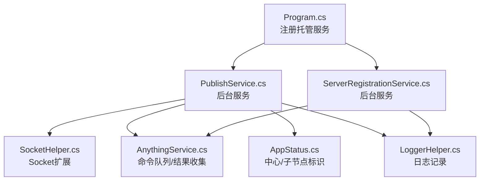
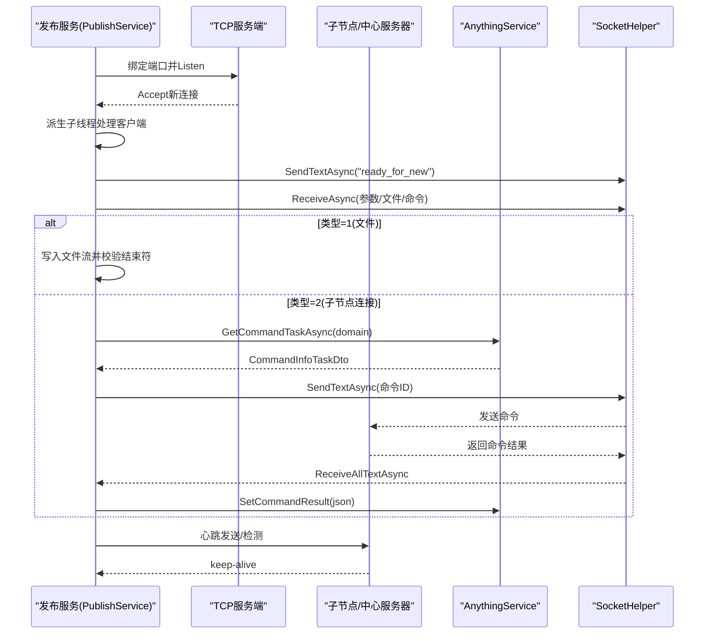
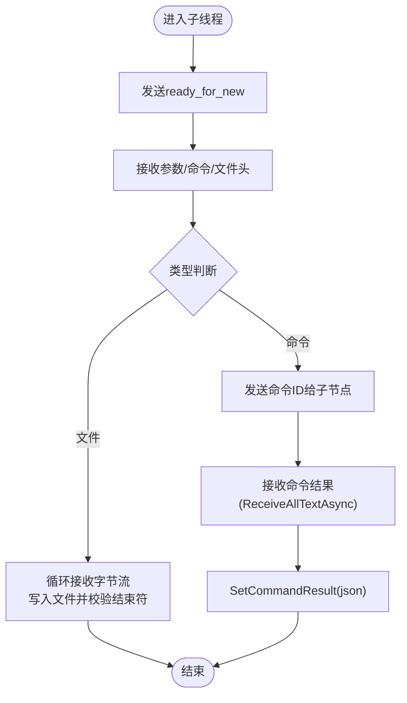
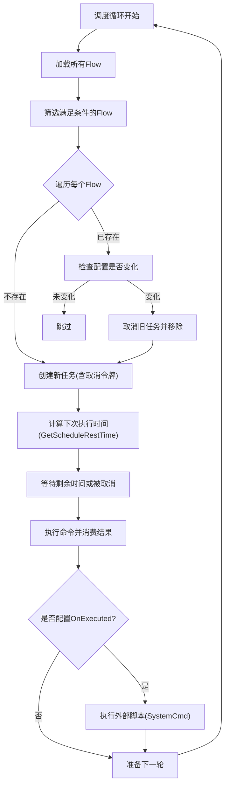
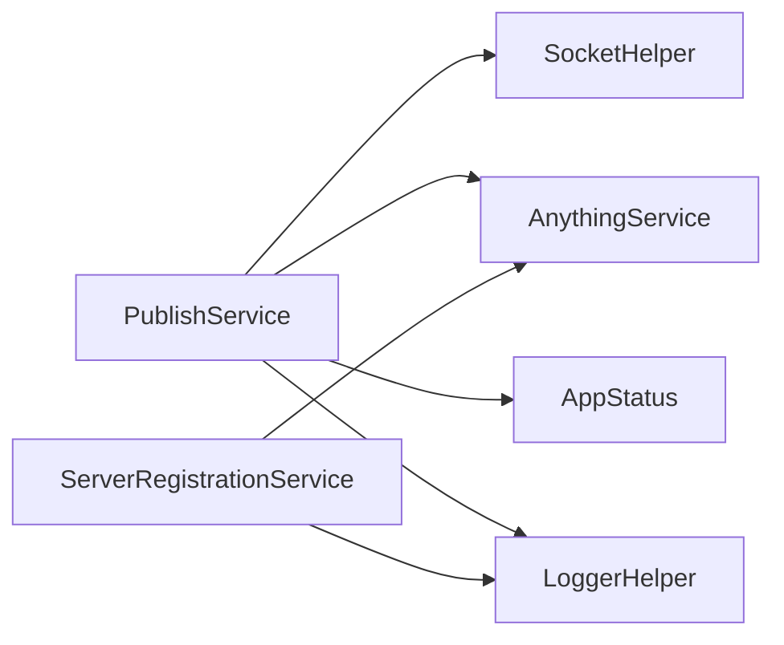

# 并发处理

<cite>
**本文引用的文件**
- [PublishService.cs](file://Sylas.RemoteTasks.App/BackgroundServices/PublishService.cs)
- [ServerRegistrationService.cs](file://Sylas.RemoteTasks.App/BackgroundServices/ServerRegistrationService.cs)
- [Program.cs](file://Sylas.RemoteTasks.App/Program.cs)
- [appsettings.json](file://Sylas.RemoteTasks.App/appsettings.json)
- [AnythingService.cs](file://Sylas.RemoteTasks.App/RemoteHostModule/Anything/AnythingService.cs)
- [SocketHelper.cs](file://Sylas.RemoteTasks.Utils/SocketHelper.cs)
- [LoggerHelper.cs](file://Sylas.RemoteTasks.Common/LoggerHelper.cs)
- [AppStatus.cs](file://Sylas.RemoteTasks.Common/AppStatus.cs)
</cite>

## 目录
1. [简介](#简介)
2. [项目结构与并发入口](#项目结构与并发入口)
3. [核心组件与并发模型](#核心组件与并发模型)
4. [架构总览](#架构总览)
5. [关键组件深度分析](#关键组件深度分析)
6. [依赖关系与耦合分析](#依赖关系与耦合分析)
7. [性能与优化建议](#性能与优化建议)
8. [故障排查与恢复机制](#故障排查与恢复机制)
9. [结论](#结论)

## 简介
本文聚焦 Sylas.RemoteTasks 的并发处理能力，系统性梳理后台服务的并发模型、异步任务处理与线程安全机制。重点覆盖 PublishService 与 ServerRegistrationService 的并发控制实现、任务调度策略、资源竞争处理，并给出并发性能优化技巧、死锁预防措施、线程池配置建议，以及并发场景下的错误处理与恢复机制。

## 项目结构与并发入口
- 后台服务注册：在应用启动时通过托管服务注册发布服务与注册服务，二者均继承自 BackgroundService，具备生命周期内的并发执行能力。
- 配置来源：appsettings.json 提供 TCP 端口、中心服务器地址等运行时参数，影响并发行为与连接策略。
- 并发入口：
  - PublishService：负责 TCP 服务端监听、子节点接入、命令下发与结果回传；同时维护与中心服务器的长连接与心跳。
  - ServerRegistrationService：负责服务节点注册/注销、基于 Cron 的 AnythingFlow 任务调度，内部使用并发字典与取消令牌管理多个独立调度任务。

图表来源
- [Program.cs](file://Sylas.RemoteTasks.App/Program.cs#L67-L68)
- [PublishService.cs](file://Sylas.RemoteTasks.App/BackgroundServices/PublishService.cs#L88-L340)
- [ServerRegistrationService.cs](file://Sylas.RemoteTasks.App/BackgroundServices/ServerRegistrationService.cs#L41-L49)
- [SocketHelper.cs](file://Sylas.RemoteTasks.Utils/SocketHelper.cs#L138-L245)
- [AnythingService.cs](file://Sylas.RemoteTasks.App/RemoteHostModule/Anything/AnythingService.cs#L399-L491)
- [AppStatus.cs](file://Sylas.RemoteTasks.Common/AppStatus.cs#L1-L35)
- [LoggerHelper.cs](file://Sylas.RemoteTasks.Common/LoggerHelper.cs#L48-L76)

章节来源
- [Program.cs](file://Sylas.RemoteTasks.App/Program.cs#L67-L68)
- [appsettings.json](file://Sylas.RemoteTasks.App/appsettings.json#L28-L33)

## 核心组件与并发模型
- PublishService
  - TCP 服务端：Accept 循环在主线程中持续监听，每次接入新客户端即派生子线程处理，避免阻塞主监听循环。
  - 命令下发与结果接收：为中心节点或子节点分别启动“命令发送器”和“命令接收器”两个子任务，二者通过共享的取消令牌协调退出。
  - 心跳与重连：子节点侧维持与中心服务器的长连接，心跳发送与心跳检测分别由独立子线程负责，超时自动重连。
  - 线程安全：使用 ConcurrentDictionary 管理子节点 Socket 映射，避免多线程访问冲突；使用静态队列与静态集合承载跨线程通信数据。
- ServerRegistrationService
  - AnythingFlow 调度：为每个满足条件的 Flow 创建独立的调度任务，使用 ConcurrentDictionary 维护“任务ID -> (Flow, 取消令牌)”映射，支持动态变更与取消。
  - Cron 解析：自研 Cron 解析器，缓存解析结果，降低重复计算成本。
  - 线程安全：调度循环内按轮次创建作用域，避免长时间持有大对象；使用 CancellationToken 实现优雅取消。

章节来源
- [PublishService.cs](file://Sylas.RemoteTasks.App/BackgroundServices/PublishService.cs#L88-L340)
- [ServerRegistrationService.cs](file://Sylas.RemoteTasks.App/BackgroundServices/ServerRegistrationService.cs#L182-L341)

## 架构总览
下面的序列图展示了 PublishService 的典型交互流程：TCP 监听 -> 子线程处理 -> 命令下发/接收 -> 心跳维持 -> 异常恢复。

图表来源
- [PublishService.cs](file://Sylas.RemoteTasks.App/BackgroundServices/PublishService.cs#L104-L337)
- [PublishService.cs](file://Sylas.RemoteTasks.App/BackgroundServices/PublishService.cs#L346-L434)
- [AnythingService.cs](file://Sylas.RemoteTasks.App/RemoteHostModule/Anything/AnythingService.cs#L399-L491)
- [SocketHelper.cs](file://Sylas.RemoteTasks.Utils/SocketHelper.cs#L172-L245)

## 关键组件深度分析

### PublishService 并发控制与线程安全
- 并发模型
  - 主监听线程：仅负责 Accept，不参与业务处理，避免阻塞。
  - 子线程模型：每个客户端连接派生一个子线程，独立处理参数接收、文件传输、命令下发与结果接收。
  - 心跳线程：子节点侧为心跳发送与心跳检测分别创建独立线程，超时自动重连。
- 线程安全
  - 子节点 Socket 管理：使用 ConcurrentDictionary 保存“节点标识 -> (Socket, 标识号)”，避免并发访问冲突。
  - 命令队列与结果收集：AnythingService 使用静态队列与静态字典承载跨线程通信，配合取消令牌与超时控制。
- 资源竞争与同步
  - 使用取消令牌协调命令发送器/接收器的退出，避免旧线程抢占新任务。
  - 使用静态集合承载命令结果，配合去重与“命令集终点”标记，确保结果有序消费。
- 错误处理
  - Socket 异常捕获与连接重试；心跳超时主动释放连接并重连。
  - 文件传输结束符校验，防止粘包导致的数据截断。

图表来源
- [PublishService.cs](file://Sylas.RemoteTasks.App/BackgroundServices/PublishService.cs#L124-L337)
- [SocketHelper.cs](file://Sylas.RemoteTasks.Utils/SocketHelper.cs#L172-L245)
- [AnythingService.cs](file://Sylas.RemoteTasks.App/RemoteHostModule/Anything/AnythingService.cs#L436-L491)

章节来源
- [PublishService.cs](file://Sylas.RemoteTasks.App/BackgroundServices/PublishService.cs#L18-L86)
- [PublishService.cs](file://Sylas.RemoteTasks.App/BackgroundServices/PublishService.cs#L88-L340)
- [PublishService.cs](file://Sylas.RemoteTasks.App/BackgroundServices/PublishService.cs#L346-L637)
- [SocketHelper.cs](file://Sylas.RemoteTasks.Utils/SocketHelper.cs#L138-L303)
- [AnythingService.cs](file://Sylas.RemoteTasks.App/RemoteHostModule/Anything/AnythingService.cs#L399-L491)

### ServerRegistrationService 任务调度与并发
- 并发模型
  - 为每个满足条件的 AnythingFlow 创建独立的调度任务，使用 CancellationTokenSource 支持取消与动态变更。
  - 调度循环内按轮次创建作用域，避免长时间持有大对象，减少内存压力。
- 线程安全
  - 使用 ConcurrentDictionary 维护“任务ID -> (Flow, 取消令牌)”映射，支持并发读写与更新。
  - Cron 解析结果缓存，避免重复解析。
- 调度策略
  - Cron 解析：支持“秒 分 时”三段表达式，支持 “*”、“*/n”、“a-b”、“a-b/n”、“x,y,z” 等语法。
  - 下次执行时间计算：在未来 7 天内寻找首个匹配时间，返回秒数差。
- 资源竞争与同步
  - 通过取消令牌实现优雅取消；当 Flow 配置变更时，先取消旧任务再重建。
  - 使用 await foreach 流式消费命令执行结果，避免阻塞。

图表来源
- [ServerRegistrationService.cs](file://Sylas.RemoteTasks.App/BackgroundServices/ServerRegistrationService.cs#L187-L341)
- [ServerRegistrationService.cs](file://Sylas.RemoteTasks.App/BackgroundServices/ServerRegistrationService.cs#L362-L490)
- [AnythingService.cs](file://Sylas.RemoteTasks.App/RemoteHostModule/Anything/AnythingService.cs#L294-L389)

章节来源
- [ServerRegistrationService.cs](file://Sylas.RemoteTasks.App/BackgroundServices/ServerRegistrationService.cs#L182-L341)
- [ServerRegistrationService.cs](file://Sylas.RemoteTasks.App/BackgroundServices/ServerRegistrationService.cs#L362-L490)

### AnythingService 命令队列与结果收集
- 命令队列
  - 以领域维度(domain)组织命令队列，使用静态 ConcurrentDictionary 保存“domain -> Queue<CommandInfoTaskDto>”。
  - GetCommandTaskAsync 采用轮询方式，支持取消令牌中断。
- 结果收集
  - SetCommandResult 将子节点返回的 JSON 结果追加到静态集合，GetCommandResultAsync 通过命令执行编号进行匹配与消费。
  - 使用超时控制与周期性日志输出，避免无限等待。
- 线程安全
  - 静态集合与字典在多线程环境下通过队列与集合操作保证一致性；日志记录通过异步文件写入保障非阻塞。

章节来源
- [AnythingService.cs](file://Sylas.RemoteTasks.App/RemoteHostModule/Anything/AnythingService.cs#L399-L491)

## 依赖关系与耦合分析
- PublishService 依赖
  - SocketHelper：封装 SendTextAsync、ReceiveAllTextAsync、心跳检测等通用 Socket 操作。
  - AnythingService：通过静态队列与结果集合实现跨线程命令下发与结果收集。
  - AppStatus：提供中心/子节点标识，决定命令转发策略。
  - LoggerHelper：统一日志输出，便于并发场景下的可观测性。
- ServerRegistrationService 依赖
  - AnythingService：执行命令并流式返回结果。
  - RepositoryBase：查询 Flow 列表，驱动调度。
  - LoggerHelper：记录调度与执行日志。
- 耦合点
  - PublishService 与 AnythingService 通过静态集合耦合，需注意跨线程访问与超时控制。
  - ServerRegistrationService 与 AnythingService 通过 DI 作用域解耦，但需避免长时间持有作用域对象。

图表来源
- [PublishService.cs](file://Sylas.RemoteTasks.App/BackgroundServices/PublishService.cs#L1-L12)
- [ServerRegistrationService.cs](file://Sylas.RemoteTasks.App/BackgroundServices/ServerRegistrationService.cs#L1-L17)
- [AnythingService.cs](file://Sylas.RemoteTasks.App/RemoteHostModule/Anything/AnythingService.cs#L1-L16)
- [AppStatus.cs](file://Sylas.RemoteTasks.Common/AppStatus.cs#L1-L35)
- [LoggerHelper.cs](file://Sylas.RemoteTasks.Common/LoggerHelper.cs#L1-L76)

## 性能与优化建议
- 线程池与任务调度
  - 使用 Task.Factory.StartNew 派生子线程处理客户端连接与命令下发/接收，建议结合线程池饱和策略评估 CPU 与 IO 密集度，必要时改用 Task.Run 或合理配置线程池大小。
  - ServerRegistrationService 的调度循环使用 await Task.Delay 控制轮询频率，建议根据任务数量与执行时长动态调整延迟。
- 缓冲区与网络
  - PublishService 使用固定缓冲区大小接收/发送数据，建议根据实际文件大小与命令负载动态调整缓冲区，避免频繁分配。
  - SocketHelper 的 ReceiveAllTextAsync 已内置结束符检测与粘包处理，建议保持该策略不变。
- 内存与 GC
  - ServerRegistrationService 在调度循环内按轮次创建作用域，避免长时间持有大对象，减少 GC 压力。
  - AnythingService 的静态集合与字典需注意容量增长与清理策略，避免内存膨胀。
- 心跳与超时
  - 心跳频率与超时阈值需结合网络环境调优，避免频繁重连或误判超时。
- 并发度控制
  - 对于高并发场景，建议引入限流与背压机制，避免队列堆积导致内存与 CPU 压力过大。

[本节为通用性能指导，不直接分析具体文件]

## 故障排查与恢复机制
- 心跳与连接
  - 心跳发送线程与心跳检测线程分别负责发送与检测，超时自动释放连接并重连，避免长时间阻塞。
  - SocketHelper 的 ReceiveAllTextAsync 在取消令牌触发时抛出 OperationCanceledException，需在调用方妥善处理。
- 文件传输
  - 结束符校验失败时抛出异常并关闭连接，避免脏数据污染后续流程。
- 调度与取消
  - ServerRegistrationService 通过取消令牌实现优雅取消，Flow 配置变更时先取消旧任务再重建。
  - AnythingService 的命令结果集合采用超时控制与周期性日志输出，便于定位卡顿原因。
- 日志与可观测性
  - LoggerHelper 提供异步文件写入，避免阻塞业务线程；建议在关键路径增加日志级别与上下文信息，便于并发场景下的问题定位。

章节来源
- [PublishService.cs](file://Sylas.RemoteTasks.App/BackgroundServices/PublishService.cs#L482-L618)
- [SocketHelper.cs](file://Sylas.RemoteTasks.Utils/SocketHelper.cs#L172-L245)
- [ServerRegistrationService.cs](file://Sylas.RemoteTasks.App/BackgroundServices/ServerRegistrationService.cs#L208-L222)
- [AnythingService.cs](file://Sylas.RemoteTasks.App/RemoteHostModule/Anything/AnythingService.cs#L440-L491)
- [LoggerHelper.cs](file://Sylas.RemoteTasks.Common/LoggerHelper.cs#L48-L76)

## 结论
Sylas.RemoteTasks 的并发处理以“后台服务 + 子线程 + 静态共享集合”的模式实现，兼顾了高并发下的吞吐与稳定性。PublishService 通过 TCP 与心跳机制实现可靠的命令下发与结果回传；ServerRegistrationService 通过 Cron 调度与取消令牌实现灵活的任务编排。建议在生产环境中结合业务负载对缓冲区、心跳与调度延迟进行调优，并完善监控与告警，以进一步提升系统的可靠性与可维护性。