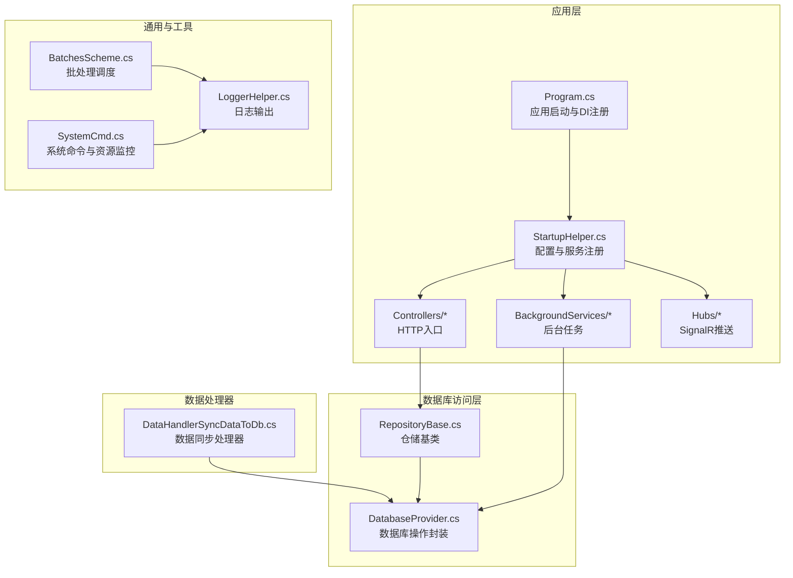
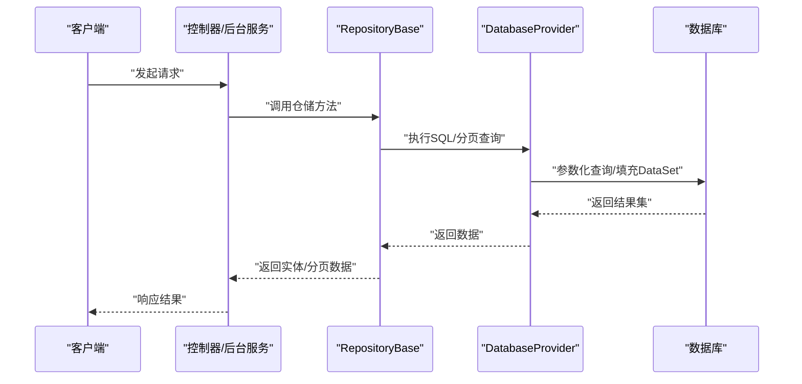
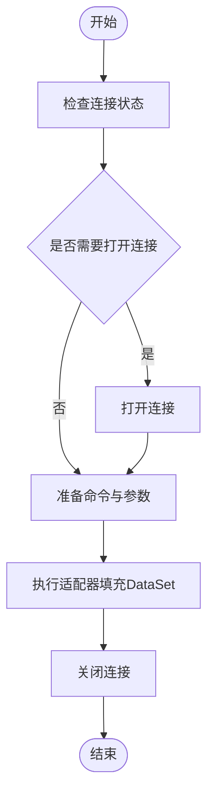
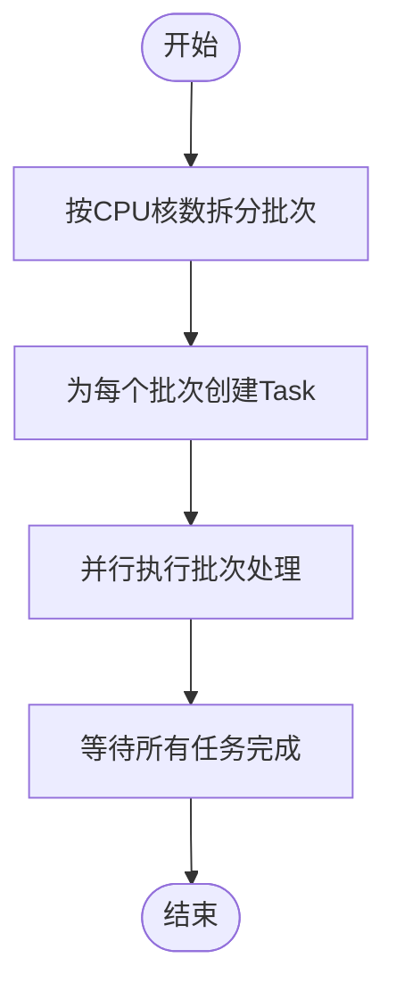
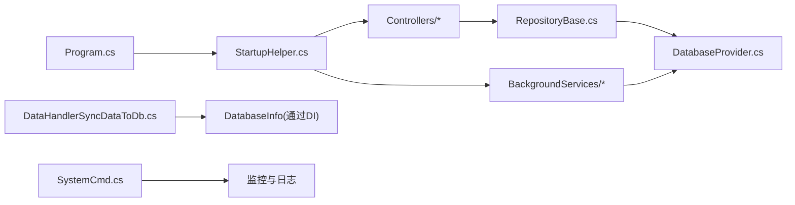

# 性能优化

<cite>
**本文引用的文件**   
- [Program.cs](file://Sylas.RemoteTasks.App/Program.cs)
- [appsettings.json](file://Sylas.RemoteTasks.App/appsettings.json)
- [StartupHelper.cs](file://Sylas.RemoteTasks.App/Helpers/StartupHelper.cs)
- [DatabaseProvider.cs](file://Sylas.RemoteTasks.Database/DatabaseProvider.cs)
- [RepositoryBase.cs](file://Sylas.RemoteTasks.App/Infrastructure/RepositoryBase.cs)
- [DataHandlerSyncDataToDb.cs](file://Sylas.RemoteTasks.App/DataHandlers/DataHandlerSyncDataToDb.cs)
- [BatchesScheme.cs](file://Sylas.RemoteTasks.Common/BatchesScheme.cs)
- [SystemCmd.cs](file://Sylas.RemoteTasks.Utils/CommandExecutor/SystemCmd.cs)
- [LoggerHelper.cs](file://Sylas.RemoteTasks.Common/LoggerHelper.cs)
- [ServerRegistrationService.cs](file://Sylas.RemoteTasks.App/BackgroundServices/ServerRegistrationService.cs)
</cite>

## 目录
1. [简介](#简介)
2. [项目结构](#项目结构)
3. [核心组件](#核心组件)
4. [架构总览](#架构总览)
5. [详细组件分析](#详细组件分析)
6. [依赖关系分析](#依赖关系分析)
7. [性能考量](#性能考量)
8. [故障排查指南](#故障排查指南)
9. [结论](#结论)
10. [附录](#附录)

## 简介
本文件面向 Sylas.RemoteTasks 的性能优化目标，围绕数据库优化、缓存策略、并发处理、内存管理与监控指标等方面，结合代码实现给出可落地的优化方法、实施案例、最佳实践与常见问题解决方案，并提供性能测试与基准测试建议。

## 项目结构
Sylas.RemoteTasks 采用多项目分层组织：应用层负责 Web 请求、后台服务、SignalR 推送；数据库访问层封装通用数据库能力；公共库提供通用工具与日志；工具库提供系统命令执行与资源监控；测试项目覆盖功能与系统级行为验证。

**图表来源**
- [Program.cs](file://Sylas.RemoteTasks.App/Program.cs#L1-L122)
- [StartupHelper.cs](file://Sylas.RemoteTasks.App/Helpers/StartupHelper.cs#L1-L275)
- [DatabaseProvider.cs](file://Sylas.RemoteTasks.Database/DatabaseProvider.cs#L1-L485)
- [RepositoryBase.cs](file://Sylas.RemoteTasks.App/Infrastructure/RepositoryBase.cs#L1-L233)
- [DataHandlerSyncDataToDb.cs](file://Sylas.RemoteTasks.App/DataHandlers/DataHandlerSyncDataToDb.cs#L1-L65)
- [BatchesScheme.cs](file://Sylas.RemoteTasks.Common/BatchesScheme.cs#L1-L63)
- [LoggerHelper.cs](file://Sylas.RemoteTasks.Common/LoggerHelper.cs#L1-L115)
- [SystemCmd.cs](file://Sylas.RemoteTasks.Utils/CommandExecutor/SystemCmd.cs#L381-L712)

**章节来源**
- [Program.cs](file://Sylas.RemoteTasks.App/Program.cs#L1-L122)
- [StartupHelper.cs](file://Sylas.RemoteTasks.App/Helpers/StartupHelper.cs#L1-L275)

## 核心组件
- 应用启动与服务注册：集中于 Program.cs 与 StartupHelper.cs，涵盖 Kestrel 限流、缓存、SignalR、HttpClient、仓储与数据处理器注册、后台服务与鉴权配置。
- 数据库访问：DatabaseProvider 提供统一的 SQL 查询、分页、参数化执行与连接管理；RepositoryBase 基于 Dapper 实现仓储通用 CRUD。
- 数据处理：DataHandlerSyncDataToDb 负责将外部数据源同步到目标数据库，支持动态选择连接串或切换数据库。
- 并发与批处理：BatchesScheme 提供 CPU 密集型任务按 CPU 核数拆分并行执行的批处理框架。
- 监控与日志：LoggerHelper 提供控制台与文件日志；SystemCmd 提供系统资源与进程监控；后台服务 ServerRegistrationService 展示了对数据库的批量查询场景。

**章节来源**
- [Program.cs](file://Sylas.RemoteTasks.App/Program.cs#L1-L122)
- [StartupHelper.cs](file://Sylas.RemoteTasks.App/Helpers/StartupHelper.cs#L28-L54)
- [DatabaseProvider.cs](file://Sylas.RemoteTasks.Database/DatabaseProvider.cs#L176-L258)
- [RepositoryBase.cs](file://Sylas.RemoteTasks.App/Infrastructure/RepositoryBase.cs#L10-L105)
- [DataHandlerSyncDataToDb.cs](file://Sylas.RemoteTasks.App/DataHandlers/DataHandlerSyncDataToDb.cs#L17-L62)
- [BatchesScheme.cs](file://Sylas.RemoteTasks.Common/BatchesScheme.cs#L19-L60)
- [LoggerHelper.cs](file://Sylas.RemoteTasks.Common/LoggerHelper.cs#L16-L76)
- [SystemCmd.cs](file://Sylas.RemoteTasks.Utils/CommandExecutor/SystemCmd.cs#L381-L417)
- [ServerRegistrationService.cs](file://Sylas.RemoteTasks.App/BackgroundServices/ServerRegistrationService.cs#L118-L138)

## 架构总览
应用通过 DI 容器注册数据库与仓储，控制器/后台服务调用仓储或直接使用 DatabaseProvider 执行 SQL；数据处理器在请求处理管线中按步骤执行，支持将外部数据写入数据库；系统命令模块提供资源与进程监控能力。

**图表来源**
- [RepositoryBase.cs](file://Sylas.RemoteTasks.App/Infrastructure/RepositoryBase.cs#L20-L25)
- [DatabaseProvider.cs](file://Sylas.RemoteTasks.Database/DatabaseProvider.cs#L82-L105)

## 详细组件分析

### 数据库优化（DatabaseProvider 与 RepositoryBase）
- 参数化与类型映射：DatabaseProvider 使用参数化查询与类型映射，避免拼接 SQL，降低注入风险并提升执行计划复用。
- 连接管理：在执行前确保连接打开，完成后关闭，减少长连接泄漏风险。
- 分页查询：RepositoryBase 通过 DatabaseProvider 的分页接口实现高效分页，避免一次性加载全量数据。
- 插入/更新：仓储在插入后根据数据库类型追加返回自增 ID 的查询，保证一致性。

**图表来源**
- [DatabaseProvider.cs](file://Sylas.RemoteTasks.Database/DatabaseProvider.cs#L117-L143)
- [DatabaseProvider.cs](file://Sylas.RemoteTasks.Database/DatabaseProvider.cs#L230-L258)

**章节来源**
- [DatabaseProvider.cs](file://Sylas.RemoteTasks.Database/DatabaseProvider.cs#L176-L258)
- [RepositoryBase.cs](file://Sylas.RemoteTasks.App/Infrastructure/RepositoryBase.cs#L20-L25)
- [RepositoryBase.cs](file://Sylas.RemoteTasks.App/Infrastructure/RepositoryBase.cs#L71-L105)

### 缓存策略（StartupHelper 与 Session）
- 分布式缓存：使用内存分布式缓存，适合单实例部署或小型场景；生产环境建议替换为 Redis 或其他共享缓存。
- Session：配置了 Session 超时与 Cookie 策略，适用于用户态上下文短期状态存储。
- 数据库工具生命周期：DatabaseInfo 使用 Scoped 生命周期，便于一次请求内复用连接串与上下文，减少重复设置成本。

**章节来源**
- [StartupHelper.cs](file://Sylas.RemoteTasks.App/Helpers/StartupHelper.cs#L28-L37)
- [StartupHelper.cs](file://Sylas.RemoteTasks.App/Helpers/StartupHelper.cs#L39-L54)

### 并发处理（BatchesScheme 与 SystemCmd）
- CPU 密集型批处理：BatchesScheme 按 CPU 核数拆分任务，使用 Task 并行执行，最后聚合结果，显著缩短处理时间。
- 并行进程监控：SystemCmd 对多个进程并行采集 CPU 与内存信息，使用 Task.WhenAll 并发等待，降低整体耗时。

**图表来源**
- [BatchesScheme.cs](file://Sylas.RemoteTasks.Common/BatchesScheme.cs#L19-L60)
- [SystemCmd.cs](file://Sylas.RemoteTasks.Utils/CommandExecutor/SystemCmd.cs#L381-L417)

**章节来源**
- [BatchesScheme.cs](file://Sylas.RemoteTasks.Common/BatchesScheme.cs#L19-L60)
- [SystemCmd.cs](file://Sylas.RemoteTasks.Utils/CommandExecutor/SystemCmd.cs#L381-L417)

### 内存管理与日志（LoggerHelper 与 SystemCmd）
- 日志：LoggerHelper 提供控制台与文件日志，便于定位性能瓶颈与异常；建议在高吞吐场景下使用异步文件写入与轮转策略。
- 进程内存：SystemCmd 提供进程内存与系统资源查询，可用于运行时内存压力检测与阈值报警。

**章节来源**
- [LoggerHelper.cs](file://Sylas.RemoteTasks.Common/LoggerHelper.cs#L16-L76)
- [SystemCmd.cs](file://Sylas.RemoteTasks.Utils/CommandExecutor/SystemCmd.cs#L625-L639)

### 数据同步处理器（DataHandlerSyncDataToDb）
- 动态目标数据库：支持直接传入连接串或数据库名，自动切换目标库；对批量导入场景非常友好。
- 批量写入：配合 DatabaseInfo 的批量迁移能力，可减少往返次数与事务开销。

**章节来源**
- [DataHandlerSyncDataToDb.cs](file://Sylas.RemoteTasks.App/DataHandlers/DataHandlerSyncDataToDb.cs#L17-L62)

### 后台服务与数据库扫描（ServerRegistrationService）
- 批量查询：后台服务在节点注册时进行大规模过滤查询，应结合分页与索引优化，避免全表扫描。
- 建议：对 host 字段建立索引，缩小扫描范围；必要时引入缓存热点节点信息。

**章节来源**
- [ServerRegistrationService.cs](file://Sylas.RemoteTasks.App/BackgroundServices/ServerRegistrationService.cs#L118-L138)

## 依赖关系分析
- 应用启动依赖 StartupHelper 完成配置与服务注册；Program.cs 负责构建应用并启用中间件链。
- 控制器与后台服务依赖仓储与 DatabaseProvider；仓储依赖 DatabaseProvider 的分页与参数化执行能力。
- 数据处理器依赖 DatabaseInfo（通过 DI）进行数据迁移；SystemCmd 作为系统监控工具被测试与工具场景使用。

**图表来源**
- [Program.cs](file://Sylas.RemoteTasks.App/Program.cs#L1-L122)
- [StartupHelper.cs](file://Sylas.RemoteTasks.App/Helpers/StartupHelper.cs#L1-L275)
- [RepositoryBase.cs](file://Sylas.RemoteTasks.App/Infrastructure/RepositoryBase.cs#L10-L12)
- [DatabaseProvider.cs](file://Sylas.RemoteTasks.Database/DatabaseProvider.cs#L19-L45)
- [DataHandlerSyncDataToDb.cs](file://Sylas.RemoteTasks.App/DataHandlers/DataHandlerSyncDataToDb.cs#L11-L15)
- [SystemCmd.cs](file://Sylas.RemoteTasks.Utils/CommandExecutor/SystemCmd.cs#L381-L417)

**章节来源**
- [Program.cs](file://Sylas.RemoteTasks.App/Program.cs#L1-L122)
- [StartupHelper.cs](file://Sylas.RemoteTasks.App/Helpers/StartupHelper.cs#L1-L275)

## 性能考量

### 数据库优化
- 参数化与类型映射：保持现有参数化策略，针对字符串参数显式设置大小，提升执行计划复用率。
- 连接池与超时：合理设置连接字符串超时与命令超时，避免长时间阻塞；在高并发场景下评估连接池上限。
- 分页与索引：对高频查询字段建立索引；分页查询避免排序字段无索引导致的 Key Lookup。
- 批量写入：使用批量插入与事务合并提交，减少往返次数；对大表写入建议分批与分区策略。

### 缓存策略
- 会话与分布式缓存：在单实例或小型集群中使用内存缓存；生产建议 Redis，注意序列化与过期策略。
- 读多写少场景：对配置、字典、静态数据进行缓存；写操作采用失效或更新策略。
- 仓储缓存：对分页查询结果进行短时缓存，结合 ETag 或 Last-Modified 实现缓存校验。

### 并发处理
- CPU 密集型：使用 BatchesScheme 按核数拆分，避免过度并发导致上下文切换开销。
- IO 密集型：利用异步 I/O 与连接池，避免阻塞线程；对网络请求使用 HttpClientFactory。
- 并发限制：对数据库写入与外部 API 调用设置并发上限，防止资源争用。

### 内存管理
- 日志落盘：使用异步写入与文件轮转，避免频繁 IO；控制日志级别与采样率。
- 进程监控：定期采集进程内存与 CPU，设置阈值告警；对内存泄漏进行根因分析。
- 大对象与集合：避免在热路径上创建临时大对象；使用对象池或内存池减少 GC 压力。

### 监控指标与工具
- 指标建议：请求延迟、吞吐、错误率、数据库连接池使用率、GC 次数与暂停时间、内存占用、CPU 利用率、磁盘 IO。
- 工具：使用 SystemCmd 的资源采集能力进行运行时监控；结合日志与性能计数器进行综合分析。

### 性能测试与基准测试
- 场景设计：构造不同规模的数据集与并发负载，覆盖查询、写入、同步、监控等关键路径。
- 基准方法：固定硬件与环境，对比不同参数（批大小、并发数、缓存策略）下的指标变化。
- 工具建议：使用压测工具模拟真实流量；对关键接口录制基准，回归测试纳入 CI。

## 故障排查指南
- 数据库连接异常：检查连接字符串、超时设置与连接池上限；确认网络与防火墙策略。
- 查询性能下降：分析执行计划与索引使用情况；对大表增加合适索引；避免 N+1 查询。
- 并发阻塞：排查锁竞争与死锁；调整并发度与批大小；使用异步 I/O。
- 内存飙升：启用内存监控与快照分析；检查日志文件大小与轮转策略；定位大对象分配点。
- 缓存失效：核对缓存键与过期策略；对热点数据增加二级缓存；写操作采用失效策略。

**章节来源**
- [LoggerHelper.cs](file://Sylas.RemoteTasks.Common/LoggerHelper.cs#L16-L76)
- [SystemCmd.cs](file://Sylas.RemoteTasks.Utils/CommandExecutor/SystemCmd.cs#L381-L417)

## 结论
通过对数据库参数化、分页与索引优化、缓存策略、并发批处理与资源监控的系统性改进，Sylas.RemoteTasks 可在高并发与大数据量场景下获得更稳定的性能表现。建议在生产环境中引入共享缓存、完善的监控告警与持续的性能回归测试，以保障长期稳定性与可维护性。

## 附录
- 配置参考：Kestrel 上传限制、请求管线与身份认证配置位于应用配置文件中。
- 最佳实践清单：
  - 始终使用参数化查询与显式类型映射。
  - 对高频查询字段建立索引并优化分页。
  - 使用缓存与连接池，合理设置超时与上限。
  - 并发场景下控制批大小与并发度，避免资源争用。
  - 建立日志与监控体系，定期进行性能回归测试。

**章节来源**
- [appsettings.json](file://Sylas.RemoteTasks.App/appsettings.json#L1-L142)
- [Program.cs](file://Sylas.RemoteTasks.App/Program.cs#L14-L17)