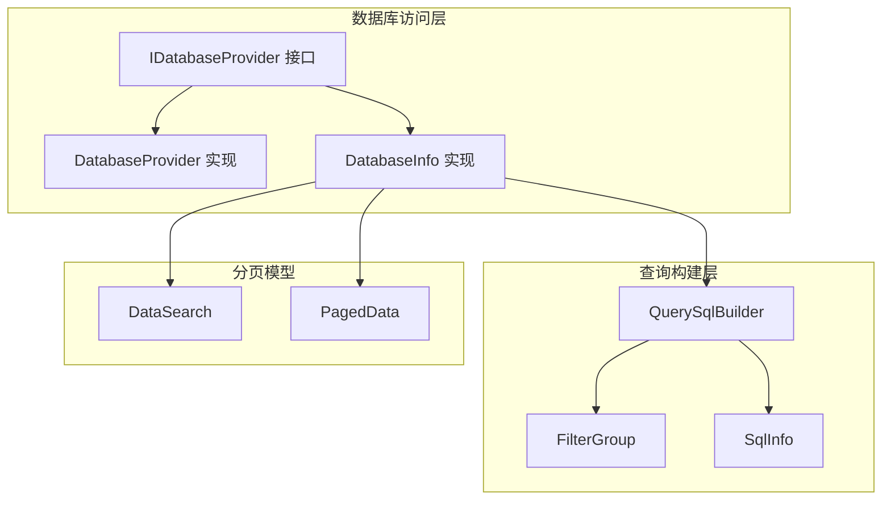
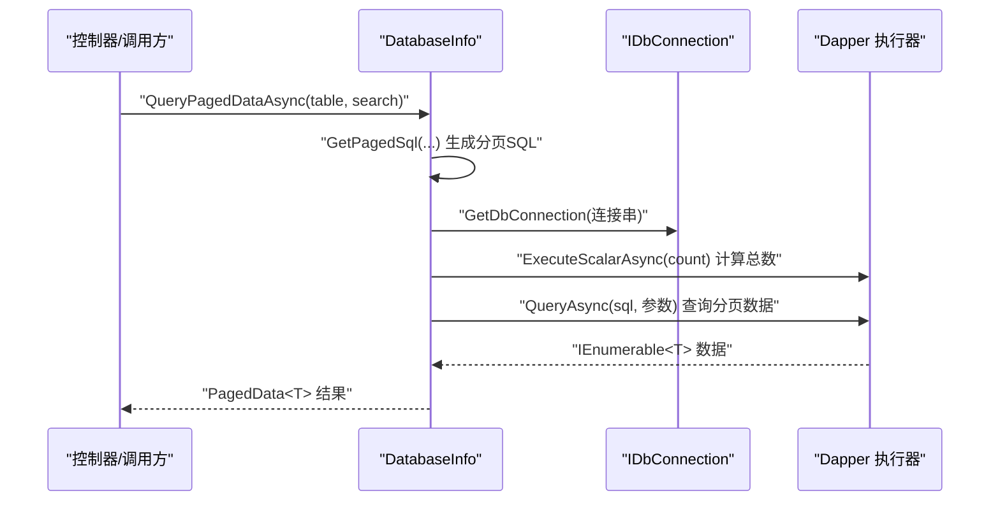
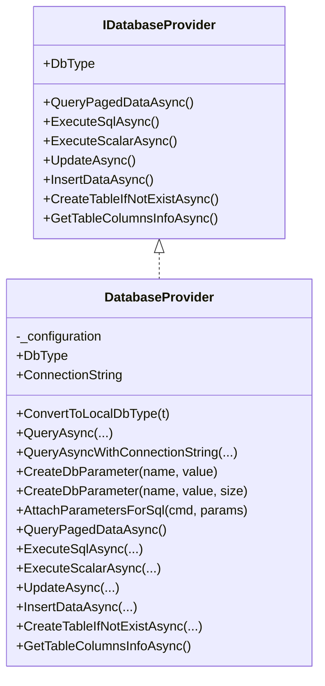
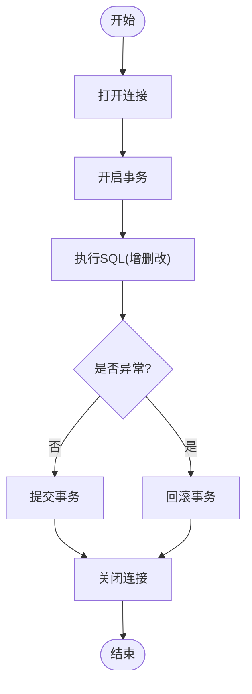
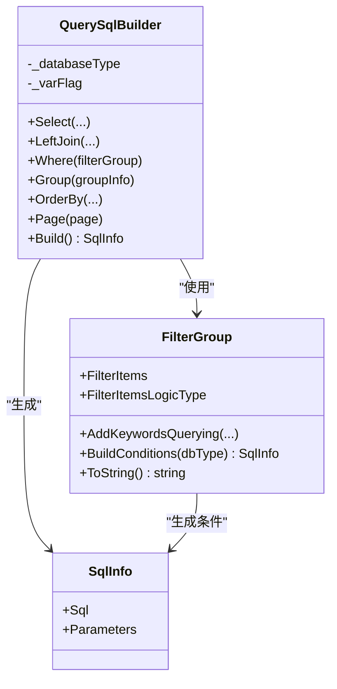
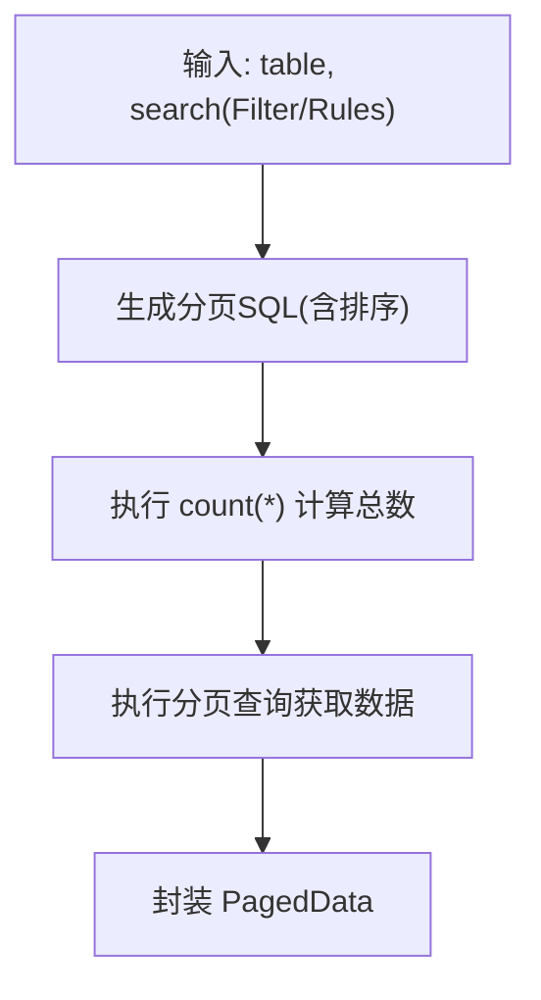
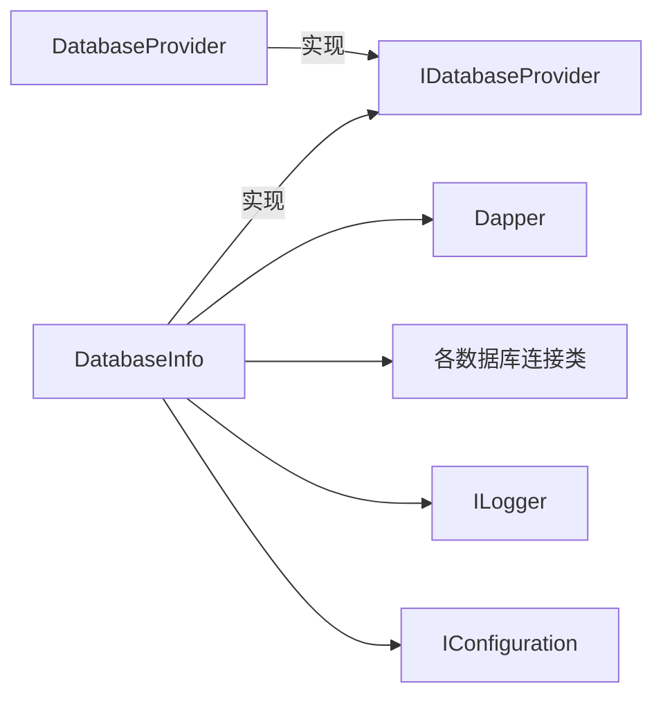

# 数据库优化

<cite>
**本文引用的文件**
- [DatabaseProvider.cs](file://Sylas.RemoteTasks.Database/DatabaseProvider.cs)
- [IDatabaseProvider.cs](file://Sylas.RemoteTasks.Database/IDatabaseProvider.cs)
- [DatabaseInfo.cs](file://Sylas.RemoteTasks.Database/SyncBase/DatabaseInfo.cs)
- [QuerySqlBuilder.cs](file://Sylas.RemoteTasks.Database/SyncBase/QuerySqlBuilder.cs)
- [FilterGroup.cs](file://Sylas.RemoteTasks.Database/SyncBase/FilterGroup.cs)
- [DataSearch.cs](file://Sylas.RemoteTasks.Database/SyncBase/DataSearch.cs)
- [PagedData.cs](file://Sylas.RemoteTasks.Database/SyncBase/PagedData.cs)
- [SqlInfo.cs](file://Sylas.RemoteTasks.Database/SyncBase/SqlInfo.cs)
- [DatabaseHelper.cs](file://Sylas.RemoteTasks.Database/DatabaseHelper.cs)
- [README.md](file://Sylas.RemoteTasks.Database/README.md)
- [QueryConditionBuilderTest.cs](file://Sylas.RemoteTasks.Test/Database/QueryConditionBuilderTest.cs)
</cite>

## 目录
1. [简介](#简介)
2. [项目结构](#项目结构)
3. [核心组件](#核心组件)
4. [架构总览](#架构总览)
5. [详细组件分析](#详细组件分析)
6. [依赖分析](#依赖分析)
7. [性能考量](#性能考量)
8. [故障排查指南](#故障排查指南)
9. [结论](#结论)
10. [附录](#附录)

## 简介
本文件聚焦 Sylas.RemoteTasks 项目中数据库优化相关能力，围绕 DatabaseProvider 与 DatabaseInfo 的实现，系统阐述数据库连接池管理、SQL 查询优化、参数化查询、分页查询性能优化等关键技术，并给出可落地的性能优化案例、最佳实践与监控指标建议。

## 项目结构
数据库相关代码主要位于 Sylas.RemoteTasks.Database 工程，采用“接口 + 实现 + 查询构建器 + 分页模型”的分层设计：
- 接口层：IDatabaseProvider 定义统一数据库操作契约
- 实现层：DatabaseProvider 与 DatabaseInfo 提供具体实现（前者面向旧式 DbProvider，后者基于 Dapper）
- 查询构建层：QuerySqlBuilder、FilterGroup、SqlInfo 组合出跨数据库的参数化 SQL
- 分页模型：DataSearch、PagedData 支持分页查询参数与结果封装
- 辅助工具：DatabaseHelper 提供连接字符串解析、连接对象创建等

图表来源
- [IDatabaseProvider.cs](file://Sylas.RemoteTasks.Database/IDatabaseProvider.cs#L12-L97)
- [DatabaseProvider.cs](file://Sylas.RemoteTasks.Database/DatabaseProvider.cs#L19-L484)
- [DatabaseInfo.cs](file://Sylas.RemoteTasks.Database/SyncBase/DatabaseInfo.cs#L64-L351)
- [QuerySqlBuilder.cs](file://Sylas.RemoteTasks.Database/SyncBase/QuerySqlBuilder.cs#L11-L387)
- [FilterGroup.cs](file://Sylas.RemoteTasks.Database/SyncBase/FilterGroup.cs#L13-L201)
- [SqlInfo.cs](file://Sylas.RemoteTasks.Database/SyncBase/SqlInfo.cs#L8-L37)
- [DataSearch.cs](file://Sylas.RemoteTasks.Database/SyncBase/DataSearch.cs#L8-L48)
- [PagedData.cs](file://Sylas.RemoteTasks.Database/SyncBase/PagedData.cs#L10-L44)

章节来源
- [README.md](file://Sylas.RemoteTasks.Database/README.md#L1-L24)

## 核心组件
- DatabaseProvider：面向 DbProviderFactory 的实现，负责参数化查询、DataSet 填充、连接生命周期管理、字符串参数长度设置以提升执行计划复用
- DatabaseInfo：基于 Dapper 的实现，提供分页查询、事务封装、批量删除、动态更新、连接池友好型 SQL 生成
- QuerySqlBuilder/FilterGroup/SqlInfo：跨数据库的参数化 SQL 构建，自动适配不同数据库的参数占位符
- DataSearch/PagedData：分页查询参数与结果封装，支持多种数据库方言的分页语法

章节来源
- [DatabaseProvider.cs](file://Sylas.RemoteTasks.Database/DatabaseProvider.cs#L19-L484)
- [IDatabaseProvider.cs](file://Sylas.RemoteTasks.Database/IDatabaseProvider.cs#L12-L97)
- [DatabaseInfo.cs](file://Sylas.RemoteTasks.Database/SyncBase/DatabaseInfo.cs#L64-L351)
- [QuerySqlBuilder.cs](file://Sylas.RemoteTasks.Database/SyncBase/QuerySqlBuilder.cs#L11-L387)
- [FilterGroup.cs](file://Sylas.RemoteTasks.Database/SyncBase/FilterGroup.cs#L13-L201)
- [SqlInfo.cs](file://Sylas.RemoteTasks.Database/SyncBase/SqlInfo.cs#L8-L37)
- [DataSearch.cs](file://Sylas.RemoteTasks.Database/SyncBase/DataSearch.cs#L8-L48)
- [PagedData.cs](file://Sylas.RemoteTasks.Database/SyncBase/PagedData.cs#L10-L44)

## 架构总览
下图展示从控制器到数据库访问层的整体流程，包括参数化查询、分页 SQL 生成、事务控制与结果返回。

图表来源
- [DatabaseInfo.cs](file://Sylas.RemoteTasks.Database/SyncBase/DatabaseInfo.cs#L309-L351)
- [DatabaseInfo.cs](file://Sylas.RemoteTasks.Database/SyncBase/DatabaseInfo.cs#L2615-L2682)

## 详细组件分析

### DatabaseProvider：连接管理与参数绑定优化
- 连接管理策略
  - 通过 DbProviderFactory 创建连接，按需打开连接并在使用后关闭，避免长连接占用
  - 字符串参数长度设置：针对字符串参数提供带 size 的参数创建方法，有助于数据库缓存执行计划，减少编译开销
- 参数绑定优化
  - 统一使用 DbParameter 绑定，空值映射为 DBNull.Value，避免空引用导致的异常
  - 支持从字典动态创建参数，便于前端传参场景
- 查询执行计划重用
  - 字符串参数显式设置 Size，提升 SQL 执行计划复用率，降低编译成本
- 分页查询
  - 通过 DatabaseInfo.GetPagedSql 生成跨数据库分页 SQL，先 count 再分页查询，保证一致性

图表来源
- [IDatabaseProvider.cs](file://Sylas.RemoteTasks.Database/IDatabaseProvider.cs#L12-L97)
- [DatabaseProvider.cs](file://Sylas.RemoteTasks.Database/DatabaseProvider.cs#L19-L484)

章节来源
- [DatabaseProvider.cs](file://Sylas.RemoteTasks.Database/DatabaseProvider.cs#L117-L165)
- [DatabaseProvider.cs](file://Sylas.RemoteTasks.Database/DatabaseProvider.cs#L266-L311)
- [DatabaseProvider.cs](file://Sylas.RemoteTasks.Database/DatabaseProvider.cs#L337-L370)

### DatabaseInfo：事务、批量与分页
- 事务封装
  - 执行增删改时开启事务，异常回滚，确保原子性
- 批量删除
  - 将大量 ID 分批（例如每批 500）拼接 IN 子句，减少参数膨胀与网络往返
- 动态更新
  - 自动识别主键字段，生成 SET 子句；对非字符串字段进行类型转换，避免隐式转换带来的性能损耗
- 分页查询
  - 针对不同数据库方言生成分页 SQL（Oracle、MySQL、SqlServer、Sqlite、PostgreSQL），统一返回 PagedData<T>

图表来源
- [DatabaseInfo.cs](file://Sylas.RemoteTasks.Database/SyncBase/DatabaseInfo.cs#L372-L400)
- [DatabaseInfo.cs](file://Sylas.RemoteTasks.Database/SyncBase/DatabaseInfo.cs#L408-L433)

章节来源
- [DatabaseInfo.cs](file://Sylas.RemoteTasks.Database/SyncBase/DatabaseInfo.cs#L372-L400)
- [DatabaseInfo.cs](file://Sylas.RemoteTasks.Database/SyncBase/DatabaseInfo.cs#L408-L433)
- [DatabaseInfo.cs](file://Sylas.RemoteTasks.Database/SyncBase/DatabaseInfo.cs#L667-L713)
- [DatabaseInfo.cs](file://Sylas.RemoteTasks.Database/SyncBase/DatabaseInfo.cs#L497-L504)

### QuerySqlBuilder/FilterGroup/SqlInfo：跨数据库参数化 SQL
- QuerySqlBuilder
  - 支持主表与多表 LEFT JOIN，自动拼接 SELECT 字段、WHERE 条件、GROUP BY/HAVING、ORDER BY 与分页
  - 根据数据库类型选择参数占位符（@ 或 :），自动处理参数去重与命名冲突
- FilterGroup
  - 递归构建复杂条件树，支持 AND/OR 逻辑组合，输出可直接用于 SQL 的条件片段与参数字典
- SqlInfo
  - 封装最终 SQL 与参数字典，便于 Dapper 或其他 ORM 执行

图表来源
- [QuerySqlBuilder.cs](file://Sylas.RemoteTasks.Database/SyncBase/QuerySqlBuilder.cs#L11-L387)
- [FilterGroup.cs](file://Sylas.RemoteTasks.Database/SyncBase/FilterGroup.cs#L13-L201)
- [SqlInfo.cs](file://Sylas.RemoteTasks.Database/SyncBase/SqlInfo.cs#L8-L37)

章节来源
- [QuerySqlBuilder.cs](file://Sylas.RemoteTasks.Database/SyncBase/QuerySqlBuilder.cs#L17-L32)
- [QuerySqlBuilder.cs](file://Sylas.RemoteTasks.Database/SyncBase/QuerySqlBuilder.cs#L277-L386)
- [FilterGroup.cs](file://Sylas.RemoteTasks.Database/SyncBase/FilterGroup.cs#L67-L144)
- [SqlInfo.cs](file://Sylas.RemoteTasks.Database/SyncBase/SqlInfo.cs#L8-L37)

### 分页查询：DataSearch 与 PagedData
- DataSearch
  - 提供默认分页参数（页码、页大小）、过滤条件与排序规则
- PagedData
  - 封装总数、总页数与数据集合，支持泛型结果集

图表来源
- [DataSearch.cs](file://Sylas.RemoteTasks.Database/SyncBase/DataSearch.cs#L8-L48)
- [PagedData.cs](file://Sylas.RemoteTasks.Database/SyncBase/PagedData.cs#L30-L44)
- [DatabaseInfo.cs](file://Sylas.RemoteTasks.Database/SyncBase/DatabaseInfo.cs#L309-L351)

章节来源
- [DataSearch.cs](file://Sylas.RemoteTasks.Database/SyncBase/DataSearch.cs#L8-L48)
- [PagedData.cs](file://Sylas.RemoteTasks.Database/SyncBase/PagedData.cs#L30-L44)
- [DatabaseInfo.cs](file://Sylas.RemoteTasks.Database/SyncBase/DatabaseInfo.cs#L309-L351)

## 依赖分析
- DatabaseProvider 依赖
  - IDatabaseProvider 接口契约
  - System.Data.SqlClient 与 DbProviderFactory，支持参数化与连接生命周期管理
- DatabaseInfo 依赖
  - Dapper（动态 SQL 执行与映射）
  - 多种数据库连接类（Oracle、MySQL、PostgreSQL、SQLite、SqlServer、达梦）
  - 日志与配置注入（ILogger、IConfiguration）

图表来源
- [IDatabaseProvider.cs](file://Sylas.RemoteTasks.Database/IDatabaseProvider.cs#L12-L97)
- [DatabaseProvider.cs](file://Sylas.RemoteTasks.Database/DatabaseProvider.cs#L1-L12)
- [DatabaseInfo.cs](file://Sylas.RemoteTasks.Database/SyncBase/DatabaseInfo.cs#L1-L27)

章节来源
- [DatabaseProvider.cs](file://Sylas.RemoteTasks.Database/DatabaseProvider.cs#L1-L12)
- [DatabaseInfo.cs](file://Sylas.RemoteTasks.Database/SyncBase/DatabaseInfo.cs#L1-L27)

## 性能考量
- 连接池管理
  - DatabaseInfo 使用短连接模式（每次操作创建连接、使用后释放），避免长时间占用连接池资源
  - 若业务并发高，建议在应用层启用连接池配置（最大/最小连接数、连接超时等），并结合 DatabaseHelper 中的连接串模板进行统一管理
- 参数化查询与执行计划复用
  - DatabaseProvider 在字符串参数场景提供带 size 的参数创建方法，有助于数据库缓存执行计划，降低编译成本
  - QuerySqlBuilder/FilterGroup 生成的参数名具备唯一性，避免重复参数导致的计划抖动
- 分页查询性能
  - DatabaseInfo 针对不同数据库方言生成高效分页 SQL（如 OFFSET/FETCH、ROW_NUMBER、LIMIT/OFFSET 等）
  - 建议配合合适的排序字段与索引，避免大偏移分页导致的性能问题
- 批量操作
  - DatabaseInfo 的批量删除采用分批 IN 子句（如每批 500），减少参数数量与网络往返
  - 插入场景建议使用批量插入（GetBatchInsertSql/GetInsertSqlInfosAsync）以减少往返次数
- 动态更新
  - 自动识别主键与类型转换，避免隐式转换引发的全表扫描或索引失效
- 安全与健壮性
  - DatabaseInfo 内置危险 SQL 关键词检测，防止注入风险
  - 异常时自动回滚事务，保障数据一致性

章节来源
- [DatabaseProvider.cs](file://Sylas.RemoteTasks.Database/DatabaseProvider.cs#L285-L311)
- [QuerySqlBuilder.cs](file://Sylas.RemoteTasks.Database/SyncBase/QuerySqlBuilder.cs#L327-L352)
- [DatabaseInfo.cs](file://Sylas.RemoteTasks.Database/SyncBase/DatabaseInfo.cs#L667-L713)
- [DatabaseInfo.cs](file://Sylas.RemoteTasks.Database/SyncBase/DatabaseInfo.cs#L372-L400)
- [DatabaseInfo.cs](file://Sylas.RemoteTasks.Database/README.md#L1-L24)

## 故障排查指南
- 连接字符串问题
  - 使用 DatabaseHelper.GetDbConnectionDetail 解析连接串，定位主机、端口、数据库名等关键信息
- 参数绑定异常
  - 空值统一映射为 DBNull.Value，避免因 null 导致的类型不匹配
- 分页 SQL 不生效
  - 确认排序字段存在索引，避免大偏移分页；必要时引入“基于游标”的分页策略
- 批量删除性能差
  - 检查分批大小（默认 500），适当调整以平衡内存与网络往返
- 测试验证
  - 可参考 QueryConditionBuilderTest 中的分页查询示例，验证不同数据库方言下的行为

章节来源
- [DatabaseHelper.cs](file://Sylas.RemoteTasks.Database/DatabaseHelper.cs#L210-L299)
- [DatabaseProvider.cs](file://Sylas.RemoteTasks.Database/DatabaseProvider.cs#L145-L165)
- [QueryConditionBuilderTest.cs](file://Sylas.RemoteTasks.Test/Database/QueryConditionBuilderTest.cs#L36-L51)

## 结论
本项目在数据库访问层面提供了参数化、跨数据库方言、事务与分页等关键能力。通过字符串参数长度设置、批量分批处理、动态 SQL 构建与短连接模式，有效提升了查询稳定性与执行效率。建议在生产环境中结合连接池配置、索引优化与监控指标进一步完善性能体系。

## 附录
- 最佳实践清单
  - 显式设置字符串参数长度，提升执行计划复用
  - 使用 QuerySqlBuilder/FilterGroup 生成参数化 SQL，避免手写拼接
  - 分页查询优先使用索引字段排序，避免大偏移
  - 批量删除/插入采用分批策略，控制单次参数规模
  - 事务内尽量减少 IO 与锁竞争，异常时及时回滚
- 性能监控指标建议
  - 连接池命中率、平均连接等待时间、平均查询耗时
  - 执行计划缓存命中率、慢查询比例、参数化命中率
  - 分页查询的 count 与分页数据查询耗时对比
  - 事务回滚率与失败重试次数