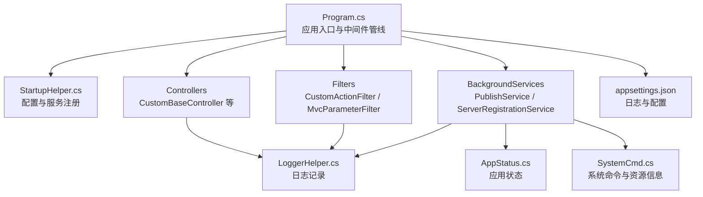
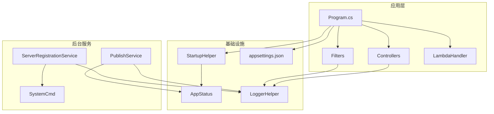
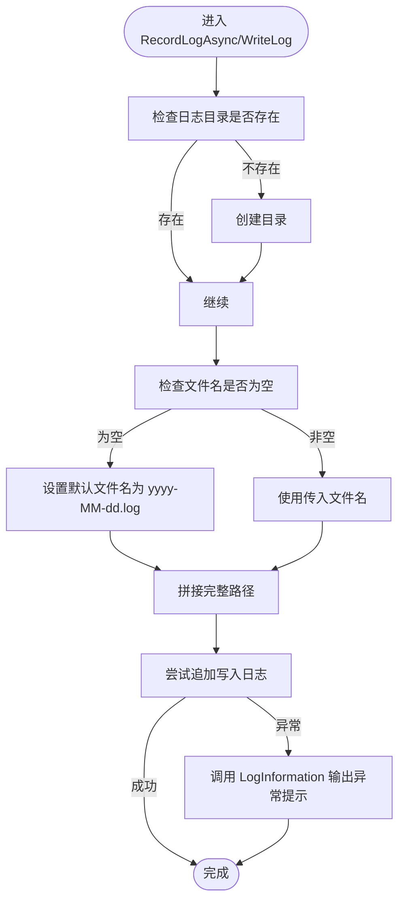
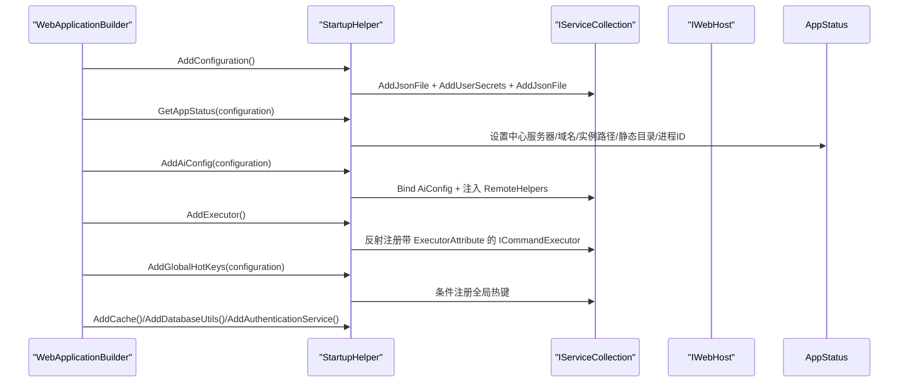
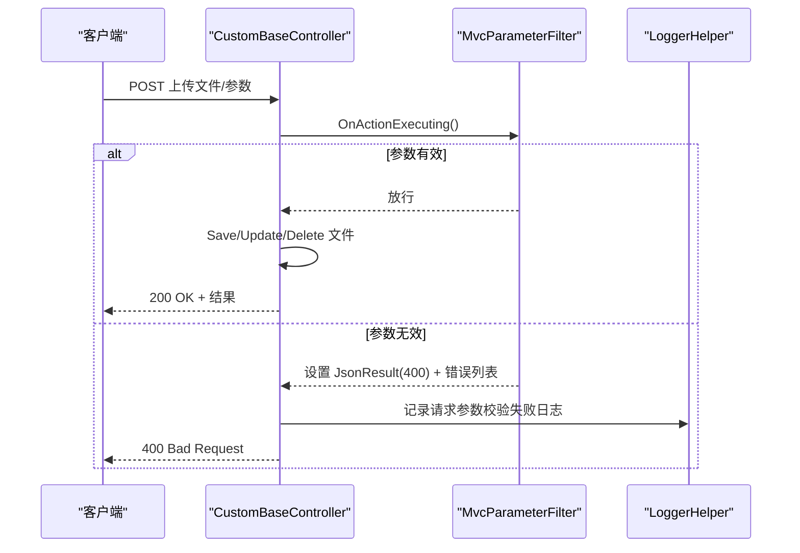
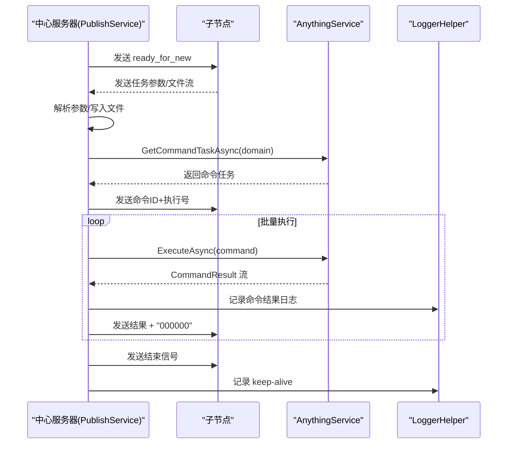
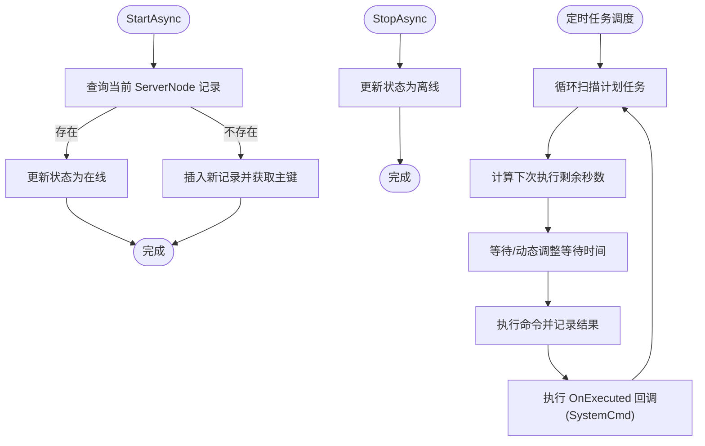
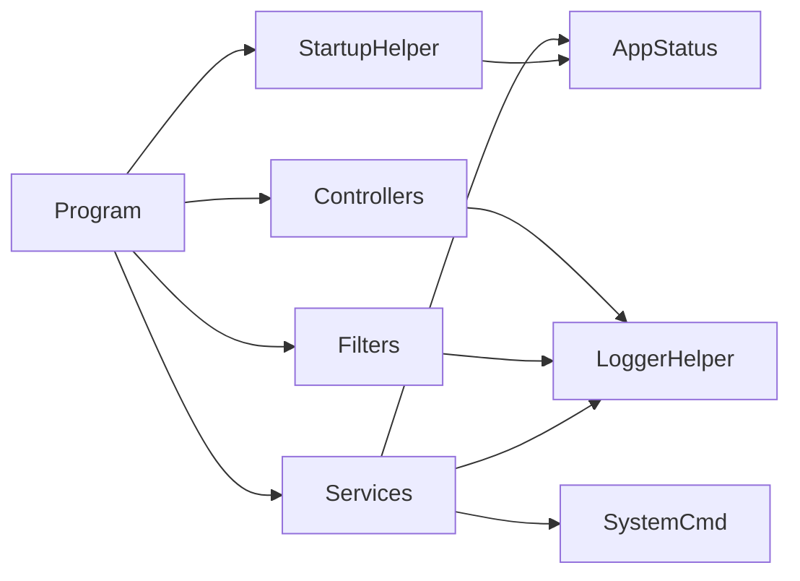

# 监控指标

<cite>
**本文引用的文件**
- [LoggerHelper.cs](file://Sylas.RemoteTasks.Common/LoggerHelper.cs)
- [StartupHelper.cs](file://Sylas.RemoteTasks.App/Helpers/StartupHelper.cs)
- [CustomBaseController.cs](file://Sylas.RemoteTasks.App/Controllers/CustomBaseController.cs)
- [Program.cs](file://Sylas.RemoteTasks.App/Program.cs)
- [CustomActionFilter.cs](file://Sylas.RemoteTasks.App/Infrastructure/CustomActionFilter.cs)
- [MvcParameterFilter.cs](file://Sylas.RemoteTasks.App/Infrastructure/MvcParameterFilter.cs)
- [AppStatus.cs](file://Sylas.RemoteTasks.Common/AppStatus.cs)
- [PublishService.cs](file://Sylas.RemoteTasks.App/BackgroundServices/PublishService.cs)
- [ServerRegistrationService.cs](file://Sylas.RemoteTasks.App/BackgroundServices/ServerRegistrationService.cs)
- [appsettings.json](file://Sylas.RemoteTasks.App/appsettings.json)
- [LambdaHandler.cs](file://Sylas.RemoteTasks.App/ExceptionHandlers/LambdaHandler.cs)
- [SystemCmd.cs](file://Sylas.RemoteTasks.Utils/CommandExecutor/SystemCmd.cs)
</cite>

## 目录
1. [简介](#简介)
2. [项目结构](#项目结构)
3. [核心组件](#核心组件)
4. [架构总览](#架构总览)
5. [详细组件分析](#详细组件分析)
6. [依赖关系分析](#依赖关系分析)
7. [性能考量](#性能考量)
8. [故障排查指南](#故障排查指南)
9. [结论](#结论)
10. [附录](#附录)

## 简介
本文件面向 Sylas.RemoteTasks 的监控指标体系，系统化梳理性能监控指标设计、日志记录策略、健康检查机制，并重点解释以下关键点：
- LoggerHelper 的日志级别与落盘策略
- StartupHelper 的监控初始化与配置注入
- CustomBaseController 的请求参数校验与统一响应
- 关键性能指标（KPI）定义、监控仪表板设计与告警规则
- 性能分析工具使用指南与监控数据可视化方法

## 项目结构
围绕监控与可观测性，项目中涉及的关键模块如下：
- 应用入口与配置：Program.cs、appsettings.json
- 监控辅助：LoggerHelper、AppStatus
- 控制器与过滤器：CustomBaseController、CustomActionFilter、MvcParameterFilter
- 后台服务：PublishService（TCP 心跳与命令通道）、ServerRegistrationService（服务注册与定时任务）
- 异常处理：LambdaHandler
- 工具与系统命令：SystemCmd

**图表来源**
- [Program.cs](file://Sylas.RemoteTasks.App/Program.cs#L1-L122)
- [StartupHelper.cs](file://Sylas.RemoteTasks.App/Helpers/StartupHelper.cs#L1-L275)
- [CustomBaseController.cs](file://Sylas.RemoteTasks.App/Controllers/CustomBaseController.cs#L1-L145)
- [CustomActionFilter.cs](file://Sylas.RemoteTasks.App/Infrastructure/CustomActionFilter.cs#L1-L23)
- [MvcParameterFilter.cs](file://Sylas.RemoteTasks.App/Infrastructure/MvcParameterFilter.cs#L1-L37)
- [PublishService.cs](file://Sylas.RemoteTasks.App/BackgroundServices/PublishService.cs#L1-L645)
- [ServerRegistrationService.cs](file://Sylas.RemoteTasks.App/BackgroundServices/ServerRegistrationService.cs#L1-L493)
- [LoggerHelper.cs](file://Sylas.RemoteTasks.Common/LoggerHelper.cs#L1-L115)
- [AppStatus.cs](file://Sylas.RemoteTasks.Common/AppStatus.cs#L1-L35)
- [appsettings.json](file://Sylas.RemoteTasks.App/appsettings.json#L1-L142)
- [SystemCmd.cs](file://Sylas.RemoteTasks.Utils/CommandExecutor/SystemCmd.cs#L672-L712)

**章节来源**
- [Program.cs](file://Sylas.RemoteTasks.App/Program.cs#L1-L122)
- [appsettings.json](file://Sylas.RemoteTasks.App/appsettings.json#L1-L142)

## 核心组件
- LoggerHelper：提供控制台彩色输出与异步/同步日志落盘能力，支持按日期分文件与异常兜底。
- StartupHelper：集中注册配置、缓存、鉴权、数据库工具、AI 配置、热键等；负责应用状态采集。
- CustomBaseController：封装上传、删除、文件路径生成等通用逻辑，配合过滤器实现参数校验与统一响应。
- PublishService：TCP 服务端/客户端，负责与中心服务器的心跳、命令下发与结果回传，内置心跳日志目录与落盘。
- ServerRegistrationService：服务节点注册/注销、定时任务调度与执行日志记录。
- AppStatus：静态应用状态（中心服务器地址、域名、进程ID、实例路径等），供各组件共享。

**章节来源**
- [LoggerHelper.cs](file://Sylas.RemoteTasks.Common/LoggerHelper.cs#L1-L115)
- [StartupHelper.cs](file://Sylas.RemoteTasks.App/Helpers/StartupHelper.cs#L1-L275)
- [CustomBaseController.cs](file://Sylas.RemoteTasks.App/Controllers/CustomBaseController.cs#L1-L145)
- [PublishService.cs](file://Sylas.RemoteTasks.App/BackgroundServices/PublishService.cs#L1-L645)
- [ServerRegistrationService.cs](file://Sylas.RemoteTasks.App/BackgroundServices/ServerRegistrationService.cs#L1-L493)
- [AppStatus.cs](file://Sylas.RemoteTasks.Common/AppStatus.cs#L1-L35)

## 架构总览
下图展示了监控相关组件在运行时的交互关系与数据流向。

**图表来源**
- [Program.cs](file://Sylas.RemoteTasks.App/Program.cs#L1-L122)
- [StartupHelper.cs](file://Sylas.RemoteTasks.App/Helpers/StartupHelper.cs#L1-L275)
- [LoggerHelper.cs](file://Sylas.RemoteTasks.Common/LoggerHelper.cs#L1-L115)
- [AppStatus.cs](file://Sylas.RemoteTasks.Common/AppStatus.cs#L1-L35)
- [PublishService.cs](file://Sylas.RemoteTasks.App/BackgroundServices/PublishService.cs#L1-L645)
- [ServerRegistrationService.cs](file://Sylas.RemoteTasks.App/BackgroundServices/ServerRegistrationService.cs#L1-L493)
- [appsettings.json](file://Sylas.RemoteTasks.App/appsettings.json#L1-L142)
- [LambdaHandler.cs](file://Sylas.RemoteTasks.App/ExceptionHandlers/LambdaHandler.cs#L1-L27)
- [SystemCmd.cs](file://Sylas.RemoteTasks.Utils/CommandExecutor/SystemCmd.cs#L672-L712)

## 详细组件分析

### LoggerHelper 日志记录策略
- 日志级别与输出
  - 控制台输出：Info、Error、Critical 采用不同颜色提示，便于终端快速识别。
  - 文件落盘：支持自定义目录与文件名，默认按日期分文件；若未提供目录将自动创建 Logs/Others 或 Logs/<子目录>。
- 异常兜底：文件写入异常时，通过 Info 输出“心跳日志异常”提示，避免影响业务流程。
- 心跳日志：发布服务与命令通道使用该 Helper 记录 keep-alive 与命令结果，便于定位链路中断与延迟。

**图表来源**
- [LoggerHelper.cs](file://Sylas.RemoteTasks.Common/LoggerHelper.cs#L48-L112)

**章节来源**
- [LoggerHelper.cs](file://Sylas.RemoteTasks.Common/LoggerHelper.cs#L1-L115)
- [PublishService.cs](file://Sylas.RemoteTasks.App/BackgroundServices/PublishService.cs#L398-L425)

### StartupHelper 监控初始化与配置注入
- 配置加载：TaskConfig.log.json、用户机密、TaskImportantSettings.json，支持热更新。
- 缓存与会话：分布式内存缓存与 Session 配置。
- 数据库工具：DatabaseInfo（Scoped）、DatabaseInfoFactory（Singleton）、IDatabaseProvider（Scoped）。
- 应用状态采集：中心服务器地址、是否中心节点、中心 Web 地址、域名、实例路径、静态目录、进程ID。
- AI 配置：AiConfig 绑定与注入，供远端助手使用。
- 鉴权：IdentityServer 配置（Authority、ClientId、ClientSecret、ApiName、ApiSecret、Scopes 等）。
- 全局热键：仅 Windows 平台，从配置读取组合键并注册。

**图表来源**
- [StartupHelper.cs](file://Sylas.RemoteTasks.App/Helpers/StartupHelper.cs#L20-L121)
- [AppStatus.cs](file://Sylas.RemoteTasks.Common/AppStatus.cs#L1-L35)

**章节来源**
- [StartupHelper.cs](file://Sylas.RemoteTasks.App/Helpers/StartupHelper.cs#L1-L275)
- [Program.cs](file://Sylas.RemoteTasks.App/Program.cs#L19-L87)
- [appsettings.json](file://Sylas.RemoteTasks.App/appsettings.json#L109-L121)

### CustomBaseController 请求跟踪与参数校验
- 统一文件上传/删除/路径生成：封装 SaveUploadedFilesAsync、DeleteStaticFiles、HandleUploadedFilesAsync、GetFilePathInfo。
- 参数校验：通过 ServiceFilter<MvcParameterFilter> 在 Action 执行前拦截 ModelState，对无效参数返回包含错误明细的 JSON 响应与 400 状态码。
- 认证策略：[Authorize(Policy = AdministrationPolicy)]，结合 Authorization 策略与 Claims 判定。

**图表来源**
- [CustomBaseController.cs](file://Sylas.RemoteTasks.App/Controllers/CustomBaseController.cs#L16-L142)
- [MvcParameterFilter.cs](file://Sylas.RemoteTasks.App/Infrastructure/MvcParameterFilter.cs#L14-L34)
- [CustomActionFilter.cs](file://Sylas.RemoteTasks.App/Infrastructure/CustomActionFilter.cs#L9-L20)

**章节来源**
- [CustomBaseController.cs](file://Sylas.RemoteTasks.App/Controllers/CustomBaseController.cs#L1-L145)
- [MvcParameterFilter.cs](file://Sylas.RemoteTasks.App/Infrastructure/MvcParameterFilter.cs#L1-L37)
- [CustomActionFilter.cs](file://Sylas.RemoteTasks.App/Infrastructure/CustomActionFilter.cs#L1-L23)

### PublishService 心跳与命令通道监控
- TCP 服务端：监听本地端口，接受子节点连接，记录连接数、线程号与任务进度。
- 心跳机制：定期发送 keep-alive，记录心跳日志目录（Logs/Heartbeats），检测超时自动重连。
- 命令下发与回传：从 AnythingService 获取命令任务，执行后批量回传结果，结束信号“000000”分隔多条结果。
- 异常处理：捕获 Socket/序列化/IO 异常，记录错误并触发重连。

**图表来源**
- [PublishService.cs](file://Sylas.RemoteTasks.App/BackgroundServices/PublishService.cs#L88-L434)
- [LoggerHelper.cs](file://Sylas.RemoteTasks.Common/LoggerHelper.cs#L48-L112)

**章节来源**
- [PublishService.cs](file://Sylas.RemoteTasks.App/BackgroundServices/PublishService.cs#L1-L645)

### ServerRegistrationService 服务注册与定时任务监控
- 启动注册：查询/插入 ServerNodes 表，更新状态为在线。
- 停止注销：更新状态为离线。
- 定时任务：解析 Cron 表达式，按剩余秒数动态调整等待时间；执行前记录“正在检查”，执行后记录耗时与结果；支持执行完成后回调系统命令（SystemCmd）。

**图表来源**
- [ServerRegistrationService.cs](file://Sylas.RemoteTasks.App/BackgroundServices/ServerRegistrationService.cs#L55-L110)
- [ServerRegistrationService.cs](file://Sylas.RemoteTasks.App/BackgroundServices/ServerRegistrationService.cs#L187-L341)
- [SystemCmd.cs](file://Sylas.RemoteTasks.Utils/CommandExecutor/SystemCmd.cs#L672-L712)

**章节来源**
- [ServerRegistrationService.cs](file://Sylas.RemoteTasks.App/BackgroundServices/ServerRegistrationService.cs#L1-L493)

### 异常处理与统一响应
- LambdaHandler：统一异常处理，返回 JSON 包裹的 RequestResult，状态码固定为 200（业务错误语义由 Code/Message 表达）。
- 控制器参数校验：MvcParameterFilter 将无效模型转换为 400 + 错误列表。

**章节来源**
- [LambdaHandler.cs](file://Sylas.RemoteTasks.App/ExceptionHandlers/LambdaHandler.cs#L1-L27)
- [MvcParameterFilter.cs](file://Sylas.RemoteTasks.App/Infrastructure/MvcParameterFilter.cs#L14-L34)

## 依赖关系分析
- 组件耦合
  - LoggerHelper 被 PublishService、ServerRegistrationService、CustomBaseController、CustomActionFilter 等广泛使用，形成统一日志出口。
  - AppStatus 作为静态状态载体，被 PublishService 与 StartupHelper 使用，便于跨模块共享运行时信息。
  - StartupHelper 负责配置注入与服务注册，Program.cs 作为唯一入口串联所有初始化逻辑。
- 外部依赖
  - Kestrel、SignalR、IdentityServer、数据库提供者、系统命令执行器（SystemCmd）等。

**图表来源**
- [Program.cs](file://Sylas.RemoteTasks.App/Program.cs#L1-L122)
- [StartupHelper.cs](file://Sylas.RemoteTasks.App/Helpers/StartupHelper.cs#L1-L275)
- [LoggerHelper.cs](file://Sylas.RemoteTasks.Common/LoggerHelper.cs#L1-L115)
- [AppStatus.cs](file://Sylas.RemoteTasks.Common/AppStatus.cs#L1-L35)
- [SystemCmd.cs](file://Sylas.RemoteTasks.Utils/CommandExecutor/SystemCmd.cs#L672-L712)

**章节来源**
- [Program.cs](file://Sylas.RemoteTasks.App/Program.cs#L1-L122)
- [StartupHelper.cs](file://Sylas.RemoteTasks.App/Helpers/StartupHelper.cs#L1-L275)

## 性能考量
- 日志 I/O
  - LoggerHelper 的文件写入为异步 AppendAllTextAsync，建议在高并发场景下评估磁盘吞吐与日志轮转策略，避免阻塞主线程。
- 心跳与重连
  - PublishService 的心跳频率与超时阈值（2×心跳周期）可调，建议结合网络质量与任务延迟目标进行优化。
- 定时任务
  - ServerRegistrationService 的 Cron 解析与等待策略已具备动态等待与最小等待时间控制，建议对高频任务设置合理的等待步长与并发上限。
- 资源监控
  - SystemCmd 提供 CPU、内存、磁盘、应用运行时等信息，可用于构建资源使用趋势图与告警阈值。

[本节为通用指导，不直接分析具体文件]

## 故障排查指南
- 控制台日志级别
  - appsettings.json 中 Logging.Default 设为 Debug，Microsoft.AspNetCore 设为 Warning，便于区分框架与应用日志严重程度。
- 心跳异常
  - 若长时间未见 Logs/Heartbeats 下的 keep-alive 日志，检查 PublishService 的心跳发送/接收线程是否被取消，或网络连接是否断开。
- 参数校验失败
  - 控制器参数校验失败会返回 400 与错误列表，建议在前端打印并引导用户修正。
- 异常统一处理
  - 任何未捕获异常将通过 LambdaHandler 返回 JSON 包裹的错误信息，便于前端统一提示。

**章节来源**
- [appsettings.json](file://Sylas.RemoteTasks.App/appsettings.json#L2-L14)
- [LambdaHandler.cs](file://Sylas.RemoteTasks.App/ExceptionHandlers/LambdaHandler.cs#L1-L27)
- [MvcParameterFilter.cs](file://Sylas.RemoteTasks.App/Infrastructure/MvcParameterFilter.cs#L14-L34)
- [PublishService.cs](file://Sylas.RemoteTasks.App/BackgroundServices/PublishService.cs#L482-L542)

## 结论
本监控体系以 LoggerHelper 为核心日志出口，结合 StartupHelper 的配置注入与应用状态采集、PublishService 的心跳与命令通道、ServerRegistrationService 的服务注册与定时任务，形成了覆盖请求参数校验、后台任务执行、网络通信与系统资源的全链路可观测性。建议在此基础上补充指标埋点、Prometheus/Grafana 可视化与告警规则，以实现更完善的 SRE 能力。

[本节为总结性内容，不直接分析具体文件]

## 附录

### 关键性能指标（KPI）定义
- 请求成功率：HTTP 2xx / (2xx + 4xx + 5xx)
- 请求延迟（P50/P95/P99）：从进入控制器到返回响应的总耗时
- 参数校验失败率：参数校验失败次数 / 总请求次数
- 心跳存活率：心跳日志出现次数 / 预期心跳次数
- 命令执行成功率：命令执行成功次数 / 命令下发次数
- 命令执行延迟：命令下发到收到结束信号的总耗时
- 服务注册/注销时延：注册/注销数据库更新耗时
- 资源使用率：CPU、内存、磁盘 IO、网络带宽

[本节为概念性内容，不直接分析具体文件]

### 监控仪表板设计建议
- 实时面板
  - 请求速率与成功率曲线
  - 参数校验失败趋势
  - 心跳存活率与断连次数
- 后台任务面板
  - 定时任务执行次数与耗时分布
  - 命令执行批次与延迟
- 系统资源面板
  - CPU/内存/磁盘使用率与 I/O
  - 网络连接数与异常断开次数

[本节为概念性内容，不直接分析具体文件]

### 告警规则配置建议
- 请求失败率超过阈值持续 N 分钟
- 参数校验失败率异常升高
- 心跳存活率低于阈值
- 命令执行超时比例上升
- 服务注册/注销失败
- 系统资源使用率超过阈值

[本节为概念性内容，不直接分析具体文件]

### 性能分析工具使用指南
- dotnet-trace/dotnet-counters：采集 CPU、GC、线程、网络等指标，定位热点方法与 GC 抖动。
- PerfView/Windows Performance Recorder：分析 Windows 平台的 CPU/IO/堆栈。
- dotnet flamegraph：生成火焰图，识别热点调用链。
- Kestrel 与 SignalR 日志：结合 appsettings.json 的 Logging 配置，定位慢请求与异常。

[本节为通用指导，不直接分析具体文件]

### 监控数据可视化展示方法
- Grafana + Prometheus：采集 .NET 指标与自定义日志，构建仪表板与告警。
- Azure Monitor/CloudWatch：结合云平台日志与指标，统一聚合。
- ELK/Elasticsearch：对日志进行结构化与检索，支持实时告警。

[本节为通用指导，不直接分析具体文件]