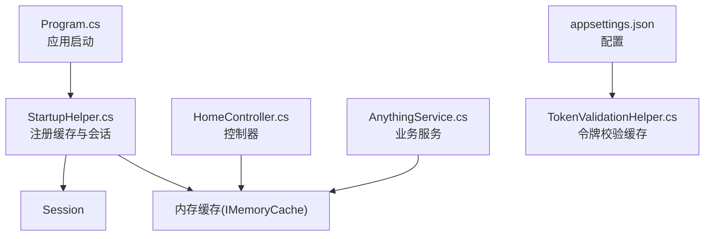
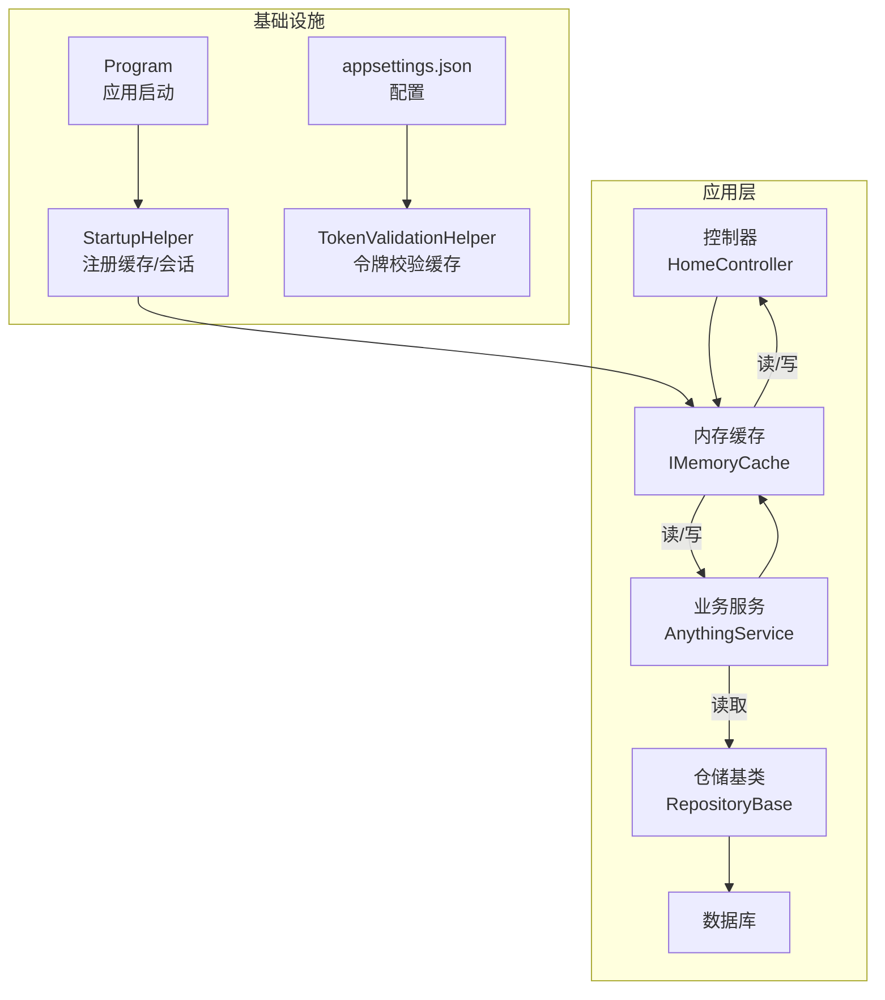
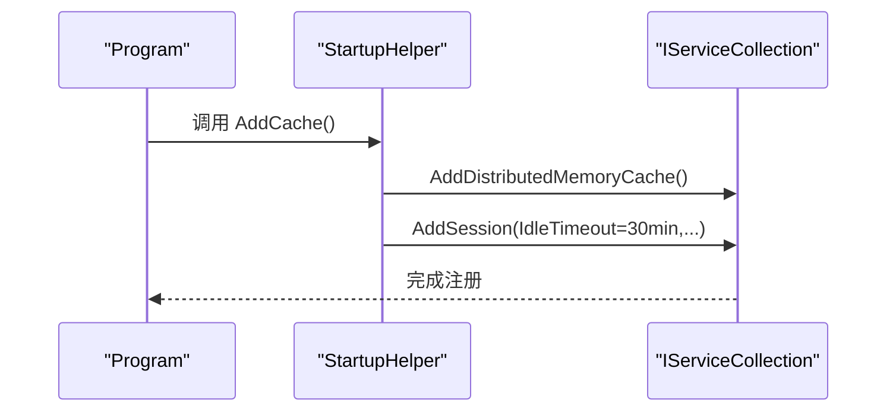
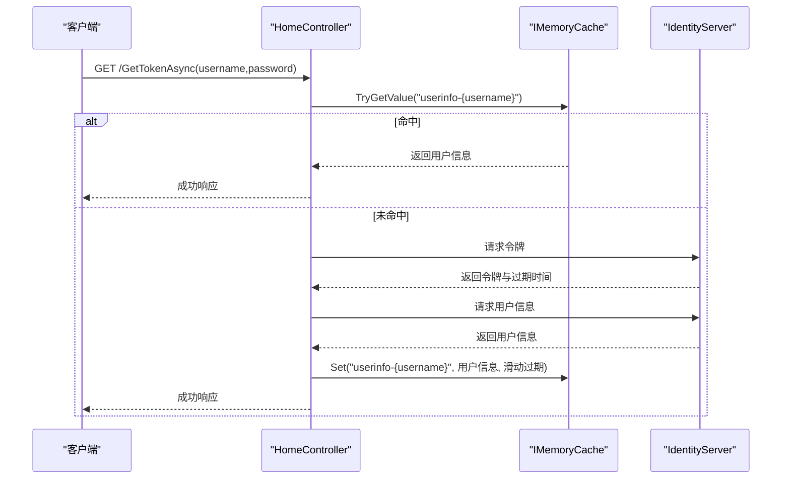
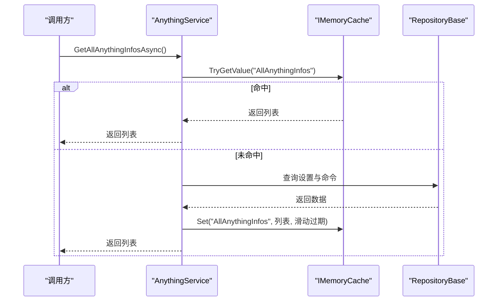
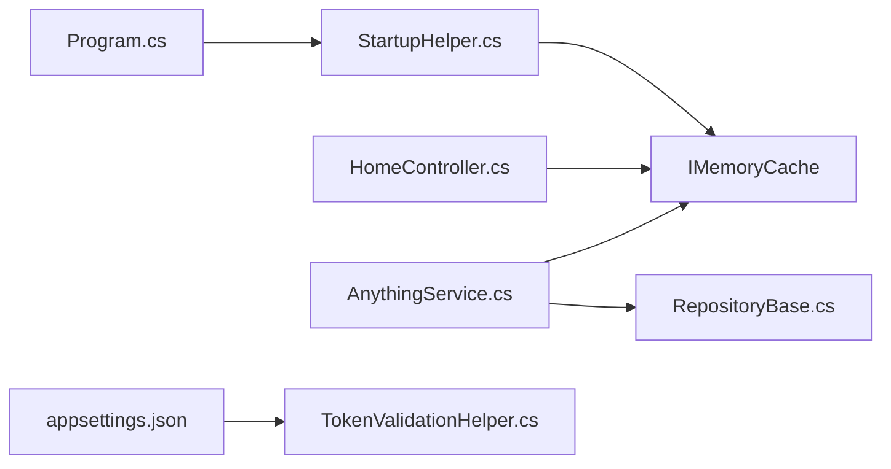

# 缓存策略

<cite>
**本文引用的文件**
- [Program.cs](file://Sylas.RemoteTasks.App/Program.cs)
- [StartupHelper.cs](file://Sylas.RemoteTasks.App/Helpers/StartupHelper.cs)
- [RepositoryBase.cs](file://Sylas.RemoteTasks.App/Infrastructure/RepositoryBase.cs)
- [HomeController.cs](file://Sylas.RemoteTasks.App/Controllers/HomeController.cs)
- [AnythingService.cs](file://Sylas.RemoteTasks.App/RemoteHostModule/Anything/AnythingService.cs)
- [appsettings.json](file://Sylas.RemoteTasks.App/appsettings.json)
- [TokenValidationHelper.cs](file://Sylas.RemoteTasks.App/Helpers/TokenValidationHelper.cs)
</cite>

## 目录
1. [简介](#简介)
2. [项目结构](#项目结构)
3. [核心组件](#核心组件)
4. [架构总览](#架构总览)
5. [详细组件分析](#详细组件分析)
6. [依赖关系分析](#依赖关系分析)
7. [性能考量](#性能考量)
8. [故障排查指南](#故障排查指南)
9. [结论](#结论)
10. [附录](#附录)

## 简介
本文件系统化梳理 Sylas.RemoteTasks 的缓存策略，覆盖内存缓存与分布式缓存的配置与使用、缓存初始化流程、缓存模式在仓储层的实践、缓存键设计原则、缓存失效策略、缓存穿透防护、性能监控与调优建议，以及缓存与数据库一致性保障方案。内容面向不同技术背景读者，既提供高层概览也给出代码级定位与参考路径。

## 项目结构
围绕缓存的关键位置如下：
- 启动阶段注册缓存与会话：Program.cs 调用 StartupHelper.AddCache()；StartupHelper 中完成内存缓存与 Session 的注册。
- 控制器层使用内存缓存：HomeController 中对用户信息进行滑动过期缓存。
- 业务模块使用内存缓存：AnythingService 中对聚合数据进行缓存与更新。
- 配置文件：appsettings.json 提供 IdentityServer 相关缓存配置项，TokenValidationHelper 使用这些配置影响令牌校验缓存行为。

图表来源
- [Program.cs](file://Sylas.RemoteTasks.App/Program.cs#L32-L33)
- [StartupHelper.cs](file://Sylas.RemoteTasks.App/Helpers/StartupHelper.cs#L28-L37)
- [HomeController.cs](file://Sylas.RemoteTasks.App/Controllers/HomeController.cs#L930-L975)
- [AnythingService.cs](file://Sylas.RemoteTasks.App/RemoteHostModule/Anything/AnythingService.cs#L255-L277)
- [appsettings.json](file://Sylas.RemoteTasks.App/appsettings.json#L109-L121)
- [TokenValidationHelper.cs](file://Sylas.RemoteTasks.App/Helpers/TokenValidationHelper.cs#L373-L385)

章节来源
- [Program.cs](file://Sylas.RemoteTasks.App/Program.cs#L32-L33)
- [StartupHelper.cs](file://Sylas.RemoteTasks.App/Helpers/StartupHelper.cs#L28-L37)

## 核心组件
- 内存缓存与会话注册：在 StartupHelper.AddCache 中注册内存缓存与 Session，Session 默认空闲超时 30 分钟。
- 控制器层缓存：HomeController.GetTokenAsync 使用 IMemoryCache 对用户信息进行缓存，键采用“userinfo-{username}”，过期时间由令牌有效期决定。
- 业务层缓存：AnythingService 对聚合数据使用固定键缓存，配合写操作主动失效或更新缓存。
- 仓储层缓存：RepositoryBase 未直接实现缓存逻辑，但可作为缓存数据的来源，结合业务层缓存策略使用。
- 配置驱动的令牌校验缓存：appsettings.json 中的 IdentityServerConfiguration.EnableCaching、CacheDuration 等项，由 TokenValidationHelper 读取并应用到令牌校验流程的缓存行为。

章节来源
- [StartupHelper.cs](file://Sylas.RemoteTasks.App/Helpers/StartupHelper.cs#L28-L37)
- [HomeController.cs](file://Sylas.RemoteTasks.App/Controllers/HomeController.cs#L930-L975)
- [AnythingService.cs](file://Sylas.RemoteTasks.App/RemoteHostModule/Anything/AnythingService.cs#L248-L277)
- [RepositoryBase.cs](file://Sylas.RemoteTasks.App/Infrastructure/RepositoryBase.cs#L1-L233)
- [appsettings.json](file://Sylas.RemoteTasks.App/appsettings.json#L109-L121)
- [TokenValidationHelper.cs](file://Sylas.RemoteTasks.App/Helpers/TokenValidationHelper.cs#L373-L385)

## 架构总览
下图展示缓存在系统中的角色与交互：

图表来源
- [Program.cs](file://Sylas.RemoteTasks.App/Program.cs#L32-L33)
- [StartupHelper.cs](file://Sylas.RemoteTasks.App/Helpers/StartupHelper.cs#L28-L37)
- [HomeController.cs](file://Sylas.RemoteTasks.App/Controllers/HomeController.cs#L930-L975)
- [AnythingService.cs](file://Sylas.RemoteTasks.App/RemoteHostModule/Anything/AnythingService.cs#L255-L277)
- [RepositoryBase.cs](file://Sylas.RemoteTasks.App/Infrastructure/RepositoryBase.cs#L1-L233)
- [appsettings.json](file://Sylas.RemoteTasks.App/appsettings.json#L109-L121)
- [TokenValidationHelper.cs](file://Sylas.RemoteTasks.App/Helpers/TokenValidationHelper.cs#L373-L385)

## 详细组件分析

### 启动阶段缓存初始化（StartupHelper）
- 注册内存缓存：AddDistributedMemoryCache 用于提供分布式内存缓存能力（在单机场景下即为内存缓存）。
- 注册 Session：配置空闲超时、Cookie 行为等。
- 该初始化在 Program 中由 builder.Services.AddCache() 触发。

图表来源
- [Program.cs](file://Sylas.RemoteTasks.App/Program.cs#L32-L33)
- [StartupHelper.cs](file://Sylas.RemoteTasks.App/Helpers/StartupHelper.cs#L28-L37)

章节来源
- [Program.cs](file://Sylas.RemoteTasks.App/Program.cs#L32-L33)
- [StartupHelper.cs](file://Sylas.RemoteTasks.App/Helpers/StartupHelper.cs#L28-L37)

### 控制器层缓存使用（HomeController）
- 场景：按用户名缓存用户信息，避免重复调用外部身份服务获取用户信息。
- 键设计：以“userinfo-{username}”作为缓存键。
- 失效策略：使用滑动过期，过期时间与令牌有效期一致。
- 流程：先尝试从缓存读取，若缺失则调用身份服务获取令牌与用户信息，填充缓存后返回。

图表来源
- [HomeController.cs](file://Sylas.RemoteTasks.App/Controllers/HomeController.cs#L930-L975)

章节来源
- [HomeController.cs](file://Sylas.RemoteTasks.App/Controllers/HomeController.cs#L930-L975)

### 业务层缓存使用（AnythingService）
- 场景：缓存聚合后的 AnythingInfo 列表，减少多次查询与组装成本。
- 键设计：固定键“AllAnythingInfos”。
- 失效策略：在命令增删改时，针对同一 AnythingId 的缓存键进行读取与更新，确保缓存与数据库一致。
- 流程：优先从缓存读取；若未命中，则从数据库加载并写入缓存；在写操作成功后，主动更新或移除相关缓存条目。

图表来源
- [AnythingService.cs](file://Sylas.RemoteTasks.App/RemoteHostModule/Anything/AnythingService.cs#L255-L277)

章节来源
- [AnythingService.cs](file://Sylas.RemoteTasks.App/RemoteHostModule/Anything/AnythingService.cs#L120-L143)
- [AnythingService.cs](file://Sylas.RemoteTasks.App/RemoteHostModule/Anything/AnythingService.cs#L174-L197)
- [AnythingService.cs](file://Sylas.RemoteTasks.App/RemoteHostModule/Anything/AnythingService.cs#L214-L246)
- [AnythingService.cs](file://Sylas.RemoteTasks.App/RemoteHostModule/Anything/AnythingService.cs#L255-L277)

### 仓储层缓存模式（RepositoryBase）
- 当前实现：RepositoryBase 主要负责通用的 CRUD 与分页查询，未直接实现缓存逻辑。
- 实践建议：可在仓储层增加“带缓存的查询”方法，结合业务层缓存策略，统一缓存键命名与失效规则，降低重复实现与分散风险。

章节来源
- [RepositoryBase.cs](file://Sylas.RemoteTasks.App/Infrastructure/RepositoryBase.cs#L1-L233)

### 缓存键设计原则
- 唯一性：键能唯一标识目标数据，避免冲突。
- 可读性：键具备上下文信息（如“userinfo-{username}”），便于运维与排障。
- 命名规范：统一前缀/分隔符，避免大小写与特殊字符带来的问题。
- 作用域清晰：区分用户级、全局级、实体级缓存键，避免跨作用域污染。

章节来源
- [HomeController.cs](file://Sylas.RemoteTasks.App/Controllers/HomeController.cs#L930-L975)
- [AnythingService.cs](file://Sylas.RemoteTasks.App/RemoteHostModule/Anything/AnythingService.cs#L248-L277)

### 缓存失效策略
- 滑动过期：基于令牌有效期设置滑动过期，提升访问连续性。
- 主动失效：在写操作成功后，读取并更新/删除相关缓存条目，确保缓存与数据库一致。
- 固定键策略：对聚合数据使用固定键，集中管理过期与刷新。

章节来源
- [HomeController.cs](file://Sylas.RemoteTasks.App/Controllers/HomeController.cs#L967-L969)
- [AnythingService.cs](file://Sylas.RemoteTasks.App/RemoteHostModule/Anything/AnythingService.cs#L120-L143)
- [AnythingService.cs](file://Sylas.RemoteTasks.App/RemoteHostModule/Anything/AnythingService.cs#L174-L197)
- [AnythingService.cs](file://Sylas.RemoteTasks.App/RemoteHostModule/Anything/AnythingService.cs#L214-L246)
- [AnythingService.cs](file://Sylas.RemoteTasks.App/RemoteHostModule/Anything/AnythingService.cs#L255-L277)

### 缓存穿透防护
- 空值缓存：当查询结果为空时，仍可设置短时过期的空值缓存，避免对底层资源的反复无效请求。
- 参数校验：严格校验查询参数，防止异常输入导致的缓存污染。
- 限流与熔断：在高并发场景下，结合限流与熔断策略保护下游数据库。

（本节为通用实践建议）

### 分布式缓存配置与使用
- 当前实现：使用 AddDistributedMemoryCache 注册分布式内存缓存（单机即内存缓存）。
- 扩展建议：在多实例部署时，可替换为 Redis 或其他分布式缓存实现，以共享缓存状态。

章节来源
- [StartupHelper.cs](file://Sylas.RemoteTasks.App/Helpers/StartupHelper.cs#L30)

### 令牌校验缓存（配置驱动）
- 配置项：EnableCaching、CacheDuration、CacheKeyPrefix 等。
- 应用：TokenValidationHelper 读取配置，控制令牌校验过程中的缓存行为，降低外部服务压力。

章节来源
- [appsettings.json](file://Sylas.RemoteTasks.App/appsettings.json#L109-L121)
- [TokenValidationHelper.cs](file://Sylas.RemoteTasks.App/Helpers/TokenValidationHelper.cs#L373-L385)
- [TokenValidationHelper.cs](file://Sylas.RemoteTasks.App/Helpers/TokenValidationHelper.cs#L545-L546)

## 依赖关系分析
- Program 依赖 StartupHelper 完成缓存与会话注册。
- 控制器与业务服务依赖 IMemoryCache 接口。
- 业务服务依赖仓储层进行数据读取。
- 配置文件与 TokenValidationHelper 影响令牌校验缓存行为。

图表来源
- [Program.cs](file://Sylas.RemoteTasks.App/Program.cs#L32-L33)
- [StartupHelper.cs](file://Sylas.RemoteTasks.App/Helpers/StartupHelper.cs#L28-L37)
- [HomeController.cs](file://Sylas.RemoteTasks.App/Controllers/HomeController.cs#L930-L975)
- [AnythingService.cs](file://Sylas.RemoteTasks.App/RemoteHostModule/Anything/AnythingService.cs#L255-L277)
- [RepositoryBase.cs](file://Sylas.RemoteTasks.App/Infrastructure/RepositoryBase.cs#L1-L233)
- [appsettings.json](file://Sylas.RemoteTasks.App/appsettings.json#L109-L121)
- [TokenValidationHelper.cs](file://Sylas.RemoteTasks.App/Helpers/TokenValidationHelper.cs#L373-L385)

章节来源
- [Program.cs](file://Sylas.RemoteTasks.App/Program.cs#L32-L33)
- [StartupHelper.cs](file://Sylas.RemoteTasks.App/Helpers/StartupHelper.cs#L28-L37)
- [HomeController.cs](file://Sylas.RemoteTasks.App/Controllers/HomeController.cs#L930-L975)
- [AnythingService.cs](file://Sylas.RemoteTasks.App/RemoteHostModule/Anything/AnythingService.cs#L255-L277)
- [RepositoryBase.cs](file://Sylas.RemoteTasks.App/Infrastructure/RepositoryBase.cs#L1-L233)
- [appsettings.json](file://Sylas.RemoteTasks.App/appsettings.json#L109-L121)
- [TokenValidationHelper.cs](file://Sylas.RemoteTasks.App/Helpers/TokenValidationHelper.cs#L373-L385)

## 性能考量
- 缓存命中率：通过合理的键设计与过期策略提升命中率，减少数据库与外部服务压力。
- 过期策略选择：对热点数据使用滑动过期，对长尾数据使用绝对过期，平衡新鲜度与资源消耗。
- 缓存粒度：优先缓存聚合结果，避免频繁重复查询与拼装。
- 监控指标：建议引入缓存命中率、平均响应时间、缓存条目数量等指标，结合日志与性能计数器进行观测。
- 调优建议：根据业务峰值与访问模式调整过期时间、缓存容量与淘汰策略；在多实例部署时启用分布式缓存。

（本节为通用指导）

## 故障排查指南
- 缓存未生效
  - 检查是否正确注册内存缓存与 Session。
  - 确认控制器/服务中正确注入并使用 IMemoryCache。
- 缓存穿透
  - 对空结果设置短时缓存；校验输入参数；必要时增加限流。
- 缓存不一致
  - 在写操作成功后主动更新/删除相关缓存键；确保缓存键命名与失效范围明确。
- 令牌校验缓存异常
  - 检查 appsettings.json 中的 EnableCaching、CacheDuration、CacheKeyPrefix 设置；确认 TokenValidationHelper 已正确读取并应用。

章节来源
- [StartupHelper.cs](file://Sylas.RemoteTasks.App/Helpers/StartupHelper.cs#L28-L37)
- [HomeController.cs](file://Sylas.RemoteTasks.App/Controllers/HomeController.cs#L930-L975)
- [AnythingService.cs](file://Sylas.RemoteTasks.App/RemoteHostModule/Anything/AnythingService.cs#L120-L143)
- [AnythingService.cs](file://Sylas.RemoteTasks.App/RemoteHostModule/Anything/AnythingService.cs#L174-L197)
- [AnythingService.cs](file://Sylas.RemoteTasks.App/RemoteHostModule/Anything/AnythingService.cs#L214-L246)
- [appsettings.json](file://Sylas.RemoteTasks.App/appsettings.json#L109-L121)
- [TokenValidationHelper.cs](file://Sylas.RemoteTasks.App/Helpers/TokenValidationHelper.cs#L373-L385)

## 结论
Sylas.RemoteTasks 的缓存策略以内存缓存为核心，结合滑动过期与主动失效机制，在控制器与业务层实现了关键路径的性能优化。通过统一的键设计与配置驱动的令牌校验缓存，系统在可用性与一致性之间取得平衡。建议在多实例部署时引入分布式缓存，并持续监控与调优缓存策略，以适配业务增长与流量变化。

## 附录
- 关键实现定位
  - 启动注册：Program.cs 第 32–33 行
  - 缓存注册：StartupHelper.cs 第 28–37 行
  - 控制器缓存：HomeController.cs 第 930–975 行
  - 业务缓存：AnythingService.cs 第 255–277 行
  - 仓储基类：RepositoryBase.cs 第 1–233 行
  - 配置项：appsettings.json 第 109–121 行
  - 令牌校验缓存：TokenValidationHelper.cs 第 373–385、545–546 行