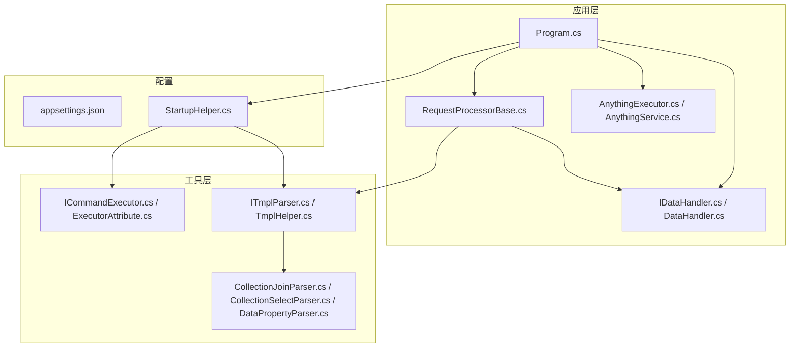
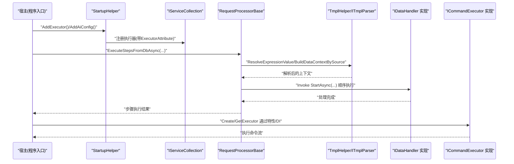
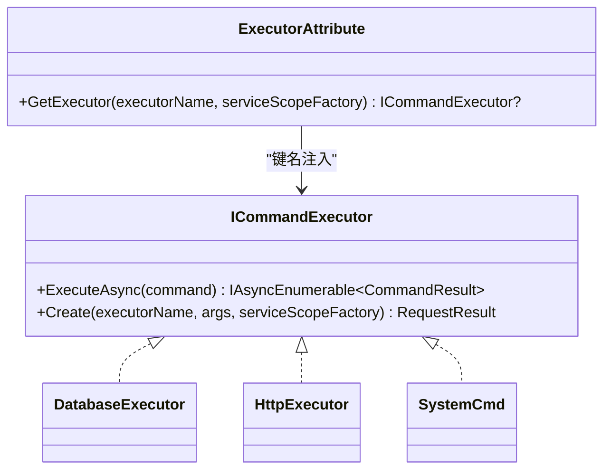
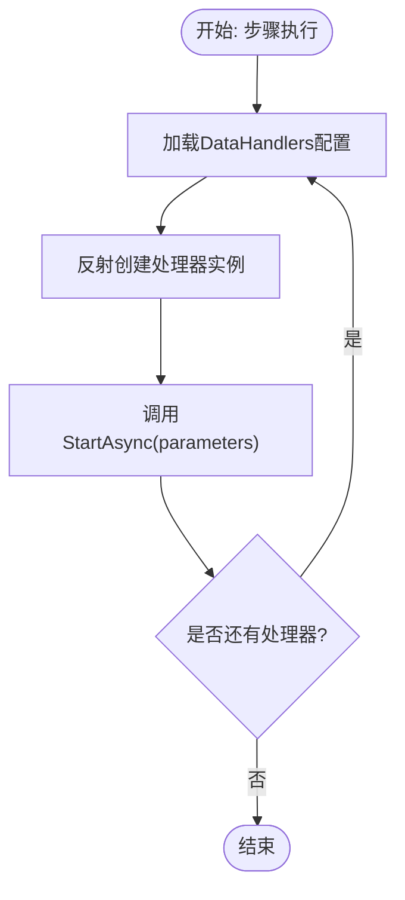
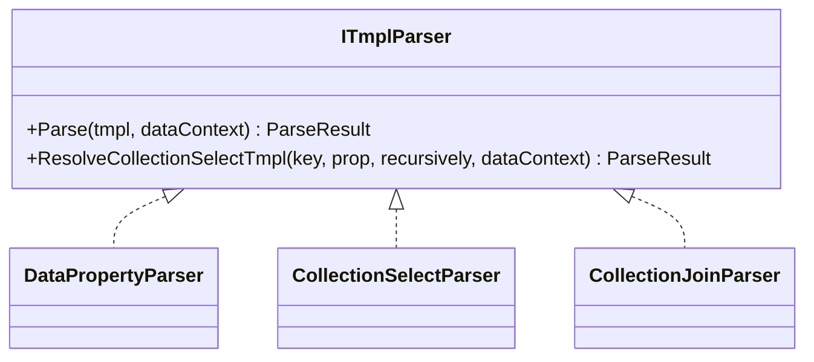
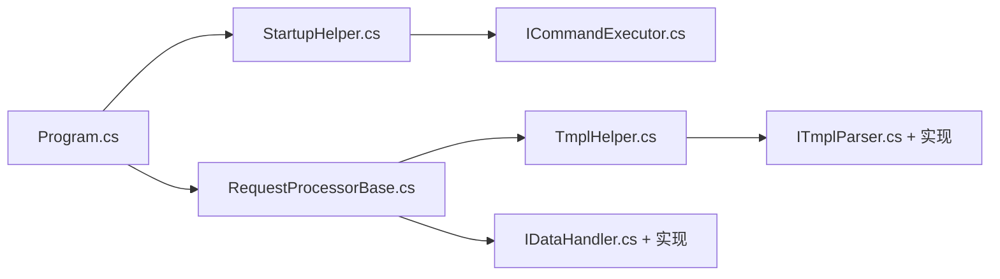

# 扩展开发指南

<cite>
**本文档引用的文件**
- [Program.cs](file://Sylas.RemoteTasks.App/Program.cs)
- [appsettings.json](file://Sylas.RemoteTasks.App/appsettings.json)
- [StartupHelper.cs](file://Sylas.RemoteTasks.App/Helpers/StartupHelper.cs)
- [RequestProcessorBase.cs](file://Sylas.RemoteTasks.App/RequestProcessor/RequestProcessorBase.cs)
- [IRequestConfigTasks.cs](file://Sylas.RemoteTasks.App/RequestProcessor/IRequestConfigTasks.cs)
- [IDataHandler.cs](file://Sylas.RemoteTasks.App/DataHandlers/IDataHandler.cs)
- [DataHandler.cs](file://Sylas.RemoteTasks.App/DataHandlers/DataHandler.cs)
- [ICommandExecutor.cs](file://Sylas.RemoteTasks.Utils/CommandExecutor/ICommandExecutor.cs)
- [ExecutorAttribute.cs](file://Sylas.RemoteTasks.Utils/CommandExecutor/ExecutorAttribute.cs)
- [ITmplParser.cs](file://Sylas.RemoteTasks.Utils/Template/Parser/ITmplParser.cs)
- [TmplHelper.cs](file://Sylas.RemoteTasks.Utils/Template/TmplHelper.cs)
- [CollectionJoinParser.cs](file://Sylas.RemoteTasks.Utils/Template/Parser/CollectionJoinParser.cs)
- [CollectionSelectParser.cs](file://Sylas.RemoteTasks.Utils/Template/Parser/CollectionSelectParser.cs)
- [DataPropertyParser.cs](file://Sylas.RemoteTasks.Utils/Template/Parser/DataPropertyParser.cs)
- [HttpRequestProcessor.cs](file://Sylas.RemoteTasks.App/RequestProcessor/Models/HttpRequestProcessor.cs)
- [AnythingExecutor.cs](file://Sylas.RemoteTasks.App/RemoteHostModule/Anything/AnythingExecutor.cs)
- [AnythingService.cs](file://Sylas.RemoteTasks.App/RemoteHostModule/Anything/AnythingService.cs)
</cite>

## 目录
1. [简介](#简介)
2. [项目结构](#项目结构)
3. [核心组件](#核心组件)
4. [架构总览](#架构总览)
5. [详细组件分析](#详细组件分析)
6. [依赖关系分析](#依赖关系分析)
7. [性能考量](#性能考量)
8. [故障排查指南](#故障排查指南)
9. [结论](#结论)
10. [附录](#附录)

## 简介
本指南面向希望在 Sylas.RemoteTasks 中进行扩展开发的工程师，系统讲解如何新增执行器、自定义数据处理器、模板解析器扩展、插件开发规范以及第三方集成。文档基于仓库现有实现，解释扩展点的设计原理与使用方法，并提供最佳实践与常见问题解决方案。

## 项目结构
Sylas.RemoteTasks 采用多项目分层组织，核心能力分布在以下模块：
- 应用层（Sylas.RemoteTasks.App）：控制器、后台服务、请求处理器、数据处理器、Anything 远程主机模块等
- 工具层（Sylas.RemoteTasks.Utils）：命令执行器、模板引擎、文本扩展、网络辅助等
- 数据层（Sylas.RemoteTasks.Database）：数据库抽象、同步基类、查询构建等
- 通用层（Sylas.RemoteTasks.Common）：公共 DTO、扩展方法、常量等
- 测试层（Sylas.RemoteTasks.Test）：单元测试与集成测试

图表来源
- [Program.cs](file://Sylas.RemoteTasks.App/Program.cs#L26-L62)
- [StartupHelper.cs](file://Sylas.RemoteTasks.App/Helpers/StartupHelper.cs#L87-L99)
- [RequestProcessorBase.cs](file://Sylas.RemoteTasks.App/RequestProcessor/RequestProcessorBase.cs#L1-L279)
- [IDataHandler.cs](file://Sylas.RemoteTasks.App/DataHandlers/IDataHandler.cs#L1-L8)
- [ICommandExecutor.cs](file://Sylas.RemoteTasks.Utils/CommandExecutor/ICommandExecutor.cs#L1-L74)
- [ITmplParser.cs](file://Sylas.RemoteTasks.Utils/Template/Parser/ITmplParser.cs#L1-L105)
- [appsettings.json](file://Sylas.RemoteTasks.App/appsettings.json#L65-L106)

章节来源
- [Program.cs](file://Sylas.RemoteTasks.App/Program.cs#L12-L122)
- [appsettings.json](file://Sylas.RemoteTasks.App/appsettings.json#L1-L142)

## 核心组件
- 请求处理器（RequestProcessorBase）：负责按步骤执行 HTTP 请求、构建数据上下文、调用数据处理器
- 数据处理器（IDataHandler）：定义统一的异步处理接口，具体实现按业务扩展
- 命令执行器（ICommandExecutor + ExecutorAttribute）：统一的命令执行抽象，支持 DI 注入与反射创建
- 模板引擎（ITmplParser + TmplHelper）：提供表达式解析、集合选择、正则抽取、for 循环渲染等能力
- 配置与启动（StartupHelper + appsettings.json）：集中注册执行器、AI 配置、缓存、信号等

章节来源
- [RequestProcessorBase.cs](file://Sylas.RemoteTasks.App/RequestProcessor/RequestProcessorBase.cs#L12-L43)
- [IDataHandler.cs](file://Sylas.RemoteTasks.App/DataHandlers/IDataHandler.cs#L3-L6)
- [ICommandExecutor.cs](file://Sylas.RemoteTasks.Utils/CommandExecutor/ICommandExecutor.cs#L14-L21)
- [ExecutorAttribute.cs](file://Sylas.RemoteTasks.Utils/CommandExecutor/ExecutorAttribute.cs#L10-L23)
- [ITmplParser.cs](file://Sylas.RemoteTasks.Utils/Template/Parser/ITmplParser.cs#L20-L29)
- [TmplHelper.cs](file://Sylas.RemoteTasks.Utils/Template/TmplHelper.cs#L20-L271)
- [StartupHelper.cs](file://Sylas.RemoteTasks.App/Helpers/StartupHelper.cs#L77-L99)
- [appsettings.json](file://Sylas.RemoteTasks.App/appsettings.json#L65-L106)

## 架构总览
下图展示扩展点在运行时的交互关系：应用启动时注册执行器与模板解析器；请求处理器按步骤解析模板、发起请求、构建上下文并调用数据处理器；命令执行器通过特性与 DI 完成实例化与参数解析。

图表来源
- [Program.cs](file://Sylas.RemoteTasks.App/Program.cs#L26-L62)
- [StartupHelper.cs](file://Sylas.RemoteTasks.App/Helpers/StartupHelper.cs#L87-L99)
- [RequestProcessorBase.cs](file://Sylas.RemoteTasks.App/RequestProcessor/RequestProcessorBase.cs#L83-L276)
- [ICommandExecutor.cs](file://Sylas.RemoteTasks.Utils/CommandExecutor/ICommandExecutor.cs#L31-L71)
- [ITmplParser.cs](file://Sylas.RemoteTasks.Utils/Template/Parser/ITmplParser.cs#L29-L102)
- [TmplHelper.cs](file://Sylas.RemoteTasks.Utils/Template/TmplHelper.cs#L461-L634)

## 详细组件分析

### 新增执行器（命令执行器）
执行器通过统一接口与特性实现，支持两种实例化方式：
- 带 ExecutorAttribute 的类：通过 DI 容器按键名获取
- 普通类：通过反射创建实例

扩展步骤
1. 定义实现类并实现接口方法
2. 若需要 DI 注入，请添加 ExecutorAttribute 并在 StartupHelper 中注册
3. 使用 ICommandExecutor.Create 或通过 DI 获取实例
4. 在远程主机或流程中按需调用 ExecuteAsync

图表来源
- [ICommandExecutor.cs](file://Sylas.RemoteTasks.Utils/CommandExecutor/ICommandExecutor.cs#L14-L71)
- [ExecutorAttribute.cs](file://Sylas.RemoteTasks.Utils/CommandExecutor/ExecutorAttribute.cs#L10-L23)
- [Program.cs](file://Sylas.RemoteTasks.App/Program.cs#L26-L27)

章节来源
- [ICommandExecutor.cs](file://Sylas.RemoteTasks.Utils/CommandExecutor/ICommandExecutor.cs#L14-L71)
- [ExecutorAttribute.cs](file://Sylas.RemoteTasks.Utils/CommandExecutor/ExecutorAttribute.cs#L10-L23)
- [StartupHelper.cs](file://Sylas.RemoteTasks.App/Helpers/StartupHelper.cs#L87-L99)
- [Program.cs](file://Sylas.RemoteTasks.App/Program.cs#L26-L27)

### 自定义数据处理器
数据处理器通过统一接口定义 StartAsync 方法，请求处理器在每个步骤中按顺序调用。扩展步骤：
1. 实现 IDataHandler 接口
2. 在配置中声明处理器名称与参数列表
3. 请求处理器通过反射加载并调用 StartAsync

图表来源
- [RequestProcessorBase.cs](file://Sylas.RemoteTasks.App/RequestProcessor/RequestProcessorBase.cs#L256-L276)
- [IDataHandler.cs](file://Sylas.RemoteTasks.App/DataHandlers/IDataHandler.cs#L3-L6)

章节来源
- [RequestProcessorBase.cs](file://Sylas.RemoteTasks.App/RequestProcessor/RequestProcessorBase.cs#L256-L276)
- [IDataHandler.cs](file://Sylas.RemoteTasks.App/DataHandlers/IDataHandler.cs#L3-L6)
- [DataHandler.cs](file://Sylas.RemoteTasks.App/DataHandlers/DataHandler.cs#L3-L14)

### 模板解析器扩展
模板引擎支持多种解析器，开发者可通过实现 ITmplParser 接口扩展解析逻辑。内置解析器包括：
- 属性解析：DataPropertyParser
- 集合选择：CollectionSelectParser
- 集合拼接：CollectionJoinParser
- 集合正则抽取：CollectionSelectItemRegexSubStringParser（间接通过 ITmplParser.ResolveCollectionSelectTmpl）

扩展步骤
1. 实现 ITmplParser 接口的 Parse 方法
2. 在模板表达式中以“解析器名[...]”的形式使用
3. 使用 TmplHelper.ResolveExpressionValue 触发解析

图表来源
- [ITmplParser.cs](file://Sylas.RemoteTasks.Utils/Template/Parser/ITmplParser.cs#L20-L102)
- [DataPropertyParser.cs](file://Sylas.RemoteTasks.Utils/Template/Parser/DataPropertyParser.cs#L16-L144)
- [CollectionSelectParser.cs](file://Sylas.RemoteTasks.Utils/Template/Parser/CollectionSelectParser.cs#L9-L32)
- [CollectionJoinParser.cs](file://Sylas.RemoteTasks.Utils/Template/Parser/CollectionJoinParser.cs#L13-L71)

章节来源
- [ITmplParser.cs](file://Sylas.RemoteTasks.Utils/Template/Parser/ITmplParser.cs#L20-L102)
- [TmplHelper.cs](file://Sylas.RemoteTasks.Utils/Template/TmplHelper.cs#L461-L634)
- [DataPropertyParser.cs](file://Sylas.RemoteTasks.Utils/Template/Parser/DataPropertyParser.cs#L16-L144)
- [CollectionSelectParser.cs](file://Sylas.RemoteTasks.Utils/Template/Parser/CollectionSelectParser.cs#L9-L32)
- [CollectionJoinParser.cs](file://Sylas.RemoteTasks.Utils/Template/Parser/CollectionJoinParser.cs#L13-L71)

### 插件开发规范
- 插件应遵循单一职责，聚焦特定领域（如数据库、HTTP、文件系统）
- 通过接口与特性解耦，便于 DI 注入与替换
- 避免硬编码路径与敏感信息，优先从配置读取
- 对外暴露清晰的错误信息与日志，便于排障
- 提供最小可用的参数集，避免过度复杂化

### 第三方集成
- 命令执行器：通过 ICommandExecutor 抽象对接外部命令或 SDK
- 模板引擎：通过 ITmplParser 扩展解析器，适配第三方数据结构
- 配置中心：通过 appsettings.json 与 StartupHelper 集中管理第三方服务配置

章节来源
- [ICommandExecutor.cs](file://Sylas.RemoteTasks.Utils/CommandExecutor/ICommandExecutor.cs#L14-L71)
- [ITmplParser.cs](file://Sylas.RemoteTasks.Utils/Template/Parser/ITmplParser.cs#L20-L102)
- [StartupHelper.cs](file://Sylas.RemoteTasks.App/Helpers/StartupHelper.cs#L77-L83)
- [appsettings.json](file://Sylas.RemoteTasks.App/appsettings.json#L44-L49)

## 依赖关系分析
- 启动阶段：Program.cs 调用 StartupHelper 注册执行器与 AI 配置；同时注册请求处理器工厂与仓储
- 运行阶段：RequestProcessorBase 依赖 TmplHelper 构建数据上下文，再调用 IDataHandler 实现
- 执行器与解析器：均通过反射与 DI 容器动态加载，降低耦合

图表来源
- [Program.cs](file://Sylas.RemoteTasks.App/Program.cs#L26-L62)
- [StartupHelper.cs](file://Sylas.RemoteTasks.App/Helpers/StartupHelper.cs#L87-L99)
- [RequestProcessorBase.cs](file://Sylas.RemoteTasks.App/RequestProcessor/RequestProcessorBase.cs#L1-L279)
- [ICommandExecutor.cs](file://Sylas.RemoteTasks.Utils/CommandExecutor/ICommandExecutor.cs#L1-L74)
- [TmplHelper.cs](file://Sylas.RemoteTasks.Utils/Template/TmplHelper.cs#L1-L740)
- [ITmplParser.cs](file://Sylas.RemoteTasks.Utils/Template/Parser/ITmplParser.cs#L1-L105)
- [IDataHandler.cs](file://Sylas.RemoteTasks.App/DataHandlers/IDataHandler.cs#L1-L8)

章节来源
- [Program.cs](file://Sylas.RemoteTasks.App/Program.cs#L26-L62)
- [StartupHelper.cs](file://Sylas.RemoteTasks.App/Helpers/StartupHelper.cs#L87-L99)
- [RequestProcessorBase.cs](file://Sylas.RemoteTasks.App/RequestProcessor/RequestProcessorBase.cs#L1-L279)

## 性能考量
- 模板解析：尽量减少深层嵌套与重复解析，合理使用 DataContext 缓存
- 数据处理器：避免在 StartAsync 中进行阻塞 IO，必要时使用异步 API
- 执行器：命令执行器返回 IAsyncEnumerable，注意背压与取消令牌
- 反射与 DI：批量注册与缓存类型映射，避免频繁反射查找

## 故障排查指南
- 执行器未注册：确认类是否带有 ExecutorAttribute，StartupHelper 是否已扫描注册
- 模板解析失败：检查表达式语法与数据上下文键是否存在；查看日志中模板解析详情
- 数据处理器未找到：确认处理器名称与配置一致，StartAsync 方法签名正确
- 请求处理器步骤异常：检查步骤参数、Headers、DataContextBuilder 与 DataHandlers 配置
- 远程主机执行器参数：确认 AnythingExecutor 的 Arguments 解析是否符合预期类型

章节来源
- [StartupHelper.cs](file://Sylas.RemoteTasks.App/Helpers/StartupHelper.cs#L87-L99)
- [TmplHelper.cs](file://Sylas.RemoteTasks.Utils/Template/TmplHelper.cs#L273-L307)
- [RequestProcessorBase.cs](file://Sylas.RemoteTasks.App/RequestProcessor/RequestProcessorBase.cs#L83-L276)
- [AnythingService.cs](file://Sylas.RemoteTasks.App/RemoteHostModule/Anything/AnythingService.cs#L544-L563)

## 结论
Sylas.RemoteTasks 通过接口与特性实现了高度可扩展的执行器、数据处理器与模板解析体系。遵循本文档的扩展规范与最佳实践，可在不破坏核心架构的前提下快速集成新能力，并保持良好的可维护性与性能表现。

## 附录
- 配置示例：参考 appsettings.json 中 RequestPipeline 与 AiConfig 的结构
- 启动注册：参考 Program.cs 与 StartupHelper 的注册流程
- 请求处理器模型：参考 HttpRequestProcessor 的实体结构

章节来源
- [appsettings.json](file://Sylas.RemoteTasks.App/appsettings.json#L65-L106)
- [Program.cs](file://Sylas.RemoteTasks.App/Program.cs#L26-L62)
- [StartupHelper.cs](file://Sylas.RemoteTasks.App/Helpers/StartupHelper.cs#L77-L99)
- [HttpRequestProcessor.cs](file://Sylas.RemoteTasks.App/RequestProcessor/Models/HttpRequestProcessor.cs#L9-L21)