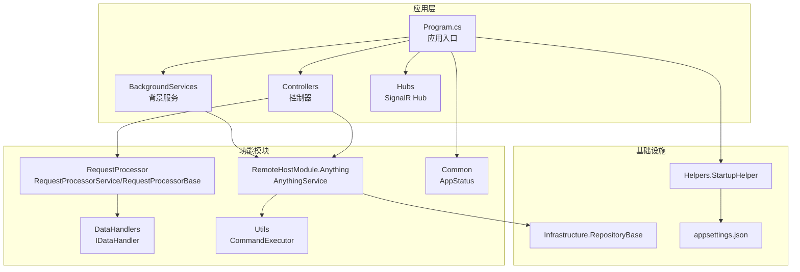
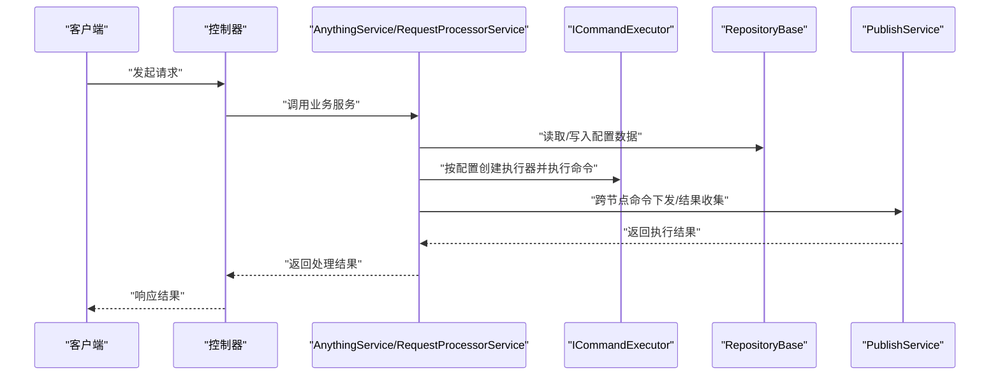
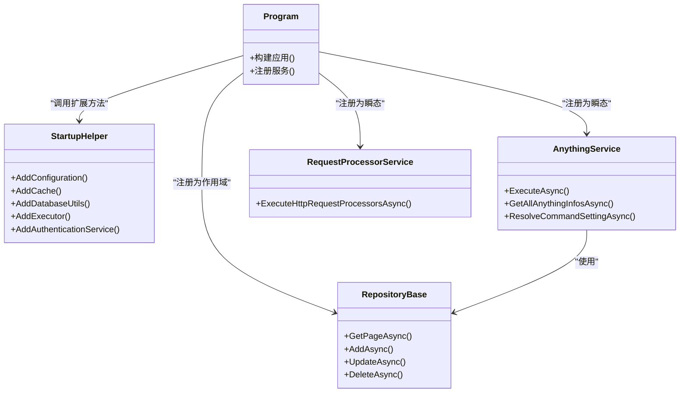
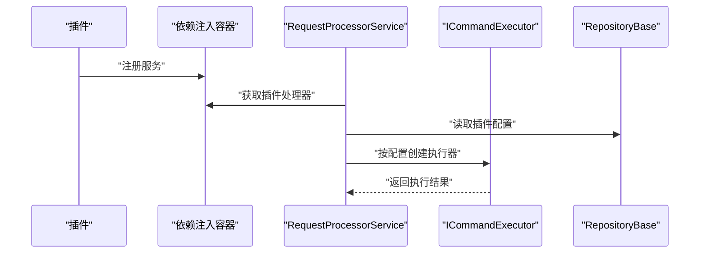
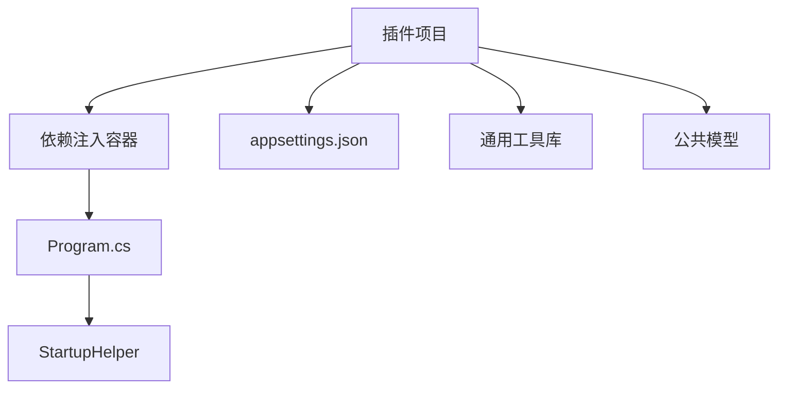

# 插件开发规范

<cite>
**本文档引用的文件**
- [Program.cs](file://Sylas.RemoteTasks.App/Program.cs)
- [appsettings.json](file://Sylas.RemoteTasks.App/appsettings.json)
- [AnythingService.cs](file://Sylas.RemoteTasks.App/RemoteHostModule/Anything/AnythingService.cs)
- [PublishService.cs](file://Sylas.RemoteTasks.App/BackgroundServices/PublishService.cs)
- [CustomBaseController.cs](file://Sylas.RemoteTasks.App/Controllers/CustomBaseController.cs)
- [RepositoryBase.cs](file://Sylas.RemoteTasks.App/Infrastructure/RepositoryBase.cs)
- [RequestProcessorService.cs](file://Sylas.RemoteTasks.App/RequestProcessor/RequestProcessorService.cs)
- [IDataHandler.cs](file://Sylas.RemoteTasks.App/DataHandlers/IDataHandler.cs)
- [StartupHelper.cs](file://Sylas.RemoteTasks.App/Helpers/StartupHelper.cs)
- [Sylas.RemoteTasks.App.csproj](file://Sylas.RemoteTasks.App/Sylas.RemoteTasks.App.csproj)
- [ICommandExecutor.cs](file://Sylas.RemoteTasks.Utils/CommandExecutor/ICommandExecutor.cs)
- [RequestProcessorBase.cs](file://Sylas.RemoteTasks.App/RequestProcessor/RequestProcessorBase.cs)
- [AppStatus.cs](file://Sylas.RemoteTasks.Common/AppStatus.cs)
</cite>

## 目录
1. [引言](#引言)
2. [项目结构](#项目结构)
3. [核心组件](#核心组件)
4. [架构总览](#架构总览)
5. [详细组件分析](#详细组件分析)
6. [依赖关系分析](#依赖关系分析)
7. [性能考量](#性能考量)
8. [故障排查指南](#故障排查指南)
9. [结论](#结论)
10. [附录](#附录)

## 引言
本规范面向在 Sylas.RemoteTasks 体系中开发“插件”的开发者，目标是提供一套统一、可维护、可扩展的插件开发标准。文档涵盖插件命名约定、目录结构、配置文件格式；阐明插件生命周期管理、依赖注入配置、服务注册机制；解释插件与主系统的集成方式、接口契约与版本兼容性要求；给出插件打包、发布、安装的标准流程；并包含安全性、权限控制、资源限制等规范要求，以及兼容性问题、性能影响与调试技巧。

## 项目结构
Sylas.RemoteTasks 采用多项目解决方案，核心运行时位于 Sylas.RemoteTasks.App，通用能力分布在 Sylas.RemoteTasks.Common、Sylas.RemoteTasks.Database、Sylas.RemoteTasks.Utils 等项目中。插件开发主要围绕以下模块：
- 远程主机模块：AnythingService 提供命令执行、模板解析、执行器装配与任务编排能力
- 请求处理器模块：RequestProcessorService/RequestProcessorBase 提供基于配置的请求流水线与数据处理器执行
- 基础设施模块：RepositoryBase 提供通用仓储能力
- 启动与配置：Program.cs、StartupHelper 提供服务注册、认证授权、配置加载
- 背景服务：PublishService 提供 TCP 通信、命令下发与结果收集
- 控制器基类：CustomBaseController 提供文件上传、权限控制等基础能力

**图表来源**
- [Program.cs](file://Sylas.RemoteTasks.App/Program.cs#L1-L122)
- [AnythingService.cs](file://Sylas.RemoteTasks.App/RemoteHostModule/Anything/AnythingService.cs#L1-L680)
- [RequestProcessorService.cs](file://Sylas.RemoteTasks.App/RequestProcessor/RequestProcessorService.cs#L1-L72)
- [RequestProcessorBase.cs](file://Sylas.RemoteTasks.App/RequestProcessor/RequestProcessorBase.cs#L1-L279)
- [RepositoryBase.cs](file://Sylas.RemoteTasks.App/Infrastructure/RepositoryBase.cs#L1-L233)
- [StartupHelper.cs](file://Sylas.RemoteTasks.App/Helpers/StartupHelper.cs#L1-L275)
- [appsettings.json](file://Sylas.RemoteTasks.App/appsettings.json#L1-L142)
- [AppStatus.cs](file://Sylas.RemoteTasks.Common/AppStatus.cs#L1-L35)

**章节来源**
- [Program.cs](file://Sylas.RemoteTasks.App/Program.cs#L1-L122)
- [StartupHelper.cs](file://Sylas.RemoteTasks.App/Helpers/StartupHelper.cs#L1-L275)
- [appsettings.json](file://Sylas.RemoteTasks.App/appsettings.json#L1-L142)

## 核心组件
- 依赖注入与服务注册
  - 在 Program.cs 中集中注册服务，包括控制器、SignalR、缓存、HTTP 客户端、仓储、请求处理器、背景服务等
  - 通过 StartupHelper 扩展方法完成配置加载、缓存、数据库工具、鉴权、全局热键等注册
- 远程主机与命令执行
  - AnythingService 负责 Anything 配置、命令、执行器的解析与装配，并通过 ICommandExecutor 执行命令
  - 支持跨节点命令下发与结果汇聚，结合 PublishService 的 TCP 通道
- 请求处理流水线
  - RequestProcessorService/RequestProcessorBase 实现基于配置的请求流水线，支持 DataContext 构建、模板解析、数据处理器执行
- 数据访问
  - RepositoryBase 提供通用分页查询、增删改查能力，支持多种数据库类型
- 控制器与权限
  - CustomBaseController 提供文件上传、删除、路径计算等通用能力，并通过授权策略保护接口

**章节来源**
- [Program.cs](file://Sylas.RemoteTasks.App/Program.cs#L25-L95)
- [StartupHelper.cs](file://Sylas.RemoteTasks.App/Helpers/StartupHelper.cs#L20-L99)
- [AnythingService.cs](file://Sylas.RemoteTasks.App/RemoteHostModule/Anything/AnythingService.cs#L1-L680)
- [RequestProcessorService.cs](file://Sylas.RemoteTasks.App/RequestProcessor/RequestProcessorService.cs#L1-L72)
- [RequestProcessorBase.cs](file://Sylas.RemoteTasks.App/RequestProcessor/RequestProcessorBase.cs#L1-L279)
- [RepositoryBase.cs](file://Sylas.RemoteTasks.App/Infrastructure/RepositoryBase.cs#L1-L233)
- [CustomBaseController.cs](file://Sylas.RemoteTasks.App/Controllers/CustomBaseController.cs#L1-L145)

## 架构总览
插件开发遵循“配置驱动 + 依赖注入 + 模板解析 + 流水线处理”的架构模式。系统通过 appsettings.json 加载插件相关配置，Program.cs 和 StartupHelper 完成服务注册，AnythingService/RequestProcessorService 负责具体业务编排，RepositoryBase 提供数据访问，PublishService 提供跨节点通信。

**图表来源**
- [Program.cs](file://Sylas.RemoteTasks.App/Program.cs#L25-L95)
- [AnythingService.cs](file://Sylas.RemoteTasks.App/RemoteHostModule/Anything/AnythingService.cs#L294-L389)
- [RequestProcessorService.cs](file://Sylas.RemoteTasks.App/RequestProcessor/RequestProcessorService.cs#L11-L69)
- [RepositoryBase.cs](file://Sylas.RemoteTasks.App/Infrastructure/RepositoryBase.cs#L20-L193)
- [PublishService.cs](file://Sylas.RemoteTasks.App/BackgroundServices/PublishService.cs#L346-L434)

## 详细组件分析

### 依赖注入与服务注册规范
- 服务注册位置
  - 在 Program.cs 的 WebApplicationBuilder 中完成服务注册，确保集中管理
  - 使用 StartupHelper 扩展方法注册缓存、数据库工具、鉴权、全局热键等
- 生命周期管理
  - 单例：适用于无状态、可复用的配置类、工具类
  - 作用域：推荐用于仓储、数据库提供者等需要请求上下文隔离的组件
  - 瞬态：适合轻量、无状态的辅助类
- 服务发现与动态装配
  - 通过反射扫描实现类并按约定注册（如带特定特性的执行器）

**图表来源**
- [Program.cs](file://Sylas.RemoteTasks.App/Program.cs#L25-L95)
- [StartupHelper.cs](file://Sylas.RemoteTasks.App/Helpers/StartupHelper.cs#L20-L99)
- [RepositoryBase.cs](file://Sylas.RemoteTasks.App/Infrastructure/RepositoryBase.cs#L10-L194)
- [AnythingService.cs](file://Sylas.RemoteTasks.App/RemoteHostModule/Anything/AnythingService.cs#L45-L277)
- [RequestProcessorService.cs](file://Sylas.RemoteTasks.App/RequestProcessor/RequestProcessorService.cs#L7-L69)

**章节来源**
- [Program.cs](file://Sylas.RemoteTasks.App/Program.cs#L25-L95)
- [StartupHelper.cs](file://Sylas.RemoteTasks.App/Helpers/StartupHelper.cs#L20-L99)

### 插件命名约定与目录结构
- 命名约定
  - 插件类名建议采用“Plugin”后缀，如 MyPlugin、DataHandlerPlugin
  - 插件配置键建议采用“Plugin.”前缀，便于在 appsettings.json 中识别与分组
- 目录结构
  - 插件建议放置在 Sylas.RemoteTasks.App/Plugins 或独立子目录中，避免与现有模块混杂
  - 插件项目建议独立 NuGet 包，便于版本管理与分发
- 配置文件格式
  - 插件配置统一放入 appsettings.json 的“Plugin”节点下，支持嵌套与数组
  - 插件启用开关、参数、依赖项均在此处声明

**章节来源**
- [appsettings.json](file://Sylas.RemoteTasks.App/appsettings.json#L65-L106)

### 插件生命周期管理
- 初始化阶段
  - 在 Program.cs 中注册插件服务，确保在应用启动时完成装配
  - 通过 StartupHelper 扩展方法完成插件所需的配置加载与依赖注入
- 运行阶段
  - 插件通过依赖注入获取所需服务（仓储、HTTP 客户端、缓存等）
  - 插件内部状态尽量保持无状态，必要时使用缓存或作用域服务
- 终止阶段
  - 插件应清理临时资源，避免内存泄漏
  - 若涉及外部连接（如 TCP、HTTP），应在停止时优雅关闭

**章节来源**
- [Program.cs](file://Sylas.RemoteTasks.App/Program.cs#L25-L95)
- [StartupHelper.cs](file://Sylas.RemoteTasks.App/Helpers/StartupHelper.cs#L20-L99)

### 插件与主系统的集成方式
- 通过接口契约实现解耦
  - 命令执行器：实现 ICommandExecutor 接口，支持按名称动态创建与执行
  - 数据处理器：实现 IDataHandler 接口，由 RequestProcessorService 统一调度
- 配置驱动
  - 插件行为由 appsettings.json 中的配置决定，支持模板表达式与上下文变量
- 跨节点通信
  - 通过 PublishService 的 TCP 通道实现命令下发与结果收集，插件可参与其中

**图表来源**
- [ICommandExecutor.cs](file://Sylas.RemoteTasks.Utils/CommandExecutor/ICommandExecutor.cs#L14-L74)
- [IDataHandler.cs](file://Sylas.RemoteTasks.App/DataHandlers/IDataHandler.cs#L3-L7)
- [RequestProcessorService.cs](file://Sylas.RemoteTasks.App/RequestProcessor/RequestProcessorService.cs#L11-L69)
- [RepositoryBase.cs](file://Sylas.RemoteTasks.App/Infrastructure/RepositoryBase.cs#L20-L193)

**章节来源**
- [ICommandExecutor.cs](file://Sylas.RemoteTasks.Utils/CommandExecutor/ICommandExecutor.cs#L14-L74)
- [IDataHandler.cs](file://Sylas.RemoteTasks.App/DataHandlers/IDataHandler.cs#L3-L7)
- [RequestProcessorService.cs](file://Sylas.RemoteTasks.App/RequestProcessor/RequestProcessorService.cs#L11-L69)

### 插件打包、发布与安装流程
- 打包
  - 插件项目独立编译为 NuGet 包，包含必要的依赖与运行时支持
  - 包含 appsettings.json 的示例配置，便于安装后快速启用
- 发布
  - 使用官方 NuGet 源或私有源发布插件包
  - 在发布说明中注明版本兼容性、破坏性变更与迁移指引
- 安装
  - 在目标环境中安装插件包
  - 在 appsettings.json 中启用插件并填写必要参数
  - 重启应用以加载新插件

**章节来源**
- [Sylas.RemoteTasks.App.csproj](file://Sylas.RemoteTasks.App/Sylas.RemoteTasks.App.csproj#L1-L61)

### 安全性、权限控制与资源限制
- 权限控制
  - 控制器基类通过授权策略保护接口，插件应遵循相同策略
  - 仅对管理员开放敏感操作，避免越权访问
- 安全配置
  - 通过 StartupHelper 配置鉴权与授权策略，确保插件接口符合整体安全策略
  - 严格校验插件输入参数，防止注入攻击
- 资源限制
  - 对长时间运行的插件操作设置超时与重试策略
  - 控制并发度，避免占用过多系统资源

**章节来源**
- [CustomBaseController.cs](file://Sylas.RemoteTasks.App/Controllers/CustomBaseController.cs#L10-L14)
- [StartupHelper.cs](file://Sylas.RemoteTasks.App/Helpers/StartupHelper.cs#L124-L271)

### 兼容性问题、性能影响与调试技巧
- 兼容性
  - 插件需声明最低 .NET 版本与依赖包版本范围
  - 避免直接依赖具体实现类，优先使用接口契约
- 性能
  - 使用作用域服务避免跨请求状态污染
  - 对高频操作使用缓存，减少重复计算与 IO
- 调试
  - 利用日志系统输出关键路径与异常信息
  - 使用单元测试与集成测试验证插件行为

**章节来源**
- [Program.cs](file://Sylas.RemoteTasks.App/Program.cs#L25-L95)
- [RepositoryBase.cs](file://Sylas.RemoteTasks.App/Infrastructure/RepositoryBase.cs#L20-L193)

## 依赖关系分析
插件开发需关注以下依赖关系：
- 与主系统的耦合度：通过接口契约降低耦合，避免直接依赖具体实现
- 与配置的耦合度：插件配置集中于 appsettings.json，遵循统一命名与结构
- 与 DI 容器的耦合度：插件服务通过 StartupHelper 注册，遵循生命周期约定

**图表来源**
- [Program.cs](file://Sylas.RemoteTasks.App/Program.cs#L25-L95)
- [StartupHelper.cs](file://Sylas.RemoteTasks.App/Helpers/StartupHelper.cs#L20-L99)
- [appsettings.json](file://Sylas.RemoteTasks.App/appsettings.json#L1-L142)

**章节来源**
- [Program.cs](file://Sylas.RemoteTasks.App/Program.cs#L25-L95)
- [StartupHelper.cs](file://Sylas.RemoteTasks.App/Helpers/StartupHelper.cs#L20-L99)
- [appsettings.json](file://Sylas.RemoteTasks.App/appsettings.json#L1-L142)

## 性能考量
- 仓储与数据库
  - RepositoryBase 提供分页查询与多种数据库类型支持，插件应合理使用分页与索引
- 缓存策略
  - 使用内存缓存存储热点配置与执行器映射，减少重复解析与实例化
- 异步与并发
  - 插件内部尽量使用异步方法，避免阻塞线程
  - 控制并发度，避免对下游系统造成压力

**章节来源**
- [RepositoryBase.cs](file://Sylas.RemoteTasks.App/Infrastructure/RepositoryBase.cs#L20-L193)
- [AnythingService.cs](file://Sylas.RemoteTasks.App/RemoteHostModule/Anything/AnythingService.cs#L248-L277)

## 故障排查指南
- 配置问题
  - 检查 appsettings.json 中插件配置是否正确，键名与结构是否匹配
- 依赖注入问题
  - 确认插件服务已在 Program.cs 或 StartupHelper 中注册
- 执行器问题
  - 确保执行器类名与配置一致，且实现了正确的接口
- 跨节点通信问题
  - 检查 PublishService 的 TCP 连接与心跳机制，确认命令下发与结果返回链路

**章节来源**
- [appsettings.json](file://Sylas.RemoteTasks.App/appsettings.json#L65-L106)
- [Program.cs](file://Sylas.RemoteTasks.App/Program.cs#L25-L95)
- [PublishService.cs](file://Sylas.RemoteTasks.App/BackgroundServices/PublishService.cs#L443-L624)

## 结论
本文档为插件开发提供了从命名约定、目录结构、配置格式到生命周期管理、依赖注入、服务注册、与主系统集成、打包发布、安全性与性能优化的完整规范。遵循这些规范，可确保插件在 Sylas.RemoteTasks 体系中稳定、安全、高效地运行，并具备良好的可维护性与扩展性。

## 附录
- 版本兼容性要求
  - 插件需声明最低 .NET 版本与依赖包版本范围
- 接口契约清单
  - ICommandExecutor：命令执行器接口
  - IDataHandler：数据处理器接口
- 配置示例参考
  - appsettings.json 中的 RequestPipeline、AiConfig、IdentityServerConfiguration 等节点

**章节来源**
- [ICommandExecutor.cs](file://Sylas.RemoteTasks.Utils/CommandExecutor/ICommandExecutor.cs#L14-L74)
- [IDataHandler.cs](file://Sylas.RemoteTasks.App/DataHandlers/IDataHandler.cs#L3-L7)
- [appsettings.json](file://Sylas.RemoteTasks.App/appsettings.json#L44-L141)