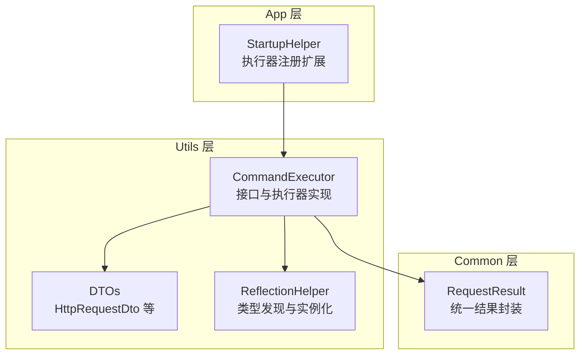
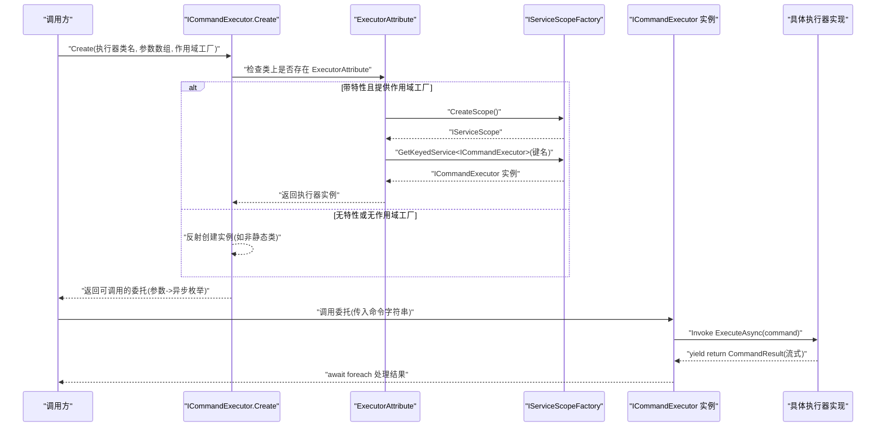
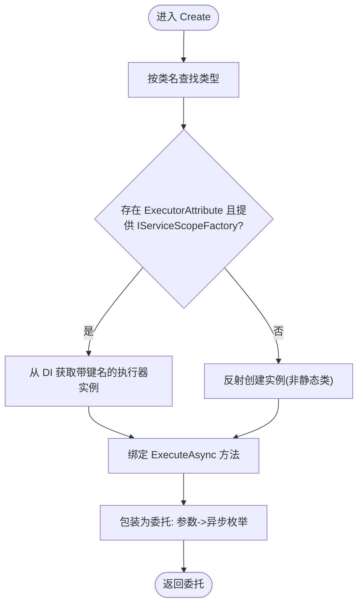
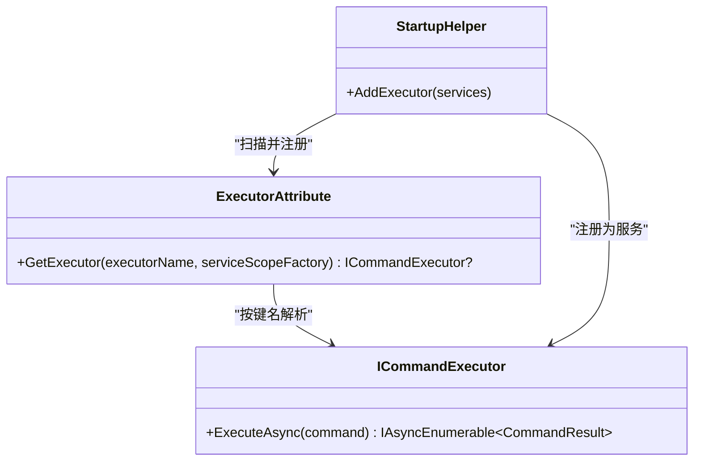
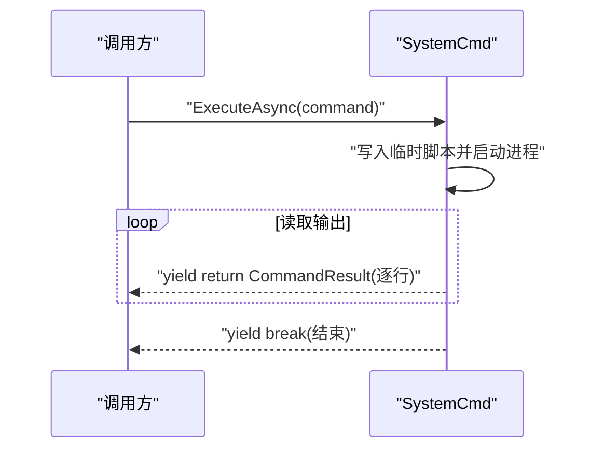
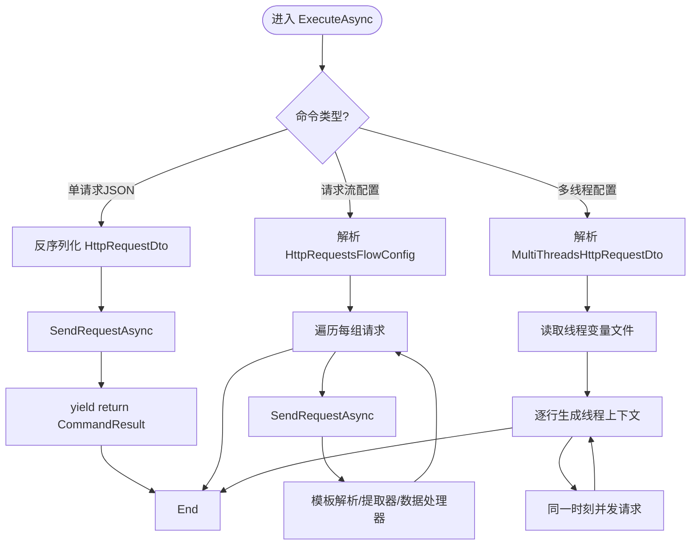
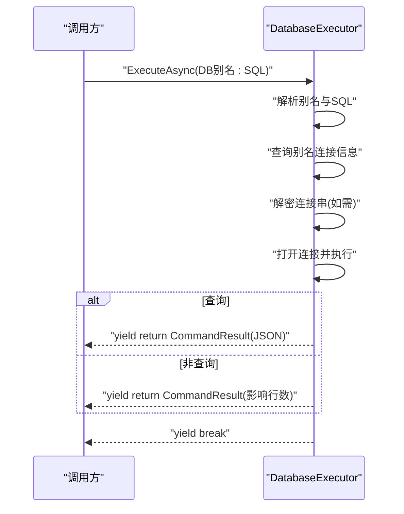
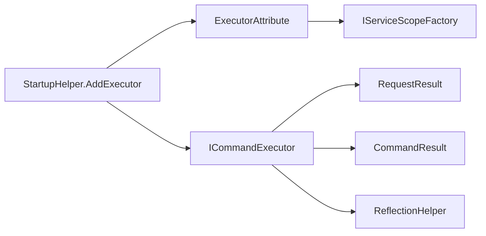

# 新增执行器开发

<cite>
**本文引用的文件**
- [ICommandExecutor.cs](file://Sylas.RemoteTasks.Utils/CommandExecutor/ICommandExecutor.cs)
- [ExecutorAttribute.cs](file://Sylas.RemoteTasks.Utils/CommandExecutor/ExecutorAttribute.cs)
- [SystemCmd.cs](file://Sylas.RemoteTasks.Utils/CommandExecutor/SystemCmd.cs)
- [HttpExecutor.cs](file://Sylas.RemoteTasks.Utils/CommandExecutor/HttpExecutor.cs)
- [DatabaseExecutor.cs](file://Sylas.RemoteTasks.Utils/CommandExecutor/DatabaseExecutor.cs)
- [CommandResult.cs](file://Sylas.RemoteTasks.Utils/CommandExecutor/CommandResult.cs)
- [HttpRequestDto.cs](file://Sylas.RemoteTasks.Utils/CommandExecutor/HttpRequestDto.cs)
- [MultiThreadsHttpRequestDto.cs](file://Sylas.RemoteTasks.Utils/CommandExecutor/MultiThreadsHttpRequestDto.cs)
- [ReflectionHelper.cs](file://Sylas.RemoteTasks.Utils/ReflectionHelper.cs)
- [StartupHelper.cs](file://Sylas.RemoteTasks.App/Helpers/StartupHelper.cs)
- [RequestResult.cs](file://Sylas.RemoteTasks.Common/Dtos/RequestResult.cs)
</cite>

## 目录
1. [简介](#简介)
2. [项目结构](#项目结构)
3. [核心组件](#核心组件)
4. [架构总览](#架构总览)
5. [详细组件分析](#详细组件分析)
6. [依赖关系分析](#依赖关系分析)
7. [性能考虑](#性能考虑)
8. [故障排查指南](#故障排查指南)
9. [结论](#结论)
10. [附录](#附录)

## 简介
本指南面向希望在系统中新增“执行器”的开发者，围绕 ICommandExecutor 接口与相关基础设施，系统讲解如何实现自定义执行器、如何使用异步枚举器模式、如何进行错误处理、如何通过 ExecutorAttribute 与依赖注入容器集成，以及如何注册执行器、传递参数、返回结果。文档同时给出系统命令执行器、HTTP 执行器、数据库执行器的具体实现要点，并总结常见问题与性能优化建议。

## 项目结构
与执行器开发直接相关的关键位置如下：
- Utils 层的 CommandExecutor 子目录：定义了执行器接口、通用结果模型、常用执行器实现（系统命令、HTTP、数据库）及配套 DTO。
- Utils 层的 ReflectionHelper：提供按类名查找类型、扫描实现类型、动态创建实例的能力。
- App 层的 Helpers/StartupHelper：提供执行器注册扩展方法，将带 Executor 特性的执行器注册进 DI 容器。
- Common 层的 Dtos/RequestResult：统一的请求结果封装，便于跨层返回一致的结构化结果。

**图表来源**
- [ICommandExecutor.cs](file://Sylas.RemoteTasks.Utils/CommandExecutor/ICommandExecutor.cs#L1-L74)
- [ReflectionHelper.cs](file://Sylas.RemoteTasks.Utils/ReflectionHelper.cs#L1-L80)
- [StartupHelper.cs](file://Sylas.RemoteTasks.App/Helpers/StartupHelper.cs#L85-L99)
- [RequestResult.cs](file://Sylas.RemoteTasks.Common/Dtos/RequestResult.cs#L1-L65)

**章节来源**
- [ICommandExecutor.cs](file://Sylas.RemoteTasks.Utils/CommandExecutor/ICommandExecutor.cs#L1-L74)
- [ReflectionHelper.cs](file://Sylas.RemoteTasks.Utils/ReflectionHelper.cs#L1-L80)
- [StartupHelper.cs](file://Sylas.RemoteTasks.App/Helpers/StartupHelper.cs#L85-L99)
- [RequestResult.cs](file://Sylas.RemoteTasks.Common/Dtos/RequestResult.cs#L1-L65)

## 核心组件
- ICommandExecutor：定义执行器契约，要求实现 ExecuteAsync(string command) 方法，返回 IAsyncEnumerable<CommandResult>，以便流式产出执行过程与结果。
- ExecutorAttribute：标记执行器类，配合 DI 容器按键名获取执行器实例；未标注或未注入时，回退到反射创建。
- CommandResult：统一的执行结果载体，包含是否成功、消息文本、以及可选的命令执行编号。
- ReflectionHelper：提供按类名获取 Type、扫描实现类型、动态创建实例等能力，支撑执行器工厂 Create 的反射机制。
- StartupHelper.AddExecutor：扫描所有实现 ICommandExecutor 的类型，若带有 ExecutorAttribute，则注册为带键名的服务，生命周期 Scoped。

**章节来源**
- [ICommandExecutor.cs](file://Sylas.RemoteTasks.Utils/CommandExecutor/ICommandExecutor.cs#L14-L72)
- [ExecutorAttribute.cs](file://Sylas.RemoteTasks.Utils/CommandExecutor/ExecutorAttribute.cs#L10-L24)
- [CommandResult.cs](file://Sylas.RemoteTasks.Utils/CommandExecutor/CommandResult.cs#L6-L36)
- [ReflectionHelper.cs](file://Sylas.RemoteTasks.Utils/ReflectionHelper.cs#L26-L77)
- [StartupHelper.cs](file://Sylas.RemoteTasks.App/Helpers/StartupHelper.cs#L85-L99)

## 架构总览
执行器的运行时交互概览如下：

**图表来源**
- [ICommandExecutor.cs](file://Sylas.RemoteTasks.Utils/CommandExecutor/ICommandExecutor.cs#L31-L71)
- [ExecutorAttribute.cs](file://Sylas.RemoteTasks.Utils/CommandExecutor/ExecutorAttribute.cs#L18-L23)
- [ReflectionHelper.cs](file://Sylas.RemoteTasks.Utils/ReflectionHelper.cs#L51-L77)

## 详细组件分析

### ICommandExecutor 接口与工厂
- ExecuteAsync 要求：必须返回 IAsyncEnumerable<CommandResult>，以便在执行过程中逐步产出中间结果与最终结果。
- 工厂 Create：通过反射定位类型，优先检查 ExecutorAttribute 并从 DI 获取实例；否则尝试通过构造函数参数列表反射创建实例；最后包装为可调用委托，内部通过 Invoke 调用 ExecuteAsync 并逐项 yield 返回。
- 异常处理：当 ExecuteAsync 返回类型不符合预期时，抛出明确异常，提示“命令执行者返回的不是正确的命令结果类型”。

**图表来源**
- [ICommandExecutor.cs](file://Sylas.RemoteTasks.Utils/CommandExecutor/ICommandExecutor.cs#L31-L71)
- [ReflectionHelper.cs](file://Sylas.RemoteTasks.Utils/ReflectionHelper.cs#L51-L77)

**章节来源**
- [ICommandExecutor.cs](file://Sylas.RemoteTasks.Utils/CommandExecutor/ICommandExecutor.cs#L14-L72)

### ExecutorAttribute 与依赖注入集成
- ExecutorAttribute：提供 GetExecutor(key, scopeFactory)，在新作用域内通过 ServiceProvider.GetKeyedService<ICommandExecutor>(key) 获取执行器实例。
- StartupHelper.AddExecutor：扫描所有实现 ICommandExecutor 的类型，若带有 ExecutorAttribute，则以“类型名”为键注册为 Scoped 服务，便于工厂按键名解析。

**图表来源**
- [ExecutorAttribute.cs](file://Sylas.RemoteTasks.Utils/CommandExecutor/ExecutorAttribute.cs#L10-L24)
- [StartupHelper.cs](file://Sylas.RemoteTasks.App/Helpers/StartupHelper.cs#L85-L99)

**章节来源**
- [ExecutorAttribute.cs](file://Sylas.RemoteTasks.Utils/CommandExecutor/ExecutorAttribute.cs#L10-L24)
- [StartupHelper.cs](file://Sylas.RemoteTasks.App/Helpers/StartupHelper.cs#L85-L99)

### CommandResult 结果模型
- 字段：Succeed、Message、CommandExecuteNo。
- 用途：作为 ExecuteAsync 流中的最小结果单元，支持客户端并发匹配与进度展示。

**章节来源**
- [CommandResult.cs](file://Sylas.RemoteTasks.Utils/CommandExecutor/CommandResult.cs#L6-L36)

### 系统命令执行器（SystemCmd）
- 角色：实现 ICommandExecutor，负责在本地执行命令，返回 CommandResult 流。
- 关键点：
  - ExecuteAsync(string command)：将命令逐行产出为 CommandResult，错误行以特定前缀区分。
  - 提供静态 ExecuteAsync(params string[]) 与 ExecuteParallellyAsync 等工具方法，便于批量执行与并行执行。
  - 通过临时脚本与 PowerShell/Bash 执行命令，收集标准输出与错误输出，清理临时文件。

**图表来源**
- [SystemCmd.cs](file://Sylas.RemoteTasks.Utils/CommandExecutor/SystemCmd.cs#L129-L138)

**章节来源**
- [SystemCmd.cs](file://Sylas.RemoteTasks.Utils/CommandExecutor/SystemCmd.cs#L23-L138)

### HTTP 执行器（HttpExecutor）
- 角色：实现 ICommandExecutor，支持单请求、请求流、多线程压力测试等场景。
- 关键点：
  - ExecuteAsync(string command)：根据命令内容判定为单请求 JSON、请求流配置或多线程配置。
  - 单请求：反序列化 HttpRequestDto，调用 SendRequestAsync，按正则模式判断成功与否。
  - 请求流：解析 HttpRequestsFlowConfig，逐条发送请求，支持模板变量解析、响应提取器、数据处理器（如数据库传输）。
  - 多线程：读取线程变量文件，按行生成线程上下文，同一时刻并发发送一组请求，不同时刻串行执行多组请求。
  - 依赖注入：通过 IHttpClientFactory 创建 HttpClient，避免资源泄漏。

**图表来源**
- [HttpExecutor.cs](file://Sylas.RemoteTasks.Utils/CommandExecutor/HttpExecutor.cs#L29-L102)
- [HttpExecutor.cs](file://Sylas.RemoteTasks.Utils/CommandExecutor/HttpExecutor.cs#L148-L255)
- [HttpRequestDto.cs](file://Sylas.RemoteTasks.Utils/CommandExecutor/HttpRequestDto.cs#L11-L77)
- [MultiThreadsHttpRequestDto.cs](file://Sylas.RemoteTasks.Utils/CommandExecutor/MultiThreadsHttpRequestDto.cs#L8-L19)

**章节来源**
- [HttpExecutor.cs](file://Sylas.RemoteTasks.Utils/CommandExecutor/HttpExecutor.cs#L20-L140)
- [HttpExecutor.cs](file://Sylas.RemoteTasks.Utils/CommandExecutor/HttpExecutor.cs#L148-L255)
- [HttpRequestDto.cs](file://Sylas.RemoteTasks.Utils/CommandExecutor/HttpRequestDto.cs#L11-L77)
- [MultiThreadsHttpRequestDto.cs](file://Sylas.RemoteTasks.Utils/CommandExecutor/MultiThreadsHttpRequestDto.cs#L8-L19)

### 数据库执行器（DatabaseExecutor）
- 角色：实现 ICommandExecutor，支持按数据库别名选择目标连接，执行 SQL（查询返回 JSON，非查询返回影响行数），并处理异常。
- 关键点：
  - ExecuteAsync(string cmdTxt)：解析“DB别名:SQL”格式，查询别名对应的连接信息，解密连接串（如加密），区分 SELECT 与非 SELECT 执行。
  - 使用 Dapper 执行查询或执行，捕获异常并返回失败结果。

**图表来源**
- [DatabaseExecutor.cs](file://Sylas.RemoteTasks.Utils/CommandExecutor/DatabaseExecutor.cs#L26-L81)

**章节来源**
- [DatabaseExecutor.cs](file://Sylas.RemoteTasks.Utils/CommandExecutor/DatabaseExecutor.cs#L18-L81)

### 执行器注册、参数传递与结果返回
- 注册：在应用启动时调用 AddExecutor，扫描带 ExecutorAttribute 的执行器类型，以“类型名”为键注册为 Scoped 服务。
- 参数传递：Create 工厂支持传入参数数组，反射创建实例时按构造函数参数注入；执行时将命令字符串作为 ExecuteAsync 的唯一参数。
- 结果返回：所有执行器均以 IAsyncEnumerable<CommandResult> 流式返回，调用方可 await foreach 逐条消费，直至 yield break 结束。

**章节来源**
- [StartupHelper.cs](file://Sylas.RemoteTasks.App/Helpers/StartupHelper.cs#L85-L99)
- [ICommandExecutor.cs](file://Sylas.RemoteTasks.Utils/CommandExecutor/ICommandExecutor.cs#L31-L71)
- [CommandResult.cs](file://Sylas.RemoteTasks.Utils/CommandExecutor/CommandResult.cs#L6-L36)

## 依赖关系分析
- 反射与类型发现：ICommandExecutor.Create 依赖 ReflectionHelper.GetTypeByClassName 与 GetTypes，用于定位与创建执行器实例。
- DI 集成：ExecutorAttribute 依赖 IServiceScopeFactory，在作用域内解析带键名的执行器服务。
- 统一结果：CommandResult 作为跨层结果载体，RequestResult<T> 提供统一的请求结果封装。

**图表来源**
- [ICommandExecutor.cs](file://Sylas.RemoteTasks.Utils/CommandExecutor/ICommandExecutor.cs#L1-L74)
- [ExecutorAttribute.cs](file://Sylas.RemoteTasks.Utils/CommandExecutor/ExecutorAttribute.cs#L1-L26)
- [ReflectionHelper.cs](file://Sylas.RemoteTasks.Utils/ReflectionHelper.cs#L1-L80)
- [StartupHelper.cs](file://Sylas.RemoteTasks.App/Helpers/StartupHelper.cs#L85-L99)
- [RequestResult.cs](file://Sylas.RemoteTasks.Common/Dtos/RequestResult.cs#L1-L65)

**章节来源**
- [ICommandExecutor.cs](file://Sylas.RemoteTasks.Utils/CommandExecutor/ICommandExecutor.cs#L1-L74)
- [ExecutorAttribute.cs](file://Sylas.RemoteTasks.Utils/CommandExecutor/ExecutorAttribute.cs#L1-L26)
- [ReflectionHelper.cs](file://Sylas.RemoteTasks.Utils/ReflectionHelper.cs#L1-L80)
- [StartupHelper.cs](file://Sylas.RemoteTasks.App/Helpers/StartupHelper.cs#L85-L99)
- [RequestResult.cs](file://Sylas.RemoteTasks.Common/Dtos/RequestResult.cs#L1-L65)

## 性能考虑
- 异步流式输出：执行器应尽早产出中间结果，避免长时间阻塞；仅在必要时累积后再输出。
- I/O 并发：HTTP 执行器支持同一时刻并发请求，但注意服务端限流与客户端资源占用；多线程场景需控制并发度与线程变量文件规模。
- 进程与脚本：系统命令执行器通过临时脚本与外部进程执行，注意清理临时文件与进程资源，避免磁盘与句柄泄漏。
- 连接池与超时：数据库执行器使用 Dapper，建议合理设置连接超时与命令超时；避免长时间持有连接。
- 日志与可观测性：在关键节点记录日志，便于定位性能瓶颈与异常路径。

[本节为通用指导，无需列出具体文件来源]

## 故障排查指南
- 执行器未被识别：
  - 确认执行器类实现了 ICommandExecutor，并在启动时调用了 AddExecutor。
  - 若使用 ExecutorAttribute，请确保已在 DI 中以“类型名”为键注册为 Scoped 服务。
- 反射创建失败：
  - 检查类是否为非静态类，且构造函数参数与 Create 传入的参数数组匹配。
- ExecuteAsync 返回类型不正确：
  - 确保 ExecuteAsync 返回 IAsyncEnumerable<CommandResult>，并在结束时 yield break。
- HTTP 执行失败：
  - 检查 HttpRequestDto 的 IsSuccessPattern 是否正确，响应内容是否符合预期。
  - 多线程场景检查线程变量文件格式与路径。
- 数据库执行失败：
  - 检查数据库别名是否正确，连接串是否可解密，SQL 语法是否正确。
- 结果未及时返回：
  - 确保 await foreach 正确消费流式结果，避免阻塞导致下游无法接收。

**章节来源**
- [ICommandExecutor.cs](file://Sylas.RemoteTasks.Utils/CommandExecutor/ICommandExecutor.cs#L31-L71)
- [StartupHelper.cs](file://Sylas.RemoteTasks.App/Helpers/StartupHelper.cs#L85-L99)
- [HttpExecutor.cs](file://Sylas.RemoteTasks.Utils/CommandExecutor/HttpExecutor.cs#L29-L102)
- [DatabaseExecutor.cs](file://Sylas.RemoteTasks.Utils/CommandExecutor/DatabaseExecutor.cs#L26-L81)

## 结论
新增执行器的核心在于严格遵循 ICommandExecutor 接口约定，采用异步枚举器模式流式产出结果，并通过 ExecutorAttribute 与 DI 容器实现可插拔的注册与解析。结合系统命令、HTTP、数据库等现有实现，开发者可以快速扩展新的执行能力，同时保持一致的参数传递与结果返回体验。

[本节为总结性内容，无需列出具体文件来源]

## 附录

### 新增执行器步骤清单
- 实现 ICommandExecutor 接口，命名 ExecuteAsync(string command)，返回 IAsyncEnumerable<CommandResult>。
- 在 ExecuteAsync 中尽早产出中间结果，使用 yield return 输出 CommandResult。
- 若需要依赖 DI 容器中的服务，为类添加 ExecutorAttribute，并在启动时调用 AddExecutor 注册。
- 若为无状态或静态场景，可不加 ExecutorAttribute，由工厂通过反射创建实例。
- 在调用侧使用 ICommandExecutor.Create 获取委托，await foreach 消费结果。
- 对异常进行捕获并封装为 CommandResult(false, 错误信息)，保证调用方可感知失败。

**章节来源**
- [ICommandExecutor.cs](file://Sylas.RemoteTasks.Utils/CommandExecutor/ICommandExecutor.cs#L14-L72)
- [CommandResult.cs](file://Sylas.RemoteTasks.Utils/CommandExecutor/CommandResult.cs#L6-L36)
- [StartupHelper.cs](file://Sylas.RemoteTasks.App/Helpers/StartupHelper.cs#L85-L99)