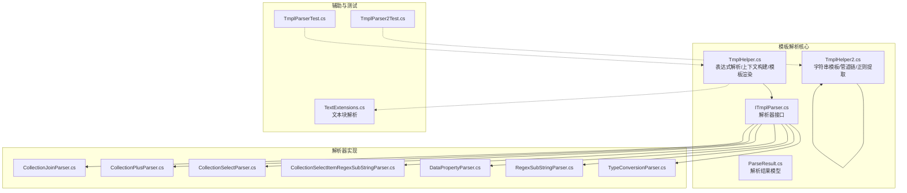
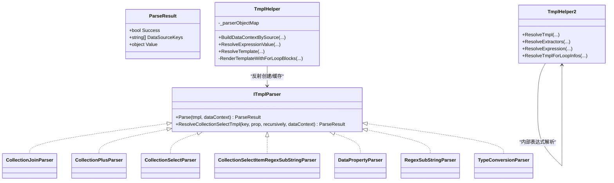
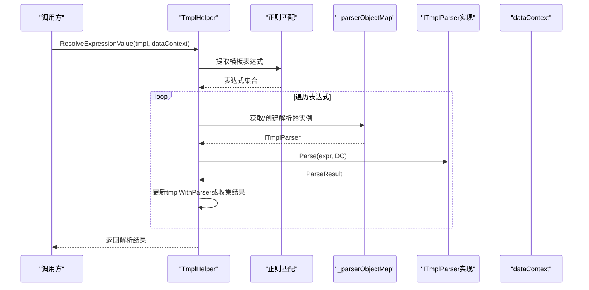
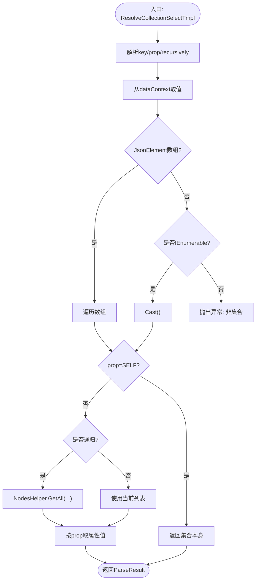
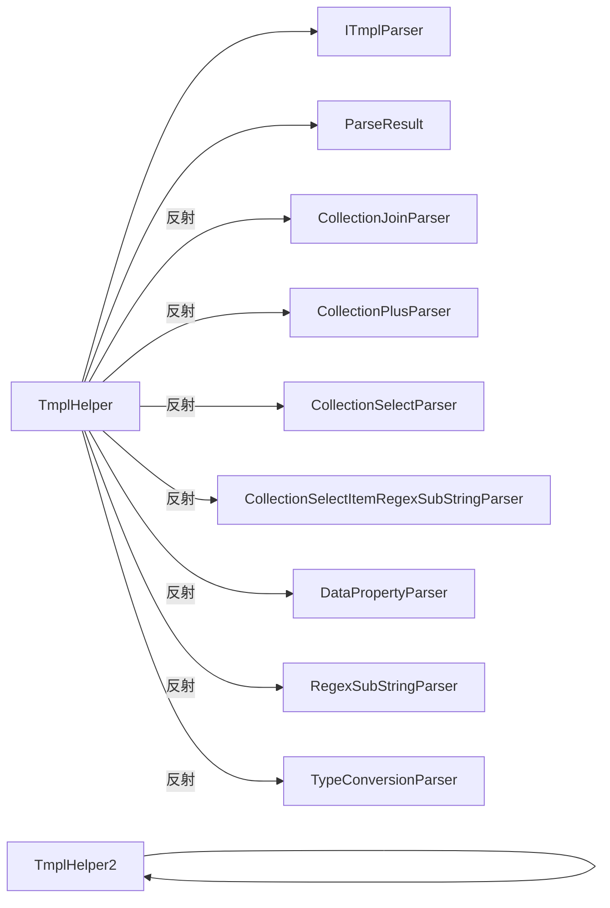

# 模板解析器扩展

<cite>
**本文档引用的文件**
- [ITmplParser.cs](file://Sylas.RemoteTasks.Utils/Template/Parser/ITmplParser.cs)
- [ParseResult.cs](file://Sylas.RemoteTasks.Utils/Template/Parser/ParseResult.cs)
- [TmplHelper.cs](file://Sylas.RemoteTasks.Utils/Template/TmplHelper.cs)
- [TmplHelper2.cs](file://Sylas.RemoteTasks.Utils/Template/TmplHelper2.cs)
- [CollectionJoinParser.cs](file://Sylas.RemoteTasks.Utils/Template/Parser/CollectionJoinParser.cs)
- [CollectionPlusParser.cs](file://Sylas.RemoteTasks.Utils/Template/Parser/CollectionPlusParser.cs)
- [CollectionSelectParser.cs](file://Sylas.RemoteTasks.Utils/Template/Parser/CollectionSelectParser.cs)
- [CollectionSelectItemRegexSubStringParser.cs](file://Sylas.RemoteTasks.Utils/Template/Parser/CollectionSelectItemRegexSubStringParser.cs)
- [DataPropertyParser.cs](file://Sylas.RemoteTasks.Utils/Template/Parser/DataPropertyParser.cs)
- [RegexSubStringParser.cs](file://Sylas.RemoteTasks.Utils/Template/Parser/RegexSubStringParser.cs)
- [TypeConversionParser.cs](file://Sylas.RemoteTasks.Utils/Template/Parser/TypeConversionParser.cs)
- [TextExtensions.cs](file://Sylas.RemoteTasks.Utils/Extensions/Text/TextExtensions.cs)
- [TmplParserTest.cs](file://Sylas.RemoteTasks.Test/Tmpl/TmplParserTest.cs)
- [TmplParser2Test.cs](file://Sylas.RemoteTasks.Test/Tmpl/TmplParser2Test.cs)
</cite>

## 目录
1. [简介](#简介)
2. [项目结构](#项目结构)
3. [核心组件](#核心组件)
4. [架构总览](#架构总览)
5. [详细组件分析](#详细组件分析)
6. [依赖分析](#依赖分析)
7. [性能考虑](#性能考虑)
8. [故障排除指南](#故障排除指南)
9. [结论](#结论)
10. [附录](#附录)

## 简介
本指南面向模板解析器扩展开发者，系统讲解如何实现 ITmplParser 接口，涵盖模板解析流程、语法分析、数据绑定机制；解释解析器的优先级管理与链式调用模式；提供集合处理解析器、正则表达式解析器、类型转换解析器等具体实现示例；并总结模板缓存、性能优化、错误处理等关键技术点，帮助解决模板解析中的复杂场景（嵌套解析、动态模板、集合选择与过滤、正则提取与转换）。

## 项目结构
模板解析能力主要位于 Utils 模块的 Template 与 Template/Parser 子目录中，并配套测试用例验证解析行为与边界条件。

图表来源
- [TmplHelper.cs](file://Sylas.RemoteTasks.Utils/Template/TmplHelper.cs#L1-L740)
- [TmplHelper2.cs](file://Sylas.RemoteTasks.Utils/Template/TmplHelper2.cs#L1-L416)
- [ITmplParser.cs](file://Sylas.RemoteTasks.Utils/Template/Parser/ITmplParser.cs#L1-L105)
- [ParseResult.cs](file://Sylas.RemoteTasks.Utils/Template/Parser/ParseResult.cs#L1-L42)
- [CollectionJoinParser.cs](file://Sylas.RemoteTasks.Utils/Template/Parser/CollectionJoinParser.cs#L1-L72)
- [CollectionPlusParser.cs](file://Sylas.RemoteTasks.Utils/Template/Parser/CollectionPlusParser.cs#L1-L69)
- [CollectionSelectParser.cs](file://Sylas.RemoteTasks.Utils/Template/Parser/CollectionSelectParser.cs#L1-L33)
- [CollectionSelectItemRegexSubStringParser.cs](file://Sylas.RemoteTasks.Utils/Template/Parser/CollectionSelectItemRegexSubStringParser.cs#L1-L64)
- [DataPropertyParser.cs](file://Sylas.RemoteTasks.Utils/Template/Parser/DataPropertyParser.cs#L1-L145)
- [RegexSubStringParser.cs](file://Sylas.RemoteTasks.Utils/Template/Parser/RegexSubStringParser.cs#L1-L39)
- [TypeConversionParser.cs](file://Sylas.RemoteTasks.Utils/Template/Parser/TypeConversionParser.cs#L1-L102)
- [TextExtensions.cs](file://Sylas.RemoteTasks.Utils/Extensions/Text/TextExtensions.cs#L1-L188)
- [TmplParserTest.cs](file://Sylas.RemoteTasks.Test/Tmpl/TmplParserTest.cs#L1-L425)
- [TmplParser2Test.cs](file://Sylas.RemoteTasks.Test/Tmpl/TmplParser2Test.cs#L1-L312)

章节来源
- [TmplHelper.cs](file://Sylas.RemoteTasks.Utils/Template/TmplHelper.cs#L1-L740)
- [TmplHelper2.cs](file://Sylas.RemoteTasks.Utils/Template/TmplHelper2.cs#L1-L416)

## 核心组件
- ITmplParser：定义解析器契约，统一 Parse 方法签名与静态工具方法（如集合选择解析）。
- ParseResult：封装解析结果，包含 Success、DataSourceKeys、Value。
- TmplHelper：负责表达式解析、上下文构建、模板渲染（含 for 循环块）、解析器实例缓存与反射加载。
- TmplHelper2：提供字符串模板解析、管道链式提取、正则提取、for 循环解析等能力。
- 解析器实现：CollectionJoinParser、CollectionPlusParser、CollectionSelectParser、CollectionSelectItemRegexSubStringParser、DataPropertyParser、RegexSubStringParser、TypeConversionParser。

章节来源
- [ITmplParser.cs](file://Sylas.RemoteTasks.Utils/Template/Parser/ITmplParser.cs#L1-L105)
- [ParseResult.cs](file://Sylas.RemoteTasks.Utils/Template/Parser/ParseResult.cs#L1-L42)
- [TmplHelper.cs](file://Sylas.RemoteTasks.Utils/Template/TmplHelper.cs#L1-L740)
- [TmplHelper2.cs](file://Sylas.RemoteTasks.Utils/Template/TmplHelper2.cs#L1-L416)

## 架构总览
模板解析采用“接口 + 多实现 + 工厂缓存 + 链式调用”的架构模式：

图表来源
- [ITmplParser.cs](file://Sylas.RemoteTasks.Utils/Template/Parser/ITmplParser.cs#L1-L105)
- [ParseResult.cs](file://Sylas.RemoteTasks.Utils/Template/Parser/ParseResult.cs#L1-L42)
- [TmplHelper.cs](file://Sylas.RemoteTasks.Utils/Template/TmplHelper.cs#L1-L740)
- [TmplHelper2.cs](file://Sylas.RemoteTasks.Utils/Template/TmplHelper2.cs#L1-L416)
- [CollectionJoinParser.cs](file://Sylas.RemoteTasks.Utils/Template/Parser/CollectionJoinParser.cs#L1-L72)
- [CollectionPlusParser.cs](file://Sylas.RemoteTasks.Utils/Template/Parser/CollectionPlusParser.cs#L1-L69)
- [CollectionSelectParser.cs](file://Sylas.RemoteTasks.Utils/Template/Parser/CollectionSelectParser.cs#L1-L33)
- [CollectionSelectItemRegexSubStringParser.cs](file://Sylas.RemoteTasks.Utils/Template/Parser/CollectionSelectItemRegexSubStringParser.cs#L1-L64)
- [DataPropertyParser.cs](file://Sylas.RemoteTasks.Utils/Template/Parser/DataPropertyParser.cs#L1-L145)
- [RegexSubStringParser.cs](file://Sylas.RemoteTasks.Utils/Template/Parser/RegexSubStringParser.cs#L1-L39)
- [TypeConversionParser.cs](file://Sylas.RemoteTasks.Utils/Template/Parser/TypeConversionParser.cs#L1-L102)

## 详细组件分析

### ITmplParser 接口与解析流程
- 角色职责
  - 定义统一 Parse(tmpl, dataContext) 签名，返回 ParseResult。
  - 提供静态工具方法 ResolveCollectionSelectTmpl，支持集合属性选择与递归展开。
- 解析流程
  - TmplHelper.ResolveExpressionValue 识别模板表达式，按需反射创建解析器实例并缓存于 _parserObjectMap。
  - 解析器 Parse 返回 ParseResult，若 DataSourceKeys 为空则视为未命中，否则根据 Success 与 Value 决定后续处理。
- 语法要点
  - 表达式格式：解析器名 + 方括号 + 表达式体，如 DataPropertyParser[$data[0].IDPATH]。
  - 支持字符串模板中的多表达式替换与数组展开生成多结果。

章节来源
- [ITmplParser.cs](file://Sylas.RemoteTasks.Utils/Template/Parser/ITmplParser.cs#L1-L105)
- [TmplHelper.cs](file://Sylas.RemoteTasks.Utils/Template/TmplHelper.cs#L461-L634)

### 解析器优先级与链式调用
- 优先级管理
  - TmplHelper.ResolveExpressionValue 对表达式进行匹配与解析，遇到 for 循环块时委托 RenderTemplateWithForLoopBlocks 渲染。
  - 解析器实例通过反射创建并缓存，避免重复反射开销。
- 链式调用模式
  - TmplHelper2 支持管道链式提取（以 | 分割），逐段解析并更新中间值。
  - TmplHelper 支持字符串模板中多表达式替换，数组表达式展开生成多字符串结果。

章节来源
- [TmplHelper.cs](file://Sylas.RemoteTasks.Utils/Template/TmplHelper.cs#L461-L719)
- [TmplHelper2.cs](file://Sylas.RemoteTasks.Utils/Template/TmplHelper2.cs#L39-L176)

### 数据绑定机制
- 数据上下文
  - TmplHelper.BuildDataContextBySource 将 source 以 $data 缓存到上下文中，支持变量赋值语句模板（如 $key=Parser[...]）。
  - TmplHelper.ResolveSelfTmplValues 支持上下文内变量自引用解析。
- 绑定规则
  - 解析器通过 dataContext 键名匹配目标数据，支持 JsonElement、JArray、IEnumerable、Dictionary 等多种类型。
  - 静态工具方法 ResolveCollectionSelectTmpl 支持 SELF 选择与递归展开。

章节来源
- [TmplHelper.cs](file://Sylas.RemoteTasks.Utils/Template/TmplHelper.cs#L213-L271)
- [ITmplParser.cs](file://Sylas.RemoteTasks.Utils/Template/Parser/ITmplParser.cs#L39-L102)

### 具体解析器实现示例

#### 集合处理解析器
- CollectionJoinParser
  - 功能：将集合按分隔符连接为字符串。
  - 语法：$key join separator。
  - 关键点：兼容 JsonElement 数组、IEnumerable、字符串类型。
- CollectionPlusParser
  - 功能：两个集合或值的合并。
  - 语法：$left + $right。
  - 关键点：自动将单值包装为集合，合并后返回列表。
- CollectionSelectParser
  - 功能：从集合中选取指定属性组成新集合。
  - 语法：$key select prop [-r]。
  - 关键点：委托静态工具方法 ResolveCollectionSelectTmpl，支持递归展开。
- CollectionSelectItemRegexSubStringParser
  - 功能：对集合属性选择结果再做正则分组提取。
  - 语法：$key select prop [-r] reg `pattern` group。
  - 关键点：先选属性，再对每个字符串项正则提取。

章节来源
- [CollectionJoinParser.cs](file://Sylas.RemoteTasks.Utils/Template/Parser/CollectionJoinParser.cs#L1-L72)
- [CollectionPlusParser.cs](file://Sylas.RemoteTasks.Utils/Template/Parser/CollectionPlusParser.cs#L1-L69)
- [CollectionSelectParser.cs](file://Sylas.RemoteTasks.Utils/Template/Parser/CollectionSelectParser.cs#L1-L33)
- [CollectionSelectItemRegexSubStringParser.cs](file://Sylas.RemoteTasks.Utils/Template/Parser/CollectionSelectItemRegexSubStringParser.cs#L1-L64)
- [ITmplParser.cs](file://Sylas.RemoteTasks.Utils/Template/Parser/ITmplParser.cs#L39-L102)

#### 属性与正则解析器
- DataPropertyParser
  - 功能：从对象或集合中按路径取值，支持索引与多级属性。
  - 语法：$key[index].prop1.prop2...。
  - 关键点：兼容 JsonElement、Dictionary、JObject、字符串 JSON 等。
- RegexSubStringParser
  - 功能：对字符串使用正则分组提取。
  - 语法：$key reg `pattern` group。
  - 关键点：从 dataContext 取值后正则匹配并返回分组值。

章节来源
- [DataPropertyParser.cs](file://Sylas.RemoteTasks.Utils/Template/Parser/DataPropertyParser.cs#L1-L145)
- [RegexSubStringParser.cs](file://Sylas.RemoteTasks.Utils/Template/Parser/RegexSubStringParser.cs#L1-L39)

#### 类型转换解析器
- TypeConversionParser
  - 功能：将字符串或 JsonElement 转换为 List 或 Object。
  - 语法：$key as List|Object。
  - 关键点：对 JsonElement 与 JArray 做分支处理，确保返回类型一致。

章节来源
- [TypeConversionParser.cs](file://Sylas.RemoteTasks.Utils/Template/Parser/TypeConversionParser.cs#L1-L102)

### 模板渲染与嵌套解析
- TmplHelper.ResolveTemplate
  - 支持 $for ... $forend 块，块内可嵌套循环；每次进入内层循环生成全新上下文，避免变量污染。
- TmplHelper2.ResolveTmplForLoopInfos
  - 支持 for(item in $collection){...} 语法，逐项渲染并忽略缺失变量。
- TextExtensions
  - 提供文本块解析能力，用于定位 for 循环块与行级信息。

章节来源
- [TmplHelper.cs](file://Sylas.RemoteTasks.Utils/Template/TmplHelper.cs#L339-L449)
- [TmplHelper.cs](file://Sylas.RemoteTasks.Utils/Template/TmplHelper.cs#L641-L719)
- [TmplHelper2.cs](file://Sylas.RemoteTasks.Utils/Template/TmplHelper2.cs#L369-L396)
- [TextExtensions.cs](file://Sylas.RemoteTasks.Utils/Extensions/Text/TextExtensions.cs#L1-L188)

### 解析流程时序图（表达式解析）

图表来源
- [TmplHelper.cs](file://Sylas.RemoteTasks.Utils/Template/TmplHelper.cs#L461-L634)

### 算法流程图（集合属性选择）

图表来源
- [ITmplParser.cs](file://Sylas.RemoteTasks.Utils/Template/Parser/ITmplParser.cs#L39-L102)

## 依赖分析
- 组件耦合
  - TmplHelper 依赖 ITmplParser 接口与反射机制，通过 _parserObjectMap 缓存解析器实例，降低反射成本。
  - 各解析器实现彼此独立，仅依赖公共扩展与通用类型（Dictionary、IEnumerable、JsonElement 等）。
- 外部依赖
  - Newtonsoft.Json/JToken 用于 JSON 解析与类型转换。
  - System.Text.RegularExpressions 用于表达式与正则匹配。
  - System.Text.Json 用于 JsonElement 与 JsonDocument 场景。

图表来源
- [TmplHelper.cs](file://Sylas.RemoteTasks.Utils/Template/TmplHelper.cs#L1-L740)
- [ITmplParser.cs](file://Sylas.RemoteTasks.Utils/Template/Parser/ITmplParser.cs#L1-L105)

章节来源
- [TmplHelper.cs](file://Sylas.RemoteTasks.Utils/Template/TmplHelper.cs#L1-L740)
- [ITmplParser.cs](file://Sylas.RemoteTasks.Utils/Template/Parser/ITmplParser.cs#L1-L105)

## 性能考虑
- 解析器实例缓存
  - TmplHelper 内部维护 _parserObjectMap，首次反射创建后复用，减少反射开销。
- 类型适配与最小转换
  - 优先使用 JsonElement/JsonDocument，避免不必要的 JObject/JArray 转换。
  - 集合处理尽量使用 LINQ 的延迟枚举，避免一次性装箱与复制。
- 正则与字符串替换
  - 在字符串模板解析中，先提取表达式再批量替换，减少重复匹配。
- 嵌套循环上下文隔离
  - 每次进入内层 for 循环均创建全新上下文字典，避免共享状态带来的额外查找与拷贝。

章节来源
- [TmplHelper.cs](file://Sylas.RemoteTasks.Utils/Template/TmplHelper.cs#L451-L452)
- [TmplHelper.cs](file://Sylas.RemoteTasks.Utils/Template/TmplHelper.cs#L641-L719)

## 故障排除指南
- 常见异常与定位
  - “未找到Parser”：检查解析器名称大小写与命名空间，确认反射可用。
  - “数据上下中未发现数据key”：确认 BuildDataContextBySource 中已注入 $data 与目标键。
  - “非集合无法执行Select操作”：确认集合类型（JsonElement 数组、JArray、IEnumerable）。
  - “正则提取r格式不正确”：检查 r(属性名,正则...) 语法与分隔符。
  - “for循环脚本解析错误/迭代对象解析异常”：检查 $for 语法与迭代变量类型。
- 日志与调试
  - TmplHelper.LogTmplResolving 提供上下文与中间结果日志，便于定位问题。
  - TmplHelper2.ResolveExtractors 支持 .add(...) 与管道链式提取，便于逐步验证中间值。

章节来源
- [TmplHelper.cs](file://Sylas.RemoteTasks.Utils/Template/TmplHelper.cs#L273-L307)
- [TmplHelper2.cs](file://Sylas.RemoteTasks.Utils/Template/TmplHelper2.cs#L89-L176)
- [TmplParserTest.cs](file://Sylas.RemoteTasks.Test/Tmpl/TmplParserTest.cs#L1-L425)
- [TmplParser2Test.cs](file://Sylas.RemoteTasks.Test/Tmpl/TmplParser2Test.cs#L1-L312)

## 结论
通过 ITmplParser 接口与多实现解析器，结合 TmplHelper/TmplHelper2 的表达式解析、上下文构建与模板渲染能力，可高效实现复杂模板解析场景。建议在扩展新解析器时遵循统一的语法约定、错误处理与返回规范，并充分利用缓存与类型适配策略提升性能与稳定性。

## 附录
- 测试用例参考
  - TmplParserTest：覆盖 DataPropertyParser、TypeConversionParser、CollectionSelectParser、CollectionJoinParser、CollectionSelectItemRegexSubStringParser、for 循环等场景。
  - TmplParser2Test：覆盖 TmplHelper2 的字符串模板、管道链、正则提取、for 循环等场景。

章节来源
- [TmplParserTest.cs](file://Sylas.RemoteTasks.Test/Tmpl/TmplParserTest.cs#L1-L425)
- [TmplParser2Test.cs](file://Sylas.RemoteTasks.Test/Tmpl/TmplParser2Test.cs#L1-L312)