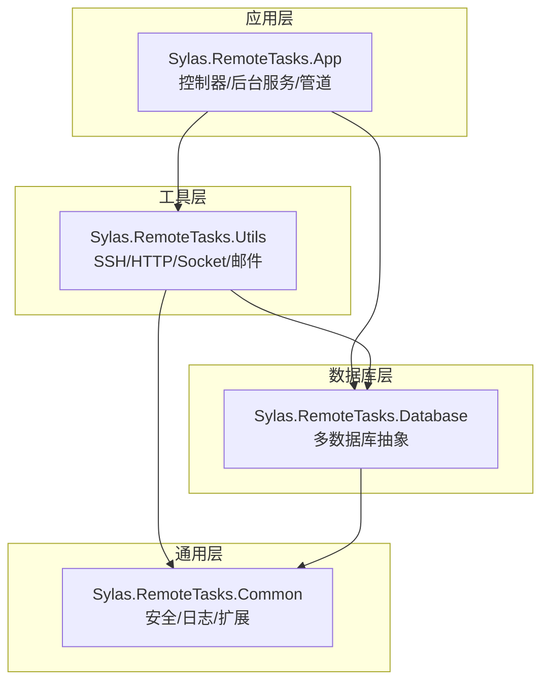
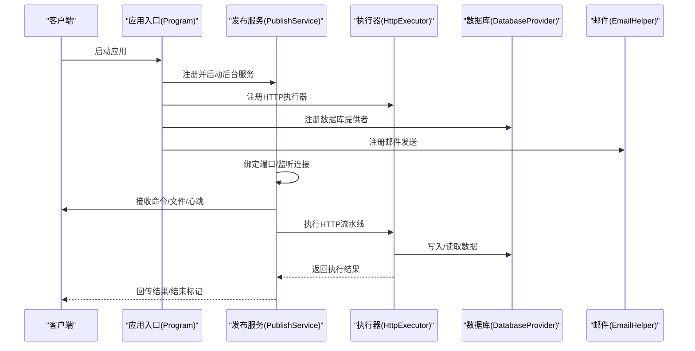
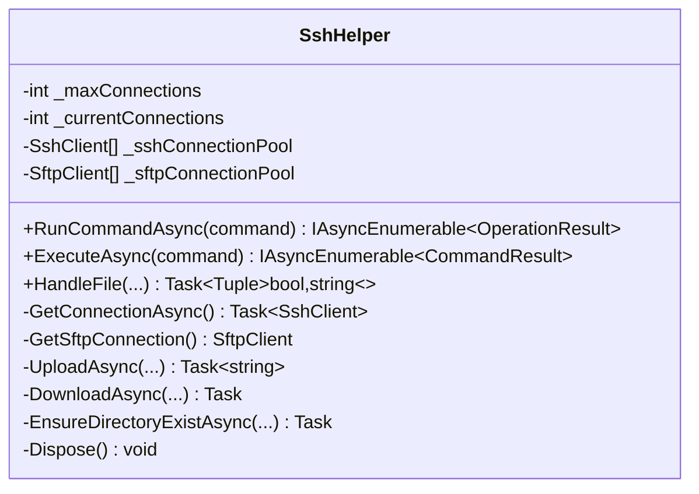
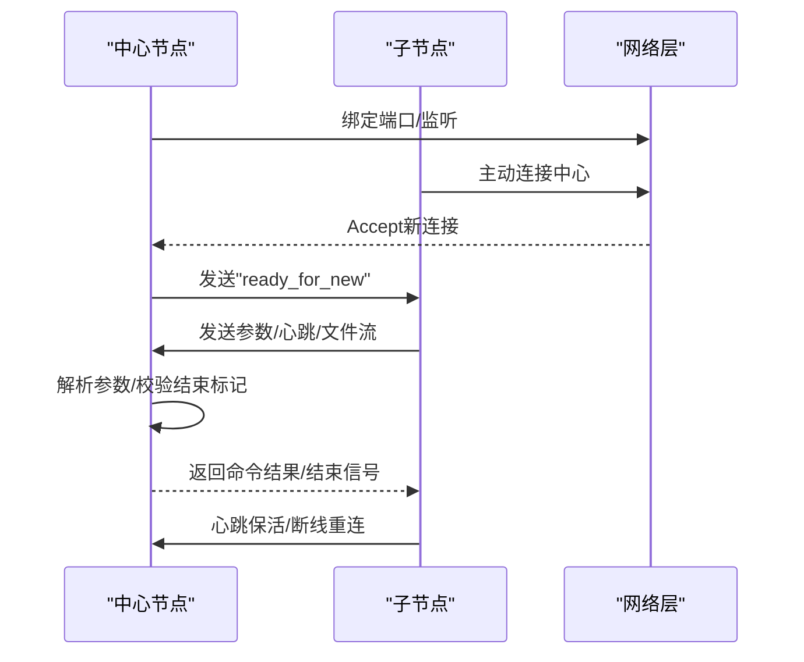
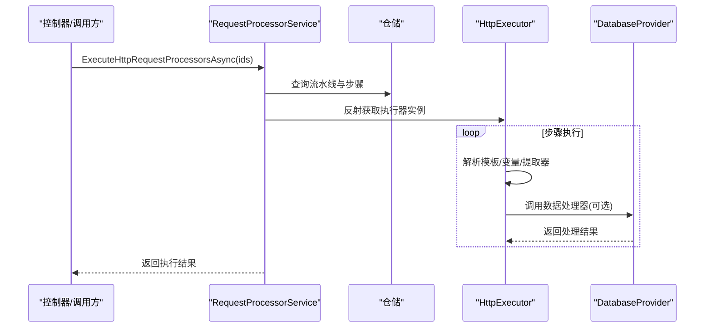
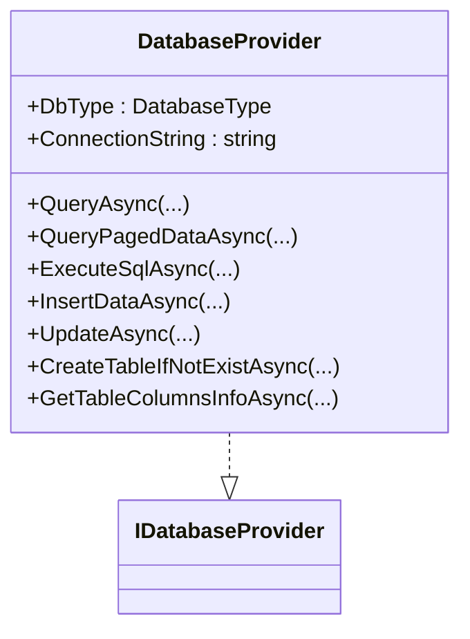
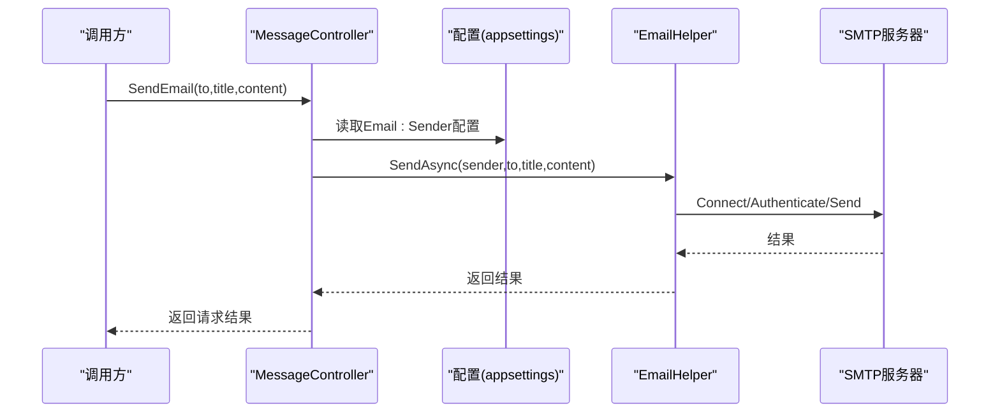
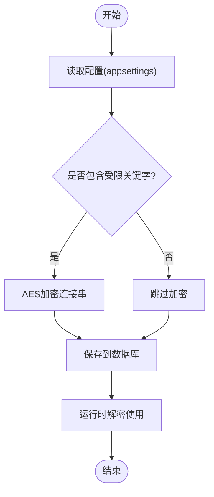
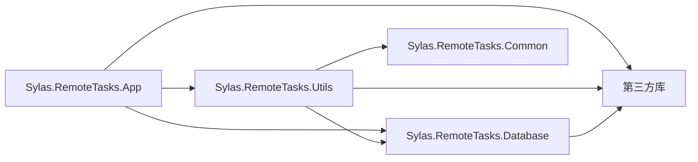

# 第三方集成开发

<cite>
**本文档引用的文件**
- [Program.cs](file://Sylas.RemoteTasks.App/Program.cs)
- [appsettings.json](file://Sylas.RemoteTasks.App/appsettings.json)
- [SshHelper.cs](file://Sylas.RemoteTasks.Utils/CommandExecutor/SshHelper.cs)
- [SocketHelper.cs](file://Sylas.RemoteTasks.Utils/SocketHelper.cs)
- [DatabaseProvider.cs](file://Sylas.RemoteTasks.Database/DatabaseProvider.cs)
- [DatabaseController.cs](file://Sylas.RemoteTasks.App/Controllers/DatabaseController.cs)
- [MessageController.cs](file://Sylas.RemoteTasks.App/Controllers/MessageController.cs)
- [EmailHelper.cs](file://Sylas.RemoteTasks.Utils/Message/EmailHelper.cs)
- [RequestProcessorService.cs](file://Sylas.RemoteTasks.App/RequestProcessor/RequestProcessorService.cs)
- [SecurityHelper.cs](file://Sylas.RemoteTasks.Common/SecurityHelper.cs)
- [PublishService.cs](file://Sylas.RemoteTasks.App/BackgroundServices/PublishService.cs)
- [DotNETOperation.cs](file://Sylas.RemoteTasks.App/Infrastructure/DotNETOperation.cs)
- [HttpExecutor.cs](file://Sylas.RemoteTasks.Utils/CommandExecutor/HttpExecutor.cs)
- [Sylas.RemoteTasks.App.csproj](file://Sylas.RemoteTasks.App/Sylas.RemoteTasks.App.csproj)
- [Sylas.RemoteTasks.Utils.csproj](file://Sylas.RemoteTasks.Utils/Sylas.RemoteTasks.Utils.csproj)
- [Sylas.RemoteTasks.Database.csproj](file://Sylas.RemoteTasks.Database/Sylas.RemoteTasks.Database.csproj)
</cite>

## 目录
1. [简介](#简介)
2. [项目结构](#项目结构)
3. [核心组件](#核心组件)
4. [架构总览](#架构总览)
5. [详细组件分析](#详细组件分析)
6. [依赖分析](#依赖分析)
7. [性能考虑](#性能考虑)
8. [故障排查指南](#故障排查指南)
9. [结论](#结论)
10. [附录](#附录)

## 简介
本指南面向第三方集成开发，围绕远程任务系统中的外部系统与服务集成能力，系统讲解如何对接 SSH 远程连接与文件传输、TCP 网络通信、数据库中间件、消息队列（邮件）以及 HTTP 请求流水线。文档涵盖第三方库引入、配置管理、异常处理、安全性、性能优化与故障恢复等关键主题，并提供可落地的集成步骤与最佳实践。

## 项目结构
该项目采用多项目分层架构，核心模块包括：
- 应用层：Sylas.RemoteTasks.App（ASP.NET Core Web 应用）
- 工具层：Sylas.RemoteTasks.Utils（通用工具与第三方库封装）
- 数据库层：Sylas.RemoteTasks.Database（数据库抽象与多厂商支持）
- 通用层：Sylas.RemoteTasks.Common（通用工具与安全）

图表来源
- [Sylas.RemoteTasks.App.csproj](file://Sylas.RemoteTasks.App/Sylas.RemoteTasks.App.csproj#L1-L61)
- [Sylas.RemoteTasks.Utils.csproj](file://Sylas.RemoteTasks.Utils/Sylas.RemoteTasks.Utils.csproj#L1-L47)
- [Sylas.RemoteTasks.Database.csproj](file://Sylas.RemoteTasks.Database/Sylas.RemoteTasks.Database.csproj#L1-L52)

章节来源
- [Program.cs](file://Sylas.RemoteTasks.App/Program.cs#L1-L122)
- [Sylas.RemoteTasks.App.csproj](file://Sylas.RemoteTasks.App/Sylas.RemoteTasks.App.csproj#L1-L61)

## 核心组件
- SSH 远程连接与文件传输：基于 SSH.NET 的 SshHelper，支持连接池、SFTP 上传下载、远程命令执行与文件处理。
- TCP 网络通信：基于 Socket 的 PublishService，实现中心节点与子节点的长连接、心跳、命令下发与结果回传。
- HTTP 请求流水线：HttpExecutor 与 RequestProcessorService，支持多请求编排、模板变量解析、响应提取与数据处理器。
- 数据库中间件：DatabaseProvider 与多数据库驱动（SQL Server、MySQL、PostgreSQL、Oracle、SQLite），统一查询与分页。
- 消息队列（邮件）：MailKit 集成，通过 EmailHelper 实现 SMTP 发送。
- 安全与配置：SecurityHelper 提供 AES 加密/解密；appsettings.json 管理连接串与服务配置。

章节来源
- [SshHelper.cs](file://Sylas.RemoteTasks.Utils/CommandExecutor/SshHelper.cs#L1-L619)
- [SocketHelper.cs](file://Sylas.RemoteTasks.Utils/SocketHelper.cs#L1-L364)
- [PublishService.cs](file://Sylas.RemoteTasks.App/BackgroundServices/PublishService.cs#L1-L645)
- [HttpExecutor.cs](file://Sylas.RemoteTasks.Utils/CommandExecutor/HttpExecutor.cs#L1-L258)
- [RequestProcessorService.cs](file://Sylas.RemoteTasks.App/RequestProcessor/RequestProcessorService.cs#L1-L72)
- [DatabaseProvider.cs](file://Sylas.RemoteTasks.Database/DatabaseProvider.cs#L1-L485)
- [EmailHelper.cs](file://Sylas.RemoteTasks.Utils/Message/EmailHelper.cs#L1-L77)
- [SecurityHelper.cs](file://Sylas.RemoteTasks.Common/SecurityHelper.cs#L1-L228)
- [appsettings.json](file://Sylas.RemoteTasks.App/appsettings.json#L1-L142)

## 架构总览
系统通过依赖注入与后台服务实现跨系统的集成与编排：
- Program.cs 注册 HTTP 客户端、SignalR、缓存、鉴权、Executor、DataHandler、数据库提供者与后台服务。
- PublishService 作为 TCP 服务端与客户端，负责节点间通信与心跳。
- HttpExecutor 与 RequestProcessorService 负责 HTTP 请求流水线与数据处理。
- DatabaseProvider 统一数据库访问，支持多厂商。
- EmailHelper 通过 MailKit 发送邮件。

图表来源
- [Program.cs](file://Sylas.RemoteTasks.App/Program.cs#L1-L122)
- [PublishService.cs](file://Sylas.RemoteTasks.App/BackgroundServices/PublishService.cs#L1-L645)
- [HttpExecutor.cs](file://Sylas.RemoteTasks.Utils/CommandExecutor/HttpExecutor.cs#L1-L258)
- [DatabaseProvider.cs](file://Sylas.RemoteTasks.Database/DatabaseProvider.cs#L1-L485)
- [EmailHelper.cs](file://Sylas.RemoteTasks.Utils/Message/EmailHelper.cs#L1-L77)

## 详细组件分析

### SSH 远程连接与文件传输（SshHelper）
- 连接池与并发控制：维护 SSH/SFTP 连接池，最大连接数限制，线程安全获取与归还连接。
- 命令执行：支持批量命令拆分与逐段执行，远程脚本临时文件上传与清理。
- 文件传输：支持目录/文件上传下载，包含包含/排除规则、远程目录确保、断点续传友好设计。
- 异常处理：连接断开自动重连、空连接保护、异常日志输出。

图表来源
- [SshHelper.cs](file://Sylas.RemoteTasks.Utils/CommandExecutor/SshHelper.cs#L1-L619)

章节来源
- [SshHelper.cs](file://Sylas.RemoteTasks.Utils/CommandExecutor/SshHelper.cs#L1-L619)

### TCP 网络通信（PublishService + SocketHelper）
- 服务端：绑定端口、Accept 循环、子线程处理每个客户端；支持文件传输协议（含结束标记）、心跳检测、断线重连。
- 客户端：子节点主动连接中心服务器，保持心跳，接收命令、执行并回传结果。
- SocketHelper：提供端口扫描、WOL、文本收发、心跳识别、关闭通知等底层能力。

图表来源
- [PublishService.cs](file://Sylas.RemoteTasks.App/BackgroundServices/PublishService.cs#L1-L645)
- [SocketHelper.cs](file://Sylas.RemoteTasks.Utils/SocketHelper.cs#L1-L364)

章节来源
- [PublishService.cs](file://Sylas.RemoteTasks.App/BackgroundServices/PublishService.cs#L1-L645)
- [SocketHelper.cs](file://Sylas.RemoteTasks.Utils/SocketHelper.cs#L1-L364)

### HTTP 请求流水线（HttpExecutor + RequestProcessorService）
- HttpExecutor：支持单请求、多线程压力测试、请求流程编排、模板变量解析、响应提取与数据处理器调用。
- RequestProcessorService：按配置加载流水线步骤，动态反射获取执行器实例，传递 DataContext，持久化步骤状态。

图表来源
- [RequestProcessorService.cs](file://Sylas.RemoteTasks.App/RequestProcessor/RequestProcessorService.cs#L1-L72)
- [HttpExecutor.cs](file://Sylas.RemoteTasks.Utils/CommandExecutor/HttpExecutor.cs#L1-L258)
- [DatabaseProvider.cs](file://Sylas.RemoteTasks.Database/DatabaseProvider.cs#L1-L485)

章节来源
- [RequestProcessorService.cs](file://Sylas.RemoteTasks.App/RequestProcessor/RequestProcessorService.cs#L1-L72)
- [HttpExecutor.cs](file://Sylas.RemoteTasks.Utils/CommandExecutor/HttpExecutor.cs#L1-L258)

### 数据库中间件集成（DatabaseProvider + 多数据库驱动）
- 统一接口：DatabaseProvider 提供查询、分页、插入、更新、建表、列信息等统一方法。
- 多厂商支持：通过项目引用的数据库驱动（SQL Server、MySQL、PostgreSQL、Oracle、SQLite）实现多数据库适配。
- 安全配置：连接串加密存储，运行时解密使用。

图表来源
- [DatabaseProvider.cs](file://Sylas.RemoteTasks.Database/DatabaseProvider.cs#L1-L485)

章节来源
- [DatabaseProvider.cs](file://Sylas.RemoteTasks.Database/DatabaseProvider.cs#L1-L485)
- [Sylas.RemoteTasks.Database.csproj](file://Sylas.RemoteTasks.Database/Sylas.RemoteTasks.Database.csproj#L1-L52)

### 消息队列（邮件）集成（EmailHelper + MessageController）
- 邮件发送：MailKit 通过 SMTP 发送 HTML 邮件，支持单发与群发。
- 控制器接入：MessageController 读取配置，调用 EmailHelper 发送邮件。

图表来源
- [MessageController.cs](file://Sylas.RemoteTasks.App/Controllers/MessageController.cs#L1-L18)
- [EmailHelper.cs](file://Sylas.RemoteTasks.Utils/Message/EmailHelper.cs#L1-L77)
- [appsettings.json](file://Sylas.RemoteTasks.App/appsettings.json#L125-L140)

章节来源
- [MessageController.cs](file://Sylas.RemoteTasks.App/Controllers/MessageController.cs#L1-L18)
- [EmailHelper.cs](file://Sylas.RemoteTasks.Utils/Message/EmailHelper.cs#L1-L77)
- [appsettings.json](file://Sylas.RemoteTasks.App/appsettings.json#L125-L140)

### 安全与配置（SecurityHelper + appsettings.json）
- 连接串加密：DatabaseController 在入库时对敏感连接串进行 AES 加密，运行时解密使用。
- 配置项：appsettings.json 管理日志、全局热键、连接串、TCP/中心服务器、AI配置、Kestrel、请求流水线、身份认证、进程监控、邮件等。

图表来源
- [DatabaseController.cs](file://Sylas.RemoteTasks.App/Controllers/DatabaseController.cs#L1-L235)
- [SecurityHelper.cs](file://Sylas.RemoteTasks.Common/SecurityHelper.cs#L1-L228)
- [appsettings.json](file://Sylas.RemoteTasks.App/appsettings.json#L1-L142)

章节来源
- [DatabaseController.cs](file://Sylas.RemoteTasks.App/Controllers/DatabaseController.cs#L1-L235)
- [SecurityHelper.cs](file://Sylas.RemoteTasks.Common/SecurityHelper.cs#L1-L228)
- [appsettings.json](file://Sylas.RemoteTasks.App/appsettings.json#L1-L142)

## 依赖分析
- 应用层依赖工具层与数据库层，工具层依赖数据库层与通用层。
- 第三方库包括：SSH.NET（SSH/SFTP）、MailKit（SMTP）、Microsoft.Extensions.Http（HTTP 客户端工厂）、Roslyn（代码生成与修改）、RazorEngine（模板引擎）、多数据库驱动（MySql.Data、Npgsql、System.Data.SqlClient 等）。

图表来源
- [Sylas.RemoteTasks.App.csproj](file://Sylas.RemoteTasks.App/Sylas.RemoteTasks.App.csproj#L1-L61)
- [Sylas.RemoteTasks.Utils.csproj](file://Sylas.RemoteTasks.Utils/Sylas.RemoteTasks.Utils.csproj#L1-L47)
- [Sylas.RemoteTasks.Database.csproj](file://Sylas.RemoteTasks.Database/Sylas.RemoteTasks.Database.csproj#L1-L52)

章节来源
- [Sylas.RemoteTasks.App.csproj](file://Sylas.RemoteTasks.App/Sylas.RemoteTasks.App.csproj#L1-L61)
- [Sylas.RemoteTasks.Utils.csproj](file://Sylas.RemoteTasks.Utils/Sylas.RemoteTasks.Utils.csproj#L1-L47)
- [Sylas.RemoteTasks.Database.csproj](file://Sylas.RemoteTasks.Database/Sylas.RemoteTasks.Database.csproj#L1-L52)

## 性能考虑
- 连接池与并发：SshHelper 的连接池与并发限制避免资源耗尽；建议根据目标主机性能调整最大连接数。
- 流式传输：TCP 文件传输采用分块接收与结束标记，减少内存峰值；建议结合断点续传策略。
- HTTP 并行：HttpExecutor 支持多线程请求并行，注意目标服务限流与自身资源占用。
- 数据库批处理：DatabaseProvider 的分页查询与参数化 SQL 提升查询效率；避免一次性加载大结果集。
- 缓存与日志：合理使用缓存与异步日志，避免阻塞主线程。

## 故障排查指南
- SSH 连接异常
  - 现象：连接断开、命令执行失败。
  - 排查：检查私钥路径、主机可达性、端口与防火墙；查看 SshHelper 的重连逻辑与异常日志。
  - 参考：[SshHelper.cs](file://Sylas.RemoteTasks.Utils/CommandExecutor/SshHelper.cs#L1-L619)
- TCP 心跳与断线
  - 现象：长时间无响应、连接被中心节点释放。
  - 排查：确认心跳频率、日志记录、断线重连策略；检查子节点与中心节点网络连通性。
  - 参考：[PublishService.cs](file://Sylas.RemoteTasks.App/BackgroundServices/PublishService.cs#L1-L645)
- HTTP 请求失败
  - 现象：流水线中断、响应不匹配。
  - 排查：核对 isSuccess 模板、请求 URL/Headers/Body 模板解析、数据处理器参数；查看日志输出。
  - 参考：[HttpExecutor.cs](file://Sylas.RemoteTasks.Utils/CommandExecutor/HttpExecutor.cs#L1-L258)
- 数据库连接问题
  - 现象：连接串无效、解密失败、SQL 执行异常。
  - 排查：确认加密/解密流程、连接串关键字白名单、数据库驱动版本；检查连接串是否包含受限关键字。
  - 参考：[DatabaseController.cs](file://Sylas.RemoteTasks.App/Controllers/DatabaseController.cs#L1-L235)、[SecurityHelper.cs](file://Sylas.RemoteTasks.Common/SecurityHelper.cs#L1-L228)
- 邮件发送失败
  - 现象：SMTP 连接/认证失败。
  - 排查：核对 SMTP 地址、端口、SSL 设置、发件人凭据；查看异常日志。
  - 参考：[EmailHelper.cs](file://Sylas.RemoteTasks.Utils/Message/EmailHelper.cs#L1-L77)

章节来源
- [SshHelper.cs](file://Sylas.RemoteTasks.Utils/CommandExecutor/SshHelper.cs#L1-L619)
- [PublishService.cs](file://Sylas.RemoteTasks.App/BackgroundServices/PublishService.cs#L1-L645)
- [HttpExecutor.cs](file://Sylas.RemoteTasks.Utils/CommandExecutor/HttpExecutor.cs#L1-L258)
- [DatabaseController.cs](file://Sylas.RemoteTasks.App/Controllers/DatabaseController.cs#L1-L235)
- [SecurityHelper.cs](file://Sylas.RemoteTasks.Common/SecurityHelper.cs#L1-L228)
- [EmailHelper.cs](file://Sylas.RemoteTasks.Utils/Message/EmailHelper.cs#L1-L77)

## 结论
本系统通过模块化的第三方库集成，提供了完善的远程连接、网络通信、HTTP 流水线、数据库访问与邮件发送能力。遵循本文的安全、性能与故障排查建议，可高效完成第三方系统的对接与运维。

## 附录

### 集成步骤示例（无代码，仅流程）
- SSH 远程连接与文件传输
  - 步骤：配置主机、用户名、私钥；初始化 SshHelper；获取连接/上传/下载/执行命令；归还连接。
  - 参考：[SshHelper.cs](file://Sylas.RemoteTasks.Utils/CommandExecutor/SshHelper.cs#L1-L619)
- TCP 节点通信
  - 步骤：中心节点绑定端口监听；子节点连接并发送参数；双方心跳保活；命令下发与结果回传。
  - 参考：[PublishService.cs](file://Sylas.RemoteTasks.App/BackgroundServices/PublishService.cs#L1-L645)
- HTTP 请求流水线
  - 步骤：编写流水线配置；解析模板变量；发送请求；提取响应；调用数据处理器；持久化步骤。
  - 参考：[HttpExecutor.cs](file://Sylas.RemoteTasks.Utils/CommandExecutor/HttpExecutor.cs#L1-L258)、[RequestProcessorService.cs](file://Sylas.RemoteTasks.App/RequestProcessor/RequestProcessorService.cs#L1-L72)
- 数据库中间件
  - 步骤：配置连接串（加密存储）；选择数据库类型；执行查询/分页/插入/更新；建表与列信息获取。
  - 参考：[DatabaseProvider.cs](file://Sylas.RemoteTasks.Database/DatabaseProvider.cs#L1-L485)
- 邮件发送
  - 步骤：配置发件人信息；调用 EmailHelper 发送；处理异常与日志。
  - 参考：[EmailHelper.cs](file://Sylas.RemoteTasks.Utils/Message/EmailHelper.cs#L1-L77)