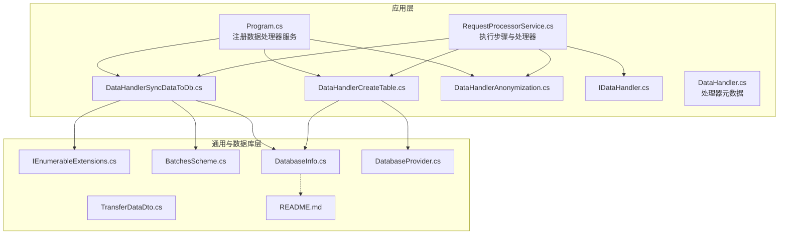
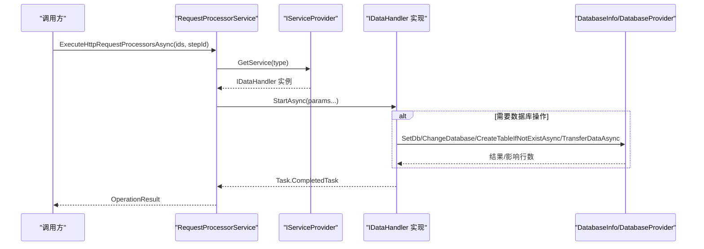
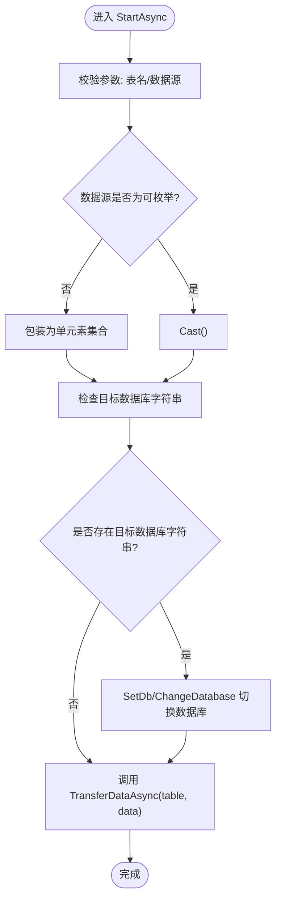
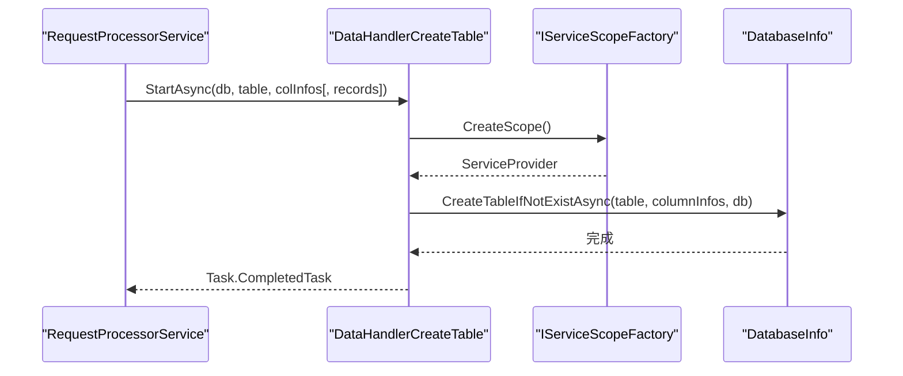
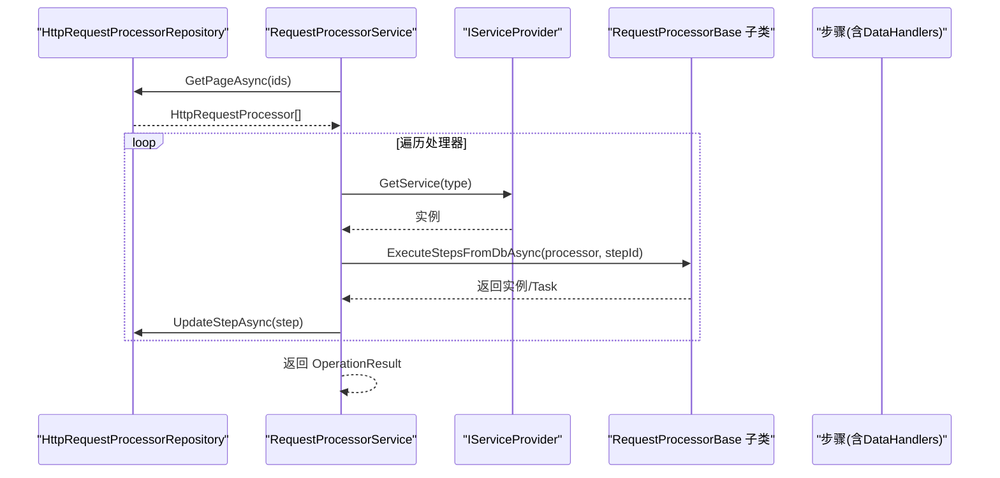
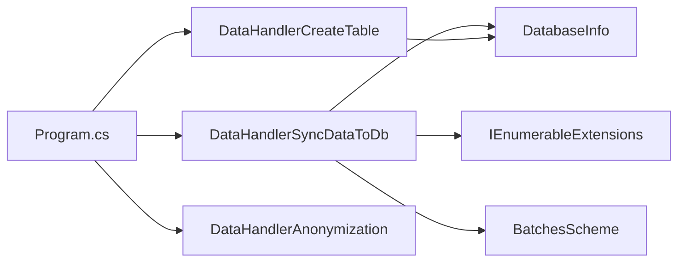

# 自定义数据处理器

<cite>
**本文引用的文件**
- [IDataHandler.cs](file://Sylas.RemoteTasks.App/DataHandlers/IDataHandler.cs)
- [DataHandler.cs](file://Sylas.RemoteTasks.App/DataHandlers/DataHandler.cs)
- [DataHandlerAnonymization.cs](file://Sylas.RemoteTasks.App/DataHandlers/DataHandlerAnonymization.cs)
- [DataHandlerCreateTable.cs](file://Sylas.RemoteTasks.App/DataHandlers/DataHandlerCreateTable.cs)
- [DataHandlerSyncDataToDb.cs](file://Sylas.RemoteTasks.App/DataHandlers/DataHandlerSyncDataToDb.cs)
- [Program.cs](file://Sylas.RemoteTasks.App/Program.cs)
- [RequestProcessorService.cs](file://Sylas.RemoteTasks.App/RequestProcessor/RequestProcessorService.cs)
- [HttpRequestProcessorStepDataHandlers.cs](file://Sylas.RemoteTasks.App/RequestProcessor/Models/HttpRequestProcessorStepDataHandlers.cs)
- [HttpRequestProcessorStepDataHandlerCreateDto.cs](file://Sylas.RemoteTasks.App/RequestProcessor/Models/Dtos/HttpRequestProcessorStepDataHandlerCreateDto.cs)
- [IEnumerableExtensions.cs](file://Sylas.RemoteTasks.Common/Extensions/IEnumerableExtensions.cs)
- [BatchesScheme.cs](file://Sylas.RemoteTasks.Common/BatchesScheme.cs)
- [DatabaseInfo.cs](file://Sylas.RemoteTasks.Database/SyncBase/DatabaseInfo.cs)
- [DatabaseProvider.cs](file://Sylas.RemoteTasks.Database/DatabaseProvider.cs)
- [TransferDataDto.cs](file://Sylas.RemoteTasks.Database/Dtos/TransferDataDto.cs)
- [README.md](file://Sylas.RemoteTasks.Database/README.md)
</cite>

## 目录
1. [简介](#简介)
2. [项目结构](#项目结构)
3. [核心组件](#核心组件)
4. [架构总览](#架构总览)
5. [详细组件分析](#详细组件分析)
6. [依赖分析](#依赖分析)
7. [性能考虑](#性能考虑)
8. [故障排查指南](#故障排查指南)
9. [结论](#结论)
10. [附录](#附录)

## 简介
本指南面向需要在远程任务系统中开发“自定义数据处理器”的开发者，围绕 IDataHandler 接口的实现、数据处理流程、异步处理模式与错误处理机制展开；并结合现有实现，给出生命周期管理、依赖注入配置、并发安全、性能优化与内存管理等方面的实践建议。文中还提供了数据同步处理器、表创建处理器、数据匿名化处理器等具体实现示例的解析路径，以及数据验证、批量处理、进度跟踪等关键能力的实现思路。

## 项目结构
数据处理器位于应用层的 DataHandlers 命名空间内，统一实现 IDataHandler 接口，并通过依赖注入在 Program.cs 中注册为瞬态服务。请求处理器 RequestProcessorService 负责从数据库加载步骤与数据处理器配置，反射获取处理器类型并通过 IServiceProvider 解析实例，按顺序执行 StartAsync 并传递参数。

图表来源
- [Program.cs](file://Sylas.RemoteTasks.App/Program.cs#L50-L53)
- [RequestProcessorService.cs](file://Sylas.RemoteTasks.App/RequestProcessor/RequestProcessorService.cs#L11-L69)
- [IDataHandler.cs](file://Sylas.RemoteTasks.App/DataHandlers/IDataHandler.cs#L1-L8)
- [DataHandlerSyncDataToDb.cs](file://Sylas.RemoteTasks.App/DataHandlers/DataHandlerSyncDataToDb.cs#L1-L65)
- [DataHandlerCreateTable.cs](file://Sylas.RemoteTasks.App/DataHandlers/DataHandlerCreateTable.cs#L1-L34)
- [DataHandlerAnonymization.cs](file://Sylas.RemoteTasks.App/DataHandlers/DataHandlerAnonymization.cs#L1-L42)
- [IEnumerableExtensions.cs](file://Sylas.RemoteTasks.Common/Extensions/IEnumerableExtensions.cs#L1-L69)
- [BatchesScheme.cs](file://Sylas.RemoteTasks.Common/BatchesScheme.cs#L1-L63)
- [DatabaseInfo.cs](file://Sylas.RemoteTasks.Database/SyncBase/DatabaseInfo.cs#L761-L1542)
- [DatabaseProvider.cs](file://Sylas.RemoteTasks.Database/DatabaseProvider.cs#L442-L475)
- [TransferDataDto.cs](file://Sylas.RemoteTasks.Database/Dtos/TransferDataDto.cs#L1-L29)
- [README.md](file://Sylas.RemoteTasks.Database/README.md#L1-L24)

章节来源
- [Program.cs](file://Sylas.RemoteTasks.App/Program.cs#L50-L53)
- [RequestProcessorService.cs](file://Sylas.RemoteTasks.App/RequestProcessor/RequestProcessorService.cs#L11-L69)

## 核心组件
- IDataHandler 接口：定义异步启动方法 StartAsync(params object[])，作为所有数据处理器的统一契约。
- DataHandlerInfo：用于描述处理器名称、参数列表与执行顺序的元数据结构。
- DataHandlerSyncDataToDb：将数据写入目标数据库，支持连接串或数据库切换、单条或多条数据、可选主键字段。
- DataHandlerCreateTable：基于列信息创建目标表，支持跨库创建。
- DataHandlerAnonymization：对 JSON 数据中的指定字段进行脱敏处理。
- RequestProcessorService：负责加载处理器步骤、反射解析处理器类型、调用 StartAsync 并维护 DataContext。
- IEnumerableExtensions：提供集合分块、字典化等常用扩展，便于批量处理与数据转换。
- BatchesScheme：提供 CPU 密集型任务的多批次并发执行方案。
- DatabaseInfo/DatabaseProvider：提供数据库连接、表创建、数据迁移、分页查询等底层能力。

章节来源
- [IDataHandler.cs](file://Sylas.RemoteTasks.App/DataHandlers/IDataHandler.cs#L1-L8)
- [DataHandler.cs](file://Sylas.RemoteTasks.App/DataHandlers/DataHandler.cs#L1-L16)
- [DataHandlerSyncDataToDb.cs](file://Sylas.RemoteTasks.App/DataHandlers/DataHandlerSyncDataToDb.cs#L1-L65)
- [DataHandlerCreateTable.cs](file://Sylas.RemoteTasks.App/DataHandlers/DataHandlerCreateTable.cs#L1-L34)
- [DataHandlerAnonymization.cs](file://Sylas.RemoteTasks.App/DataHandlers/DataHandlerAnonymization.cs#L1-L42)
- [RequestProcessorService.cs](file://Sylas.RemoteTasks.App/RequestProcessor/RequestProcessorService.cs#L11-L69)
- [IEnumerableExtensions.cs](file://Sylas.RemoteTasks.Common/Extensions/IEnumerableExtensions.cs#L1-L69)
- [BatchesScheme.cs](file://Sylas.RemoteTasks.Common/BatchesScheme.cs#L1-L63)
- [DatabaseInfo.cs](file://Sylas.RemoteTasks.Database/SyncBase/DatabaseInfo.cs#L761-L1542)
- [DatabaseProvider.cs](file://Sylas.RemoteTasks.Database/DatabaseProvider.cs#L442-L475)

## 架构总览
数据处理器的执行链路如下：请求处理器加载步骤与处理器配置，反射获取处理器类型，通过 IServiceProvider 获取实例，传入参数调用 StartAsync。处理器内部可使用 DatabaseInfo/DatabaseProvider 进行数据库操作，或对数据进行转换与脱敏。

图表来源
- [RequestProcessorService.cs](file://Sylas.RemoteTasks.App/RequestProcessor/RequestProcessorService.cs#L11-L69)
- [IDataHandler.cs](file://Sylas.RemoteTasks.App/DataHandlers/IDataHandler.cs#L1-L8)
- [DataHandlerSyncDataToDb.cs](file://Sylas.RemoteTasks.App/DataHandlers/DataHandlerSyncDataToDb.cs#L17-L62)
- [DataHandlerCreateTable.cs](file://Sylas.RemoteTasks.App/DataHandlers/DataHandlerCreateTable.cs#L17-L31)
- [DatabaseInfo.cs](file://Sylas.RemoteTasks.Database/SyncBase/DatabaseInfo.cs#L761-L1542)
- [DatabaseProvider.cs](file://Sylas.RemoteTasks.Database/DatabaseProvider.cs#L442-L475)

## 详细组件分析

### IDataHandler 接口与生命周期
- 契约：StartAsync(params object[]) 返回 Task，要求实现为异步处理。
- 生命周期：处理器以瞬态服务注册，每次执行由 IServiceProvider 创建新实例；处理器内部如需数据库能力，可通过 IServiceScopeFactory 创建作用域并解析 DatabaseInfo/DatabaseProvider。
- 参数约定：所有处理器通过 StartAsync 的 params object[] 接收参数，参数来源由请求处理器从数据库步骤配置中解析并传入。

章节来源
- [IDataHandler.cs](file://Sylas.RemoteTasks.App/DataHandlers/IDataHandler.cs#L1-L8)
- [Program.cs](file://Sylas.RemoteTasks.App/Program.cs#L50-L53)

### 数据同步处理器（DataHandlerSyncDataToDb）
- 职责：将数据写入目标数据库，支持连接串或数据库切换、单条或多条数据、可选主键字段。
- 关键点：
  - 参数校验：表名、数据源必填；目标数据库字符串可选。
  - 数据源适配：若非可枚举对象，包装为单元素集合；否则按对象集合处理。
  - 连接串识别：根据关键字区分不同数据库的连接串格式，选择 SetDb 或 ChangeDatabase。
  - 写入：调用 DatabaseInfo.TransferDataAsync 执行数据迁移。
- 并发与性能：DatabaseInfo 内部支持批量与并发迁移，可结合 IEnumerableExtensions.ChunkData 与 BatchesScheme 进行分批与并行处理。

图表来源
- [DataHandlerSyncDataToDb.cs](file://Sylas.RemoteTasks.App/DataHandlers/DataHandlerSyncDataToDb.cs#L17-L62)
- [DatabaseInfo.cs](file://Sylas.RemoteTasks.Database/SyncBase/DatabaseInfo.cs#L1354-L1358)

章节来源
- [DataHandlerSyncDataToDb.cs](file://Sylas.RemoteTasks.App/DataHandlers/DataHandlerSyncDataToDb.cs#L1-L65)
- [DatabaseInfo.cs](file://Sylas.RemoteTasks.Database/SyncBase/DatabaseInfo.cs#L761-L1542)
- [IEnumerableExtensions.cs](file://Sylas.RemoteTasks.Common/Extensions/IEnumerableExtensions.cs#L42-L66)
- [BatchesScheme.cs](file://Sylas.RemoteTasks.Common/BatchesScheme.cs#L19-L60)

### 表创建处理器（DataHandlerCreateTable）
- 职责：根据列信息在目标数据库创建表，支持跨库创建。
- 关键点：
  - 参数校验：数据库名、表名、列信息必填；可选表初始记录。
  - 序列化与反序列化：将列信息 JSON 反序列化为ColumnInfo集合。
  - 创建：调用 DatabaseInfo/CreateTableIfNotExistAsync 创建表。
- 依赖注入：通过 IServiceScopeFactory 创建作用域并解析 DatabaseInfo。

图表来源
- [DataHandlerCreateTable.cs](file://Sylas.RemoteTasks.App/DataHandlers/DataHandlerCreateTable.cs#L11-L31)
- [DatabaseInfo.cs](file://Sylas.RemoteTasks.Database/SyncBase/DatabaseInfo.cs#L769-L782)

章节来源
- [DataHandlerCreateTable.cs](file://Sylas.RemoteTasks.App/DataHandlers/DataHandlerCreateTable.cs#L1-L34)
- [DatabaseProvider.cs](file://Sylas.RemoteTasks.Database/DatabaseProvider.cs#L466-L474)

### 数据匿名化处理器（DataHandlerAnonymization）
- 职责：对 JSON 数据中的指定字段进行脱敏处理。
- 关键点：
  - 参数：第一个参数为数据集合，第二个参数为逗号分隔的字段名列表。
  - 处理：遍历数据项，对匹配字段进行截断并追加掩码。
- 注意：该实现直接修改传入的 JToken/JObject，属于就地处理，需确保调用方对数据副本负责。

章节来源
- [DataHandlerAnonymization.cs](file://Sylas.RemoteTasks.App/DataHandlers/DataHandlerAnonymization.cs#L1-L42)

### 请求处理器与处理器执行流程
- 步骤加载：RequestProcessorService 从仓储加载处理器与步骤，支持按 ID 列表分页获取。
- 反射解析：通过类型名反射获取处理器类型，并通过 IServiceProvider 获取实例。
- 上下文传递：将上一步的 DataContext 设置到当前处理器实例的 DataContext 属性。
- 执行步骤：调用处理器的 ExecuteStepsFromDbAsync 方法，返回当前处理器实例并提取 DataContext。
- 持久化：将当前步骤状态更新回数据库，支持仅更新到指定 stepId。

图表来源
- [RequestProcessorService.cs](file://Sylas.RemoteTasks.App/RequestProcessor/RequestProcessorService.cs#L11-L69)
- [HttpRequestProcessorStepDataHandlers.cs](file://Sylas.RemoteTasks.App/RequestProcessor/Models/HttpRequestProcessorStepDataHandlers.cs#L1-L15)
- [HttpRequestProcessorStepDataHandlerCreateDto.cs](file://Sylas.RemoteTasks.App/RequestProcessor/Models/Dtos/HttpRequestProcessorStepDataHandlerCreateDto.cs#L1-L13)

章节来源
- [RequestProcessorService.cs](file://Sylas.RemoteTasks.App/RequestProcessor/RequestProcessorService.cs#L11-L69)
- [HttpRequestProcessorStepDataHandlers.cs](file://Sylas.RemoteTasks.App/RequestProcessor/Models/HttpRequestProcessorStepDataHandlers.cs#L1-L15)
- [HttpRequestProcessorStepDataHandlerCreateDto.cs](file://Sylas.RemoteTasks.App/RequestProcessor/Models/Dtos/HttpRequestProcessorStepDataHandlerCreateDto.cs#L1-L13)

## 依赖分析
- 依赖注入注册：在 Program.cs 中以瞬态服务注册三个数据处理器，便于每次执行创建新实例。
- 处理器间耦合：处理器之间无直接耦合，通过参数与 DataContext 间接协作。
- 外部依赖：DatabaseInfo/DatabaseProvider 提供数据库能力；IEnumerableExtensions/BatchesScheme 提供集合与并发处理能力。
- 可能的循环依赖：当前结构未见循环依赖迹象。

图表来源
- [Program.cs](file://Sylas.RemoteTasks.App/Program.cs#L50-L53)
- [DataHandlerSyncDataToDb.cs](file://Sylas.RemoteTasks.App/DataHandlers/DataHandlerSyncDataToDb.cs#L1-L65)
- [DataHandlerCreateTable.cs](file://Sylas.RemoteTasks.App/DataHandlers/DataHandlerCreateTable.cs#L1-L34)
- [IEnumerableExtensions.cs](file://Sylas.RemoteTasks.Common/Extensions/IEnumerableExtensions.cs#L1-L69)
- [BatchesScheme.cs](file://Sylas.RemoteTasks.Common/BatchesScheme.cs#L1-L63)
- [DatabaseInfo.cs](file://Sylas.RemoteTasks.Database/SyncBase/DatabaseInfo.cs#L761-L1542)

章节来源
- [Program.cs](file://Sylas.RemoteTasks.App/Program.cs#L50-L53)

## 性能考虑
- 异步与并发
  - 处理器统一采用异步 StartAsync，避免阻塞线程。
  - 使用 DatabaseInfo 的批量与并发迁移能力，减少往返次数与提升吞吐。
  - 使用 BatchesScheme 将 CPU 密集型任务按 CPU 核心数拆分为多个并行任务。
- 批量处理
  - 使用 IEnumerableExtensions.ChunkData 将大数据集分块，降低内存峰值与 GC 压力。
  - 结合 DatabaseInfo 的分页查询与批量插入接口，实现高吞吐数据迁移。
- 内存管理
  - 处理器内部尽量使用迭代式处理，避免一次性加载全量数据。
  - 对 JSON 数据的就地修改需谨慎，必要时先复制再处理，避免共享状态引发竞态。
- 连接与资源
  - 使用 using 语句或作用域管理数据库连接，确保及时释放。
  - 对于长耗时任务，考虑超时与取消令牌，避免资源泄漏。

章节来源
- [BatchesScheme.cs](file://Sylas.RemoteTasks.Common/BatchesScheme.cs#L19-L60)
- [IEnumerableExtensions.cs](file://Sylas.RemoteTasks.Common/Extensions/IEnumerableExtensions.cs#L42-L66)
- [DatabaseInfo.cs](file://Sylas.RemoteTasks.Database/SyncBase/DatabaseInfo.cs#L1354-L1358)

## 故障排查指南
- 参数缺失或格式错误
  - 同步处理器：表名、数据源为必填；目标数据库字符串可选但需符合关键字识别规则。
  - 表创建处理器：数据库名、表名、列信息为必填；列信息需为有效 JSON。
  - 匿名化处理器：数据源与字段列表为必填；字段大小写不敏感匹配。
- 数据库连接问题
  - 确认连接串关键字是否被正确识别（如包含特定子串时使用 SetDb，否则 ChangeDatabase）。
  - 若跨库创建表，请确认目标库存在且具备权限。
- 并发与竞态
  - 处理器内部对共享状态的修改需加锁或避免共享；对于 JSON 就地修改，建议先复制再处理。
- 日志与可观测性
  - 利用 DatabaseInfo 的日志输出定位迁移耗时与影响行数。
  - 在关键节点记录上下文 DataContext，便于排障。

章节来源
- [DataHandlerSyncDataToDb.cs](file://Sylas.RemoteTasks.App/DataHandlers/DataHandlerSyncDataToDb.cs#L17-L62)
- [DataHandlerCreateTable.cs](file://Sylas.RemoteTasks.App/DataHandlers/DataHandlerCreateTable.cs#L17-L31)
- [DataHandlerAnonymization.cs](file://Sylas.RemoteTasks.App/DataHandlers/DataHandlerAnonymization.cs#L7-L39)
- [DatabaseInfo.cs](file://Sylas.RemoteTasks.Database/SyncBase/DatabaseInfo.cs#L1512-L1523)

## 结论
通过统一的 IDataHandler 接口与请求处理器的反射执行机制，系统实现了灵活可插拔的数据处理链路。结合 DatabaseInfo/DatabaseProvider 的数据库能力、IEnumerableExtensions 的集合处理与 BatchesScheme 的并发方案，开发者可以在保证异步与并发安全的前提下，高效实现数据同步、表创建与数据脱敏等常见场景。建议在实际开发中遵循参数校验、资源释放、批量与并发控制等最佳实践，持续优化性能与稳定性。

## 附录
- 数据库能力概览（来自数据库模块 README）
  - 支持数据库类型：MySql、SqlServer、PostgreSql、Oracle、Dm、Sqlite。
  - 常用静态方法：连接获取、数据迁移、分页查询、表创建、插入、比较等。
- 数据传输 DTO
  - TransferDataDto：描述源/目标数据库连接、表名与插入策略等。

章节来源
- [README.md](file://Sylas.RemoteTasks.Database/README.md#L1-L24)
- [TransferDataDto.cs](file://Sylas.RemoteTasks.Database/Dtos/TransferDataDto.cs#L1-L29)